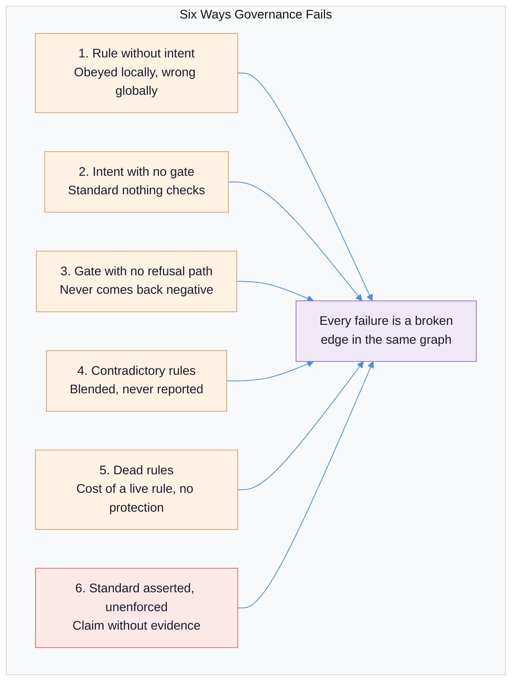
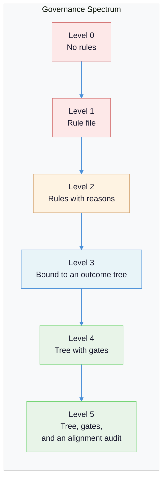

# Agent Governance and Intent Records: A Rule Holds No Intent of Its Own

**Thesis:** A rulebook for agents fails exactly as a rulebook for people fails — the rules multiply, contradict, and lose their reason — and the repair is not better rules but a layer above them: a tree of outcomes in which every rule hangs off the outcome it serves, every mechanically checkable rule carries a gate, and every gap is recorded rather than asserted.

**Prerequisites:** [Quality Gates in Agentic Systems](quality-gates-in-agentic-systems.md), [Human-in-the-Loop Patterns](human-in-the-loop-patterns.md)

**Reading time:** 13 minutes

---

## The Myth of the Better Rulebook

Most teams govern agents with a document: a policy, a system prompt, a list of things the agent must never do. It grows every time something goes wrong, and within months it is the longest and least trustworthy artifact in the repository.

This is not a discipline problem, it is structural. Rules render an intent. The rule is what gets copied into a new prompt, repository, or agent configuration, and the intent does not travel with it. What arrives is a sentence with no reason attached, obeyed locally and wrong globally.

The consequence keeps being rediscovered. In 2026 a federal court asked a sanctioned law firm to show the steps it had taken to verify the AI-generated citations in its filings. A general policy existed. Evidence that anyone followed it did not ([Corporate Compliance Insights, August 2026](https://www.corporatecomplianceinsights.com/policy-is-not-evidence-what-ai-governance-has-produce-on-demand); the Rule 11 order is public: [*Reaves Law Firm v. Baker Donelson*, W.D. Tenn.](https://www.govinfo.gov/content/pkg/USCOURTS-tnwd-2_25-cv-02623/pdf/USCOURTS-tnwd-2_25-cv-02623-0.pdf)). A policy is not evidence. Neither is a rule.

| What teams assume | What actually happens |
|---|---|
| A clear policy governs the agent | A policy is not evidence: the statement was produced, a record of compliance was not ([2026](https://www.govinfo.gov/content/pkg/USCOURTS-tnwd-2_25-cv-02623/pdf/USCOURTS-tnwd-2_25-cv-02623-0.pdf)) |
| More rules means more control | Prompt-level instructions shape the distribution over execution paths without evaluating any of them ([2026](https://arxiv.org/abs/2603.16586)) |
| Rules stay stable once written | Meaning-preserving formatting changes swing accuracy by up to 76 points on identical tasks ([Sclar et al., ICLR 2024](https://arxiv.org/abs/2310.11324)) |
| An agent will report a rule conflict | Models detect intra-policy collisions but often fail to report them, answering to satisfy neither ([AAAI 2026](https://ojs.aaai.org/index.php/AAAI/article/view/40356)) |
| Human approval is a control | The human caught and stopped a surfaced problem 9–26% of the time across every oversight strategy tested ([2026](https://dev.to/brennhill/automation-bias-why-people-rubber-stamp-ai-and-how-to-fix-it-2587)) |
| Uniform governance is safe governance | The same controls over-restrict simple agents and under-restrict autonomous ones; Gartner expects 40% of enterprises to demote or decommission autonomous agents by 2027 ([May 2026](https://www.gartner.com/en/newsroom/press-releases/2026-05-26-gartner-says-applying-uniform-governance-across-ai-agents-will-lead-to-enterprise-ai-agent-failure)) |
| A stated quality standard is a standard | A standard with no gate behind it is a tracked gap, and missing guardrails is a named top-10 agentic risk ([OWASP, 2026](https://genai.owasp.org/resource/owasp-top-10-for-agentic-applications-for-2026/)) |

---

## The Core Tension

Two facts pull in opposite directions.

Intent lives above rules, and rules are lossy. "Do not push to the main branch" renders *durable shared state must not change without review*. Copy the rule into a context where the reason has changed — a repository with no reviewers, a scratch prototype — and it is now wrong while remaining perfectly explicit. The rule drifted because its reason did not travel with it.

And the property that makes an agent useful — judgment in situations nobody enumerated — is the property no gate can check. You can gate an artifact's existence. You cannot gate whether it was the right artifact to produce.

The rule set has two halves:

- **Mechanically checkable rules** are gates. They bind at a checkpoint, cannot be disabled by the party they gate, and are satisfied only by an enforcement process that actually runs.
- **Judgment rules** are prose. They bind by shaping judgment through the governing context. They are short, because long prose is unread prose.

Both halves hang off the intent record — a tree of outcomes in which every rule sits under the outcome it serves, with the reason beside it rather than in the head of whoever wrote it.

The tension does not disappear: tree and gates both decay if nobody retires them. What the tree buys is that decay becomes *visible*. A rule with no parent is an orphan. A rule whose parent changed is a contradiction. A gate that never fires is dead machinery. All three are findable. Without the layer above the rules you have a document, and a document always reads as if it were working.

There is a second tension, on the human side. An agent's question is a control: it hands a decision to the only party who can bear responsibility for it. But a request carrying several decisions degrades all of them, because each answer is conditioned on the others. And a question whose answer is derivable from the recorded intent charges the human for work that was never theirs. Human attention is the scarce input, and every governance design either spends it deliberately or leaks it.

---

## Failure Taxonomy

Six ways governance fails. Each is a distinct mechanism, not a severity level.

### 1. The Rule Without Intent

A rule that is locally obeyed and globally wrong. The rule is explicit, the agent follows it, and the outcome is not what anyone wanted.

Rules are copied; intent is not. A rule extracted from its context loses the reason that made it correct there. The failure is silent: the rule reads as correct for exactly as long as the situation it was written for survives, then changes meaning without anyone editing it.

*Detection:* try to write the rule's reason down. If no reason exists, or it does not match what the rule enforces, the rule renders an unrecorded intent or should not exist.

### 2. Intent With No Gate

A quality standard everyone agrees with, stated in the documentation, that nothing checks. Output violating it passes every automated surface in the pipeline.

Stating a standard is cheap; enforcing it is expensive. A standard written into a document reads as satisfied, and a document cannot disagree with you. Regulators have converged on the distinction: the European Union's AI Act sets human-oversight obligations for high-risk systems, enforceable since 2 August 2026, and the standards family around it leaves the runtime control architecture — identity, delegated authority, tool boundaries, approval gates, intervention, event-level evidence — for the implementing organization to design ([framework comparison, 2026](https://kla.digital/blog/nist-ai-rmf-vs-eu-ai-act-vs-iso-42001)).

*Detection:* every standard names the gate that enforces it, or is recorded as a gap. A standard that does neither is an unenforced claim.

### 3. The Gate With No Refusal Path

A check that has never once come back negative. It runs, it prints green, and nobody has ever seen it refuse anything.

Producing well-formed output is an agent's default behavior; refusing is not. A check never exercised against a case it must reject is satisfied in form while measuring nothing, and the miss is invisible because what it produces looks exactly like success.

*Measured:* one practitioner's estate measured the receiving end. Refusals that arrived truncated — the agent reading the last few lines and retrying against the wrong diagnosis — consumed 114 gate invocations across 75 sessions, a cost paid by gates doing their job correctly (July 2026). The gate fired. The refusal path did not.

*Detection:* the gate ships with a fixture it must refuse. A pass file scanning clean proves nothing; a fail file yielding exactly the expected findings proves the gate can come back negative.

### 4. Contradictory Rules

Two rules that cannot both be satisfied. The agent does not stop and ask. It produces an answer that partially satisfies both, and the answer looks reasonable.

Language models have no conflict-resolution protocol. Fed two contradictory directives, the model applies a weighted blend, and the weight depends on things nobody controls consciously — token position and instruction density. Long-lived prompt policies accumulate these collisions as a matter of course, which is why intra-policy collision diagnosis is now a research area in its own right ([WIRE, 2026](https://arxiv.org/abs/2605.27784)). The failure is expensive, not just wrong: conflicting-instruction prompts raise per-output editing time roughly eightfold ([PromptEval, 2026](https://prompt-eval.com/en/blog/conflicting-instructions-in-ai-prompts)).

*Detection:* contradiction is a property of a *pair* of rules. It can only be found by comparing rules to each other, never by reading them one at a time.

### 5. Dead Rules Nobody Retires

A rule about a system that no longer exists. A gate guarding a renamed path. A clause about a provider you left two years ago. The rule costs what a live rule costs — attention, tokens, an entry in every review — and protects nothing.

Nobody who wrote it is present to say whether it is still needed, and re-deriving its purpose costs more than leaving it. So the cheap default is to keep everything forever, and the rule set grows monotonically.

*Detection:* anything retirable on its own — a rule, a gate, a skill, a dependency — states the problem it solves and names the thing whose disappearance would make it pointless. That second clause makes retirement cheap later.

### 6. The Standard Asserted but Unenforced

Documentation claiming a control that does not exist. "All agent output is reviewed by a human." "Secrets are never written to disk." The claim sits in the security page, the compliance binder, the onboarding doc.

This hides inside Failure Mode 2 and is worse, because the honest version of Mode 2 is recoverable and this one is not. The pressure runs the other way: write the standard as though it were enforced, or build a check that ticks without measuring anything. A false green is worse than no gate, because it is indistinguishable from success.

*Detection:* ask what evidence could be produced on demand tomorrow if someone demanded proof. If the answer is "the documentation," the standard is asserted, not enforced.



---

## The Governance Spectrum: Six Levels

These are not degrees of strictness. They are different *structures*, and each closes a failure mode the level beneath it cannot see. A stricter rule file is still a rule file.



**Level 0 — No rules.** The agent is governed by the task prompt and the model's training. Every rule is implicit, so no failure is diagnosable: there was no stated expectation to violate. Fine for a one-off script; unusable for anything that runs twice.

**Level 1 — A rule file.** A document of rules injected into the agent's context. Where most teams live. The ceiling is behavioral: prompt-level instructions shape the distribution over execution paths without evaluating any of them, so they make bad paths less likely and never impossible ([2026](https://arxiv.org/abs/2603.16586)). They are also fragile: a change that preserves a prompt's meaning can still move accuracy by tens of points ([Sclar et al., ICLR 2024](https://arxiv.org/abs/2310.11324)).

**Level 2 — Rules with stated reasons.** Every rule carries the reason it exists, written beside it. A rule with a reason can be evaluated for fitness in a new context, so drift becomes visible instead of silent. The reason must state intent, not restate the rule: "because durable shared state must not change without review" tells you what to do when the context changes, and when the rule is no longer needed.

**Level 3 — Rules bound to an outcome tree.** Each rule hangs off the outcome it serves; each outcome hangs off the outcome above it; the top is the human's value choice about what the work is for. Rules stop being peers and become leaves.

The load-bearing claim: **a rule holds no intent of its own.** It only renders an intent that lives above it. When the rule and the tree disagree, the tree wins and the rule is the defect. The direction of repair matters, because the alternative is silent overwriting of the record by whichever agent touched it last. Agents may rewrite rules; only the human may change the tree. A rule newer than the node above it is evidence that intent moved and the record has not caught up — not a repair to make silently, but a draft to put to the human.

**Level 4 — A tree with gates.** Every mechanically checkable rule gets an enforcement process, and the rule is satisfied only by that process running. Two properties are non-negotiable. A gate cannot be disabled by the party it gates. Its coverage derives from the work — what the change touches, how large it is, where it lands — never from a field its author fills in. Selection is the subtle half: an agent that cannot disable a check can still route around it by describing its work under the heading the check does not cover, and it never has to lie to do so.

Measured, from one practitioner's estate: rules carried by injection alone bound in the high 80s to low 90s across the estate's probe fixtures. The same probes showed a single fixture change swinging one case from 0% to 100%, so the number describes the fixture as much as the mode. That is the honest version of a rate.

**Level 5 — A tree, gates, and an alignment audit.** A deterministic gate runs on every change to the record and refuses structural violations: every rule has exactly one parent, everything reaches the root, every gated rule carries its mode, every cited assumption resolves. An audit then asks the question no structural check can: **does the rule text still render the intent above it?**

The audit must be a process, not a principle. In one estate it produced three findings in August 2026 — three standards with no enforcement and no text reaching a session — and each was resolved by minting the constraint it proved was missing. The same estate keeps a finding ledger: one entry per detected mismatch between the rule surface and recorded intent, written by every detector into one schema and resolved one at a time. Detection and resolution stay in separate processes, so a detector cannot repair and a resolver cannot re-sweep.

Level 5 is also where you can count what you have: orphan rules, contradictions, unattached gates, gates that have never refused. Imperfect, gameable, and far better than nothing.

---

## Design Principles

### Principle 1: Hang Every Rule Off the Outcome It Serves

A rule with no parent is an orphan, and an orphan cannot be evaluated. The mechanical form is cheap: give every rule a parent reference and refuse a commit that adds one without it.

```python
# Every rule names the outcome it renders. Orphans are refused, not reviewed.
RULES = {
    "no-push-to-main": {"parent": "durable-shared-state", "mode": "gate"},
    "state-the-reason": {"parent": "intent-travels-with-the-rule", "mode": "prose"},
}

def check_parents(rules, outcomes):
    orphans = [name for name, rule in rules.items() if rule["parent"] not in outcomes]
    assert not orphans, f"rules with no outcome above them: {orphans}"
    return True
```

The payoff is not tidiness: when the tree changes, the rules rendering it become *computable* rather than debatable. A rule whose parent was rewritten is a realignment candidate; one whose parent was deleted is dead by definition.

### Principle 2: Write the Reason and the Retirement Condition Beside the Rule

The reason makes the rule evaluable in a new context. The retirement condition makes it removable later, when nobody who wrote it is present. A rule that names the thing whose disappearance would make it pointless has made the check cheap, not performed it.

Every standing loop, gate, or rule therefore carries a kill criterion from the day it is created, and a loop that never fires is cut.

### Principle 3: Split the Rule Set and Never Blur the Halves

Mechanically checkable rules are gates. Judgment rules are prose. The split is the whole design, and blurring it is the most common way governance systems become fiction.

| Property | Gate rules | Prose rules |
|---|---|---|
| Where they bind | A checkpoint, before or at the act | Wherever judgment is exercised |
| How they are satisfied | An enforcement process runs | The intent reaches the session's context |
| Failure mode | Fires and is ignored, or never fires | Is not read, or read differently each time |
| Honest presentation | "This is enforced by X" | "A judgment rule; no gate can check it" |
| Test | Exercise it against a case it must refuse | Can an agent restate its intent in its own words |

Missing or weak guardrails is a named top-10 agentic risk precisely because the absence of enforcement is invisible ([OWASP, 2026](https://genai.owasp.org/resource/owasp-top-10-for-agentic-applications-for-2026/)).

### Principle 4: Externalize Verification — the Agent's Assessment Is Not Evidence

An agent grading its own work fails exactly when it matters most, because the failure mode is not incompetence but plausibility: at the token level, describing an action and performing it are indistinguishable. The evidence is a runnable check, and the gate consumes tool output rather than the agent's summary of it.

```python
# BAD: the claim is the evidence
receipt = {"status": "verified", "notes": "all checks pass, reviewed by hand"}

# GOOD: the artifact is the evidence; the claim cannot substitute for it
receipt = json.loads(read_file("verification.json"))
assert receipt["exit_code"] == 0
assert receipt["cases_refused"] > 0, "gate has never come back negative"
assert receipt["commit"] in landed_commits("main")
```

The same discipline applies to the check's contents. A mocked check verifies the author's model of a dependency rather than the dependency. Use real data and real services. Permit a mock only where the real thing is destructive when exercised, is someone else's paid or rate-limited service, or is nondeterminism the check exists to handle. Keep that list closed: an open standard like "mock when the real thing cannot be reached" hands the trigger to the party being verified.

### Principle 5: A Gate That Cannot Come Back Negative Is Not a Gate

Ship every gate with fixtures it must refuse, and assert them on every run. The pass fixture proves the gate tolerates valid input; only the fail fixture proves it can do its job.

```python
def self_test(gate, pass_file, fail_file, expected_findings):
    assert gate.scan(pass_file) == [], "gate refuses valid input"
    found = gate.scan(fail_file)
    assert len(found) == expected_findings, f"expected {expected_findings}, got {len(found)}"
```

Refuse what must be refused *separately* from producing what must be produced, and report the refusal result on its own. A refusal case asked among requests for output is answered in the register of its neighbors, and one aggregate score hides the only result that carried information. Then give every gate a kill criterion: if its refusals over a stated period are all ones the human overrules as false positives, cut it. Dead machinery is retired, not debugged.

### Principle 6: One Decision per Exchange, and Never Ask What Is Already Recorded

A request carrying several decisions degrades all of them, because the person answering cannot hold five open questions and answer any one cleanly. The governance form is a three-way triage applied before any question reaches a human.

```python
def route(finding, intent_tree):
    if intent_tree.decides(finding):          # derivable from recorded intent
        return "act"                          # execute, log the reasoning, do not ask
    if cheaply_measurable(finding):           # a means-choice, not an end
        return "probe"                        # run the experiment; rule frozen first
    return "ask"                              # a genuine end: the human's call
```

Two clauses carry the weight. A question whose answer is derivable from recorded intent must never be asked: it spends the scarcest resource on work already decided and teaches the human that questions are noise. And a choice between two ways of doing something, where nothing on record decides and cheap measurement could settle it, is not a question. It is an unrun experiment, and it gets run, with the decision rule written down *before* the data lands.

The human side is where governance quietly dies. Approval fatigue is documented ([June 2026](https://tianpan.co/blog/2026-06-25-approval-fatigue-how-human-in-the-loop-gates-decay-into-rubber-stamps)): when requests arrive faster than a person can read them, oversight collapses into rubber-stamping, and a process that fires constantly is indistinguishable from no oversight. The EU AI Act's Article 14 requires deployers to keep operators aware of the tendency to over-rely on AI output ([Galileo, 2026](https://galileo.ai/blog/human-in-the-loop-agent-oversight)). Designing against rubber-stamping is now a legal obligation, not a courtesy.

### Principle 7: State the Decision-Rights Boundary So an Agent Can Tell Without Asking

An agent that cannot tell whether a decision is its own will either ask too much or overreach, and the second is dangerous. The boundary is statable in one rule: **security and autonomy trade at the trust boundary — loss-avoidance at the edge, throughput inside it.**

| Class | Examples | Who decides |
|---|---|---|
| Crossing the trust boundary | Anything leaving the perimeter: public releases, production changes, outside content, other people's money or property | Human, per instance |
| Irreversible inside the perimeter | Destructive operations, history rewriting, credential rotation | Human, unless made recoverable by construction |
| Recoverable inside the perimeter | Local work, drafts, reversible edits, archived-before-delete cleanup | Agent, autonomously |
| Derivable from recorded intent | Responses the record already determines | Agent, autonomously, with an audit trail |

A good boundary statement lets an agent classify a novel action without asking and be right most of the time, with the misclassifications landing on the recoverable side.

### Principle 8: Permissions Belong to Actor Classes, Never Shared

A mechanical job and a reasoning agent are different trust classes and must never share credentials or permission sets. This is the principle most often violated by convenience: a script and an interactive agent need the same service, so they get the same token.

The consequences are asymmetric in the wrong direction. A deterministic job has a bounded, enumerable action set — it does exactly what its code says, and its risk is a bug. A reasoning agent has an unbounded action set within its permissions, and its risk is a judgment error in a novel situation. Granting them the same reach means the reasoning agent's blast radius is set by the mechanical job's convenience. Identity and privilege abuse — an agent operating with more permissions than its task requires — is a named top-10 agentic risk for exactly this reason ([OWASP, 2026](https://genai.owasp.org/resource/owasp-top-10-for-agentic-applications-for-2026/)).

The practical form: one inventory of agent-facing credentials with scope and rotation expectation, updated in the same act that mints or retires a credential, and a rule that no session carries a standing grant of reach its work does not need. Rotation is event-driven — on incident, on holder change, on suspected exposure — never calendar ceremony.

### Principle 9: Record the Gap; Never Assert the Standard

When a standard has no gate, write the gap down: name the standard, name the absence of enforcement, keep the entry open. This converts an invisible lie into visible debt.

```python
# A standard is either enforced or it is a tracked gap. There is no third state.
def check_standards(standards):
    unenforced = []
    for s in standards:
        if s.gate is None:
            assert s.gap_entry is not None, f"'{s.name}' is asserted without enforcement"
            unenforced.append(s.name)
    return unenforced   # printed on every run; never silently empty
```

Two things make it work. The gap must be *published* — printed on every run, not stored where nobody looks — because a gap recorded but invisible is the same as an asserted standard. And a gate that did not fire must never print green: "the gate did not run" and "the gate passed" are different results, and conflating them is how a system with no enforcement acquires a compliance history.

---

## Evaluation: Real-World Systems

| System or framework | What it governs | Where it sits | The gap it leaves |
|---|---|---|---|
| [OWASP Top 10 for Agentic Applications 2026](https://genai.owasp.org/resource/owasp-top-10-for-agentic-applications-for-2026/) | Risk taxonomy: hijacking, tool misuse, privilege abuse, missing guardrails | Level 2 | A taxonomy is not enforcement; ASI04 exists because guardrails are absent rather than weak |
| [Gartner AI agent autonomy levels, May 2026](https://www.gartner.com/en/newsroom/press-releases/2026-05-26-gartner-says-applying-uniform-governance-across-ai-agents-will-lead-to-enterprise-ai-agent-failure) | Governance proportional to four autonomy levels | Level 3 | Nothing checks that an agent's reach matches its assigned level |
| [Policy-as-code governance platforms](https://validmind.com/blog/ai-governance-tools-for-autonomous-agents) | Versioned, testable, machine-evaluable policies with audit evidence | Level 4 | If the policy renders a stale intent, the platform enforces it perfectly |
| [Runtime policy enforcement control planes](https://www.sweet.security/agent-security/ai-agent-policy-enforcement) | Per-action allow / block / modify / escalate decisions | Level 4 | Path-dependent violations: two permitted steps can compose into one no per-step rule catches |
| [Runtime Governance for AI Agents (reference framework)](https://arxiv.org/abs/2603.16586) | Compliance policies as deterministic functions over execution paths | Level 4–5 | Needs risk calibration; enforced compliance has known limits |
| [OpenAI Codex enterprise controls](https://openai.com/index/gartner-2026-agentic-coding-leader) | Approval gates, role-based access, policies, sandboxing | Level 4 | Approval gates inherit approval fatigue; the control is as good as the reviewer's attention |
| [Framework-level agent guardrails](https://dev.to/aws/ai-agent-guardrails-rules-that-llms-cannot-bypass-596d) | Interception before execution: a cancellation the model cannot override | Level 5 | Catches only what the interception rules define; the rules above still need an intent record |

The market has largely solved Level 4. What is not solved, and not being sold, is the layer above it: knowing whether the rules being enforced are still the rules anyone wants.

---

## Field Notes from an Operating Estate

Observations from a practitioner operating an estate of a dozen agent harnesses over three months. Abstracted; no system names, no paths.

**August 2026 — the gap that was written down.** At the apex of the intent tree the quality standard was stated, and then in the note beside it so was the failure: four of the constraints under that standard had neither a gate nor any text reaching a session. The note stayed open for weeks rather than being quietly closed, and became the most useful line in the record, because it told every later session which parts of the standard were aspiration.

**July 2026 — the unit of comparison is the constraint, not the rule.** A rule bullet carried two distinct constraints. One was covered by a node in the intent tree; the other by nothing. The alignment check scored the bullet green, because the bullet *had* a parent — and half of what it required was unrecorded. The repair was to change the unit of comparison: pair at the level of the constraint, not the sentence, because one rule routinely renders two intents and the second is where drift hides.

**August 2026 — the rule about a thing that did not exist.** A standing rule instructed every agent to ignore a particular directory that existed in no form: not a directory, not a broken symlink. Asking the retirement question — what would have to disappear for this rule to be pointless? — produced the answer that the thing had already disappeared. Two hours of sweeping found it; without the sweep it would have been inherited by every future session.

---

## Recommendations

### Short-Term: This Week

1. **Add a parent to every rule.** One line per rule naming the outcome it serves. A rule that cannot name a parent is rendering an unrecorded intent, or is dead.

2. **List every standard and mark whether a gate enforces it.** For each: the gate's name, or "gap." Publish the gap list where it will be seen.

3. **Exercise every gate against a case it must refuse.** If you cannot produce a failing input the gate rejects, it has never been tested. Add the fixture and print the refusal count.

### Medium-Term: This Quarter

4. **Split the rule set into gates and prose, and rewrite the prose short.** Keep the judgment rules, state them plainly, and mark them as judgment rules.

5. **Write the decision-rights table and put it where the agent reads it.** Classify actions by trust boundary and reversibility, name who decides each class, then measure misclassifications for a month; the ones landing on the irreversible side are the statement's bugs.

6. **Separate permissions by actor class.** One credential inventory, scoped grants, event-driven rotation. A mechanical job and a reasoning agent never share a token.

7. **Add a retirement sweep.** Monthly: for each rule, gate, skill, and dependency, ask what would make it pointless and whether that has already happened. Delete what has.

### Long-Term: This Half-Year

8. **Build the alignment audit.** A deterministic structural check on every change to the record — unique parents, reachability to the root, mode present on gated rules, citations resolving — plus a periodic audit of whether the rule text still renders the intent above it. Keep detection and resolution in separate processes.

9. **Instrument the audit's findings as a metric.** Count orphan rules, contradictions, unattached gates, gates that never refuse, open gaps. Trend it: numbers that only go up mean nothing is being retired.

10. **Make one decision per exchange a design rule, not a courtesy.** Route every question through the three-way triage before it reaches a human. Spending human attention on derivable answers looks like diligence and is the most expensive mistake in agent-mediated work.

---

## The Hard Truth

You will not be able to enforce most of what you believe about quality, and the honest response is to say so in writing.

Runtime enforcement for agents is now a mature product category, and it works. None of it addresses the question above the rules — whether the rules still render the intent that put them there. That question has no product, because the answer is not technical. It is a judgment about what the work is for, and the only mechanism that carries a judgment across time is a record a human owns.

The gap between stated standards and enforced standards is the actual governance metric, and most organizations do not measure it because measuring it produces a list nobody wants. The alternative is not a better list. It is a shorter one, honestly kept: every rule with a parent, every mechanically checkable rule with a gate, every gate with a fixture it refuses, every gap recorded rather than asserted, and every rule that has outlived its reason deleted.

The one thing to remember: **a rule holds no intent of its own. When the rule and the record disagree, the record wins and the rule is the defect.**

---

## Summary Checklist

| Question | Good answer | Bad answer |
|---|---|---|
| Does every rule name the outcome it serves? | Yes — a parent in the intent record | No — rules are peers in a document |
| When rule and record disagree, which wins? | The record; the rule is realigned or drafted for review | Whoever edited last; the record is overwritten silently |
| Is each rule marked as gate or as judgment? | Yes — the halves are never blurred | No — judgment rules presented as enforcement |
| What is the evidence a standard holds? | A runnable check's output, on demand | The documentation, or the agent's own summary |
| Has every gate ever refused anything? | Yes — a must-reject fixture is asserted on every run | No — or nobody knows |
| Does a gate that did not fire print green? | No — "did not run" and "passed" are different results | Yes — absence is indistinguishable from success |
| Can the gated party disable or select around a gate? | No — coverage derives from the work, not the author's field | Yes — or coverage depends on the agent's own description |
| Are permissions shared across actor classes? | No — separate grants per actor class | Yes — convenience over blast radius |
| How many decisions does one request carry? | One — derivable answers are never asked at all | Several at once, plus riders |
| What happens to a standard with no gate? | Recorded as a gap, published on every run | Written as though it were enforced |
| How does a rule get retired? | It states its retirement condition; a sweep looks for it | It doesn't — the rule set only grows |

A system answering "bad answer" on four or more of these has a rulebook, not governance.

---

## References

### Research Papers

- [Sclar et al., ICLR 2024, on prompt-format sensitivity](https://arxiv.org/abs/2310.11324) — Formatting changes swing accuracy by up to 76 points.
- [Zhu et al., "PromptBench," JMLR 2024](https://arxiv.org/abs/2306.04528) — Prompt perturbations degrade accuracy by up to 33%.
- [Yan et al., "WIRE," 2026, on within-policy instruction collisions](https://arxiv.org/abs/2605.27784) — Conflicting rule pairs inside long-lived prompt policies.
- [ConInstruct, AAAI 2026, on conflict detection in instructions](https://ojs.aaai.org/index.php/AAAI/article/view/40356) — Conflicts detected but often not reported.
- ["Runtime Governance for AI Agents: Policies on Paths," 2026](https://arxiv.org/abs/2603.16586) — Compliance policies as functions over execution paths.

### Regulatory and Standards Material

- [Reaves Law Firm v. Baker Donelson, Rule 11 sanctions order, W.D. Tenn. 2026](https://www.govinfo.gov/content/pkg/USCOURTS-tnwd-2_25-cv-02623/pdf/USCOURTS-tnwd-2_25-cv-02623-0.pdf) — Verification steps ordered; no record produced.
- [Corporate Compliance Insights, "A Policy Is Not Evidence," August 2026](https://www.corporatecomplianceinsights.com/policy-is-not-evidence-what-ai-governance-has-produce-on-demand) — Proving oversight on demand.
- [NIST AI RMF vs EU AI Act vs ISO/IEC 42001, 2026](https://kla.digital/blog/nist-ai-rmf-vs-eu-ai-act-vs-iso-42001) — The execution layer is left to the implementer.
- [Galileo, on human-in-the-loop oversight for agents, 2026](https://galileo.ai/blog/human-in-the-loop-agent-oversight) — EU AI Act Article 14, enforceable from 2 August 2026.

### Practitioner and Industry Sources

- [Gartner, on uniform governance across AI agents, May 2026](https://www.gartner.com/en/newsroom/press-releases/2026-05-26-gartner-says-applying-uniform-governance-across-ai-agents-will-lead-to-enterprise-ai-agent-failure) — Four autonomy levels as distinct trust boundaries.
- [OWASP Top 10 for Agentic Applications 2026](https://genai.owasp.org/resource/owasp-top-10-for-agentic-applications-for-2026/) — Privilege abuse (ASI03); missing guardrails (ASI04).
- [Validmind, on policy-as-code for autonomous agents, May 2026](https://validmind.com/blog/ai-governance-tools-for-autonomous-agents) — Versioned, testable rules with audit evidence.
- [Sweet Security, on AI agent policy enforcement, August 2026](https://www.sweet.security/agent-security/ai-agent-policy-enforcement) — Allow, block, modify, escalate at the point of action.
- [Zylos Research, on agent governance and compliance, May 2026](https://zylos.ai/research/2026-05-01-ai-agent-governance-compliance-2026) — The four questions an audit trail must answer.
- [Tian Pan, "Approval Fatigue," June 2026](https://tianpan.co/blog/2026-06-25-approval-fatigue-how-human-in-the-loop-gates-decay-into-rubber-stamps) — Bad machine advice accepted at 6–11%; uniform gating manufactures inattention.
- [Brenn Hill, "Automation Bias," 2026](https://dev.to/brennhill/automation-bias-why-people-rubber-stamp-ai-and-how-to-fix-it-2587) — Intervention success at 9–26% across every strategy tested.
- [PromptEval, on conflicting instructions in prompts, 2026](https://prompt-eval.com/en/blog/conflicting-instructions-in-ai-prompts) — Editing time climbs roughly eightfold.
- [Data Science Dojo, "Prompt drift," 2026](https://datasciencedojo.com/blog/prompt-drift-ai-agents) — Drift as silent ambiguity; version control is insufficient.
- [AWS, "AI Agent Guardrails: Rules That LLMs Cannot Bypass"](https://dev.to/aws/ai-agent-guardrails-rules-that-llms-cannot-bypass-596d) — Soft versus hard constraints; framework interception.
- [OpenAI, on enterprise coding agent controls, May 2026](https://openai.com/index/gartner-2026-agentic-coding-leader) — Approval gates, RBAC, customizable policies, sandboxing.

### Cross-References in This Suite

- [Quality Gates in Agentic Systems](quality-gates-in-agentic-systems.md) — Gate failure modes; the reliability spectrum.
- [Human-in-the-Loop Patterns](human-in-the-loop-patterns.md) — Levels of involvement; escalation triggers.
- [Security and Safety in LLM Applications](security-and-safety.md) — Threat model and defense hierarchy.
- [Observability and Monitoring](observability-and-monitoring.md) — What to log for the audit trail.
- [Evaluation-Driven Development](evaluation-driven-development.md) — Measurement infrastructure for runnable checks.

---

*Last reviewed: September 2026. Changed in this revision: new document — the layer above the rules: an outcome tree binding every rule to the intent it renders, gates for the mechanically checkable rules, prose for the judgment rules, and every unenforced standard recorded as a tracked gap rather than asserted. A compliance band attributed to an unnamed report was removed from the governance spectrum, leaving only the estate's own measurement.*
