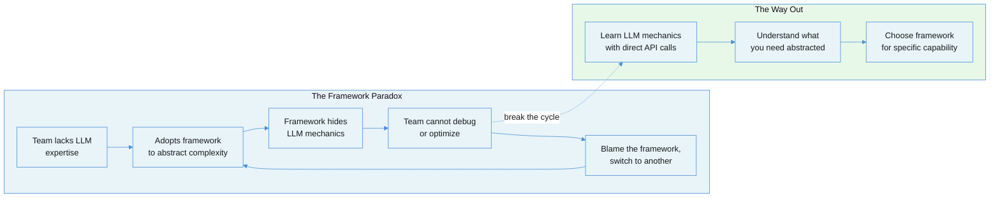
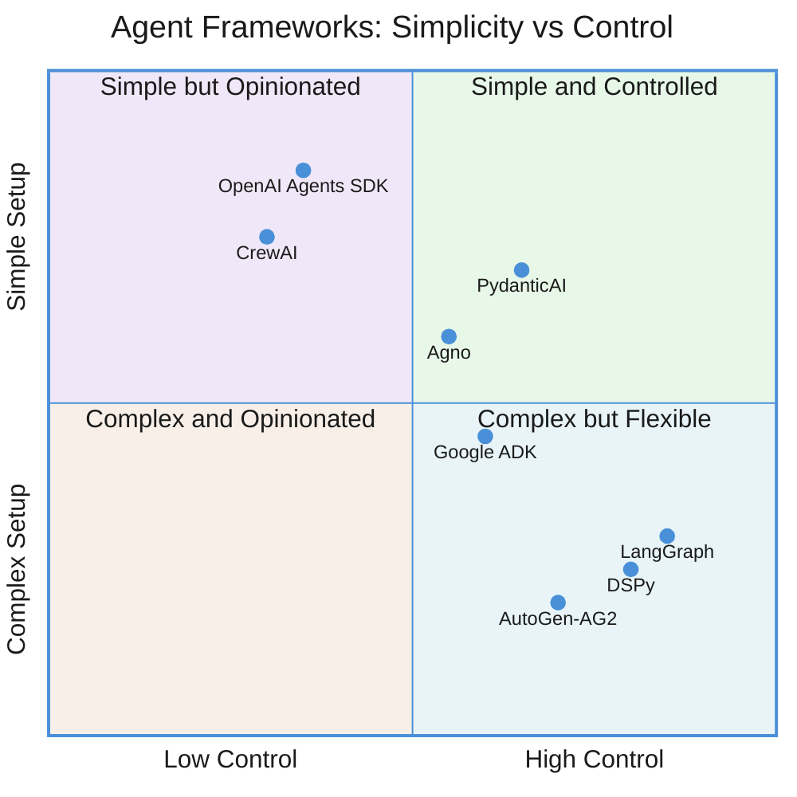
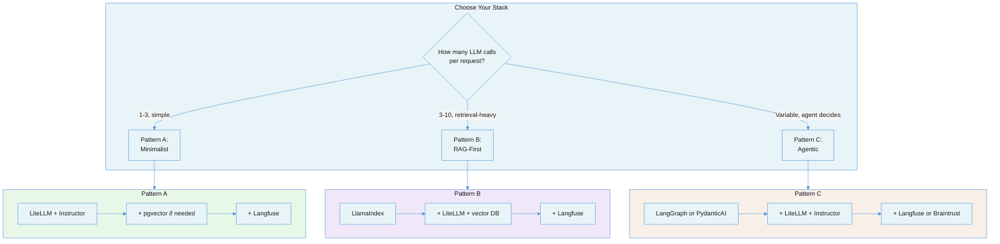

# The AI-Native Framework Landscape: What Exists, What It Does, and When You Actually Need It

Every team building an AI-native application faces the same question within the first week: should we use a framework, and if so, which one? The answer matters less than most teams think -- but getting it wrong costs months. This document maps the complete landscape of production-grade third-party frameworks available in 2026, organized by the problem each solves, so you can make that decision with open eyes.

> **Companion document:** [AI-Native Solution Patterns](ai-native-solution-patterns.md) covers the architectural patterns (single call, pipeline, router, orchestrator, agent) that determine *how* you wire LLM capabilities together. This document covers the *tools* available for that wiring.

---

## 1. The Core Tension

The AI framework ecosystem suffers from a contradiction: **the teams that most need frameworks are the least equipped to evaluate them, and the teams most equipped to evaluate them rarely need frameworks at all.**

A senior engineer who deeply understands prompt engineering, API mechanics, and distributed systems can build a production LLM application with nothing more than an HTTP client and a Pydantic model. A team new to LLMs reaches for a framework to paper over gaps in understanding -- but frameworks hide the very mechanics they need to learn.

This creates a predictable failure pattern: teams adopt a framework for its abstractions, then spend more time fighting those abstractions than they would have spent building from scratch.



The landscape itself reflects this tension. There are now **30+ frameworks** competing for attention, each emphasizing a different slice of the AI application stack. The table below maps the primary categories:

| Layer | What It Solves | Complexity Without It | Example Frameworks |
|---|---|---|---|
| **LLM Orchestration** | Chaining calls, RAG pipelines, tool routing | Medium -- manageable with direct API calls for simple apps | LangChain/LangGraph, LlamaIndex, Semantic Kernel |
| **Agent Frameworks** | Autonomous multi-step reasoning, multi-agent coordination | High -- state management, tool dispatch, and failure recovery are non-trivial | CrewAI, OpenAI Agents SDK, PydanticAI, Google ADK, DSPy, Agno |
| **LLM Gateway** | Multi-provider routing, cost tracking, rate limiting | Low-medium -- a thin proxy layer, but tedious to build per-provider | LiteLLM, Portkey |
| **Structured Output** | Reliable schema-conforming responses from LLMs | Medium -- provider-native tools exist but vary in quality | Instructor, Outlines |
| **Evaluation** | Measuring output quality, detecting drift, experiment tracking | High -- most teams skip this entirely and regret it | Langfuse, Braintrust, Arize Phoenix |
| **Vector Storage** | Embedding search for RAG and semantic retrieval | Medium -- pgvector handles most cases; dedicated DBs matter at scale | Pinecone, Qdrant, Weaviate, Chroma, pgvector |
| **Inference/Serving** | Running models efficiently on GPUs | Very high -- CUDA optimization, batching, and memory management are specialized | vLLM, Ollama, Together AI, Fireworks AI |

---

## 2. Failure Taxonomy

Teams fail with AI frameworks in predictable ways. Understanding these failure modes is essential before evaluating any tool.

### Failure 1: Framework-First Thinking

The team picks a framework before understanding the problem. They select LangChain because it has the most GitHub stars, then discover they need 5% of its surface area and are fighting the other 95%. The framework's abstractions shape the architecture rather than the problem shaping the architecture.

**Root cause:** Social proof substituting for technical analysis. Framework adoption is treated as a technology decision when it is actually an architecture decision.

### Failure 2: Abstraction Debt

The framework handles the happy path beautifully. The demo works in 30 minutes. Then production requirements arrive: custom retry logic, streaming with backpressure, provider-specific parameters (logprobs, seed, stop sequences). Each requirement means diving into framework internals, monkey-patching, or abandoning the abstraction entirely. As one practitioner on [Hacker News](https://news.ycombinator.com/item?id=40739982) put it: "We spent more time fighting LangChain than we would have spent building from scratch."

**Root cause:** Frameworks optimize for time-to-demo, not time-to-production. The cost of understanding someone else's abstraction eventually exceeds the cost of building your own.

### Failure 3: Version Churn Whiplash

The AI framework ecosystem moves faster than any previous software category. LangGraph shipped three breaking major versions (v0.1 through v0.3) within 18 months. Teams report "spending more time on migrations than feature work." Semantic Kernel's pre-1.0 era required constant rebuilds. Google ADK is already on a v2.0 alpha less than a year after launch.

**Root cause:** The problem space is evolving faster than any single framework can stabilize. Model capabilities change quarterly; frameworks chase those capabilities and break APIs in the process.

### Failure 4: Vendor Lock-in by Default

OpenAI Agents SDK only works with OpenAI models. Semantic Kernel is most capable on Azure. Google ADK is optimized for Gemini and Vertex AI. Teams adopt these frameworks for convenience, then discover they cannot switch providers when pricing changes, rate limits hit, or a competitor releases a better model.

**Root cause:** Framework creators are often model providers. Their frameworks serve as distribution channels, not neutral tools.

### Failure 5: Evaluation Neglect

Teams invest weeks choosing between orchestration frameworks and zero time on evaluation infrastructure. The result: they cannot measure whether their system actually works. Every change is a leap of faith. This is the most consequential failure because it makes all other decisions unverifiable.

**Root cause:** Orchestration is visible (code, architecture diagrams, demos). Evaluation is invisible (metrics, traces, regressions). Teams optimize for what they can show in a sprint review.

### Failure 6: The "One Framework" Trap

Teams assume a single framework should handle everything: orchestration, RAG, agents, eval, and serving. No framework does all of these well. LangChain's RAG is adequate but inferior to LlamaIndex's purpose-built retrieval. LlamaIndex's agent orchestration is functional but inferior to LangGraph's graph-based state management. Choosing one framework for everything means choosing mediocrity across the board.

**Root cause:** Organizational desire for simplicity. One framework means one learning curve, one dependency, one vendor relationship. But AI applications are inherently multi-concern systems.

---

## 3. The AI Application Stack

Rather than comparing frameworks head-to-head, it is more useful to understand the **layers** of an AI-native application and which tools are best-in-class at each layer. Most production systems compose tools from multiple layers.

```mermaid
%%{init: {'theme': 'base', 'themeVariables': {'primaryColor': '#e8f4f8', 'primaryTextColor': '#1a1a1a', 'primaryBorderColor': '#4a90d9', 'lineColor': '#4a90d9', 'secondaryColor': '#f0e8f8', 'tertiaryColor': '#e8f8e8', 'edgeLabelBackground': '#f5f5f5'}}}%%
graph TD
    subgraph L7["Layer 7: Evaluation and Observability"]
        style L7 fill:#f0e8f8,stroke:#4a90d9
        Langfuse["Langfuse<br/><i>23.6K stars</i>"]
        Braintrust["Braintrust<br/><i>$800M valuation</i>"]
        Phoenix["Arize Phoenix<br/><i>9K stars</i>"]
    end
    subgraph L6["Layer 6: Agent Orchestration"]
        style L6 fill:#e8f4f8,stroke:#4a90d9
        CrewAI["CrewAI<br/><i>45.9K stars</i>"]
        OAISDK["OpenAI Agents SDK<br/><i>20.1K stars</i>"]
        PydanticAI["PydanticAI<br/><i>15.7K stars</i>"]
        ADK["Google ADK<br/><i>18.5K stars</i>"]
        DSPy["DSPy<br/><i>32.9K stars</i>"]
        Agno["Agno<br/><i>38.9K stars</i>"]
    end
    subgraph L5["Layer 5: LLM Orchestration"]
        style L5 fill:#e8f4f8,stroke:#4a90d9
        LangGraph["LangGraph<br/><i>~80K stars ecosystem</i>"]
        LlamaIndex["LlamaIndex<br/><i>40K stars</i>"]
        SK["Semantic Kernel<br/><i>27.5K stars</i>"]
    end
    subgraph L4["Layer 4: Structured Output"]
        style L4 fill:#e8f8e8,stroke:#4a90d9
        Instructor["Instructor<br/><i>12.6K stars</i>"]
        Outlines["Outlines<br/><i>13.6K stars</i>"]
    end
    subgraph L3["Layer 3: LLM Gateway"]
        style L3 fill:#e8f8e8,stroke:#4a90d9
        LiteLLM["LiteLLM<br/><i>40K stars</i>"]
        Portkey["Portkey<br/><i>11K stars</i>"]
    end
    subgraph L2["Layer 2: Vector Storage"]
        style L2 fill:#f8f0e8,stroke:#4a90d9
        Pinecone["Pinecone<br/><i>managed SaaS</i>"]
        Qdrant["Qdrant<br/><i>29.8K stars</i>"]
        Weaviate["Weaviate<br/><i>15.9K stars</i>"]
        pgvector["pgvector<br/><i>20.4K stars</i>"]
        Chroma["Chroma<br/><i>26.8K stars</i>"]
    end
    subgraph L1["Layer 1: Inference and Serving"]
        style L1 fill:#f8f0e8,stroke:#4a90d9
        vLLM["vLLM<br/><i>74K stars</i>"]
        Ollama["Ollama<br/><i>166K stars</i>"]
        Together["Together AI<br/><i>$3.3B valuation</i>"]
        Fireworks["Fireworks AI<br/><i>$4B valuation</i>"]
    end

    L7 --> L6
    L6 --> L5
    L5 --> L4
    L4 --> L3
    L3 --> L2
    L2 --> L1
```



### Layer 1: Inference and Serving

These tools run LLMs on hardware. You only need this layer if you self-host models or need specialized inference optimization.

| Tool | What It Does | Stars/Signal | When to Use |
|---|---|---|---|
| **[vLLM](https://github.com/vllm-project/vllm)** | High-throughput LLM serving with PagedAttention for efficient KV-cache management. Supports distributed inference across NVIDIA, AMD, Intel, and TPU. Now part of the PyTorch ecosystem. | 74K stars | Self-hosted production GPU inference at scale. The de facto standard. |
| **[Ollama](https://github.com/ollama/ollama)** | Makes local LLM running trivial: `ollama pull model && ollama run model`. Wraps llama.cpp in a clean CLI and API. 52M monthly downloads in Q1 2026. | 166K stars | Developer-local inference, privacy-sensitive workloads, offline-capable workflows, prototyping without API costs. |
| **[Together AI](https://www.together.ai/)** | Cloud inference with 200+ models, large-scale GPU clusters, LoRA and full fine-tuning support. ~$1B annualized revenue. | $3.3B valuation | Broad model selection with fine-tuning flexibility. Managed infrastructure for teams without GPU expertise. |
| **[Fireworks AI](https://fireworks.ai/)** | Ultra-fast inference (13T+ tokens/day, ~180K RPS) with custom FireAttention CUDA kernels. Founded by the PyTorch team. $280M ARR. | $4B valuation | Latency-critical production inference. Multi-LoRA serving for fine-tuned model variants. |

**When to skip this layer:** If you exclusively use API providers (OpenAI, Anthropic, Google) and have no plans to self-host or fine-tune models.

### Layer 2: Vector Storage

Embedding-based search infrastructure for RAG, semantic retrieval, and similarity matching.

| Tool | Stars | Differentiator | Best For |
|---|---|---|---|
| **[pgvector](https://github.com/pgvector/pgvector)** | 20.4K | Runs inside existing PostgreSQL. HNSW + IVFFlat indexes. 471 QPS at 50M vectors with pgvectorscale. | Teams with existing Postgres who want to avoid a second data store. Handles most use cases under 50M vectors. |
| **[Qdrant](https://github.com/qdrant/qdrant)** | 29.8K | Written in Rust. Best free tier (1GB free, no credit card). Strong JSON metadata filtering. Apache 2.0. | Budget-conscious projects and self-hosted deployments. |
| **[Chroma](https://github.com/chroma-core/chroma)** | 26.8K | Embedded mode with zero-config, zero network latency. NumPy-like API. 11M monthly downloads. | Rapid prototyping and development. Projects under 10M vectors. |
| **[Weaviate](https://github.com/weaviate/weaviate)** | 15.9K | Native hybrid search (vector + keyword + metadata in a single query). Written in Go. BSD-3. | RAG applications requiring hybrid search strategies. |
| **[Pinecone](https://www.pinecone.io/)** | SaaS | Fully managed serverless, 7ms p99, scales to billions of vectors automatically. Zero ops. | Enterprise teams wanting zero infrastructure management at any scale. |

**Decision shortcut:** Start with **pgvector** if you already use PostgreSQL. Switch to a dedicated vector DB only when you hit performance limits (typically 50M+ vectors) or need features like hybrid search (Weaviate) or advanced metadata filtering (Qdrant).

### Layer 3: LLM Gateway

Proxy layers that abstract provider differences, add cost tracking, and handle routing, retries, and fallbacks.

| Tool | Stars | What It Does | When to Use |
|---|---|---|---|
| **[LiteLLM](https://github.com/BerriAI/litellm)** | 40K | Unified OpenAI-compatible interface to 100+ LLM providers. Python SDK and proxy server. Cost tracking, load balancing, guardrails. Used by Stripe, Netflix, OpenAI Agents SDK. 8ms P95 at 1K RPS. | Drop-in multi-provider routing. The industry standard for provider abstraction. |
| **[Portkey](https://github.com/Portkey-AI/gateway)** | 11K | AI gateway with sub-1ms latency, 122KB footprint. 250+ LLMs, 50+ built-in guardrails, semantic caching, 10B+ tokens/day. Gartner Cool Vendor 2025. | Enterprise gateway where security guardrails and governance are first-class requirements. |

**Known limitation (LiteLLM):** Python GIL bottleneck under very high concurrency; logging layer degrades past 1M logs; enterprise features (SSO, RBAC, team budgets) require paid license.

### Layer 4: Structured Output

Tools that guarantee LLM responses conform to a defined schema.

| Tool | Stars | Approach | When to Use |
|---|---|---|---|
| **[Instructor](https://github.com/567-labs/instructor)** | 12.6K | Application-layer validation: defines Pydantic models as response schemas, retries with error feedback on validation failure. Works with any API-based LLM. Multi-language (Python, TS, Go, Ruby, Rust). 3M+ monthly PyPI downloads, 8.5K dependent projects. | API-based LLM calls where you need reliable structured JSON. The industry default. |
| **[Outlines](https://github.com/dottxt-ai/outlines)** | 13.6K | Inference-time constrained decoding: constrains the token generation process itself using FSMs and grammars. Guarantees structural correctness during generation, not after. Integrated into vLLM. | When you control the model runtime and want token-level structural guarantees (local models via vLLM, transformers, Ollama). |

**Key distinction:** Instructor validates *after* generation (works with any provider API). Outlines constrains *during* generation (requires access to the model's logits). They solve the same problem at different layers.

> For a deeper treatment, see [Structured Output and Parsing](structured-output-and-parsing.md).

### Layer 5: LLM Orchestration Frameworks

These frameworks handle chaining LLM calls, RAG pipelines, tool routing, and workflow management. This is the most contested layer, with the strongest opinions.

| Framework | Stars | Primary Focus | Language | Best For | Avoid When |
|---|---|---|---|---|---|
| **[LangChain / LangGraph](https://github.com/langchain-ai/langchain)** | ~80K | General LLM orchestration + stateful agent workflows | Python, JS/TS | Complex multi-step agent workflows (via LangGraph). Rapid prototyping with 100+ integrations. Teams that want LangSmith observability. | Simple LLM API calls. When you need transparent, debuggable code. When dependency bloat is a concern. |
| **[LlamaIndex](https://github.com/run-llama/llama_index)** | 40K | RAG and data retrieval | Python, TS | RAG applications, knowledge bases, document Q&A. Best-in-class retrieval (hierarchical chunking, auto-merging, sub-question decomposition). | Complex agent workflows. Simple API calls. When you need first-party observability. |
| **[Semantic Kernel](https://github.com/microsoft/semantic-kernel)** | 27.5K | Enterprise AI orchestration | C#, Python, Java | Enterprise .NET deployments, Azure-centric stacks, compliance-heavy industries. The only framework with first-class C# support. Native MCP support. Powers Microsoft 365 Copilot. | Teams outside the Microsoft ecosystem. Python-first teams (SDK lags behind C#). When community ecosystem breadth matters. |

**The practitioner consensus** (drawn from [HN](https://news.ycombinator.com/item?id=40739982) and Reddit r/dataengineering, r/LLMDevs threads): LangChain's over-abstraction is the most universal complaint in the AI tooling space. LlamaIndex is undisputed for RAG. Semantic Kernel is invisible outside .NET/enterprise circles. A growing contingent advocates skipping this layer entirely and using direct API calls with LiteLLM + Instructor.

> **When to skip this layer:** If your application makes fewer than 5 LLM calls per request and doesn't need RAG, you likely don't need an orchestration framework. Direct API calls with a gateway (Layer 3) and structured output (Layer 4) will be simpler and more debuggable.

### Layer 6: Agent Frameworks

These frameworks handle autonomous, multi-step reasoning where the LLM decides what to do next. This is the fastest-moving layer, with new entrants every quarter.

| Framework | Stars | Version | Differentiator | Best For |
|---|---|---|---|---|
| **[CrewAI](https://github.com/crewAIInc/crewAI)** | 45.9K | v1.10.1 | Fastest time-to-prototype. Role/goal/backstory mental model that non-technical stakeholders can understand. 12M daily agent executions. Native MCP and A2A support. | Business workflows with role-based agent teams. Rapid prototyping of multi-agent systems. |
| **[Agno](https://github.com/agno-agi/agno)** (formerly PhiData) | 38.9K | v2.5.10 | Full-stack: framework + runtime + control plane (AgentOS UI). You own all data. Per-user/session isolation. Production API in ~20 lines. | Self-hosted production agents where infrastructure ownership and data sovereignty matter. |
| **[DSPy](https://github.com/stanfordnlp/dspy)** | 32.9K | v3.1.3 | Fundamentally different paradigm: you *program* LMs, not *prompt* them. Automatic prompt optimization and compilation. Can optimize for fine-tuning weights. Created at Stanford NLP. | Systematic prompt optimization. Complex RAG pipelines. ML-heavy teams comfortable with a paradigm shift. |
| **[OpenAI Agents SDK](https://github.com/openai/openai-agents-python)** | 20.1K | v0.12.3 | Thinnest abstraction layer. Five primitives: Agents, Handoffs, Guardrails, Sessions, Tracing. Working multi-agent triage in ~30 lines. Supports realtime voice agents. | Teams committed to OpenAI models. Minimal framework overhead. Voice agent applications. |
| **[Google ADK](https://github.com/google/adk-python)** | 18.5K | v2.0.0a1 | Only framework with 4-language support (Python, TS, Go, Java). Built-in evaluation framework. Deploys natively to Vertex AI Agent Engine. | Multi-language teams. Google Cloud deployments. Teams that need built-in evaluation. |
| **[PydanticAI](https://github.com/pydantic/pydantic-ai)** | 15.7K | v1.70.0 | Type safety at write-time via Pydantic validation. FastAPI-style dependency injection. Model-agnostic (25+ providers). Durable execution for long-running workflows. | Teams that value code quality and IDE support. When output schema correctness is critical. Model-agnostic agents with strong validation. |
| **[AutoGen / AG2](https://github.com/ag2ai/ag2)** | 56K / 4.3K | v0.4.x / pre-1.0 | Most sophisticated multi-agent conversation patterns (group debates, consensus, sequential dialogues). Original Microsoft AutoGen (56K stars) now in maintenance mode; community fork AG2 is pre-v1.0. | Academic research. Prototyping conversational agent architectures. Not recommended for new production deployments. |



### Layer 7: Evaluation and Observability

The most under-invested layer in most AI applications, and arguably the most important. Without evaluation, every other framework choice is unverifiable.

| Tool | Stars/Signal | What It Does | When to Use |
|---|---|---|---|
| **[Langfuse](https://github.com/langfuse/langfuse)** | 23.6K stars | Open-source LLM engineering platform: tracing, prompt management, evaluations, datasets. MIT-licensed. Self-hostable. Integrates with OpenTelemetry, LangChain, OpenAI SDK, LiteLLM. #1 most-starred open-source LLMOps tool. | Teams wanting open-source, self-hosted observability. Avoiding vendor lock-in. Budget-conscious teams (50K observations/month free). |
| **[Braintrust](https://www.braintrust.dev/)** | $800M valuation | AI observability platform integrating eval into the development workflow. Experiment tracking, side-by-side comparison, regression detection in CI, production monitoring. Custom scoring (LLM-judge, code, human). Used by Notion, Stripe, Vercel, Replit. | End-to-end commercial eval + observability. Teams that want a single platform for experimentation through production. |
| **[Arize Phoenix](https://github.com/Arize-ai/phoenix)** | 9K stars | Open-source AI observability accepting traces via standard OTLP (OpenTelemetry). Tracing, LLM-as-judge eval, dataset management, experiment tracking. Runs locally or in cloud. 25+ framework integrations. | Teams already using OpenTelemetry. Local-first eval and experimentation (runs in Jupyter notebooks). |

> For a deeper treatment, see [Evaluation-Driven Development](evaluation-driven-development.md) and [Observability and Monitoring](observability-and-monitoring.md).

---

## 4. Composition Patterns

The most effective AI-native stacks compose best-in-class tools from multiple layers rather than relying on a single framework. Here are three proven compositions:

### Pattern A: The Minimalist Stack

For teams that want maximum control and minimum abstraction. Best for applications with straightforward LLM interactions (chatbots, classification, extraction).

```
LiteLLM (gateway) + Instructor (structured output) + pgvector (if RAG needed) + Langfuse (observability)
```

**Total framework dependencies:** 2-4. **Time to production:** Days. **Debugging experience:** Excellent -- you can see every prompt and response.

### Pattern B: The RAG-First Stack

For applications where retrieval quality is the primary differentiator (knowledge bases, document Q&A, enterprise search).

```
LlamaIndex (retrieval) + LiteLLM (gateway) + Qdrant or pgvector (vectors) + Langfuse (observability)
```

**Why LlamaIndex here:** Its hierarchical chunking, auto-merging retrieval, and built-in evaluation (faithfulness, relevancy) are purpose-built for RAG and significantly ahead of LangChain's retrieval capabilities.

### Pattern C: The Agentic Stack

For applications with autonomous multi-step workflows, tool use, and human-in-the-loop requirements.

```
LangGraph or PydanticAI (orchestration) + LiteLLM (gateway) + Instructor (structured output) + LlamaIndex (if RAG needed) + Langfuse or Braintrust (observability)
```

**Why LangGraph:** Its directed graph model, built-in checkpointing, crash recovery, and time-travel debugging are purpose-built for stateful agent workflows. PydanticAI is the alternative when type safety and durable execution are higher priorities than graph-based control flow.



---

## 5. Recommendations

### Immediate (every AI project)

1. **Start with direct API calls**, not a framework. Build your first prototype with LiteLLM + Instructor. You need to understand the raw mechanics before you can evaluate what to abstract. This directly counters [Failure 1 (Framework-First Thinking)](#failure-1-framework-first-thinking) and [Failure 2 (Abstraction Debt)](#failure-2-abstraction-debt).

2. **Deploy evaluation infrastructure on day one.** Langfuse is open-source, self-hostable, and takes 30 minutes to set up. Every prompt change should be measurable. This counters [Failure 5 (Evaluation Neglect)](#failure-5-evaluation-neglect).

3. **Use pgvector for RAG** unless you have a specific reason not to. Adding a dedicated vector database is a scaling decision, not an architecture decision.

### Medium-term (when complexity justifies it)

4. **Adopt LlamaIndex when retrieval quality becomes your bottleneck.** Its chunking strategies, hybrid search, and built-in RAG evaluation are genuinely better than building from scratch. But only for retrieval -- do not use it as a general orchestration framework.

5. **Adopt LangGraph or PydanticAI when you need stateful agent workflows.** LangGraph for graph-based control flow with checkpointing. PydanticAI for type-safe agents with dependency injection. Choose based on whether your complexity is in the *workflow topology* (LangGraph) or the *data contracts* (PydanticAI). This addresses [Failure 6 (The "One Framework" Trap)](#failure-6-the-one-framework-trap) by selecting the right tool for the specific concern.

6. **Add a proper LLM gateway (LiteLLM or Portkey)** when you use more than one model provider or need spend controls. LiteLLM for developer-friendly routing. Portkey for enterprise governance.

### Long-term (strategic decisions)

7. **Evaluate DSPy for prompt optimization** if your team has ML expertise. Its "programming not prompting" paradigm eliminates manual prompt engineering but requires a genuine paradigm shift. The payoff is prompts that improve automatically via optimizers rather than manual iteration.

8. **Choose your agent framework based on your ecosystem, not GitHub stars.** OpenAI shop: OpenAI Agents SDK. Microsoft/.NET shop: Semantic Kernel. Google Cloud: Google ADK. Python-first with no provider lock-in: PydanticAI or CrewAI. This counters [Failure 4 (Vendor Lock-in)](#failure-4-vendor-lock-in-by-default).

9. **Plan for framework churn.** Keep your core business logic independent of any framework. Wrap framework-specific code in thin adapters. When (not if) you need to switch, the migration should affect the adapter layer, not your domain logic. This counters [Failure 3 (Version Churn)](#failure-3-version-churn-whiplash).

---

## 6. The Hard Truth

The AI framework ecosystem is a **marketing war disguised as a technology landscape.** Most frameworks exist because a company (OpenAI, Google, Microsoft) needs a distribution channel for its models, or because a startup (LangChain, LlamaIndex, CrewAI) needs to build a commercial platform on top of open-source adoption. This is not inherently bad, but it means the frameworks are optimized for *adoption* (easy demos, impressive GitHub stars, conference talks) rather than *production reliability* (debuggability, stability, performance under load).

The uncomfortable truth is that **the best AI-native stack for most applications in 2026 is embarrassingly simple**: an HTTP client, a Pydantic model, a retry loop, and a database. Everything else is optimization for specific scaling challenges that most teams will never face. The team that ships a working product with direct API calls will outperform the team that spends a quarter evaluating frameworks every time.

The frameworks listed in this document are real, production-grade tools that solve real problems. But the problem they solve most often is not technical -- it is organizational. They give teams a vocabulary, a community, and a sense of progress. The teams that benefit most from frameworks are those that *already understand what the framework does* and are choosing it to avoid re-implementing a solved problem, not to avoid understanding the problem in the first place.

---

## 7. Summary Checklist

| Question | Good Answer | Bad Answer |
|---|---|---|
| Have you built a working prototype with direct API calls first? | Yes -- we understand the raw mechanics | No -- we started with a framework |
| Can you explain what your framework does under the hood? | Yes -- we could rebuild the critical parts | No -- it is a black box |
| Do you have evaluation infrastructure? | Yes -- every change is measured | No -- we eyeball outputs |
| Are you using one tool per concern or one framework for everything? | One tool per concern, composed | One framework for everything |
| Can you switch LLM providers without rewriting your application? | Yes -- provider logic is behind a gateway | No -- we are locked to one provider |
| Is your core business logic independent of the framework? | Yes -- framework code is in adapters | No -- framework is woven throughout |
| Did you choose your framework based on your actual problem? | Yes -- we hit a specific scaling challenge | No -- we chose based on GitHub stars |
| Do you have a plan for framework version upgrades? | Yes -- we pin versions and test upgrades | No -- we upgrade and hope |
| Can you debug a failed LLM interaction end-to-end? | Yes -- we can see every prompt, response, and trace | No -- failures are opaque |
| Is your team comfortable with the framework's abstraction level? | Yes -- we find it productive, not confusing | No -- we fight the abstractions regularly |

---

## 8. References

### Practitioner Articles and Discussions

- [Why we no longer use LangChain for building our AI agents (HN, 480 points)](https://news.ycombinator.com/item?id=40739982) -- Detailed practitioner critique of LangChain's abstraction overhead
- [LangGraph vs Semantic Kernel: Python AI Agents in 2026 (DEV Community)](https://dev.to/theprodsde/langgraph-vs-semantic-kernel-python-ai-agents-in-2026-1p4g) -- Head-to-head comparison of orchestration approaches
- [AI Agent Frameworks: LangGraph vs CrewAI vs AutoGen vs OpenAI Agents SDK (DEV Community)](https://dev.to/ultraduneai/eval-004-ai-agent-frameworks-langgraph-vs-crewai-vs-autogen-vs-smolagents-vs-openai-agents-sdk-190l) -- Multi-framework evaluation with code examples
- [Definitive Guide to Agentic Frameworks in 2026 (SoftmaxData)](https://softmaxdata.com/blog/definitive-guide-to-agentic-frameworks-in-2026-langgraph-crewai-ag2-openai-and-more/) -- Comprehensive framework comparison with pricing and maturity analysis
- [LangChain vs LlamaIndex 2026: Complete Production RAG Comparison (PremAI)](https://blog.premai.io/langchain-vs-llamaindex-2026-complete-production-rag-comparison/) -- RAG-focused head-to-head comparison
- [Top 5 LiteLLM Alternatives in 2026 (Maxim)](https://www.getmaxim.ai/articles/top-5-litellm-alternatives-in-2026/) -- LiteLLM limitations and gateway landscape analysis
- [Best Vector Databases 2026 (Firecrawl)](https://www.firecrawl.dev/blog/best-vector-databases) -- Vector DB comparison with pricing and performance benchmarks
- [Fireworks AI vs Together AI (Northflank)](https://northflank.com/blog/fireworks-ai-vs-together-ai) -- Inference provider comparison

### Official Documentation and Repositories

- [LangChain](https://github.com/langchain-ai/langchain) -- 80K stars, Python/JS LLM orchestration
- [LlamaIndex](https://github.com/run-llama/llama_index) -- 40K stars, RAG-focused data framework
- [Semantic Kernel](https://github.com/microsoft/semantic-kernel) -- 27.5K stars, enterprise .NET/Python/Java orchestration
- [CrewAI](https://github.com/crewAIInc/crewAI) -- 45.9K stars, role-based multi-agent orchestration
- [OpenAI Agents SDK](https://github.com/openai/openai-agents-python) -- 20.1K stars, minimal agent primitives
- [Google ADK](https://github.com/google/adk-python) -- 18.5K stars, multi-language agent development
- [PydanticAI](https://github.com/pydantic/pydantic-ai) -- 15.7K stars, type-safe agent framework
- [DSPy](https://github.com/stanfordnlp/dspy) -- 32.9K stars, programming-not-prompting framework
- [Agno](https://github.com/agno-agi/agno) -- 38.9K stars, full-stack agent platform
- [AutoGen / AG2](https://github.com/ag2ai/ag2) -- 4.3K stars (community fork), multi-agent conversations
- [LiteLLM](https://github.com/BerriAI/litellm) -- 40K stars, multi-provider LLM gateway
- [Portkey](https://github.com/Portkey-AI/gateway) -- 11K stars, enterprise AI gateway
- [Instructor](https://github.com/567-labs/instructor) -- 12.6K stars, structured output from LLMs
- [Outlines](https://github.com/dottxt-ai/outlines) -- 13.6K stars, constrained decoding for structured generation
- [Langfuse](https://github.com/langfuse/langfuse) -- 23.6K stars, open-source LLM observability
- [Arize Phoenix](https://github.com/Arize-ai/phoenix) -- 9K stars, OTLP-native AI observability
- [vLLM](https://github.com/vllm-project/vllm) -- 74K stars, high-throughput LLM serving
- [Ollama](https://github.com/ollama/ollama) -- 166K stars, local LLM runner
- [pgvector](https://github.com/pgvector/pgvector) -- 20.4K stars, vector search for PostgreSQL
- [Qdrant](https://github.com/qdrant/qdrant) -- 29.8K stars, Rust-based vector search
- [Weaviate](https://github.com/weaviate/weaviate) -- 15.9K stars, hybrid search vector DB
- [Chroma](https://github.com/chroma-core/chroma) -- 26.8K stars, embedded vector DB

### Related Documents in This Series

- [AI-Native Solution Patterns](ai-native-solution-patterns.md) -- Architectural patterns for wiring LLM capabilities
- [Structured Output and Parsing](structured-output-and-parsing.md) -- Deep treatment of schema enforcement and parsing strategies
- [RAG: From Concept to Production](rag-from-concept-to-production.md) -- End-to-end RAG pipeline design
- [Evaluation-Driven Development](evaluation-driven-development.md) -- Measuring and improving LLM system quality
- [Observability and Monitoring](observability-and-monitoring.md) -- Production monitoring for LLM systems
- [Tool Design for LLM Agents](tool-design-for-llm-agents.md) -- Designing tools that agents can use effectively
- [Multi-Agent Coordination](multi-agent-coordination.md) -- Patterns for orchestrating multiple agents
