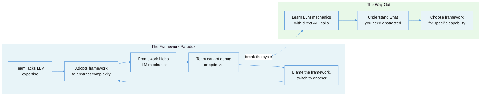
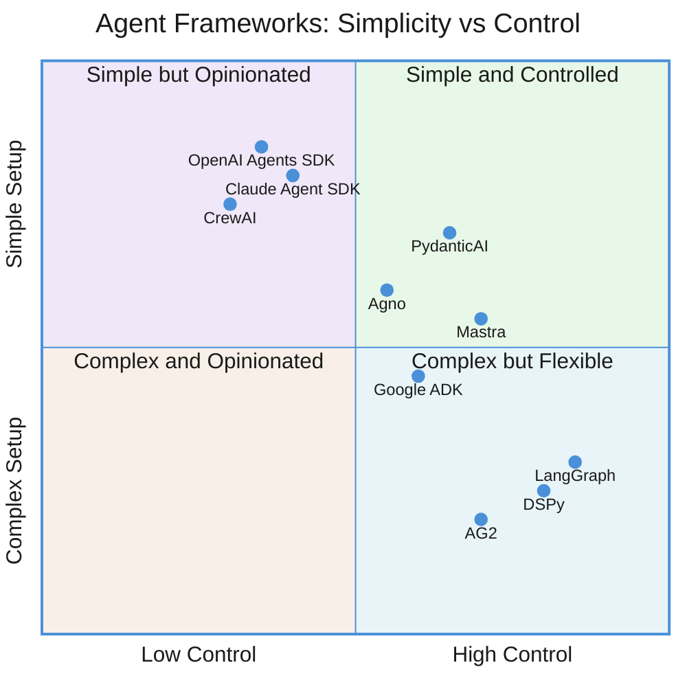
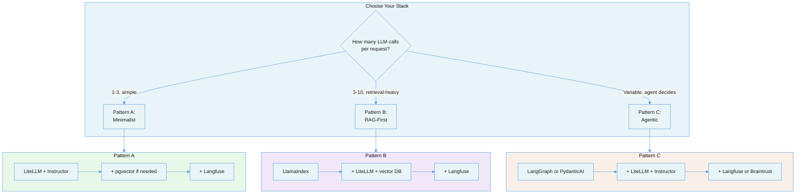

# The AI-Native Framework Landscape: What Exists, What It Does, and When You Actually Need It

**Thesis:** The framework layer is mostly avoidable, and where it is not, the decision is a durability decision -- who owns the tool, and what happens to your code when they change their mind.

**Prerequisites:** None. [AI-Native Solution Patterns](ai-native-solution-patterns.md) is a useful companion but not a prerequisite.

**Reading time:** 25 minutes

Every team building an AI-native application faces the same question within the first week: should we use a framework, and if so, which one? The answer matters less than most teams think -- but getting it wrong costs months. This document maps the complete landscape of production-grade third-party frameworks available in 2026, organized by the problem each solves, so you can make that decision with open eyes.

> **Companion document:** [AI-Native Solution Patterns](ai-native-solution-patterns.md) covers the architectural patterns (single call, pipeline, router, orchestrator, agent) that determine *how* you wire LLM capabilities together. This document covers the *tools* available for that wiring.

---

## The Core Tension

The AI framework ecosystem suffers from a contradiction: **the teams that most need frameworks are the least equipped to evaluate them, and the teams most equipped to evaluate them rarely need frameworks at all.**

A senior engineer who deeply understands prompt engineering, API mechanics, and distributed systems can build a production LLM application with nothing more than an HTTP client and a Pydantic model. A team new to LLMs reaches for a framework to paper over gaps in understanding -- but frameworks hide the very mechanics they need to learn.

This creates a predictable failure pattern: teams adopt a framework for its abstractions, then spend more time fighting those abstractions than they would have spent building from scratch.


```mermaid
%%{init: {'theme': 'base', 'themeVariables': {'primaryColor': '#e8f4f8', 'primaryTextColor': '#1a1a1a', 'primaryBorderColor': '#4a90d9', 'lineColor': '#4a90d9', 'secondaryColor': '#f0e8f8', 'tertiaryColor': '#e8f8e8', 'edgeLabelBackground': '#ffffff'}}}%%
graph LR
    subgraph Problem["The Framework Paradox"]
        style Problem fill:#e8f4f8,stroke:#4a90d9
        A["Team lacks LLM<br/>expertise"] --> B["Adopts framework<br/>to abstract complexity"]
        B --> C["Framework hides<br/>LLM mechanics"]
        C --> D["Team cannot debug<br/>or optimize"]
        D --> E["Blame the framework,<br/>switch to another"]
        E --> B
    end
    subgraph Escape["The Way Out"]
        style Escape fill:#e8f8e8,stroke:#4a90d9
        F["Learn LLM mechanics<br/>with direct API calls"] --> G["Understand what<br/>you need abstracted"]
        G --> H["Choose framework<br/>for specific capability"]
    end
    D -.->|"break the cycle"| F
```

The landscape itself reflects this tension. There are now **31 products across 7 layers** competing for attention -- counted as the distinct entries in the layer tables below, and re-verified in September 2026. The table below maps the primary categories:

| Layer | What It Solves | Complexity Without It | Example Frameworks |
|---|---|---|---|
| **LLM Orchestration** | Chaining calls, RAG pipelines, tool routing | Medium -- manageable with direct API calls for simple apps | LangChain/LangGraph, LlamaIndex, Microsoft Agent Framework |
| **Agent Frameworks** | Autonomous multi-step reasoning, multi-agent coordination | High -- state management, tool dispatch, and failure recovery are non-trivial | CrewAI, OpenAI Agents SDK, PydanticAI, Google ADK, DSPy, Agno, Claude Agent SDK, Mastra |
| **LLM Gateway** | Multi-provider routing, cost tracking, rate limiting | Low-medium -- a thin proxy layer, but tedious to build per-provider | LiteLLM, Portkey |
| **Structured Output** | Reliable schema-conforming responses from LLMs | Medium -- provider-native tools exist but vary in quality | Instructor, Outlines |
| **Evaluation** | Measuring output quality, detecting drift, experiment tracking | High -- most teams skip this entirely and regret it | Langfuse, LangSmith, Braintrust, Arize Phoenix |
| **Vector Storage** | Embedding search for RAG and semantic retrieval | Medium -- pgvector handles most cases; dedicated DBs matter at scale | Pinecone, Qdrant, Weaviate, Chroma, pgvector |
| **Inference/Serving** | Running models efficiently on GPUs | Very high -- CUDA optimization, batching, and memory management are specialized | vLLM, SGLang, Ollama, Together AI, Fireworks AI |

### Churn since March 2026

The 2026 framework market consolidated by acquisition and merger rather than by new technology. Every row below changes a buying or migration decision, so check this list before committing to any tool in the tables that follow.

| Product | Change | Date | What it means for you |
|---|---|---|---|
| **Portkey** | Acquired by Palo Alto Networks | May 2026 | The gateway now sits inside a security vendor. Confirm roadmap, licence, and data handling before committing. |
| **Langfuse** | Acquired by ClickHouse, announced alongside the company's [$400M Series D](https://clickhouse.com/blog/clickhouse-raises-400-million-series-d-acquires-langfuse-launches-postgres) | Jan 2026 | Licence and self-hosting stated unchanged; self-hosting now implies a ClickHouse dependency. |
| **Arize** | Dynatrace announced an agreement to acquire it | Aug 2026 | Arize AX and Phoenix remain available, but the announcement does not commit to a standalone open-source Phoenix. |
| **Helicone** | Acquired by Mintlify; maintenance mode | Mar 2026 | Do not start new work on it. |
| **AutoGen and Semantic Kernel** | Superseded by **Microsoft Agent Framework**, which merges them into one supported SDK | Apr 2026 | AutoGen (54.5K stars) is in maintenance mode; AG2 is the community fork. New Microsoft-ecosystem work starts on Agent Framework. |
| **Hugging Face TGI** | Repository archived; maintenance mode | Mar 2026 | Existing deployments keep working; not the start for new projects. |
| **LangChain's `AgentExecutor`** | Deprecated in favour of LangGraph; both 1.0 releases shipped | Oct 2025 | New agent work on it is work on a deprecated path. |
| **OpenAI Agent Builder** and the standalone Evals product | Deprecated; shutdown scheduled | Announced 3 Jun 2026, shutdown 30 Nov 2026 | Migrate to the Agents SDK or Workspace Agents. Anything on the canvas has a deadline. |

**New since March 2026:** the **Claude Agent SDK** (Anthropic), **Mastra** (TypeScript, built by the Gatsby founders), the **Vercel AI SDK** used as an agent substrate rather than only a streaming library, and **SGLang** as a mainstream self-hosting choice alongside vLLM.

---

## Failure Taxonomy

Teams fail with AI frameworks in predictable ways. Understanding these failure modes is essential before evaluating any tool.

### Failure 1: Framework-First Thinking

The team picks a framework before understanding the problem. They select LangChain because it has the most GitHub stars, then discover they need 5% of its surface area and are fighting the other 95%. The framework's abstractions shape the architecture rather than the problem shaping the architecture.

**Root cause:** Social proof substituting for technical analysis. Framework adoption is treated as a technology decision when it is actually an architecture decision.

### Failure 2: Abstraction Debt

The framework handles the happy path beautifully. The demo works in 30 minutes. Then production requirements arrive: custom retry logic, streaming with backpressure, provider-specific parameters (logprobs, seed, stop sequences). Each requirement means diving into framework internals, monkey-patching, or abandoning the abstraction entirely. As one practitioner on [Hacker News](https://news.ycombinator.com/item?id=40739982) put it: "We spent more time fighting LangChain than we would have spent building from scratch."

**Root cause:** Frameworks optimize for time-to-demo, not time-to-production. The cost of understanding someone else's abstraction eventually exceeds the cost of building your own.

### Failure 3: Version Churn Whiplash

The AI framework ecosystem moves faster than any previous software category. LangGraph shipped three breaking major versions (v0.1 through v0.3) within 18 months, then stabilised: LangChain 1.0 and LangGraph 1.0 both shipped in October 2025, and the legacy `AgentExecutor` agent layer is deprecated. Google ADK reached v2.0 general availability in May 2026 -- less than a year after launch, and with breaking changes from 1.x. PydanticAI moved to v2.0 in June 2026. Semantic Kernel and AutoGen were both retired into Microsoft Agent Framework in April 2026. OpenAI gave Agent Builder users a hard shutdown date of 30 November 2026. Teams report "spending more time on migrations than feature work" -- and the 2026 record is that churn now arrives as acquisition and deprecation as often as it arrives as a version bump.

**Root cause:** The problem space is evolving faster than any single framework can stabilize. Model capabilities change quarterly; frameworks chase those capabilities and break APIs in the process.

### Failure 4: Vendor Lock-in by Default

OpenAI Agents SDK only works with OpenAI models. Microsoft Agent Framework (which absorbed Semantic Kernel) is most capable on Azure. Google ADK is optimized for Gemini and Vertex AI. Teams adopt these frameworks for convenience, then discover they cannot switch providers when pricing changes, rate limits hit, or a competitor releases a better model.

**Root cause:** Framework creators are often model providers. Their frameworks serve as distribution channels, not neutral tools.

### Failure 5: Evaluation Neglect

Teams invest weeks choosing between orchestration frameworks and zero time on evaluation infrastructure. The result: they cannot measure whether their system actually works. Every change is a leap of faith. This is the most consequential failure because it makes all other decisions unverifiable.

**Root cause:** Orchestration is visible (code, architecture diagrams, demos). Evaluation is invisible (metrics, traces, regressions). Teams optimize for what they can show in a sprint review.

### Failure 6: The "One Framework" Trap

Teams assume a single framework should handle everything: orchestration, RAG, agents, eval, and serving. No framework does all of these well. LangChain's RAG is adequate but inferior to LlamaIndex's purpose-built retrieval. LlamaIndex's agent orchestration is functional but inferior to LangGraph's graph-based state management. Choosing one framework for everything means choosing mediocrity across the board.

**Root cause:** Organizational desire for simplicity. One framework means one learning curve, one dependency, one vendor relationship. But AI applications are inherently multi-concern systems.

---

## The Framework Adoption Spectrum

Six levels, from direct calls to a framework-owned architecture. They are not a maturity ladder -- Level 3 is not better than Level 1, it is a different trade -- and the failure mode at each level is the one the level above exists to fix.

| Level | Name | What exists | What breaks at this level |
|---|---|---|---|
| 0 | **Direct API calls** | An HTTP client, a schema library, your own loop and retry logic. | You re-derive what a library already tests: the wins are understanding, the cost is time. |
| 1 | **Point libraries** | One library per narrow concern -- a gateway, a structured-output layer, an eval store. | Nothing owns the composition; retries, tracing, and version pinning are wired separately in every service. |
| 2 | **One framework per layer** | A named tool at each layer of the stack, joined by your own code. | The glue is yours: upgrades, retries, and traces across every seam. |
| 3 | **A framework owning orchestration** | A graph or agent runtime owns control flow and state; your code supplies nodes and tools. | The runtime's abstractions shape the design, and the parts that touched it are the parts you rewrite to leave. |
| 4 | **Framework-first** | The framework decides the architecture: its primitives, its project layout, its deployment model. | Migration cost is the whole application; the maintainer's roadmap becomes yours. |
| 5 | **Platform lock-in** | The model provider's own SDK and hosted runtime, chosen for convenience ([Failure 4](#failure-4-vendor-lock-in-by-default)). | Pricing, deprecation, and rate limits are decided elsewhere, and the exit is a rewrite. |

Most production systems belong at Level 2 and stay there. The move to Level 3 is the one worth arguing about, and the test is measurement rather than preference: you move when the framework does work you have already tried to do yourself and got wrong.

## The AI Application Stack

Rather than comparing frameworks head-to-head, it is more useful to understand the **layers** of an AI-native application and which tools are best-in-class at each layer. Most production systems compose tools from multiple layers.


```mermaid
%%{init: {'theme': 'base', 'themeVariables': {'primaryColor': '#e8f4f8', 'primaryTextColor': '#1a1a1a', 'primaryBorderColor': '#4a90d9', 'lineColor': '#4a90d9', 'secondaryColor': '#f0e8f8', 'tertiaryColor': '#e8f8e8', 'edgeLabelBackground': '#f5f5f5'}}}%%
graph TD
    subgraph L7["Layer 7: Evaluation and Observability"]
        style L7 fill:#f0e8f8,stroke:#4a90d9
        Langfuse["Langfuse<br/><i>part of ClickHouse</i>"]
        LangSmith["LangSmith<br/><i>commercial</i>"]
        Braintrust["Braintrust<br/><i>$80M Series B, Feb 2026</i>"]
        Phoenix["Arize Phoenix<br/><i>Dynatrace deal pending</i>"]
    end
    subgraph L6["Layer 6: Agent Orchestration"]
        style L6 fill:#e8f4f8,stroke:#4a90d9
        CrewAI["CrewAI<br/><i>52.4K stars</i>"]
        OAISDK["OpenAI Agents SDK<br/><i>28.6K stars</i>"]
        PydanticAI["PydanticAI<br/><i>v2.0</i>"]
        ADK["Google ADK<br/><i>v2.0 GA</i>"]
        DSPy["DSPy<br/><i>33K stars</i>"]
        Agno["Agno<br/><i>v3.0</i>"]
        ClaudeSDK["Claude Agent SDK<br/><i>new 2026</i>"]
        Mastra["Mastra<br/><i>27.1K stars</i>"]
    end
    subgraph L5["Layer 5: LLM Orchestration"]
        style L5 fill:#e8f4f8,stroke:#4a90d9
        LangGraph["LangGraph<br/><i>39.4K stars</i>"]
        LlamaIndex["LlamaIndex<br/><i>40K stars</i>"]
        MAF["Microsoft Agent Framework<br/><i>AutoGen + SK merged</i>"]
    end
    subgraph L4["Layer 4: Structured Output"]
        style L4 fill:#e8f8e8,stroke:#4a90d9
        Instructor["Instructor<br/><i>12.6K stars</i>"]
        Outlines["Outlines<br/><i>13.6K stars</i>"]
    end
    subgraph L3["Layer 3: LLM Gateway"]
        style L3 fill:#e8f8e8,stroke:#4a90d9
        LiteLLM["LiteLLM<br/><i>40K stars</i>"]
        Portkey["Portkey<br/><i>Palo Alto Networks</i>"]
    end
    subgraph L2["Layer 2: Vector Storage"]
        style L2 fill:#f8f0e8,stroke:#4a90d9
        Pinecone["Pinecone<br/><i>managed SaaS</i>"]
        Qdrant["Qdrant<br/><i>29.8K stars</i>"]
        Weaviate["Weaviate<br/><i>15.9K stars</i>"]
        pgvector["pgvector<br/><i>20.4K stars</i>"]
        Chroma["Chroma<br/><i>26.8K stars</i>"]
    end
    subgraph L1["Layer 1: Inference and Serving"]
        style L1 fill:#f8f0e8,stroke:#4a90d9
        vLLM["vLLM<br/><i>74K stars</i>"]
        SGLang["SGLang<br/><i>structured generation</i>"]
        Ollama["Ollama<br/><i>166K stars</i>"]
        Together["Together AI"]
        Fireworks["Fireworks AI"]
    end

    L7 --> L6
    L6 --> L5
    L5 --> L4
    L4 --> L3
    L3 --> L2
    L2 --> L1
```

> **Snapshot note:** ownership, lifecycle, and version facts here were re-verified in September 2026, where the project publishes them. Star counts drift monthly and were not individually re-checked; treat them as directional. Ownership changes are the ones that alter a buying decision, and they are listed in **Churn since March 2026** above.

### Layer 1: Inference and Serving

These tools run LLMs on hardware. You only need this layer if you self-host models or need specialized inference optimization.

| Tool | What It Does | Stars/Signal | When to Use |
|---|---|---|---|
| **[vLLM](https://github.com/vllm-project/vllm)** | High-throughput LLM serving with PagedAttention for efficient KV-cache management. Supports distributed inference across NVIDIA, AMD, Intel, and TPU. Now part of the PyTorch ecosystem. | 74K stars | Self-hosted production GPU inference at scale. The de facto standard. |
| **[SGLang](https://github.com/sgl-project/sglang)** | Serving engine built for structured generation and agent loops. RadixAttention reuses the KV cache across requests that share a prefix -- a fixed system prompt, tool definitions, conversation history. OpenAI-compatible API. | v0.5.18 | Production serving where prompts repeat and output is constrained. The strongest alternative to vLLM for agentic workloads. |
| **[Ollama](https://github.com/ollama/ollama)** | Makes local LLM running trivial: `ollama pull model && ollama run model`. Wraps llama.cpp in a clean CLI and API. | 166K stars | Developer-local inference, privacy-sensitive workloads, offline-capable workflows, prototyping without API costs. |
| **[Together AI](https://www.together.ai/)** | Cloud inference with 200+ models, large-scale GPU clusters, LoRA and full fine-tuning support. Reported ~$1B annualized revenue ([Sacra, February 2026](https://sacra.com/c/together-ai)). | SaaS | Broad model selection with fine-tuning flexibility. Managed infrastructure for teams without GPU expertise. |
| **[Fireworks AI](https://fireworks.ai/)** | Ultra-fast inference with custom FireAttention CUDA kernels. Founded by the PyTorch team. | SaaS | Latency-critical production inference. Multi-LoRA serving for fine-tuned model variants. |

**When to skip this layer:** If you exclusively use API providers (OpenAI, Anthropic, Google) and have no plans to self-host or fine-tune models.

### Layer 2: Vector Storage

Embedding-based search infrastructure for RAG, semantic retrieval, and similarity matching.

| Tool | Stars | Differentiator | Best For |
|---|---|---|---|
| **[pgvector](https://github.com/pgvector/pgvector)** | 20.4K | Runs inside existing PostgreSQL. HNSW + IVFFlat indexes. 471 QPS at 50M vectors with pgvectorscale. | Teams with existing Postgres who want to avoid a second data store. Handles most use cases under 50M vectors. |
| **[Qdrant](https://github.com/qdrant/qdrant)** | 29.8K | Written in Rust. Best free tier (1GB free, no credit card). Strong JSON metadata filtering. Apache 2.0. | Budget-conscious projects and self-hosted deployments. |
| **[Chroma](https://github.com/chroma-core/chroma)** | 26.8K | Embedded mode with zero-config, zero network latency. NumPy-like API. | Rapid prototyping and development. Projects under 10M vectors. |
| **[Weaviate](https://github.com/weaviate/weaviate)** | 15.9K | Native hybrid search (vector + keyword + metadata in a single query). Written in Go. BSD-3. | RAG applications requiring hybrid search strategies. |
| **[Pinecone](https://www.pinecone.io/)** | SaaS | Fully managed serverless, 7ms p99, scales to billions of vectors automatically. Zero ops. | Enterprise teams wanting zero infrastructure management at any scale. |

**Decision shortcut:** Start with **pgvector** if you already use PostgreSQL. Switch to a dedicated vector DB only when you hit performance limits (typically 50M+ vectors) or need features like hybrid search (Weaviate) or advanced metadata filtering (Qdrant).

### Layer 3: LLM Gateway

Proxy layers that abstract provider differences, add cost tracking, and handle routing, retries, and fallbacks.

| Tool | Stars | What It Does | When to Use |
|---|---|---|---|
| **[LiteLLM](https://github.com/BerriAI/litellm)** | 40K | Unified OpenAI-compatible interface to 100+ LLM providers. Python SDK and proxy server. Cost tracking, load balancing, guardrails. Used by Stripe, Netflix, OpenAI Agents SDK. 8ms P95 at 1K RPS. | Drop-in multi-provider routing. The industry standard for provider abstraction. |
| **[Portkey](https://github.com/Portkey-AI/gateway)** | Acquired 2026 | AI gateway with sub-1ms latency, 122KB footprint. 250+ LLMs, 50+ built-in guardrails, semantic caching, 10B+ tokens/day. | Enterprise gateway where security guardrails and governance are first-class requirements. See the churn table before a fresh commitment. |

**Known limitation (LiteLLM):** Python GIL bottleneck under very high concurrency; logging layer degrades past 1M logs; enterprise features (SSO, RBAC, team budgets) require paid license. A Rust rewrite was announced in June 2026 to address the concurrency ceiling; until it ships as the default, treat the GIL as a real limit at very high request rates.

### Layer 4: Structured Output

Tools that guarantee LLM responses conform to a defined schema.

| Tool | Stars | Approach | When to Use |
|---|---|---|---|
| **[Instructor](https://github.com/567-labs/instructor)** | 12.6K | Application-layer validation: defines Pydantic models as response schemas, retries with error feedback on validation failure. Works with any API-based LLM. Multi-language (Python, TS, Go, Ruby, Rust). | API-based LLM calls where you need reliable structured JSON. The industry default. |
| **[Outlines](https://github.com/dottxt-ai/outlines)** | 13.6K | Inference-time constrained decoding: constrains the token generation process itself using FSMs and grammars. Guarantees structural correctness during generation, not after. Integrated into vLLM. The Rust core (`outlines-core`) removed the compilation-timeout problem the original Python implementation had on complex schemas. | When you control the model runtime and want token-level structural guarantees (local models via vLLM, transformers, Ollama). |

**Key distinction:** Instructor validates *after* generation (works with any provider API). Outlines constrains *during* generation (requires access to the model's logits). They solve the same problem at different layers.

**What changed by 2026:** the major providers now ship constrained decoding natively -- OpenAI's `strict` JSON Schema mode, Anthropic's tool-use schema, Gemini's `responseSchema`. That removes the need for a library in the common case and leaves these two for the cases providers handle badly. Two costs are now measured rather than assumed:

- **Quality tax.** Masking logits can block the token the model would have chosen. On easy prompts the tax is near zero; on hard prompts (long reasoning, ambiguous enums, deep nesting) it shows up as flatter distributions and worse semantic answers. Reported as roughly 0-3% on easy and 10-15% on hard prompts for OpenAI's strict mode.
- **Schema complexity.** Large enums, tight `minItems`/`maxItems` combinations, and many cross-field constraints cause compilation timeouts in constrained-decoding engines. Constrain only what you consume downstream, keep enums under roughly 50 values, and test your exact schema against your deployment stack before shipping.

> For a deeper treatment, see [Structured Output and Parsing](structured-output-and-parsing.md).

### Layer 5: LLM Orchestration Frameworks

These frameworks handle chaining LLM calls, RAG pipelines, tool routing, and workflow management. This is the most contested layer, with the strongest opinions.

| Framework | Stars | Primary Focus | Language | Best For | Avoid When |
|---|---|---|---|---|---|
| **[LangChain / LangGraph](https://github.com/langchain-ai/langchain)** | 39.4K (LangGraph) | General LLM orchestration + stateful agent workflows | Python, JS/TS | Complex multi-step workflows (via LangGraph). Rapid prototyping with 100+ integrations. LangSmith observability. Both 1.0 releases shipped Oct 2025; the legacy `AgentExecutor` layer is deprecated. | Simple LLM API calls. Work that needs transparent, debuggable code. Dependency bloat. New agent work on `AgentExecutor`. |
| **[LlamaIndex](https://github.com/run-llama/llama_index)** | 40K | RAG and data retrieval | Python, TS | RAG applications, knowledge bases, document Q&A. Best-in-class retrieval (hierarchical chunking, auto-merging, sub-question decomposition). | Complex agent workflows. Simple API calls. When you need first-party observability. |
| **[Microsoft Agent Framework](https://github.com/microsoft/agent-framework)** | GA Apr 2026 | Enterprise AI orchestration | C#, Python | Enterprise .NET, Azure-centric, and compliance-heavy stacks. Merges Semantic Kernel's foundations (sessions, telemetry, filters, auth) with AutoGen's multi-agent orchestration, plus native MCP and A2A. The only first-class C# path. | Teams outside the Microsoft ecosystem, and Python-first teams where community breadth matters. |

**The practitioner consensus** (drawn from [HN](https://news.ycombinator.com/item?id=40739982) and Reddit r/dataengineering, r/LLMDevs threads): LangChain's over-abstraction is the most universal complaint in the AI tooling space. LlamaIndex is undisputed for RAG. Semantic Kernel is invisible outside .NET/enterprise circles. A growing contingent advocates skipping this layer entirely and using direct API calls with LiteLLM + Instructor.

**The security argument for staying thin:** in March 2026 a coordinated disclosure ("LangDrained") reported multiple high- and critical-severity vulnerabilities across LangChain and LangGraph, compounding flaws documented through 2024 and 2025. The lesson is not that LangChain is uniquely unsafe -- it is that a large dependency holds a large attack surface, and a flaw in the orchestration layer sits on the path of every request. That is the strongest practical reason to keep your core logic out of any framework: see [Recommendation 9](#long-term-strategic-decisions).

> **When to skip this layer:** If your application makes fewer than 5 LLM calls per request and doesn't need RAG, you likely don't need an orchestration framework. Direct API calls with a gateway (Layer 3) and structured output (Layer 4) will be simpler and more debuggable.

### Layer 6: Agent Frameworks

These frameworks handle autonomous, multi-step reasoning where the LLM decides what to do next. This is the fastest-moving layer, with new entrants every quarter.

| Framework | Stars | Version | Differentiator | Best For |
|---|---|---|---|---|
| **[CrewAI](https://github.com/crewAIInc/crewAI)** | 52K+ | v1.15 line (Sep 2026) | Fastest time-to-prototype. Role/goal/backstory mental model that non-technical stakeholders can understand. Native MCP and A2A support. | Business workflows with role-based agent teams. Rapid prototyping of multi-agent systems. |
| **[Agno](https://github.com/agno-agi/agno)** (formerly PhiData) | 38K+ | v3.0 | Full-stack: framework + runtime + control plane (AgentOS UI). You own all data. Per-user/session isolation. Production API in ~20 lines. | Self-hosted production agents where infrastructure ownership and data sovereignty matter. |
| **[DSPy](https://github.com/stanfordnlp/dspy)** | 33K | v3.x | Fundamentally different paradigm: you *program* LMs, not *prompt* them. Automatic prompt optimization and compilation. Can optimize for fine-tuning weights. Created at Stanford NLP. | Systematic prompt optimization. Complex RAG pipelines. ML-heavy teams comfortable with a paradigm shift. |
| **[OpenAI Agents SDK](https://github.com/openai/openai-agents-python)** | 28.6K | v0.15.1 | Thinnest abstraction layer. Five primitives: Agents, Handoffs, Guardrails, Sessions, Tracing. Working multi-agent triage in ~30 lines. Realtime voice agents. | Teams committed to OpenAI models. Minimal overhead. Voice agents. The Agent Builder canvas and Evals product shut down on 30 Nov 2026; the SDK is the supported path. |
| **[Google ADK](https://github.com/google/adk-python)** | 21.1K | v2.0 GA (May 2026) | Only framework with four-language support (Python, TS, Go, Java, plus Kotlin). v2.0 replaced the hierarchical agent executor with a graph engine and declarative YAML agent definitions. Built-in evaluation. Deploys to Vertex AI Agent Engine. | Multi-language teams. Google Cloud. Built-in evaluation. Expect breaking changes from 1.x. |
| **[PydanticAI](https://github.com/pydantic/pydantic-ai)** | 19.2K | v2.0 (Jun 2026) | Type safety at write-time via Pydantic validation. FastAPI-style dependency injection. Model-agnostic (25+ providers). Durable execution for long-running workflows. | Teams that value code quality and IDE support. When output schema correctness is critical. |
| **[Claude Agent SDK](https://github.com/anthropics/claude-agent-sdk-python)** | New in 2026 | v0.2.x | Anthropic's first-party SDK: the harness behind Claude Code, with coding tools, subagents, hooks, and permission modes. The TypeScript package bundles the runtime. | Claude models plus heavy code-and-filesystem work. A harness rather than a framework. |
| **[Mastra](https://github.com/mastra-ai/mastra)** | 27.1K | 2026 line | TypeScript-native: agents, durable workflows, memory, evals, and tool registries as first-class primitives. Runs on Node.js, Bun, or Cloudflare Workers. | TypeScript-first teams shipping agent products, usually with the Vercel AI SDK at the streaming layer. |
| **[Vercel AI SDK](https://github.com/vercel/ai)** | 26.1K | 2026 line | Model-agnostic TypeScript SDK; the reference implementation for streaming UI, tool calling, and structured generation in TS. | Next.js and React products. Usually the substrate under Mastra, not an alternative to it. |
| **[AG2](https://github.com/ag2ai/ag2)** | 4.3K | pre-1.0 | Community fork of Microsoft AutoGen, kept alive after AutoGen entered maintenance mode in 2026. Conversational patterns: group debates, consensus, sequential dialogues. | Research and prototyping. Not for new production deployments -- Microsoft Agent Framework is the supported successor. |


```mermaid
%%{init: {'theme': 'base', 'themeVariables': {'primaryColor': '#e8f4f8', 'primaryTextColor': '#1a1a1a', 'primaryBorderColor': '#4a90d9', 'lineColor': '#4a90d9', 'quadrant1Fill': '#e8f8e8', 'quadrant2Fill': '#f0e8f8', 'quadrant3Fill': '#f8f0e8', 'quadrant4Fill': '#e8f4f8', 'quadrant1TextFill': '#1a1a1a', 'quadrant2TextFill': '#1a1a1a', 'quadrant3TextFill': '#1a1a1a', 'quadrant4TextFill': '#1a1a1a', 'quadrantPointFill': '#4a90d9', 'quadrantPointTextFill': '#1a1a1a'}}}%%
quadrantChart
    title Agent Frameworks: Simplicity vs Control
    x-axis Low Control --> High Control
    y-axis Complex Setup --> Simple Setup
    quadrant-1 "Simple and Controlled"
    quadrant-2 "Simple but Opinionated"
    quadrant-3 "Complex and Opinionated"
    quadrant-4 "Complex but Flexible"
    OpenAI Agents SDK: [0.35, 0.85]
    CrewAI: [0.30, 0.75]
    Claude Agent SDK: [0.40, 0.80]
    PydanticAI: [0.65, 0.70]
    Mastra: [0.70, 0.55]
    Agno: [0.55, 0.60]
    Google ADK: [0.60, 0.45]
    DSPy: [0.80, 0.25]
    LangGraph: [0.85, 0.30]
    AG2: [0.70, 0.20]
```

### Layer 7: Evaluation and Observability

The most under-invested layer in most AI applications, and arguably the most important. Without evaluation, every other framework choice is unverifiable.

| Tool | Stars/Signal | What It Does | When to Use |
|---|---|---|---|
| **[Langfuse](https://github.com/langfuse/langfuse)** | Part of ClickHouse | Open-source LLM engineering platform: tracing, prompt management, evaluations, datasets. MIT-licensed. Self-hostable. Integrates with OpenTelemetry, LangChain, OpenAI SDK, LiteLLM. #1 most-starred open-source LLMOps tool. | Teams wanting open-source, self-hosted observability. Avoiding vendor lock-in. Budget-conscious teams (50K observations/month free). |
| **[LangSmith](https://www.langchain.com/langsmith)** | Commercial | The first-party platform for LangChain and LangGraph: tracing, evals, prompt versioning, and deployment. Tightest integration with the LangChain stack by construction. | Teams already committed to LangChain or LangGraph. Weakest fit if you are deliberately framework-independent -- it pulls observability back inside the framework. |
| **[Braintrust](https://www.braintrust.dev/)** | $80M Series B (Feb 2026) | AI observability platform integrating eval into the development workflow. Experiment tracking, side-by-side comparison, regression detection in CI, production monitoring. Custom scoring (LLM-judge, code, human). Used by Notion, Stripe, Vercel, Replit. | End-to-end commercial eval + observability. Teams that want a single platform for experimentation through production. The funding round is a durability signal: a managed option unlikely to disappear. |
| **[Arize Phoenix](https://github.com/Arize-ai/phoenix)** | 9K stars | Open-source AI observability accepting traces via standard OTLP (OpenTelemetry). Tracing, LLM-as-judge eval, dataset management, experiment tracking. Runs locally or in cloud. 25+ framework integrations. | Teams already using OpenTelemetry. Local-first eval and experimentation (runs in Jupyter notebooks). Caveat: the Dynatrace acquisition leaves Phoenix's long-term support open -- see the churn table. |

**Portability requirement:** OpenTelemetry's GenAI semantic conventions are the one portability standard in this layer. Treat OTel support as a hard buying requirement: it is what lets you replace the observability platform without re-instrumenting the application. This matters more here than in any other layer, because the 2026 consolidations above (ClickHouse/Langfuse, Dynatrace/Arize, Mintlify/Helicone) all happened inside a single year.

> For a deeper treatment, see [Evaluation-Driven Development](evaluation-driven-development.md) and [Observability and Monitoring](observability-and-monitoring.md).

---

## Composition Patterns

The most effective AI-native stacks compose best-in-class tools from multiple layers rather than relying on a single framework. Here are three proven compositions:

### Pattern A: The Minimalist Stack

For teams that want maximum control and minimum abstraction. Best for applications with straightforward LLM interactions (chatbots, classification, extraction).

```
LiteLLM (gateway) + Instructor (structured output) + pgvector (if RAG needed) + Langfuse (observability)
```

**Total framework dependencies:** 2-4. **Time to production:** Days. **Debugging experience:** Excellent -- you can see every prompt and response.

### Pattern B: The RAG-First Stack

For applications where retrieval quality is the primary differentiator (knowledge bases, document Q&A, enterprise search).

```
LlamaIndex (retrieval) + LiteLLM (gateway) + Qdrant or pgvector (vectors) + Langfuse (observability)
```

**Why LlamaIndex here:** Its hierarchical chunking, auto-merging retrieval, and built-in evaluation (faithfulness, relevancy) are purpose-built for RAG and significantly ahead of LangChain's retrieval capabilities.

### Pattern C: The Agentic Stack

For applications with autonomous multi-step workflows, tool use, and human-in-the-loop requirements.

```
LangGraph or PydanticAI (orchestration) + LiteLLM (gateway) + Instructor (structured output) + LlamaIndex (if RAG needed) + Langfuse or Braintrust (observability)
```

**Why LangGraph:** Its directed graph model, built-in checkpointing, crash recovery, and time-travel debugging are purpose-built for stateful agent workflows. PydanticAI is the alternative when type safety and durable execution are higher priorities than graph-based control flow.


```mermaid
%%{init: {'theme': 'base', 'themeVariables': {'primaryColor': '#e8f4f8', 'primaryTextColor': '#1a1a1a', 'primaryBorderColor': '#4a90d9', 'lineColor': '#4a90d9', 'secondaryColor': '#f0e8f8', 'tertiaryColor': '#e8f8e8', 'edgeLabelBackground': '#f5f5f5'}}}%%
graph TD
    subgraph Decision["Choose Your Stack"]
        style Decision fill:#e8f4f8,stroke:#4a90d9
        Q1{"How many LLM calls<br/>per request?"}
        Q1 -->|"1-3, simple"| A["Pattern A:<br/>Minimalist"]
        Q1 -->|"3-10, retrieval-heavy"| B["Pattern B:<br/>RAG-First"]
        Q1 -->|"Variable, agent decides"| C["Pattern C:<br/>Agentic"]
    end
    subgraph StackA["Pattern A"]
        style StackA fill:#e8f8e8,stroke:#4a90d9
        A1["LiteLLM + Instructor"]
        A2["+ pgvector if needed"]
        A3["+ Langfuse"]
        A1 --> A2 --> A3
    end
    subgraph StackB["Pattern B"]
        style StackB fill:#f0e8f8,stroke:#4a90d9
        B1["LlamaIndex"]
        B2["+ LiteLLM + vector DB"]
        B3["+ Langfuse"]
        B1 --> B2 --> B3
    end
    subgraph StackC["Pattern C"]
        style StackC fill:#f8f0e8,stroke:#4a90d9
        C1["LangGraph or PydanticAI"]
        C2["+ LiteLLM + Instructor"]
        C3["+ Langfuse or Braintrust"]
        C1 --> C2 --> C3
    end
    A --> StackA
    B --> StackB
    C --> StackC
```

---

## Recommendations

### Immediate (every AI project)

1. **Start with direct API calls**, not a framework. Build your first prototype with LiteLLM + Instructor. You need to understand the raw mechanics before you can evaluate what to abstract. This directly counters [Failure 1 (Framework-First Thinking)](#failure-1-framework-first-thinking) and [Failure 2 (Abstraction Debt)](#failure-2-abstraction-debt).

2. **Deploy evaluation infrastructure on day one.** Langfuse is open-source, self-hostable, and takes 30 minutes to set up. Every prompt change should be measurable. This counters [Failure 5 (Evaluation Neglect)](#failure-5-evaluation-neglect).

3. **Use pgvector for RAG** unless you have a specific reason not to. Adding a dedicated vector database is a scaling decision, not an architecture decision.

### Medium-term (when complexity justifies it)

4. **Adopt LlamaIndex when retrieval quality becomes your bottleneck.** Its chunking strategies, hybrid search, and built-in RAG evaluation are genuinely better than building from scratch. But only for retrieval -- do not use it as a general orchestration framework.

5. **Adopt LangGraph or PydanticAI when you need stateful agent workflows.** LangGraph for graph-based control flow with checkpointing. PydanticAI for type-safe agents with dependency injection. Choose based on whether your complexity is in the *workflow topology* (LangGraph) or the *data contracts* (PydanticAI). This addresses [Failure 6 (The "One Framework" Trap)](#failure-6-the-one-framework-trap) by selecting the right tool for the specific concern.

6. **Add a proper LLM gateway (LiteLLM or Portkey)** when you use more than one model provider or need spend controls. LiteLLM for developer-friendly routing. Portkey for enterprise governance.

### Long-term (strategic decisions)

7. **Evaluate DSPy for prompt optimization** if your team has ML expertise. Its "programming not prompting" paradigm eliminates manual prompt engineering but requires a genuine paradigm shift. The payoff is prompts that improve automatically via optimizers rather than manual iteration.

8. **Choose your agent framework based on your ecosystem, not GitHub stars.** OpenAI shop: OpenAI Agents SDK. Microsoft/.NET shop: Microsoft Agent Framework (Semantic Kernel and AutoGen are both superseded). Google Cloud: Google ADK. Python-first with no provider lock-in: PydanticAI or CrewAI. TypeScript: Mastra on the Vercel AI SDK. Claude models with heavy code-and-filesystem work: the Claude Agent SDK. This counters [Failure 4 (Vendor Lock-in)](#failure-4-vendor-lock-in-by-default).

9. **Plan for framework churn.** Keep your core business logic independent of any framework. Wrap framework-specific code in thin adapters. When (not if) you need to switch, the migration should affect the adapter layer, not your domain logic. This counters [Failure 3 (Version Churn)](#failure-3-version-churn-whiplash).

A worked example of the discipline: a self-reflective agent loop (ingest, plan, execute, assess, reflect) built as a small engine that imports only the standard library, with every moving part -- model provider, memory store, tool runner, work intake, evaluator -- behind a fixed interface and supplied as a swappable adapter. The engine holds no framework, no vendor SDK, and no provider dependency. Two rules keep that true over time: every new backend is an adapter behind an *existing* seam rather than a change to the core, and adding a **new** seam is treated as a deliberate architectural event, not a routine commit. That is the difference between an abstraction you chose and one a framework chose for you.

---

## The Hard Truth

The AI framework ecosystem is a **marketing war disguised as a technology landscape.** Most frameworks exist because a company (OpenAI, Google, Microsoft) needs a distribution channel for its models, or because a startup (LangChain, LlamaIndex, CrewAI) needs to build a commercial platform on top of open-source adoption. This is not inherently bad, but it means the frameworks are optimized for *adoption* (easy demos, impressive GitHub stars, conference talks) rather than *production reliability* (debuggability, stability, performance under load).

The uncomfortable truth is that **the best AI-native stack for most applications in 2026 is embarrassingly simple**: an HTTP client, a Pydantic model, a retry loop, and a database. Everything else is optimization for specific scaling challenges that most teams will never face. The team that ships a working product with direct API calls will outperform the team that spends a quarter evaluating frameworks every time.

The frameworks listed in this document are real, production-grade tools that solve real problems. But the problem they solve most often is not technical -- it is organizational. They give teams a vocabulary, a community, and a sense of progress. The teams that benefit most from frameworks are those that *already understand what the framework does* and are choosing it to avoid re-implementing a solved problem, not to avoid understanding the problem in the first place.

---

## Summary Checklist

| Question | Good Answer | Bad Answer |
|---|---|---|
| Have you built a working prototype with direct API calls first? | Yes -- we understand the raw mechanics | No -- we started with a framework |
| Can you explain what your framework does under the hood? | Yes -- we could rebuild the critical parts | No -- it is a black box |
| Do you have evaluation infrastructure? | Yes -- every change is measured | No -- we eyeball outputs |
| Are you using one tool per concern or one framework for everything? | One tool per concern, composed | One framework for everything |
| Can you switch LLM providers without rewriting your application? | Yes -- provider logic is behind a gateway | No -- we are locked to one provider |
| Is your core business logic independent of the framework? | Yes -- framework code is in adapters | No -- framework is woven throughout |
| Did you choose your framework based on your actual problem? | Yes -- we hit a specific scaling challenge | No -- we chose based on GitHub stars |
| Do you have a plan for framework version upgrades? | Yes -- we pin versions and test upgrades | No -- we upgrade and hope |
| Can you debug a failed LLM interaction end-to-end? | Yes -- we can see every prompt, response, and trace | No -- failures are opaque |
| Is your team comfortable with the framework's abstraction level? | Yes -- we find it productive, not confusing | No -- we fight the abstractions regularly |

---

## Field Notes from an Operating Estate

Two observations from a practitioner operating an estate of roughly a dozen agent harnesses on one workstation. Abstracted to patterns; the identifying detail is deliberately dropped.

**August 2026 -- a phase cannot be closed without an evidence record.** Before any phase is called done, the estate requires a small machine-readable record listing what the run claims it used, with each entry labelled against expectation. A missing record is a hard failure in every mode -- no record, no close. A record that is present but carries a wrong-version or gap label warns first, and fails only after a planted-defect test proved the gate detects what it is supposed to detect and a fleet measurement showed the requirement was already satisfiable. The estate's own note on it is blunt: the record is a claim, never an attestation. It proves the agent typed the right names, not that the work happened.

**September 2026 -- the core that outlives the backends.** The estate's newest design is a self-reflective agent loop (ingest, plan, execute, assess, reflect) built as a small engine that imports only the standard library, with every moving part -- model provider, memory store, tool runner, work intake, evaluator -- behind a fixed interface and supplied as a swappable adapter. No framework, no vendor SDK, no provider dependency in the core. Two rules keep it that way: a new backend is an adapter behind an existing seam rather than a change to the core, and adding a new seam is a deliberate architectural event, not a routine commit.

## References

### Practitioner Articles and Discussions

- [Why we no longer use LangChain for building our AI agents (HN, 480 points)](https://news.ycombinator.com/item?id=40739982) -- Detailed practitioner critique of LangChain's abstraction overhead
- [LangGraph vs Semantic Kernel: Python AI Agents in 2026 (DEV Community)](https://dev.to/theprodsde/langgraph-vs-semantic-kernel-python-ai-agents-in-2026-1p4g) -- Head-to-head comparison of orchestration approaches
- [AI Agent Frameworks: LangGraph vs CrewAI vs AutoGen vs OpenAI Agents SDK (DEV Community)](https://dev.to/ultraduneai/eval-004-ai-agent-frameworks-langgraph-vs-crewai-vs-autogen-vs-smolagents-vs-openai-agents-sdk-190l) -- Multi-framework evaluation with code examples
- [Definitive Guide to Agentic Frameworks in 2026 (SoftmaxData)](https://softmaxdata.com/blog/definitive-guide-to-agentic-frameworks-in-2026-langgraph-crewai-ag2-openai-and-more/) -- Comprehensive framework comparison with pricing and maturity analysis
- [Top 5 AI Agent Frameworks in 2026 (DEV Community)](https://dev.to/devopsdaily/top-5-ai-agent-frameworks-in-2026-30dj) -- GitHub-star and npm-download snapshot dated 11 Aug 2026; the source for the adoption figures in the Layer 6 table
- [Best AI Agent SDKs Compared (2026) (Requesty)](https://www.requesty.ai/blog/best-ai-agent-sdks-compared-2026-langchain-crewai-openai-anthropic-google) -- Current SDK versions for LangGraph, CrewAI, the OpenAI Agents SDK, the Claude Agent SDK, and Google ADK 2.0
- [LangChain vs LlamaIndex 2026: Complete Production RAG Comparison (PremAI)](https://blog.premai.io/langchain-vs-llamaindex-2026-complete-production-rag-comparison/) -- RAG-focused head-to-head comparison
- [Top 5 LiteLLM Alternatives in 2026 (Maxim)](https://www.getmaxim.ai/articles/top-5-litellm-alternatives-in-2026/) -- LiteLLM limitations and gateway landscape analysis
- [Best Vector Databases 2026 (Firecrawl)](https://www.firecrawl.dev/blog/best-vector-databases) -- Vector DB comparison with pricing and performance benchmarks
- [Fireworks AI vs Together AI (Northflank)](https://northflank.com/blog/fireworks-ai-vs-together-ai) -- Inference provider comparison
- [Together AI revenue, valuation and funding (Sacra, 2026)](https://sacra.com/c/together-ai) -- Reported annualized revenue for the inference provider, with the funding history behind it
- [Choosing an LLM Inference Engine (leetllm, 2026)](https://leetllm.com/blog/llm-inference-engine-comparison-2026) -- vLLM, SGLang, TensorRT-LLM, Ollama, and llama.cpp release lines and trade-offs
- [LLM Inference Servers Compared (TensorFoundry)](https://tensorfoundry.io/blog/llm-inference-servers-compared) -- SGLang's RadixAttention advantage and the Hugging Face TGI archive
- [LangChain and LangGraph: Critical Vulnerabilities in AI Orchestration (Cloud Security Alliance, Mar 2026)](https://labs.cloudsecurityalliance.org/research/csa-research-note-langchain-langgraph-vulnerabilities-202603) -- The "LangDrained" disclosure and the dependency-surface argument

### Churn and lifecycle records (2026)

- [ClickHouse raises $400M Series D and acquires Langfuse (ClickHouse, 16 Jan 2026)](https://clickhouse.com/blog/clickhouse-raises-400-million-series-d-acquires-langfuse-launches-postgres) -- The primary announcement of the $400M round and the Langfuse acquisition, in one statement
- [OpenAI API Deprecations](https://developers.openai.com/api/docs/deprecations) -- Official record of the Agent Builder, reusable-prompt, and Evals shutdowns on 30 Nov 2026
- [Welcome to ADK 2.0 (adk.dev)](https://adk.dev/2.0) -- General-availability dates for ADK 2.0 across Python, Go, and TypeScript
- [AI Agent Observability 2026: Tracing & Monitoring Stack (Digital Applied)](https://www.digitalapplied.com/blog/ai-agent-observability-2026-tracing-monitoring-stack-guide) -- ClickHouse's acquisition of Langfuse and Braintrust's Series B, with the durability read for each
- [Langfuse vs Arize AX and Arize Phoenix (Langfuse)](https://langfuse.com/resources/engineering/best-phoenix-arize-alternatives) -- Dynatrace's agreement to acquire Arize, and what the announcement does not commit to
- [Langfuse — the open-source LLM observability platform explained](https://www.youtube.com/watch?v=kIf1Ng76cmc) -- Independent account of the January 2026 ClickHouse acquisition

### Official Documentation and Repositories

- [LangChain](https://github.com/langchain-ai/langchain) -- Python/JS LLM orchestration; LangChain 1.0 shipped Oct 2025
- [LangGraph](https://github.com/langchain-ai/langgraph) -- 39.4K stars, stateful agent runtime; the supported agent layer
- [LlamaIndex](https://github.com/run-llama/llama_index) -- 40K stars, RAG-focused data framework
- [Microsoft Agent Framework](https://github.com/microsoft/agent-framework) -- GA Apr 2026, enterprise C#/Python orchestration; supersedes Semantic Kernel and AutoGen
- [Semantic Kernel](https://github.com/microsoft/semantic-kernel) -- superseded; retained for existing .NET deployments
- [CrewAI](https://github.com/crewAIInc/crewAI) -- 52K+ stars, role-based multi-agent orchestration
- [OpenAI Agents SDK](https://github.com/openai/openai-agents-python) -- 28.6K stars, minimal agent primitives
- [Google ADK](https://github.com/google/adk-python) -- 21.1K stars, multi-language agent development, v2.0 GA May 2026
- [PydanticAI](https://github.com/pydantic/pydantic-ai) -- 19.2K stars, type-safe agent framework, v2.0 Jun 2026
- [DSPy](https://github.com/stanfordnlp/dspy) -- 33K stars, programming-not-prompting framework
- [Agno](https://github.com/agno-agi/agno) -- 38K+ stars, full-stack agent platform
- [Claude Agent SDK](https://github.com/anthropics/claude-agent-sdk-python) -- first-party Anthropic agent harness
- [Mastra](https://github.com/mastra-ai/mastra) -- 27.1K stars, TypeScript agent framework
- [Vercel AI SDK](https://github.com/vercel/ai) -- 26.1K stars, TypeScript streaming and tool-calling SDK
- [AG2](https://github.com/ag2ai/ag2) -- 4.3K stars (community fork of AutoGen), multi-agent conversations
- [LiteLLM](https://github.com/BerriAI/litellm) -- 40K stars, multi-provider LLM gateway
- [Portkey](https://github.com/Portkey-AI/gateway) -- enterprise AI gateway; acquired by Palo Alto Networks, May 2026
- [Instructor](https://github.com/567-labs/instructor) -- 12.6K stars, structured output from LLMs
- [Outlines](https://github.com/dottxt-ai/outlines) -- 13.6K stars, constrained decoding for structured generation
- [Langfuse](https://github.com/langfuse/langfuse) -- open-source LLM observability; part of ClickHouse since Jan 2026
- [Arize Phoenix](https://github.com/Arize-ai/phoenix) -- 9K stars, OTLP-native AI observability; Dynatrace acquisition pending
- [vLLM](https://github.com/vllm-project/vllm) -- 74K stars, high-throughput LLM serving
- [SGLang](https://github.com/sgl-project/sglang) -- structured-generation serving engine with RadixAttention
- [Ollama](https://github.com/ollama/ollama) -- 166K stars, local LLM runner
- [pgvector](https://github.com/pgvector/pgvector) -- 20.4K stars, vector search for PostgreSQL
- [Qdrant](https://github.com/qdrant/qdrant) -- 29.8K stars, Rust-based vector search
- [Weaviate](https://github.com/weaviate/weaviate) -- 15.9K stars, hybrid search vector DB
- [Chroma](https://github.com/chroma-core/chroma) -- 26.8K stars, embedded vector DB

### Related Documents in This Series

- [AI-Native Solution Patterns](ai-native-solution-patterns.md) -- Architectural patterns for wiring LLM capabilities
- [Structured Output and Parsing](structured-output-and-parsing.md) -- Deep treatment of schema enforcement and parsing strategies
- [RAG: From Concept to Production](rag-from-concept-to-production.md) -- End-to-end RAG pipeline design
- [Evaluation-Driven Development](evaluation-driven-development.md) -- Measuring and improving LLM system quality
- [Observability and Monitoring](observability-and-monitoring.md) -- Production monitoring for LLM systems
- [Tool Design for LLM Agents](tool-design-for-llm-agents.md) -- Designing tools that agents can use effectively
- [Multi-Agent Coordination](multi-agent-coordination.md) -- Patterns for orchestrating multiple agents

---

*Last reviewed: September 2026. Changed in this revision: added a churn table of the 2026 acquisitions, mergers, and shutdowns; corrected superseded frameworks, versions, and star counts; added the new entrants; recounted the products mapped across the seven layers; removed a duplicated reuse-before-invention field note; added the framework-adoption spectrum; and cut every funding, throughput and download figure whose source did not carry it, keeping only the two a primary or attributed source states.*
