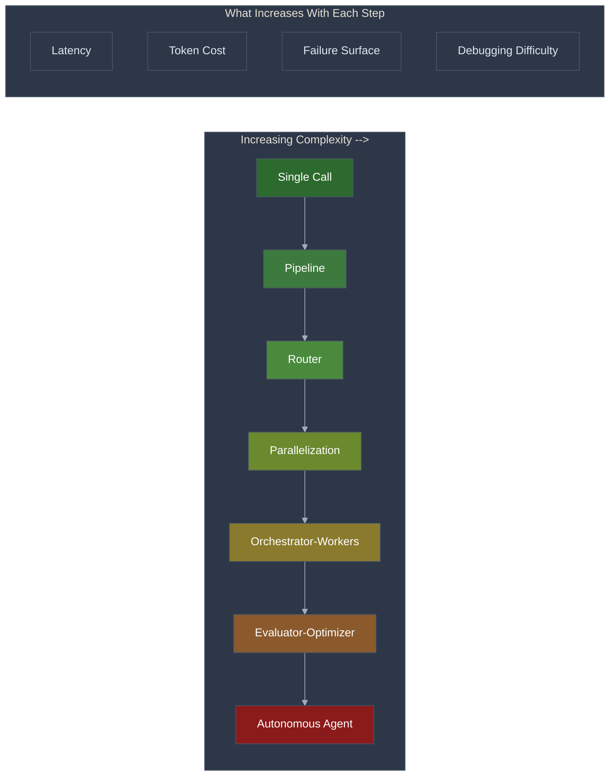
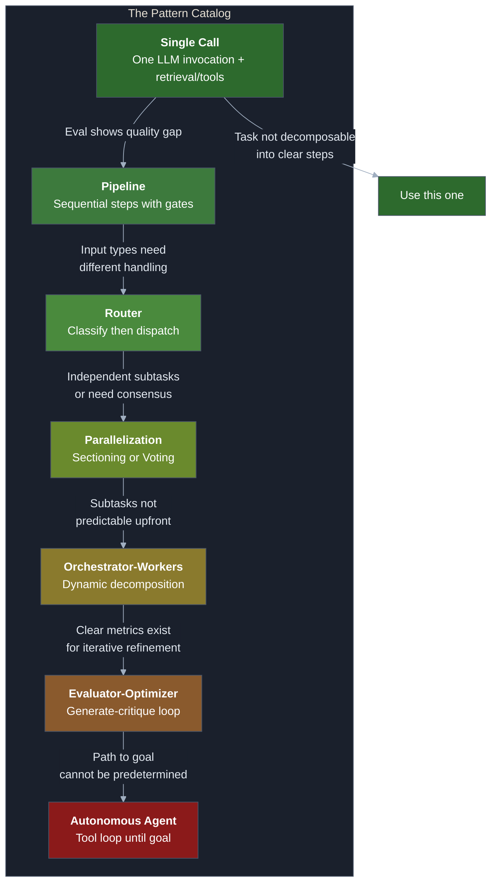
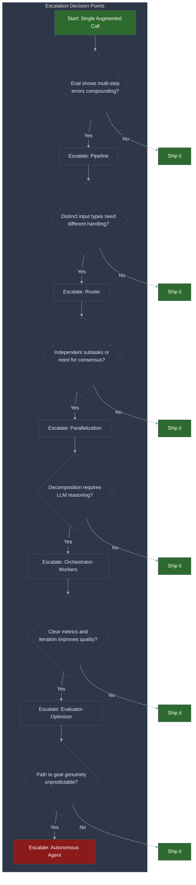
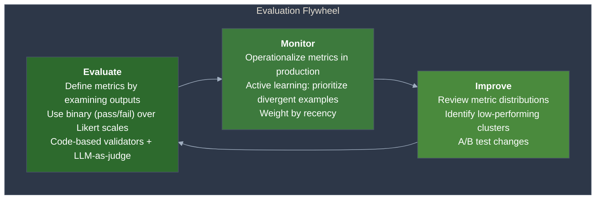

# AI-Native Solution Patterns: Matching Problems to Architectures

You can call an LLM API. You can write prompts that produce consistent output. You can retrieve external data and design tools for agents. Now you need to decide **how to wire these capabilities together** -- and the architecture you choose will determine whether your system works, not the model you pick. Most AI projects fail not because the model is wrong but because the architecture is wrong for the problem. This document is the decision guide: seven patterns, ordered by complexity, with concrete build stages and exit criteria for each.

**Prerequisites:** [LLM Fundamentals](llm-fundamentals-for-practitioners.md) (tokens, context windows, API anatomy), [Prompt Engineering](prompt-engineering.md) (system prompts, output formatting), [Context Engineering](context-engineering.md) (context budgeting, information placement), [Structured Output](structured-output-and-parsing.md) (schemas, function calling), [RAG](rag-from-concept-to-production.md) (retrieval pipelines), and [Tool Design](tool-design-for-llm-agents.md) (tool definitions, MCP). This document synthesizes all six into architectural decisions.

---

## The Core Tension

There are seven distinct architectural patterns for LLM applications. Each solves a different class of problem. The tension is this: **every pattern above the simplest one adds latency, cost, and failure surface area -- but teams consistently reach for complex patterns before proving the simple ones insufficient.** The result is systems that are harder to debug, more expensive to run, and no more accurate than a well-crafted single call would have been.

This is not a theoretical concern. [BCG research](https://www.zenml.io/blog/what-1200-production-deployments-reveal-about-llmops-in-2025) found that 89% of organizations are piloting generative AI, but only 5% achieve value at scale. The gap is not model capability. It is architectural overreach -- teams building orchestrator-worker systems when a prompt chain would suffice, or deploying autonomous agents when a router handles the actual traffic patterns.

| What teams assume | What actually happens |
|---|---|
| "We need an agent for this" | 90% of production LLM value comes from single calls and simple pipelines |
| "More sophisticated = more capable" | Each added layer multiplies failure modes and debugging difficulty |
| "We should use a framework" | Frameworks obscure prompts and responses, [making debugging harder](https://www.anthropic.com/research/building-effective-agents) |
| "RAG will ground our model" | RAG solves knowledge gaps, not reasoning gaps -- applying it to the wrong problem degrades output |
| "We need to fine-tune" | Fine-tuning solves behavioral consistency, not factual accuracy -- most teams need better prompts |
| "Our eval can wait until v2" | Without evaluation, you cannot know whether escalating complexity actually helped |

The correct approach is the **complexity escalation ladder**: start with the simplest pattern that could work, measure its performance with real evaluation data, and escalate only when the data proves the simpler approach insufficient.

---

## Failure Taxonomy

Before examining the patterns themselves, understand the five ways teams get the architecture wrong. These failures are more common than getting the model wrong, and they are harder to detect because the system appears to work -- it just works expensively, unreliably, or on the wrong problem.

### Failure 1: Premature Agent-ification

**What it looks like:** The team builds an autonomous agent with tool access and a loop when the task is a deterministic three-step pipeline with known inputs and outputs.

**Why it happens:** Agents feel like the future. They are the most visible, most discussed pattern. Engineers gravitate toward them because they are interesting to build, not because the problem demands autonomy. The [MAST taxonomy](https://arxiv.org/html/2503.13657v1) analyzed multi-agent systems and found that 79% of failures originate from specification and coordination issues, not technical implementation. ChatDev's multi-agent code generation achieved only 25% baseline accuracy, with tactical improvements yielding just +14%.

**The test:** Can you enumerate every step the system needs to take before it runs? If yes, you do not need an agent. You need a pipeline.

### Failure 2: RAG as Default Answer

**What it looks like:** Every project starts with a vector database and an embedding pipeline, regardless of whether the model actually lacks the necessary knowledge.

**Why it happens:** RAG became the first pattern most teams learned after basic prompting. It is the hammer that makes everything look like a knowledge gap. But tasks like grammar correction, content ideation, code generation from specifications, and abstract reasoning rely on linguistic competence, not factual retrieval. [Standalone LLMs perform near-optimally](https://softlandia.com/articles/building-robust-llm-solutions-3-patterns-to-avoid) on these tasks. The OpenAI Icelandic study (detailed in the Knowledge Enhancement section below) proved this empirically: adding RAG to a fine-tuned model **decreased** its BLEU score from 87 to 83.

**The test:** Is the model failing because it lacks information, or because it lacks the right behavior? If the answer is behavior, RAG will not help and may hurt.

### Failure 3: Skipping Evaluation

**What it looks like:** The team iterates by "testing a few inputs" and shipping when it "looks right." There is no golden dataset, no automated scoring, no regression detection.

**Why it happens:** Evaluation infrastructure is unglamorous. It does not produce visible features. But without it, you cannot know whether escalating from a single call to a pipeline actually improved anything. You cannot detect quality regressions after prompt changes. You cannot compare model versions. [Chip Huyen](https://huyenchip.com/2024/07/25/genai-platform.html) states it directly: "Evaluation is necessary at every step of the development process."

**The test:** If someone asked you "did last week's change make the system better or worse?", could you answer with a number?

### Failure 4: Framework Lock-in

**What it looks like:** The team adopts LangChain, CrewAI, or another orchestration framework before building a single working prototype with raw API calls.

**Why it happens:** Frameworks promise productivity. They deliver abstraction. [Anthropic's guidance](https://www.anthropic.com/research/building-effective-agents) is explicit: frameworks "often create extra layers of abstraction that can obscure the underlying prompts and responses, making them harder to debug." Some frameworks [lock you into specific providers](https://softlandia.com/articles/building-robust-llm-solutions-3-patterns-to-avoid), preventing model switching when better options emerge.

**The test:** Can you inspect the exact prompt and response for every LLM call in your system? If the framework makes this hard, it is costing you more than it is saving.

### Failure 5: The Production Cliff

**What it looks like:** The demo works. The prototype works. But production deployment stalls for months. The system cannot handle edge cases, error recovery, cost management, or monitoring at scale.

**Why it happens:** Prototypes optimistic-path through problems. Production systems must handle every path. [ZenML reports](https://www.zenml.io/blog/what-1200-production-deployments-reveal-about-llmops-in-2025) that teams often have "50 prototypes, but zero systems handling real traffic." The gap requires evaluation pipelines, guardrails, observability, and the operational maturity to treat LLM systems with the same rigor as critical infrastructure.

**The test:** Does your system have automated evaluation, error handling for every LLM call, cost monitoring, and a way to detect quality degradation without a user complaint?

---

## The Pattern Catalog

Seven patterns, ordered by complexity. Each section covers what it is, when to use it, which problems it matches, how to build it with exit criteria, and a real-world example. The canonical source is [Anthropic's "Building Effective Agents"](https://www.anthropic.com/research/building-effective-agents), extended here with build stages and decision criteria.

### Pattern 0: Single Augmented LLM Call

**What it is.** One LLM invocation, enhanced with retrieval (RAG), tools, and/or in-context examples. No loops, no orchestration. The model receives a prompt, optionally accesses external data or tools, and returns a response.

**When to use it.** Always start here. [Anthropic's guidance](https://www.anthropic.com/research/building-effective-agents): "For many applications, optimizing single LLM calls with retrieval and in-context examples is usually enough."

**Problem types that match.** Classification, extraction, summarization, translation, simple Q&A over documents, content generation with clear constraints, any task where the input-to-output mapping is straightforward.

**Build stages:**

| Stage | What you do | Exit criteria |
|---|---|---|
| 1. Baseline | Write the prompt with zero-shot instructions | Model produces structurally correct output for 5+ test inputs |
| 2. Optimize | Add few-shot examples, refine system prompt, tune temperature | Eval score meets minimum threshold on golden dataset (20+ examples) |
| 3. Augment | Add retrieval (RAG) or tool access if the model lacks knowledge | Eval score improves over stage 2 on knowledge-dependent inputs |
| 4. Harden | Add structured output, retry logic, input validation | Error rate below 1% on 100+ production-representative inputs |

**Exit to next pattern:** Eval data shows the task has distinct subtasks where errors in one corrupt the others, or where sequential reasoning is needed.

**Real-world example.** Customer support email classification. Input: email text. Output: JSON with category, priority, sentiment, and suggested routing. A single call with a well-structured prompt and few-shot examples handles this at >95% accuracy. No pipeline needed.

### Pattern 1: Prompt Chain / Pipeline

**What it is.** The task is decomposed into a fixed sequence of LLM calls, where each step's output feeds the next step's input. Programmatic code -- not the LLM -- controls the flow and can insert validation gates between steps.

**When to use it.** When the task has clear sequential steps and you can verify intermediate results. The key advantage over a single call: each step is simpler, which means higher accuracy per step and the ability to catch errors before they compound. For gate design principles, see [Quality Gates in Agentic Systems](quality-gates-in-agentic-systems.md).

**Problem types that match.** Document processing (extract then transform then validate), content generation with review (draft then edit then format), data transformation pipelines, any workflow where intermediate results should be checked.

**Build stages:**

| Stage | What you do | Exit criteria |
|---|---|---|
| 1. Decompose | Identify 2-5 sequential steps with clear inputs/outputs | Each step can be described in one sentence; no step requires backtracking |
| 2. Prototype each step | Build and eval each step independently as a single call | Each step meets its individual eval threshold |
| 3. Wire with gates | Connect steps with programmatic validation between them | Gate catches 90%+ of known failure modes from step-level eval |
| 4. End-to-end eval | Run the full pipeline on the golden dataset | Pipeline score exceeds single-call baseline by a measurable margin |

**Exit to next pattern:** Different input types require fundamentally different processing paths, or some steps are independent and latency is a concern.

**Real-world example.** Marketing copy localization. Step 1: Generate English copy from a product brief. Gate: verify copy length, tone, and required keywords. Step 2: Translate to target language. Gate: verify no English remnants, character count within bounds. Step 3: Cultural adaptation review. Gate: flag idioms or references that do not localize. Each gate is programmatic code, not an LLM judgment.

### Pattern 2: Router

**What it is.** An initial classification step directs the input to one of several specialized handlers. The router can be an LLM call, a traditional ML classifier, or rule-based logic. Each downstream handler is optimized for its specific input type.

**When to use it.** When your inputs fall into distinct categories that benefit from different prompts, different models, or different processing logic. Routers enable cost optimization (simple queries to smaller models) and quality optimization (specialized prompts per category).

**Problem types that match.** Customer service (general/billing/technical), document processing (contracts/invoices/emails), code assistance (generation/debugging/review), any system where a single prompt cannot efficiently handle the full input distribution.

**Build stages:**

| Stage | What you do | Exit criteria |
|---|---|---|
| 1. Identify categories | Analyze production inputs for natural clusters | 3-7 categories cover 95%+ of input volume |
| 2. Build the router | Implement classification (LLM, ML model, or rules) | Router accuracy >95% on labeled test set |
| 3. Build specialized handlers | Create optimized single-call or pipeline for each category | Each handler meets its category-specific eval threshold |
| 4. Add fallback | Handle inputs that do not match any category | Fallback path produces acceptable (not optimal) output for unrouted inputs |

**Exit to next pattern:** Multiple handlers need to run simultaneously, or you need consensus from multiple perspectives.

**Real-world example.** Code assistant triage. Router classifies incoming requests as: generation (write new code), debugging (find and fix bugs), review (analyze existing code), or explanation (describe what code does). Each handler uses a different system prompt, different few-shot examples, and potentially different model tiers. Simple explanations route to a smaller, faster model. Complex generation routes to the most capable model.

### Pattern 3: Parallelization

Two distinct sub-patterns serve different purposes.

**Sectioning** splits independent subtasks to run simultaneously. Use when the task decomposes into parts with no dependencies between them and latency matters. Example: analyzing a document for compliance issues, financial risks, and legal concerns simultaneously -- three independent assessments that can merge at the end.

**Voting** runs the same task multiple times and aggregates results. Use when you need higher confidence than a single call provides. Example: running three independent vulnerability assessments on the same code and flagging issues that appear in 2+ results.

**Build stages:**

| Stage | What you do | Exit criteria |
|---|---|---|
| 1. Identify parallelism | Confirm subtasks are genuinely independent (sectioning) or define voting threshold (voting) | No subtask requires output from another; or voting threshold defined |
| 2. Implement branches | Build each parallel branch as a single call or pipeline | Each branch meets individual eval thresholds |
| 3. Build aggregator | Merge results programmatically (sectioning) or implement voting logic | Aggregated output is internally consistent; voting threshold produces fewer false positives than single calls |
| 4. Measure improvement | Compare parallel approach vs sequential baseline | Latency improvement (sectioning) or accuracy improvement (voting) justifies the added cost |

**Exit to next pattern:** Subtasks cannot be predetermined -- the decomposition itself requires LLM reasoning.

### Pattern 4: Orchestrator-Workers

**What it is.** A central LLM (the orchestrator) analyzes the task, decomposes it into subtasks dynamically, delegates each subtask to a worker (which can be any of the simpler patterns), and synthesizes the results. Unlike parallelization, the subtasks are not known in advance.

**When to use it.** When the decomposition itself is part of the problem. The orchestrator must reason about what needs to be done, not just execute a predetermined plan.

**Problem types that match.** Multi-file code changes where the orchestrator determines which files need modification, research tasks where the search strategy depends on initial findings, complex document generation where sections depend on analysis results.

**Build stages:**

| Stage | What you do | Exit criteria |
|---|---|---|
| 1. Define orchestrator scope | Specify what the orchestrator can decompose and what tools/workers are available | Orchestrator prompt clearly lists available workers and their capabilities |
| 2. Build workers | Implement each worker as a single call, pipeline, or router | Each worker handles its designated task type reliably in isolation |
| 3. Implement orchestration | Build the decompose-delegate-synthesize loop | Orchestrator produces valid decompositions for 90%+ of test inputs |
| 4. Add guardrails | Limit iterations, token budget, worker call count | System cannot run away; maximum cost per request is bounded |

**Exit to next pattern:** The task requires iterative refinement against clear quality criteria rather than one-shot decomposition.

**Real-world example.** Automated code refactoring. User provides a refactoring goal ("convert all callbacks to async/await"). Orchestrator scans the codebase, identifies affected files, determines dependency order, delegates file-level transformations to workers, and synthesizes a consistent changeset. The set of files is not known until the orchestrator analyzes the code.

### Pattern 5: Evaluator-Optimizer

**What it is.** A generator LLM produces output. A separate evaluator LLM (or programmatic check) scores the output against defined criteria. If the score falls below threshold, the evaluation feedback is fed back to the generator for another attempt. The loop continues until quality criteria are met or an iteration limit is reached.

**When to use it.** When you have clear, measurable evaluation criteria and iterative refinement demonstrably improves output quality. The evaluator must be independent of the generator -- see [LLM Role Separation: Executor vs Evaluator](llm-role-separation-executor-evaluator.md) for why shared cognition corrupts judgment.

**Problem types that match.** Code generation with test suites (run tests as evaluation), content production with style guidelines (evaluate against rubric), translation with quality metrics, any task where "grade the output" is well-defined.

**Build stages:**

| Stage | What you do | Exit criteria |
|---|---|---|
| 1. Define evaluation criteria | Create a rubric or automated check that scores output | Evaluator agrees with human judgment on 85%+ of test cases |
| 2. Build generator | Implement the initial generation as a single call | Generator produces acceptable output on 60%+ of inputs (the evaluator loop will improve the rest) |
| 3. Build evaluator | Implement scoring -- ideally a different model or programmatic check, not the generator self-evaluating | Evaluator identifies real quality gaps (not false failures); see [Quality Gates](quality-gates-in-agentic-systems.md) for gate reliability |
| 4. Wire the loop | Connect generator and evaluator with iteration limits | 80%+ of initially-failing outputs improve within 3 iterations; loop terminates within budget |

**Exit to next pattern:** The path to the goal cannot be predetermined -- the system needs to choose its own actions in an open-ended environment.

**Real-world example.** Literary translation. Generator translates a passage. Evaluator (a different model instance with a detailed rubric) scores for meaning preservation, natural fluency, cultural adaptation, and stylistic consistency. Feedback like "the metaphor in paragraph 2 was translated literally; adapt it for the target culture" goes back to the generator. Two to three iterations typically converge.

### Pattern 6: Autonomous Agent

**What it is.** An LLM operates in a loop, choosing actions (tool calls) based on its current state and observations, continuing until it achieves a goal or hits a termination condition. The LLM controls both the plan and the execution. This is the most powerful and most dangerous pattern.

**When to use it.** Only when the path to the goal cannot be predetermined and the task genuinely requires open-ended exploration. [Simon Willison](https://simonwillison.net/2025/Dec/31/the-year-in-llms/) defines it concisely: "an LLM agent runs tools in a loop to achieve a goal."

**Problem types that match.** Open-ended research tasks, complex debugging where the investigation path depends on findings, multi-step system administration, SWE-bench-style issue resolution. These represent a small fraction of real-world use cases.

**Build stages:**

| Stage | What you do | Exit criteria |
|---|---|---|
| 1. Define goal and tools | Specify the agent's objective and the tools it can use | Goal is verifiable; tool definitions follow [Tool Design](tool-design-for-llm-agents.md) principles |
| 2. Sandbox | Implement execution boundaries -- file system limits, network restrictions, cost caps | Agent cannot cause irreversible damage; maximum cost per run is bounded |
| 3. Build the loop | Implement the observe-think-act cycle with state management | Agent completes 3+ representative tasks in sandbox without intervention |
| 4. Add human checkpoints | Define which actions require human approval | High-consequence actions (deployments, external communications, data deletion) always require approval |
| 5. Monitor and evaluate | Implement run-level logging, cost tracking, and outcome evaluation | Every run can be replayed; success rate is measured on a benchmark |

**Real-world example.** Automated issue resolution in a codebase. Agent receives a bug report, reads the codebase to understand the system, reproduces the bug, identifies the root cause, writes a fix, runs tests, and submits a pull request. Each step depends on the previous step's findings. SWE-bench benchmarks this exact workflow.

**The cost reality.** Autonomous agents are 5-10x more expensive than orchestrator-worker patterns for the same task, due to exploration overhead and backtracking. Reserve them for problems where the exploration itself is the value.

---

## The Complexity Escalation Ladder

The patterns above form a strict escalation order. The rule: **start at Pattern 0 and escalate only when evaluation data proves the current pattern insufficient.**

Each escalation requires evidence, not intuition:
- **"I think we need a pipeline"** is not evidence. **"Eval shows 30% of errors occur because step 2 receives corrupted output from step 1"** is evidence.
- **"We should probably add an agent"** is not evidence. **"The decomposition varies unpredictably across inputs and cannot be templated"** is evidence.

[Anthropic's framing](https://www.anthropic.com/research/building-effective-agents): "Start with simple prompts, optimize them with comprehensive evaluation, and add multi-step agentic systems only when simpler solutions fall short." [Chip Huyen](https://huyenchip.com/2024/07/25/genai-platform.html) reinforces this: "While it's tempting to jump straight to an orchestration tool when starting a project, start building your application without one first."

---

## The Knowledge Enhancement Track

Orthogonal to the pattern catalog is the question of how to give the model the right knowledge and behavior. Four approaches exist on a spectrum, and they stack -- but only when each addresses a distinct problem.

| Approach | What it solves | Cost to implement | When to use |
|---|---|---|---|
| **Prompt engineering** | Behavioral and contextual issues | Low (minutes to hours) | Always start here |
| **RAG** | Knowledge gaps -- model needs facts it does not have | Medium (days to weeks) | Model lacks domain-specific or recent information |
| **Fine-tuning** | Behavioral consistency -- model needs learned patterns | High (weeks, requires data) | Model needs consistent style, format, or domain behavior across thousands of inputs |
| **Distillation** | Cost/latency -- transfer capability from large to small model | High (requires labeled data from the large model) | Production constraints demand a smaller, cheaper model |

### The OpenAI Icelandic Study

The most concrete data on when to use which approach comes from [OpenAI's optimization guide](https://platform.openai.com/docs/guides/optimizing-llm-accuracy), which tested grammar correction on the Icelandic Errors Corpus with 1,000 training examples:

| Approach | BLEU Score | Delta from baseline |
|---|---|---|
| GPT-4 zero-shot | 62 | -- |
| GPT-4 + 3 few-shot examples | 70 | +8 |
| GPT-3.5-turbo fine-tuned (1,000 examples) | 78 | +16 |
| **GPT-4 fine-tuned (1,000 examples)** | **87** | **+25** |
| GPT-4 fine-tuned + RAG | 83 | -4 from fine-tuned alone |

The critical finding: **RAG decreased performance when added to the fine-tuned model** (87 to 83). Grammar correction is a behavioral task -- the model needs to learn patterns of correct Icelandic, not retrieve facts. Adding retrieval introduced noise that degraded the learned behavior.

### Decision Framework

The diagnostic question is not "should we use RAG?" but rather **"is the model failing because it lacks information, or because it lacks the right behavior?"**

- **Lacks information** (cannot answer questions about your proprietary data, does not know about events after training cutoff, needs to cite specific sources): RAG. See [RAG: From Concept to Production](rag-from-concept-to-production.md) for implementation.
- **Lacks behavior** (inconsistent output format, wrong tone, does not follow domain conventions, makes the same category of mistake repeatedly): Fine-tuning.
- **Lacks both**: Fine-tune first for behavior, then add RAG for knowledge. But measure each addition independently -- as the Icelandic study shows, stacking does not always help.
- **Needs to be cheaper/faster**: Distillation. Generate labeled data from the large model, fine-tune a smaller model on it.

---

## The Evaluation Flywheel

Evaluation is not a phase. It is the mechanism that drives every decision in this document -- which pattern to use, when to escalate, whether a knowledge enhancement helped, and whether the production system is degrading.

[Shreya Shankar's framework](https://www.sh-reya.com/blog/ai-engineering-flywheel/) defines three interlocking stages:

**Stage 1 -- Evaluate.** Define success metrics by examining actual outputs, not theorizing. Use binary metrics (pass/fail) over Likert scales because they are easier to align across annotators. Implement both code-based validators (format checks, constraint satisfaction) and LLM-as-judge evaluators (quality, relevance, accuracy). Validate inputs as well as outputs.

**Stage 2 -- Monitor.** Deploy evaluation metrics in production. Use active learning to prioritize examples where human judgment diverged from automated scores. Weight recent examples more heavily -- quality requirements shift as the product evolves.

**Stage 3 -- Improve.** Identify failure clusters from monitoring data. Run controlled experiments (new prompt vs old prompt on the same inputs). Measure. Ship only when the improvement is statistically significant.

The flywheel connects to every decision in this document:
- **Pattern selection:** "Should I escalate from a single call to a pipeline?" Run the eval. If the single call scores 94% and your threshold is 90%, stay.
- **Knowledge enhancement:** "Should I add RAG?" Run the eval with and without retrieval. If retrieval does not improve the score, do not add it.
- **Production readiness:** "Are we ready to ship?" Run the eval on production-representative data. If the score meets threshold, ship. If not, iterate.

---

## Recommendations

### Short-term: Establish the Foundation

1. **Build evaluation before building architecture.** Create a golden dataset of 20+ examples with expected outputs. Implement automated scoring. This is not optional -- it is the prerequisite for every other decision.
2. **Start at Pattern 0.** Build a single augmented LLM call for your task. Measure it. You may be done.
3. **Use raw API calls, not frameworks.** Build your first working version with direct LLM API calls. You can adopt a framework later if the complexity warrants it -- and by then you will know exactly what the framework needs to do.

### Medium-term: Escalate with Evidence

4. **Escalate one level at a time.** When eval data shows a specific failure mode, move to the next pattern that addresses it. Do not skip levels.
5. **Diagnose before enhancing.** Before adding RAG or fine-tuning, determine whether the failure is a knowledge gap or a behavior gap. Apply the right tool.
6. **Instrument everything.** Log every LLM call's prompt, response, latency, and token count. You will need this data to diagnose problems and justify architectural decisions.

### Long-term: Production Maturity

7. **Run the flywheel continuously.** Evaluation is not a one-time activity. Production data should feed back into your eval dataset. Quality metrics should be monitored as rigorously as latency and error rates.
8. **Design for the simplest pattern that works at scale.** A well-optimized pipeline will outperform a poorly instrumented agent every time. Complexity is not a feature.

---

## The Hard Truth

The most capable architecture for your problem is almost certainly simpler than what you are building. The industry's obsession with agents, multi-agent systems, and complex orchestration frameworks has produced a generation of AI applications that are expensive to run, impossible to debug, and no more accurate than a well-crafted pipeline would have been.

The reason this keeps happening is not technical. It is social. Agents are interesting. Pipelines are boring. Conference talks about autonomous AI systems attract audiences. Conference talks about "we used a single LLM call with good prompting" do not. But the 5% of organizations achieving AI value at scale are not the ones with the most sophisticated architectures. They are the ones who measured relentlessly, started simple, and escalated only when the data demanded it.

If you take one thing from this document: **your evaluation infrastructure is more important than your architectural pattern.** A single call with excellent eval will outperform an autonomous agent with no eval. Every time.

---

## Summary Checklist

| Question | Good Answer | Bad Answer |
|---|---|---|
| Did you start with a single augmented LLM call? | Yes, and we measured its performance | No, we started with an agent/framework |
| Can you explain why you chose your current pattern? | Eval data showed specific failure modes the simpler pattern could not handle | It felt like the right level of complexity |
| Do you have a golden evaluation dataset? | Yes, 20+ examples with expected outputs and automated scoring | We test manually with a few inputs |
| Is your model failing from lack of knowledge or lack of behavior? | We diagnosed it specifically before choosing RAG vs fine-tuning | We added RAG because that is what everyone does |
| Can you inspect the exact prompt and response for every LLM call? | Yes, all calls are logged with full context | The framework handles that |
| Does escalating complexity measurably improve your eval scores? | Yes, we measured before and after | We assume more sophisticated = better |
| Do you have cost monitoring per pattern/request? | Yes, with alerts for anomalous spending | We check the bill monthly |
| Can you detect quality degradation without user complaints? | Yes, automated eval runs continuously on production traffic | We learn about problems from support tickets |
| Is your evaluation infrastructure running before your first production deploy? | Yes, it was the first thing we built | We plan to add evaluation in v2 |
| Could a simpler pattern achieve 90% of your current quality at 30% of the cost? | We tested this and the current pattern is justified | We have not tried simplifying |

---

## References

### Primary Sources

- **Anthropic, "Building Effective Agents"** -- The canonical pattern catalog defining the seven patterns and the complexity escalation principle. [https://www.anthropic.com/research/building-effective-agents](https://www.anthropic.com/research/building-effective-agents)

- **OpenAI, "Optimizing LLM Accuracy"** -- Contains the Icelandic Errors Corpus study with BLEU scores across optimization strategies. [https://platform.openai.com/docs/guides/optimizing-llm-accuracy](https://platform.openai.com/docs/guides/optimizing-llm-accuracy)

### Practitioner Articles

- **Shreya Shankar, "Data Flywheels for LLM Applications"** -- The three-stage evaluation flywheel framework with implementation specifics. [https://www.sh-reya.com/blog/ai-engineering-flywheel/](https://www.sh-reya.com/blog/ai-engineering-flywheel/)

- **Chip Huyen, "Building A Generative AI Platform"** -- Complete GenAI platform architecture with emphasis on evaluation at every step. [https://huyenchip.com/2024/07/25/genai-platform.html](https://huyenchip.com/2024/07/25/genai-platform.html)

- **Simon Willison, "The Year in LLMs (2025)"** -- Evolution of agent definitions and pragmatic framing. [https://simonwillison.net/2025/Dec/31/the-year-in-llms/](https://simonwillison.net/2025/Dec/31/the-year-in-llms/)

- **Softlandia, "3 LLM Anti-Patterns to Avoid"** -- Concrete anti-patterns including naive RAG and framework lock-in. [https://softlandia.com/articles/building-robust-llm-solutions-3-patterns-to-avoid](https://softlandia.com/articles/building-robust-llm-solutions-3-patterns-to-avoid)

- **FreeCodeCamp, "Evaluation Flywheel"** -- Four-stage flywheel implementation with a customer support chatbot example. [https://www.freecodecamp.org/news/how-to-test-and-improve-ai-applications-with-an-evaluation-flywheel/](https://www.freecodecamp.org/news/how-to-test-and-improve-ai-applications-with-an-evaluation-flywheel/)

### Research

- **Cemri et al., "Why Do Multi-Agent LLM Systems Fail?" (2025)** -- The MAST taxonomy identifying 14 failure modes; 79% of problems from specification/coordination issues. [https://arxiv.org/html/2503.13657v1](https://arxiv.org/html/2503.13657v1)

### Industry Reports

- **ZenML, "What 1,200 Production Deployments Reveal About LLMOps in 2025"** -- BCG data showing 5% of organizations achieve AI value at scale. [https://www.zenml.io/blog/what-1200-production-deployments-reveal-about-llmops-in-2025](https://www.zenml.io/blog/what-1200-production-deployments-reveal-about-llmops-in-2025)

### Architecture References

- **Google Cloud, "Choose a Design Pattern for Your Agentic AI System"** -- Extended pattern catalog with 12 patterns and decision framework. [https://docs.cloud.google.com/architecture/choose-design-pattern-agentic-ai-system](https://docs.cloud.google.com/architecture/choose-design-pattern-agentic-ai-system)

- **Latent Space / Swyx, "Agent Engineering"** -- The IMPACT framework and the observation that workflows get steamrolled by intelligence gains. [https://www.latent.space/p/agent](https://www.latent.space/p/agent)

### Cross-references Within This Series

- [RAG: From Concept to Production](rag-from-concept-to-production.md) -- Detailed RAG implementation when Pattern 0's augmentation involves retrieval
- [Tool Design for LLM Agents](tool-design-for-llm-agents.md) -- How to design the tool interface for Patterns 4-6
- [LLM Role Separation: Executor vs Evaluator](llm-role-separation-executor-evaluator.md) -- Why the evaluator in Pattern 5 must be independent of the generator
- [Quality Gates in Agentic Systems](quality-gates-in-agentic-systems.md) -- Gate design principles for pipeline steps in Patterns 1-4
