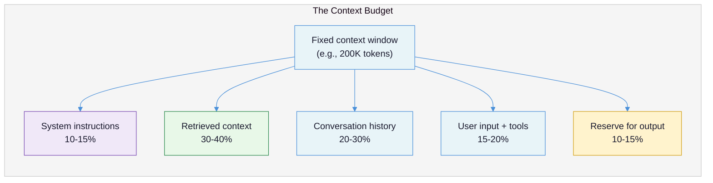
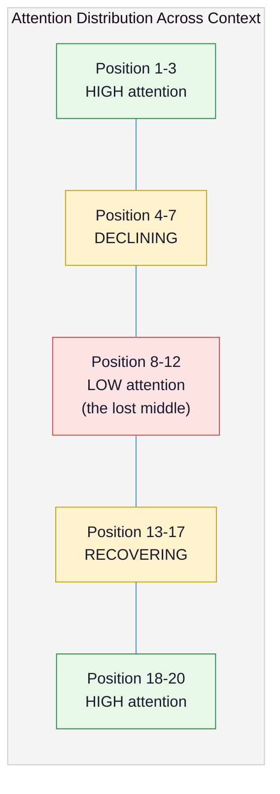
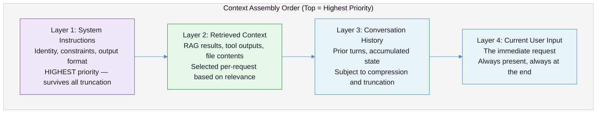
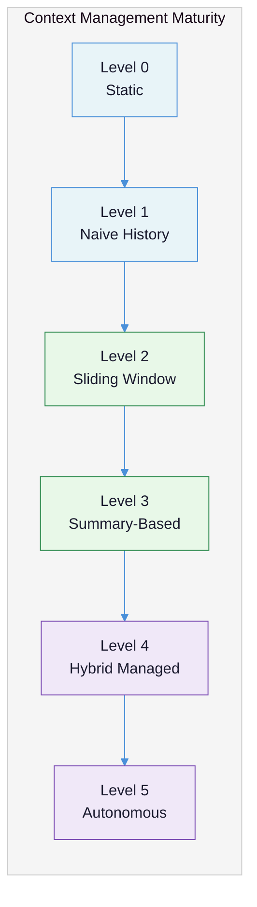
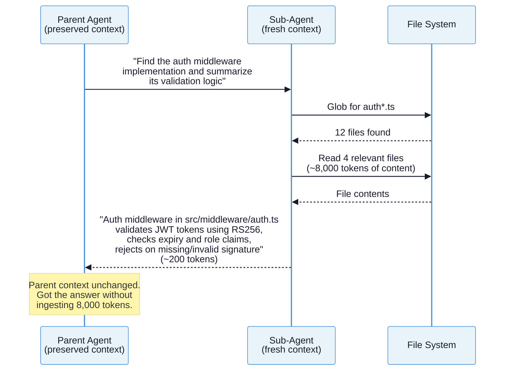
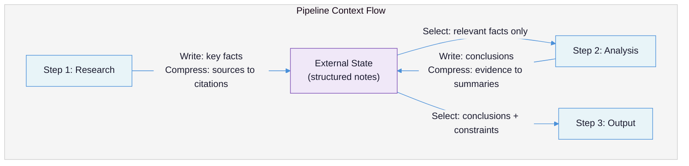

# Context Engineering: The Discipline of Deciding What the Model Sees

You can write a good prompt. You can call an LLM API. But every production system that handles conversations, retrieves documents, or coordinates multiple LLM calls will eventually hit the same wall: **the context window is finite, and what you put into it determines everything the model can do.** Context engineering is the practice of deciding what goes in, what stays out, and why. It is the skill that separates systems that work from systems that fail silently.

This document covers the context window as a resource to be budgeted, the structural patterns that determine information placement, the failure modes that emerge when context is mismanaged, and the techniques that production systems use to keep their context windows effective as conversations grow and pipelines deepen.

**Prerequisites:** [LLM Fundamentals](llm-fundamentals-for-practitioners.md) (tokens, context windows, API call anatomy) and [Prompt Engineering](prompt-engineering.md) (system prompt structure, few-shot examples). This document builds directly on both.

---

## The Core Tension

Prompt engineering teaches you how to write instructions. Context engineering teaches you what to put *around* those instructions -- and what to leave out. The distinction matters because **every token spent on instructions, history, or retrieved documents is a token not available for the model's reasoning and output.** The context window is not a container you fill. It is a budget you spend.

The tension is this: models need context to produce relevant output, but models degrade when given too much context, irrelevant context, or context in the wrong position. More is not better. The right information, in the right position, at the right density -- that is better.

| What teams assume | What actually happens |
|---|---|
| "Bigger context window = I can include more" | Attention degrades with volume; accuracy can drop below the no-context baseline ([Liu et al., 2024](https://arxiv.org/abs/2307.03172)) |
| "I'll include everything just in case" | Irrelevant context introduces noise that actively degrades output quality |
| "Context management is an optimization" | Context management is a correctness requirement -- get it wrong and the model produces wrong answers confidently |
| "RAG always helps" | RAG dropped a fine-tuned model's BLEU score from 87 to 83 on a task it had already learned ([OpenAI](https://platform.openai.com/docs/guides/optimizing-llm-accuracy)) |
| "Sub-agents are for role specialization" | Sub-agents are for context isolation -- preventing one task's context from polluting another's ([Horthy](https://github.com/humanlayer/advanced-context-engineering-for-coding-agents/blob/main/ace-fca.md)) |
| "I'll figure out context management later" | Context problems are architecture problems -- retrofitting them is expensive |

Andrej Karpathy put it directly: context engineering is *"the delicate art and science of filling the context window with just the right information for the next step"* ([Karpathy, 2025](https://x.com/karpathy/status/1937902205765607626)). Simon Willison endorsed the term because its *"inferred definition is much closer to the intended meaning"* than "prompt engineering," which too many people interpret as *"a laughably pretentious term for typing things into a chatbot"* ([Willison, 2025](https://simonwillison.net/2025/jun/27/context-engineering/)).



The CPU/RAM mental model is useful here: the LLM is the CPU, and the context window is RAM ([O'Reilly](https://www.oreilly.com/radar/context-engineering-bringing-engineering-discipline-to-prompts-part-1/)). You cannot run a program that requires more RAM than you have. You cannot process information that does not fit in the context window. And just like RAM, filling it to capacity degrades performance long before you hit the hard limit.

---

## Failure Taxonomy

Context engineering failures are insidious because the system still produces output. It just produces *worse* output, and you may not notice until the damage is done. These are the six ways context management breaks down.

### Failure 1: Context Flooding

**What it looks like:** The system dumps everything it has -- full documents, complete tool outputs, raw search results, entire conversation histories -- into the context window. Output quality degrades gradually, then catastrophically.

**Why it happens:** Teams treat the context window as a "just in case" buffer rather than a budget. The instinct is to include everything because excluding something might cause the model to miss it. This instinct is wrong.

**Example:** A coding agent runs `grep` across a repository and injects 15,000 lines of results into the context window. The agent was looking for a specific function signature. It found it in line 47. The other 14,953 lines are noise that displaces the agent's instructions, prior reasoning, and the user's actual request. The agent then produces a response that ignores the user's constraints because those constraints have been pushed into the low-attention middle of a bloated context.

Dex Horthy identifies this as one of the primary anti-patterns in coding agents: *"Context flooding -- letting search operations, build logs, and JSON blobs overwhelm the window"* ([Horthy](https://github.com/humanlayer/advanced-context-engineering-for-coding-agents/blob/main/ace-fca.md)). His recommendation: target **40-60% context utilization**, not 90-100%.

### Failure 2: The Lost Middle

**What it looks like:** The system positions critical information in the middle of a long context. The model produces output that ignores or contradicts this information, despite it being present in the input.

**Why it happens:** Transformer attention is not uniform across positions. The Stanford/UC Berkeley "Lost in the Middle" study demonstrated that model performance follows a **U-shaped curve**: highest accuracy when relevant information is at the beginning or end of the context, lowest when it is in the middle ([Liu et al., 2024](https://arxiv.org/abs/2307.03172)).

**Example:** GPT-3.5-Turbo was tested on a multi-document QA task with 20 documents. When the answer document was positioned 10th out of 20, accuracy dropped to **52.9%** -- which is *lower than the closed-book baseline of 56.1%*. The model performed worse with the answer present but poorly positioned than with no documents at all. Twenty percentage points separated the best position (beginning) from the worst (middle).



### Failure 3: Context Poisoning via RAG

**What it looks like:** A system retrieves documents to augment the model's knowledge, but the retrieved content degrades output quality instead of improving it.

**Why it happens:** Two mechanisms. First, retrieval is imprecise -- the system pulls in documents that are topically related but factually irrelevant or contradictory, and the model treats them as authoritative. Second, for tasks the model has already learned, additional context introduces noise rather than signal.

**Example:** OpenAI tested GPT-4 fine-tuned on 1,000 examples from the Icelandic Errors Corpus (correcting Icelandic grammar). The fine-tuned model achieved a BLEU score of 87. When they added RAG with 1,000 additional contextual examples via vector database, **performance dropped to 83**. OpenAI's analysis: *"RAG actually confounded the model by giving it extra noise when it had already learned the task effectively through fine-tuning"* ([OpenAI](https://platform.openai.com/docs/guides/optimizing-llm-accuracy)). The task was behavior optimization (learning correction patterns), not knowledge retrieval. Additional context did not help because the model had already internalized the patterns.

### Failure 4: History Accumulation

**What it looks like:** A multi-turn conversation degrades in quality over time. Early responses are sharp and relevant. After 30-50 turns, the model starts ignoring constraints, repeating itself, or producing generic output.

**Why it happens:** Every API call in a multi-turn conversation re-sends the full conversation history. A 60-turn customer support conversation can consume 100K+ tokens of history alone, leaving almost no budget for the system prompt, retrieved context, or the model's reasoning. The system prompt -- which contains the model's instructions and constraints -- gets pushed deeper into the context as history accumulates, falling into the low-attention middle zone.

**Example:** A customer support bot with a 128K context window works well for the first 20 turns. By turn 60, the conversation history alone consumes 100K tokens. The system prompt (5K tokens) is now positioned between two massive blocks of conversation text. The model starts violating its constraints -- offering unauthorized refunds, making promises outside its scope -- because the instructions specifying those constraints are in the lost middle. (See [LLM Fundamentals](llm-fundamentals-for-practitioners.md) for the token math behind this failure.)

### Failure 5: Pipeline Context Loss

**What it looks like:** A multi-step pipeline produces inconsistent or contradictory output across steps. Step 3 ignores decisions made in step 1. The final output feels like it was assembled from unrelated fragments.

**Why it happens:** Each step in a pipeline gets its own context window. If the pipeline passes raw output from step N to step N+1 without curation, critical decisions, constraints, and reasoning from earlier steps may be lost or buried. If it passes too little, later steps lack the context needed for coherent output.

**Example:** A document analysis pipeline has three steps: (1) extract key facts, (2) identify contradictions, (3) generate summary. Step 1 extracts 50 facts. Step 2 receives all 50 and identifies 3 contradictions. Step 3 receives only the summary from step 2 but not the original facts. The final summary references "the key contradiction on page 7" without specifying what it is, because the actual fact from step 1 was not passed through.

### Failure 6: Role Anthropomorphization

**What it looks like:** A system creates sub-agents named "researcher," "editor," "reviewer" -- each with its own persona instructions and conversation history. The agents are slow, expensive, and their outputs are inconsistent because each operates with a different view of the problem.

**Why it happens:** Teams design sub-agents around *roles* instead of around *context requirements*. They anthropomorphize what should be a context management decision into a staffing decision.

**Why it matters:** Dex Horthy states the principle directly: *"Subagents are not about playing house and anthropomorphizing roles. Subagents are about context control"* ([Horthy](https://github.com/humanlayer/advanced-context-engineering-for-coding-agents/blob/main/ace-fca.md)). The most common legitimate use case for a sub-agent is **using a fresh context window for a search/summarize operation** so the parent agent's context is not polluted with thousands of tokens of file contents or search results. The role is incidental. The context isolation is the point.

---

## The Context Structure Hierarchy

Every LLM call assembles a context from multiple sources. The structure and priority of these sources determines what the model pays attention to and what it ignores. Understanding this hierarchy is the foundation of context engineering.

### The Four Layers



**Layer 1: System instructions.** The model's identity, behavioral constraints, output format requirements, and domain-specific rules. This layer must be protected at all costs. When you must truncate, system instructions are the last thing to cut. Place them at the very beginning of the context where attention is highest.

**Layer 2: Retrieved context.** Documents from RAG, tool outputs, file contents, API responses. This layer is *selected per-request* -- different queries should retrieve different context. The selection mechanism (retrieval quality, reranking, relevance filtering) is what determines whether this layer helps or hurts.

**Layer 3: Conversation history.** Prior user messages and assistant responses. This layer grows linearly with conversation length and is the primary target for compression techniques. It provides continuity but becomes increasingly expensive and decreasingly useful as it accumulates.

**Layer 4: Current user input.** The immediate request. This is always present and should be positioned at the end of the context where attention is high. Place the query *after* any retrieved documents, not before -- Anthropic's research shows this improves response quality by up to 30% on complex multi-document inputs ([Prompt Engineering](prompt-engineering.md), Principle 1).

### Truncation Priority

When the context window is full, cut in this order:

1. **First to cut:** Old conversation history (compress or summarize)
2. **Second to cut:** Low-relevance retrieved documents (improve retrieval precision)
3. **Third to cut:** Tool outputs (summarize rather than include raw output)
4. **Last to cut:** System instructions (never truncate these)
5. **Never cut:** Current user input

This ordering reflects a fundamental asymmetry: system instructions and the current query define what the model *should do*, while history and retrieved context provide information for *how to do it*. Losing the "how" produces a less informed response. Losing the "what" produces a wrong one.

---

## The Context Management Spectrum

Not all systems need the same level of context management sophistication. The right approach depends on your conversation length, pipeline depth, and retrieval complexity. This spectrum helps you identify where your system sits and what techniques it needs.

### Level 0: Static Context

**Characteristics:** Single-turn interactions. The entire context is assembled once per request. No history management needed.

**Example:** A classification endpoint that receives a document and returns a category. System prompt + document + output format = done.

**Techniques needed:** Prompt structure, output format specification. Nothing else.

### Level 1: Naive History

**Characteristics:** Multi-turn conversations where the full history is re-sent on every call. Works until the history exceeds the context window.

**Example:** A chatbot that appends every user message and assistant response to a growing array. Works for 10-20 turns, then starts truncating from the front.

**Techniques needed:** A maximum history length. Front-truncation (drop oldest messages first). This is the minimum viable approach and it is fragile -- truncating from the front can delete the system prompt or early instructions that established the conversation's constraints.

### Level 2: Sliding Window

**Characteristics:** A fixed-size buffer of recent messages. Older messages are dropped as new ones arrive. The system prompt is pinned outside the window.

**Example:** Keep the last 10 turns (20 messages) in the context window. System prompt is always prepended. When turn 11 arrives, turn 1 is dropped.

**Techniques needed:** System prompt pinning, message counting, and an understanding that any information from dropped turns is permanently lost. Suitable for bounded conversations where older context rarely matters (e.g., quick Q&A, simple task completion).

### Level 3: Summary-Based Compression

**Characteristics:** Older messages are periodically summarized rather than dropped. The system maintains a running summary of the conversation plus a buffer of recent verbatim messages.

**Example:** Keep the last 5 turns verbatim. Everything older is compressed into a summary paragraph that captures key decisions, established facts, and user preferences. The summary is updated each time messages rotate out of the verbatim window.

**Techniques needed:** A summarization step (can use the same LLM or a cheaper one), summary quality monitoring, and a strategy for what to preserve in the summary vs. what to discard. The critical insight from mem0.ai: **summarization and memory formation are different operations** -- summarization compresses entire conversations into shorter text, inevitably losing detail, while memory formation selectively identifies specific facts, preferences, and patterns worth remembering ([mem0.ai](https://mem0.ai/blog/llm-chat-history-summarization-guide-2025)). Memory formation is more effective for long-running systems.

### Level 4: Hybrid Managed Context

**Characteristics:** Multiple context management strategies combined. Recent messages are verbatim, older messages are summarized, retrieved context is dynamically selected per-turn, and sub-agents handle search/retrieval in isolated context windows.

**Example:** A customer support system that maintains: (a) a summary of the full conversation, (b) verbatim last 7 turns, (c) per-turn RAG retrieval from the knowledge base, (d) sub-agents for policy lookup that return 1,000-2,000 token summaries instead of raw documents.

**Techniques needed:** All techniques from prior levels plus dynamic context assembly, sub-agent orchestration, and token budget monitoring.

### Level 5: Autonomous Context Management

**Characteristics:** The system actively manages its own context using external memory, structured note-taking, and strategic context resets. It can discard its entire conversation history and reconstruct working state from persistent storage.

**Example:** Anthropic's approach for long-running agents: agents maintain persistent external memory (files, notes, structured data), consult this memory after context resets, and use sub-agents that return condensed summaries ([Anthropic](https://www.anthropic.com/engineering/effective-context-engineering-for-ai-agents)). The context window is a *working scratchpad*, not the source of truth.

**Techniques needed:** External memory systems, strategic compaction, autonomous decision-making about what to remember and what to discard, self-directed context curation.



---

## Principles of Effective Context Engineering

### Principle 1: Budget Your Context Like Memory, Not Storage

**Why it works:** The context window is RAM, not a hard drive. You do not archive information in it. You load exactly what you need for the current operation, and you unload it when you are done. Teams that treat the context window as storage fill it with "just in case" information and then wonder why output quality degrades.

**How to apply:** Define explicit token budgets for each context layer before building your system. Here are reference budgets for three common system types:

**Single-turn API endpoint (classification, extraction, transformation):**

| Component | Budget | Tokens (128K window) |
|---|---|---|
| System instructions | 10% | 12,800 |
| Input document | 60% | 76,800 |
| Output reserve | 30% | 38,400 |

**Multi-turn conversational agent:**

| Component | Budget | Tokens (200K window) |
|---|---|---|
| System instructions | 10% | 20,000 |
| Retrieved context (RAG) | 25% | 50,000 |
| Conversation history | 30% | 60,000 |
| Current turn + tools | 15% | 30,000 |
| Output reserve | 20% | 40,000 |

**Agentic coding assistant:**

| Component | Budget | Tokens (200K window) |
|---|---|---|
| System instructions | 8% | 16,000 |
| Tool definitions | 12% | 24,000 |
| Retrieved files/search results | 30% | 60,000 |
| Conversation + prior reasoning | 25% | 50,000 |
| Current task + output reserve | 25% | 50,000 |

Monitor actual token usage against these budgets. If any component consistently exceeds its allocation, that is a design problem -- fix the component, do not expand the budget.

**Addresses failure modes:** Context flooding (Failure 1), History accumulation (Failure 4).

### Principle 2: Place Information by Attention, Not by Convention

**Why it works:** Attention is not uniform across the context window. The beginning and end receive the most attention. The middle is a dead zone. Placing critical information in high-attention positions is not an optimization -- it is a correctness requirement. The Lost in the Middle study showed that poorly positioned information can make the model perform *worse than having no information at all* ([Liu et al., 2024](https://arxiv.org/abs/2307.03172)).

**How to apply:**

```
[HIGH ATTENTION] System instructions, identity, constraints
[HIGH ATTENTION] Critical rules, output format requirements
[DECLINING]      Retrieved context, ordered by relevance (most relevant first)
[LOW ATTENTION]  Older conversation history (compressed)
[RECOVERING]     Recent conversation turns
[HIGH ATTENTION] Current user query (always at the end)
```

Specific rules:
- **System prompt:** Always first. Never let history push it down.
- **Retrieved documents:** Rank by relevance. Put the most relevant document first and last in the retrieved set. Put the least relevant in the middle -- or better, do not include it at all.
- **User query:** Always last. Place queries *after* documents, not before.
- **Critical constraints:** Repeat at the end of the system prompt if the context is long. Redundancy in high-attention positions is better than a single mention in a low-attention position.

**Addresses failure modes:** The lost middle (Failure 2), Context poisoning via RAG (Failure 3).

### Principle 3: Compress Aggressively, but Compress the Right Things

**Why it works:** Production systems achieve 5-20x compression on conversation history while maintaining or improving accuracy ([Maxim](https://www.getmaxim.ai/articles/context-engineering-for-ai-agents-production-optimization-strategies/)). The key is compressing the right content -- tool outputs and old conversation turns are highly compressible because they contain redundant information. System instructions and recent turns are not compressible because every token carries high information density.

**How to apply:** Use a tiered compression strategy:

| Content Type | Compression Approach | Typical Ratio |
|---|---|---|
| Tool outputs (file contents, search results) | Extract relevant lines only; discard the rest | 10:1 to 20:1 |
| Old conversation history (beyond last 5-7 turns) | Summarize decisions and facts; discard dialogue | 3:1 to 5:1 |
| Retrieved documents | Extract relevant paragraphs; discard boilerplate | 5:1 to 10:1 |
| System instructions | Do not compress | 1:1 |
| Recent conversation turns (last 5-7) | Keep verbatim | 1:1 |

Anthropic's compaction system auto-triggers at approximately 95% context capacity and uses the same model to summarize prior context. For most production systems, triggering earlier (at 60-80% capacity) with a cheaper summarization model produces better results at lower cost.

**Context editing** -- selectively removing stale tool call results while preserving the conversational flow -- can reduce token consumption by up to 84% compared to naive full-history approaches ([Anthropic](https://platform.claude.com/docs/en/build-with-claude/compaction)).

**Addresses failure modes:** Context flooding (Failure 1), History accumulation (Failure 4).

### Principle 4: Use Sub-Agents for Context Isolation, Not Role-Playing

**Why it works:** A sub-agent runs in a fresh context window. This is its primary value. When a parent agent needs to search 50 files to find a function definition, doing that search in-context pollutes the parent's window with thousands of tokens of file contents. A sub-agent performs the search in its own window and returns a condensed result -- typically 1,000-2,000 tokens -- to the parent ([Anthropic](https://www.anthropic.com/engineering/effective-context-engineering-for-ai-agents)).

**How to apply:**

Spawn a sub-agent when:
- A search or retrieval operation would inject more than ~2,000 tokens of raw results into the parent context
- A task can be fully specified in a self-contained prompt (the sub-agent does not need the parent's conversation history)
- The parent needs to preserve its current reasoning chain and accumulated context

Do not spawn a sub-agent when:
- The task requires the parent's full conversation context to execute correctly
- The overhead of serializing context to the sub-agent exceeds the cost of doing it inline
- The task is a single tool call with a small output



The anti-pattern to avoid: creating "frontend sub-agent," "backend sub-agent," "QA sub-agent" -- this is role anthropomorphization that misses the point. The question is never "what role should this agent play?" The question is "does this task need a separate context window?"

**Addresses failure modes:** Context flooding (Failure 1), Role anthropomorphization (Failure 6).

### Principle 5: Manage Pipelines by Deciding What Crosses Step Boundaries

**Why it works:** In a multi-step pipeline, each step gets its own context window. What you pass between steps determines whether the pipeline produces coherent output or a collection of disconnected fragments. Pass too much and you carry noise forward. Pass too little and later steps lose critical decisions from earlier steps.

**How to apply:** At every step boundary, apply LangChain's four-operation framework ([LangChain](https://blog.langchain.com/context-engineering-for-agents/)):

1. **Write:** Save critical decisions, intermediate results, and constraints to external state (not just the next step's context)
2. **Select:** Retrieve only the information the next step actually needs
3. **Compress:** Summarize verbose outputs before passing them forward
4. **Isolate:** If a step needs to do exploratory work, run it in a sub-agent so its search debris does not carry forward



The external state store is critical. Without it, context must flow linearly through the pipeline, and any step that drops information creates an unrecoverable loss. With it, any step can retrieve what it needs from shared state.

**Addresses failure modes:** Pipeline context loss (Failure 5).

### Principle 6: Retrieve Less, Retrieve Better

**Why it works:** The Lost in the Middle study found that increasing from 20 to 50 retrieved documents improved accuracy by only ~1.5% for GPT-3.5-Turbo ([Liu et al., 2024](https://arxiv.org/abs/2307.03172)). Meanwhile, the token cost more than doubled and the risk of pushing relevant information into the lost middle increased dramatically. The marginal value of additional retrieved documents drops sharply after the first few highly relevant results.

**How to apply:**
- **Cap retrieval:** Limit to 5-10 documents (or fewer for simple queries). Quality over quantity.
- **Rerank before injection:** Use a reranker (cross-encoder) to push the most relevant documents to positions 1-3. Do not rely on embedding similarity alone.
- **Truncate individual documents:** Extract the relevant paragraphs or sections, not the full document.
- **Validate retrieval value:** Compare system performance with and without RAG. If RAG does not measurably improve output quality on your eval set, it is adding cost and complexity for zero benefit -- or actively degrading performance, as the Icelandic study demonstrated.

**Addresses failure modes:** Context poisoning via RAG (Failure 3), Context flooding (Failure 1).

---

## Recommendations

### Short-term (immediate improvements)

1. **Audit your token usage.** Log the actual token count per context layer (system prompt, history, retrieved docs, user input) for 100 representative requests. Compare against the budget allocations in Principle 1. If any layer exceeds its budget, that is your first fix.

2. **Pin your system prompt.** Ensure your system instructions are always the first content in the context window, regardless of how much history accumulates. If your framework prepends history before the system prompt, fix this immediately.

3. **Reorder retrieved documents.** Put the most relevant document first in the retrieval set. Put the second-most-relevant document last. Put everything else in between -- or remove it. This single change can improve accuracy by 20+ percentage points on retrieval-augmented tasks.

4. **Set a history limit.** If you do not already cap conversation history, add a simple sliding window (last 10 turns). This is a crude but effective first defense against history accumulation.

### Medium-term (structural changes)

5. **Implement summary-based compression.** Replace sliding-window truncation with a hybrid approach: last 5-7 turns verbatim, everything older summarized into a persistent summary block. Monitor summary quality to ensure critical information is retained.

6. **Add sub-agents for retrieval operations.** Wrap file search, document retrieval, and knowledge base queries in sub-agents that return condensed summaries. This is the highest-leverage single change for agentic systems.

7. **Measure RAG impact.** Build an evaluation set and compare model performance with and without RAG. If RAG does not improve scores, simplify your pipeline.

### Long-term (architectural shifts)

8. **Build external state management.** Implement a persistent state store that pipeline steps can write to and read from. This decouples context flow from the linear pipeline structure and makes multi-step systems more resilient to context loss.

9. **Implement autonomous context management.** For long-running agents, build memory systems that the agent can consult after context resets. The agent should maintain structured notes, not just conversation summaries.

10. **Treat context as a first-class architectural concern.** Include context budget allocations in your system design documents. Review context management strategy in architecture reviews. Test context management under load (long conversations, large retrievals, deep pipelines).

---

## The Hard Truth

Context engineering is not an optimization you add after your system works. It is a correctness requirement you must address before your system can work reliably. The difference between a prototype that impresses in a demo and a system that works in production is almost always context management.

Most teams discover this too late. They build their retrieval pipeline, their agent loop, their multi-step workflow -- and then notice that output quality degrades as conversations get longer, that RAG sometimes makes things worse, that the agent forgets its own constraints after enough tool calls. These are not bugs to fix. They are architectural failures that should have been prevented by treating the context window as the scarce resource it is.

The uncomfortable truth is that the problem is getting harder, not easier. Larger context windows do not solve context engineering problems -- they mask them. Anthropic describes this as **context rot**: transformers create n-squared pairwise token relationships, and models develop attention patterns from training data where shorter sequences are more common ([Anthropic](https://www.anthropic.com/engineering/effective-context-engineering-for-ai-agents)). Performance degrades along gradients, not at cliffs. A 1M-token window does not mean you can use 1M tokens effectively. It means you can use 1M tokens badly without getting an explicit error.

The teams that build reliable LLM systems are the ones that treat context engineering as seriously as they treat database schema design or API contract definition. It is the invisible architecture that determines whether everything built on top of it works or fails.

---

## Summary Checklist

| Question | Good Answer | Bad Answer |
|---|---|---|
| Do you have explicit token budgets per context layer? | Yes, documented and monitored | "We use whatever fits" |
| Where is your system prompt positioned? | Always first in the context | Wherever the framework puts it |
| How do you handle conversation history beyond 20 turns? | Summary-based compression with verbatim recent turns | Append everything until it overflows |
| How do you order retrieved documents? | Most relevant first and last; irrelevant documents excluded | Whatever the vector DB returns |
| Have you measured whether RAG improves your eval scores? | Yes, with A/B comparison on a golden dataset | "RAG is obviously better" |
| Why do you use sub-agents? | To isolate search/retrieval context from the parent | To give agents different "roles" |
| What crosses pipeline step boundaries? | Curated decisions and compressed summaries | Raw output from the previous step |
| What triggers your context compression? | A configurable threshold (60-80% utilization) | Nothing -- we hope it fits |
| Can your system recover from a context reset? | Yes, via persistent external memory | No -- context loss is catastrophic |
| Do you place user queries before or after retrieved documents? | After -- where attention is high | Before, because it feels natural |

---

## What to Read Next

This document covers the discipline of managing what goes into the context window. The next document, [Structured Output and Output Parsing](structured-output-and-parsing.md), addresses what comes *out* of the context window -- how to make LLM output machine-readable and integrate it into software systems.

If your system retrieves external documents to include in context, read [RAG: From Concept to Production](rag-from-concept-to-production.md) for the full retrieval pipeline design.

If your system manages long-running conversations, read [Memory and State Management](memory-and-state-management.md) for persistence strategies that survive context resets.

---

## References

### Research Papers

- **Liu, N. F. et al. (2024).** "Lost in the Middle: How Language Models Use Long Contexts." *Transactions of the Association for Computational Linguistics.* Core finding: U-shaped attention curve; accuracy at position 10/20 dropped below the no-context baseline. [https://arxiv.org/abs/2307.03172](https://arxiv.org/abs/2307.03172)

### Official Documentation

- **OpenAI.** "Optimizing LLM Accuracy." Contains the Icelandic Errors Corpus case study where RAG degraded fine-tuned BLEU from 87 to 83. [https://platform.openai.com/docs/guides/optimizing-llm-accuracy](https://platform.openai.com/docs/guides/optimizing-llm-accuracy)

- **Anthropic.** "Effective Context Engineering for AI Agents." Describes context rot, attention scarcity, and four strategies for agent context management. [https://www.anthropic.com/engineering/effective-context-engineering-for-ai-agents](https://www.anthropic.com/engineering/effective-context-engineering-for-ai-agents)

- **Anthropic.** "Compaction." Technical documentation for server-side context compaction triggers, configuration, and billing. [https://platform.claude.com/docs/en/build-with-claude/compaction](https://platform.claude.com/docs/en/build-with-claude/compaction)

### Practitioner Articles

- **Horthy, D.** "Advanced Context Engineering for Coding Agents." The source of "subagents are about context control, not role-playing," 40-60% utilization target, and context flooding anti-pattern identification. [https://github.com/humanlayer/advanced-context-engineering-for-coding-agents/blob/main/ace-fca.md](https://github.com/humanlayer/advanced-context-engineering-for-coding-agents/blob/main/ace-fca.md)

- **Willison, S. (2025).** "Context Engineering." Endorsement of the term over "prompt engineering" with analysis of why the inferred definition matters. [https://simonwillison.net/2025/jun/27/context-engineering/](https://simonwillison.net/2025/jun/27/context-engineering/)

- **Karpathy, A. (2025).** Original statement on context engineering as "the delicate art and science of filling the context window with just the right information for the next step." [https://x.com/karpathy/status/1937902205765607626](https://x.com/karpathy/status/1937902205765607626)

- **LangChain.** "Context Engineering for Agents." The Write/Select/Compress/Isolate framework for context operations. [https://blog.langchain.com/context-engineering-for-agents/](https://blog.langchain.com/context-engineering-for-agents/)

- **O'Reilly / Osmani, A.** "Context Engineering: Bringing Engineering Discipline to Prompts." The CPU/RAM mental model for context windows. [https://www.oreilly.com/radar/context-engineering-bringing-engineering-discipline-to-prompts-part-1/](https://www.oreilly.com/radar/context-engineering-bringing-engineering-discipline-to-prompts-part-1/)

- **Maxim.** "Context Engineering for AI Agents: Production Optimization Strategies." Token budget allocation percentages, compression ratios, and cost reduction data. [https://www.getmaxim.ai/articles/context-engineering-for-ai-agents-production-optimization-strategies/](https://www.getmaxim.ai/articles/context-engineering-for-ai-agents-production-optimization-strategies/)

- **mem0.ai.** "LLM Chat History Summarization Guide." The distinction between summarization and memory formation, with performance metrics (80-90% token reduction). [https://mem0.ai/blog/llm-chat-history-summarization-guide-2025](https://mem0.ai/blog/llm-chat-history-summarization-guide-2025)
