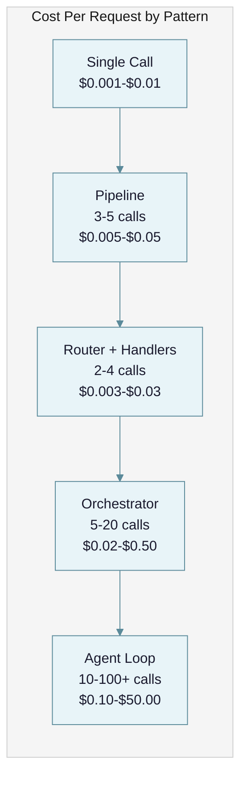
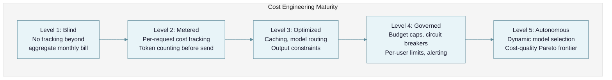

# Cost Engineering for LLM Systems: Why Your AI Budget Is a Lie and How to Fix It

Every team building with LLMs eventually discovers the same uncomfortable truth: the API call that costs $0.002 in development costs $2.00 in production -- not because prices changed, but because nobody modeled how costs compound across pipelines, retries, agent loops, and scale. Cost engineering is not optimization. It is the discipline of making LLM systems economically viable before they bankrupt you.

---

## The Problem: Output Tokens Are the Hidden Tax

LLM pricing looks simple on a provider's pricing page. It is not. The core tension in LLM cost engineering is that **the tokens you pay the most for are the ones you control the least**.

Every major provider prices input and output tokens differently, with output tokens costing 3-5x more than input tokens. This asymmetry exists because output tokens require sequential autoregressive generation (each token depends on the previous one), while input tokens can be processed in parallel. The economics of silicon enforce this ratio.

| Provider | Model | Input / MTok | Output / MTok | Output Multiplier |
|---|---|---|---|---|
| OpenAI | GPT-4.1 | $2.00 | $8.00 | 4.0x |
| OpenAI | GPT-5 | $1.25 | $10.00 | 8.0x |
| OpenAI | o3 | $2.00 | $8.00 | 4.0x |
| Anthropic | Claude Sonnet 4.6 | $3.00 | $15.00 | 5.0x |
| Anthropic | Claude Opus 4.6 | $5.00 | $25.00 | 5.0x |
| Google | Gemini 2.5 Pro | $1.25 | $10.00 | 8.0x |
| Google | Gemini 2.5 Flash | $0.30 | $2.50 | 8.3x |
| OpenAI | GPT-4.1 Nano | $0.10 | $0.40 | 4.0x |
| Google | Gemini 2.5 Flash-Lite | $0.10 | $0.40 | 4.0x |

*Sources: [OpenAI pricing](https://devtk.ai/en/blog/openai-api-pricing-guide-2026/), [Anthropic pricing](https://platform.claude.com/docs/en/about-claude/pricing), [Google AI pricing](https://ai.google.dev/pricing)*

The multiplier matters because you cannot predict output length with precision. You control your prompt (input tokens). You do not control the model's response length. A request that should generate 200 tokens of JSON might generate 2,000 tokens of explanation because the model misunderstood the instruction. That 10x output overshoot is a 10x cost overshoot on your most expensive token type.

This asymmetry compounds across architectural patterns. A single LLM call has a predictable cost envelope. A pipeline of five calls multiplies that envelope. An agent with tool-calling loops makes the envelope unbounded.



The difference between a single augmented call and an autonomous agent is not 2x or 5x. It is **10-100x** on the same task ([Moltbook-AI](https://moltbook-ai.com/posts/ai-agent-cost-optimization-2026)). Teams that architect for agents without modeling this cost curve discover it in their first invoice.

---

## Failure Taxonomy: Six Ways LLM Costs Spiral

Cost failures in LLM systems are not random. They follow predictable patterns, each with distinct root causes and signatures.

### Failure 1: The Runaway Agent

An agent enters an infinite or near-infinite loop, burning tokens without producing useful output. This is the most dramatic failure mode and the one that generates horror stories.

**What it looks like:** Your daily cost jumps from $100 to $10,000 overnight. Monitoring (if you have it) shows a single agent session generating thousands of API calls.

**Why it happens:** Agent architectures have no inherent termination guarantee. The model decides when to stop. If the model's reasoning enters a cycle -- retrying a failed tool call, re-evaluating the same evidence, or ping-ponging between sub-agents -- there is no structural mechanism to break the loop unless you built one.

**Concrete example:** A multi-agent research tool built on LangChain had four agents (Research, Analysis, Verification, Summary). The Analyzer and Verifier entered a recursive loop through agent-to-agent messaging. The loop ran **11 days undetected**. Weekly costs escalated: $127, $891, $6,240, $18,400. Total: [$47,000](https://techstartups.com/2025/11/14/ai-agents-horror-stories-how-a-47000-failure-exposed-the-hype-and-hidden-risks-of-multi-agent-systems/). Root cause analysis identified zero step limits, zero cost ceilings, zero real-time monitoring, and zero alerting.

### Failure 2: The Model Mismatch

Using a frontier model for tasks that a budget model handles equally well. This is the most common cost failure and the easiest to fix, yet most teams never address it.

**What it looks like:** Every request hits Claude Opus or GPT-4.1 regardless of complexity. Your cost-per-request is consistent but uniformly high.

**Why it happens:** Teams pick one model during development and never revisit. The model that works for the hardest 5% of inputs is used for the easiest 95%. A simple classification task that Gemini Flash-Lite handles at $0.10/MTok input is sent to Opus at $5.00/MTok -- a 50x cost premium for equivalent accuracy.

**Concrete example:** A customer service system routes all queries to Claude Sonnet 4.6. Evaluation shows that 70% of queries are simple FAQ lookups where Haiku 4.5 produces identical quality. Switching those 70% to Haiku saves **$12,000/month** on a 50K query/month workload ([Moltbook-AI](https://moltbook-ai.com/posts/ai-agent-cost-optimization-2026)). The team was paying 3x what the workload required.

### Failure 3: The Cache Miss

Sending identical or semantically equivalent prompts to the API repeatedly, paying full price each time for responses that should have been cached.

**What it looks like:** High request volume with low response variance. Many requests produce near-identical outputs.

**Why it happens:** LLM calls look like function calls, so developers treat them as stateless. They do not instrument cache hit rates because the concept does not occur to them. In enterprise workloads, [31% of queries show semantic similarity](https://redis.io/blog/llm-token-optimization-speed-up-apps/) sufficient for caching.

**Concrete example:** A document QA system answers questions about 10 internal documents. Each question sends the full 20K-token document as context. 1,000 queries/day, 60% of which are about the same three documents. Without prompt caching, the system pays full input token price for each request. With Anthropic's prompt caching (cache reads at 10% of base price), annual savings exceed $20,000 ([Introl](https://introl.com/blog/prompt-caching-infrastructure-llm-cost-latency-reduction-guide-2025)).

### Failure 4: The Output Explosion

Failing to constrain output token generation, allowing the model to produce verbose responses that cost 3-5x more per token than the input that triggered them.

**What it looks like:** Responses are longer than necessary. JSON outputs include explanatory text. Summaries are longer than the source material.

**Why it happens:** Without `max_tokens` limits, clear formatting instructions, or structured output schemas, the model defaults to being helpful -- which means verbose. Each unnecessary output token costs 3-8x what an input token costs.

**Concrete example:** A data extraction pipeline asks the model to extract five fields from a document. Without structured output constraints, the model returns the five fields plus a 500-word explanation of its reasoning. The explanation costs more than the useful output. Adding `"respond only with JSON, no explanation"` and setting `max_tokens: 200` cuts output tokens by 80%.

### Failure 5: The Context Bloat

Accumulating conversation history, system prompts, and retrieved documents without management, pushing input token counts to the context window ceiling.

**What it looks like:** Early requests in a session are cheap. Late requests are expensive. Long sessions cost disproportionately more than short ones.

**Why it happens:** Each turn in a conversation appends the full history. A 20-turn conversation with 500 tokens per turn sends 10,000 tokens of history on the final call -- plus the system prompt, plus any RAG context. The input token cost grows quadratically with conversation length.

**Concrete example:** A coding assistant with a 4,000-token system prompt and RAG context averaging 2,000 tokens starts each conversation at 6,000 input tokens. By turn 20, input tokens reach 26,000. If the user asks 50 questions, the final call sends 56,000 input tokens. Implementing a sliding window (keep last 10 turns) plus progressive summarization (summarize older turns) reduces late-session input by 50-70% ([Redis](https://redis.io/blog/llm-token-optimization-speed-up-apps/)).

### Failure 6: The Invisible Spend

No cost attribution, no per-feature tracking, no per-user metering. Total spend is known; where it goes is not.

**What it looks like:** The monthly bill is $15,000. Nobody knows whether that is search, summarization, or the internal chatbot. Nobody knows if one user is consuming 80% of the budget.

**Why it happens:** Teams track aggregate API spend but do not instrument individual features, users, or request types. Without attribution, optimization is impossible because you cannot identify what to optimize.

**Concrete example:** A SaaS platform discovers its $47,000 monthly LLM bill is 60% attributable to a single power user running automated queries. Without per-user metering, this went undetected for three months. Implementing per-user spend tracking and rate limits reduced the bill to [$28,000](https://www.pluralsight.com/resources/blog/ai-and-data/how-cut-llm-costs-with-metering).

---

## Cost Maturity Spectrum: Five Levels

Organizations progress through predictable stages of cost engineering maturity. Each level addresses specific failure modes from the taxonomy above.



| Level | Characteristics | Failure Modes Addressed | Typical Cost Reduction |
|---|---|---|---|
| 1. Blind | Check provider dashboard monthly. No per-request tracking. | None | Baseline |
| 2. Metered | Log tokens per request. Count tokens before sending. Know cost per feature. | Invisible Spend | 0% (visibility only) |
| 3. Optimized | Prompt caching, model routing, output constraints, batch APIs. | Cache Miss, Model Mismatch, Output Explosion | 40-70% |
| 4. Governed | Per-request limits, session budgets, daily caps, circuit breakers, alerting. | Runaway Agent, Context Bloat | 70-85% |
| 5. Autonomous | ML-based router selects model per request. Cost-quality tradeoff is automatic. | All | 85-95% |

Most teams operate at Level 1 or 2. The jump from Level 2 to Level 3 delivers the largest cost reduction for the least effort.

---

## Principles: Seven Levers for LLM Cost Control

### Principle 1: Count Tokens Before You Send Them

**Why it works:** You cannot manage what you do not measure. Token counting before API submission is the foundation of every other cost control -- it enables budget enforcement, anomaly detection, and cost prediction.

**How to apply:**

For OpenAI models, use `tiktoken`:

```python
import tiktoken

def estimate_cost(prompt: str, model: str = "gpt-4.1") -> dict:
    enc = tiktoken.encoding_for_model(model)
    input_tokens = len(enc.encode(prompt))
    # Estimate output as 2x input for conversational, 0.5x for extraction
    estimated_output = input_tokens * 2

    prices = {"gpt-4.1": (2.00, 8.00), "gpt-4.1-nano": (0.10, 0.40)}
    input_price, output_price = prices[model]

    cost = (input_tokens * input_price + estimated_output * output_price) / 1_000_000
    return {"input_tokens": input_tokens, "estimated_output": estimated_output,
            "estimated_cost_usd": cost}
```

For Anthropic models, use their token counting API endpoint or `anthropic.count_tokens()` in the SDK. Anthropic's tokenizer is not publicly available as a standalone library, so server-side counting is the only accurate method.

**Critical insight:** Token counting is not just for billing -- it is your first line of defense against context bloat and runaway costs. If a request's input token count exceeds your expected range, reject it before it reaches the API.

### Principle 2: Route by Complexity, Not by Default

**Why it works:** The router pattern, as documented in [AI-Native Solution Patterns](docs/ai-native-solution-patterns.md), uses an initial classification step to direct inputs to specialized handlers. When applied as a cost lever, a single routing decision -- "is this task simple or complex?" -- can cut costs by 50-70%. The cost differential between model tiers is not marginal: it is 10-50x.

| Tier | Models | Input / MTok | Output / MTok | Use For |
|---|---|---|---|---|
| Nano | GPT-4.1 Nano, Gemini Flash-Lite | $0.10 | $0.40 | Classification, extraction, simple Q&A |
| Fast | Haiku 4.5, GPT-4o Mini, Gemini Flash | $0.15-$1.00 | $0.60-$5.00 | Moderate reasoning, summarization |
| Standard | Sonnet 4.6, GPT-4.1, Gemini Pro | $2.00-$3.00 | $8.00-$15.00 | Complex reasoning, generation |
| Frontier | Opus 4.6, GPT-5, o3 | $1.25-$5.00 | $8.00-$25.00 | Hardest tasks, multi-step reasoning |

**How to apply:**

```python
async def route_request(query: str) -> str:
    # Step 1: Classify complexity with cheapest model
    complexity = await classify(query, model="gpt-4.1-nano")  # $0.10/MTok

    # Step 2: Route to appropriate tier
    model_map = {
        "simple": "gpt-4.1-nano",      # FAQ, classification
        "moderate": "claude-haiku-4.5",  # Summarization, extraction
        "complex": "claude-sonnet-4.6",  # Analysis, generation
        "frontier": "claude-opus-4.6",   # Novel reasoning
    }
    return await generate(query, model=model_map[complexity])
```

A system processing 50,000 requests/month with 70% simple, 20% moderate, and 10% complex tasks costs approximately $12,000/month with a single frontier model. With routing, it costs approximately $3,200/month -- a 73% reduction ([RocketEdge](https://rocketedge.com/2026/03/15/your-ai-agent-bill-is-30x-higher-than-it-needs-to-be-the-6-tier-fix/)).

### Principle 3: Cache at Multiple Layers

**Why it works:** Caching addresses the Cache Miss failure mode directly. Three caching strategies operate at different layers, and they stack.

**Layer 1: Exact-match response caching.** Hash the full prompt. If an identical prompt was seen recently, return the cached response. Hit rates are low (5-15%) but implementation cost is near zero.

**Layer 2: Semantic caching.** Embed the query, search for semantically similar prior queries (cosine similarity > 0.95), return the cached response. Hit rates reach 20-35% in enterprise workloads. Latency drops from ~850ms to ~120ms on cache hits ([Redis](https://redis.io/blog/llm-token-optimization-speed-up-apps/)).

**Layer 3: Provider prompt caching.** Anthropic and OpenAI cache repeated prompt prefixes server-side.

| Provider | Cache Write Cost | Cache Read Cost | Savings on Read | TTL |
|---|---|---|---|---|
| Anthropic (5-min) | 1.25x base input | 0.1x base input | 90% | 5 min (extends on access) |
| Anthropic (1-hour) | 2.0x base input | 0.1x base input | 90% | 1 hour |
| OpenAI | 1.0x (free) | 0.5x base input | 50% | 5-10 min |
| Google | Varies by model | ~$0.01/MTok (Flash-Lite) | Up to 97% | Configurable |

*Source: [Anthropic pricing](https://platform.claude.com/docs/en/about-claude/pricing), [Introl caching guide](https://introl.com/blog/prompt-caching-infrastructure-llm-cost-latency-reduction-guide-2025)*

**Break-even analysis for Anthropic prompt caching:** A 5-minute cache write costs 1.25x one request. Cache reads cost 0.1x. Break-even occurs after **just 1 cache read** within the TTL window: 1.25x (write) + 0.1x (read) = 1.35x total for 2 requests, versus 2.0x without caching. Every subsequent read within the window saves 0.9x.

**How to apply:** Start with prompt caching (highest ROI, zero infrastructure). Add exact-match caching for high-repetition workloads. Graduate to semantic caching only if your query distribution shows high semantic overlap.

### Principle 4: Use Batch APIs for Non-Latency-Sensitive Work

**Why it works:** Both OpenAI and Anthropic offer **50% cost reduction** on batch API calls in exchange for a 24-hour completion window. If the work does not need a real-time response, you are overpaying by 2x.

**Workloads that fit batch processing:**
- Nightly evaluation runs against test datasets
- Bulk data enrichment and classification
- Content generation for scheduled publishing
- Document summarization backlogs
- Embedding generation for search indices

**How to apply:** Separate your workloads into "interactive" (user-facing, latency-sensitive) and "batch" (background, throughput-sensitive). Route batch workloads to the batch API. On a $10,000/month spend where 40% is batch-eligible, this saves $2,000/month with no quality impact.

### Principle 5: Set Hard Limits at Every Level

**Why it works:** This directly addresses the Runaway Agent failure mode. Without hard limits, a single malfunction can consume your entire monthly budget in hours. Guardrails must be structural (enforced by infrastructure), not behavioral (enforced by the model).

**How to apply -- four-level budget hierarchy:**

```
Organization     →  $50,000/month hard cap
  └─ Team        →  $10,000/month per team
      └─ API Key →  $500/day per key
          └─ Request → $1.00 per request, 4,096 max output tokens
```

**Agent-specific guardrails:**
- **Step limit:** No agent executes more than 25 tool calls per task
- **Session budget:** No single session exceeds $5.00
- **Time limit:** No agent runs longer than 10 minutes
- **Circuit breaker:** If any session exceeds $1.00 within 60 seconds, kill it

```python
class AgentBudget:
    def __init__(self, max_steps=25, max_cost_usd=5.0, max_duration_sec=600):
        self.max_steps = max_steps
        self.max_cost_usd = max_cost_usd
        self.max_duration_sec = max_duration_sec
        self.steps = 0
        self.cost = 0.0
        self.start_time = time.time()

    def check(self, step_cost: float) -> bool:
        self.steps += 1
        self.cost += step_cost
        elapsed = time.time() - self.start_time

        if self.steps > self.max_steps:
            raise BudgetExceeded(f"Step limit: {self.steps}/{self.max_steps}")
        if self.cost > self.max_cost_usd:
            raise BudgetExceeded(f"Cost limit: ${self.cost:.2f}/${self.max_cost_usd}")
        if elapsed > self.max_duration_sec:
            raise BudgetExceeded(f"Time limit: {elapsed:.0f}s/{self.max_duration_sec}s")
        return True
```

**Progressive alerting thresholds** ([Portkey](https://portkey.ai/blog/budget-limits-and-alerts-in-llm-apps/)):
- 50% budget consumed: notify team lead
- 75% budget consumed: notify engineering
- 90% budget consumed: switch to cheaper models automatically
- 100% budget consumed: block non-critical requests

### Principle 6: Track Cost Per Outcome, Not Cost Per Request

**Why it works:** Cost per request is a vanity metric. The metric that matters is **cost per successful outcome** -- the total cost to produce one unit of business value. An agent that costs $2.00 per request but resolves customer tickets autonomously (saving $15 in human labor) is cheaper than a $0.05 classifier that still requires human review.

**How to apply -- the metrics that matter:**

| Metric | What It Tells You | Alert Threshold |
|---|---|---|
| Cost per request | Raw API spend | Sudden 3x spike |
| Cost per successful outcome | Business unit economics | Exceeds value delivered |
| Cost per user | Distribution and abuse detection | Single user > 10x median |
| Cost per feature | Where budget goes | One feature > 40% of total |
| Token efficiency | Output quality per token | Declining over time |
| Cache hit rate | Caching effectiveness | Below 20% for eligible workloads |
| Cost trend (7-day rolling) | Trajectory | Week-over-week increase > 15% |

**Tool stack for monitoring:**

| Tool | Role | Integration |
|---|---|---|
| [LiteLLM](https://github.com/BerriAI/litellm) | API gateway, unified proxy | Routes to 100+ providers, enforces per-team budgets |
| [Langfuse](https://langfuse.com) | Observability and tracing | Cost breakdown by feature/team/model, trace visualization |
| [Portkey](https://portkey.ai) | AI gateway | Built-in caching, budget hierarchy, webhook alerts |
| [Helicone](https://helicone.ai) | Monitoring | One-line integration, prompt management, cost dashboards |

### Principle 7: Model the Full Cost Before You Build

**Why it works:** Most cost surprises come from not modeling costs during architecture design. A back-of-envelope calculation before writing code prevents 90% of budget overruns.

**How to apply -- cost estimation worksheet:**

```
SYSTEM: Customer support automation
VOLUME: 50,000 queries/month

Per-query breakdown:
  Router call (classify):     500 input + 50 output tokens
  RAG retrieval context:      2,000 input tokens
  Response generation:        2,000 input + 500 output tokens
  Quality check:              2,500 input + 100 output tokens
  ─────────────────────────────────────────────────
  Total per query:            7,000 input + 650 output tokens

Monthly tokens:
  Input:  7,000 × 50,000 = 350M tokens
  Output: 650 × 50,000   = 32.5M tokens

Cost at Sonnet 4.6 ($3/$15 per MTok):
  Input:  350 × $3.00  = $1,050
  Output: 32.5 × $15.00 = $487.50
  Monthly total: $1,537.50

Cost with routing (70% to Haiku at $1/$5):
  Simple (35K queries):  245M in × $1 + 22.75M out × $5  = $358.75
  Complex (15K queries): 105M in × $3 + 9.75M out × $15  = $461.25
  Monthly total: $820.00  (47% savings)

Cost with routing + prompt caching (60% cache hit on RAG context):
  Cache savings on 2,000 tokens × 30,000 hits × 90% discount
  Additional monthly savings: ~$150
  Monthly total: ~$670.00  (56% savings from baseline)
```

---

## Cost Archetypes: Four Common Systems

### Archetype 1: The Chatbot

Single-model, multi-turn conversation. Cost grows quadratically with conversation length due to context accumulation.

| Parameter | Value |
|---|---|
| Model | Sonnet 4.6 ($3/$15) |
| System prompt | 2,000 tokens |
| Avg turns per session | 15 |
| Avg user message | 100 tokens |
| Avg response | 300 tokens |
| Sessions per month | 10,000 |

**Unoptimized cost:** Each turn resends full history. By turn 15, input reaches ~8,000 tokens per request. Total monthly: ~$3,800.

**Optimized cost (sliding window + Haiku for simple turns):** Monthly: ~$1,200. **Savings: 68%.**

### Archetype 2: The RAG Pipeline

Retrieval-augmented generation with fixed document context. Cost dominated by repeated context injection.

| Parameter | Value |
|---|---|
| Model | GPT-4.1 ($2/$8) |
| Retrieved context | 4,000 tokens |
| Query + system prompt | 1,500 tokens |
| Response | 500 tokens |
| Queries per month | 100,000 |

**Unoptimized cost:** 5,500 input + 500 output per query. Monthly: $1,500.

**Optimized cost (prompt caching + batch for analytics queries):** Monthly: ~$650. **Savings: 57%.**

### Archetype 3: The Agentic Workflow

Multi-step agent with tool calling. Cost is unpredictable because step count varies.

| Parameter | Value |
|---|---|
| Model | Sonnet 4.6 ($3/$15) |
| Steps per task | 5-25 (avg 12) |
| Tokens per step | 3,000 input + 500 output (growing with context) |
| Tasks per month | 5,000 |

**Unoptimized cost:** Average 12 steps, context grows each step. Monthly: ~$15,000. **Worst case (all tasks hit 25 steps):** ~$45,000.

**Optimized cost (step limits + router + context pruning):** Monthly: ~$5,000. **Savings: 67%. Risk reduction: 90% (worst case capped at $8,000).**

### Archetype 4: The Evaluation Pipeline

Batch evaluation of model outputs using LLM-as-judge. High volume, fully batch-eligible.

| Parameter | Value |
|---|---|
| Model | Sonnet 4.6 ($3/$15) |
| Items to evaluate | 50,000/month |
| Tokens per evaluation | 2,000 input + 200 output |

**Unoptimized cost (real-time API):** Monthly: $450.

**Optimized cost (batch API at 50% discount):** Monthly: $225. **Savings: 50%, zero effort.**

---

## The Build-vs-Buy Decision: When Self-Hosting Makes Sense

The instinct to self-host for cost savings is almost always premature. The true cost of self-hosting is consistently [underestimated by 2-3x](https://devtk.ai/en/blog/self-hosting-llm-vs-api-cost-2026/).

**True cost of self-hosting (monthly, single A100 80GB):**

| Component | Cost |
|---|---|
| GPU rental (A100 80GB, cloud) | $1,440 |
| DevOps engineering (15 hrs × $100/hr) | $1,500 |
| Infrastructure (monitoring, load balancing) | $300 |
| **True monthly total** | **$3,240** |

**Break-even volumes against APIs:**

| Compare Against | Break-Even Volume | Reality Check |
|---|---|---|
| Claude Sonnet 4.6 ($3/$15) | ~50M tokens/month | Achievable for high-volume systems |
| GPT-4.1 Nano ($0.10/$0.40) | ~3.8B tokens/month | Nearly impossible on single GPU |
| Gemini Flash-Lite ($0.10/$0.40) | ~3.8B tokens/month | Requires maximum 24/7 utilization |

An [academic study of 54 deployment scenarios](https://arxiv.org/html/2509.18101v1) found that small models (24-32B parameters) break even in 0.3-3 months on consumer hardware (~$2,000), while large models (235B+) require 3.5-69+ months on $60K-$240K hardware. Against cost-leadership APIs, payoff horizons extend to 5-9 years.

```mermaid
%%{init: {'theme': 'base', 'themeVariables': {'primaryColor': '#e8f4f8', 'primaryTextColor': '#1a1a2e', 'primaryBorderColor': '#5b8a9a', 'lineColor': '#5b8a9a', 'secondaryColor': '#f0e6d3', 'tertiaryColor': '#e8e8e8', 'clusterBkg': '#f5f5f5', 'edgeLabelBackground': '#f5f5f5'}}}%%
quadrantChart
    title Self-Host vs API Decision
    x-axis Low Volume --> High Volume
    y-axis Budget Models --> Frontier Models
    quadrant-1 Self-host likely wins
    quadrant-2 API wins (frontier quality needed)
    quadrant-3 API wins (low volume)
    quadrant-4 Evaluate carefully
    API chatbot: [0.3, 0.7]
    API RAG: [0.4, 0.5]
    Self-host classification: [0.8, 0.2]
    Self-host embeddings: [0.9, 0.15]
    Agentic workflow: [0.5, 0.85]
    Batch enrichment: [0.75, 0.3]
```

**Self-host when:** You process 100M+ tokens/day consistently, need data residency or air-gapped deployment, require custom fine-tuned models, or have a dedicated ML infrastructure team.

**Use APIs when:** Volume is below 50M tokens/day, you need frontier-model quality, your team lacks GPU operations expertise, or traffic is variable/spiky.

---

## Recommendations

### Short-Term (This Week)

1. **Instrument token counting on every request.** Log input tokens, output tokens, model, and cost per call. You cannot optimize what you cannot see. (Implements Principle 1)
2. **Set `max_tokens` on every API call.** Prevents output explosions. Match the limit to the expected response format -- 200 for JSON extraction, 1,000 for summaries, 4,096 for generation. (Implements Principle 5)
3. **Enable prompt caching.** If using Anthropic, add `cache_control` markers to system prompts and repeated context. If using OpenAI, prompts over 1,024 tokens cache automatically. Zero infrastructure required. (Implements Principle 3)
4. **Switch batch-eligible workloads to batch APIs.** Evaluations, enrichment, and scheduled generation get 50% off immediately. (Implements Principle 4)

### Medium-Term (This Month)

5. **Implement model routing.** Classify request complexity and route to the cheapest model that meets quality requirements. Start with a simple rule-based router before investing in ML-based classification. (Implements Principle 2)
6. **Add budget guardrails.** Per-request cost limits, per-session budgets, daily caps, and progressive alerting. Every agent must have a step limit and a cost ceiling. (Implements Principle 5)
7. **Build cost attribution.** Tag every request with feature, user, and team. Build a dashboard showing cost per outcome, not just cost per request. (Implements Principle 6)

### Long-Term (This Quarter)

8. **Implement semantic caching.** For workloads with high query similarity, add embedding-based cache lookup. Target 20-35% hit rates. (Implements Principle 3)
9. **Automate cost-quality optimization.** Build evaluation harnesses that measure quality at each model tier. Continuously optimize the routing threshold as models improve and prices drop. (Implements Principle 2)
10. **Run cost modeling for every new feature.** Before any new LLM feature ships, complete the cost estimation worksheet from Principle 7. Make it part of the design review. (Implements Principle 7)

---

## The Hard Truth

The LLM cost problem is not a pricing problem. Prices have dropped approximately [100x over 2.5 years](https://simonwillison.net/tags/llm-pricing/) and will continue dropping. The problem is architectural.

Teams that treat LLM calls like database queries -- fire and forget, optimize later -- will always be surprised by their bills. The cost of a single LLM call is trivial. The cost of a system that makes thousands of uncontrolled LLM calls is catastrophic. The difference between a $500/month system and a $50,000/month system is rarely the model or the provider. It is whether anyone modeled the cost before building, whether anyone set limits before deploying, and whether anyone monitored before the invoice arrived.

The uncomfortable truth is that 96% of enterprises report AI costs exceeding estimates ([OneUptime](https://oneuptime.com/blog/post/2026-03-09-ai-agents-observability-crisis/view)). This is not because LLMs are expensive. It is because teams build first and budget never. A 30-minute cost estimation exercise before architecture design prevents more financial damage than any optimization applied after the fact.

The most expensive LLM system is the one nobody measured.

---

## Summary Checklist

| Question | Good Answer | Bad Answer |
|---|---|---|
| Do you count tokens before sending requests? | Yes, with alerts on anomalies | No, we check the monthly bill |
| Do you use different models for different complexity levels? | Yes, 3+ tiers with routing | No, one model for everything |
| Do you cache repeated prompt prefixes? | Yes, with measured hit rates | No, or we have not checked |
| Are agent loops bounded by step and cost limits? | Yes, hard limits with circuit breakers | No, agents run until done |
| Do you know cost per successful outcome? | Yes, tracked per feature | No, only aggregate spend |
| Is batch API used for non-real-time work? | Yes, all eligible workloads | No, everything is real-time |
| Do you have per-user and per-team spend limits? | Yes, with progressive alerts | No, one global budget |
| Did you model costs before building? | Yes, cost worksheet in design review | No, we estimated after launch |
| Can you attribute 90%+ of spend to specific features? | Yes, with per-request tagging | No, we see only total spend |
| Do you have a kill switch for runaway sessions? | Yes, automatic circuit breaker | No, we rely on manual intervention |

---

## References

### Practitioner Articles

- [TechStartups: AI Agents Horror Stories -- $47,000 Failure](https://techstartups.com/2025/11/14/ai-agents-horror-stories-how-a-47000-failure-exposed-the-hype-and-hidden-risks-of-multi-agent-systems/) -- Detailed case study of an 11-day agent loop costing $47,000, with root cause analysis
- [RocketEdge: Your AI Agent Bill Is 30x Higher Than It Needs to Be](https://rocketedge.com/2026/03/15/your-ai-agent-bill-is-30x-higher-than-it-needs-to-be-the-6-tier-fix/) -- Six-tier model routing framework achieving 97.8% cost reduction with circuit-breaker patterns
- [Pluralsight: Meter Before You Manage -- How to Cut LLM Costs](https://www.pluralsight.com/resources/blog/ai-and-data/how-cut-llm-costs-with-metering) -- Three-layer methodology (LiteLLM + Langfuse + RouteLLM) reducing a $47K monthly bill to $28K
- [Moltbook-AI: AI Agent Cost Optimization 2026](https://moltbook-ai.com/posts/ai-agent-cost-optimization-2026) -- Ten optimization strategies with specific savings percentages and monthly cost comparisons
- [Koombea: LLM Cost Optimization Guide](https://ai.koombea.com/blog/llm-cost-optimization) -- Model cascading achieving 87% savings, LLMLingua compression details, and self-hosting payback calculations
- [Simon Willison: LLM Pricing](https://simonwillison.net/tags/llm-pricing/) -- Running archive documenting 100x price reductions over 2.5 years across all major providers

### Official Documentation and Pricing

- [Anthropic Pricing](https://platform.claude.com/docs/en/about-claude/pricing) -- Authoritative source for Claude model pricing, prompt caching multipliers, batch discounts, and tool pricing
- [OpenAI API Pricing Guide 2026](https://devtk.ai/en/blog/openai-api-pricing-guide-2026/) -- Complete pricing table including GPT-5, GPT-4.1 family, o3, and o4-mini with batch and caching discounts
- [Google AI Pricing](https://ai.google.dev/pricing) -- Complete Gemini model lineup including free tiers and context caching costs
- [Finout: OpenAI vs Anthropic API Pricing Comparison](https://www.finout.io/blog/openai-vs-anthropic-api-pricing-comparison) -- Side-by-side comparison with batch and caching discount breakdowns

### Technical Guides

- [Redis: LLM Token Optimization -- Cut Costs and Latency](https://redis.io/blog/llm-token-optimization-speed-up-apps/) -- Semantic caching architecture, multi-tier caching strategy, and real-world cost comparisons showing 16x differences between model tiers
- [Introl: Prompt Caching Infrastructure Guide](https://introl.com/blog/prompt-caching-infrastructure-llm-cost-latency-reduction-guide-2025) -- Provider-specific caching implementations with break-even calculations and ROI formulas
- [Portkey: AI Cost Observability Guide](https://portkey.ai/blog/ai-cost-observability-a-practical-guide-to-understanding-and-managing-llm-spend/) -- Five pillars of cost observability with FinOps integration approach
- [Portkey: Budget Limits and Alerts in LLM Apps](https://portkey.ai/blog/budget-limits-and-alerts-in-llm-apps/) -- Progressive alerting thresholds and centralized gateway architecture

### Monitoring and Operations

- [Helicone: Monitor and Optimize LLM Costs](https://www.helicone.ai/blog/monitor-and-optimize-llm-costs) -- Per-request cost benchmarks across workload types and 30-50% savings from prompt optimization plus caching
- [OneUptime: AI Agents Running Blind](https://oneuptime.com/blog/post/2026-03-09-ai-agents-observability-crisis/view) -- Agent observability failures, fintech database incident, and decision-level instrumentation recommendations
- [Finout: FinOps in the Age of AI](https://www.finout.io/blog/finops-in-the-age-of-ai-a-cpos-guide-to-llm-workflows-rag-ai-agents-and-agentic-systems) -- Tagging and allocation strategies, chargeback models, and 30x-200x cost variance between optimized and unoptimized deployments

### Research

- [Self-Hosting LLM vs API Cost Analysis 2026](https://devtk.ai/en/blog/self-hosting-llm-vs-api-cost-2026/) -- GPU pricing tables, break-even calculations against four API providers, and hidden cost multipliers
- [arxiv 2509.18101: Cost-Benefit Analysis of On-Premise LLM Deployment](https://arxiv.org/html/2509.18101v1) -- Academic analysis of 54 deployment scenarios with break-even timelines by model size across three commercial pricing tiers
- [Latent Space: Simon Willison -- Things We Learned About LLMs in 2024](https://www.latent.space/p/2024-simonw) -- Key insight: Gemini 1.5 Flash processes 68,000 photos for $1.68; DeepSeek v3 trained for $5.5M (1/10th expected)

### Related Documents in This Series

- [AI-Native Solution Patterns](docs/ai-native-solution-patterns.md) -- The router pattern as an architectural cost lever; seven patterns ordered by increasing complexity and cost
- [LLM Fundamentals for Practitioners](docs/llm-fundamentals-for-practitioners.md) -- Token mechanics, model tier pricing, and the 50-70% savings from a single routing decision
