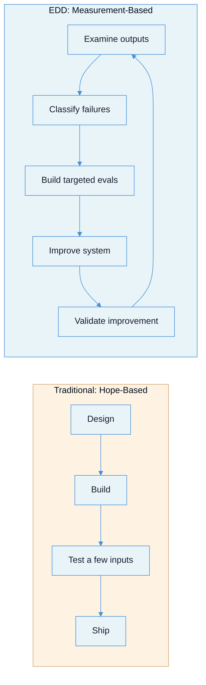
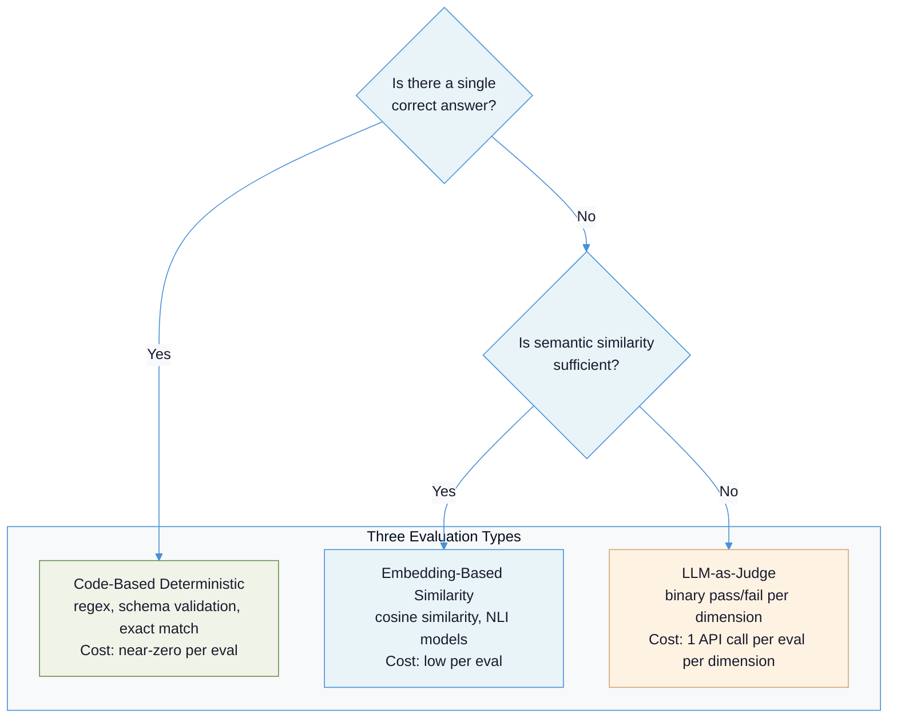
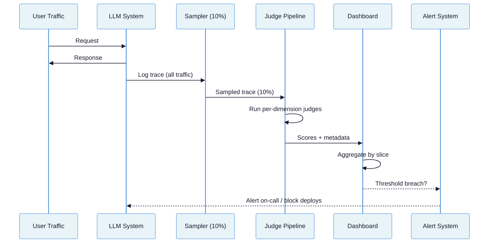

# Evaluation-Driven Development: Building the Measurement Infrastructure Your LLM System Cannot Ship Without

Every other document in this suite tells you to evaluate. This one tells you how.

---

## The Tension: You Cannot Improve What You Cannot Measure

There is a contradiction at the heart of most LLM projects. Teams spend weeks choosing models, designing prompts, and building RAG pipelines -- then validate their work by running a handful of inputs and checking whether the output "looks right." This is **vibes-based development**, and it is the default workflow for the majority of production LLM systems today.

The contradiction is not that teams skip evaluation. It is that they treat evaluation as a phase that comes *after* architecture -- a quality gate before deployment. This gets the dependency backwards. Evaluation must come *before* architecture, because without measurement, every architectural decision is a guess. You cannot know whether RAG improves your system if you have no baseline. You cannot know whether a prompt change helps if you have no regression suite. You cannot know whether switching from GPT-4o to Claude Sonnet saves money without sacrificing quality if you have no way to define "quality" in the first place.

The [Pragmatic Engineer's guide to LLM evals](https://newsletter.pragmaticengineer.com/p/evals) frames this as three gulfs that vibes-based development cannot cross:

| Gulf | What It Means | Why Vibes Fail |
|------|--------------|----------------|
| **Comprehension** | Gap between developer understanding and system behavior at scale | You tested 10 inputs; production sees 10,000 daily |
| **Specification** | Gap between intended behavior and what prompts actually instruct | Your prompt does not mean what you think it means |
| **Generalization** | Gap between well-written prompts and reliable cross-input performance | Edge cases are the norm, not the exception |

Evaluation-driven development (EDD) inverts the traditional sequence. Instead of Build -> Evaluate -> Ship, the sequence becomes:



This is the **eval flywheel**: error analysis surfaces failure modes, failure classification prioritizes them, eval construction makes them measurable, targeted improvement fixes them, and validation confirms the fix without regressions. Each rotation tightens the system. The flywheel is borrowed from [Hamel Husain's field guide](https://hamel.dev/blog/posts/field-guide/), where a case study improved a chatbot from 33% to 95% success rate -- not by rewriting the architecture, but by identifying that date-handling failures affected 66% of conversations and writing a single targeted fix.

---

## Failure Taxonomy: How Evaluation Efforts Go Wrong

Before prescribing how to build evals, it is worth understanding why most eval efforts fail. These failure modes are ordered by how commonly they appear in practice.

### Failure Mode 1: The Vibes Check

**What it looks like:** Developer changes a prompt, runs 3-5 test inputs, eyeballs the output, declares "LGTM," and ships. No dataset, no metrics, no record of what was tested.

**Why it happens:** Evaluation infrastructure feels like overhead when the system "works." The infinite surface area of possible inputs combined with subjective output quality makes comprehensive testing feel impossible, so teams default to spot-checking.

**Consequence:** Every subsequent change is a roll of the dice. Regressions go undetected until users report them. The team has no way to compare prompt versions, model versions, or architectural changes.

### Failure Mode 2: The God Evaluator

**What it looks like:** A single LLM-as-judge prompt that scores outputs on 8 dimensions simultaneously -- helpfulness, accuracy, tone, completeness, conciseness, safety, relevance, and creativity -- each on a 1-5 scale.

**Why it happens:** Teams want comprehensive coverage and assume a single evaluator is simpler than building multiple specialized ones.

**Consequence:** The evaluator becomes unreliable across all dimensions. [Eugene Yan explicitly warns](https://eugeneyan.com/writing/product-evals/) against this pattern: the difference between a "3" and a "4" is subjective and varies across annotators. Multi-dimensional scoring creates false confidence without actionability. When the overall score drops from 3.7 to 3.4, which dimension caused it? What should the team fix?

### Failure Mode 3: The Generic Metric Trap

**What it looks like:** Team adopts off-the-shelf metrics (helpfulness, factuality, coherence) without validating that they correlate with their specific notion of quality.

**Why it happens:** Framework documentation showcases these metrics as ready-to-use. Building custom metrics requires domain expertise and labeled data that teams do not yet have.

**Consequence:** High scores on generic metrics do not predict user satisfaction. [Eugene Yan's eval task analysis](https://eugeneyan.com/writing/evals/) demonstrates that ROUGE, METEOR, BERTScore, and G-Eval are "unreliable and/or impractical" for production summarization evaluation. Teams optimize for metrics that do not matter while neglecting dimensions that do.

### Failure Mode 4: Self-Evaluation Bias

**What it looks like:** The same model that generates outputs also evaluates them, or the judge model comes from the same family as the generator.

**Why it happens:** Convenience. If you already have GPT-4o generating outputs, using GPT-4o to judge them requires no additional API setup.

**Consequence:** LLMs exhibit systematic self-preference bias. [Martin Fowler's patterns catalog](https://martinfowler.com/articles/gen-ai-patterns/) identifies self-evaluation as a known anti-pattern where models mask errors through false confidence and reinforce their own biases. Use a judge from a different model family than the generator.

### Failure Mode 5: Overfitting the Eval Set

**What it looks like:** Team iteratively improves prompts by running them against the same 50 test cases until scores reach 95%. Production performance does not match.

**Why it happens:** The eval set is both the development set and the test set. Without a held-out split, every optimization cycle leaks information about the test cases into the prompt.

**Consequence:** The prompt is tuned to 50 specific inputs, not to the distribution of production traffic. This is the LLM equivalent of overfitting a model to its training data.

### Failure Mode 6: Statistical Naivety

**What it looks like:** Team reports "accuracy improved from 87% to 91%" on a 100-example eval set without confidence intervals, significance tests, or acknowledgment that the improvement might be noise.

**Why it happens:** Traditional software testing is deterministic -- a test either passes or fails. LLM evaluation is stochastic, but teams apply deterministic reasoning.

**Consequence:** Teams ship changes that produced no real improvement, or revert changes that actually helped. An [ICML 2025 spotlight paper](https://arxiv.org/abs/2503.01747) proved that standard CLT-based confidence intervals fail with fewer than ~100 datapoints, producing error bars that are far too small and giving a false sense of precision.

### Failure Mode 7: The Tool Trap

**What it looks like:** Team evaluates 5 evaluation frameworks, builds elaborate infrastructure, configures dashboards -- but never actually examines their own model outputs.

**Why it happens:** Building infrastructure feels productive. Reading 200 model outputs feels tedious.

**Consequence:** [Eugene Yan's central thesis](https://eugeneyan.com/writing/eval-process/) is that process discipline beats tool sophistication. "Adding another tool, metric, or LLM-as-judge will sidestep fundamental process failures." The highest-ROI evaluation activity is not building infrastructure -- it is reading outputs and classifying failures.

---

## The Eval Maturity Spectrum

Not every system needs the same evaluation rigor. The appropriate level depends on the stakes, traffic, and rate of change. But every system should know where it sits on this spectrum and what the next level requires.

```mermaid
%%{init: {'theme': 'base', 'themeVariables': {'primaryColor': '#e8f4f8', 'primaryTextColor': '#1a1a2e', 'primaryBorderColor': '#4a90d9', 'lineColor': '#4a90d9', 'secondaryColor': '#f0f4e8', 'tertiaryColor': '#fef3e2', 'clusterBkg': '#f8f9fa', 'edgeLabelBackground': '#f8f9fa'}}}%%
graph TD
    subgraph Spectrum["Eval Maturity Levels"]
        L0["Level 0: Vibes<br/>Manual spot-checking<br/>No recorded results"]
        L1["Level 1: Assertions<br/>Code-based checks on every run<br/>Structured output validation"]
        L2["Level 2: Golden Dataset<br/>50-200 labeled examples<br/>Automated regression suite"]
        L3["Level 3: LLM-as-Judge<br/>Per-dimension binary evaluators<br/>Domain expert alignment validated"]
        L4["Level 4: Statistical Rigor<br/>Confidence intervals on all metrics<br/>Held-out test sets, power analysis"]
        L5["Level 5: Continuous Production Eval<br/>Sampling, drift detection, alerting<br/>Eval-to-business-metric correlation"]
    end
    L0 --> L1 --> L2 --> L3 --> L4 --> L5
    style Spectrum fill:#f8f9fa,stroke:#4a90d9
    style L0 fill:#fef3e2,stroke:#d4a574
    style L1 fill:#fef3e2,stroke:#d4a574
    style L2 fill:#e8f4f8,stroke:#4a90d9
    style L3 fill:#e8f4f8,stroke:#4a90d9
    style L4 fill:#f0f4e8,stroke:#6b8e4e
    style L5 fill:#f0f4e8,stroke:#6b8e4e
```



| Level | Characteristics | Appropriate When | Investment |
|-------|----------------|-----------------|------------|
| **0: Vibes** | Manual spot-checking, no recorded results | Never (this is the anti-pattern) | Zero |
| **1: Assertions** | Code-based checks on every commit | Structured output, classification tasks | Hours |
| **2: Golden Dataset** | 50-200 labeled examples, automated regression | Any system approaching production | Days |
| **3: LLM-as-Judge** | Per-dimension binary evaluators with expert alignment | Subjective quality, open-ended generation | 1-2 weeks |
| **4: Statistical Rigor** | Confidence intervals, held-out sets, power analysis | High-stakes decisions, model comparisons | 2-4 weeks |
| **5: Continuous Production** | Sampling, drift detection, business metric correlation | Production traffic, revenue-impacting systems | Ongoing |

The minimum viable evaluation for any system approaching production is Level 2. Levels 3-5 should be pursued in sequence as the system matures and stakes increase.

---

## Principles: Building the Eval Infrastructure

### Principle 1: Start with Error Analysis, Not Infrastructure

**Why it works:** You cannot build useful evals without knowing how your system fails. Generic metrics (helpfulness, coherence) measure dimensions that may not matter for your use case. Error analysis reveals the dimensions that do.

**How to apply:** Follow the [Pragmatic Engineer's open coding method](https://newsletter.pragmaticengineer.com/p/evals):

1. Collect 100+ diverse production-like traces (inputs, outputs, intermediate steps)
2. Read every trace. Annotate with bottom-up observations -- do not use predefined categories
3. Group observations into 5-10 failure themes (axial coding)
4. Quantify: count frequency of each failure mode
5. Build evals targeting the top 3 failure modes by frequency

This process typically takes 2-3 days and produces more actionable insight than any framework. [Hamel Husain recommends](https://hamel.dev/blog/posts/evals/) allocating 60-80% of development time to error analysis and evaluation, not infrastructure.

### Principle 2: Build Golden Datasets Through Domain Expert Curation

**Why it works:** Golden datasets create a stable reference point. Without one, every evaluation is relative -- you can measure change but not quality.

**How to apply:**

**Size targets** vary by maturity stage. [Microsoft's copilot team](https://github.com/microsoft/promptflow-resource-hub/blob/main/sample_gallery/golden_dataset/copilot-golden-dataset-creation-guidance.md) recommends 100-150 examples for initial quality measurement. [Eugene Yan recommends](https://eugeneyan.com/writing/product-evals/) 200+ total with 50-100 explicit failure cases. For production systems, target 500-2,000 examples stratified by difficulty and input type.

**Construction process:**

```python
# Golden dataset schema
import json
from dataclasses import dataclass, field
from enum import Enum

class Difficulty(Enum):
    EASY = "easy"          # clear intent, common pattern
    MEDIUM = "medium"      # ambiguous intent or domain-specific
    HARD = "hard"          # adversarial, edge case, multi-step reasoning

class ExpectedVerdict(Enum):
    PASS = "pass"
    FAIL = "fail"

@dataclass
class GoldenExample:
    id: str
    input_text: str
    expected_output: str           # or null for open-ended
    category: str                  # failure mode or feature area
    difficulty: Difficulty
    expected_verdict: ExpectedVerdict
    source: str                    # "production", "synthetic", "expert-authored"
    annotator: str                 # who labeled this
    notes: str = ""
    metadata: dict = field(default_factory=dict)

# Stratification targets for a 200-example dataset:
# - 40% easy (80 examples) -- baseline sanity
# - 35% medium (70 examples) -- realistic production traffic
# - 25% hard (50 examples) -- adversarial and edge cases
# - At least 50 examples should be known failure cases
```

**Critical rules:**
- Never use synthetic questions when measuring real-world quality ([Microsoft's guidance](https://github.com/microsoft/promptflow-resource-hub/blob/main/sample_gallery/golden_dataset/copilot-golden-dataset-creation-guidance.md))
- Generate organic failures by running smaller, less capable models -- synthetic defects are often out-of-distribution ([Eugene Yan](https://eugeneyan.com/writing/product-evals/))
- Maintain a 75/25 development/held-out split. Never optimize against the held-out set
- Refresh quarterly or after major system changes. [Criteria drift](https://arxiv.org/abs/2404.12272) means evaluation criteria change as you observe more outputs

### Principle 3: Use Three Eval Types and Know When Each Applies

**Why it works:** Different failure modes require different detection mechanisms. Forcing all evaluation through a single type creates blind spots.



**How to apply:**

**Type 1 -- Code-based deterministic checks.** Use when the failure can be verified with code. These are the cheapest and most reliable evals.

```python
# Code-based evals: run on every commit
def eval_structured_output(response: dict) -> bool:
    """Verify JSON schema compliance."""
    required_fields = {"answer", "confidence", "sources"}
    return required_fields.issubset(response.keys())

def eval_date_extraction(output: str, expected: str) -> bool:
    """Verify date was extracted correctly."""
    return expected in output

def eval_no_pii_leakage(output: str) -> bool:
    """Verify no SSN or credit card patterns in output."""
    import re
    ssn_pattern = r'\b\d{3}-\d{2}-\d{4}\b'
    cc_pattern = r'\b\d{4}[\s-]?\d{4}[\s-]?\d{4}[\s-]?\d{4}\b'
    return not (re.search(ssn_pattern, output) or re.search(cc_pattern, output))

def eval_word_count(output: str, max_words: int = 500) -> bool:
    """Verify output respects length constraints."""
    return len(output.split()) <= max_words
```

**Type 2 -- Embedding-based similarity.** Use when approximate semantic match is sufficient -- summarization, paraphrasing, translation.

```python
from sentence_transformers import SentenceTransformer
import numpy as np

model = SentenceTransformer("all-MiniLM-L6-v2")

def eval_semantic_similarity(output: str, reference: str, threshold: float = 0.8) -> bool:
    """Check semantic similarity against reference answer."""
    embeddings = model.encode([output, reference])
    similarity = np.dot(embeddings[0], embeddings[1]) / (
        np.linalg.norm(embeddings[0]) * np.linalg.norm(embeddings[1])
    )
    return similarity >= threshold
```

**Type 3 -- LLM-as-Judge.** Use for subjective quality dimensions where code-based checks are impossible. See Principle 4 for construction details.

The priority order is always: code-based first, embedding-based second, LLM-as-judge last. If a failure can be caught with code, do not waste an API call on a judge.

### Principle 4: Build LLM-as-Judge Evaluators with Binary Verdicts and Per-Dimension Isolation

**Why it works:** Binary PASS/FAIL forces clarity about what matters. Per-dimension isolation prevents one criterion from contaminating another. This approach achieves [>90% agreement with domain experts](https://hamel.dev/blog/posts/llm-judge/) within 3 iteration rounds, compared to multi-dimensional Likert scales which produce unreliable, unactionable scores.

**How to apply:** Follow [Hamel Husain's critique shadowing method](https://hamel.dev/blog/posts/llm-judge/):

```python
from anthropic import Anthropic

client = Anthropic()

# One evaluator per dimension -- never combine
FAITHFULNESS_JUDGE = """You are evaluating whether an AI assistant's response
is faithful to the provided source documents.

## Task
Determine if the response contains ONLY information that can be verified
from the source documents. Any claim not supported by the sources is a
faithfulness violation.

## Input
<source_documents>
{context}
</source_documents>

<response>
{response}
</response>

## Instructions
1. List each factual claim in the response.
2. For each claim, identify the supporting source passage or mark as UNSUPPORTED.
3. Render your verdict.

## Output Format
Return ONLY a JSON object:
{{"claims": [
    {{"claim": "...", "supported": true, "source_passage": "..."}},
    {{"claim": "...", "supported": false, "source_passage": null}}
  ],
  "verdict": "PASS" or "FAIL",
  "reason": "One sentence explaining the verdict"
}}"""

RELEVANCE_JUDGE = """You are evaluating whether an AI assistant's response
directly addresses the user's question.

## Task
Determine if the response answers what was asked. A response that is
accurate but off-topic is a relevance failure.

## Input
<question>
{question}
</question>

<response>
{response}
</response>

## Instructions
1. Identify the core intent of the question.
2. Determine whether the response addresses that intent.
3. Render your verdict.

## Output Format
Return ONLY a JSON object:
{{"intent": "...",
  "addresses_intent": true or false,
  "verdict": "PASS" or "FAIL",
  "reason": "One sentence explaining the verdict"
}}"""


def run_judge(judge_prompt: str, **kwargs) -> dict:
    """Run a single-dimension binary judge."""
    import json
    formatted = judge_prompt.format(**kwargs)
    response = client.messages.create(
        model="claude-sonnet-4-20250514",  # different family from generator
        max_tokens=1024,
        temperature=0.0,
        messages=[{"role": "user", "content": formatted}],
    )
    return json.loads(response.content[0].text)


def evaluate_response(question: str, response: str, context: str) -> dict:
    """Run all dimension judges and aggregate."""
    faithfulness = run_judge(FAITHFULNESS_JUDGE, context=context, response=response)
    relevance = run_judge(RELEVANCE_JUDGE, question=question, response=response)

    return {
        "faithfulness": faithfulness["verdict"],
        "relevance": relevance["verdict"],
        "all_pass": all(
            v["verdict"] == "PASS"
            for v in [faithfulness, relevance]
        ),
    }
```

**Validation:** Measure judge alignment against domain expert labels using Cohen's Kappa. Target 0.4-0.6 (substantial agreement) as a minimum, 0.7+ as excellent. Note that [human inter-rater reliability](https://eugeneyan.com/writing/product-evals/) often ranges 0.2-0.3 Kappa -- your automated judge need only match human consistency, not exceed it.

**Key rules for judge construction:**
- Use a judge from a different model family than the generator to avoid [self-evaluation bias](https://martinfowler.com/articles/gen-ai-patterns/)
- Request chain-of-thought reasoning before the verdict ([improves judge quality significantly](https://www.evidentlyai.com/llm-guide/llm-as-a-judge))
- Set temperature to 0.0 for consistency
- Build specialized judges only after error analysis reveals which dimensions matter. See [LLM Role Separation: Executor vs Evaluator](docs/llm-role-separation-executor-evaluator.md) for the full isolation architecture

### Principle 5: Apply Statistical Rigor to Every Metric

**Why it works:** LLM outputs are stochastic. A 4% improvement on 100 examples might be noise. Without confidence intervals, you cannot distinguish signal from randomness. Without power analysis, you cannot know whether your eval set is large enough to detect the improvements you care about.

**How to apply:**

```python
import numpy as np
from scipy import stats

def binary_confidence_interval(
    n_pass: int, n_total: int, confidence: float = 0.95
) -> tuple[float, float]:
    """Wilson score interval -- preferred over normal approximation
    for binary outcomes, especially with small samples or extreme proportions."""
    # scipy.stats.binom provides the Wilson interval via proportion_confint
    from statsmodels.stats.proportion import proportion_confint
    lower, upper = proportion_confint(n_pass, n_total, alpha=1 - confidence, method="wilson")
    return lower, upper

def paired_significance_test(
    scores_a: list[float], scores_b: list[float]
) -> dict:
    """Compare two systems on the same eval set using paired differences.
    Paired tests are more powerful than unpaired because they control
    for per-example difficulty variation."""
    differences = [a - b for a, b in zip(scores_a, scores_b)]
    mean_diff = np.mean(differences)
    se_diff = np.std(differences, ddof=1) / np.sqrt(len(differences))
    ci_lower = mean_diff - 1.96 * se_diff
    ci_upper = mean_diff + 1.96 * se_diff

    # Wilcoxon signed-rank test (non-parametric, no normality assumption)
    stat, p_value = stats.wilcoxon(differences, alternative="two-sided")

    return {
        "mean_difference": mean_diff,
        "standard_error": se_diff,
        "ci_95": (ci_lower, ci_upper),
        "p_value": p_value,
        "significant_at_05": p_value < 0.05,
        "n": len(differences),
    }

def required_sample_size(
    baseline_rate: float, minimum_detectable_effect: float,
    alpha: float = 0.05, power: float = 0.80
) -> int:
    """How many examples do you need to detect a given improvement?
    Detecting half-size effects requires 4x the samples (quadratic penalty)."""
    from statsmodels.stats.power import NormalIndPower
    analysis = NormalIndPower()
    # Effect size for proportions
    effect_size = minimum_detectable_effect / np.sqrt(
        baseline_rate * (1 - baseline_rate)
    )
    n = analysis.solve_power(effect_size=effect_size, alpha=alpha, power=power)
    return int(np.ceil(n))

# Example: you need to detect a 5% improvement from an 80% baseline
# required_sample_size(0.80, 0.05) -> approximately 400 examples
```

**Minimum reporting standard** ([Cameron Wolfe's statistical handbook](https://cameronrwolfe.substack.com/p/stats-llm-evals)): always report mean, standard error, sample size, and confidence interval. For model comparisons: paired differences, standard errors, confidence intervals, and score correlations.

**Critical thresholds:**
- Below 100 examples: CLT-based confidence intervals are unreliable; use [Bayesian methods](https://arxiv.org/abs/2503.01747) or Wilson score intervals
- 200 examples at 5% defect rate with 3% observed: 95% CI = 0.6-5.4% (inconclusive)
- 400 examples at same rate: 95% CI = 1.3-4.7% ([conclusive](https://eugeneyan.com/writing/product-evals/))

### Principle 6: Choose Frameworks for What They Do Best

**Why it works:** No single framework covers all evaluation needs. Using the right tool for each job avoids building infrastructure that a framework already provides.

| Framework | Best For | Run on CI? | Self-Hosted? | Cost |
|-----------|----------|------------|-------------|------|
| **DeepEval** | CI/CD pipeline testing (pytest-native), 50+ built-in metrics | Yes (pytest plugin) | Yes (OSS) | Free + optional cloud |
| **RAGAS** | RAG pipeline evaluation (faithfulness, context precision/recall) | Yes | Yes (OSS) | Free |
| **Promptfoo** | Red teaming, security testing (OWASP/NIST presets) | Yes | Yes (OSS) | Free |
| **Braintrust** | Production governance, release gating, human annotation workflows | Via API | Cloud only | Free tier: 1M spans |

**When to use which:**

- **Starting from zero?** DeepEval. Its pytest integration means evals run like tests. You can add `assert_test` to your existing test suite in minutes.
- **Building a RAG pipeline?** RAGAS for retrieval-specific metrics, supplemented by custom code-based evals.
- **Security and safety concerns?** Promptfoo for adversarial red teaming with pre-built attack datasets.
- **Production governance with human review?** Braintrust for annotation workflows and release gating.
- **Multiple needs?** Combine them. Use DeepEval for CI, RAGAS for RAG-specific metrics, and Braintrust for production monitoring. They are not mutually exclusive.

**Cost awareness:** Evaluating 1,000 samples across 4 LLM-as-judge dimensions requires ~4,000 API calls. At $3/million input tokens with a 500-token average prompt, that is approximately $6 per eval run. This scales linearly. Budget for it.

### Principle 7: Close the Loop with Production Monitoring

**Why it works:** Offline evals tell you whether the system works on your dataset. Production monitoring tells you whether it works on your users' actual inputs. Model behavior drifts, user behavior shifts, and the world changes. Without continuous evaluation, you are blind to degradation.

**How to apply:**



**Sampling strategy:** [Evidently AI recommends](https://www.evidentlyai.com/llm-guide/llm-as-a-judge) running LLM judges on 10% of production data at regular intervals. For high-traffic systems, stratified sampling ensures representation across user segments and input categories.

**Drift detection:** Monitor the distribution of judge verdicts over time. A sudden increase in FAIL rate for faithfulness indicates either a model change, a data change, or a prompt regression. Track per-slice to avoid aggregated metrics masking underperforming subgroups -- the [EDDOps reference architecture](https://arxiv.org/html/2411.13768v3) mandates slice-by-slice analysis.

**Alerting thresholds:** Set alerts at 2 standard deviations below the rolling 7-day average for each eval dimension. Require a minimum sample size before alerting to avoid false positives from small batches.

**The eval-to-business-metric bridge:** The gap between "our faithfulness score is 92%" and "our users are satisfied" is the hardest to close. [Confident AI's MOF framework](https://www.confident-ai.com/blog/the-ultimate-llm-evaluation-playbook) recommends:

1. Label 25-50 examples with both eval verdicts AND business outcomes (user satisfaction, task completion, support ticket generated)
2. Measure alignment: target <5% combined false positive + false negative rate between eval verdicts and business outcomes
3. Once alignment is validated, eval scores become reliable proxies for business metrics
4. Track correlation graphs between eval pass rates and business KPIs over time

---

## Recommendations

### Short-Term (This Week)

1. **Read 100 traces.** Before building any infrastructure, read actual system outputs. Annotate failures with open-ended observations. Group into themes. This single activity will produce more insight than any framework.
2. **Build 5 code-based assertions.** Check structured output compliance, length constraints, PII leakage, and any deterministic quality requirements. Run them on every commit.
3. **Create a 50-example golden dataset.** Focus on hard cases -- inputs where the system is most likely to fail. Label with binary PASS/FAIL. Store in version control.

### Medium-Term (This Month)

4. **Build per-dimension LLM-as-judge evaluators** for the top 3 failure modes identified in your error analysis. Validate each against domain expert labels. Target Cohen's Kappa 0.4+.
5. **Expand the golden dataset to 200+ examples** with a 75/25 dev/held-out split. Include stratification by difficulty and input category.
6. **Add confidence intervals to all reported metrics.** Use Wilson score intervals for binary outcomes. Require paired significance tests before declaring one system version better than another.
7. **Integrate evals into CI/CD.** Use DeepEval or equivalent to block merges when eval pass rates drop below thresholds.

### Long-Term (This Quarter)

8. **Deploy production monitoring** with 10% sampling, per-dimension judges, and per-slice aggregation. Set drift detection alerts.
9. **Validate the eval-to-business-metric bridge.** Correlate eval pass rates with user satisfaction, task completion, and support ticket volume. Iterate until <5% alignment error.
10. **Establish an eval refresh cadence.** Quarterly review of the golden dataset. Add production failure cases to the dataset. Retire examples that no longer represent current traffic patterns.

---

## The Hard Truth

Most teams that claim to practice evaluation-driven development are actually practicing **evaluation-adjacent development**: they have evals, but the evals do not drive decisions. The prompt gets changed, someone checks whether the eval scores went up, and if they are roughly in the same range, the change ships. The evals exist as documentation of effort, not as gatekeepers of quality.

The uncomfortable reality is that building good evals is harder than building the system being evaluated. Defining "correct" for a subjective task requires more domain expertise than writing the prompt that produces the output. Constructing a golden dataset that represents production traffic requires more understanding of your users than building the feature they use. Validating that an automated judge agrees with human judgment requires more statistical rigor than most ML teams practice.

This is why [Hamel Husain recommends](https://hamel.dev/blog/posts/evals/) spending 60-80% of development time on error analysis and evaluation. Not because evals are overhead, but because evals *are* the product development process for LLM systems. The system is only as good as your ability to measure it. If you cannot measure it, you are guessing. And in production, guessing is not engineering.

---

## Summary Checklist

| Question | Good Answer | Bad Answer |
|----------|------------|------------|
| How do you validate a prompt change? | Run against 200+ example golden dataset with CI gate | Test a few inputs, eyeball the output |
| What type of eval do you use for structured output? | Code-based assertions (schema validation, regex) | LLM-as-judge for everything |
| How many dimensions does your LLM judge evaluate? | One per judge, binary PASS/FAIL each | One judge, 8 dimensions, 1-5 scale each |
| What model judges your outputs? | Different family from generator | Same model that generated them |
| How do you report eval improvements? | Mean + confidence interval + sample size | "Accuracy went from 87% to 91%" |
| How many examples in your held-out test set? | 50+ (25% of golden dataset), never optimized against | Same set used for development and testing |
| How do you monitor production quality? | 10% sampling, per-dimension judges, drift alerts | Check dashboards when users complain |
| How do you connect evals to business outcomes? | Validated correlation between eval pass rates and user satisfaction | "Our scores are high so users must be happy" |
| What was the first thing you built? | Error analysis of 100+ traces | Evaluation framework integration |
| When did you last refresh your golden dataset? | This quarter | When we first built it |

---

## References

### Research Papers

- [Who Validates the Validators? (Shankar et al., UIST 2024)](https://arxiv.org/abs/2404.12272) -- Proved that evaluation criteria drift as evaluators observe more outputs; introduced the EvalGen mixed-initiative system for iterative criteria development.
- [EDDOps: A Reference Architecture for Evaluation-Driven Development of LLM Agents (2024)](https://arxiv.org/html/2411.13768v3) -- Formal process model and three-layer reference architecture for EDD, synthesized from multivocal literature review; introduced per-slice reporting and shadow/canary deployment patterns.
- [CLT-Based Confidence Intervals Fail for LLM Evals (ICML 2025 Spotlight)](https://arxiv.org/abs/2503.01747) -- Demonstrated that standard confidence intervals produce overly narrow error bars below ~100 datapoints; recommended Bayesian alternatives.

### Practitioner Articles

- [Hamel Husain: Your AI Product Needs Evals](https://hamel.dev/blog/posts/evals/) -- Three-level evaluation architecture (unit tests, human+model evaluation, A/B testing) with budget allocation guidance.
- [Hamel Husain: Using LLM-as-a-Judge -- A Complete Guide](https://hamel.dev/blog/posts/llm-judge/) -- Seven-step critique shadowing method for building domain-aligned LLM judges with >90% expert agreement.
- [Hamel Husain: Evals FAQ](https://hamel.dev/blog/posts/evals-faq/) -- Sample size guidance, common mistakes, and budget allocation for evaluation work.
- [Hamel Husain: A Field Guide for Rapidly Improving AI Products](https://hamel.dev/blog/posts/field-guide/) -- Six-practice guide centered on error analysis; NurtureBoss case study (33% to 95% success rate).
- [Eugene Yan: Task-Specific LLM Evals that Do and Don't Work](https://eugeneyan.com/writing/evals/) -- Concrete guidance on which metrics work per task type; demonstrated ROUGE/BERTScore unreliability for summarization.
- [Eugene Yan: An LLM-as-Judge Won't Save The Product](https://eugeneyan.com/writing/eval-process/) -- Central thesis that process discipline (scientific method) beats tool sophistication.
- [Eugene Yan: Product Evals in Three Simple Steps](https://eugeneyan.com/writing/product-evals/) -- Dataset construction (200+ examples, 50-100 failures), Cohen's Kappa targets, confidence interval guidance.
- [The Pragmatic Engineer: A Pragmatic Guide to LLM Evals](https://newsletter.pragmaticengineer.com/p/evals) -- Three Gulfs framework; open coding and axial coding method for failure classification.
- [Martin Fowler: Generative AI Patterns](https://martinfowler.com/articles/gen-ai-patterns/) -- Eval-driven development pattern; self-evaluation bias as anti-pattern; fine-tuning decision framework.
- [Cameron Wolfe: Statistics for LLM Evals](https://cameronrwolfe.substack.com/p/stats-llm-evals) -- Variance decomposition, paired comparisons, power analysis formulas, minimum reporting standards.
- [Desi Ivanova: Statistical Methods for LLM Evals](https://desirivanova.com/post/llm-stats-evals/) -- Wilson score intervals, Fisher exact tests, logistic regression for confound isolation.

### Framework Documentation and Comparisons

- [Evidently AI: LLM-as-a-Judge Complete Guide](https://www.evidentlyai.com/llm-guide/llm-as-a-judge) -- Judge types (pairwise, reference-free, reference-based), position bias mitigation, production monitoring architecture.
- [Microsoft PromptFlow: Golden Dataset Creation Guidance](https://github.com/microsoft/promptflow-resource-hub/blob/main/sample_gallery/golden_dataset/copilot-golden-dataset-creation-guidance.md) -- 100-150 example minimum; four-step construction process with domain expert validation.
- [Confident AI: The Ultimate LLM Evaluation Playbook](https://www.confident-ai.com/blog/the-ultimate-llm-evaluation-playbook) -- Metric-Outcome Fit (MOF) framework; <5% alignment error target between eval metrics and business outcomes.
- [Datadog: LLM Evaluation Framework Best Practices](https://www.datadoghq.com/blog/llm-evaluation-framework-best-practices/) -- Production monitoring pipeline architecture; trace-level eval integration.
- [DEV Community: RAGAS vs DeepEval vs Braintrust vs LangSmith vs Arize Phoenix](https://dev.to/ultraduneai/eval-006-llm-evaluation-tools-ragas-vs-deepeval-vs-braintrust-vs-langsmith-vs-arize-phoenix-3p11) -- Side-by-side framework comparison with pricing and metric coverage.
- [Braintrust: DeepEval Alternatives 2026](https://www.braintrust.dev/articles/deepeval-alternatives-2026) -- Detailed feature matrix across 7 frameworks with deployment models.

### Related Documents in This Suite

- [AI-Native Solution Patterns](docs/ai-native-solution-patterns.md) -- Build stages with evaluation criteria for each architectural pattern; Pattern 5 (Evaluator-Optimizer) references this document's principles.
- [Prompt Engineering](docs/prompt-engineering.md) -- Establishes that evaluation infrastructure is required before prompt optimization can be systematic.
- [RAG: From Concept to Production](docs/rag-from-concept-to-production.md) -- RAG-specific evaluation metrics and thresholds (context precision, faithfulness, answer relevance).
- [LLM Role Separation: Executor vs Evaluator](docs/llm-role-separation-executor-evaluator.md) -- Full isolation architecture for why evaluators must be structurally separated from generators.
