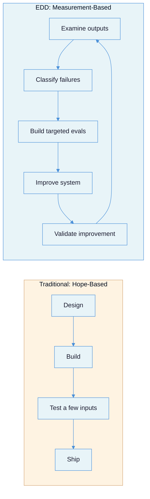
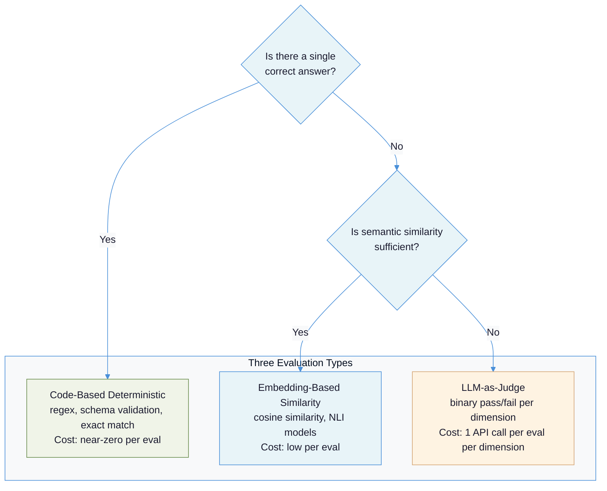
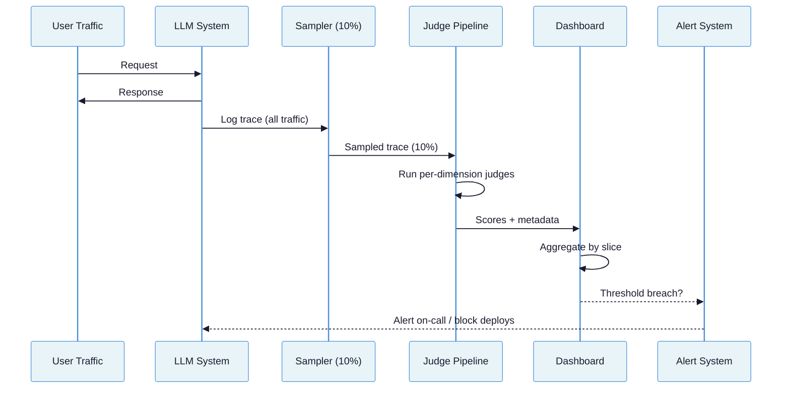

# Evaluation-Driven Development: Build the Measurement Before the Architecture

**Thesis:** Evaluation is not a gate you pass at the end of a project; it is the specification you build against, and the only honest way to know whether an LLM system works.

**Prerequisites:** [LLM Fundamentals for Practitioners](llm-fundamentals-for-practitioners.md) (sampling, temperature, why the same input gives different outputs), [Prompt Engineering](prompt-engineering.md) (how a prompt states intent). This document assumes a system that produces output and a person who cares whether that output is good.

**Reading time:** 26 minutes

| What teams assume | What actually happens |
|---|---|
| "We will add evaluation once the product stabilises" | Evaluation is the stabilising force. Without it every change is an unmeasured roll of the dice, and the system never stops changing |
| "A higher eval score means a better product" | Generic metrics do not predict user satisfaction. ROUGE, METEOR, BERTScore and G-Eval are [unreliable or impractical for production summarisation evaluation](https://eugeneyan.com/writing/evals/) |
| "One judge can grade all eight quality dimensions" | One judge asked for eight dimensions in one call lets a strong dimension inflate the weak ones. [Anthropic's guidance](https://www.anthropic.com/engineering/demystifying-evals-for-ai-agents) is one isolated judge per dimension |
| "Our accuracy improved from 87% to 91%, so we improved" | On 100 examples a 90% result carries a 95% interval of roughly 83% to 95%. A 4-point move sits inside that interval |
| "A 0-10 score gives more signal than pass/fail" | The 0-10 scale gave the weakest agreement with human graders (ICC 0.805) of the scales tested; 0-5 gave the strongest (ICC 0.853) ([grading-scale study](https://arxiv.org/abs/2601.03444)) |
| "A green test suite means the deployed system works" | The suite and the deployment answer different questions. See the [field notes](#field-notes-from-an-operating-estate): two source-level suites were green for two days while the deployed service returned errors |


```mermaid
%%{init: {'theme': 'base', 'themeVariables': {'primaryColor': '#e8f4f8', 'primaryTextColor': '#1a1a2e', 'primaryBorderColor': '#4a90d9', 'lineColor': '#4a90d9', 'secondaryColor': '#f0f4e8', 'tertiaryColor': '#fef3e2', 'clusterBkg': '#f8f9fa', 'edgeLabelBackground': '#f8f9fa'}}}%%
graph LR
    subgraph Traditional["Traditional: Hope-Based"]
        A1[Design] --> A2[Build] --> A3[Test a few inputs] --> A4[Ship]
    end
    subgraph EDD["EDD: Measurement-Based"]
        B1[Examine outputs] --> B2[Classify failures] --> B3[Build targeted evals] --> B4[Improve system] --> B5[Validate improvement] --> B1
    end
    style Traditional fill:#fef3e2,stroke:#d4a574
    style EDD fill:#e8f4f8,stroke:#4a90d9
```

---

## The Core Tension

Most LLM projects share one contradiction. Teams spend weeks choosing models, designing prompts, and building retrieval pipelines, then validate the work on a handful of inputs by checking whether the output "looks right". This is **vibes-based development**, still the default workflow for a large share of production LLM systems.

The contradiction is not that teams skip evaluation. It is that they treat it as a phase *after* architecture, a quality gate before deployment, which puts the dependency the wrong way round. Evaluation must come *before* architecture, because without measurement every architectural decision is a guess: no baseline, no way to know whether retrieval helps; no regression suite, no way to know whether a prompt change helps; no definition of "quality", no way to know whether a cheaper model is a saving.

The [Pragmatic Engineer's guide to LLM evals](https://newsletter.pragmaticengineer.com/p/evals) frames this as three gulfs that vibes-based development cannot cross:

| Gulf | What it means | Why vibes fail |
|---|---|---|
| **Comprehension** | Gap between developer understanding and system behaviour at scale | You tested 10 inputs; production sees 10,000 a day |
| **Specification** | Gap between intended behaviour and what the prompt actually instructs | Your prompt does not mean what you think it means |
| **Generalisation** | Gap between a well-written prompt and reliable performance across inputs | Edge cases are the norm, not the exception |

Evaluation-driven development (EDD) inverts the sequence. Instead of Build, Evaluate, Ship, the loop is the **eval flywheel**: examine outputs, classify the failures, build a targeted eval, improve the system, validate the improvement, and repeat. Error analysis surfaces failure modes, classification orders them by cost, construction makes them measurable, improvement fixes them, and validation catches the regressions the fix caused.

The flywheel comes from [Hamel Husain's field guide](https://hamel.dev/blog/posts/field-guide/): a case study improved a chatbot from 33% to 95% success without rewriting the architecture, by finding that date-handling failures affected 66% of conversations and writing one targeted fix.

The tension never fully resolves: measurement costs time that feels like it should go into the product, and it produces numbers that are uncomfortable to read. The rest of this document is about paying that cost deliberately rather than accidentally.

---

## Failure Taxonomy

Most evaluation efforts fail in one of eight ways. They are ordered by how often they appear.

### Failure Mode 1: The Vibes Check

**What it looks like:** A developer changes a prompt, runs three to five inputs, eyeballs the output, declares it good, and ships. No dataset, no metric, no record of what was tested.

**Why it happens:** Evaluation infrastructure feels like overhead when the system "works", the input space is unbounded, and quality is subjective. Teams default to spot-checking.

**Mechanism:** A spot check samples from the distribution the developer has in mind, never from the one the system will meet. Every later change is unmeasured, and regressions surface only when users report them.

### Failure Mode 2: The God Evaluator

**What it looks like:** A single judge prompt scores outputs on eight dimensions at once — helpfulness, accuracy, tone, completeness, conciseness, safety, relevance, creativity — each on a 1-5 scale.

**Why it happens:** Teams want broad coverage and assume one evaluator is simpler than several.

**Mechanism:** All dimensions share one generation, so a strong dimension pulls the weak ones up. [Eugene Yan warns](https://eugeneyan.com/writing/product-evals/) that the difference between a "3" and a "4" is subjective and varies between annotators. When the overall score drops from 3.7 to 3.4, nobody can say which dimension caused it or what to fix.

### Failure Mode 3: The Generic Metric Trap

**What it looks like:** The team adopts off-the-shelf metrics (helpfulness, factuality, coherence) without checking that they track the team's own definition of quality.

**Why it happens:** Framework documentation presents these metrics as ready to use. A custom metric needs domain expertise and labelled data the team does not have yet.

**Mechanism:** The metric becomes the target. The team optimises for the metric and the product does not improve, because the metric was never a proxy for what the user wanted. This is Goodhart's law with an API bill.

### Failure Mode 4: Self-Evaluation Bias

**What it looks like:** The model that generates the output also grades it, or the judge comes from the same model family as the generator.

**Why it happens:** Convenience. If one model already generates, using it to judge needs no extra setup.

**Mechanism:** Models prefer their own text. GPT-4 rated its own outputs favourably in 87.8% of cases against 47.6% for human evaluators ([Panickssery et al., NeurIPS 2024](https://arxiv.org/abs/2404.13076)), and the bias tracks self-recognition: the better a model identifies its own style, the more it inflates its own scores. The mechanism is perplexity — stylistically familiar text scores higher regardless of quality.

Two 2026 results widen the picture. [Lu et al.](https://arxiv.org/abs/2512.02304) tested 37 models across 7 families on 9 benchmarks: cross-family verification beats both self-verification and same-family verification, and the benefit shrinks as solver and verifier converge. A diagnostic study of 100 real research tasks found **uncorrected self-awareness** in 660 of 800 analyses (82.5%) — the agent identified its own fatal flaw, wrote it down, and reported the conclusion anyway ([AutoResearchEval, 2026](https://arxiv.org/abs/2608.14905)). Detecting a problem and acting on it are separate abilities.

### Failure Mode 5: Overfitting the Eval Set

**What it looks like:** The team improves prompts against the same 50 cases until the score reaches 95%. Production performance does not match.

**Why it happens:** The eval set is both the development set and the test set. Without a held-out split, every optimisation cycle leaks information about the test cases into the prompt.

**Mechanism:** The prompt is tuned to 50 specific inputs rather than to the traffic distribution. This is overfitting, with prompts instead of weights.

### Failure Mode 6: Statistical Naivety

**What it looks like:** The team reports "accuracy improved from 87% to 91%" on 100 examples, with no interval, no significance test, and no acknowledgement that the difference may be noise.

**Why it happens:** Traditional software testing is deterministic: a test passes or fails. LLM evaluation is stochastic, and teams apply deterministic reasoning to it.

**Mechanism:** Two independent sources of variance are ignored: sampling (the examples are a sample, not the population) and model noise (the same example can pass on one run and fail on the next). [Wang et al.](https://arxiv.org/abs/2512.21326) show model-sampling variance can exceed example-sampling variance, so an eval that holds examples fixed and ignores generation noise reports an interval that is too narrow for the wrong reason. [An ICML 2025 spotlight paper](https://arxiv.org/abs/2503.01747) found standard central-limit-theorem intervals fail below roughly 100 data points, producing error bars far too small. [NIST's January 2026 guidance on automated benchmark evaluation](https://www.nist.gov/news-events/news/2026/01/towards-best-practices-automated-benchmark-evaluations) recommends reporting uncertainty rather than a bare score, and [Wu et al.](https://arxiv.org/abs/2601.20251) give statistically guaranteed intervals for this setting.

### Failure Mode 7: The Tool Trap

**What it looks like:** The team evaluates five frameworks, builds elaborate infrastructure, and configures dashboards, but never examines its own model outputs.

**Why it happens:** Building infrastructure feels productive. Reading 200 outputs feels tedious.

**Mechanism:** Tooling moves the failure later without removing it. [Eugene Yan's central thesis](https://eugeneyan.com/writing/eval-process/) is that process discipline beats tool sophistication: "Adding another tool, metric, or LLM-as-judge will sidestep fundamental process failures."

### Failure Mode 8: The Unmeasured Capability Claim

**What it looks like:** Somebody writes down a property of the system — "this system is self-improving", "this system is auditable", "this pipeline is reproducible" — and nothing computes it. The claim is a sentence, not a check.

**Why it happens:** A capability claim is the most consequential thing known about a system and the least durable. Written down, it stops being true the day the system changes and nothing notices; re-derived by hand, it costs a full reading every time somebody asks.

**Mechanism:** Neither form is current or reusable, so the knowledge does not compound. Compute the claim from a recorded structure — components, typed edges, attached checks — so the answer survives the next change and is stale only as far as the map is stale. Treat the written claim as a cache a check recomputes and diffs, and fail the build on a mismatch.

---

## The Eval Maturity Spectrum

Not every system needs the same rigour; the right level depends on the stakes, the traffic, and the rate of change. Every system should know where it sits and what the next level requires.


```mermaid
%%{init: {'theme': 'base', 'themeVariables': {'primaryColor': '#e8f4f8', 'primaryTextColor': '#1a1a2e', 'primaryBorderColor': '#4a90d9', 'lineColor': '#4a90d9', 'secondaryColor': '#f0f4e8', 'tertiaryColor': '#fef3e2', 'clusterBkg': '#f8f9fa', 'edgeLabelBackground': '#f8f9fa'}}}%%
graph TD
    subgraph Spectrum["Eval Maturity Levels"]
        L0["Level 0: Vibes<br/>Manual spot-checking<br/>No recorded results"]
        L1["Level 1: Assertions<br/>Code-based checks on every run<br/>Structured output validation"]
        L2["Level 2: Golden Dataset<br/>50-200 labeled examples<br/>Automated regression suite"]
        L3["Level 3: LLM-as-Judge<br/>Per-dimension binary evaluators<br/>Domain expert alignment validated"]
        L4["Level 4: Statistical Rigor<br/>Confidence intervals on all metrics<br/>Held-out test sets, power analysis"]
        L5["Level 5: Continuous Production Eval<br/>Sampling, drift detection, alerting<br/>Eval-to-business-metric correlation"]
    end
    L0 --> L1 --> L2 --> L3 --> L4 --> L5
    style Spectrum fill:#f8f9fa,stroke:#4a90d9
    style L0 fill:#fef3e2,stroke:#d4a574
    style L1 fill:#fef3e2,stroke:#d4a574
    style L2 fill:#e8f4f8,stroke:#4a90d9
    style L3 fill:#e8f4f8,stroke:#4a90d9
    style L4 fill:#f0f4e8,stroke:#6b8e4e
    style L5 fill:#f0f4e8,stroke:#6b8e4e
```

| Level | Characteristics | Appropriate when | Investment |
|---|---|---|---|
| **0: Vibes** | Manual spot-checking | Never — this is the anti-pattern | Zero |
| **1: Assertions** | Code-based checks | Structured output, classification | Hours |
| **2: Golden Dataset** | 50-200 labelled examples | Any system approaching production | Days |
| **3: LLM-as-Judge** | Per-dimension binary judges | Subjective quality, open-ended generation | 1-2 weeks |
| **4: Statistical Rigor** | Intervals, held-out sets | High-stakes decisions, model comparison | 2-4 weeks |
| **5: Continuous Production** | Sampling, drift, alerting | Production traffic, revenue impact | Ongoing |

Level 2 is the minimum viable evaluation for any system approaching production. Levels 3 to 5 follow in sequence as stakes rise.

**Level 4 is not "add error bars".** It is the point where you can say what a number means; the precision available from a small set is lower than most teams assume. The intervals below are Wilson score 95% intervals for an observed 90% pass rate:

| Examples | Passes | 95% interval | Half-width |
|---|---|---|---|
| 10 | 9 | 60% – 98% | ±19 points |
| 20 | 18 | 70% – 97% | ±14 points |
| 50 | 45 | 79% – 96% | ±9 points |
| 100 | 90 | 83% – 95% | ±6 points |
| 200 | 180 | 85% – 93% | ±4 points |
| 500 | 450 | 87% – 92% | ±3 points |
| 1000 | 900 | 88% – 92% | ±2 points |

These figures are arithmetic on the Wilson interval, not a measurement of any system, and they make one point: at 20 examples you cannot distinguish a good system from a mediocre one, and at 100 a 4-point change is still inside the noise. To separate two close systems you need hundreds of examples, or a paired design that controls for per-example difficulty.

**Level 3 has a ceiling that isolation does not fix.** A judge can be perfectly isolated and still be wrong: predicting failure well does not prevent it. [Vasudev et al.](https://arxiv.org/abs/2602.03338) report a binary critic with strong offline accuracy (AUROC 0.94) that caused a 26-percentage-point collapse on one model and near-zero effect on another under the same intervention policy. They name the mechanism, a **disruption-recovery tradeoff**: interventions recover trajectories that would have failed and disrupt trajectories that would have succeeded. Offline judge accuracy is therefore not sufficient evidence that a judge is safe to act on; a pilot of roughly 50 tasks can forecast the direction before deployment.

---

## Design Principles

### Principle 1: Start with error analysis, not infrastructure

**Why it works:** It counters Failure Mode 7 and Failure Mode 3. Reading outputs tells you which failures actually occur, the only reliable source for which metrics matter. Metrics chosen before error analysis are guesses about your own system.

**How to apply:** Follow the [Pragmatic Engineer's open coding method](https://newsletter.pragmaticengineer.com/p/evals):

1. Collect 100+ diverse production-like traces (inputs, outputs, intermediate steps).
2. Read every trace. Annotate with bottom-up observations — do not use predefined categories.
3. Group observations into 5-10 failure themes (axial coding).
4. Quantify: count the frequency of each failure mode.
5. Build evals targeting the top three failure modes by frequency.

The process takes two to three days and produces more actionable insight than any framework. [Hamel Husain recommends](https://hamel.dev/blog/posts/evals/) allocating 60-80% of development time to error analysis and evaluation rather than infrastructure.

### Principle 2: Build golden datasets through domain expert curation

**Why it works:** It counters Failure Mode 5. A held-out split makes overfitting visible: when the development set improves and the held-out set does not, you have tuned to your examples rather than to the problem. A golden dataset also creates a stable reference point — without one, every measurement is relative, and you can measure change but not quality.

**How to apply:** Size targets vary by maturity. [Microsoft's copilot team](https://github.com/microsoft/promptflow-resource-hub/blob/main/sample_gallery/golden_dataset/copilot-golden-dataset-creation-guidance.md) recommends 100-150 examples for initial quality measurement. [Eugene Yan recommends](https://eugeneyan.com/writing/product-evals/) 200+ with 50-100 explicit failure cases. For production systems, target 500-2,000 examples stratified by difficulty and input type.

```python
# Golden dataset schema
import json
from dataclasses import dataclass
from enum import Enum

class Difficulty(Enum):
    EASY = "easy"          # clear intent, common pattern
    MEDIUM = "medium"      # ambiguous intent or domain-specific
    HARD = "hard"          # adversarial, edge case, multi-step reasoning

class ExpectedVerdict(Enum):
    PASS = "pass"
    FAIL = "fail"

@dataclass
class GoldenExample:
    id: str
    input_text: str
    expected_output: str           # or null for open-ended
    category: str                  # failure mode or feature area
    difficulty: Difficulty
    expected_verdict: ExpectedVerdict
    source: str                    # "production", "synthetic", "expert-authored"
    annotator: str                 # who labeled this

# Stratification targets for a 200-example dataset:
# - 40% easy (80 examples)   -- baseline sanity
# - 35% medium (70 examples) -- realistic production traffic
# - 25% hard (50 examples)   -- adversarial and edge cases
# - At least 50 examples should be known failure cases
```

**Critical rules:**
- Never use synthetic questions when measuring real-world quality ([Microsoft's guidance](https://github.com/microsoft/promptflow-resource-hub/blob/main/sample_gallery/golden_dataset/copilot-golden-dataset-creation-guidance.md)).
- Generate organic failures by running smaller, less capable models — synthetic defects are often out of distribution ([Eugene Yan](https://eugeneyan.com/writing/product-evals/)).
- Maintain a 75/25 development and held-out split. Never optimise against the held-out set.
- Refresh quarterly or after major system changes. [Criteria drift](https://arxiv.org/abs/2404.12272) means evaluation criteria change as you observe more outputs.

### Principle 3: Use three eval types, and know when each applies

**Why it works:** It counters Failure Mode 3. Different failure modes need different detection mechanisms, and forcing all evaluation through one type creates blind spots.


```mermaid
%%{init: {'theme': 'base', 'themeVariables': {'primaryColor': '#e8f4f8', 'primaryTextColor': '#1a1a2e', 'primaryBorderColor': '#4a90d9', 'lineColor': '#4a90d9', 'secondaryColor': '#f0f4e8', 'tertiaryColor': '#fef3e2', 'clusterBkg': '#f8f9fa', 'edgeLabelBackground': '#f8f9fa'}}}%%
graph TD
    subgraph Types["Three Evaluation Types"]
        direction TB
        CB["Code-Based Deterministic<br/>regex, schema validation, exact match<br/>Cost: near-zero per eval"]
        EB["Embedding-Based Similarity<br/>cosine similarity, NLI models<br/>Cost: low per eval"]
        LJ["LLM-as-Judge<br/>binary pass/fail per dimension<br/>Cost: 1 API call per eval per dimension"]
    end
    Q{Is there a single<br/>correct answer?}
    Q -->|Yes| CB
    Q -->|No| Q2{Is semantic similarity<br/>sufficient?}
    Q2 -->|Yes| EB
    Q2 -->|No| LJ
    style Types fill:#f8f9fa,stroke:#4a90d9
    style CB fill:#f0f4e8,stroke:#6b8e4e
    style EB fill:#e8f4f8,stroke:#4a90d9
    style LJ fill:#fef3e2,stroke:#d4a574
```

**Type 1 — Code-based deterministic checks.** Use when code can verify the failure. These are the cheapest and most reliable evals.

```python
# Code-based evals: run on every commit
def eval_structured_output(response: dict) -> bool:
    """Verify JSON schema compliance."""
    required_fields = {"answer", "confidence", "sources"}
    return required_fields.issubset(response.keys())

def eval_no_pii_leakage(output: str) -> bool:
    """Verify no SSN or credit card patterns in output."""
    import re
    ssn_pattern = r'\b\d{3}-\d{2}-\d{4}\b'
    cc_pattern = r'\b\d{4}[\s-]?\d{4}[\s-]?\d{4}[\s-]?\d{4}\b'
    return not (re.search(ssn_pattern, output) or re.search(cc_pattern, output))

def eval_word_count(output: str, max_words: int = 500) -> bool:
    """Verify output respects length constraints."""
    return len(output.split()) <= max_words
```

**Type 2 — Embedding-based similarity.** Use when an approximate semantic match is sufficient: summarisation, paraphrasing, translation.

**Type 3 — LLM-as-judge.** Use for subjective quality dimensions where code-based checks are impossible. See Principle 4.

The priority order is always code-based first, embedding-based second, LLM-as-judge last. If code can catch a failure, do not spend an API call on a judge.

### Principle 4: Build judges with binary verdicts and per-dimension isolation

**Why it works:** It counters Failure Mode 2 and Failure Mode 4. Binary PASS/FAIL forces clarity about what matters, and per-dimension isolation stops one criterion contaminating another. This approach reaches [above 90% agreement with domain experts](https://hamel.dev/blog/posts/llm-judge/) within three iteration rounds, against multi-dimensional Likert scales that produce unreliable, unactionable scores.

**How to apply:** Follow [Hamel Husain's critique shadowing method](https://hamel.dev/blog/posts/llm-judge/) to build each judge, then isolate them.

```python
from anthropic import Anthropic

client = Anthropic()

# One evaluator per dimension -- never combine
FAITHFULNESS_JUDGE = """You are evaluating whether an AI assistant's response
is faithful to the provided source documents.

## Task
Determine if the response contains ONLY information that can be verified
from the source documents. Any claim not supported by the sources is a
faithfulness violation.

## Input
<source_documents>
{context}
</source_documents>

<response>
{response}
</response>

## Output Format
Return ONLY a JSON object:
{{"claims": [
    {{"claim": "...", "supported": true, "source_passage": "..."}}
  ],
  "verdict": "PASS" or "FAIL",
  "reason": "One sentence explaining the verdict"
}}"""

RELEVANCE_JUDGE = """You are evaluating whether an AI assistant's response
directly addresses the user's question. A response that is accurate but
off-topic is a relevance failure.

## Input
<question>
{question}
</question>

<response>
{response}
</response>

## Output Format
Return ONLY a JSON object:
{{"intent": "...",
  "addresses_intent": true or false,
  "verdict": "PASS" or "FAIL",
  "reason": "One sentence explaining the verdict"
}}"""


def run_judge(judge_prompt: str, **kwargs) -> dict:
    """Run a single-dimension binary judge."""
    import json
    formatted = judge_prompt.format(**kwargs)
    response = client.messages.create(
        model="claude-sonnet-4-20250514",  # different family from the generator
        max_tokens=1024,
        temperature=0.0,
        messages=[{"role": "user", "content": formatted}],
    )
    return json.loads(response.content[0].text)


def evaluate_response(question: str, response: str, context: str) -> dict:
    """Run all dimension judges and aggregate."""
    faithfulness = run_judge(FAITHFULNESS_JUDGE, context=context, response=response)
    relevance = run_judge(RELEVANCE_JUDGE, question=question, response=response)

    return {
        "faithfulness": faithfulness["verdict"],
        "relevance": relevance["verdict"],
        "all_pass": all(
            v["verdict"] == "PASS"
            for v in [faithfulness, relevance]
        ),
    }
```

**Validation:** Measure judge alignment against domain expert labels with Cohen's Kappa. Target 0.4-0.6 as a minimum, 0.7 or above as excellent. [Human inter-rater reliability](https://eugeneyan.com/writing/product-evals/) often ranges 0.2-0.3 Kappa — your judge need only match human consistency, not exceed it.

**Key rules for judge construction:**
- Use a judge from a different model family than the generator, to avoid [self-evaluation bias](https://martinfowler.com/articles/gen-ai-patterns/).
- Request chain-of-thought reasoning before the verdict ([it improves judge quality](https://www.evidentlyai.com/llm-guide/llm-as-a-judge)).
- Set temperature to 0.0 for reproducibility, and record the exact judge model and version beside every score. A judge updated under you changes your metric, not your system.
- Do not let the judge see the requester's later turns. An evaluator shown a user's counterargument as a follow-up turn tends to endorse it ([Kim & Khashabi, EMNLP 2025 Findings](https://arxiv.org/abs/2509.16533)).

### Principle 5: Apply statistical rigour to every metric

**Why it works:** It counters Failure Mode 6. Without an interval you cannot tell signal from randomness; without power analysis you cannot know whether your set is large enough to detect the improvement you care about.

**How to apply:** Report a mean, an interval, and a sample size, always. Use paired comparisons when two systems meet the same examples, because pairing removes per-example difficulty from the comparison and buys precision for free.

```python
import numpy as np
from scipy import stats

def binary_interval(n_pass, n_total, confidence=0.95):
    """Wilson score interval -- preferred over the normal approximation
    for binary outcomes, especially with small samples or extreme proportions."""
    from statsmodels.stats.proportion import proportion_confint
    return proportion_confint(n_pass, n_total, alpha=1 - confidence, method="wilson")

def paired_comparison(scores_a, scores_b):
    """Compare two systems on the same eval set using paired differences.
    Paired tests control for per-example difficulty variation."""
    differences = [a - b for a, b in zip(scores_a, scores_b)]
    mean_diff = np.mean(differences)
    se_diff = np.std(differences, ddof=1) / np.sqrt(len(differences))
    stat, p_value = stats.wilcoxon(differences, alternative="two-sided")
    return {
        "mean_difference": mean_diff,
        "standard_error": se_diff,
        "ci_95": (mean_diff - 1.96 * se_diff, mean_diff + 1.96 * se_diff),
        "p_value": p_value,
        "n": len(differences),
    }

def required_sample_size(baseline_rate, minimum_detectable_effect,
                         alpha=0.05, power=0.80):
    """How many examples are needed to detect a given improvement?
    Detecting a half-size effect needs four times the examples."""
    from statsmodels.stats.power import NormalIndPower
    effect_size = minimum_detectable_effect / np.sqrt(
        baseline_rate * (1 - baseline_rate))
    n = NormalIndPower().solve_power(
        effect_size=effect_size, alpha=alpha, power=power)
    return int(np.ceil(n))

# required_sample_size(0.80, 0.05) -> approximately 400 examples
```

**Minimum reporting standard** ([Cameron Wolfe's statistical handbook](https://cameronrwolfe.substack.com/p/stats-llm-evals)): always report mean, standard error, sample size, and interval. For model comparisons, report paired differences, standard errors, intervals, and score correlations.

**Thresholds to carry in your head:**
- Below 100 examples, central-limit-theorem intervals are unreliable. Use a Wilson interval for proportions, or a bootstrap ([Indeed Engineering's bootstrap approach](https://engineering.indeedblog.com/blog/2026/07/bootstrap-confidence-intervals-for-llm-evaluation)).
- Bootstrap the *cluster*, not the row, when each example runs several times: resampling individual runs underestimates uncertainty, because runs of the same example are correlated.
- 200 examples at a 5% defect rate, observing 3%: 95% interval 0.6% – 5.4% (inconclusive).
- 400 examples at the same rate: 95% interval 1.3% – 4.7% ([conclusive](https://eugeneyan.com/writing/product-evals/)).

### Principle 6: Choose frameworks for what they do best

**Why it works:** It counters Failure Mode 7. No single framework covers every evaluation need, and choosing per job avoids rebuilding what already exists.

| Framework | Best for | Runs in CI? | Self-hosted? | Status, September 2026 |
|---|---|---|---|---|
| **[DeepEval](https://github.com/confident-ai/deepeval)** | Pytest-native LLM testing, agent metrics (task completion, tool correctness, step efficiency) | Yes (pytest plugin) | Yes (open source) | Version 4.x, whose 4.0 line added a local terminal trace inspector and agent loop-detection metrics ([changelog](https://deepeval.com/changelog/changelog-2026)). Pin a reviewed version — the default judge model changes between releases |
| **[RAGAS](https://docs.ragas.io/en/stable/)** | Retrieval and RAG metrics (faithfulness, context precision and recall) | Yes | Yes (open source) | Version 0.4.x |
| **[Promptfoo](https://www.promptfoo.dev/docs/red-team/)** | Adversarial red teaming and static scanning, with OWASP and NIST presets | Yes | Yes (open source) | [Acquired by OpenAI in March 2026](https://www.promptfoo.dev/blog/promptfoo-joining-openai). The open-source suite continues and stays multi-provider, but its roadmap now sits inside a frontier lab — weigh that if vendor neutrality matters |
| **[Arize Phoenix](https://arize.com/docs/phoenix)** | OpenTelemetry-native tracing and local experimentation | Yes | Yes (open source) | Strong fit when you already emit OTLP traces |
| **[Langfuse](https://langfuse.com/docs/scores/model-based-evals)** | Self-hosted tracing, datasets, and model-based scoring | Yes | Yes (open source) | A good default for teams avoiding vendor lock-in |
| **[TruLens](https://www.trulens.org)** | OpenTelemetry-native tracing and evaluation for agents | Yes | Yes (open source) | Maintained in the open by Snowflake since its acquisition; still active |
| **[Braintrust](https://www.braintrust.dev/docs/reference/autoevals)** | Release gating, human annotation workflows, production governance | Via API | Cloud only | Commercial platform, not open source |

**When to use which:**

- **Starting from zero?** DeepEval: `assert_test` drops into an existing pytest suite in minutes.
- **Building retrieval, or already emitting OpenTelemetry traces?** RAGAS for retrieval metrics; Phoenix or TruLens to evaluate the traces you already have.
- **Security, self-hosting, or release gating?** Promptfoo for adversarial red teaming, Langfuse for self-hosted scoring, Braintrust for human review and release gating.
- **Several needs?** Combine them.

**Cost awareness:** evaluating 1,000 samples across four judge dimensions needs about 4,000 calls. At $3 per million input tokens with a 500-token average prompt, that is roughly $6 per run, scaling linearly. Remember the cost of the alternative: an unmeasured release.

### Principle 7: Close the loop with production monitoring

**Why it works:** It counters the gap between offline and live behaviour. Offline evals tell you whether the system works on your dataset; production monitoring tells you whether it works on your users' inputs. Model behaviour drifts, user behaviour shifts, and the world changes.


```mermaid
%%{init: {'theme': 'base', 'themeVariables': {'primaryColor': '#e8f4f8', 'primaryTextColor': '#1a1a2e', 'primaryBorderColor': '#4a90d9', 'lineColor': '#4a90d9', 'secondaryColor': '#f0f4e8', 'tertiaryColor': '#fef3e2', 'clusterBkg': '#f8f9fa', 'edgeLabelBackground': '#f8f9fa'}}}%%
sequenceDiagram
    participant U as User Traffic
    participant S as LLM System
    participant Sam as Sampler (10%)
    participant J as Judge Pipeline
    participant D as Dashboard
    participant A as Alert System

    U->>S: Request
    S->>U: Response
    S->>Sam: Log trace (all traffic)
    Sam->>J: Sampled trace (10%)
    J->>J: Run per-dimension judges
    J->>D: Scores + metadata
    D->>D: Aggregate by slice
    D-->>A: Threshold breach?
    A-->>S: Alert on-call / block deploys
```

**Sampling strategy:** [Evidently AI recommends](https://www.evidentlyai.com/llm-guide/llm-as-a-judge) running judges on 10% of production data at regular intervals. For high-traffic systems, stratified sampling keeps user segments and input categories represented.

**Drift detection:** Monitor the distribution of judge verdicts over time. A sudden rise in the FAIL rate for faithfulness indicates a model change, a data change, or a prompt regression. Track per slice to stop aggregated metrics masking an underperforming subgroup — the [EDDOps reference architecture](https://arxiv.org/html/2411.13768v3) mandates slice-by-slice analysis.

**Alerting thresholds:** Alert at two standard deviations below the rolling seven-day average for each dimension. Require a minimum sample size before alerting, or small batches produce false positives.

**The eval-to-business-metric bridge:** The gap between "our faithfulness score is 92%" and "our users are satisfied" is the hardest to close. [Confident AI's metric-outcome-fit framework](https://www.confident-ai.com/blog/the-ultimate-llm-evaluation-playbook) recommends:

1. Label 25-50 examples with both eval verdicts and business outcomes (user satisfaction, task completion, support ticket raised).
2. Measure alignment: target under 5% combined false-positive and false-negative rate between eval verdicts and business outcomes.
3. Track correlation between eval pass rates and business measures over time.

### Principle 8: Name the tier — check the artifact you ship, not the code you wrote

**Why it works:** It counters the most expensive misunderstanding here. A check that boots the service from source answers "is the code correct?"; a check that reads the deployed service answers "does the thing in use work now?" Both are valid, but only one finds the outage.

**How to apply:** For every check, write down the tier it runs at and the address it reads. When a request says "end to end" and the plan scopes the work to a source-level test, stop and ask before building. Shrinking the ask to fit the plan is the failure mode; the plan is not the requirement.

```python
# Answers "is the code correct?" -- a valid check, NOT an end-to-end check
def check_source_level():
    app = build_app_from_source()
    client = app.test_client()
    return client.get("/health").status_code == 200

# Answers "does the deployed thing work now?" -- reads what a person uses
def check_deployed(address, real_config, real_store):
    response = requests.get(f"{address}/health", timeout=5)
    assert response.status_code == 200, response.text
    assert real_store.ping(), "live data store unreachable"
    return response.json()
```

---

## Evaluation: Real-World Systems

The table below grades the eval practices most often found in production agentic systems. The level refers to the maturity spectrum above.

| Practice | Level | What it measures | Key weakness |
|---|---|---|---|
| Golden set of 50-200 curated examples in CI | 2 | Regression against known cases | Ceiling set by curation quality; drifts stale |
| Per-dimension binary judges, cross-family | 3 | Subjective quality per dimension | Cost, latency, and the judge can be sycophantic to the requester |
| Judge plus intervals, held-out set, power analysis | 4 | Whether a difference is real | Needs hundreds of examples for close comparisons |
| A computed capability verdict re-derived from a recorded structure | 4-5 | Whether a claimed property still holds | Only as current as the underlying map |

Two named sources make the isolation question concrete. **Anthropic's guidance** recommends grading each dimension with an isolated judge rather than one judge for all dimensions ([Demystifying evals for AI agents](https://www.anthropic.com/engineering/demystifying-evals-for-ai-agents)). **Evidently's open guide** catalogues the failure modes of judge-based evaluation and the mitigation for each bias ([LLM-as-a-judge guide](https://www.evidentlyai.com/llm-guide/llm-as-a-judge)). Both converge on one point: the judge is an instrument, and an instrument needs calibration evidence.

---

## Recommendations

### Short term (this week)

1. **Read 100 traces.** No framework: write observations, group them, count them (Principle 1).
2. **Build five code-based assertions** for structured output, length, and mechanically detectable leakage, and run them on every commit (Principle 3).
3. **Create a 50-example golden dataset** of hard cases, labelled PASS/FAIL, in version control.
4. **Record the baseline:** what the system does today and the set you measured it on. Without one, no improvement claim is checkable.

### Medium term (this month)

5. **Build per-dimension judges** for the top three failure modes from your error analysis, and validate each against expert labels (Cohen's Kappa 0.4 or above, Principle 4).
6. **Expand the golden set to 200+ examples** with a 75/25 split stratified by difficulty and category (Principle 2).
7. **Add intervals and sample size to every reported number**, and use the paired comparison for any A/B decision (Principle 5).
8. **Write down the tier of every check** and the address the deployed checks read (Principle 8).
9. **Move the suite into CI as a gate.** Block the merge when the pass rate falls below a threshold taken from the interval, not a round number.

### Long term (this quarter)

10. **Deploy production monitoring** with 10% sampling, per-dimension judges, per-slice aggregation, and drift alerts (Principle 7).
11. **Validate the eval-to-business-metric bridge:** correlate pass rates with user satisfaction, task completion, and support volume until the alignment error is under 5%.
12. **Compute the capability claims:** for each property you assert, attach a check that recomputes it and fails on a mismatch with the written claim (Failure Mode 8).
13. **Establish a refresh cadence.** Review the golden set quarterly, add production failure cases, retire examples that no longer represent traffic.

---

## The Hard Truth

Most teams that claim to practice evaluation-driven development practise **evaluation-adjacent development**: they have evals, but the evals do not drive decisions. The prompt changes, somebody checks whether the scores moved, and if they are roughly in the same range, the change ships. The evals document effort rather than gate quality.

Building good evals is harder than building the system they measure. Defining "correct" for a subjective task takes more domain expertise than writing the prompt; constructing a dataset that represents production traffic takes more understanding of your users than building the feature they use; validating that a judge agrees with human judgement takes more statistical care than most teams practise.

The one thing to remember: **an eval you have not run is an opinion.** A number with an interval, a sample size, and a recorded set is a measurement, and only measurements survive contact with users.

---

## Summary Checklist

| Question | Good answer | Bad answer |
|---|---|---|
| How do you monitor production quality? | Sampled judges per dimension, drift alerts, business-metric correlation | Check dashboards when users complain |
| Does your eval read the deployed service? | Yes, with the tier named and the address recorded | The suite boots the service from source and calls itself end to end |
| Is any capability claim of yours computed? | Yes, a check recomputes it and fails on a mismatch | It is written in a document and nothing recomputes it |
| What did you build first? | Error analysis of 100+ traces | Framework integration |

---

## Field Notes from an Operating Estate

*Three observations from running an estate of roughly a dozen agent harnesses, published as abstract patterns.*

**July 2026 — a green suite and a broken service are compatible.** Two source-level test suites were green for two days while the deployed service returned errors on every request. The suites were not wrong: they answered "is the code correct?", and the code was correct. Nobody had written a check that read the deployed service. The repair was not a better suite. It was a rule that every end-to-end request names four fields a brief usually drops: the address a person uses, the live pieces it must touch, what it must not write, and the check that reads the deployed service and reports its own evidence. A report that calls a source-level suite end-to-end is now the defect the rule exists to prevent.

**July 2026 — capability claims had no checkable form.** An assertion of the form "this system is self-improving" could be written down and could not be computed. The estate built a small layer that derives such claims from a recorded structure — components, typed edges, and attached checks — and recomputes them, failing the build when a declared verdict no longer matches the recomputed one. The finding that generalises is narrower than the implementation: a claim with no check behind it is stale from the moment it is written, and a written claim kept beside a check that recomputes it is a cache, not a fact.

**August 2026 — the useful measurement is the one that changes a decision.** The estate's most valuable evaluation work was not a benchmark. It was a per-step record of which checks fired, which were skipped, and which could not be measured at all. Classifying every step as expected, skipped, wrong-version, or gap made a distinction visible that no aggregate pass rate can express: the difference between "the check passed" and "the check never ran".

---

## References

### Research papers

- [Panickssery et al., "LLM Evaluators Recognize and Favor Their Own Generations," NeurIPS 2024](https://arxiv.org/abs/2404.13076) — Self-preference quantified at 87.8% for GPT-4; the bias tracks self-recognition ability.
- [Lu et al., "When Does Verification Pay Off? A Closer Look at LLMs as Solution Verifiers," 2026](https://arxiv.org/abs/2512.02304) — 37 models, 7 families, 9 benchmarks: cross-family verification beats self- and same-family verification, and the benefit shrinks as solver and verifier converge.
- [AutoResearchEval, "How Do Agents Fail on AutoResearch," 2026](https://arxiv.org/abs/2608.14905) — 45 failure patterns across 800 analyses; uncorrected self-awareness in 82.5% of analyses.
- [Vasudev et al., "Accurate Failure Prediction in Agents Does Not Imply Effective Failure Prevention," 2026](https://arxiv.org/abs/2602.03338) — A critic at AUROC 0.94 caused a 26-point collapse; the disruption-recovery tradeoff; a 50-task pilot forecasts the direction.
- [Huang et al., "Large Language Models Cannot Self-Correct Reasoning Yet," ICLR 2024](https://arxiv.org/abs/2310.01798) — Intrinsic self-correction without external feedback degrades reasoning performance.
- [Stechly et al., "On the Self-Verification Limitations of Large Language Models on Reasoning and Planning Tasks," ICLR 2025](https://arxiv.org/abs/2402.08115) — Self-critique reduced measured performance versus single-shot prompting.
- [Kocmi & Federmann, "Navigating the Grading Scale," 2026](https://arxiv.org/abs/2601.03444) — Scale choice changes human-judge agreement: 0-5 strongest (ICC 0.853), 0-10 weakest (ICC 0.805).
- [Miller, "Adding Error Bars to Evals," 2024](https://arxiv.org/abs/2411.00640) — The standard treatment of variance and intervals in LLM evaluation.
- [Wang et al., "Measuring all the noises of LLM Evals," 2025](https://arxiv.org/abs/2512.21326) — Model-sampling variance can exceed example-sampling variance.
- [Wu et al., "Efficient Evaluation of LLM Performance with Statistical Guarantees," 2026](https://arxiv.org/abs/2601.20251) — Statistically guaranteed intervals at a fraction of the cost of naive evaluation.
- [CLT-Based Confidence Intervals Fail for LLM Evals, ICML 2025 spotlight](https://arxiv.org/abs/2503.01747) — Standard intervals are too narrow below roughly 100 data points.
- [Shankar et al., "Who Validates the Validators?", UIST 2024](https://arxiv.org/abs/2404.12272) — Evaluation criteria drift as evaluators observe more outputs.
- [EDDOps: A Reference Architecture for Evaluation-Driven Development of LLM Agents](https://arxiv.org/html/2411.13768v3) — Per-slice reporting and shadow and canary deployment patterns.
- ["A survey on LLM-as-a-judge," *The Innovation*, 7(6), June 2026](https://www.sciencedirect.com/science/article/pii/S2666675825004564) — Consolidates reliability strategies: consistency, bias mitigation, and a judge-reliability benchmark.
- [Kim & Khashabi, "Challenging the Evaluator: LLM Sycophancy Under User Rebuttal," EMNLP 2025 Findings](https://arxiv.org/abs/2509.16533) — An evaluator endorses a user's counterargument when it arrives as a later turn.
- [Bavaresco et al., "Judging the Judges," ACL 2025](https://arxiv.org/abs/2406.07791) — 15 judges, 22 tasks, about 150,000 instances; position bias varies by judge, task, and the quality gap between candidates.
- [Dubois et al., "Length-Controlled AlpacaEval," 2024](https://arxiv.org/abs/2404.04475) — Length debiasing raised Spearman correlation with human preference from 0.94 to 0.98.

### Practitioner articles

- [Hamel Husain, "Your AI Product Needs Evals"](https://hamel.dev/blog/posts/evals/) — Three-level evaluation architecture with budget allocation guidance.
- [Hamel Husain, "Using LLM-as-a-Judge: A Complete Guide"](https://hamel.dev/blog/posts/llm-judge/) — The critique shadowing method behind the above 90% expert-agreement figure.
- [Hamel Husain, "Evals FAQ"](https://hamel.dev/blog/posts/evals-faq/) — Sample-size guidance, common mistakes, and budget allocation.
- [Hamel Husain, "A Field Guide for Rapidly Improving AI Products"](https://hamel.dev/blog/posts/field-guide/) — The 33% to 95% case study behind the eval flywheel.
- [Eugene Yan, "Task-Specific LLM Evals That Do and Don't Work"](https://eugeneyan.com/writing/evals/) — Which metrics work per task type; ROUGE and BERTScore unreliability for summarisation.
- [Eugene Yan, "An LLM-as-Judge Won't Save The Product"](https://eugeneyan.com/writing/eval-process/) — Process discipline beats tool sophistication.
- [Eugene Yan, "Product Evals in Three Simple Steps"](https://eugeneyan.com/writing/product-evals/) — Dataset construction, Cohen's Kappa targets, and the defect-rate interval arithmetic.
- [The Pragmatic Engineer, "A Pragmatic Guide to LLM Evals"](https://newsletter.pragmaticengineer.com/p/evals) — The three-gulfs framing and the open-coding method.
- [Martin Fowler, "Generative AI Patterns"](https://martinfowler.com/articles/gen-ai-patterns/) — Eval-driven development as a named pattern; self-evaluation bias as an anti-pattern.
- [Cameron Wolfe, "Statistics for LLM Evals"](https://cameronrwolfe.substack.com/p/stats-llm-evals) — Variance decomposition, paired comparisons, power analysis, minimum reporting standards.
- [Indeed Engineering, "Bootstrap Confidence Intervals for LLM Evaluation," July 2026](https://engineering.indeedblog.com/blog/2026/07/bootstrap-confidence-intervals-for-llm-evaluation) — Cluster bootstrap for repeated runs over the same examples.
- [Anthropic, "Demystifying Evals for AI Agents"](https://www.anthropic.com/engineering/demystifying-evals-for-ai-agents) — One isolated judge per dimension.
- [Evidently AI, "LLM-as-a-judge: A Complete Guide"](https://www.evidentlyai.com/llm-guide/llm-as-a-judge) — Judge types, position-bias mitigation, and production monitoring architecture.
- [Confident AI, "The Ultimate LLM Evaluation Playbook"](https://www.confident-ai.com/blog/the-ultimate-llm-evaluation-playbook) — Metric-outcome fit and the eval-to-business-metric bridge.
- [Datadog, "LLM Evaluation Framework Best Practices"](https://www.datadoghq.com/blog/llm-evaluation-framework-best-practices/) — Production monitoring pipeline architecture.

### Official documentation and guidance

- [NIST, "Towards Best Practices for Automated Benchmark Evaluations," January 2026](https://www.nist.gov/news-events/news/2026/01/towards-best-practices-automated-benchmark-evaluations) — Report uncertainty, not a bare score.
- [DeepEval 2026 changelog](https://deepeval.com/changelog/changelog-2026) — The 4.0 line: local trace inspector, agent loop-detection and tool-permission metrics.
- [DeepEval releases](https://github.com/confident-ai/deepeval/releases) — Version history for pinning.
- [RAGAS documentation](https://docs.ragas.io/en/stable/) — Retrieval metrics and custom judge models.
- [Promptfoo red-teaming documentation](https://www.promptfoo.dev/docs/red-team/) — OWASP and NIST presets.
- [Promptfoo, "Promptfoo is joining OpenAI," March 2026](https://www.promptfoo.dev/blog/promptfoo-joining-openai) — The acquisition announcement and the open-source commitment.
- [Microsoft PromptFlow: golden dataset creation guidance](https://github.com/microsoft/promptflow-resource-hub/blob/main/sample_gallery/golden_dataset/copilot-golden-dataset-creation-guidance.md) — The 100-150 example minimum and the construction process.
- [Langfuse: model-based evaluations](https://langfuse.com/docs/scores/model-based-evals) — Self-hosted scoring.
- [Arize Phoenix documentation](https://arize.com/docs/phoenix) — OpenTelemetry-native tracing and evaluation.
- [Braintrust autoevals reference](https://www.braintrust.dev/docs/reference/autoevals) — Scorer configuration.

### Related documents in this suite

- [LLM Role Separation: Executor vs Evaluator](llm-role-separation-executor-evaluator.md) — Why the judge must be structurally independent, at seven levels of isolation.
- [Quality Gates in Agentic Systems](quality-gates-in-agentic-systems.md) — The enforcement layer that turns an eval into a gate.
- [Observability and Monitoring](observability-and-monitoring.md) — Traces, sampling, and drift detection in production.
- [AI-Native Solution Patterns](ai-native-solution-patterns.md) — Build stages with evaluation criteria per architectural pattern.
- [RAG: From Concept to Production](rag-from-concept-to-production.md) — Retrieval-specific metrics and thresholds.

---

*Last reviewed: September 2026. Changed in this revision: added the failure mode for unmeasured capability claims, added the Wilson-interval precision table and cluster-bootstrap guidance, added a principle on naming the check's tier, corrected the framework list (DeepEval 4.x, RAGAS 0.4.x, Promptfoo's March 2026 acquisition, TruLens and Langfuse added), corrected two in-document links, and added field notes.*
