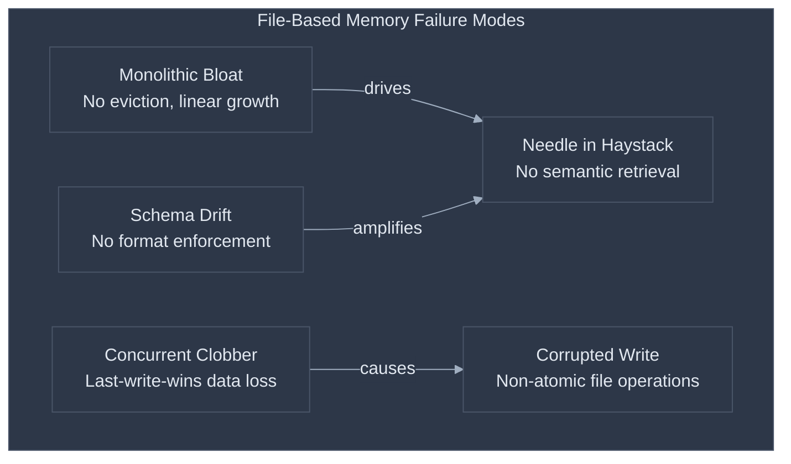
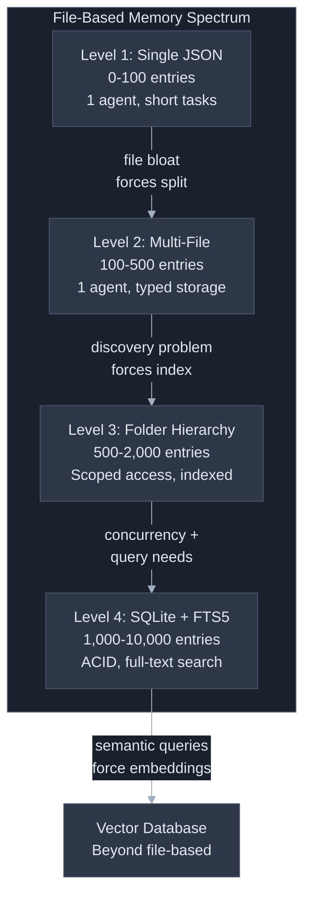
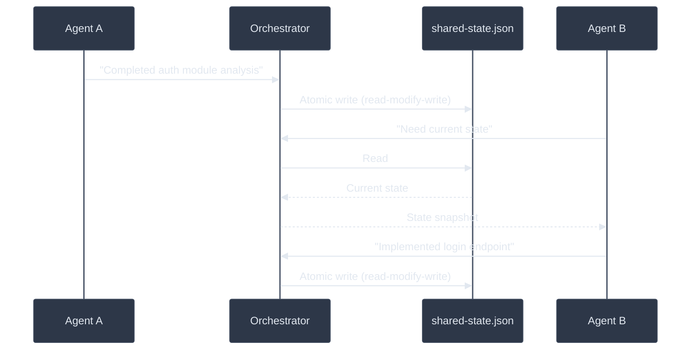
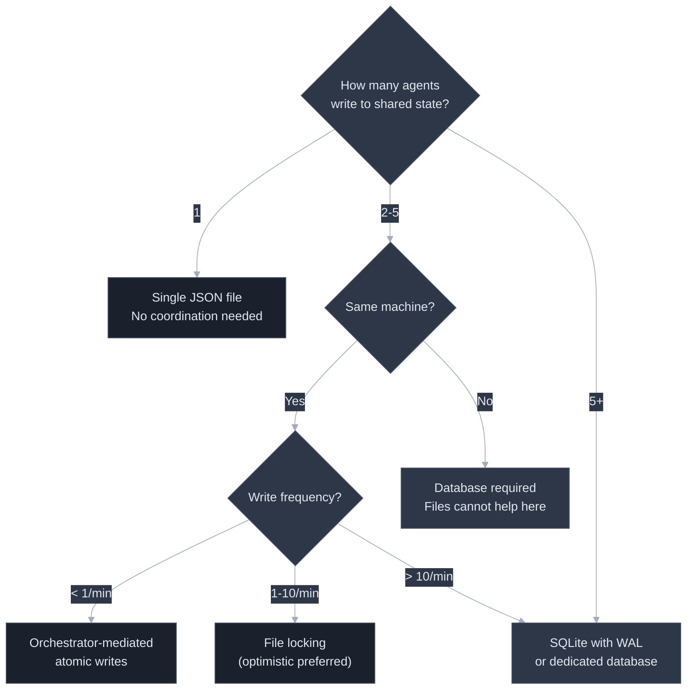
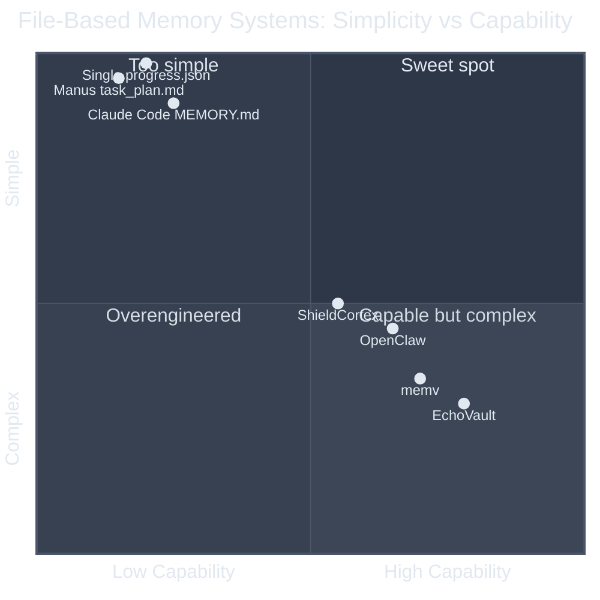

# File-Based Memory for AI Systems: How Far Simple Persistence Actually Gets You

**Thesis:** The file system solves persistence better than any database for most agent workloads, and you should not reach for a vector store until a measured retrieval failure forces you to.

**Prerequisites:** [Memory and State Management](memory-and-state-management.md) (memory taxonomy, maturity levels, failure modes), [Context Engineering](context-engineering.md) (context budgeting, compaction strategies).

**Reading time:** 26 minutes

Most teams building agentic systems reach for vector databases the moment "memory" enters the conversation. This is backwards. Most AI memory problems are not retrieval problems -- they are persistence problems, and the file system solves persistence better than any database for most workloads. This document maps the terrain of file-based memory -- a single JSON file, structured folder hierarchies, SQLite -- covering what works, what breaks, how multi-agent concurrency forces architectural decisions, and where the file system stops being sufficient.

This document operates at Levels 3-4 of the [memory maturity spectrum](memory-and-state-management.md#the-memory-maturity-spectrum) -- persistent external memory and structured typed operations -- and draws the precise boundary where Level 5 infrastructure becomes necessary.

| What teams assume | What actually happens |
|---|---|
| "We need a vector database for agent memory" | A JSON progress file solves 80% of memory complaints; [git commits solve another 15%](memory-and-state-management.md) |
| "Files are too simple for production" | Claude Code, Manus, Cursor, and Codex all ship file-based memory in production at scale |
| "More sophisticated storage = better recall" | [Filesystem search outperforms naive vector search](https://www.llamaindex.ai/blog/files-are-all-you-need) on collections under ~1,000 documents |
| "Files can't handle multiple agents" | Files handle multiple agents fine with coordination; the hard part is knowing when coordination cost exceeds the benefit |
| "SQLite is overkill for agent state" | SQLite is a single file with ACID guarantees, FTS5 search, and zero deployment overhead -- it is the natural ceiling of "simple" |
| "The switch to vector DBs is gradual" | The switch is a phase transition: below the threshold, files win on every axis; above it, they lose on retrieval quality catastrophically |


---

## The Core Tension

File-based memory works because LLMs already understand files. Every model can read JSON, parse markdown, and follow structured text, so a progress file read into the context window is immediately actionable -- no embedding, no retrieval pipeline, no relevance scoring. The agent reads the file and knows exactly where it left off.

But file-based memory fails because **files have no query interface**. You can read a file. You can search a file with grep. You cannot ask a file "what do I know about authentication that is relevant to this user's current question about OAuth token refresh?" That question requires semantic understanding, and semantic understanding requires either (a) the agent reading every file and deciding in-context, which burns tokens and degrades attention, or (b) an external system that understands meaning, which is a vector database.

The entire design space of file-based memory exists in the tension between these two facts: **files are the highest-fidelity storage medium for LLMs, and files are the lowest-capability retrieval medium for LLMs.**

---

## Failure Taxonomy

These failures are specific to file-based memory systems. For the broader memory failure taxonomy (stale memories, irrelevant retrieval, context clash), see [Memory and State Management](memory-and-state-management.md#failure-taxonomy).

### Failure 1: The Monolithic File That Outgrows Its Context Budget

A team starts with a single `memory.json` containing user preferences, session history, and learned patterns. It works at 50 entries. At 500 entries the file consumes 8,000 tokens -- roughly 6% of a 128K context window; at 5,000 entries it consumes 80,000 tokens and the agent's attention on the task degrades catastrophically. One [documented case](https://dev.to/anajuliabit/the-memorymd-problem-why-local-files-fail-at-scale-58ae) grew a MEMORY.md file to 15,000 tokens containing 47 contradictory preferences, 89 "important" decisions, and 156 random notes. Monthly cost for including this in every request at 100 daily interactions with GPT-4 Turbo: $555/month. The file doubles in size by month six.

**Root cause:** No eviction policy. Files accumulate by default -- unlike databases, there is no TTL, no LRU cache, no automatic compaction, so every entry persists until a human or agent removes it.

### Failure 2: The Corrupted Write

An agent crashes mid-write to `progress.json`. The file now contains half a JSON object. The next session reads it, fails to parse it, and either crashes or -- worse -- starts from scratch, losing all progress. Any `write()` call interrupted by process termination, disk full, or power loss can produce a partial file, and JSON is fragile: a missing closing brace makes the whole file unparseable.

**Root cause:** File writes are not atomic. `open() + write() + close()` is three separate operations: a death between `write()` and `close()` corrupts the file, and a death during `write()` leaves partial data.

### Failure 3: The Concurrent Clobber

Two agents read `shared-state.json`, each modify their respective sections, and both write back the full file. The second write silently overwrites the first agent's changes. This is **last-write-wins**, and as the [O'Reilly multi-agent memory analysis](https://www.oreilly.com/radar/why-multi-agent-systems-need-memory-engineering/) puts it, "silent last-write-wins is almost never correct -- it corrupts shared truth invisibly." In multi-agent systems, interagent misalignment from this pattern accounts for 36.9% of all failures.

**Root cause:** Files have no built-in concurrency control -- no transaction, no compare-and-swap, no optimistic locking. Two processes can read the same file at once, and neither knows the other exists.

### Failure 4: The Needle-in-a-Haystack Retrieval

An agent needs to recall a decision made three weeks ago about database indexing strategy. The decision is in `memory/2026-03-01.md`, buried on line 47 between a note about lunch preferences and a reminder to update dependencies. The agent either (a) loads all memory files into context, burning tokens on irrelevant content, or (b) uses grep to search for "indexing," which fails because the note says "we decided to add a composite key on user_id and created_at" without ever using the word "indexing."

**Root cause:** File-based retrieval is either exact-match (grep) or exhaustive (load everything); there is no middle ground. Finding content by meaning rather than keywords requires embeddings, and therefore infrastructure beyond the file system.

### Failure 5: The Schema Drift

Month one: `progress.json` has `{completed_steps: [], next_step: ""}`. Month five: someone adds `blocked_items`, and `next_step` becomes `next_steps` in some files but not others. Month eight: a new agent writes `status` instead. No file enforces a schema and no migration runs, so the agent meets four formats and either halts on parse errors or silently ignores fields it does not recognize.

**Root cause:** Files are schemaless by default. JSON Schema validation must be added explicitly, and most teams skip it because "it's just a config file." By the time drift causes failures, dozens of inconsistent files exist.



---

## The File-Based Memory Spectrum

Each level adds capability and complexity. Skipping levels produces systems that are overengineered for small workloads or underengineered for large ones.

### Level 1: Single JSON File

**What it is:** One file (`progress.json`, `state.json`, `memory.json`) containing all agent state. Read at session start, written at session end or after each significant step.

**When it works:** Single-agent systems with fewer than ~100 discrete state entries. Short-lived tasks (hours, not weeks). State that fits comfortably in the context window (<4,000 tokens).

**Canonical example:** Anthropic's [progress file pattern](https://www.anthropic.com/engineering/effective-harnesses-for-long-running-agents) for long-running agents:

```json
{
  "task": "Migrate user table from MySQL to PostgreSQL",
  "completed_steps": [
    "Analyzed source schema (14 tables, 3 views)",
    "Created target schema with type mappings",
    "Migrated users table (2.3M rows)"
  ],
  "current_step": "Migrate orders table",
  "decisions_made": [
    "Using BIGINT for IDs instead of UUID (performance)",
    "Preserving created_at timestamps, regenerating updated_at"
  ],
  "blocked_items": [],
  "files_modified": ["schema.sql", "migrate.py"]
}
```

**Strengths:** Zero infrastructure. Human-readable. Git-trackable. Perfect precision and recall -- every entry is loaded, nothing is missed.

**Weaknesses:** No query capability beyond loading the entire file. No concurrency safety. No schema enforcement. Linear growth with no eviction, which becomes a context-window tax.

### Level 2: Multi-File Typed Storage

**What it is:** Multiple files, each serving a specific purpose: state split by type into `preferences.json`, `decisions.md`, `progress.json`, `lessons-learned.md`.

**When it works:** Single-agent or orchestrator-mediated multi-agent systems. Corpus of 100-500 discrete entries across all files. Each individual file stays under ~2,000 tokens.

**Canonical example:** The three-layer pattern used by [Claude Code practitioners](https://ianlpaterson.com/blog/claude-code-memory-architecture/):

```
~/.claude/
  CLAUDE.md              # Layer 1: Global preferences (<60 lines)
project/
  CLAUDE.md              # Layer 2: Project conventions (git-versioned)
  .claude/rules/
    testing.md           # Modular rule: testing standards
    api-patterns.md      # Modular rule: API conventions
  .claude/memory/
    MEMORY.md            # Layer 3: Auto-generated learnings (200-line cap)
```

**Strengths:** Each file has a clear purpose. The agent loads only the files relevant to the current task. Git diffs are clean because changes are scoped to specific files.

**Weaknesses:** The agent must know which files to load: add `security-rules.md` without telling the agent and it will never read it. File proliferation creates its own management burden, and cross-file references are invisible without explicit linking.

**Key finding:** Practitioner guidance and vendor measurement agree on direction and disagree on mechanism. The measurement: a single instruction file at the recommended 200-line ceiling achieves a [92% rule-application rate](https://institute.sfeir.com/en/claude-code/claude-code-memory-system-claude-md/deep-dive/), while modular rule files of roughly 30 lines each reach 96%. The guidance: split a rule file that exceeds 400 lines.

The controlled evidence is weaker than the guidance. A 2026 factorial study of 1,650 agent sessions and 16,050 function-level observations ([McMillan, arXiv:2605.10039](https://arxiv.org/abs/2605.10039)) varied configuration-file size at 25, 100, 250, and 500 lines and found **no detectable compliance contrast** across that range -- an affirmative null, with a Bayes factor of 0.05 to 0.10 -- nor any effect from instruction position, file splitting, or a contradicting instruction in a second file.

The degradation that study did measure came from somewhere else: **within-session drift**, at roughly 5.6% lower odds of compliance for each additional function the agent generates in one session, and **task identity**, which produced a larger contrast than any file-structure variable tested (26.2 percentage points between two tasks).

### Level 3: Folder Hierarchy with Index

**What it is:** A directory structure where files are organized by scope, topic, or time period, with an index file that maps topics to file paths.

**When it works:** 500-2,000 entries. Multiple agents that need scoped access (each agent reads only its relevant subdirectory). Long-running projects where temporal organization matters.

**Canonical example:** OpenClaw's [memory architecture](https://dev.to/imaginex/ai-agent-memory-management-when-markdown-files-are-all-you-need-5ekk):

```
~/.openclaw/memory/
  MEMORY.md                    # Index: topic -> file path
  decisions/
    2026-03-auth-strategy.md
    2026-03-database-choice.md
  patterns/
    error-handling.md
    api-pagination.md
  sessions/
    2026-03-22.md
    2026-03-21.md
```

With `MEMORY.md` serving as an index:

```markdown
## Decisions
- [Auth strategy](decisions/2026-03-auth-strategy.md) - OAuth2 with PKCE
- [Database choice](decisions/2026-03-database-choice.md) - PostgreSQL over MySQL

## Patterns
- [Error handling](patterns/error-handling.md) - Structured error types
- [API pagination](patterns/api-pagination.md) - Cursor-based
```

**Strengths:** The index is small enough to always fit in context, and the agent loads only the files it names. Scoping by directory provides natural access control for multi-agent systems, and temporal organization enables "forget everything before March" by deleting a directory.

**Weaknesses:** The index must be maintained. If a file is added without updating the index, it is invisible. Directory structure decisions are architectural choices that are painful to change later. ripgrep across the hierarchy slows above ~1,000 files on spinning disks (negligible on SSDs).

**The discovery problem:** At this level, the agent needs a strategy for finding relevant files. Three approaches, in order of sophistication:

1. **Index-first:** Read `MEMORY.md`, follow links. Fast, precise, misses unindexed files.
2. **Glob + grep:** Search `memory/**/*.md` for keywords. Catches unindexed files, fails on synonym/paraphrase queries.
3. **Agent-directed search:** The agent picks directories from the task context. Most flexible, burns tokens on the search itself.

### Level 4: SQLite with Full-Text Search

**What it is:** A single `.sqlite` file containing structured tables with FTS5 (Full-Text Search 5) virtual tables for keyword retrieval. No server, no deployment: one file providing ACID transactions, schema enforcement, and indexed search.

**When it works:** 1,000-10,000 entries. Multi-agent systems that need concurrency safety. Workloads that require filtered queries ("show me all decisions tagged 'security' from the last 30 days"). Systems that need auditability.

**Canonical example:** A minimal agent memory schema:

```sql
CREATE TABLE memories (
    id TEXT PRIMARY KEY,
    content TEXT NOT NULL,
    memory_type TEXT CHECK(memory_type IN ('fact', 'decision', 'preference', 'pattern', 'task')),
    created_at DATETIME DEFAULT CURRENT_TIMESTAMP,
    last_accessed DATETIME,
    access_count INTEGER DEFAULT 0,
    confidence REAL DEFAULT 1.0,
    source_session TEXT,
    tags TEXT,  -- comma-separated
    superseded_by TEXT REFERENCES memories(id)
);

CREATE VIRTUAL TABLE memories_fts USING fts5(content, tags, tokenize='porter');

CREATE TRIGGER memories_ai AFTER INSERT ON memories BEGIN
    INSERT INTO memories_fts(rowid, content, tags) VALUES (new.rowid, new.content, new.tags);
END;
```

Query by keyword with ranking:

```sql
SELECT m.*, rank
FROM memories_fts f
JOIN memories m ON m.rowid = f.rowid
WHERE memories_fts MATCH 'authentication AND token'
  AND m.superseded_by IS NULL
  AND m.confidence > 0.5
ORDER BY rank
LIMIT 10;
```

**Strengths:** ACID transactions eliminate corrupted writes and concurrent clobber failures. FTS5 provides stemming, phrase matching, and BM25 ranking -- as one [practitioner noted](https://muhammadraza.me/2026/building-local-memory-for-coding-agents/), "for most use cases, this is all you need." Schema enforcement prevents drift. A single `.sqlite` file is as portable as a JSON file, and FTS5 answers queries out of the same file -- no service round trip. A working open-source implementation is [EchoVault](https://github.com/mraza007/echovault) (MIT). The `superseded_by` field solves stale memory by explicit versioning.

**Weaknesses:** LLMs cannot read `.sqlite` files directly -- you need a tool that queries the database and returns text. SQLite's write concurrency is limited: one writer at a time (readers are unlimited with WAL mode). Complex queries require SQL knowledge that not all teams have.

**The critical upgrade path:** FTS5 handles stemming and phrase proximity but not semantic similarity -- "login flow" does not match "authentication process" -- so synonym and paraphrase matching force embeddings.



---

## Multi-Agent Concurrency: The Forcing Function

Concurrency is where file-based memory either scales or collapses. One agent reading and writing its own files has no problem; the moment a second agent enters the picture, every file becomes a conflict zone.

### The Problem Space

Two agents working on the same codebase need shared state: "Which files have been modified?" "What decisions have been made?" "What is the current task status?" If both keep their own state files, they diverge; if they share one, they conflict. No architecture avoids this tension; they manage it at different costs.

The [O'Reilly analysis](https://www.oreilly.com/radar/why-multi-agent-systems-need-memory-engineering/) quantifies the cost: multi-agent systems use ~15x the tokens of single-agent systems, primarily due to coordination overhead -- agents re-retrieving and re-explaining context that should be shared state.

### Strategy 1: Scoped Isolation (No Sharing)

Each agent gets its own directory. No shared state. The orchestrator reads each agent's output files and synthesizes.

```
memory/
  agent-researcher/
    findings.md
    progress.json
  agent-implementer/
    changes.md
    progress.json
  orchestrator/
    synthesis.md      # Orchestrator reads all agent dirs
```

**When it works:** MapReduce-style workflows where agents operate on disjoint inputs and produce independent outputs. The orchestrator is the only entity that needs a global view.

**When it fails:** Any workflow where agents need to react to each other's progress -- Agent B needs to know that Agent A already modified `auth.py`.

**Concurrency cost:** Zero. No shared state means no conflicts -- but also no coordination, so agents may duplicate work or produce contradictory outputs.

### Strategy 2: Orchestrator-Mediated Writes

Agents read shared state files but never write to them directly. All writes go through the orchestrator, which serializes updates.



**When it works:** Star-topology multi-agent systems where the orchestrator is always available and the write rate is low (fewer than ~10 writes per minute).

**When it fails:** When the orchestrator becomes a bottleneck -- agents producing results faster than it can serialize writes stall waiting for acknowledgment -- or when it crashes, losing in-flight writes.

**Implementation pattern -- atomic file writes:**

```python
import json
import os
import tempfile

def atomic_write(filepath: str, data: dict) -> None:
    """Write data to file atomically using rename.

    The rename operation is atomic on POSIX systems when source
    and destination are on the same filesystem.
    """
    dir_name = os.path.dirname(filepath)
    with tempfile.NamedTemporaryFile(
        mode='w', dir=dir_name, suffix='.tmp', delete=False
    ) as tmp:
        json.dump(data, tmp, indent=2)
        tmp.flush()
        os.fsync(tmp.fileno())  # Force write to disk
    os.rename(tmp.name, filepath)  # Atomic on same filesystem
```

This eliminates Failure 2 (corrupted writes) but does not solve Failure 3 (concurrent clobber). The orchestrator must ensure only one write happens at a time.

### Strategy 3: File Locking

Agents acquire locks before writing to shared files. Two variants:

**Pessimistic locking** -- acquire a lock before reading, hold it through the write:

```python
import fcntl

def locked_update(filepath: str, update_fn):
    """Read-modify-write with exclusive file lock."""
    with open(filepath, 'r+') as f:
        fcntl.flock(f, fcntl.LOCK_EX)  # Block until lock acquired
        try:
            data = json.load(f)
            data = update_fn(data)
            f.seek(0)
            f.truncate()
            json.dump(data, f, indent=2)
            f.flush()
            os.fsync(f.fileno())
        finally:
            fcntl.flock(f, fcntl.LOCK_UN)
```

**Optimistic locking** -- read freely, check version on write, retry on conflict:

```python
def optimistic_update(filepath: str, update_fn, max_retries=3):
    """Read-modify-write with version check and retry."""
    for attempt in range(max_retries):
        data = json.loads(Path(filepath).read_text())
        version = data.get("_version", 0)
        updated = update_fn(data)
        updated["_version"] = version + 1
        # Only write if version hasn't changed
        current = json.loads(Path(filepath).read_text())
        if current.get("_version", 0) == version:
            atomic_write(filepath, updated)
            return updated
    raise ConflictError(f"Failed after {max_retries} retries")
```

**When pessimistic wins:** Short-duration operations where lock contention is rare. Agents that read-modify-write in milliseconds.

**When optimistic wins:** Longer operations where holding a lock would block other agents, and agents that spend seconds or minutes between read and write -- typical for LLM-powered agents, whose "modify" step is an API call.

**When both fail:** Distributed systems. `fcntl.flock()` only works on one machine, and network filesystems (NFS, SMB) have unreliable locking semantics. If your agents run on different machines, file locking is not viable -- use a coordination service or a database.

### Strategy 4: SQLite as Coordination Layer

SQLite with WAL (Write-Ahead Logging) mode supports unlimited concurrent readers and serialized writers. This is the natural ceiling of file-based concurrency.

```python
import sqlite3

def get_connection(db_path: str) -> sqlite3.Connection:
    conn = sqlite3.connect(db_path)
    conn.execute("PRAGMA journal_mode=WAL")      # Enable concurrent reads
    conn.execute("PRAGMA busy_timeout=5000")      # Wait up to 5s for locks
    conn.execute("PRAGMA synchronous=NORMAL")     # Balance durability/speed
    return conn

def update_shared_state(db_path: str, agent_id: str, key: str, value: str):
    """Thread-safe state update with automatic retry on lock contention."""
    conn = get_connection(db_path)
    with conn:  # Automatic transaction
        conn.execute(
            """INSERT INTO shared_state (agent_id, key, value, updated_at)
               VALUES (?, ?, ?, CURRENT_TIMESTAMP)
               ON CONFLICT(key) DO UPDATE SET
                 value = excluded.value,
                 agent_id = excluded.agent_id,
                 updated_at = CURRENT_TIMESTAMP""",
            (agent_id, key, value)
        )
```

**When it works:** All single-machine multi-agent scenarios. Write rates up to ~100 writes/second (SQLite's serialized writer is fast -- the bottleneck is fsync, not the lock).

**When it fails:** Multiple machines. SQLite does not support network access; if agents run on different hosts, you need PostgreSQL, Redis, or a purpose-built coordination service.

### The Concurrency Decision Tree



---

## Principles for File-Based Memory Systems

### Principle 1: Enforce Size Caps Mechanically, Not Culturally

**Why it works:** Every file-based memory system that grows without bounds eventually hits Failure 1 (monolithic bloat), and telling developers "keep it short" does not work. Claude Code enforces a 200-line cap on MEMORY.md, and content beyond roughly that point may be truncated without warning; vendor measurement puts a single file at that ceiling at a [92% rule-application rate](https://institute.sfeir.com/en/claude-code/claude-code-memory-system-claude-md/deep-dive/), against 96% for modular rule files of about 30 lines. The controlled evidence is weaker: the [2026 factorial study](https://arxiv.org/abs/2605.10039) found **no detectable compliance effect from file size between 25 and 500 lines**. Enforce the cap anyway, for three reasons that do not depend on a compliance cliff: content past the cap is silently truncated, every loaded line consumes context budget, and a shorter file is cheaper to keep current. The mechanism most often cited for the cliff -- attention degradation -- is real but was not detectable at these sizes.

**How to apply:** Set an explicit token budget for memory files loaded into context. For a 128K context window, allocate no more than 2-3% (2,500-3,800 tokens, roughly 150-250 lines of markdown) to memory. Implement automated rotation:

```python
MAX_MEMORY_LINES = 200

def rotate_memory(memory_path: str, archive_dir: str):
    """Archive old entries when memory file exceeds cap."""
    lines = Path(memory_path).read_text().splitlines()
    if len(lines) <= MAX_MEMORY_LINES:
        return
    # Keep the most recent entries, archive the rest
    keep = lines[-MAX_MEMORY_LINES:]
    archive = lines[:-MAX_MEMORY_LINES]
    archive_path = Path(archive_dir) / f"{date.today().isoformat()}.md"
    archive_path.write_text("\n".join(archive))
    Path(memory_path).write_text("\n".join(keep))
```

**Addresses:** Failure 1 (monolithic bloat), Failure 4 (needle-in-haystack).

### Principle 2: Use Atomic Writes for Every State Mutation

**Why it works:** Non-atomic writes are the root cause of Failure 2 (corrupted files). The `write-to-temp-then-rename` pattern is standard because `rename()` is atomic on POSIX filesystems when source and destination are on the same filesystem. Any system that writes state without atomic rename will eventually lose data.

**How to apply:** Never write directly to the target file. Write to a temporary file in the same directory, fsync, then rename. The `atomic_write()` function in the concurrency section is the minimal correct implementation; wrap it in your file I/O abstraction so no code path can bypass it.

**Addresses:** Failure 2 (corrupted writes).

### Principle 3: Separate the Index from the Content

**Why it works:** At Level 2+, the agent must decide which files to load, and loading all of them burns context budget on irrelevant content (Failure 4). An index file is a small, always-loaded map from topics to file paths -- the file-system equivalent of a database index, trading one small file read for many unnecessary large ones.

**How to apply:** Maintain a `MEMORY.md` or `INDEX.md` at the root of your memory hierarchy. Each entry should have a topic, a one-line description, and a file path, and the index should stay under 200 lines. When adding a memory file, update the index in the same operation; when deleting or archiving one, remove its entry. The index is the source of truth: if it is not in the index, the agent will not find it.

```markdown
## Index

- [Auth strategy](decisions/auth-strategy.md) - OAuth2 with PKCE, decided 2026-03-01
- [Error handling](patterns/error-handling.md) - Structured error types with codes
- [DB migration plan](tasks/db-migration.md) - MySQL to PostgreSQL, 60% complete
```

**Addresses:** Failure 4 (needle-in-haystack), Failure 1 (bloat -- the index stays small even as content grows).

### Principle 4: Add Schema Validation at the Write Boundary

**Why it works:** Schema drift (Failure 5) compounds over time and is expensive to fix retroactively. Validating at write time rather than read time catches errors when they are cheapest: the writer of a malformed entry gets immediate feedback; the reader three weeks later has no recourse.

**How to apply:** For JSON files, use JSON Schema validation on every write:

```python
from jsonschema import validate

PROGRESS_SCHEMA = {
    "type": "object",
    "required": ["task", "completed_steps", "current_step"],
    "properties": {
        "task": {"type": "string"},
        "completed_steps": {"type": "array", "items": {"type": "string"}},
        "current_step": {"type": "string"},
        "decisions_made": {"type": "array", "items": {"type": "string"}},
        "blocked_items": {"type": "array", "items": {"type": "string"}},
        "_version": {"type": "integer"}
    }
}

def write_progress(filepath: str, data: dict):
    validate(instance=data, schema=PROGRESS_SCHEMA)
    atomic_write(filepath, data)
```

For markdown files, use YAML frontmatter with required fields:

```markdown
---
type: decision
date: 2026-03-22
status: active
supersedes: null
tags: [auth, security]
---

Use OAuth2 with PKCE for all client-side authentication flows.
```

**Addresses:** Failure 5 (schema drift).

### Principle 5: Know Your Retrieval Ceiling

**Why it works:** Every file-based retrieval mechanism has a ceiling beyond which it degrades, and knowing where yours is prevents both premature optimization and delayed migration.

The [Oracle/Richmond Alake benchmark](https://blogs.oracle.com/developers/comparing-file-systems-and-databases-for-effective-ai-agent-memory-management) quantifies this precisely: on large-corpus retrieval tasks, filesystem-based agents scored 29.7% while database-backed agents achieved 87.1% on identical queries. The gap exists because semantic retrieval surfaces conceptually relevant results even when vocabulary differs.

**How to apply:** Monitor your retrieval hit rate: how often the agent finds what it needs on the first query. Below 80% with keyword search, you are approaching the ceiling. The migration triggers are:

1. **Queries require synonyms/paraphrases** ("login flow" should match "authentication process")
2. **Corpus exceeds ~5MB total** or ~1,000 discrete entries
3. **Multiple agents need concurrent semantic search** on shared memories
4. **You are building indexing, locking, recovery, and metadata logic around files** -- at this point, as [Oracle's analysis](https://blogs.oracle.com/developers/comparing-file-systems-and-databases-for-effective-ai-agent-memory-management) notes, "you're no longer 'just using files' -- you're rebuilding a database"

**Addresses:** Failure 4 (needle-in-haystack) by making the failure condition explicit and measurable.

---

## Evaluation: Real-World File-Based Memory Systems

| System | Level | Corpus Limit | Concurrency | Strength | Weakness |
|---|---|---|---|---|---|
| Claude Code MEMORY.md | 2 (Multi-file) | 200 lines hard cap | Single agent | Enforced size cap, 96% compliance on modular rules | No semantic search, 62% of issues from stale entries |
| Manus task_plan.md | 1 (Single file) | Unbounded | Single agent | Simple, effective for task continuity | No eviction, no concurrency, no query capability |
| OpenClaw | 3 (Folder + index) | ~5MB practical | Single agent | Hybrid search (89% recall), graceful degradation | Complex setup, SQLite dependency for search |
| EchoVault | 4 (SQLite + FTS5 + vectors) | Bounded by disk | Single agent | Markdown as the system of record with a SQLite index beside it; three MCP tools, no daemon | Young project, small maintainer base; semantic search needs an embedding provider |
| ShieldCortex | 2-3 (Files + scoring) | Bounded by decay | Single agent | Salience scoring with exponential decay solves eviction | Six-layer security pipeline adds latency |
| memv | 4 (SQLite) | Unbounded | Single agent | Stores only facts the agent failed to predict | No multi-agent support, single-instance design |



### Measured results since March 2026

Four findings landed between March and September 2026. Two narrow this document's argument, two widen it.

**1. File-based memory competes at the small end and loses at the large end.** An independent 2026 survey of the memory literature and published benchmarks ([Jake Cuth, Agent Memory Lab](https://www.jakecuth.com/work/agent-memory-lab)) reports a stock filesystem agent at 74.0% on LoCoMo by April 2026 -- above Mem0's purpose-built graph variant at 68.5% -- and concludes that file-based memory suits roughly 80% of solo coding-agent workflows and roughly none of multi-user consumer chat. On LongMemEval the same survey reports full-context GPT-4o at 60.2-64%, Mem0 v1 at 49.0% in independent re-tests, Zep/Graphiti at 71.2%, and the 2026 frontier at 83-95%. Read that as: files win on the small, single-writer corpus this document is about; structured memory wins as soon as facts evolve and conflict.

**2. Cost and latency split the decision three ways.** From the same survey: file-based memory with prompt caching is the cheapest sustainable setup (about $0.0015 per query), a local vector index (pgvector or Qdrant) is the lowest-latency option (5-8 ms search plus model time), and structured memory takes the accuracy-per-token prize. These are different objectives: a file-based design that ignores prompt caching gives up the cost advantage it was chosen for.

**3. Memory quality is now measured with a forgetting penalty, not just recall.** Microsoft's [STATE-Bench](https://opensource.microsoft.com/blog/2026/05/19/introducing-state-bench-a-benchmark-for-ai-agent-memory) (May 2026) scores memory agents on task outcome, consistency across runs (pass@1 against pass^5), operational cost, and interaction quality rather than retrieval accuracy alone -- and reports that agents are inconsistent even on identical tasks. A separate 2026 benchmark introduces Forgetting-Aware Memory Accuracy, which penalises reuse of invalidated memory. Both target the failure this document calls staleness: a memory system that recalls a superseded fact confidently is worse than one that recalls nothing.

**4. File-based memory is now a shipped product surface, not a workaround.** Claude Code's auto-memory `MEMORY.md` is written by the agent itself and loaded into every session; OpenClaw pairs a curated `MEMORY.md` with dated daily logs; Cursor ships four rule types; Codex ships instruction files. The cross-tool `AGENTS.md` specification is now stewarded by the Linux Foundation's Agentic AI Foundation, with adoption reported between 40,000 and 60,000 repositories depending on the counter -- an academic survey of the same period counts over 2,300 agent context files across 1,925 repositories.

---

## Recommendations

### Short-Term: Start with What Works (Week 1)

1. **Implement a progress.json checkpoint file** for every long-running agent: read at session start, write after each significant step, using atomic writes. *(Implements Principle 2)*

2. **Cap your memory files at 200 lines.** Enforce the cap with automated rotation; archive overflow to dated files. *(Implements Principle 1)*

3. **Add JSON Schema validation** to every state file write. Catch schema drift at write time, not read time. *(Implements Principle 4)*

### Medium-Term: Add Structure (Weeks 2-4)

4. **Split monolithic memory into typed files** -- decisions, preferences, patterns, session state -- with each file under 2,000 tokens and MEMORY.md as the discovery index. *(Implements Principle 3)*

5. **For multi-agent systems, start with orchestrator-mediated writes** using atomic file operations. Only escalate to file locking or SQLite when write frequency exceeds ~1/minute per shared file. *(Implements Principles 2 and 3)*

6. **Instrument retrieval hit rate.** Track how often the agent finds the right memory on the first query. *(Implements Principle 5)*

### Long-Term: Graduate When You Must (Month 2+)

7. **Migrate to SQLite + FTS5 when** corpus exceeds ~1,000 entries, queries require stemming/phrase matching, or multi-agent writes exceed what orchestrator serialization can handle. SQLite is still a single file. *(Implements Principle 5)*

8. **Add vector search only when** queries require semantic similarity (synonym/paraphrase matching) AND keyword retrieval hit rate drops below 80%. The hybrid approach (70% vector + 30% BM25 weighting, as OpenClaw implements) achieves [89% recall](https://dev.to/imaginex/ai-agent-memory-management-when-markdown-files-are-all-you-need-5ekk) against 76% for vector-only and 68% for BM25-only in the implementing project's own testing. That is a single-source figure with no published methodology, so take the direction rather than the number: hybrid beats either half alone.

9. **Do not skip levels.** Each level exists because the previous level's failure mode forced the upgrade.

---

## The Hard Truth

Most teams debating "which vector database should we use for agent memory" have not yet tried a JSON file. The [existing analysis in this series](memory-and-state-management.md) states it directly: "Most teams building agentic systems do not have a memory problem. They have a session continuity problem."

The uncomfortable reality is that file-based memory is boring, and boring solutions do not generate conference talks, blog posts, or venture funding. But Claude Code runs its entire memory system on markdown files with a 200-line hard cap, and Manus, acquired for $2B, uses `task_plan.md`. These are deliberate architectural choices, not MVPs waiting to be upgraded.

Where people go wrong is in two symmetric ways. Premature optimization: reaching for Pinecone when a JSON file would suffice, adding 30ms of retrieval latency and $200/month for a problem that does not exist yet. And delayed migration: keeping files past their expiration date, rebuilding locking, indexing, and recovery around flat files until the system is -- as the Oracle analysis puts it -- "no longer 'just using files' but rebuilding a database, poorly."

Below roughly 1,000 discrete memories, and before the first query that needs meaning rather than keywords, files win on every axis: cost ($0.02/GB/month vs. $50-200/GB/month for managed vector DBs), latency (disk read vs. embedding + search), debuggability (cat the file vs. inspect vector space), and operational overhead (zero vs. a service to maintain). Above that line, files lose on the only axis that matters: retrieval quality (29.7% vs. 87.1%).

The one thing to remember: **start with the simplest thing that could work, instrument it so you know when it stops working, and upgrade only when the data tells you to.**

---

## Summary Checklist

| Question | Good Answer | Bad Answer |
|---|---|---|
| Are your file writes atomic? | Yes, write-to-temp-then-rename pattern | No, direct write to target file |
| How do you find relevant memories? | Index file + scoped search, monitored hit rate | Load all files into context every time |
| Do you validate schema on write? | Yes, JSON Schema or structured frontmatter validation | No, "it's just a JSON file" |
| Does your system handle partial writes / crashes? | Yes, atomic writes + schema validation on read | No, assumes writes always complete successfully |
| Can you explain why your current storage level is correct? | Yes, based on corpus size, query type, and concurrency requirements | "It's what we've always used" or "It's what the tutorial showed" |

---

## Field Notes from an Operating Estate

Three observations from a practitioner operating an estate of roughly a dozen agent harnesses on one workstation. Abstracted to patterns; the identifying detail is deliberately dropped.

**September 2026 -- memory that holds pointers, not content.** The estate's persistent memory is deliberately pointer-shaped: the always-loaded file records where the durable content lives and what is currently in flight, not the content itself, because the substance has a separate, reviewable home. The observed effect is the one this document argues for -- the always-loaded file stays far short of the 200-line cap while the substance is loaded on demand. The cost is the one this document also predicts: nothing is discovered automatically, so a pointer that is not written down does not exist as far as the agent is concerned.

**August 2026 -- one working copy per writer, not one lock per file.** Every agent task runs in its own working copy on its own branch, and the durable record of that task is a directory of small files -- a plan, a record of what ran, a ledger row -- rather than a row in a database. Concurrency is handled by giving each writer its own copy and merging by review, and the canonical copy is never locked or waited on. That removes the hardest file-based failure mode by construction rather than by locking. It is a coordination decision, not a storage decision: the same directory of files under a shared lock would behave very differently.

**September 2026 -- corrections are verified against the live system before they are recorded.** The estate's operating rule for its own record files is that a claim is checked against the running system before it is written down, because a record that was true when written and is quietly false now is worse than a missing record: it overrides a newer fact with confidence. The countermeasure is procedural rather than structural. No schema validation catches a confidently stale sentence; a verification step before the write does.

## References

### Practitioner Articles

- [AI Agent Memory Management: When Markdown Files Are All You Need](https://dev.to/imaginex/ai-agent-memory-management-when-markdown-files-are-all-you-need-5ekk) -- Comparison of Manus, OpenClaw, and Claude Code memory architectures; 89% hybrid recall benchmark; scalability thresholds.
- [The MEMORY.md Problem: Why Local Files Fail at Scale](https://dev.to/anajuliabit/the-memorymd-problem-why-local-files-fail-at-scale-58ae) -- Documented failure case of a MEMORY.md growing to 15,000 tokens with 47 contradictory preferences; $555/month cost analysis.
- [Claude Code Memory System Deep-Dive](https://institute.sfeir.com/en/claude-code/claude-code-memory-system-claude-md/deep-dive/) -- Rule-application benchmarks (92% for a single file at the 200-line recommendation, 96% for modular rules of about 30 lines); the 400-line split trigger; 62% staleness problem. Note: guidance plus vendor-side measurement, not a controlled experiment.
- [Claude Code Memory Architecture](https://ianlpaterson.com/blog/claude-code-memory-architecture/) -- Practitioner case study running 34 projects on plain markdown + SyncThing with cron-based rotation and 8 design rules.
- [Writing a Good CLAUDE.md](https://www.humanlayer.dev/blog/writing-a-good-claude-md) -- Anti-patterns (auto-generating with /init, stuffing style guidelines, context bloat); production CLAUDE.md under 60 lines.
- [Building Local Memory for Coding Agents](https://muhammadraza.me/2026/building-local-memory-for-coding-agents) -- FTS5 + sqlite-vec hybrid implementation; cross-agent vault; "for most use cases, FTS5 is all you need."
- [Context Engineering for Coding Agents](https://martinfowler.com/articles/exploring-gen-ai/context-engineering-coding-agents.html) -- Context engineering taxonomy; minimal viable context principle; "an agent's effectiveness goes down when it gets too much context."

### Research and Analysis

- [Why Multi-Agent Systems Need Memory Engineering](https://www.oreilly.com/radar/why-multi-agent-systems-need-memory-engineering/) -- 36.9% failure rate from interagent misalignment; 15x token multiplication; "silent last-write-wins is almost never correct."
- [Comparing File Systems and Databases for AI Agent Memory](https://blogs.oracle.com/developers/comparing-file-systems-and-databases-for-effective-ai-agent-memory-management) -- FSAgent 29.7% vs MemAgent 87.1% benchmark; "the reinvention trap" argument.
- [Instruction Adherence in Coding Agent Configuration Files: A Factorial Study of Four File-Structure Variables](https://arxiv.org/abs/2605.10039) -- 1,650 controlled sessions, 16,050 function-level observations; affirmative nulls for file size (25-500 lines), instruction position, and inter-file conflict; within-session attenuation of roughly 5.6% per generated function. The source for the corrected size-cap claim in this document.
- [Configuration Smells in AGENTS.md Files](https://arxiv.org/abs/2606.15828) -- Empirical catalogue of the common mistakes found in coding-agent configuration files.
- [Introducing STATE-Bench: A benchmark for AI agent memory (Microsoft, May 2026)](https://opensource.microsoft.com/blog/2026/05/19/introducing-state-bench-a-benchmark-for-ai-agent-memory) -- Memory-agnostic agent benchmark scoring task outcome, run-to-run consistency, cost, and interaction quality.
- [AI Agent Memory in 2026: Vector DBs vs MEMORY.md vs Graphs (Jake Cuth, Agent Memory Lab)](https://www.jakecuth.com/work/agent-memory-lab) -- Independent 2026 survey of memory benchmarks; LoCoMo and LongMemEval figures, and cost/latency comparisons across file-based, vector, and structured memory.
- [AGENTS.md Context File Value Review](https://www.infoq.com/news/2026/03/agents-context-file-value-review/) -- ETH Zurich research: LLM-generated context files reduced success by 3% and increased costs by 20%; human-written files improved success by only 4%.
- [Memory in AI Agents](https://www.leoniemonigatti.com/blog/memory-in-ai-agents.html) -- CoALA and Letta memory taxonomy frameworks; four memory types with storage pattern guidance.
- [Files Are All You Need](https://www.llamaindex.ai/blog/files-are-all-you-need) -- File search outperforms naive semantic search on small-to-medium collections; crossover point analysis.

### Official Documentation

- [Claude Code Memory](https://code.claude.com/docs/en/memory) -- Official documentation for CLAUDE.md, MEMORY.md, modular rules, and auto-memory.
- [AGENTS.md Specification](https://agents.md/) -- Flexible markdown format for AI coding assistant context; 60,000+ repo adoption claimed by the specification site; stewarded by the Linux Foundation's Agentic AI Foundation.
- [Cursor Rules](https://cursor.com/docs/context/rules) -- Four rule types (Always On, Auto Attached, Model Decision, Manual); MDC format; glob pattern matching.
- [sqlite-memory](https://github.com/sqliteai/sqlite-memory) -- SQLite extension for markdown-aware semantic search; FTS5+vector hybrid; atomic SAVEPOINT transactions.
- [OpenClaw Local-First RAG](https://www.pingcap.com/blog/local-first-rag-using-sqlite-ai-agent-memory-openclaw/) -- Four-table SQLite schema; graceful degradation pattern; zero-ops deployment.

### Tools and Implementations

- [EchoVault](https://github.com/mraza007/echovault) -- MIT-licensed local-first memory for coding agents; markdown vault as the system of record, SQLite index combining FTS5 and `sqlite-vec`, three MCP tools, no daemon.
- [memv](https://www.reddit.com/r/LLMDevs/comments/1r1zomd/memv_opensource_memory_for_ai_agents_that_only/) -- Predict-calibrate extraction; stores only facts the agent failed to predict; SQLite backend.
- [ShieldCortex](https://www.reddit.com/r/LocalLLaMA/comments/1r5eeht/ai_agents_forget_everything_between_sessions_i/) -- Local-first persistent memory for coding agents; salience scoring with exponential decay.
- [AI Coding Config Files Guide](https://www.deployhq.com/blog/ai-coding-config-files-guide) -- Cross-tool comparison of all AI coding config file formats with capacity constraints.

---

*Last reviewed: September 2026. Changed in this revision: removed the unsourced 400-line compliance figure and replaced it with the result of a controlled factorial study; replaced an unverifiable tool example with a verifiable one; qualified the hybrid-recall figure; and added the memory results measured since March 2026.*
