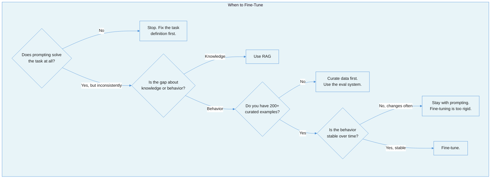
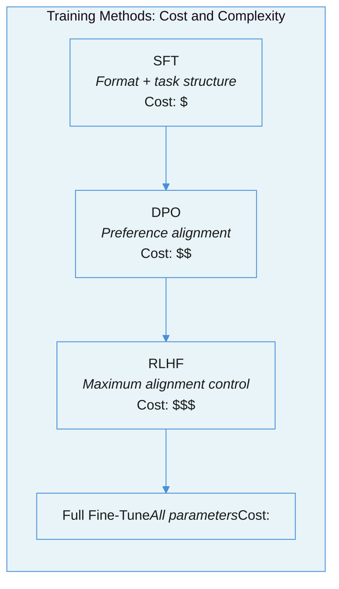

# Fine-Tuning for Practitioners: When Prompting Hits a Wall and What to Do About It

Every other document in this suite assumes you are calling an LLM API with a prompt. This one covers what happens when prompting is not enough -- and the disciplined process for knowing when that is actually true.

> **Prerequisite:** [Evaluation-Driven Development](evaluation-driven-development.md). You cannot fine-tune without an eval system. If you do not have one, stop here and build one first.

---

## The Tension: Fine-Tuning Solves Real Problems -- But Most Teams Do It Too Early

There is a seductive logic to fine-tuning: your LLM is not behaving how you want, so you train it to behave differently. The logic is sound. The timing almost never is.

[Hamel Husain](https://hamel.dev/blog/posts/fine_tuning_valuable.html) frames the prerequisite bluntly: "You should definitely try not to fine-tune first. You need to prove to yourself that you should fine-tune." The purpose of prompt engineering is not to avoid fine-tuning forever -- it is to stress-test your evaluation system before you invest in training. If you cannot measure whether your current system works, you cannot measure whether fine-tuning improved it.

The [AI-Native Solution Patterns](ai-native-solution-patterns.md) document in this suite introduces the knowledge-behavior distinction: RAG fills knowledge gaps (facts the model does not have), while fine-tuning fills behavior gaps (patterns the model cannot consistently reproduce through prompting alone). This is correct as a decision framework. What it does not cover is the execution -- the actual process of curating data, choosing a training method, running the training, and evaluating the result. That is what this document covers.

| Approach | Solves | Time to Ship | Cost to Try | When It Fails |
|---|---|---|---|---|
| **Prompt engineering** | Task framing, output format, reasoning strategy | Hours | Free (API calls only) | Inconsistent behavior at scale, complex multi-constraint tasks |
| **RAG** | Knowledge gaps, current data, source attribution | Days-weeks | Moderate (embedding + retrieval infra) | Behavior/style problems, format consistency |
| **Fine-tuning** | Behavioral consistency, domain patterns, cost reduction | Weeks | High (data curation + training + eval) | Knowledge gaps, volatile requirements, insufficient data |

---

## Failure Taxonomy: How Fine-Tuning Goes Wrong

### Failure 1: The Template Mismatch

[Hamel Husain calls this](https://parlance-labs.com/education/fine_tuning_course/workshop_1.html) "the biggest nightmare" in fine-tuning. Your training data uses one chat template format; your inference pipeline uses another. The model produces garbage -- not because training failed, but because the input format at inference does not match what it learned.

**Why it happens:** Chat templates (the wrapping around user/assistant turns) vary between frameworks, providers, and even library versions. If you train with `<|im_start|>user` tokens but infer with `[INST]` tokens, the model has never seen the inference format.

**How to prevent it:** Always verify template parity between training and inference before diagnosing any other problem. Use the same tokenizer and template library for both.

### Failure 2: Catastrophic Forgetting

The model excels at your target task but loses previously learned general capabilities. You fine-tune a model to extract medical entities, and it can no longer write coherent English.

**Why it happens:** Fine-tuning shifts model weights toward your training distribution. Narrow data shifts weights far from the general distribution. [Research confirms](https://www.legionintel.com/blog/navigating-the-challenges-of-fine-tuning-and-catastrophic-forgetting) that both naive fine-tuning and LoRA cause substantial performance drops on prior tasks -- LoRA reduces but does not eliminate the problem.

**How to prevent it:** Always evaluate on a broad benchmark suite (not just your target task) before and after fine-tuning. Use lower learning rates, fewer epochs, and LoRA to minimize drift.

### Failure 3: Overfitting the Training Set

Training loss drops. Validation performance plateaus or degrades. The model memorizes your examples instead of learning generalizable patterns.

**Why it happens:** Too many epochs on too little data. Too-high learning rate. Insufficient data diversity. [Sebastian Raschka found](https://magazine.sebastianraschka.com/p/practical-tips-for-finetuning-llms) that multi-epoch training on static datasets reliably causes degradation -- single epoch is preferred.

**How to prevent it:** Use a held-out validation set. Monitor validation loss, not just training loss. Stop at one epoch unless you have strong evidence that more helps.

### Failure 4: Capability Regression

The fine-tuned model performs better on the target task but worse on adjacent capabilities you still need. You fine-tune for structured JSON extraction, and the model's natural language explanations become stilted.

**Why it happens:** The training signal biases the model toward the narrow task distribution. This is distinct from catastrophic forgetting -- the model retains general capabilities but degrades on specific adjacent skills.

**How to prevent it:** Identify adjacent capabilities you need to preserve before training. Include them in your eval suite. If regression is detected, add representative examples of those capabilities to the training mix.

### Failure 5: Evaluation-Free Fine-Tuning

The team collects data, runs training, and ships the fine-tuned model without measuring whether it actually improved anything. They rely on training loss curves and "it looks better" spot checks.

**Why it happens:** [Hamel Husain's field guide](https://hamel.dev/blog/posts/evals/) identifies this as the most common failure: teams treat evaluation as optional overhead rather than a prerequisite. Fine-tuning without evaluation is guessing with expensive compute.

**How to prevent it:** Establish evaluation before fine-tuning begins. The eval system generates fine-tuning data nearly automatically -- unit tests and model critiques filter and curate training examples.

### Failure 6: Reward Hacking (DPO/RLHF)

The model learns to exploit the preference signal rather than genuinely improve. It produces outputs that score well on the preference model but are not actually better.

**Why it happens:** Low DPO beta values allow aggressive adaptation that overfits to superficial preference patterns. The reward model captures correlation, not causation.

---

## The Training Method Spectrum

Fine-tuning is not one technique. It is a spectrum from lightweight adaptation to full alignment training. Most production use cases need only the left side.

### SFT (Supervised Fine-Tuning)

Teaches the model a task structure by showing it input-output examples. Always the first stage. Stable, cheap, fast. Effective for: output format consistency, instruction following, domain-specific extraction, distillation from a larger model.

### DPO (Direct Preference Optimization)

Refines subjective preferences without a separate reward model. [OpenAI recommends](https://developers.openai.com/cookbook/examples/fine_tuning_direct_preference_optimization_guide) running SFT first, then DPO from the SFT checkpoint. 40-75% cheaper than RLHF. Effective for: style/tone alignment, brand voice, compliance requirements, resolving tradeoffs (concise vs. thorough).

### RLHF (Reinforcement Learning from Human Feedback)

Maximum alignment control via a trained reward model plus PPO optimization. Only 8% unsafe outputs vs DPO's 10% in adversarial testing. Reserved for safety-critical applications and teams with frontier-lab resources. Most production teams do not need this.

**The practical pipeline:** SFT first (establishes structure) -> DPO second (refines preferences). This two-stage approach is the [OpenAI-recommended default](https://developers.openai.com/cookbook/examples/fine_tuning_direct_preference_optimization_guide).

---

## LoRA: The Production Default

LoRA (Low-Rank Adaptation) trains 0.1-1% of model parameters by injecting small trainable matrices into frozen model layers. Results are nearly indistinguishable from full fine-tuning for most tasks.

### Recommended Starting Configuration

Based on [Sebastian Raschka's benchmarks](https://magazine.sebastianraschka.com/p/practical-tips-for-finetuning_llms):

| Parameter | Recommended Value | Why |
|---|---|---|
| Rank (r) | 16 | Good performance-cost tradeoff. r=256 is marginally better but 15x more params. |
| Alpha | 32 (2x rank) | Standard ratio. Controls learning rate scaling. |
| Target modules | All linear layers | Going from K/V-only to all layers meaningfully improves quality for only 2.4GB more memory. |
| Epochs | 1 | Multi-epoch on static data causes degradation. |
| Learning rate | 2e-4 (SFT), 5e-6 (DPO) | DPO requires much lower learning rate. |
| Optimizer | AdamW | Choice barely matters. SGD saves ~3.4GB only at very large ranks. |

### QLoRA Tradeoff

QLoRA quantizes the base model to 4-bit before applying LoRA, saving 33% memory at the cost of 39% longer training time. Quality impact is negligible.

| Model Size | LoRA Memory | QLoRA Memory | Training Time Impact |
|---|---|---|---|
| 7B | ~21GB | ~14GB | +39% |
| 13B | ~38GB | ~26GB | +39% |
| 70B | 4x A100 80GB | 2x A100 80GB | +39% |

QLoRA enables fine-tuning on consumer hardware (Mac M2/M3 with 32GB+, single A100).

---

## Data Curation: Quality Over Quantity

The LIMA paper demonstrated that 1,000 curated examples performed similarly to 50,000 synthetic ones. Every training example shifts model parameters -- bad examples shift them in the wrong direction.

### How Much Data You Need

| Task Complexity | Examples Needed |
|---|---|
| Simple classification | 100-300 per category |
| Structured data extraction | 200-500 |
| Content generation / style | 500-2,000 |
| Complex domain adaptation | 1,000-5,000 |
| Absolute minimum | 200 |

Below ~100 examples, you are doing few-shot prompting with extra steps.

### The Distillation Workflow

Use a powerful model to generate training data, then fine-tune a cheaper model on those outputs. [TensorZero reports](https://www.tensorzero.com/blog/distillation-programmatic-data-curation-smarter-llms-5-30x-cheaper-inference) 5-30x cost reductions across production tasks:

| Task | Student Model | Cost Reduction | Success Rate |
|---|---|---|---|
| Data extraction (NER) | Gemini Flash Lite | 31x cheaper | ~95% |
| Navigation agent | GPT-4.1 nano | 21x cheaper | ~95% |
| Agentic RAG | GPT-4.1 mini | 5.7x cheaper | ~47% |
| Tool use (retail) | Gemini Flash | 9.4x cheaper | ~82% |

The distillation process: (1) collect 300-700 successful conversations from the expensive model, (2) curate aggressively using your eval system (only successful episodes), (3) split 80/20 train/validation, (4) fine-tune the student model, (5) evaluate student against teacher on held-out data.

### Common Data Mistakes

1. **Template inconsistency** -- mismatch between training and inference chat templates (the #1 practical failure)
2. **Training on noisy logs** -- 10,000 well-labeled examples outperform 100,000 noisy ones
3. **Building "ask anything" datasets** -- creates mismatched expectations and massive failure surfaces. Scope narrowly.
4. **Ignoring distribution mismatch** -- training data must represent your actual production distribution
5. **Using instruction-tuned models as base for narrow domains** -- base models give more control over templates

---

## What Fine-Tuning Actually Costs (March 2026)

### Managed API Pricing (per 1M training tokens)

| Provider / Model | Cost |
|---|---|
| Together AI (Llama 3.1 8B) | $0.48 |
| Fireworks AI (Llama 3.1 8B) | $0.50 |
| Mistral 7B | $1.00 |
| OpenAI GPT-4o-mini | $3.00 |
| Google Gemini 2.0 Flash | $3.00 |
| OpenAI GPT-4o | $25.00 |

**ROI example:** Training GPT-4o-mini on 100K tokens (3 epochs) costs ~$0.90. If the fine-tuned model eliminates a 400-token system prompt from every request, you save $0.12 per 1,000 requests. At 10K requests/day, training pays for itself in under a day.

### Self-Hosted GPU Costs

| GPU | Typical Rental | Fine-Tune 7B (LoRA, 1K examples) |
|---|---|---|
| A100 80GB (Vast.ai) | $0.67/hr | ~$5-15 |
| H100 (Vast.ai) | $1.33/hr | ~$3-10 |
| H100 (GCP) | $9.80/hr | ~$30-60 |
| Mac M2/M3 32GB (QLoRA) | Free (own hardware) | ~3-6 hours |

---

## The Hard Truth

99% of fine-tuning effort is data assembly, and most teams are not ready for it. Fine-tuning is not a model problem -- it is a data engineering problem with a model training step at the end. Teams that have a mature eval system can generate fine-tuning data nearly automatically: the eval system identifies successes, unit tests filter for quality, and model critiques curate examples. Teams without an eval system are guessing about what to train on, guessing about whether training helped, and shipping models based on vibes.

The uncomfortable reality: if your eval system is not good enough to generate training data, it is not good enough to validate a fine-tuned model. Fix the eval system first. The fine-tuning will follow naturally.

---

## Summary Checklist

| Question | Good Answer | Bad Answer |
|---|---|---|
| Have you tried prompt engineering first? | Yes -- we documented what works and what does not | No -- we went straight to fine-tuning |
| Do you have an eval system? | Yes -- with automated metrics and held-out test data | No -- we spot-check outputs manually |
| Is your gap about knowledge or behavior? | Behavior -- consistent format, style, domain patterns | Knowledge -- facts the model does not have (use RAG) |
| Do you have 200+ curated examples? | Yes -- filtered by our eval system for quality | No -- we scraped logs without curation |
| Are your requirements stable? | Yes -- the target behavior will not change monthly | No -- requirements shift frequently (stay with prompting) |
| Did you verify template parity? | Yes -- training and inference use identical chat templates | No -- we used different frameworks for training and serving |
| Did you evaluate on a broad benchmark? | Yes -- target task AND adjacent capabilities | No -- we only tested the fine-tuned task |
| Are you training for one epoch? | Yes -- multi-epoch on static data causes degradation | No -- we trained for 5+ epochs to push loss down |

---

## References

### Practitioner Guides
- [Hamel Husain: When Is Fine-Tuning Valuable?](https://hamel.dev/blog/posts/fine_tuning_valuable.html) -- Prerequisites and decision framework for fine-tuning
- [Sebastian Raschka: Practical Tips for Fine-Tuning LLMs](https://magazine.sebastianraschka.com/p/practical-tips-for-finetuning-llms) -- LoRA/QLoRA benchmarks, rank settings, memory tradeoffs
- [Hamel Husain: Fine-Tuning Course Workshop](https://parlance-labs.com/education/fine_tuning_course/workshop_1.html) -- The template mismatch problem and data curation
- [Chip Huyen: Building LLM Applications for Production](https://huyenchip.com/2023/04/11/llm-engineering.html) -- Prompt-first philosophy, distillation economics
- [Hamel Husain: Your AI Product Needs Evals](https://hamel.dev/blog/posts/evals/) -- Three-level eval framework and how eval generates fine-tuning data

### Technical References
- [OpenAI: Fine-Tuning with DPO Guide](https://developers.openai.com/cookbook/examples/fine_tuning_direct_preference_optimization_guide) -- SFT vs DPO decision matrix and implementation
- [TensorZero: Distillation Results](https://www.tensorzero.com/blog/distillation-programmatic-data-curation-smarter-llms-5-30x-cheaper-inference) -- Production distillation achieving 5-30x cost reduction
- [PricePerToken: Fine-Tuning Pricing](https://pricepertoken.com/fine-tuning) -- Current pricing across providers (March 2026)
- [Catastrophic Forgetting in Fine-Tuned LLMs](https://www.legionintel.com/blog/navigating-the-challenges-of-fine-tuning-and-catastrophic-forgetting) -- Research on LoRA's limitations against forgetting

### Related Documents in This Series
- [AI-Native Solution Patterns](ai-native-solution-patterns.md) -- The knowledge-behavior gap decision framework
- [Evaluation-Driven Development](evaluation-driven-development.md) -- Building the eval system that fine-tuning depends on
- [Cost Engineering for LLM Systems](cost-engineering-for-llm-systems.md) -- Distillation as a cost optimization strategy
- [Structured Output and Parsing](structured-output-and-parsing.md) -- Schema enforcement that fine-tuning can complement
