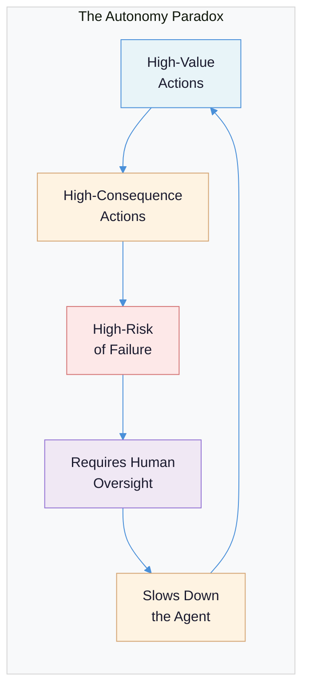
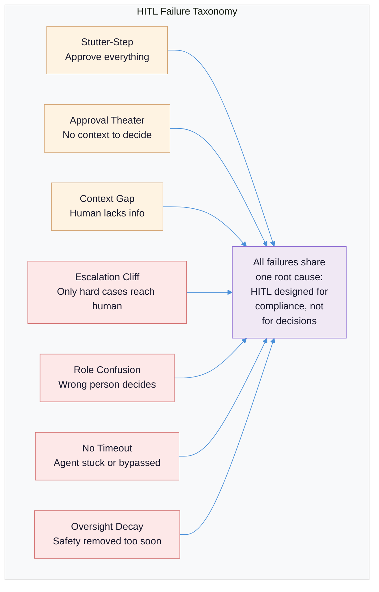
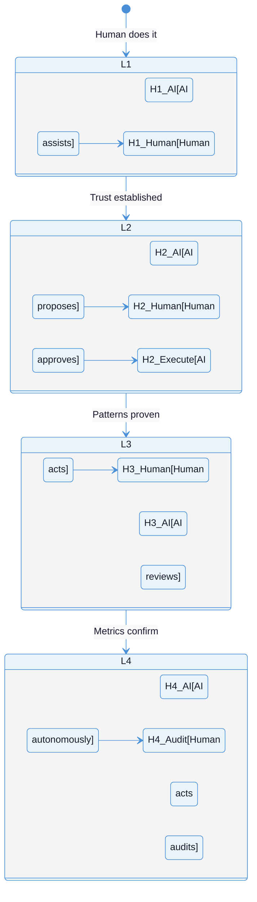
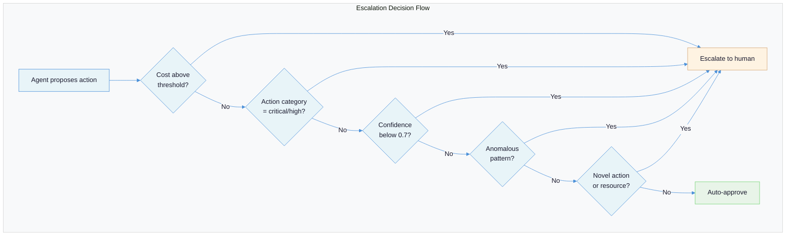
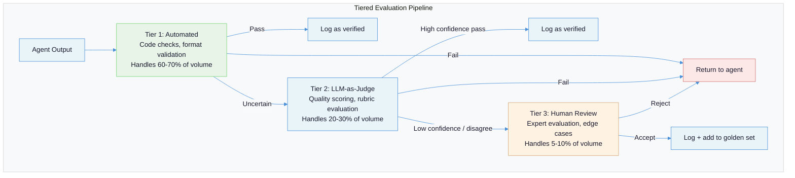

# Human-in-the-Loop Patterns: Designing the Boundary Between Human Judgment and Machine Autonomy

Full autonomy is the destination everyone talks about and almost nobody should start with. The teams that build trustworthy AI systems begin with humans approving everything, then earn the right to reduce oversight -- not the other way around.

**Prerequisites:** [Quality Gates in Agentic Systems](quality-gates-in-agentic-systems.md) (gate reliability spectrum, why self-enforcement fails), [AI-Native Solution Patterns](ai-native-solution-patterns.md) (the seven architectural patterns, build stages with human checkpoints), [Security and Safety](security-and-safety.md) (the threat model that makes human oversight necessary).

---

## The Problem: The Autonomy Paradox

The promise of AI agents is that they act on your behalf. The reality is that acting on your behalf means making decisions you have not reviewed, with consequences you have not approved, based on reasoning you cannot fully inspect. The more capable the agent, the larger the blast radius of a bad decision.

This creates a paradox: **the systems that would benefit most from autonomy are the ones where autonomy is most dangerous.** A customer service chatbot that can resolve billing disputes autonomously is valuable precisely because billing disputes involve money -- and involving money is precisely why you cannot let the chatbot act without oversight. A coding agent that deploys to production is valuable because deployment is consequential, and consequential actions are the ones that demand human review.

| What teams want | What they actually need |
|---|---|
| "The agent should just handle it" | The agent should handle 80% and escalate 20% |
| "Remove the human bottleneck" | Move the human to a higher-leverage position |
| "Full automation saves money" | Approval fatigue from over-automation costs more |
| "Ship fast, fix later" | The damage from an unsupervised wrong action is irreversible |
| "AI is good enough now" | Good enough on average still fails catastrophically on edge cases |

The tension is not autonomy vs. control. It is **where to draw the line, and how to move it over time.** Every system needs a different boundary, and the boundary should shift as the system proves itself -- not as the team gets impatient.



[Anthropic's research on measuring agent autonomy](https://www.anthropic.com/research/measuring-agent-autonomy) provides empirical evidence for this paradox. Among Claude Code users, new users employ full auto-approve in roughly 20% of sessions, while experienced users (750+ sessions) increase to over 40% -- but experienced users also interrupt the agent more frequently (~9% vs ~5% for new users). They grant more autonomy *and* intervene more actively. This is not a contradiction. It is the correct pattern: **effective oversight does not mean approving every action. It means being in a position to intervene when it matters.**

The implication for system design is direct: the goal is not to eliminate human involvement. It is to make human involvement high-leverage -- ensuring humans spend their attention on decisions that actually require judgment, not on rubber-stamping actions the system handles reliably.

---

## Failure Taxonomy: How Human-in-the-Loop Goes Wrong

Human-in-the-loop is not inherently good. Implemented badly, it destroys the value of automation without providing real safety. Seven distinct failure modes explain how.

### Failure Mode 1: The Stutter-Step Agent

**What it looks like:** The agent pauses for approval on every action. "May I read this file?" "May I search for this term?" "May I write this function?" The human approves 98% of requests without reading them.

**Why it happens:** The system treats all actions as equal risk. Reading a file and deleting a database share the same approval flow. The developer who built the system conflated "human oversight" with "human approves everything." The result is a system that provides the appearance of oversight with none of the substance -- the human is not evaluating decisions, they are dismissing interruptions.

**The damage:** Approval fatigue is not just annoying; it is actively dangerous. [Cordum.io's analysis](https://cordum.io/blog/human-in-the-loop-ai-patterns) identifies the metric: "If approvers are approving >95% of requests in <10 seconds, you probably have too many low-value approval gates." When humans approve everything reflexively, they will also approve the one action that should have been blocked. The human has been trained by the system to stop paying attention.

### Failure Mode 2: Approval Theater

**What it looks like:** The system routes actions through an approval workflow, but the approver lacks the context, expertise, or time to make a meaningful decision. They see "Agent wants to execute SQL query" without seeing the query, the target database, or the potential impact.

**Why it happens:** The approval UX was designed for compliance, not for decision-making. The system proves that a human was in the loop, but the human was not equipped to add value. This is especially common in enterprise settings where "a human approved it" is a checkbox requirement rather than a genuine safety mechanism.

**The damage:** False confidence. The organization believes it has human oversight. It has a paper trail showing approvals. When something goes wrong, the audit log shows a human approved the action -- but the human had no way to know it was wrong. The approval provided legal cover, not safety.

### Failure Mode 3: The Context Gap

**What it looks like:** The agent has been working for 15 steps. It escalates a decision to a human. The human sees the decision but not the 15 steps of reasoning that led to it. They cannot evaluate whether the decision is correct because they lack the context the agent has accumulated.

**Why it happens:** Handoff protocols assume the human can pick up where the agent left off. But the agent's context window contains the full chain of observations, tool outputs, and intermediate reasoning. The human gets a summary -- or worse, just the final question. Evaluating a decision without its context is guesswork, not judgment.

**The damage:** Either the human rubber-stamps the decision (because they cannot evaluate it, and saying "I don't know" feels like admitting incompetence) or they reject it conservatively (because uncertainty defaults to "no"), blocking legitimate actions and slowing the system.

### Failure Mode 4: The Escalation Cliff

**What it looks like:** The system operates autonomously for 95% of cases. For the remaining 5%, it escalates to a human -- but the escalated cases are the hardest, most ambiguous decisions in the system. The human, who has not been actively monitoring the system, is suddenly asked to make expert-level judgments on edge cases.

**Why it happens:** Progressive autonomy was implemented correctly for routine cases but the escalation path was not designed. The system self-selected for difficulty: everything easy was handled automatically, and everything hard was dumped on the human. Without continuous exposure to the system's reasoning, the human is not calibrated for these decisions.

**The damage:** Worse decision quality than if the human had been involved all along. The human lacks both the context of the specific case and the calibration that comes from seeing many cases. This is the "expert on call" anti-pattern -- the expert is only called for emergencies, has no situational awareness, and makes worse decisions under pressure.

### Failure Mode 5: Role Confusion

**What it looks like:** Nobody knows who should approve what. A financial decision gets routed to an engineer. A technical architecture decision gets routed to a product manager. Or worse: all escalations go to one person who becomes a bottleneck.

**Why it happens:** The system was built with a single "human approver" role rather than role-based routing. Different decisions require different expertise, but the approval workflow treats all humans as interchangeable. [OWASP's AI Agent Security Cheat Sheet](https://cheatsheetseries.owasp.org/cheatsheets/AI_Agent_Security_Cheat_Sheet.html) emphasizes this: risk classification must map to specific roles, not to a generic approval queue.

**The damage:** Either decisions are made by people without the relevant expertise (leading to bad approvals) or the one person who *does* have the expertise becomes the bottleneck for every action (destroying throughput).

### Failure Mode 6: No Timeout Handling

**What it looks like:** The agent pauses for approval. The human is in a meeting, or asleep, or on vacation. The agent waits indefinitely. A time-sensitive action misses its window. Or the agent is configured to auto-approve on timeout, silently bypassing oversight for the most complex cases -- the ones that took the human longest to evaluate.

**Why it happens:** The approval workflow was designed for the happy path where humans respond promptly. Timeout behavior was either not specified or defaulted to "proceed" (which negates the safety mechanism) or "block" (which halts critical workflows).

**The damage:** Either the system fails silently when humans are unavailable, or it bypasses safety when it should not. Both outcomes undermine trust.

### Failure Mode 7: Oversight Decay

**What it looks like:** The system launches with rigorous human review. After three months, the approval rate is 99.5%. The team concludes oversight is unnecessary and removes it. Six months later, the system silently drifts into a failure mode that review would have caught.

**Why it happens:** The team confuses "no failures during oversight" with "the system does not need oversight." But oversight was the mechanism preventing failures. Removing it removes both the safety net and the feedback loop that kept the system calibrated. This is survivorship bias applied to safety systems.

**The damage:** The system operates without oversight in exactly the conditions where it has not been tested unsupervised. The first failure after oversight removal tends to be large, because the feedback mechanisms that would have caught early drift no longer exist.



---

## The Four Levels of Human Involvement

Not all human-in-the-loop implementations are the same. The distinction is *when* and *how* the human participates relative to the agent's action. Each level suits different risk profiles, and most production systems combine multiple levels for different action categories.



### Level 1: Human-Does-It with AI Assist

The human performs the action. The AI provides suggestions, drafts, research, or analysis to inform the human's decision. The human is the actor; the AI is the advisor.

**When to use it:** New domains where the system has no track record. High-stakes decisions where error cost is extreme. Regulatory environments requiring human decision-makers. Early-stage systems before any trust has been established.

**Implementation pattern:** The AI generates options with confidence scores and supporting evidence. The human selects, modifies, or rejects. The AI's suggestions and the human's choices are logged as training data for future automation.

```python
# Level 1: AI assists, human decides
def assist_decision(context: dict) -> dict:
    options = agent.generate_options(context)
    for option in options:
        option["confidence"] = agent.score_confidence(option)
        option["evidence"] = agent.gather_evidence(option)

    # Present to human with full context
    human_choice = present_to_human(
        options=options,
        context_summary=agent.summarize_context(context),
        risk_assessment=agent.assess_risk(options)
    )

    # Log for training data
    log_decision(options=options, chosen=human_choice, context=context)
    return human_choice
```

**Concrete example:** A legal review system. The AI reads contracts, highlights unusual clauses, suggests risk ratings, and drafts markup. The lawyer makes every decision about what to flag, what to accept, and what to negotiate. The AI's hit rate on flagging problematic clauses improves the lawyer's speed without replacing their judgment.

### Level 2: Human-Approves Before AI Acts

The AI proposes an action and pauses. The human reviews the proposal, approves, rejects, or modifies it. Only after approval does the AI execute. This is the classic approval gate pattern.

**When to use it:** Consequential but routine actions where the AI's judgment is usually correct but the cost of error is high. Financial transactions above a threshold. External communications. Production deployments. Any action that is difficult to reverse.

**Implementation pattern:** The agent's execution loop includes an interrupt mechanism that serializes the pending action, notifies the appropriate human, and waits for a decision. The key architectural requirement is that the agent's state must survive the pause -- it may wait minutes, hours, or days.

```python
# Level 2: AI proposes, human approves, AI executes
class ApprovalGate:
    def __init__(self, timeout_hours: float, timeout_policy: str = "deny"):
        self.timeout_hours = timeout_hours
        self.timeout_policy = timeout_policy  # "deny", "escalate", or "approve"

    async def request_approval(self, action: dict, context: dict) -> str:
        # Serialize the pending action with full context
        request = {
            "action": action,
            "context_summary": summarize_for_human(context),
            "risk_level": classify_risk(action),
            "recommended_decision": "approve",
            "evidence": gather_evidence(action),
            "timeout_at": now() + timedelta(hours=self.timeout_hours),
        }

        # Route to the right person based on action type
        approver = route_to_approver(action, request["risk_level"])
        notification_id = notify_approver(approver, request)

        # Wait for decision with timeout
        decision = await wait_for_decision(
            notification_id,
            timeout=self.timeout_hours
        )

        if decision is None:  # Timeout
            if self.timeout_policy == "deny":
                return "denied"
            elif self.timeout_policy == "escalate":
                return await self.escalate(request)
            else:
                return "approved"  # Dangerous -- use sparingly

        log_approval(request, decision, approver)
        return decision
```

The frameworks that implement this natively include [LangGraph](https://www.permit.io/blog/human-in-the-loop-for-ai-agents-best-practices-frameworks-use-cases-and-demo) (with its `interrupt()` primitive), CrewAI (`human_input` flag on tasks), and HumanLayer (`@require_approval()` decorator). The mechanism varies, but the pattern is consistent: serialize state, pause execution, present decision, resume with result.

**Concrete example:** An expense approval agent. The agent categorizes expenses, checks policy compliance, and prepares reimbursement. Expenses under $100 that match policy are auto-approved (Level 4). Expenses between $100-$1,000 require manager approval (Level 2). Expenses over $1,000 require director approval with the full expense history for context.

### Level 3: Human-Reviews After AI Acts

The AI acts immediately. A human reviews the action after the fact, with the ability to revert, correct, or flag issues. The AI continues working while the review happens asynchronously.

**When to use it:** Actions that are reversible, time-sensitive, or high-volume. Content moderation queues. Code review of agent-generated changes. Customer response drafting where speed matters but quality is monitored.

**Implementation pattern:** The AI executes and logs the action. An asynchronous review pipeline presents the action and its outcome to a human reviewer. The review is sampled -- not every action is reviewed, but enough to maintain statistical confidence in the system's quality.

```python
# Level 3: AI acts, human reviews asynchronously
class AsyncReviewPipeline:
    def __init__(self, sample_rate: float = 0.1, review_sla_hours: float = 24):
        self.sample_rate = sample_rate
        self.review_sla_hours = review_sla_hours

    def execute_with_review(self, action: dict, context: dict) -> dict:
        # Execute immediately
        result = execute_action(action)

        # Always log for audit
        log_action(action, result, context)

        # Sample for human review
        if should_review(action, self.sample_rate):
            queue_for_review(
                action=action,
                result=result,
                context_summary=summarize_for_human(context),
                review_deadline=now() + timedelta(hours=self.review_sla_hours)
            )

        return result

    def should_review(self, action: dict, base_rate: float) -> bool:
        # Always review if confidence is low
        if action.get("confidence", 1.0) < 0.7:
            return True
        # Always review if this is a new action category
        if is_novel_action(action):
            return True
        # Otherwise, sample at the base rate
        return random.random() < base_rate
```

**Concrete example:** A customer service agent that responds to inquiries. The agent sends responses immediately (customers expect speed), but 10% of responses are queued for human review. All responses where the agent's confidence was below 70% are reviewed. When a reviewer identifies a problem, the response is corrected and the correction is fed back as a training signal.

### Level 4: AI-Acts-Autonomously with Human Audit

The AI acts without any per-action human involvement. Humans monitor aggregate metrics, review periodic audit reports, and investigate anomalies. Human involvement is reactive, triggered by systemic issues rather than individual actions.

**When to use it:** High-volume, low-risk, reversible actions where the system has a proven track record. Automated testing. Log analysis. Data pipeline transformations. Routine maintenance tasks. The system must have extensive evaluation infrastructure and anomaly detection.

**Implementation pattern:** The AI operates independently. A monitoring system tracks key metrics (success rate, error rate, cost, latency, confidence distributions). Humans are alerted only when metrics deviate from baselines. Periodic audits (weekly, monthly) sample a batch of actions for deep review.

**Concrete example:** A log analysis agent that processes millions of log entries daily, categorizing incidents and routing alerts. No human approves individual categorizations. Humans review the weekly accuracy report, investigate any category where the error rate exceeds 2%, and retrain the system when new log patterns emerge.

### Choosing the Right Level

The level should be determined by the **intersection of action risk and system maturity**, not by a blanket policy.

| Risk Category | New System (< 3 months) | Established (3-12 months) | Mature (> 12 months) |
|---|---|---|---|
| **Critical** (irreversible, financial, external comms) | Level 1-2 | Level 2 | Level 2-3 |
| **High** (write operations, config changes) | Level 2 | Level 2-3 | Level 3 |
| **Medium** (internal actions, reversible changes) | Level 2-3 | Level 3 | Level 3-4 |
| **Low** (read operations, analysis, drafts) | Level 3 | Level 4 | Level 4 |

[OWASP's AI Agent Security Cheat Sheet](https://cheatsheetseries.owasp.org/cheatsheets/AI_Agent_Security_Cheat_Sheet.html) formalizes this as a four-tier risk classification: LOW (read ops, auto-approved), MEDIUM (write ops, requires review), HIGH (financial/external comms, mandatory approval), CRITICAL (irreversible/security changes, explicit authorization). This classification maps directly to the four levels of human involvement.

---

## Designing Escalation Triggers

The quality of a human-in-the-loop system is determined not by the approval workflow itself but by **what triggers escalation**. Get the triggers wrong and you get either the stutter-step agent (too many escalations) or the autonomous failure (too few).

### The Five Trigger Categories

**1. Cost thresholds.** Any action that commits resources above a defined limit requires human approval. This is the simplest and most mechanically enforceable trigger.

```python
# Cost-based escalation
COST_THRESHOLDS = {
    "auto_approve": 10.00,      # Under $10: autonomous
    "manager_approve": 1000.00,  # $10-$1000: manager
    "director_approve": 10000.00 # $1000-$10000: director
    # Over $10000: VP approval required
}

def classify_by_cost(action: dict) -> str:
    estimated_cost = estimate_cost(action)
    for level, threshold in sorted(COST_THRESHOLDS.items(), key=lambda x: x[1]):
        if estimated_cost < threshold:
            return level
    return "vp_approve"
```

**2. Confidence scores.** The agent's own uncertainty signals when it needs help. When the model's confidence drops below a threshold, or when multiple internal assessments disagree, escalate. [Maxim AI's evaluation research](https://www.getmaxim.ai/articles/llm-as-a-judge-vs-human-in-the-loop-evaluations-a-complete-guide-for-ai-engineers) identifies three specific uncertainty signals: low confidence scores, conflicting signals from multiple evaluators, and missing context that the agent cannot fill.

**3. Action categories.** Classify actions by reversibility, blast radius, and external visibility. [OWASP](https://cheatsheetseries.owasp.org/cheatsheets/AI_Agent_Security_Cheat_Sheet.html) provides concrete thresholds: tool calls per minute (30 limit), failed call tracking, injection attempt flagging, and session cost monitoring.

```python
# Action-category-based escalation
ACTION_RISK = {
    "read_file": "low",
    "write_file": "medium",
    "send_email": "high",
    "delete_database": "critical",
    "deploy_production": "critical",
    "modify_permissions": "critical",
    "external_api_call": "high",
    "internal_api_call": "medium",
}

RISK_TO_LEVEL = {
    "low": "auto_approve",       # Level 4
    "medium": "post_review",     # Level 3
    "high": "pre_approve",       # Level 2
    "critical": "human_decides", # Level 1-2
}
```

**4. Anomaly detection.** Even within auto-approved categories, unusual patterns should trigger escalation. An agent that normally makes 5 API calls per task suddenly making 50 is anomalous regardless of the risk category of each individual call. [Reco.ai](https://www.reco.ai/hub/guardrails-for-ai-agents) describes this as "machine learning-based anomaly detection" with baseline behavior profiles and alerts on significant deviation.

**5. Novelty detection.** Actions the system has never performed before, or actions on resources it has never touched, warrant human review regardless of their risk category. A system that has been safely writing to `config.yaml` for months should still escalate the first time it writes to `production.env`.

### The Escalation Decision Flow



The critical design decision is the **default when triggers disagree**. If the cost is low but the action category is high, which wins? The answer is always the most restrictive trigger. Escalation triggers are OR conditions, not AND conditions -- any single trigger that fires should escalate.

---

## Principles for Effective Human-in-the-Loop

### Principle 1: Approval Must Be a Decision, Not a Ritual

**The principle:** Every approval request must give the human enough context to make a genuine decision. If the human cannot meaningfully evaluate the request, the approval is theater.

**Why it works:** Directly counters *approval theater* and the *context gap*. When the human receives a well-structured decision package -- action summary, risk assessment, relevant context, and a clear question -- they can make a real judgment. When they receive a generic "approve this action?" prompt, they will rubber-stamp it.

**How to apply:** Structure every approval request as a decision package with four layers, as [Cordum.io](https://cordum.io/blog/human-in-the-loop-ai-patterns) recommends:

1. **Action summary:** What the agent wants to do, in one sentence.
2. **Risk assessment:** Why this action was escalated, what could go wrong.
3. **Key context:** The 3-5 facts the human needs to evaluate the decision.
4. **Expandable details:** Full agent reasoning, available on request but not forced on the approver.

```
# BAD: Generic approval request
"Agent wants to execute tool: send_email. Approve? [Y/N]"

# GOOD: Decision package
"Agent wants to send a refund confirmation to john@example.com for $847.
 Risk: MEDIUM -- refund exceeds $500 threshold.
 Context:
   - Customer filed complaint #4821 on March 15
   - Agent verified order #9934 was delivered damaged
   - Refund amount matches order total ($847.00)
   - Company policy allows full refund for damaged goods
 [Expand: full agent reasoning chain]
 Approve / Reject / Modify amount"
```

[Mastra's analysis](https://mastra.ai/blog/human-in-the-loop-when-to-use-agent-approval) reinforces this: "Approval is not just a technical feature, it is a UX decision. 'Delete user john@example.com?' beats generic 'Tool execution requires approval'."

### Principle 2: Route Decisions to the Right Expertise

**The principle:** Different decisions require different expertise. The approval workflow must route each decision to someone qualified to evaluate it, not to a generic approval queue.

**Why it works:** Counters *role confusion* and *approval theater*. A financial decision routed to a finance expert gets a real evaluation. The same decision routed to an engineer gets a rubber stamp. Role-based routing ensures that human attention is not just present but *competent*.

**How to apply:** Implement role-based approval routing that maps action categories to approver roles. [Permit.io](https://www.permit.io/blog/human-in-the-loop-for-ai-agents-best-practices-frameworks-use-cases-and-demo) emphasizes: "Delegate approval logic to a policy engine, where changes are declarative, versioned, and enforceable across systems." Do not hardcode approval routing in application logic.

```python
# Role-based approval routing
APPROVAL_ROUTING = {
    "financial": {
        "low": "finance_team",
        "medium": "finance_manager",
        "high": "cfo",
        "critical": "cfo_and_legal"
    },
    "technical": {
        "low": "auto_approve",
        "medium": "tech_lead",
        "high": "engineering_director",
        "critical": "cto"
    },
    "external_communication": {
        "low": "comms_team",
        "medium": "comms_manager",
        "high": "vp_communications",
        "critical": "executive_team"
    },
}
```

### Principle 3: Design the Handoff, Not Just the Pause

**The principle:** When an agent escalates to a human, the handoff must transfer enough context for the human to make a decision without re-doing the agent's work. When the human decides, the resumption must give the agent the decision plus any human reasoning.

**Why it works:** Counters the *context gap* and the *escalation cliff*. The handoff protocol is the difference between "here is a question I cannot answer" (useless) and "here is what I found, what I considered, and specifically where I need your judgment" (actionable).

**How to apply:** Every handoff must include:

1. **What the agent was trying to do** (the goal, not the current step).
2. **What the agent has done so far** (summary of actions and findings).
3. **What the agent is uncertain about** (the specific decision point).
4. **What the options are** (with the agent's assessment of each).
5. **What the agent recommends** (so the human can agree or override).

[Anthropic's harness pattern](https://www.anthropic.com/engineering/effective-harnesses-for-long-running-agents) implements this through a progress file that persists the agent's state across sessions. For shorter-lived interactions, the handoff is a structured message:

```python
# Structured handoff protocol
class AgentHandoff:
    goal: str                    # "Resolve customer complaint #4821"
    actions_taken: list[str]     # ["Read complaint", "Verified order", "Checked policy"]
    findings: dict               # {"order_damaged": True, "refund_eligible": True}
    decision_needed: str         # "Approve refund of $847 to john@example.com"
    options: list[dict]          # [{"action": "full_refund", "risk": "low"}, ...]
    recommendation: str          # "Full refund -- matches policy for damaged goods"
    confidence: float            # 0.92
    supporting_evidence: list    # [policy_doc_link, order_details, damage_photos]
```

When the human responds, the resumption message should include not just the decision but the human's reasoning, so the agent can incorporate it into future decisions:

```python
# Structured resumption
class HumanDecision:
    decision: str           # "approved"
    modifications: dict     # {} (no changes) or {"amount": 700.00}
    reasoning: str          # "Approved as-is -- clear damage, policy applies"
    applies_to_future: bool # True -- "apply same logic to similar cases"
```

### Principle 4: Progressive Autonomy with Measurable Trust

**The principle:** Start with human approval on all actions. Expand autonomy only when metrics demonstrate reliability. Retract autonomy immediately when trust is violated.

**Why it works:** Counters *oversight decay* by making autonomy expansion data-driven rather than impatience-driven. The system earns autonomy through demonstrated performance, not through the passage of time.

**How to apply:** Define trust metrics per action category. Track them continuously. Autonomy expansion requires meeting thresholds for a sustained period. A single significant failure triggers immediate retraction.

```python
# Progressive autonomy engine
class AutonomyManager:
    def __init__(self):
        self.trust_scores = {}  # Per action category

    def evaluate_trust(self, category: str) -> str:
        metrics = self.get_metrics(category, window_days=30)

        # Trust score components
        accuracy = metrics["correct_decisions"] / metrics["total_decisions"]
        human_agreement = metrics["human_agreed"] / metrics["human_reviewed"]
        incident_free_days = metrics["days_since_last_incident"]
        volume = metrics["total_decisions"]

        # All conditions must be met for autonomy expansion
        if (accuracy >= 0.98
            and human_agreement >= 0.95
            and incident_free_days >= 30
            and volume >= 100):
            return "expand_autonomy"
        elif (accuracy < 0.90
              or incident_free_days < 7):
            return "retract_autonomy"  # Immediate retraction
        else:
            return "maintain_current"

    def retract(self, category: str):
        # Move category back one level
        current = self.get_autonomy_level(category)
        self.set_autonomy_level(category, max(current - 1, 1))
        alert_team(f"Autonomy retracted for {category}: "
                   f"moved from Level {current} to Level {current - 1}")
```

The key insight from [Anthropic's autonomy research](https://www.anthropic.com/research/measuring-agent-autonomy) is that trust growth is gradual but trust loss is instant: "A single significant failure can erase weeks of accumulated confidence" ([GitLab user research](https://about.gitlab.com/blog/building-trust-in-agentic-tools-what-we-learned-from-our-users/)). The asymmetry is intentional -- it takes many correct decisions to earn trust and one bad decision to lose it. This mirrors how trust works between humans.

### Principle 5: Timeout Policies Must Be Explicit

**The principle:** Every approval gate must define what happens when the human does not respond within a specified window. The default should be "deny" for high-risk actions and "escalate" for medium-risk actions.

**Why it works:** Counters *no timeout handling* by making the timeout behavior a deliberate design decision rather than an accidental default. [The n8n production playbook](https://blog.n8n.io/production-ai-playbook-human-oversight/) recommends concrete timeouts: 2-4 hours for operational decisions, 24 hours for strategic decisions, with explicit escalation on expiry.

**How to apply:**

```python
TIMEOUT_POLICIES = {
    "critical": {"timeout_hours": 2, "on_timeout": "deny", "escalate_to": "incident_channel"},
    "high":     {"timeout_hours": 4, "on_timeout": "escalate", "escalate_to": "manager"},
    "medium":   {"timeout_hours": 24, "on_timeout": "escalate", "escalate_to": "team_lead"},
    "low":      {"timeout_hours": 48, "on_timeout": "approve_with_flag"},
}
```

Never default to "approve" on timeout for critical or high-risk actions. If a critical action cannot get a human decision within two hours, the correct behavior is to halt and alert, not to proceed unsupervised.

---

## Human-in-the-Loop for Evaluation

Human involvement is not just about approving agent actions -- it is also essential for evaluating whether the agent's outputs are good. The evaluation pipeline is where human judgment feeds back into system improvement.

### The Tiered Evaluation Architecture

[Maxim AI's research](https://www.getmaxim.ai/articles/llm-as-a-judge-vs-human-in-the-loop-evaluations-a-complete-guide-for-ai-engineers) documents that LLM-as-judge achieves "over 80% agreement with crowdsourced human preferences on general instruction-following" but only "60-70% agreement with subject matter experts in specialized domains." This gap defines the evaluation architecture: automate what the LLM judges well, and route the rest to humans.



The cost math makes this tiered approach necessary: automated evaluation costs [500-5000x less](https://www.getmaxim.ai/articles/llm-as-a-judge-vs-human-in-the-loop-evaluations-a-complete-guide-for-ai-engineers) than human review. You cannot afford human review for every output. But you cannot trust automated evaluation alone, especially in specialized domains.

### Calibration Workflows

Human evaluators must be calibrated against each other and against the system's rubric. Without calibration, "human evaluation" is just one person's subjective opinion presented as ground truth.

**Calibration protocol:**

1. **Anchor set:** 50-100 pre-evaluated examples with known-good ratings. New evaluators rate these before starting real evaluations. Their ratings must correlate with the anchor ratings at r > 0.8.
2. **Overlap evaluations:** 10-20% of items are evaluated by multiple humans independently. Inter-annotator agreement (Cohen's kappa > 0.7) is the minimum threshold for usable labels.
3. **Disagreement resolution:** When evaluators disagree, a senior reviewer adjudicates. The resolved label and the reasoning are added to the anchor set. This is where the evaluation rubric gets sharpened -- disagreements reveal ambiguity in the criteria.

### Active Learning for Human Labels

Not all outputs are equally informative to label. [Maxim AI](https://www.getmaxim.ai/articles/llm-as-a-judge-vs-human-in-the-loop-evaluations-a-complete-guide-for-ai-engineers) identifies three active learning mechanisms for selecting which outputs to route to human evaluation:

- **Uncertainty sampling:** When the LLM judge's confidence is low, route to human. These are the cases where the automated evaluation is least reliable.
- **Diversity sampling:** Ensure human-reviewed samples cover the full distribution of output types, not just edge cases. This prevents the training data from becoming biased toward anomalies.
- **Disagreement routing:** When multiple LLM judges disagree, route to human. Cross-judge disagreement is a strong signal that the case is genuinely ambiguous.

The human labels from these mechanisms feed back into two loops: retraining the LLM judge (improving Tier 2 accuracy) and expanding the golden dataset (improving Tier 1 coverage). Over time, this reduces the volume that reaches Tier 3 -- but it never eliminates it, because new edge cases continuously emerge.

---

## The Organizational Dimension

Human-in-the-loop is not just a technical pattern. It is an organizational design problem. Who approves what, how approval authority is delegated, and how decisions are audited are governance questions that technology implements but does not answer.

### Role-Based Access Control for Agent Actions

Agent actions must be governed by the same RBAC principles as human actions. [OWASP](https://cheatsheetseries.owasp.org/cheatsheets/AI_Agent_Security_Cheat_Sheet.html) mandates: "Grant agents the minimum tools required for their specific task" with "per-tool permission scoping (read-only vs. write, specific resources)."

[Reco.ai's guardrails guide](https://www.reco.ai/hub/guardrails-for-ai-agents) extends this with contextual access: "Modify permissions dynamically based on context, such as time, environment, or sensitivity." An agent that has write access during business hours but read-only access outside them is implementing contextual RBAC.

The RBAC model for agents has three layers:

1. **Agent role:** What tools the agent can access and what actions it can propose (regardless of approval level).
2. **Approval authority:** Who can approve which actions at which risk levels. Maps to the organizational hierarchy.
3. **Audit authority:** Who can review the audit trail and investigate anomalies. Must be independent of both the agent and the approvers.

### Audit Trails for Compliance

Every agent action -- approved, rejected, or autonomous -- must produce an immutable audit record. [OWASP's schema](https://cheatsheetseries.owasp.org/cheatsheets/AI_Agent_Security_Cheat_Sheet.html) captures: event type, severity, agent/session/user identifiers, timestamps, tool names, and sanitized parameters (redact passwords, API keys, tokens). [Reco.ai](https://www.reco.ai/hub/guardrails-for-ai-agents) adds: "Decision outcomes link back to specific prompts or datasets" with immutable, tamper-evident logs and defined retention policies.

The audit trail serves three audiences:

- **Operators** need real-time visibility into what the agent is doing and why.
- **Compliance teams** need evidence that policies were followed and approvals were obtained.
- **Incident responders** need the ability to reconstruct the exact sequence of events that led to a failure.

```python
# Audit event schema
@dataclass
class AgentAuditEvent:
    event_id: str              # Unique, immutable
    timestamp: datetime        # UTC
    agent_id: str              # Which agent
    session_id: str            # Which session
    user_id: str               # Which user initiated
    action_type: str           # "tool_call", "approval_request", "decision"
    tool_name: str             # Which tool was called
    parameters: dict           # Sanitized -- no secrets
    risk_level: str            # "low", "medium", "high", "critical"
    approval_required: bool    # Whether approval was needed
    approver_id: str | None    # Who approved (if applicable)
    approval_decision: str | None  # "approved", "rejected", "modified", "timeout"
    approval_latency_ms: int | None  # How long the human took
    outcome: str               # "success", "failure", "reverted"
    cost_usd: float            # Token cost of this action
```

---

## Recommendations

### Short-Term: Easy Wins (Days)

1. **Classify every agent action by risk level.** Use the OWASP four-tier model (low/medium/high/critical). Map each risk level to a human involvement level (1-4). This takes hours and immediately identifies which actions need more oversight and which have too much.

2. **Add context to approval requests.** Wherever your system pauses for human approval, ensure the request includes: what the agent wants to do, why it was escalated, key context, and a recommended action. This transforms rubber-stamping into genuine decision-making.

3. **Implement explicit timeout policies.** For every approval gate, define what happens when the human does not respond. Default to "deny" for critical actions, "escalate" for high/medium. This eliminates indefinite waits and accidental auto-approvals.

### Medium-Term: Structural Changes (Weeks)

4. **Build role-based approval routing.** Map action categories to approver roles. Use a policy engine rather than hardcoded routing. This ensures decisions are made by people with relevant expertise and distributes the approval load.

5. **Implement the tiered evaluation pipeline.** Automated checks handle the bulk, LLM-as-judge handles quality scoring, and human reviewers handle edge cases and calibration. This creates the feedback loop that continuously improves the system.

6. **Add progressive autonomy metrics.** Track accuracy, human agreement rate, and incident-free days per action category. Autonomy expansion requires meeting thresholds; any significant failure triggers immediate retraction.

### Long-Term: Architectural Shifts (Months)

7. **Separate the autonomy policy from the agent code.** The rules about what requires approval, who approves it, and what the timeout behavior is should live in a declarative policy engine -- not in application code. This makes autonomy boundaries auditable, versionable, and modifiable without code changes.

8. **Build comprehensive audit infrastructure.** Immutable, tamper-evident logs with defined retention policies. Every agent action links back to the prompt, the context, the decision, and the outcome. This is not optional for compliance-sensitive domains.

9. **Implement active learning for human evaluation.** Route the most informative outputs to human reviewers -- uncertainty samples, diversity samples, and disagreement cases. Human labels feed back into the automated evaluation pipeline, continuously improving its accuracy and reducing the volume that requires human review.

---

## The Hard Truth

Most teams implement human-in-the-loop backwards. They start with full autonomy because it is easier to build, then add oversight after something goes wrong. By that point, they have already established user expectations for speed, built workflows around autonomous operation, and created organizational pressure against "slowing things down." Adding oversight retroactively is fighting against the system's momentum.

The teams that get this right start with humans approving everything -- and they accept that this is slow, expensive, and annoying. They accept it because they understand that the approval data is the training data. Every human decision generates a labeled example: this action was correct, this one was not, this one needed modification. Without this data, progressive autonomy is just hope -- "the system seems fine, let's remove the guardrails."

The uncomfortable truth is that human-in-the-loop is not a phase you pass through on the way to full autonomy. It is a permanent architectural feature. The question is never "do we need human oversight?" The question is "which specific actions can we move from Level 2 to Level 3 this quarter, based on the data?" Even the most mature AI systems in production -- content moderation at scale, autonomous vehicle decision-making, medical diagnosis support -- maintain human oversight on their highest-consequence decisions. The boundary moves, but it never disappears.

The single biggest mistake is treating HITL as a tax on automation instead of as the mechanism that makes automation trustworthy. Every approval is a data point. Every human correction is a training signal. Every escalation is evidence about where the system's judgment boundary lies. If you are not capturing and learning from these signals, your human-in-the-loop system is just a speed bump -- it slows the system down without making it better.

---

## Summary Checklist

| Question | Good Answer | Bad Answer |
|---|---|---|
| Do you classify actions by risk before deciding oversight level? | Yes -- four-tier risk classification drives HITL level | No -- same approval flow for all actions |
| Can the approver make a genuine decision from the approval request? | Yes -- structured decision package with context | No -- generic "approve this action?" prompt |
| Are approval requests routed to people with relevant expertise? | Yes -- role-based routing via policy engine | No -- all approvals go to one person or a generic queue |
| Do approval gates have explicit timeout behavior? | Yes -- deny or escalate on timeout, per risk level | No -- agent waits indefinitely or auto-approves |
| Is autonomy expansion driven by metrics? | Yes -- accuracy, agreement rate, incident-free days | No -- "it seems to be working, remove the gates" |
| Does autonomy retract immediately on significant failure? | Yes -- automatic retraction to previous level | No -- failures are investigated but autonomy unchanged |
| Are human decisions captured as training data? | Yes -- every approval/rejection feeds the eval pipeline | No -- decisions are logged but not used for improvement |
| Does the system have audit trails for compliance? | Yes -- immutable logs with agent, approver, action, outcome | No -- standard application logs only |
| Is human evaluation calibrated? | Yes -- anchor sets, inter-annotator agreement, disagreement resolution | No -- individual reviewers rate independently with no calibration |
| Does the escalation trigger design prevent approval fatigue? | Yes -- only genuinely uncertain or high-risk actions reach humans | No -- humans approve 95%+ of requests in under 10 seconds |

---

## References

### Research and Official Documentation

- [Anthropic, "Building Effective Agents"](https://www.anthropic.com/research/building-effective-agents) -- Canonical guide to agent architecture; defines the checkpoint pattern for human feedback and emphasizes sandboxed testing with appropriate guardrails.
- [Anthropic, "Measuring Agent Autonomy"](https://www.anthropic.com/research/measuring-agent-autonomy) -- Empirical data on progressive trust: new users auto-approve ~20% of sessions, experienced users ~40% but interrupt more frequently; 80% of tool calls have at least one safeguard.
- [Anthropic, "Effective Harnesses for Long-Running Agents"](https://www.anthropic.com/engineering/effective-harnesses-for-long-running-agents) -- Two-agent harness pattern with progress files for state persistence across sessions; structured handoff protocol.
- [OWASP, "AI Agent Security Cheat Sheet"](https://cheatsheetseries.owasp.org/cheatsheets/AI_Agent_Security_Cheat_Sheet.html) -- Four-tier risk classification (LOW/MEDIUM/HIGH/CRITICAL), audit logging schema, anomaly detection thresholds, and inter-agent trust models.

### Practitioner Articles

- [Permit.io, "Human-in-the-Loop for AI Agents"](https://www.permit.io/blog/human-in-the-loop-for-ai-agents-best-practices-frameworks-use-cases-and-demo) -- Four HITL patterns (interrupt/resume, human-as-tool, approval flows, fallback escalation), RBAC integration, and framework comparison (LangGraph, CrewAI, HumanLayer).
- [Cordum.io, "Human-in-the-Loop AI Patterns"](https://cordum.io/blog/human-in-the-loop-ai-patterns) -- Escalation trigger taxonomy, anti-patterns (approval theater, information overload), and the approval fatigue metric: >95% approval rate in <10 seconds signals over-gating.
- [n8n, "Production AI Playbook: Human Oversight"](https://blog.n8n.io/production-ai-playbook-human-oversight/) -- Three implementation patterns (inline chat, tool call gates, multi-channel review), timeout recommendations (2-4 hours operational, 24 hours strategic), and progressive autonomy strategy.
- [GitLab, "Building Trust in Agentic Tools"](https://about.gitlab.com/blog/building-trust-in-agentic-tools-what-we-learned-from-our-users/) -- User research identifying micro-inflection points, four pillars of trust, and the asymmetry that a single failure can erase weeks of accumulated confidence.
- [Mastra, "When to Use Agent Approval"](https://mastra.ai/blog/human-in-the-loop-when-to-use-agent-approval) -- Distinguishes approval (gatekeeping) from suspension (clarification) as two distinct pause patterns; UX-focused implementation guidance.
- [Maxim AI, "LLM-as-a-Judge vs HITL Evaluations"](https://www.getmaxim.ai/articles/llm-as-a-judge-vs-human-in-the-loop-evaluations-a-complete-guide-for-ai-engineers) -- LLM judge accuracy (80% crowdsource agreement, 60-70% expert agreement), 500-5000x cost advantage over human review, and tiered evaluation architecture.
- [Kili Technology, "HITL, HOTL, and LLM-as-a-Judge"](https://kili-technology.com/blog/human-in-the-loop-human-on-the-loop-and-llm-as-a-judge-for-validating-ai-outputs) -- Defines the HITL/HOTL/LLM-Judge spectrum with a five-layer enterprise evaluation stack.
- [Reco.ai, "Guardrails for AI Agents"](https://www.reco.ai/hub/guardrails-for-ai-agents) -- RBAC integration with IAM platforms, contextual access controls, immutable audit trails, and observability stack (prompt-level, action-level, and user feedback metrics).
- [Agentic Patterns, "HITL Approval Framework"](https://agentic-patterns.com/patterns/human-in-loop-approval-framework) -- Four-stage approval execution model (risk classification, multi-channel notification, human decision gate, audit logging) with progressive autonomy.

### Cross-References in This Suite

- [Quality Gates in Agentic Systems](quality-gates-in-agentic-systems.md) -- The gate reliability spectrum (Levels 0-5); Level 5 (external system enforcement at ~99%+ compliance) is the category that human approval workflows belong to; six failure modes of self-enforcement that human oversight addresses.
- [AI-Native Solution Patterns](ai-native-solution-patterns.md) -- Build stage 4 of the Autonomous Agent pattern explicitly requires human checkpoints for high-consequence actions; the complexity escalation ladder where each pattern level demands more oversight infrastructure.
- [Evaluation-Driven Development](evaluation-driven-development.md) -- The measurement infrastructure that human evaluation labels feed into; the eval flywheel where human labels improve automated scoring.
- [Security and Safety in LLM Applications](security-and-safety.md) -- The threat model that makes human oversight necessary; prompt injection as the fundamental reason why LLM self-governance is insufficient.
