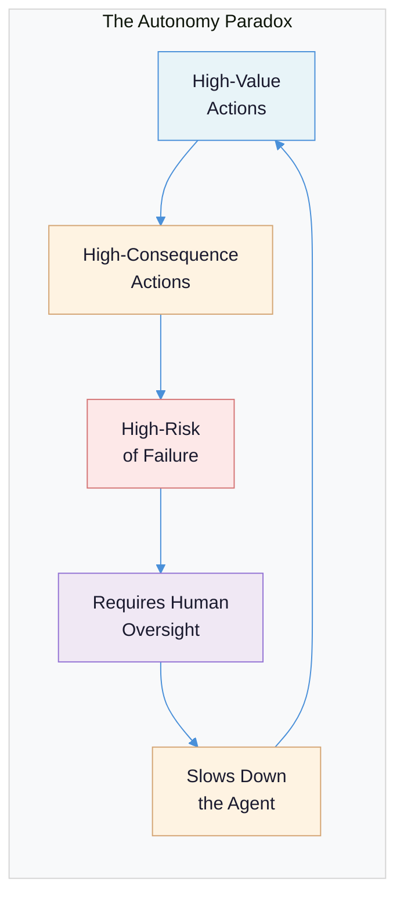
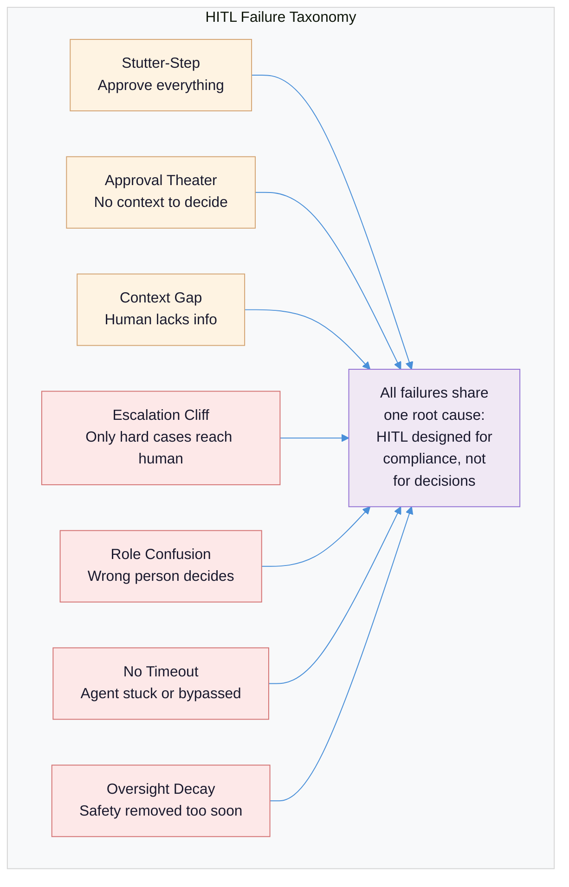
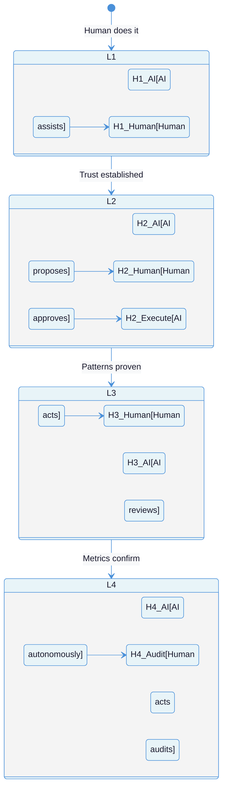
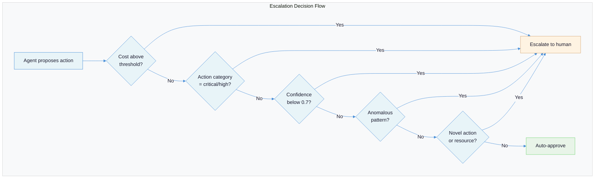
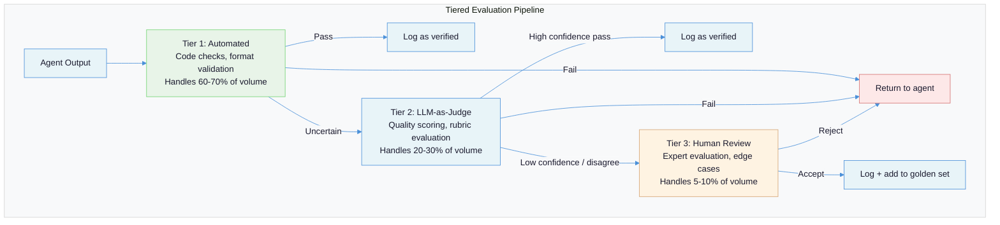

# Human-in-the-Loop Patterns: Designing the Boundary Between Human Judgment and Machine Autonomy

**Thesis:** Human oversight is not a phase to pass through on the way to autonomy -- it is a permanent architectural feature, and its quality is set by what triggers escalation, not by how many approvals you can route.

**Prerequisites:** [Quality Gates in Agentic Systems](quality-gates-in-agentic-systems.md) (gate reliability spectrum, why self-enforcement fails), [AI-Native Solution Patterns](ai-native-solution-patterns.md) (the seven architectural patterns, build stages with human checkpoints), [Security and Safety](security-and-safety.md) (the threat model that makes human oversight necessary).

**Reading time:** 28 minutes

---

Full autonomy is the destination everyone talks about and almost nobody should start with. The teams that build trustworthy AI systems begin with humans approving everything, then earn the right to reduce oversight -- not the other way around.

## The Core Tension

The promise of AI agents is that they act on your behalf. The reality is that acting on your behalf means making decisions you have not reviewed, with consequences you have not approved, based on reasoning you cannot fully inspect. The more capable the agent, the larger the blast radius of a bad decision.

This creates a paradox: **the systems that would benefit most from autonomy are the ones where autonomy is most dangerous.** A customer service chatbot that can resolve billing disputes autonomously is valuable precisely because billing disputes involve money -- and involving money is precisely why you cannot let the chatbot act without oversight. A coding agent that deploys to production is valuable because deployment is consequential, and consequential actions are the ones that demand human review.

| What teams assume | What actually happens |
|---|---|
| "The agent should just handle it" | The agent should handle 80% and escalate 20% |
| "Remove the human bottleneck" | Move the human to a higher-leverage position |
| "Full automation saves money" | Approval fatigue from over-automation costs more |
| "Ship fast, fix later" | The damage from an unsupervised wrong action is irreversible |
| "AI is good enough now" | Good enough on average still fails catastrophically on edge cases |
| "More approvals mean more safety" | Approval volume above what a human can sustain degrades every approval, including the one that mattered |

The tension is not autonomy vs. control. It is **where to draw the line, and how to move it over time.** Every system needs a different boundary, and the boundary should shift as the system proves itself -- not as the team gets impatient.


```mermaid
%%{init: {'theme': 'base', 'themeVariables': {'primaryColor': '#e8f4f8', 'primaryTextColor': '#1a1a2e', 'primaryBorderColor': '#4a90d9', 'lineColor': '#4a90d9', 'secondaryColor': '#fef3e2', 'tertiaryColor': '#f0e8f4', 'clusterBkg': '#f8f9fa', 'edgeLabelBackground': '#f8f9fa'}}}%%
graph LR
    subgraph Paradox["The Autonomy Paradox"]
        V["High-Value<br/>Actions"] --> C["High-Consequence<br/>Actions"]
        C --> R["High-Risk<br/>of Failure"]
        R --> O["Requires Human<br/>Oversight"]
        O --> S["Slows Down<br/>the Agent"]
        S --> V
    end

    style V fill:#e8f4f8,stroke:#4a90d9
    style C fill:#fef3e2,stroke:#d4a574
    style R fill:#fde8e8,stroke:#d47474
    style O fill:#f0e8f4,stroke:#9474d4
    style S fill:#fef3e2,stroke:#d4a574
```

[Anthropic's research on measuring agent autonomy](https://www.anthropic.com/research/measuring-agent-autonomy) provides empirical evidence for this paradox. Among Claude Code users, new users employ full auto-approve in roughly 20% of sessions, while experienced users (750+ sessions) increase to over 40% -- but experienced users also interrupt the agent more frequently (~9% vs ~5% for new users). They grant more autonomy *and* intervene more actively. This is not a contradiction. It is the correct pattern: **effective oversight does not mean approving every action. It means being in a position to intervene when it matters.**

The implication for system design is direct: the goal is not to eliminate human involvement. It is to make human involvement high-leverage -- ensuring humans spend their attention on decisions that actually require judgment, not on rubber-stamping actions the system handles reliably.

---

## Failure Taxonomy

Human-in-the-loop is not inherently good. Implemented badly, it destroys the value of automation without providing real safety. Seven distinct failure modes explain how.

### Failure Mode 1: The Stutter-Step Agent

**What it looks like:** The agent pauses for approval on every action -- "May I read this file?" "May I search for this term?" -- and the human approves 98% of requests without reading them.

**Why it happens:** The system treats all actions as equal risk, so reading a file and deleting a database share one approval flow. The builder conflated "human oversight" with "human approves everything", which produces the appearance of oversight with none of the substance: the human is not evaluating decisions, they are dismissing interruptions.

**The damage:** [Cordum.io's analysis](https://cordum.io/blog/human-in-the-loop-ai-patterns) supplies the metric -- "If approvers are approving >95% of requests in <10 seconds, you probably have too many low-value approval gates." A human trained to approve reflexively will also approve the one action that should have been blocked.

### Failure Mode 2: Approval Theater

**What it looks like:** Actions route through an approval workflow, but the approver lacks the context, expertise or time to decide. They see "Agent wants to execute SQL query" without the query, the target database or the impact.

**Why it happens:** The approval UX was designed for compliance, not for decision-making. It is common wherever "a human approved it" is a checkbox requirement rather than a safety mechanism.

**The damage:** False confidence. The organization believes it has oversight; what it has is a paper trail. When something goes wrong the log shows a human approved it -- but the human had no way to know it was wrong. The approval provided legal cover, not safety.

### Failure Mode 3: The Context Gap

**What it looks like:** The agent has worked for 15 steps, escalates a decision, and the human sees the decision but not the reasoning behind it.

**Why it happens:** Handoff protocols assume the human can pick up where the agent left off, but the agent's context holds the full chain of observations, tool outputs and intermediate reasoning. The human gets a summary, or just the final question. Evaluating a decision without its context is guesswork, not judgment.

**The damage:** Either the human rubber-stamps it -- because saying "I don't know" feels like admitting incompetence -- or rejects it conservatively, because uncertainty defaults to "no", blocking legitimate actions.

### Failure Mode 4: The Escalation Cliff

**What it looks like:** The system runs autonomously for 95% of cases and escalates the remaining 5% -- the hardest, most ambiguous decisions in the system. A human who has not been monitoring is suddenly asked for expert judgment on edge cases.

**Why it happens:** Progressive autonomy was implemented for routine cases but the escalation path was not designed. The system self-selected for difficulty, and without continuous exposure to its reasoning the human is not calibrated for what arrives.

**The damage:** Worse decisions than if the human had been involved all along, because they lack both the case context and the calibration that comes from seeing many cases. This is the "expert on call" anti-pattern.

### Failure Mode 5: Role Confusion

**What it looks like:** Nobody knows who should approve what. A financial decision reaches an engineer, an architecture decision reaches a product manager, or every escalation lands on one person who becomes the bottleneck.

**Why it happens:** The system was built with a single "human approver" role rather than role-based routing, so all humans are treated as interchangeable. [OWASP's AI Agent Security Cheat Sheet](https://cheatsheetseries.owasp.org/cheatsheets/AI_Agent_Security_Cheat_Sheet.html) is explicit that risk classification must map to specific roles, not to a generic approval queue.

**The damage:** Decisions are made without relevant expertise, or the one person who has it becomes the bottleneck for every action.

### Failure Mode 6: No Timeout Handling

**What it looks like:** The agent pauses for approval; the human is in a meeting, asleep, or on vacation. The agent waits indefinitely and a time-sensitive action misses its window -- or the system auto-approves on timeout, silently bypassing oversight for the cases that took longest to evaluate.

**Why it happens:** The workflow was designed for the happy path where humans respond promptly. Timeout behavior was unspecified, or defaulted to "proceed" (which negates the safety mechanism) or "block" (which halts critical workflows).

**The damage:** Either the system fails silently when humans are unavailable, or it bypasses safety when it should not. Both undermine trust.

### Failure Mode 7: Oversight Decay

**What it looks like:** The system launches with rigorous review. After three months the approval rate is 99.5%, the team concludes oversight is unnecessary, and removes it. Six months later the system drifts into a failure mode review would have caught.

**Why it happens:** The team confuses "no failures during oversight" with "the system does not need oversight", when oversight was the mechanism preventing failures. Removing it removes both the safety net and the feedback loop that kept the system calibrated -- survivorship bias applied to safety systems.

**The damage:** The system operates unsupervised in exactly the conditions where it has never been tested unsupervised, and the first failure tends to be large.


```mermaid
%%{init: {'theme': 'base', 'themeVariables': {'primaryColor': '#e8f4f8', 'primaryTextColor': '#1a1a2e', 'primaryBorderColor': '#4a90d9', 'lineColor': '#4a90d9', 'secondaryColor': '#fef3e2', 'tertiaryColor': '#f0e8f4', 'clusterBkg': '#f8f9fa', 'edgeLabelBackground': '#f8f9fa'}}}%%
graph TD
    subgraph Failures["HITL Failure Taxonomy"]
        F1["Stutter-Step<br/>Approve everything"] --> ROOT["All failures share<br/>one root cause:<br/>HITL designed for<br/>compliance, not<br/>for decisions"]
        F2["Approval Theater<br/>No context to decide"] --> ROOT
        F3["Context Gap<br/>Human lacks info"] --> ROOT
        F4["Escalation Cliff<br/>Only hard cases reach human"] --> ROOT
        F5["Role Confusion<br/>Wrong person decides"] --> ROOT
        F6["No Timeout<br/>Agent stuck or bypassed"] --> ROOT
        F7["Oversight Decay<br/>Safety removed too soon"] --> ROOT
    end

    style F1 fill:#fef3e2,stroke:#d4a574
    style F2 fill:#fef3e2,stroke:#d4a574
    style F3 fill:#fef3e2,stroke:#d4a574
    style F4 fill:#fde8e8,stroke:#d47474
    style F5 fill:#fde8e8,stroke:#d47474
    style F6 fill:#fde8e8,stroke:#d47474
    style F7 fill:#fde8e8,stroke:#d47474
    style ROOT fill:#f0e8f4,stroke:#9474d4
```

---

## The Oversight Spectrum

Not all human-in-the-loop implementations are the same. The distinction is *when* and *how* the human participates relative to the agent's action. Each level suits different risk profiles, and most production systems combine multiple levels for different action categories.


```mermaid
%%{init: {'theme': 'base', 'themeVariables': {'primaryColor': '#e8f4f8', 'primaryTextColor': '#1a1a2e', 'primaryBorderColor': '#4a90d9', 'lineColor': '#4a90d9', 'secondaryColor': '#fef3e2', 'tertiaryColor': '#f0e8f4', 'clusterBkg': '#f8f9fa', 'edgeLabelBackground': '#f8f9fa'}}}%%
stateDiagram-v2
    [*] --> L1: Human does it
    L1 --> L2: Trust established
    L2 --> L3: Patterns proven
    L3 --> L4: Metrics confirm

    state L1 {
        direction LR
        H1_AI[AI assists] --> H1_Human[Human acts]
    }
    state L2 {
        direction LR
        H2_AI[AI proposes] --> H2_Human[Human approves] --> H2_Execute[AI acts]
    }
    state L3 {
        direction LR
        H3_AI[AI acts] --> H3_Human[Human reviews]
    }
    state L4 {
        direction LR
        H4_AI[AI acts autonomously] --> H4_Audit[Human audits]
    }
```

### Level 1: Human-Does-It with AI Assist

The human performs the action. The AI provides suggestions, drafts, research, or analysis to inform the human's decision. The human is the actor; the AI is the advisor.

**When to use it:** New domains where the system has no track record. High-stakes decisions where error cost is extreme. Regulatory environments requiring human decision-makers. Early-stage systems before any trust has been established.

**Implementation pattern:** The AI generates options with confidence scores and supporting evidence. The human selects, modifies, or rejects. The AI's suggestions and the human's choices are logged as training data for future automation.

```python
# Level 1: AI assists, human decides
def assist_decision(context: dict) -> dict:
    options = agent.generate_options(context)
    for option in options:
        option["confidence"] = agent.score_confidence(option)
        option["evidence"] = agent.gather_evidence(option)

    # Present to human with full context
    human_choice = present_to_human(
        options=options,
        context_summary=agent.summarize_context(context),
        risk_assessment=agent.assess_risk(options)
    )

    # Log for training data
    log_decision(options=options, chosen=human_choice, context=context)
    return human_choice
```

**Concrete example:** A legal review system. The AI reads contracts, highlights unusual clauses, suggests risk ratings, and drafts markup. The lawyer makes every decision about what to flag, what to accept, and what to negotiate. The AI's hit rate on flagging problematic clauses improves the lawyer's speed without replacing their judgment.

### Level 2: Human-Approves Before AI Acts

The AI proposes an action and pauses. The human reviews the proposal, approves, rejects, or modifies it. Only after approval does the AI execute. This is the classic approval gate pattern.

**When to use it:** Consequential but routine actions where the AI's judgment is usually correct but the cost of error is high. Financial transactions above a threshold. External communications. Production deployments. Any action that is difficult to reverse.

**Implementation pattern:** The agent's execution loop includes an interrupt mechanism that serializes the pending action, notifies the appropriate human, and waits for a decision. The key architectural requirement is that the agent's state must survive the pause -- it may wait minutes, hours, or days.

```python
# Level 2: AI proposes, human approves, AI executes
class ApprovalGate:
    def __init__(self, timeout_hours: float, timeout_policy: str = "deny"):
        self.timeout_hours = timeout_hours
        self.timeout_policy = timeout_policy  # "deny", "escalate", or "approve"

    async def request_approval(self, action: dict, context: dict) -> str:
        # Serialize the pending action with full context
        request = {
            "action": action,
            "context_summary": summarize_for_human(context),
            "risk_level": classify_risk(action),
            "recommended_decision": "approve",
            "evidence": gather_evidence(action),
            "timeout_at": now() + timedelta(hours=self.timeout_hours),
        }

        # Route to the right person based on action type
        approver = route_to_approver(action, request["risk_level"])
        notification_id = notify_approver(approver, request)

        # Wait for decision with timeout
        decision = await wait_for_decision(
            notification_id,
            timeout=self.timeout_hours
        )

        if decision is None:  # Timeout
            if self.timeout_policy == "deny":
                return "denied"
            elif self.timeout_policy == "escalate":
                return await self.escalate(request)
            else:
                return "approved"  # Dangerous -- use sparingly

        log_approval(request, decision, approver)
        return decision
```

The frameworks that implement this natively include [LangGraph](https://www.permit.io/blog/human-in-the-loop-for-ai-agents-best-practices-frameworks-use-cases-and-demo) (with its `interrupt()` primitive), CrewAI (`human_input` flag on tasks), and HumanLayer (`@require_approval()` decorator). The mechanism varies, but the pattern is consistent: serialize state, pause execution, present decision, resume with result.

**Concrete example:** An expense approval agent. The agent categorizes expenses, checks policy compliance, and prepares reimbursement. Expenses under $100 that match policy are auto-approved (Level 4). Expenses between $100-$1,000 require manager approval (Level 2). Expenses over $1,000 require director approval with the full expense history for context.

### Level 3: Human-Reviews After AI Acts

The AI acts immediately. A human reviews the action after the fact, with the ability to revert, correct, or flag issues. The AI continues working while the review happens asynchronously.

**When to use it:** Actions that are reversible, time-sensitive, or high-volume. Content moderation queues. Code review of agent-generated changes. Customer response drafting where speed matters but quality is monitored.

**Implementation pattern:** The AI executes and logs the action. An asynchronous review pipeline presents the action and its outcome to a human reviewer. The review is sampled -- not every action is reviewed, but enough to maintain statistical confidence in the system's quality.

```python
# Level 3: AI acts, human reviews asynchronously
class AsyncReviewPipeline:
    def __init__(self, sample_rate: float = 0.1, review_sla_hours: float = 24):
        self.sample_rate = sample_rate
        self.review_sla_hours = review_sla_hours

    def execute_with_review(self, action: dict, context: dict) -> dict:
        # Execute immediately
        result = execute_action(action)

        # Always log for audit
        log_action(action, result, context)

        # Sample for human review
        if should_review(action, self.sample_rate):
            queue_for_review(
                action=action,
                result=result,
                context_summary=summarize_for_human(context),
                review_deadline=now() + timedelta(hours=self.review_sla_hours)
            )

        return result

    def should_review(self, action: dict, base_rate: float) -> bool:
        # Always review if confidence is low
        if action.get("confidence", 1.0) < 0.7:
            return True
        # Always review if this is a new action category
        if is_novel_action(action):
            return True
        # Otherwise, sample at the base rate
        return random.random() < base_rate
```

**Concrete example:** A customer service agent that responds to inquiries. The agent sends responses immediately (customers expect speed), but 10% of responses are queued for human review. All responses where the agent's confidence was below 70% are reviewed. When a reviewer identifies a problem, the response is corrected and the correction is fed back as a training signal.

### Level 4: AI-Acts-Autonomously with Human Audit

The AI acts without any per-action human involvement. Humans monitor aggregate metrics, review periodic audit reports, and investigate anomalies. Human involvement is reactive, triggered by systemic issues rather than individual actions.

**When to use it:** High-volume, low-risk, reversible actions where the system has a proven track record. Automated testing. Log analysis. Data pipeline transformations. Routine maintenance tasks. The system must have extensive evaluation infrastructure and anomaly detection.

**Implementation pattern:** The AI operates independently. A monitoring system tracks key metrics (success rate, error rate, cost, latency, confidence distributions). Humans are alerted only when metrics deviate from baselines. Periodic audits (weekly, monthly) sample a batch of actions for deep review.

**Concrete example:** A log analysis agent that processes millions of log entries daily, categorizing incidents and routing alerts. No human approves individual categorizations. Humans review the weekly accuracy report, investigate any category where the error rate exceeds 2%, and retrain the system when new log patterns emerge.

### Choosing the Right Level

The level should be determined by the **intersection of action risk and system maturity**, not by a blanket policy.

| Risk Category | New System (< 3 months) | Established (3-12 months) | Mature (> 12 months) |
|---|---|---|---|
| **Critical** (irreversible, financial, external comms) | Level 1-2 | Level 2 | Level 2-3 |
| **High** (write operations, config changes) | Level 2 | Level 2-3 | Level 3 |
| **Medium** (internal actions, reversible changes) | Level 2-3 | Level 3 | Level 3-4 |
| **Low** (read operations, analysis, drafts) | Level 3 | Level 4 | Level 4 |

[OWASP's AI Agent Security Cheat Sheet](https://cheatsheetseries.owasp.org/cheatsheets/AI_Agent_Security_Cheat_Sheet.html) formalizes this as a four-tier risk classification: LOW (read ops, auto-approved), MEDIUM (write ops, requires review), HIGH (financial/external comms, mandatory approval), CRITICAL (irreversible/security changes, explicit authorization). This classification maps directly to the four levels of human involvement.

---

## Designing Escalation Triggers

The quality of a human-in-the-loop system is determined not by the approval workflow itself but by **what triggers escalation**. Get the triggers wrong and you get either the stutter-step agent (too many escalations) or the autonomous failure (too few).

### The Five Trigger Categories

**1. Cost thresholds.** Any action that commits resources above a defined limit requires human approval. This is the simplest and most mechanically enforceable trigger.

```python
# Cost-based escalation
COST_THRESHOLDS = {
    "auto_approve": 10.00,      # Under $10: autonomous
    "manager_approve": 1000.00,  # $10-$1000: manager
    "director_approve": 10000.00 # $1000-$10000: director
    # Over $10000: VP approval required
}

def classify_by_cost(action: dict) -> str:
    estimated_cost = estimate_cost(action)
    for level, threshold in sorted(COST_THRESHOLDS.items(), key=lambda x: x[1]):
        if estimated_cost < threshold:
            return level
    return "vp_approve"
```

**2. Confidence scores.** The agent's own uncertainty is a signal. Escalate when confidence drops below a threshold or when internal assessments disagree. [Maxim AI's evaluation research](https://www.getmaxim.ai/articles/llm-as-a-judge-vs-human-in-the-loop-evaluations-a-complete-guide-for-ai-engineers) names three uncertainty signals: low confidence, conflicting evaluators, and missing context the agent cannot fill.

**3. Action categories.** Classify by reversibility, blast radius and external visibility. [OWASP](https://cheatsheetseries.owasp.org/cheatsheets/AI_Agent_Security_Cheat_Sheet.html) gives concrete thresholds: 30 tool calls per minute, failed-call tracking, injection-attempt flagging and session cost monitoring.

```python
# Action-category-based escalation
ACTION_RISK = {
    "read_file": "low",
    "write_file": "medium",
    "send_email": "high",
    "delete_database": "critical",
    "deploy_production": "critical",
    "modify_permissions": "critical",
    "external_api_call": "high",
    "internal_api_call": "medium",
}

RISK_TO_LEVEL = {
    "low": "auto_approve",       # Level 4
    "medium": "post_review",     # Level 3
    "high": "pre_approve",       # Level 2
    "critical": "human_decides", # Level 1-2
}
```

**4. Anomaly detection.** Unusual patterns should escalate even inside an auto-approved category: an agent that normally makes 5 API calls per task and suddenly makes 50 is anomalous regardless of each call's risk. [Reco.ai](https://www.reco.ai/hub/guardrails-for-ai-agents) describes baseline behaviour profiles with alerts on significant deviation.

**5. Novelty detection.** Actions the system has never performed, or resources it has never touched, warrant review whatever their category. A system that has safely written `config.yaml` for months should still escalate its first write to `production.env`.

### The Escalation Decision Flow


```mermaid
%%{init: {'theme': 'base', 'themeVariables': {'primaryColor': '#e8f4f8', 'primaryTextColor': '#1a1a2e', 'primaryBorderColor': '#4a90d9', 'lineColor': '#4a90d9', 'secondaryColor': '#fef3e2', 'tertiaryColor': '#f0e8f4', 'clusterBkg': '#f8f9fa', 'edgeLabelBackground': '#f8f9fa'}}}%%
graph TD
    subgraph Triggers["Escalation Decision Flow"]
        A["Agent proposes action"] --> B{"Cost above<br/>threshold?"}
        B -->|Yes| ESC["Escalate to human"]
        B -->|No| C{"Action category<br/>= critical/high?"}
        C -->|Yes| ESC
        C -->|No| D{"Confidence<br/>below 0.7?"}
        D -->|Yes| ESC
        D -->|No| E{"Anomalous<br/>pattern?"}
        E -->|Yes| ESC
        E -->|No| F{"Novel action<br/>or resource?"}
        F -->|Yes| ESC
        F -->|No| AUTO["Auto-approve"]
    end

    style ESC fill:#fef3e2,stroke:#d4a574
    style AUTO fill:#e8f4e8,stroke:#74d474
    style A fill:#e8f4f8,stroke:#4a90d9
```

The critical design decision is the **default when triggers disagree**. If the cost is low but the action category is high, which wins? The answer is always the most restrictive trigger. Escalation triggers are OR conditions, not AND conditions -- any single trigger that fires should escalate.

---

## Design Principles

### Principle 1: Approval Must Be a Decision, Not a Ritual

**The principle:** Every approval request must give the human enough context to make a genuine decision. If the human cannot meaningfully evaluate the request, the approval is theater.

**Why it works:** Directly counters *approval theater* and the *context gap*. When the human receives a well-structured decision package -- action summary, risk assessment, relevant context, and a clear question -- they can make a real judgment. When they receive a generic "approve this action?" prompt, they will rubber-stamp it.

**How to apply:** Structure every approval request as a decision package with four layers, as [Cordum.io](https://cordum.io/blog/human-in-the-loop-ai-patterns) recommends:

1. **Action summary:** What the agent wants to do, in one sentence.
2. **Risk assessment:** Why this action was escalated, what could go wrong.
3. **Key context:** The 3-5 facts the human needs to evaluate the decision.
4. **Expandable details:** Full agent reasoning, available on request but not forced on the approver.

```
# BAD: Generic approval request
"Agent wants to execute tool: send_email. Approve? [Y/N]"

# GOOD: Decision package
"Agent wants to send a refund confirmation to john@example.com for $847.
 Risk: MEDIUM -- refund exceeds $500 threshold.
 Context:
   - Customer filed complaint #4821 on March 15
   - Agent verified order #9934 was delivered damaged
   - Refund amount matches order total ($847.00)
   - Company policy allows full refund for damaged goods
 [Expand: full agent reasoning chain]
 Approve / Reject / Modify amount"
```

[Mastra's analysis](https://mastra.ai/blog/human-in-the-loop-when-to-use-agent-approval) reinforces this: "Approval is not just a technical feature, it is a UX decision. 'Delete user john@example.com?' beats generic 'Tool execution requires approval'."

### Principle 2: Route Decisions to the Right Expertise

**The principle:** Different decisions require different expertise. The approval workflow must route each decision to someone qualified to evaluate it, not to a generic approval queue.

**Why it works:** Counters *role confusion* and *approval theater*. A financial decision routed to a finance expert gets a real evaluation. The same decision routed to an engineer gets a rubber stamp. Role-based routing ensures that human attention is not just present but *competent*.

**How to apply:** Implement role-based approval routing that maps action categories to approver roles. [Permit.io](https://www.permit.io/blog/human-in-the-loop-for-ai-agents-best-practices-frameworks-use-cases-and-demo) emphasizes: "Delegate approval logic to a policy engine, where changes are declarative, versioned, and enforceable across systems." Do not hardcode approval routing in application logic.

```python
# Role-based approval routing
APPROVAL_ROUTING = {
    "financial": {
        "low": "finance_team",
        "medium": "finance_manager",
        "high": "cfo",
        "critical": "cfo_and_legal"
    },
    "technical": {
        "low": "auto_approve",
        "medium": "tech_lead",
        "high": "engineering_director",
        "critical": "cto"
    },
    "external_communication": {
        "low": "comms_team",
        "medium": "comms_manager",
        "high": "vp_communications",
        "critical": "executive_team"
    },
}
```

### Principle 3: Design the Handoff, Not Just the Pause

**The principle:** When an agent escalates to a human, the handoff must transfer enough context for the human to make a decision without re-doing the agent's work. When the human decides, the resumption must give the agent the decision plus any human reasoning.

**Why it works:** Counters the *context gap* and the *escalation cliff*. The handoff protocol is the difference between "here is a question I cannot answer" (useless) and "here is what I found, what I considered, and specifically where I need your judgment" (actionable).

**How to apply:** Every handoff must include:

1. **What the agent was trying to do** (the goal, not the current step).
2. **What the agent has done so far** (summary of actions and findings).
3. **What the agent is uncertain about** (the specific decision point).
4. **What the options are** (with the agent's assessment of each).
5. **What the agent recommends** (so the human can agree or override).

[Anthropic's harness pattern](https://www.anthropic.com/engineering/effective-harnesses-for-long-running-agents) implements this through a progress file that persists the agent's state across sessions. For shorter-lived interactions, the handoff is a structured message:

```python
# Structured handoff protocol
class AgentHandoff:
    goal: str                    # "Resolve customer complaint #4821"
    actions_taken: list[str]     # ["Read complaint", "Verified order", "Checked policy"]
    findings: dict               # {"order_damaged": True, "refund_eligible": True}
    decision_needed: str         # "Approve refund of $847 to john@example.com"
    options: list[dict]          # [{"action": "full_refund", "risk": "low"}, ...]
    recommendation: str          # "Full refund -- matches policy for damaged goods"
    confidence: float            # 0.92
    supporting_evidence: list    # [policy_doc_link, order_details, damage_photos]
```

When the human responds, the resumption message should include not just the decision but the human's reasoning, so the agent can incorporate it into future decisions:

```python
# Structured resumption
class HumanDecision:
    decision: str           # "approved"
    modifications: dict     # {} (no changes) or {"amount": 700.00}
    reasoning: str          # "Approved as-is -- clear damage, policy applies"
    applies_to_future: bool # True -- "apply same logic to similar cases"
```

### Principle 4: Progressive Autonomy with Measurable Trust

**The principle:** Start with human approval on all actions. Expand autonomy only when metrics demonstrate reliability. Retract autonomy immediately when trust is violated.

**Why it works:** Counters *oversight decay* by making autonomy expansion data-driven rather than impatience-driven. The system earns autonomy through demonstrated performance, not through the passage of time.

**How to apply:** Define trust metrics per action category. Track them continuously. Autonomy expansion requires meeting thresholds for a sustained period. A single significant failure triggers immediate retraction.

```python
# Progressive autonomy engine
class AutonomyManager:
    def __init__(self):
        self.trust_scores = {}  # Per action category

    def evaluate_trust(self, category: str) -> str:
        metrics = self.get_metrics(category, window_days=30)

        # Trust score components
        accuracy = metrics["correct_decisions"] / metrics["total_decisions"]
        human_agreement = metrics["human_agreed"] / metrics["human_reviewed"]
        incident_free_days = metrics["days_since_last_incident"]
        volume = metrics["total_decisions"]

        # All conditions must be met for autonomy expansion
        if (accuracy >= 0.98
            and human_agreement >= 0.95
            and incident_free_days >= 30
            and volume >= 100):
            return "expand_autonomy"
        elif (accuracy < 0.90
              or incident_free_days < 7):
            return "retract_autonomy"  # Immediate retraction
        else:
            return "maintain_current"

    def retract(self, category: str):
        # Move category back one level
        current = self.get_autonomy_level(category)
        self.set_autonomy_level(category, max(current - 1, 1))
        alert_team(f"Autonomy retracted for {category}: "
                   f"moved from Level {current} to Level {current - 1}")
```

The key insight from [Anthropic's autonomy research](https://www.anthropic.com/research/measuring-agent-autonomy) is that trust growth is gradual but trust loss is instant: "A single significant failure can erase weeks of accumulated confidence" ([GitLab user research](https://about.gitlab.com/blog/building-trust-in-agentic-tools-what-we-learned-from-our-users/)). The asymmetry is intentional -- it takes many correct decisions to earn trust and one bad decision to lose it. This mirrors how trust works between humans.

### Principle 5: Timeout Policies Must Be Explicit

**The principle:** Every approval gate must define what happens when the human does not respond within a specified window. The default should be "deny" for high-risk actions and "escalate" for medium-risk actions.

**Why it works:** Counters *no timeout handling* by making the timeout behavior a deliberate design decision rather than an accidental default. [The n8n production playbook](https://blog.n8n.io/production-ai-playbook-human-oversight/) recommends concrete timeouts: 2-4 hours for operational decisions, 24 hours for strategic decisions, with explicit escalation on expiry.

**How to apply:**

```python
TIMEOUT_POLICIES = {
    "critical": {"timeout_hours": 2, "on_timeout": "deny", "escalate_to": "incident_channel"},
    "high":     {"timeout_hours": 4, "on_timeout": "escalate", "escalate_to": "manager"},
    "medium":   {"timeout_hours": 24, "on_timeout": "escalate", "escalate_to": "team_lead"},
    "low":      {"timeout_hours": 48, "on_timeout": "approve_with_flag"},
}
```

Never default to "approve" on timeout for critical or high-risk actions. If a critical action cannot get a human decision within two hours, the correct behavior is to halt and alert, not to proceed unsupervised.

### Principle 6: Ask Only What Cannot Be Derived

**The principle:** A question whose answer is derivable from a recorded intent, a standing policy, or the system's own state must never be put to a human. Resolve it, act, and leave an audit trail.

**Why it works:** This is the cure for approval fatigue, and the only one that scales. Failure Mode 1 and Failure Mode 7 are the same disease from opposite ends: too many low-value questions train the human to stop reading, and a human who has stopped reading is the reason oversight gets declared unnecessary later. Every question you do not ask protects the credibility of the ones you do. The test is not "could a human answer this?" -- almost anything passes that -- but "would the answer be different without the human?" If not, the question is a routing bug.

**How to apply:** Before any escalation is sent, classify it. Three classes are legitimate: a decision the recorded intent does not determine, a genuine trade-off between two recorded intents, and an action that is irreversible or touches resources outside the system's own boundary. Everything else is a derived answer wearing a question's clothes. One corollary follows: a question with an obvious default is not a question -- if you already know what the human will answer, you have already answered it.

---

## Human-in-the-Loop for Evaluation

Human involvement is not just about approving agent actions -- it is also essential for evaluating whether the agent's outputs are good. The evaluation pipeline is where human judgment feeds back into system improvement.

### The Tiered Evaluation Architecture

[Maxim AI's research](https://www.getmaxim.ai/articles/llm-as-a-judge-vs-human-in-the-loop-evaluations-a-complete-guide-for-ai-engineers) documents that LLM-as-judge achieves "over 80% agreement with crowdsourced human preferences on general instruction-following" but only "60-70% agreement with subject matter experts in specialized domains." This gap defines the evaluation architecture: automate what the LLM judges well, and route the rest to humans.


```mermaid
%%{init: {'theme': 'base', 'themeVariables': {'primaryColor': '#e8f4f8', 'primaryTextColor': '#1a1a2e', 'primaryBorderColor': '#4a90d9', 'lineColor': '#4a90d9', 'secondaryColor': '#fef3e2', 'tertiaryColor': '#f0e8f4', 'clusterBkg': '#f8f9fa', 'edgeLabelBackground': '#f8f9fa'}}}%%
graph TD
    subgraph EvalPipeline["Tiered Evaluation Pipeline"]
        IN["Agent Output"] --> T1["Tier 1: Automated<br/>Code checks, format validation<br/>Handles 60-70% of volume"]
        T1 -->|Pass| LOG1["Log as verified"]
        T1 -->|Fail| FIX["Return to agent"]
        T1 -->|Uncertain| T2["Tier 2: LLM-as-Judge<br/>Quality scoring, rubric evaluation<br/>Handles 20-30% of volume"]
        T2 -->|High confidence pass| LOG2["Log as verified"]
        T2 -->|Fail| FIX
        T2 -->|Low confidence / disagree| T3["Tier 3: Human Review<br/>Expert evaluation, edge cases<br/>Handles 5-10% of volume"]
        T3 -->|Accept| LOG3["Log + add to golden set"]
        T3 -->|Reject| FIX
    end

    style T1 fill:#e8f4e8,stroke:#74d474
    style T2 fill:#e8f4f8,stroke:#4a90d9
    style T3 fill:#fef3e2,stroke:#d4a574
    style FIX fill:#fde8e8,stroke:#d47474
```

The cost math makes this tiered approach necessary: automated evaluation costs [500-5000x less](https://www.getmaxim.ai/articles/llm-as-a-judge-vs-human-in-the-loop-evaluations-a-complete-guide-for-ai-engineers) than human review. You cannot afford human review for every output, and you cannot trust automated evaluation alone in specialized domains. Two selection rules keep the human tier honest: route on low judge confidence and on cross-judge disagreement, and sample for diversity rather than only for edge cases so the human-reviewed set does not skew toward anomalies. Human labels then feed two loops -- retraining the judge and expanding the golden set -- which reduce the volume reaching the human tier without ever eliminating it.

---

## The Organizational Dimension

Human-in-the-loop is not just a technical pattern. It is an organizational design problem. Who approves what, how approval authority is delegated, and how decisions are audited are governance questions that technology implements but does not answer.

### Role-Based Access Control for Agent Actions

Agent actions must be governed by the same RBAC principles as human actions. [OWASP](https://cheatsheetseries.owasp.org/cheatsheets/AI_Agent_Security_Cheat_Sheet.html) mandates that agents receive the minimum tools their task requires, with per-tool permission scoping (read-only versus write, and specific resources). [Reco.ai's guardrails guide](https://www.reco.ai/hub/guardrails-for-ai-agents) adds contextual access: permissions modified dynamically by time, environment or sensitivity, so an agent may hold write access during business hours and read-only access outside them.

The RBAC model for agents has three layers:

1. **Agent role:** What tools the agent can access and what actions it can propose (regardless of approval level).
2. **Approval authority:** Who can approve which actions at which risk levels. Maps to the organizational hierarchy.
3. **Audit authority:** Who can review the audit trail and investigate anomalies. Must be independent of both the agent and the approvers.

### Audit Trails for Compliance

Every agent action -- approved, rejected, or autonomous -- must produce an immutable audit record. [OWASP's schema](https://cheatsheetseries.owasp.org/cheatsheets/AI_Agent_Security_Cheat_Sheet.html) captures event type, severity, agent/session/user identifiers, timestamps, tool names and sanitized parameters, with passwords, keys and tokens redacted; [Reco.ai](https://www.reco.ai/hub/guardrails-for-ai-agents) adds that decision outcomes must link back to the prompts or datasets that produced them, with tamper-evident logs and defined retention. The trail serves three audiences: operators, who need to see what the agent is doing and why; compliance teams, who need evidence that policies were followed and approvals obtained; and incident responders, who need to reconstruct the sequence of events that led to a failure.

```python
# Audit event schema
@dataclass
class AgentAuditEvent:
    event_id: str              # Unique, immutable
    timestamp: datetime        # UTC
    agent_id: str              # Which agent
    session_id: str            # Which session
    user_id: str               # Which user initiated
    action_type: str           # "tool_call", "approval_request", "decision"
    tool_name: str             # Which tool was called
    parameters: dict           # Sanitized -- no secrets
    risk_level: str            # "low", "medium", "high", "critical"
    approval_required: bool    # Whether approval was needed
    approver_id: str | None    # Who approved (if applicable)
    approval_decision: str | None  # "approved", "rejected", "modified", "timeout"
    approval_latency_ms: int | None  # How long the human took
    outcome: str               # "success", "failure", "reverted"
    cost_usd: float            # Token cost of this action
```

---

## Evaluation: Real-World Systems

Approval tooling has converged on one shape -- a policy that decides what needs approval, a queue that presents the decision, and a log that records it -- and the differentiators are where the policy lives and whether the decision reaches the right person.

| System | Mechanism | What to note |
|---|---|---|
| [LangGraph `interrupt()`](https://docs.langchain.com/oss/python/langgraph/interrupts) | Graph-level interrupt with checkpointed state | The reference pause-and-resume: state is persisted, so a pause can last days |
| [HumanLayer](https://humanlayer.dev/) | Approval gates for agent tool calls, plus a shared workspace for agent sessions | The approval arrives where the human already is, not in a new console |
| [Permit.io](https://www.permit.io/blog/human-in-the-loop-for-ai-agents-best-practices-frameworks-use-cases-and-demo) | Policy engine for approval routing | Approval authority as declarative, versioned policy rather than application code |
| [Temporal](https://temporal.io/) | Durable execution with signals | The pause is a durable workflow state; timeout and escalation are workflow primitives |
| [Claude Code permission modes](https://www.anthropic.com/research/measuring-agent-autonomy) | Per-tool-call prompts with standing allow-lists | Measured practice: new users auto-approve about 20% of sessions, experienced users over 40%, and experienced users interrupt more often (~9% vs ~5%) |

Two measured facts should set how many approvals you design for. The first is an operational warning sign: if approvers are approving more than 95% of requests in under 10 seconds, you have too many low-value gates ([Cordum](https://cordum.io/blog/human-in-the-loop-ai-patterns)). The second is a limit on the human, not on the tooling. Vigilance research has shown for decades that sustained detection performance declines measurably within the first 15 to 30 minutes of a monitoring task, and that the decline is steeper when the target is rare -- which is the shape of an approval queue where most items are fine. Design a queue a person can still read carefully at item 40, because the item that matters will not be item 3.

## Recommendations

### Short-Term: Easy Wins (Days)

1. **Classify every agent action by risk level.** Use the four-tier model (low/medium/high/critical) and map each level to a human involvement level. This takes hours and immediately shows which actions have too much oversight and which have too little.

2. **Add context to approval requests.** Every request should carry what the agent wants to do, why it was escalated, the three to five facts needed to evaluate it, and a recommended action. This is what turns rubber-stamping into decision-making.

3. **Implement explicit timeout policies.** For every gate, define what happens when nobody responds, and default to deny for critical actions and escalate for high and medium.

### Medium-Term: Structural Changes (Weeks)

4. **Build role-based approval routing** from action category to approver role, held in a policy engine rather than hardcoded, so decisions reach relevant expertise and the approval load is spread.

5. **Implement the tiered evaluation pipeline** -- automated checks for the bulk, LLM-as-judge for quality scoring, human reviewers for edge cases and calibration -- so review volume falls over time without review disappearing.

6. **Add progressive autonomy metrics** per action category: accuracy, human agreement rate, incident-free days. Expansion requires meeting thresholds; any significant failure retracts immediately.

### Long-Term: Architectural Shifts (Months)

7. **Separate the autonomy policy from the agent code.** What needs approval, who approves it, and what happens on timeout belong in a declarative, versioned policy engine, not in application logic.

8. **Build audit infrastructure that can answer questions later:** immutable, tamper-evident logs, defined retention, and every action linked to its prompt, context, decision and outcome.

9. **Implement active learning for human evaluation.** Route uncertainty samples, diversity samples and cross-judge disagreement to humans, and feed the labels back into automated scoring.

---

## Field Notes from an Operating Estate

- **July 2026 -- the queue was capped at ten, and triage questions were forbidden.** An operator running a dozen agent harnesses consolidated every pending human decision onto one surface and set a hard ceiling of ten items, selected by the system and never by him. His stated reason was measured rather than stylistic: a longer list meant he could not hold several open decisions at once, and a triage question routed to him was "the flood readmitted through the side door". The transferable consequence is a design duty -- the system must rank and discard, because a human-facing queue that grows without bound is a queue that stops being read.

- **July 2026 -- a probe paged the human four times a day about a one-command fix.** A monitoring probe was sending the same notification repeatedly, for days, about a failure whose correct response was a single command any agent could have run. Nothing broke because of the pages; what broke was the channel's credibility. The rule adopted from that measurement is Principle 6 in its abstract form: mechanical findings are executed by whoever finds them, with an audit trail, and never routed to a human. A channel that has been wrong four times a day is a channel that will be ignored on the day it is right.

## The Hard Truth

Most teams implement human-in-the-loop backwards. They start with full autonomy because it is easier to build, then add oversight after something goes wrong. By that point user expectations for speed are set, workflows assume autonomous operation, and organizational pressure runs against slowing anything down. Adding oversight retroactively means fighting the system's momentum.

The teams that get this right start with humans approving everything, and they accept that it is slow, expensive and annoying -- because the approval data is the training data. Every human decision is a labeled example: correct, incorrect, or needed modification. Without that data, progressive autonomy is hope rather than evidence. So human-in-the-loop is not a phase you pass through on the way to full autonomy; it is a permanent architectural feature. The question is never "do we need oversight?" but "which specific actions can move from Level 2 to Level 3 this quarter, based on the data?" The boundary moves; it never disappears.

---

## References

### Research and Official Documentation

- [Anthropic, "Building Effective Agents"](https://www.anthropic.com/research/building-effective-agents) -- Canonical guide to agent architecture; defines the checkpoint pattern for human feedback and emphasizes sandboxed testing with appropriate guardrails.
- [Anthropic, "Measuring Agent Autonomy"](https://www.anthropic.com/research/measuring-agent-autonomy) -- Empirical data on progressive trust: new users auto-approve ~20% of sessions, experienced users ~40% but interrupt more frequently; 80% of tool calls have at least one safeguard.
- [Anthropic, "Effective Harnesses for Long-Running Agents"](https://www.anthropic.com/engineering/effective-harnesses-for-long-running-agents) -- Two-agent harness pattern with progress files for state persistence across sessions; structured handoff protocol.
- [OWASP, "AI Agent Security Cheat Sheet"](https://cheatsheetseries.owasp.org/cheatsheets/AI_Agent_Security_Cheat_Sheet.html) -- Four-tier risk classification (LOW/MEDIUM/HIGH/CRITICAL), audit logging schema, anomaly detection thresholds, and inter-agent trust models.

### Practitioner Articles

- [Permit.io, "Human-in-the-Loop for AI Agents"](https://www.permit.io/blog/human-in-the-loop-for-ai-agents-best-practices-frameworks-use-cases-and-demo) -- Four HITL patterns (interrupt/resume, human-as-tool, approval flows, fallback escalation), RBAC integration, and framework comparison (LangGraph, CrewAI, HumanLayer).
- [Cordum.io, "Human-in-the-Loop AI Patterns"](https://cordum.io/blog/human-in-the-loop-ai-patterns) -- Escalation trigger taxonomy, anti-patterns (approval theater, information overload), and the approval fatigue metric: >95% approval rate in <10 seconds signals over-gating.
- [n8n, "Production AI Playbook: Human Oversight"](https://blog.n8n.io/production-ai-playbook-human-oversight/) -- Three implementation patterns (inline chat, tool call gates, multi-channel review), timeout recommendations (2-4 hours operational, 24 hours strategic), and progressive autonomy strategy.
- [GitLab, "Building Trust in Agentic Tools"](https://about.gitlab.com/blog/building-trust-in-agentic-tools-what-we-learned-from-our-users/) -- User research identifying micro-inflection points, four pillars of trust, and the asymmetry that a single failure can erase weeks of accumulated confidence.
- [Mastra, "When to Use Agent Approval"](https://mastra.ai/blog/human-in-the-loop-when-to-use-agent-approval) -- Distinguishes approval (gatekeeping) from suspension (clarification) as two distinct pause patterns; UX-focused implementation guidance.
- [Maxim AI, "LLM-as-a-Judge vs HITL Evaluations"](https://www.getmaxim.ai/articles/llm-as-a-judge-vs-human-in-the-loop-evaluations-a-complete-guide-for-ai-engineers) -- LLM judge accuracy (80% crowdsource agreement, 60-70% expert agreement), 500-5000x cost advantage over human review, and tiered evaluation architecture.
- [Kili Technology, "HITL, HOTL, and LLM-as-a-Judge"](https://kili-technology.com/blog/human-in-the-loop-human-on-the-loop-and-llm-as-a-judge-for-validating-ai-outputs) -- Defines the HITL/HOTL/LLM-Judge spectrum with a five-layer enterprise evaluation stack.
- [Reco.ai, "Guardrails for AI Agents"](https://www.reco.ai/hub/guardrails-for-ai-agents) -- RBAC integration with IAM platforms, contextual access controls, immutable audit trails, and observability stack (prompt-level, action-level, and user feedback metrics).
- [Agentic Patterns, "HITL Approval Framework"](https://agentic-patterns.com/patterns/human-in-loop-approval-framework) -- Four-stage approval execution model (risk classification, multi-channel notification, human decision gate, audit logging) with progressive autonomy.

### Cross-References in This Suite

- [Quality Gates in Agentic Systems](quality-gates-in-agentic-systems.md) -- The gate reliability spectrum (Levels 0-5); Level 5 (external system enforcement at ~99%+ compliance) is the category that human approval workflows belong to; six failure modes of self-enforcement that human oversight addresses.
- [AI-Native Solution Patterns](ai-native-solution-patterns.md) -- Build stage 4 of the Autonomous Agent pattern explicitly requires human checkpoints for high-consequence actions; the complexity escalation ladder where each pattern level demands more oversight infrastructure.
- [Evaluation-Driven Development](evaluation-driven-development.md) -- The measurement infrastructure that human evaluation labels feed into; the eval flywheel where human labels improve automated scoring.
- [Security and Safety in LLM Applications](security-and-safety.md) -- The threat model that makes human oversight necessary; prompt injection as the fundamental reason why LLM self-governance is insufficient.

---

*Last reviewed: September 2026. Changed in this revision: added Principle 6 (ask only what cannot be derived), a comparison of real approval platforms with the published approval-fatigue and vigilance limits, and field notes from an operating estate. To stay inside the document's length bound, the failure taxonomy and recommendations were tightened, the summary checklist was removed, and the human-rater calibration and active-learning detail was condensed into the tiered-evaluation paragraph -- that material is covered in full by [Evaluation-Driven Development](evaluation-driven-development.md).*
