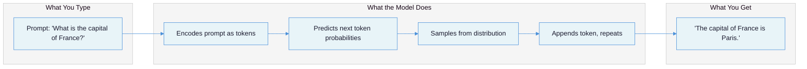
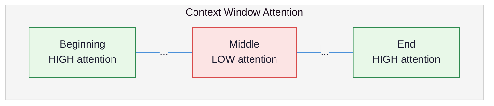
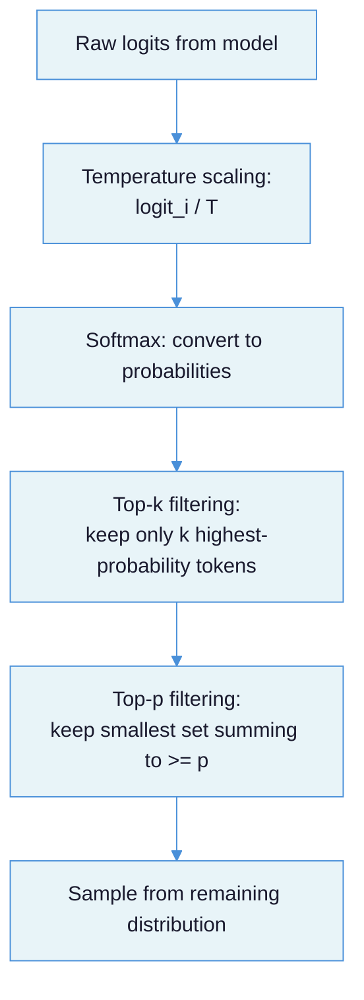
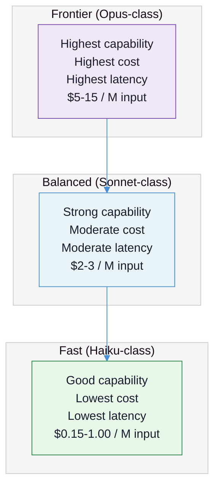

# LLM Fundamentals for Practitioners: The Mental Model You Actually Need

You have programmed before but never called an LLM API. This document gives you the working mental model -- what tokens are, why context windows constrain everything, how next-token prediction explains both the magic and the failures, and how to make your first API calls. It is opinionated, concrete, and focused on the things practitioners get wrong.

---

## The Core Tension

Large language models are the most capable text-processing tools ever built, and they are also the most misunderstood. The tension is this: **LLMs look like databases you can query in English, but they are actually statistical text-completion engines that have no concept of truth.** Every production failure -- hallucinated facts, blown budgets, inconsistent outputs, context overflow -- traces back to this misunderstanding.

The gap between what LLMs appear to do (answer questions) and what they actually do (predict the next token) is the source of nearly every mistake practitioners make.

| What practitioners assume | What actually happens |
|---|---|
| "The model knows the answer" | The model predicts plausible next tokens based on training patterns |
| "Bigger model = better results" | A fine-tuned small model often beats a general-purpose large one for specific tasks |
| "Temperature 0 = deterministic" | Floating-point arithmetic, GPU parallelism, and dynamic batching introduce variance |
| "200K context window = I can use 200K tokens" | Information in the middle of the context is attended to poorly ([Lost in the Middle, Stanford/UC Berkeley](https://dev.to/llmware/why-long-context-windows-for-llms-can-be-deceptive-lost-in-the-middle-problem-oj2/)) |
| "I am paying for intelligence" | You are paying per token -- output tokens cost 3-5x more than input tokens |
| "The model learns from my conversations" | Each API call is stateless; the model is a frozen file that does not update between calls ([Willison](https://simonwillison.net/2024/May/29/training-not-chatting/)) |



Simon Willison offers the best corrective analogy: an LLM is a **["calculator for words"](https://simonwillison.net/2023/Apr/2/calculator-for-words/)**. It is powerful within its domain (manipulating language), but you would not use a calculator to look up phone numbers. When you need facts, paste the source material into the prompt rather than hoping the model "knows" it.

---

## How Next-Token Prediction Works

Understanding this mechanism is not academic -- it directly explains hallucination, temperature, and why prompts work the way they do.

### The mechanism

An LLM is trained on one task: given a sequence of tokens, predict the next one. During training, the model (1) sees a sequence of tokens, (2) guesses the next token, (3) compares its guess against the actual next token, and (4) adjusts its billions of parameters to be slightly more accurate. This cycle repeats trillions of times across the internet's text ([Georgetown CSET](https://cset.georgetown.edu/article/the-surprising-power-of-next-word-prediction-large-language-models-explained-part-1/)).

At inference time, the model generates text one token at a time. It takes your entire prompt, predicts the most likely next token, appends that token to the sequence, and repeats. The "conversation" you see is the model completing a text document, not answering questions.

### Why this explains hallucination

The model does not retrieve information -- it generates statistically plausible continuations. If the training data contained thousands of examples where "The inventor of the telephone was" was followed by "Alexander Graham Bell," the model will produce that continuation reliably. But ask about an obscure topic, and the model will still produce a confident, grammatically fluent answer. It cannot say "I don't know" naturally because "I don't know" is rarely the next token in its training data after a question.

Hallucination is not a bug in the traditional sense. It is the expected behavior of a system optimized for plausibility rather than truth.

### Why this explains emergent capabilities

An [OpenAI experiment from 2017](https://cset.georgetown.edu/article/the-surprising-power-of-next-word-prediction-large-language-models-explained-part-1/) trained a model solely on predicting the next character in Amazon reviews. The model incidentally learned sentiment analysis without ever being trained on that task. Next-token prediction forces the model to build internal representations of grammar, semantics, and even world knowledge -- not because it was told to, but because these representations improve prediction accuracy.

As [Daniel Miessler frames it](https://danielmiessler.com/blog/world-model-next-token-prediction-answer-prediction): "If a system understands the world well enough to accurately predict the next part of an answer, it effectively possesses the answer itself."

---

## What Is a Token

A **token** is the fundamental unit of LLM input and output. It is not a word, not a character, and not a byte -- it is a subword unit produced by a tokenizer. Tokens determine two things that constrain every LLM application: **how much you can say** (context window) and **how much you pay** (cost).

### How tokenization works

Modern LLMs use **Byte Pair Encoding (BPE)**. The algorithm is straightforward ([Raschka](https://sebastianraschka.com/blog/2025/bpe-from-scratch.html)):

1. Start with individual bytes as the initial vocabulary (256 entries)
2. Scan the training corpus for the most frequent adjacent pair
3. Merge that pair into a single new token
4. Repeat until the target vocabulary size is reached

The result: common words become single tokens ("the", "and"), common subwords become tokens ("ing", "tion"), and rare words get split into multiple tokens. The vocabulary sizes of major tokenizers reflect this:

| Tokenizer | Vocabulary Size | Used By |
|---|---|---|
| GPT-2 (r50k_base) | 50,257 | GPT-2, early GPT-3 |
| GPT-4 (cl100k_base) | 100,256 | GPT-4, GPT-4 Turbo |
| GPT-4o (o200k_base) | 199,997 | GPT-4o, o-series |
| Claude | ~100K (proprietary) | Claude models |

### Practical token math

**English prose:** ~1.3 tokens per word, or ~0.75 words per token. A 4,000-word document is roughly 5,200 tokens.

**Code:** 1.5-2x more tokens per "unit of meaning" than prose, because whitespace, indentation, and syntax characters each consume tokens. GPT-2's tokenizer encoded Python's FizzBuzz in 149 tokens; GPT-4's tokenizer does it in 77 tokens because it groups whitespace sequences ([ChristopherGS](https://christophergs.com/blog/understanding-llm-tokenization)).

**Structured data:** Format choice matters. The same data in YAML tokenizes to ~29 tokens versus ~46 tokens in JSON -- [58% more for JSON](https://christophergs.com/blog/understanding-llm-tokenization). When operating near context limits or optimizing cost, format is not cosmetic.

### Why tokens determine cost

Every API call is billed per token, separately for input and output. Output tokens cost 3-5x more than input tokens across all providers. This asymmetry is the single biggest pricing surprise for teams building their first LLM application.

A system that sends 2,000 input tokens and receives 500 output tokens on Claude Sonnet 4.6:

```
Input:  2,000 tokens * ($3.00 / 1,000,000) = $0.006
Output:   500 tokens * ($15.00 / 1,000,000) = $0.0075
Total per call: $0.0135
At 100,000 calls/day: $1,350/day = ~$40,000/month
```

That output cost -- despite being one-quarter the token count -- exceeds the input cost. Teams that estimate costs based on input pricing alone can be off by 2-4x.

---

## The Context Window

The **context window** is the total number of tokens the model can process in a single API call -- your input plus the model's output. It is the single most important constraint in system design because it determines how much information the model can reason about simultaneously.

### Current context window sizes (March 2026)

| Provider | Model | Max Input | Max Output |
|---|---|---|---|
| Anthropic | Claude Haiku 4.5 | 200K | 64K |
| Anthropic | Claude Sonnet 4.6 | 1M | 64K |
| Anthropic | Claude Opus 4.6 | 1M | 128K |
| OpenAI | GPT-4o | 128K | 16K |
| OpenAI | o3 | 200K | 100K |
| Google | Gemini 2.5 Pro | 1M | 64K |
| Google | Gemini 2.5 Flash | 1M | 64K |

Sources: [Anthropic](https://platform.claude.com/docs/en/about-claude/models/overview), [OpenAI](https://github.com/taylorwilsdon/llm-context-limits), [Google](https://firebase.google.com/docs/ai-logic/models)

### Why "bigger context window" does not mean "better"

Research from Stanford and UC Berkeley demonstrated the **Lost in the Middle** problem: LLMs show a U-shaped accuracy curve where they attend well to information at the beginning and end of the context window, but [performance degrades by more than 30% for information placed in the middle](https://dev.to/llmware/why-long-context-windows-for-llms-can-be-deceptive-lost-in-the-middle-problem-oj2/).

The root cause is **Rotary Position Embedding (RoPE)**, used in most modern LLMs, which introduces a long-term decay effect that biases attention toward the start and end of sequences.

The practical implication: a 1M-token context window does not mean you should dump 1M tokens of documents into every call. In testing, approximately two-thirds of models -- including GPT-4 Turbo, Claude 2.0, and Gemini -- failed to find a target sentence placed in the middle of just 2,000 tokens. A 1.1B parameter model with RAG (retrieval-augmented generation) successfully found information that GPT-4 Turbo missed with raw context.

**Rule of thumb:** Position the most important information at the beginning and end of your context. Use retrieval to select relevant chunks rather than stuffing entire documents.



---

## Failure Taxonomy: What Practitioners Get Wrong

These are the recurring mistakes that burn teams building their first LLM applications. Understanding them before you start saves weeks of debugging.

### Failure 1: Treating the model as a database

**What it looks like:** Asking the model factual questions and trusting the answers without verification.

**Why it happens:** LLMs produce confident, well-formatted answers that feel authoritative. The conversational interface creates the illusion of a knowledgeable interlocutor.

**Example:** You ask Claude for the current API rate limits of a third-party service. It responds with specific numbers -- and they are from 18 months ago, or fabricated entirely. You build your rate-limiting logic around these numbers. Production breaks.

**The fix:** When you need facts, paste the source material into the prompt. Use RAG for dynamic knowledge. Never trust an LLM's "memory" for anything that changes.

### Failure 2: Ignoring context window limits until they hit

**What it looks like:** Building a chat application, watching conversations grow, then discovering the application crashes or produces garbage once the conversation exceeds the context window.

**Why it happens:** Context windows feel enormous in early testing. A 128K context window is ~96,000 words -- roughly a novel. But multi-turn conversations, system prompts, RAG context, and tool-use overhead consume tokens faster than you expect.

**Example:** A customer support bot with a 4,000-token system prompt, 2,000 tokens of RAG context per turn, and 500-token average responses hits the GPT-4o 128K limit after roughly 60 turns in a conversation. That sounds like a lot -- until a customer has a complex issue that requires back-and-forth debugging.

### Failure 3: Confusing model size with task capability

**What it looks like:** Defaulting to GPT-4o or Claude Opus for every task, including classification, extraction, and formatting.

**Why it happens:** "Use the best model" feels safe. Testing with the frontier model first is reasonable during exploration. The failure is never testing whether a cheaper model works just as well.

**Example:** A document classification pipeline running Claude Opus at $5.00/M input tokens when Claude Haiku at $1.00/M achieves identical accuracy on that task. At 10M documents/month, that is $40,000/month wasted. As [Huyench Chip documents](https://huyenchip.com/2023/04/11/llm-engineering.html), a fine-tuned 7B parameter model trained on outputs from a larger model can match the teacher for under $600 total.

### Failure 4: Believing temperature=0 is deterministic

**What it looks like:** Setting `temperature=0` and assuming identical prompts produce identical outputs. Building caching, deduplication, or regression tests on this assumption.

**Why it happens:** Temperature=0 means greedy decoding -- always select the highest-probability token. Logically, this should be deterministic. It is not.

**Root causes** ([Brenndoerfer](https://mbrenndoerfer.com/writing/why-llms-are-not-deterministic)):
- **Floating-point non-associativity:** `(a + b) + c != a + (b + c)` with finite-precision floats. Rounding errors cascade through billions of parameters.
- **GPU parallelism:** Matrix multiplications are partitioned across thousands of GPU cores. The order of floating-point accumulation varies between runs.
- **Dynamic batching:** Inference servers batch requests dynamically. Your prompt produces different numerical results depending on what other requests are being processed simultaneously.
- **Mixture-of-Experts routing:** In MoE architectures (used by many frontier models), tokens compete for expert capacity within a batch. Different batch compositions route tokens to different experts.
- **Hardware heterogeneity:** Your request might hit different GPU models across runs. Different hardware produces subtly different numerical results.

Send the same prompt 1,000 times at temperature=0 and you will get dozens of distinct responses.

### Failure 5: Ignoring the output token cost multiplier

**What it looks like:** Estimating costs based on input token pricing, then getting a bill 3-4x higher than expected.

**Why it happens:** Pricing pages show input and output costs, but practitioners anchor on the input price and estimate total cost from there.

**Example:** Claude Sonnet 4.6 costs $3.00/M input but $15.00/M output -- a 5x multiplier. A summarization pipeline that ingests 10,000 tokens and generates 2,000 tokens of summary pays $0.03 for input and $0.03 for output. The output is 20% of the token volume but 50% of the cost.

### Failure 6: Trusting LLM-generated code without review

**What it looks like:** Copying model-generated code into production, especially for edge cases, concurrency, or database queries.

**Why it happens:** LLM-generated code compiles. It runs. On the happy path with clean inputs, it produces output that looks correct. As [Glen Rhodes writes](https://glenrhodes.com/llms-write-plausible-code-not-correct-code-and-what-that-distinction-means-for-engineers-in-production/): "LLMs write *plausible* code, not *correct* code." The code was not reasoned about against your specific schema, concurrency model, or edge cases.

---

## The Sampling Parameters: Temperature, Top-p, Top-k

These parameters control the randomness of token selection. Getting them wrong produces either robotic repetition or incoherent rambling.

### How sampling works

After the model computes probabilities for every token in its vocabulary, the sampling strategy determines which token gets selected:



**Temperature** scales the logits before softmax. Mathematically: `P(token_i) = exp(logit_i / T) / sum(exp(logit_j / T))`. Lower T sharpens the distribution (high-probability tokens dominate). Higher T flattens it (more uniform, more "creative").

**Top-k** keeps only the k highest-probability tokens and discards the rest. Top-k=1 is greedy decoding.

**Top-p (nucleus sampling)** keeps the smallest set of tokens whose cumulative probability exceeds p. At top_p=0.9, tokens are ranked by probability and included until their cumulative probability reaches 0.9. This adapts dynamically: confident predictions narrow the candidate pool, uncertain predictions widen it.

### Practical settings

| Use case | Temperature | Top-p | Why |
|---|---|---|---|
| Code generation | 0.0-0.2 | 0.95 | Minimize creative deviation from correct syntax |
| Factual Q&A | 0.0-0.3 | 0.90 | Favor high-confidence completions |
| General conversation | 0.5-0.7 | 0.95 | Balance coherence with naturalness |
| Creative writing | 0.8-1.0 | 0.95-1.0 | Allow unexpected word choices |
| Brainstorming | 1.0-1.2 | 1.0 | Maximize diversity of outputs |

Most providers recommend setting either temperature or top-p, not both. If you use both, they interact in sequence: temperature first, then top-p filtering on the temperature-adjusted distribution.

---

## Anatomy of an API Call

Every LLM API uses the same fundamental structure: you send a sequence of messages and receive a completion. The differences between providers are cosmetic.

### The message structure

All providers use a role-based message format:

- **System message:** Instructions that frame the model's behavior. "You are a helpful assistant that responds in JSON." This persists across the conversation and sets constraints.
- **User message:** The human's input. Questions, instructions, documents to process.
- **Assistant message:** The model's previous responses. Included in multi-turn conversations so the model has context of what it already said.

### Your first API call: Anthropic (Claude)

```python
from anthropic import Anthropic

client = Anthropic()  # Uses ANTHROPIC_API_KEY env var

message = client.messages.create(
    model="claude-sonnet-4-6",
    max_tokens=1024,
    system="You are a senior software engineer. Respond concisely.",
    messages=[
        {"role": "user", "content": "What is the difference between a mutex and a semaphore?"}
    ]
)

print(message.content[0].text)
# Also available:
# message.usage.input_tokens  -> how many tokens your prompt used
# message.usage.output_tokens -> how many tokens the response used
```

Install: `pip install anthropic`

### Your first API call: OpenAI

```python
from openai import OpenAI

client = OpenAI()  # Uses OPENAI_API_KEY env var

response = client.chat.completions.create(
    model="gpt-4o",
    messages=[
        {"role": "system", "content": "You are a senior software engineer. Respond concisely."},
        {"role": "user", "content": "What is the difference between a mutex and a semaphore?"}
    ],
    max_tokens=1024
)

print(response.choices[0].message.content)
# response.usage.prompt_tokens
# response.usage.completion_tokens
```

Install: `pip install openai`

### Your first API call: Google (Gemini)

```python
from google import genai

client = genai.Client()  # Uses GOOGLE_API_KEY env var

response = client.models.generate_content(
    model="gemini-2.5-flash",
    contents="What is the difference between a mutex and a semaphore?",
    config={
        "system_instruction": "You are a senior software engineer. Respond concisely.",
        "max_output_tokens": 1024
    }
)

print(response.text)
# response.usage_metadata.prompt_token_count
# response.usage_metadata.candidates_token_count
```

Install: `pip install google-genai`

### Streaming

For user-facing applications, streaming delivers tokens as they are generated rather than waiting for the complete response. Every provider supports it:

```python
# Anthropic streaming
with client.messages.stream(
    model="claude-sonnet-4-6",
    max_tokens=1024,
    messages=[{"role": "user", "content": "Explain quicksort."}]
) as stream:
    for text in stream.text_stream:
        print(text, end="", flush=True)
```

```python
# OpenAI streaming
stream = client.chat.completions.create(
    model="gpt-4o",
    messages=[{"role": "user", "content": "Explain quicksort."}],
    stream=True
)
for chunk in stream:
    if chunk.choices[0].delta.content:
        print(chunk.choices[0].delta.content, end="", flush=True)
```

Streaming does not change cost or output quality. It changes perceived latency -- users see the first token in milliseconds instead of waiting seconds for the full response.

### Multi-turn conversations

The API is stateless. Every call must include the full conversation history:

```python
conversation = [
    {"role": "user", "content": "I have a Python list of 10 million integers. How should I sort it?"},
]

# First call
response = client.messages.create(
    model="claude-sonnet-4-6", max_tokens=1024, messages=conversation
)
assistant_reply = response.content[0].text

# Add assistant's response to history
conversation.append({"role": "assistant", "content": assistant_reply})

# User's follow-up
conversation.append({"role": "user", "content": "What if the integers are mostly sorted already?"})

# Second call -- includes full history
response = client.messages.create(
    model="claude-sonnet-4-6", max_tokens=1024, messages=conversation
)
```

Every message in the conversation consumes tokens on every subsequent call. A 20-turn conversation re-sends all 20 turns on the 21st call. This is why context window management matters.

---

## Choosing a Model Tier

Models come in three tiers, differentiated by capability, latency, and cost. The tiers are consistent across providers:

### The three tiers



| Tier | Anthropic | OpenAI | Google | Input $/M | Best for |
|---|---|---|---|---|---|
| Frontier | Claude Opus 4.6 | o1 / o3 | Gemini 2.5 Pro | $2-15 | Complex reasoning, multi-step analysis, novel problems |
| Balanced | Claude Sonnet 4.6 | GPT-4o | Gemini 2.5 Pro | $1.25-3 | Most production tasks: summarization, coding, Q&A |
| Fast | Claude Haiku 4.5 | GPT-4o-mini | Gemini 2.5 Flash | $0.15-1 | Classification, extraction, formatting, high-volume |

### How to choose

**Start with the cheapest tier that could work, not the most expensive.** Test on a representative sample of your actual inputs, measure output quality with a rubric, and escalate only if the quality gap justifies the cost difference.

| Task type | Start here | Escalate if |
|---|---|---|
| Classification (sentiment, category, intent) | Haiku-class | Accuracy below threshold on ambiguous cases |
| Data extraction (names, dates, entities) | Haiku-class | Complex nested structures fail to parse |
| Summarization | Sonnet-class | Summaries miss nuance or key details |
| Code generation | Sonnet-class | Complex algorithms or unfamiliar languages fail |
| Multi-step reasoning | Sonnet-class | Chain-of-thought produces logical errors |
| Research synthesis, novel analysis | Opus-class | This is the starting tier for open-ended reasoning |

### Cost comparison at scale

Processing 1 million documents of ~2,000 input tokens each, generating ~500 output tokens per document:

| Tier | Model | Input Cost | Output Cost | Total |
|---|---|---|---|---|
| Fast | Claude Haiku 4.5 | $2.00 | $2.50 | **$4.50** |
| Balanced | Claude Sonnet 4.6 | $6.00 | $7.50 | **$13.50** |
| Frontier | Claude Opus 4.6 | $10.00 | $12.50 | **$22.50** |

The frontier tier costs 5x the fast tier. If Haiku produces 95% accuracy on your classification task and Opus produces 97%, that 2% improvement costs an additional $18,000 per million documents. Sometimes that is worth it. Usually it is not.

---

## Provider Comparison: Anthropic, OpenAI, Google

### Pricing (per million tokens, March 2026)

| Model | Input | Output | Context |
|---|---|---|---|
| **Anthropic** | | | |
| Claude Haiku 4.5 | $1.00 | $5.00 | 200K |
| Claude Sonnet 4.6 | $3.00 | $15.00 | 1M |
| Claude Opus 4.6 | $5.00 | $25.00 | 1M |
| **OpenAI** | | | |
| GPT-4o-mini | $0.15 | $0.60 | 128K |
| GPT-4o | $2.50 | $10.00 | 128K |
| o3 | $2.00 | $8.00 | 200K |
| **Google** | | | |
| Gemini 2.5 Flash | $0.30 | $2.50 | 1M |
| Gemini 2.5 Pro | $1.25 | $10.00 | 1M |

Sources: [Anthropic pricing](https://platform.claude.com/docs/en/about-claude/pricing), [OpenAI pricing](https://pricepertoken.com/pricing-page/provider/openai), [Google pricing](https://ai.google.dev/gemini-api/docs/pricing)

### Practical differences

**Anthropic (Claude):**
- Largest output windows (128K on Opus) -- critical for long-form generation
- Prompt caching saves up to 90% on repeated context (cached reads at 0.1x input price)
- Messages API only -- no legacy completions endpoint to confuse you
- Python SDK: `pip install anthropic` (v0.86.0, Python 3.9+)

**OpenAI:**
- Largest ecosystem: most tutorials, integrations, and third-party tooling
- Dedicated reasoning models (o-series) for math and logic tasks
- Two API paradigms: Chat Completions (stable) and newer Responses API
- Python SDK: `pip install openai` (v2.29.0, Python 3.9+)

**Google (Gemini):**
- Free tier available with rate limits -- lowest barrier to experimentation
- Native multimodal (text, image, video, audio in a single call)
- Largest context windows (1M) at the lowest price point
- Python SDK: `pip install google-genai` (v1.68.0, Python 3.10+)
- Note: the old `google-generativeai` package is deprecated; use `google-genai`

### Which to start with

If you are building your first LLM application and want the smoothest onboarding: **start with whichever provider has the best documentation for your use case.** The APIs are similar enough that switching later is a one-day refactor. Do not over-invest in a provider decision before you understand your workload.

For cost-sensitive exploration, Google's free tier is unbeatable. For the widest ecosystem of examples and tooling, OpenAI. For the largest context windows and output limits at scale, Anthropic or Google.

---

## Recommendations

### Short-term: your first week

1. **Call all three providers.** Run the same prompt through Claude, GPT-4o, and Gemini. Compare output quality, latency, and cost. This takes 30 minutes and prevents vendor lock-in.
2. **Log every API call.** Record input tokens, output tokens, model, latency, and cost from day one. You cannot optimize what you do not measure.
3. **Set max_tokens explicitly.** Never rely on the default. A runaway generation can produce 128K output tokens ($3.20 on Opus) from a single malformed prompt.

### Medium-term: your first month

4. **Implement model routing.** Use Haiku-class for simple tasks, Sonnet-class for complex ones. A single routing decision -- "is this task simple or complex?" -- can cut costs by 50-70%.
5. **Use prompt caching.** If your system prompt or RAG context is repeated across calls, Anthropic's prompt caching reduces those costs by 90%.
6. **Build evaluation before building features.** You need a way to measure output quality before you can improve it. Even 50 hand-labeled examples with a scoring rubric is enough to start.

### Long-term: production

7. **Implement context window management.** Summarize or truncate conversation history before it hits limits. Position critical information at the start and end of context.
8. **Use batch APIs for offline workloads.** Anthropic and OpenAI offer 50% discounts on batch requests. Any workload that does not need real-time responses should use batch.
9. **Never cache on the assumption of determinism.** If you cache LLM responses, cache on the full prompt hash, but understand that regenerating the same prompt will produce different output.

---

## The Hard Truth

LLMs are not intelligent. They are not databases. They are not search engines. They are statistical text-completion engines that happen to be extraordinarily good at producing human-like language. Every abstraction layered on top -- "the model thinks," "the model knows," "the model understands" -- is a metaphor that will mislead you in production.

The practitioners who build reliable LLM systems are the ones who internalize the mechanism: **next-token prediction on a frozen model, constrained by a finite context window, billed per token, with no guarantee of determinism or factual accuracy.** Every architectural decision -- when to use RAG, how to manage context, which model tier to select, whether to cache -- flows from this understanding.

Most teams fail not because LLMs are not capable enough, but because they build on assumptions that do not hold: that the model's knowledge is current, that bigger is always better, that determinism is a setting you can toggle, that context windows are just a number to stay under. Strip away those assumptions and you have a tool that is genuinely powerful -- a calculator for words, used by someone who understands what calculations to run.

---

## Summary Checklist

| Question | Good Answer | Bad Answer |
|---|---|---|
| Can you explain what a token is and why it matters? | A subword unit produced by BPE that determines cost and context limits | "It's like a word" |
| How do you handle the context window filling up? | Summarize history, use RAG, position critical info at start/end | "I use a model with a bigger context window" |
| What model tier do you start with? | The cheapest tier that could work, then escalate based on measured quality gaps | "Always use the best model" |
| How do you estimate LLM costs? | Input tokens * input price + output tokens * output price, noting output is 3-5x more expensive | "Multiply total tokens by the input price" |
| Is temperature=0 deterministic? | No -- floating-point arithmetic, GPU parallelism, and dynamic batching introduce variance | "Yes, greedy decoding always picks the same token" |
| How do you ensure factual accuracy? | Paste source material into the prompt or use RAG; never trust the model's "memory" | "The model knows the answer" |
| Where do you put the most important context? | At the beginning and end of the context window | "Anywhere -- the model reads the whole thing equally" |
| How do you test LLM output quality? | Evaluation dataset with scoring rubric, measured before and after changes | "I try a few prompts and see if it looks right" |
| When do you use streaming? | User-facing applications where perceived latency matters | "Always" or "Never" |
| What is your first step with a new LLM task? | Call multiple providers with the same prompt, measure quality and cost | "Pick a provider and start building" |

---

## What to Read Next

This document covers the machine. The next step is learning to use it effectively. Read [AI-Native Solution Patterns](ai-native-solution-patterns.md) to understand the architectural patterns for LLM applications -- from single API calls to multi-agent systems -- and how to choose the simplest pattern that solves your problem.

---

## References

### Practitioner Articles

- [Simon Willison, "Think of language models like a calculator for words"](https://simonwillison.net/2023/Apr/2/calculator-for-words/) -- The best practitioner analogy for what LLMs are and are not
- [Simon Willison, "Training is not the same as chatting"](https://simonwillison.net/2024/May/29/training-not-chatting/) -- Why each API call is stateless and the model does not learn from conversations
- [Simon Willison, "When ChatGPT lies"](https://simonwillison.net/2023/Apr/7/chatgpt-lies/) -- Why "lies" communicates risk more effectively than "hallucinate"
- [Huyench Chip, "Building LLM applications for production"](https://huyenchip.com/2023/04/11/llm-engineering.html) -- Cost pitfalls, fine-tuning vs prompting crossover, prompt engineering in production
- [Glen Rhodes, "LLMs write plausible code, not correct code"](https://glenrhodes.com/llms-write-plausible-code-not-correct-code-and-what-that-distinction-means-for-engineers-in-production/) -- The distinction between code that compiles and code that works
- [Daniel Miessler, "World model + next token prediction = answer prediction"](https://danielmiessler.com/blog/world-model-next-token-prediction-answer-prediction) -- Why next-token prediction is not a limitation
- [Latent Space, "Adversarial reasoning"](https://www.latent.space/p/adversarial-reasoning) -- Why LLMs have word models, not world models

### Technical References

- [Michael Brenndoerfer, "Why LLMs are not deterministic"](https://mbrenndoerfer.com/writing/why-llms-are-not-deterministic) -- Full technical breakdown of why temperature=0 produces different outputs
- [Sebastian Raschka, "BPE from scratch"](https://sebastianraschka.com/blog/2025/bpe-from-scratch.html) -- BPE algorithm walkthrough with vocabulary size comparisons
- [ChristopherGS, "Understanding LLM tokenization"](https://christophergs.com/blog/understanding-llm-tokenization) -- Code vs prose tokenization, format-dependent token counts
- [Georgetown CSET, "The surprising power of next word prediction"](https://cset.georgetown.edu/article/the-surprising-power-of-next-word-prediction-large-language-models-explained-part-1/) -- Pedagogical explanation of next-token prediction and transfer learning
- [LLMWare, "Lost in the Middle problem"](https://dev.to/llmware/why-long-context-windows-for-llms-can-be-deceptive-lost-in-the-middle-problem-oj2/) -- Stanford/UC Berkeley research on context window attention patterns

### Official Documentation

- [Anthropic model overview and pricing](https://platform.claude.com/docs/en/about-claude/models/overview) -- Current Claude models, context windows, and per-token pricing
- [Anthropic context windows](https://platform.claude.com/docs/en/build-with-claude/context-windows) -- Context window behavior and extended context beta
- [Anthropic Python SDK](https://platform.claude.com/docs/en/api/sdks/python) -- SDK installation, authentication, and usage examples
- [OpenAI pricing](https://pricepertoken.com/pricing-page/provider/openai) -- Current per-token pricing for all OpenAI models
- [OpenAI context limits](https://github.com/taylorwilsdon/llm-context-limits) -- Context window and max output sizes for OpenAI models
- [Google Gemini pricing](https://ai.google.dev/gemini-api/docs/pricing) -- Gemini pricing with tiered context-length pricing
- [Google Gemini models](https://firebase.google.com/docs/ai-logic/models) -- Gemini model IDs and token limits
