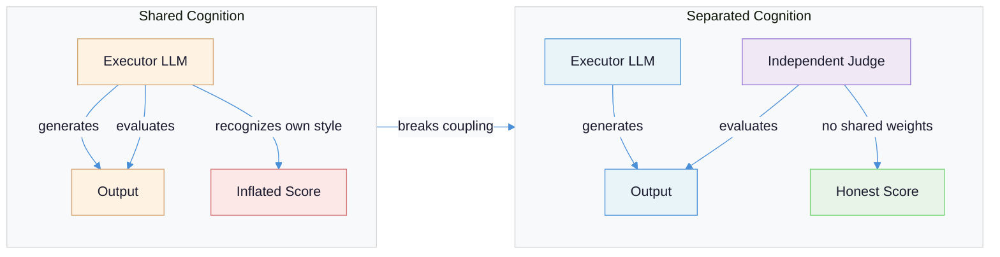
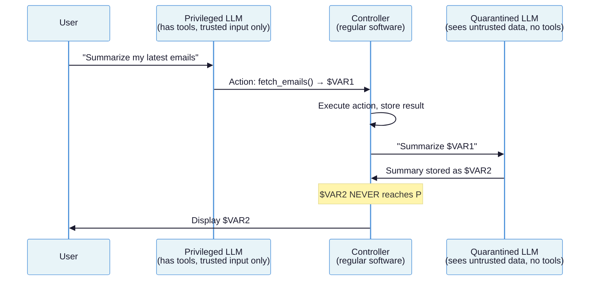

# LLM Role Separation: Why the Same Model Cannot Be Both Worker and Judge

When the system that produces an answer also grades it, every evaluation is a performance review written by the employee about themselves.

---

## The Problem: Shared Cognition Corrupts Judgment

There is a structural flaw at the center of most LLM evaluation pipelines. The same model -- or the same model family -- that generates output is also asked to judge its quality. This is not merely a convenience shortcut. It is a category error that corrupts the measurement instrument with the biases of the thing being measured.

The evidence is not subtle:

| Bias | Magnitude | Source |
|------|-----------|--------|
| **Self-preference** | GPT-4 prefers its own outputs in 87.8% of cases vs. 47.6% for human evaluators -- a 40-point gap | [Panickssery et al., NeurIPS 2024](https://arxiv.org/abs/2404.13076) |
| **Position bias** | Swapping response order changes Vicuna-13B's win rate from 2.5% to 82.5% -- an 80 percentage point swing | [Wang et al., 2023](https://arxiv.org/abs/2305.17926) |
| **Verbosity bias** | GPT-3.5 and Claude-v1 preferred longer responses >90% of the time regardless of quality | [Zheng et al., MT-Bench](https://arxiv.org/abs/2306.05685) |
| **Scale collapse** | 0-10 scoring yields the weakest human-LLM alignment (ICC=0.805); a 0-5 scale yields the strongest (ICC=0.853) | [Grading Scale Impact Study, 2026](https://arxiv.org/abs/2601.03444) |

These are not edge cases. Position bias alone means that in 82.5% of pairwise evaluations, [GPT-4 contradicted itself when the same responses were presented in reversed order](https://arxiv.org/abs/2305.17926). Self-preference is not a faint thumb on the scale -- it is a structural distortion that makes same-model evaluation unreliable for any decision that matters.

The mechanism is revealing. Models do not just *happen* to prefer their own output. [They can actively recognize it](https://arxiv.org/abs/2404.13076). GPT-4 identifies its own text with 73.5% accuracy. After fine-tuning on just 500 examples, GPT-3.5 and Llama 2 achieve >90% self-recognition. The correlation between self-recognition capability and self-preference strength is linear: the better a model recognizes its own style, the more it inflates its own scores. The root cause is perplexity -- models assign higher quality scores to text with lower perplexity (more stylistically familiar text), regardless of whether they actually generated it.

This document is about breaking that coupling. Not with theoretical arguments, but with concrete isolation patterns at seven levels of rigor, implemented in the frameworks you are already using.

**Prerequisites:** [Evaluation-Driven Development](evaluation-driven-development.md) covers the measurement infrastructure. This document covers why the evaluator must be structurally independent of the thing it measures.



---

## Failure Taxonomy: Five Ways Shared Evaluation Breaks

### Failure Mode 1: Context Leakage

**What it looks like:** The judge has access to the executor's chain-of-thought, planning traces, or intermediate reasoning -- not just the final output. Scores are high because the judge sees *why* the executor made its choices and finds the reasoning compelling, even when the output itself is poor.

**Why it happens:** In single-call or same-session architectures, the executor's reasoning context leaks into the evaluator's prompt. The judge evaluates the *process* (which sounds reasonable) rather than the *product* (which may be wrong). This is the most common failure mode in agentic systems where the evaluation step runs in the same conversation thread as execution.

**Example:** An agent generates a research summary. The same conversation thread then evaluates it. The judge sees the agent's scratchpad noting "I couldn't find data for Q3, so I extrapolated from Q2." The judge rates the summary highly because the reasoning was transparent -- but the actual summary contains fabricated Q3 numbers.

### Failure Mode 2: Self-Preference Bias Through Shared Weights

**What it looks like:** Evaluation scores are consistently 10-25% higher when the judge shares a model family with the executor, compared to cross-family evaluation.

**Why it happens:** Models trained on similar data with similar architectures develop similar "taste" -- similar notions of what constitutes good text. [GPT-4 rates its own outputs favorably 87.8% of the time](https://arxiv.org/abs/2404.13076) compared to 47.6% for human evaluators. The bias correlates with perplexity: familiar-feeling text (low perplexity) gets higher scores regardless of objective quality. Even using a different model *size* from the same family (e.g., GPT-4o-mini judging GPT-4o output) preserves significant shared bias because the training distributions overlap.

### Failure Mode 3: Scoring Scale Collapse

**What it looks like:** On a 1-10 scale, 95% of scores cluster between 7 and 9. The evaluation becomes a binary "good enough" / "not good enough" signal with no useful gradient for improvement.

**Why it happens:** LLMs have no calibrated internal sense of a numeric scale. Without concrete anchors, models default to the distribution they saw most often in training data -- which skews toward ratings in reviews, grades, and feedback that cluster at the high end. [The Hugging Face LLM-as-a-Judge Cookbook](https://huggingface.co/learn/cookbook/en/llm_judge) demonstrated this directly: a 0-10 float scale produced Pearson correlation of 0.567 with human judgments. Switching to a 1-4 integer scale with explicit rubric descriptions for each level raised that correlation to 0.843 -- a 49% relative improvement. The [Grading Scale Impact Study](https://arxiv.org/abs/2601.03444) confirmed: 0-10 is the *weakest* scale (ICC=0.805), while 0-5 is the *strongest* (ICC=0.853).

### Failure Mode 4: Position and Verbosity Bias

**What it looks like:** In pairwise comparisons, the response listed first (or the longer response) wins regardless of quality. Win rates shift by up to 80 percentage points based on presentation order alone.

**Why it happens:** Position bias is an attention artifact -- [models disproportionately attend to early tokens](https://arxiv.org/abs/2305.17926). Verbosity bias is a proxy heuristic -- length correlates with effort in training data, so models use it as a quality signal. [GPT-4's position consistency is only 65%](https://arxiv.org/abs/2306.05685), meaning it contradicts itself 35% of the time when the same responses are swapped. Claude-v1's consistency drops to 23.8%. For verbosity, GPT-3.5 and Claude-v1 fail 91.3% of the time on adversarial length tests, preferring padded responses over concise correct ones.

### Failure Mode 5: Metric Proxy Collapse

**What it looks like:** The system optimizes for the evaluation metric rather than the actual quality dimension it was supposed to measure. Responses get "better" on the eval while getting worse for users.

**Why it happens:** When the executor learns (through iteration or fine-tuning) what the evaluator rewards, it produces output that maximizes the score rather than the underlying quality. This is Goodhart's Law applied to LLM pipelines. The failure accelerates when executor and evaluator share biases -- the executor discovers that the evaluator rewards verbosity, formality, or hedging, and adjusts accordingly. The result looks like improvement on the dashboard but delivers declining user satisfaction.

---

## The Separation Spectrum: Seven Levels of Isolation

Not all systems need the same degree of separation. The cost of isolation scales with rigor. The right level depends on the consequences of evaluation failure: low-stakes content filtering can tolerate Level 1; high-stakes autonomous agents need Level 5 or above.

```mermaid
%%{init: {'theme': 'base', 'themeVariables': {'primaryColor': '#e8f4f8', 'primaryTextColor': '#1a1a2e', 'primaryBorderColor': '#4a90d9', 'lineColor': '#4a90d9', 'secondaryColor': '#fef3e2', 'tertiaryColor': '#f0e8f4', 'clusterBkg': '#f8f9fa', 'edgeLabelBackground': '#f8f9fa'}}}%%
graph TD
    subgraph Spectrum["Separation Spectrum"]
        L0["Level 0: No Separation<br/>Same call, same context"]
        L1["Level 1: Separate Calls<br/>Same model, fresh context"]
        L2["Level 2: Same Family, Different Model<br/>GPT-4o generates, GPT-4o-mini judges"]
        L3["Level 3: Cross-Family<br/>Claude generates, GPT-4o judges"]
        L4["Level 4: Cross-Family + Structured Rubric<br/>Binary verdicts, per-dimension isolation"]
        L5["Level 5: Deterministic Only<br/>No LLM judge, code-based checks"]
        L6["Level 6: Hybrid Cascade<br/>Deterministic first, LLM fallback"]
    end

    L0 --> L1 --> L2 --> L3 --> L4 --> L5 --> L6

    style L0 fill:#fde8e8,stroke:#d47474
    style L1 fill:#fef3e2,stroke:#d4a574
    style L2 fill:#fef3e2,stroke:#d4a574
    style L3 fill:#e8f4f8,stroke:#4a90d9
    style L4 fill:#e8f4e8,stroke:#74d474
    style L5 fill:#e8f4e8,stroke:#74d474
    style L6 fill:#e8f4e8,stroke:#74d474
```



### Level 0: No Separation

The executor evaluates its own output within the same call. This is "Rate the quality of your response on a scale of 1-10" appended to the generation prompt. Every failure mode applies simultaneously.

```python
# Level 0: The anti-pattern
response = llm.generate("Write a summary of this document: {doc}")
# Same call, same context, same weights
score = llm.generate(f"Rate this summary 1-10: {response}")
```

### Level 1: Separate Calls, Same Model

The evaluation happens in a fresh API call with no shared conversation context. Eliminates context leakage but retains self-preference bias through shared weights.

```python
# Level 1: Fresh context, same model
executor = OpenAI(model="gpt-4o")
response = executor.chat("Write a summary of this document: {doc}")

# New call, no shared context -- but same weights
score = executor.chat(f"Evaluate this summary for accuracy: {response}")
```

### Level 2: Same Family, Different Model

Uses a different model from the same provider. Reduces self-preference somewhat -- smaller models have different perplexity profiles -- but shared training data preserves significant bias overlap.

```python
# Level 2: Different model, same family
executor = OpenAI(model="gpt-4o")
judge = OpenAI(model="gpt-4o-mini")

response = executor.chat("Write a summary of this document: {doc}")
score = judge.chat(f"Evaluate this summary for accuracy: {response}")
```

### Level 3: Cross-Family Separation

The judge comes from a different model family than the executor. Different architectures, different training data, different biases. This is the minimum viable separation for decisions that matter.

```python
# Level 3: Cross-family
executor = Anthropic(model="claude-sonnet-4-20250514")
judge = OpenAI(model="gpt-4o")

response = executor.messages.create(
    messages=[{"role": "user", "content": f"Write a summary: {doc}"}]
)
score = judge.chat.completions.create(
    messages=[{"role": "user", "content": f"Evaluate this summary: {response}"}]
)
```

### Level 4: Cross-Family + Structured Rubric

Cross-family separation plus constrained output: binary verdicts, per-dimension isolation, explicit rubric definitions. This is where [Anthropic's guidance](https://www.anthropic.com/engineering/demystifying-evals-for-ai-agents) on isolated per-dimension judges applies: "create clear, structured rubrics to grade each dimension of a task, and then grade each dimension with an isolated LLM-as-judge rather than using one to grade all dimensions."

```python
# Level 4: Per-dimension isolated judges with structured rubrics
dimensions = {
    "factual_accuracy": {
        "prompt": "Does the summary contain only claims supported by the source?",
        "rubric": {"PASS": "All claims traceable to source", "FAIL": "Any unsupported claim"},
    },
    "completeness": {
        "prompt": "Does the summary cover all key points from the source?",
        "rubric": {"PASS": "All key points present", "FAIL": "Missing key point(s)"},
    },
    "conciseness": {
        "prompt": "Is the summary free of redundancy and filler?",
        "rubric": {"PASS": "No redundant content", "FAIL": "Contains filler or repetition"},
    },
}

judge = OpenAI(model="gpt-4o")
results = {}
for dim, config in dimensions.items():
    # Each dimension gets its own isolated call
    verdict = judge.chat.completions.create(
        messages=[{"role": "user", "content": f"{config['prompt']}\n\nRubric: {config['rubric']}\n\nSummary: {response}\nSource: {doc}\n\nVerdict (PASS/FAIL):"}],
        temperature=0.0,
    )
    results[dim] = verdict
```

### Level 5: Deterministic Checks Only

No LLM judge at all. All evaluation is code-based: regex validation, schema conformance, embedding similarity thresholds, exact-match against golden answers, statistical checks. Eliminates all LLM bias by eliminating the LLM. Only works for dimensions that can be mechanically verified.

```python
# Level 5: Deterministic only
from deepeval.metrics import AnswerRelevancyMetric
import json

def evaluate_deterministic(response, source):
    results = {}
    # JSON schema conformance
    try:
        parsed = json.loads(response)
        results["valid_json"] = True
    except json.JSONDecodeError:
        results["valid_json"] = False

    # Length bounds
    results["length_ok"] = 50 <= len(response.split()) <= 500

    # Embedding similarity to source (cosine threshold)
    similarity = compute_cosine_similarity(embed(response), embed(source))
    results["relevance"] = similarity > 0.75

    # Exact-match on required fields
    results["has_date"] = bool(re.search(r'\d{4}-\d{2}-\d{2}', response))

    return results
```

### Level 6: Hybrid Cascade

The production-grade pattern. Cheap deterministic checks run first and catch the majority of failures. Only responses that pass deterministic gates proceed to an LLM judge for subjective dimensions. This combines the reliability of Level 5 with the flexibility of Level 4, at a fraction of the cost.

```python
# Level 6: Hybrid cascade
def evaluate_cascade(response, source):
    # Stage 1: Deterministic gates (free, instant)
    if not is_valid_json(response):
        return {"pass": False, "reason": "Invalid JSON", "stage": "deterministic"}
    if len(response.split()) > 500:
        return {"pass": False, "reason": "Exceeds length limit", "stage": "deterministic"}
    if compute_cosine_similarity(embed(response), embed(source)) < 0.6:
        return {"pass": False, "reason": "Low relevance", "stage": "deterministic"}

    # Stage 2: Cheap LLM for clear-cut cases
    quick_judge = OpenAI(model="gpt-4o-mini")
    quick_result = quick_judge.chat.completions.create(
        messages=[{"role": "user", "content": f"Is this summary factually accurate? YES/NO\n\nSummary: {response}\nSource: {source}"}],
        temperature=0.0,
    )
    if quick_result.choices[0].message.content.strip() == "YES":
        return {"pass": True, "stage": "quick_llm", "cost": "low"}

    # Stage 3: Expensive LLM for ambiguous cases only
    deep_judge = Anthropic(model="claude-opus-4-20250514")
    # Per-dimension structured evaluation at this level
    # ...
    return {"pass": deep_result, "stage": "deep_llm", "cost": "high"}
```

---

## Implementation Patterns Across Real Frameworks

The separation spectrum is not theoretical. Every major framework provides the machinery to implement it. The problem is that most teams use the defaults -- which means no separation at all.

### Per-Agent Model Assignment: AutoGen and CrewAI

Both frameworks treat model assignment as a per-agent property, making cross-family separation a configuration choice rather than an architectural change.

**AutoGen 0.4** assigns a `model_client` per agent:

```python
from autogen_agentchat.agents import AssistantAgent
from autogen_ext.models.openai import OpenAIChatCompletionClient
from autogen_ext.models.anthropic import AnthropicChatCompletionClient

executor = AssistantAgent(
    name="executor",
    model_client=OpenAIChatCompletionClient(model="gpt-4o"),
    system_message="Generate the requested output.",
)

reviewer = AssistantAgent(
    name="reviewer",
    model_client=AnthropicChatCompletionClient(model="claude-sonnet-4-20250514"),
    system_message="Evaluate the output against the rubric. Return PASS or FAIL with reasoning.",
)
```

**CrewAI** uses an `llm` parameter on each `Agent`:

```python
from crewai import Agent, LLM

writer = Agent(
    role="Content Writer",
    llm=LLM(model="anthropic/claude-sonnet-4-20250514", temperature=0.7),
)

editor = Agent(
    role="Quality Reviewer",
    llm=LLM(model="openai/gpt-4o", temperature=0.0),  # Different family, deterministic
)
```

### Context Manager Model Switching: DSPy

DSPy's `dspy.context()` enables scoped model switching within a pipeline, so different stages use different models without restructuring the code:

```python
import dspy

dspy.configure(lm=dspy.LM('anthropic/claude-sonnet-4-20250514'))
generator = dspy.ChainOfThought('document -> summary')

# Generate with Claude
summary = generator(document=doc)

# Evaluate with GPT-4o -- different model, isolated context
with dspy.context(lm=dspy.LM('openai/gpt-4o')):
    evaluator = dspy.ChainOfThought('summary, document -> verdict: bool')
    result = evaluator(summary=summary.summary, document=doc)
```

### Pluggable Judge Models: DeepEval, RAGAS, and Braintrust

Evaluation frameworks expose a `model` parameter on every metric, making judge model selection explicit.

**DeepEval** -- custom judge via `DeepEvalBaseLLM`:

```python
from deepeval.metrics import AnswerRelevancyMetric
from deepeval.models import DeepEvalBaseLLM

class ClaudeJudge(DeepEvalBaseLLM):
    def generate(self, prompt, schema):
        return self.client.messages.create(
            model="claude-opus-4-20250514", messages=[{"role": "user", "content": prompt}],
            response_model=schema,
        )
    def get_model_name(self):
        return "Claude Opus"

metric = AnswerRelevancyMetric(model=ClaudeJudge())
```

**RAGAS** -- `llm_factory` with discrete metrics:

```python
from ragas.llms import llm_factory

judge_llm = llm_factory("gpt-4o-mini")
accuracy = DiscreteMetric(
    name="accuracy", prompt="Does the response match the reference?",
    allowed_values=["pass", "fail"],
)
results = await experiment.arun(dataset, accuracy_metric=accuracy, llm=judge_llm)
```

**Braintrust** -- `model` and `client` parameters on scorers:

```python
from autoevals.llm import Factuality

# Use Claude as judge instead of default OpenAI
evaluator = Factuality(model="claude-sonnet-4-20250514")
result = evaluator(output=response, expected=reference, input=query)
```

### The Dual LLM Pattern for Security

[Simon Willison's dual LLM architecture](https://simonwillison.net/2023/Apr/25/dual-llm-pattern/) applies role separation to security, not just evaluation. A **Privileged LLM** has tool access but never sees untrusted content. A **Quarantined LLM** processes untrusted content but cannot invoke tools. They communicate through a non-LLM controller using symbolic variables.



The security rule: unfiltered quarantined output must **never** flow back to the privileged LLM. The only safe exception is verifiable categorical output from a fixed set (yes/no, a classification label). This is role separation applied to trust boundaries rather than evaluation quality, but the architectural principle is identical -- shared context between roles creates exploitable coupling.

The [2025 evolution (CaMeL framework)](https://simonwillison.net/2025/Jun/13/prompt-injection-design-patterns/) formalizes this with a sandboxed DSL that tracks data taint through the entire process.

### Per-Dimension Isolated Judges

[Anthropic's engineering guidance](https://www.anthropic.com/engineering/demystifying-evals-for-ai-agents) is explicit: "create clear, structured rubrics to grade each dimension of a task, and then grade each dimension with an isolated LLM-as-judge rather than using one to grade all dimensions." This is not just about using a different model. It is about preventing one evaluation dimension from contaminating another.

A single judge asked to rate "accuracy, completeness, and tone" in one call will let a strong performance on one dimension inflate scores on another. Isolated per-dimension judges each see only the evidence relevant to their dimension.

### Evaluation Cascades for Cost Optimization

Production systems cannot afford to run an expensive LLM judge on every output. [Cascade architectures](https://github.com/lemony-ai/cascadeflow) solve this by routing through models of increasing cost, escalating only when confidence is low:

```python
from cascadeflow import CascadeAgent, ModelConfig

cascade = CascadeAgent(models=[
    ModelConfig(name="gpt-4o-mini", provider="openai", cost=0.000375),   # Handles ~70% of evals
    ModelConfig(name="gpt-4o", provider="openai", cost=0.00625),         # Handles ambiguous cases
])

result = await cascade.run(f"Is this summary accurate? {summary}")
```

The [ETH Zurich routing framework](https://arxiv.org/abs/2410.10347) formalizes this as an optimization problem: `tau_i(x, lambda) = q_hat_i(x) - lambda * c_hat_i(x)`, balancing quality estimates against cost estimates. In practice, if 70% of queries are handled confidently by the cheap model, expensive model usage drops proportionally -- a 60-70% cost reduction on typical workloads.

---

## Principles for Reliable Role Separation

### Principle 1: Use a Different Model Family for Judgment

**Why it works:** Eliminates self-preference bias (Failure Mode 2). Models from different families have different training distributions, different perplexity profiles, and different blind spots. Cross-family evaluation is not bias-free, but it breaks the systematic self-reinforcement that makes same-family evaluation unreliable.

**How to apply:** If your executor is Claude, your judge should be GPT-4o (or vice versa). If your executor is an open-source model, your judge should be a commercial API model. The goal is maximum divergence in training data and architecture. In every framework shown above, this is a one-line configuration change.

### Principle 2: Use Binary or Small-Integer Scales, Never 1-10

**Why it works:** Eliminates scoring scale collapse (Failure Mode 3). The [Hugging Face Cookbook](https://huggingface.co/learn/cookbook/en/llm_judge) demonstrated that switching from a 0-10 float scale to a 1-4 integer scale with explicit rubric descriptions raised Pearson correlation with human judgments from 0.567 to 0.843. [Hamel Husain](https://hamel.dev/blog/posts/llm-judge/) advocates binary pass/fail exclusively, achieving >90% agreement with human experts at Honeycomb within three iterations. The [Arize AI study](https://arize.com/blog/testing-binary-vs-score-llm-evals-on-the-latest-models/) found that numeric scores "drift with prompt wording, model choice, and configuration" while discrete labels "generalize more broadly."

**How to apply:** Replace every 1-10 score with a binary PASS/FAIL or a 1-4 scale with explicit descriptions for each level. If you need more granularity, split into multiple binary dimensions rather than expanding the scale.

### Principle 3: Isolate Each Evaluation Dimension

**Why it works:** Prevents cross-dimension contamination and addresses the "God Evaluator" anti-pattern (see [Evaluation-Driven Development](evaluation-driven-development.md), Failure Mode 2). When a single judge evaluates multiple dimensions simultaneously, a strong score on one dimension bleeds into scores on others.

**How to apply:** Identify the 3-5 quality dimensions that matter for your use case. Build a separate judge call for each dimension. Each call sees only the evidence relevant to its dimension. Aggregate results programmatically, not through a single LLM synthesis.

### Principle 4: Require Chain-of-Thought Before the Verdict

**Why it works:** Forces the judge to articulate evidence before committing to a score, reducing snap judgments driven by stylistic familiarity. The [Hugging Face Cookbook](https://huggingface.co/learn/cookbook/en/llm_judge) showed that adding an "Evaluation" reasoning field before the final rating was one of three changes that collectively raised Pearson correlation from 0.567 to 0.843.

**How to apply:** Structure the judge's output as `{reasoning: "...", verdict: "PASS/FAIL"}`. Parse and log the reasoning for debugging. Set temperature to 0.0 for reproducibility.

### Principle 5: Randomize Position and Control for Length

**Why it works:** Directly mitigates position bias (Failure Mode 4) and verbosity bias. The [Length-Controlled AlpacaEval](https://arxiv.org/abs/2404.04475) demonstrated that length debiasing raised Spearman correlation with Chatbot Arena from 0.94 to 0.98 and reduced gameability from 25% to 10%.

**How to apply:** For pairwise comparisons, evaluate each pair twice with swapped positions and average the results. For pointwise evaluation, include explicit instructions to disregard response length. For systematic debiasing, use regression-based length control as in AlpacaEval-LC.

### Principle 6: Start Deterministic, Add LLM Judges Only Where Needed

**Why it works:** Deterministic checks have zero bias, zero variance, and zero cost per evaluation. They cannot be gamed by prompt manipulation. They fail in known, debuggable ways. LLM judges should be reserved for dimensions that genuinely require subjective assessment -- and there are fewer of those than most teams assume.

**How to apply:** For every evaluation dimension, ask: "Can this be checked with code?" JSON schema conformance, length limits, required field presence, regex patterns, embedding similarity thresholds, exact-match against golden answers -- these all belong in deterministic gates. Only dimensions like "is this response helpful?" or "does the tone match our brand?" require an LLM judge. Build the cascade: deterministic first, cheap LLM second, expensive LLM only for genuinely ambiguous cases.

---

## Recommendations

### Short-Term: Immediate Wins

1. **Audit your current evaluation pipeline.** For every LLM judge call, check: is the judge the same model or model family as the executor? If yes, switch to a cross-family judge. This is typically a one-line change in every framework discussed above.
2. **Replace all 1-10 scores with binary verdicts.** For each metric, define explicit PASS/FAIL criteria. You will lose nothing useful and gain dramatically better signal.
3. **Add position randomization.** For any pairwise comparison, evaluate both orderings and average.

### Medium-Term: Structural Changes

4. **Split multi-dimensional evaluations into isolated per-dimension judges.** Identify which dimensions actually matter through error analysis (see [Evaluation-Driven Development](evaluation-driven-development.md), Principle 1), then build a dedicated judge for each.
5. **Build deterministic gates before LLM judges.** For every evaluation dimension, implement the cheapest reliable check first. JSON validation, length checks, embedding similarity, exact-match -- these should catch 60-80% of failures before an LLM judge is involved.
6. **Implement evaluation cascades.** Route through cheap-to-expensive models, escalating only on low-confidence verdicts.

### Long-Term: Architectural Shifts

7. **Adopt the dual LLM pattern for security-sensitive pipelines.** Separate privileged (tool-access) from quarantined (untrusted-content) roles with a non-LLM controller.
8. **Build evaluation infrastructure as a platform concern.** Judge model selection, rubric management, cascade configuration, and bias monitoring should be centralized rather than scattered across individual pipelines.

---

## The Hard Truth

Most teams that claim to have LLM evaluation actually have LLM self-congratulation. The executor writes the output, a copy of the same model family writes the review, and everyone looks at the dashboard showing 8.5/10 average scores and feels confident.

The uncomfortable reality is that this confidence is manufactured by the biases documented above. Self-preference, position sensitivity, verbosity rewards, and scale collapse do not cancel each other out. They compound. A system evaluated by the same model family that built it will always look better than it is -- and the team will not discover this until users do.

The fix is not expensive. Cross-family judging is a configuration change. Binary verdicts are a prompt change. Deterministic gates are a few dozen lines of code that should have been written anyway. The barrier is not cost or complexity. It is the implicit assumption that asking an LLM to grade itself is a reasonable thing to do. It is not. It never was. The separation of executor and evaluator is not an optimization. It is a prerequisite for measurement.

For the deeper structural argument -- why the executor's context window creates a cognitive trap that makes honest self-evaluation impossible at the architectural level -- see [Quality Gates in Agentic Systems](quality-gates-in-agentic-systems.md). For why evaluator independence is the single most important property for systems that improve over time, see [Self-Improving Systems](self-improving-systems.md).

---

## Summary Checklist

| Question | Good Answer | Bad Answer |
|----------|-------------|------------|
| Is your judge a different model family than your executor? | Yes, always cross-family | Same model or same family |
| What scoring scale do your judges use? | Binary PASS/FAIL or 1-4 with rubrics | 1-10 numeric or 0-100 |
| Do you evaluate multiple dimensions in a single judge call? | No, isolated per-dimension judges | Yes, one call evaluates everything |
| Does the judge see the executor's chain-of-thought? | No, only the final output and the source | Yes, the full conversation history |
| Do you randomize position in pairwise comparisons? | Yes, both orderings averaged | No, fixed order |
| Does your judge output reasoning before the verdict? | Yes, structured CoT then verdict | No, score only |
| Do you have deterministic checks before LLM judges? | Yes, code-based gates first | No, LLM judge for everything |
| Have you calibrated your LLM judge against human experts? | Yes, >90% agreement on a held-out set | No, assumed the LLM is "smart enough" |
| Do you monitor for score drift over time? | Yes, tracked per dimension | No, assumed stable |
| Is your judge model selection a conscious architectural decision? | Yes, documented and justified | No, used the default |

---

## References

### Research Papers

- [Panickssery et al., "LLM Evaluators Recognize and Favor Their Own Generations," NeurIPS 2024](https://arxiv.org/abs/2404.13076) -- Established causal link between self-recognition ability and self-preference bias; GPT-4 self-recognition at 73.5% accuracy
- [Wang et al., "Large Language Models are not Fair Evaluators," 2023](https://arxiv.org/abs/2305.17926) -- Originated the 80 percentage point position bias finding
- [Zheng et al., "Judging LLM-as-a-Judge with MT-Bench and Chatbot Arena," 2023](https://arxiv.org/abs/2306.05685) -- Foundational MT-Bench paper; quantified position bias, verbosity bias across models
- [Kocmi & Federmann, "Navigating the Grading Scale: LLM-as-a-Judge Grading Scale Impact," 2026](https://arxiv.org/abs/2601.03444) -- Found 0-5 scale yields strongest human-LLM alignment (ICC=0.853), 0-10 weakest (ICC=0.805)
- [Dubois et al., "Length-Controlled AlpacaEval," 2024](https://arxiv.org/abs/2404.04475) -- Length debiasing raised Spearman correlation from 0.94 to 0.98
- [Bavaresco et al., "Judging the Judges," ACL 2025](https://arxiv.org/abs/2406.07791) -- 15 LLM judges, 22 tasks, ~150,000 evaluation instances

### Practitioner Articles

- [Hamel Husain, "Creating a LLM-as-a-Judge That Drives Business Results"](https://hamel.dev/blog/posts/llm-judge/) -- Binary pass/fail approach; >90% human agreement at Honeycomb
- [Simon Willison, "The Dual LLM Pattern"](https://simonwillison.net/2023/Apr/25/dual-llm-pattern/) -- Privileged/quarantined architecture for security
- [Simon Willison, "Prompt Injection: Design Patterns" (2025)](https://simonwillison.net/2025/Jun/13/prompt-injection-design-patterns/) -- CaMeL framework evolution of dual LLM
- [Hugging Face, "LLM-as-a-Judge Cookbook"](https://huggingface.co/learn/cookbook/en/llm_judge) -- 1-4 rubric scale raising Pearson correlation from 0.567 to 0.843
- [Arize AI, "Testing Binary vs. Score LLM Evals"](https://arize.com/blog/testing-binary-vs-score-llm-evals-on-the-latest-models/) -- Discrete labels outperform numeric scores across model families
- [Anthropic, "Demystifying Evals for AI Agents"](https://www.anthropic.com/engineering/demystifying-evals-for-ai-agents) -- Per-dimension isolated judges guidance

### Framework Documentation

- [AutoGen 0.4 Model Configuration](https://microsoft.github.io/autogen/stable/user-guide/agentchat-user-guide/tutorial/models.html) -- Per-agent model_client assignment
- [CrewAI LLM Configuration](https://docs.crewai.com/concepts/llms) -- Per-agent LLM parameter
- [DSPy Language Models](https://dspy.ai/learn/programming/language_models/) -- dspy.context() for scoped model switching
- [DeepEval Custom LLMs Guide](https://deepeval.com/guides/guides-using-custom-llms) -- DeepEvalBaseLLM for pluggable judge models
- [RAGAS Model Customization](https://docs.ragas.io/en/stable/howtos/customizations/customize_models/) -- llm_factory for multi-provider judge configuration
- [Braintrust Autoevals](https://www.braintrust.dev/docs/reference/autoevals) -- model= and client= parameters on scorers
- [CascadeFlow](https://github.com/lemony-ai/cascadeflow) -- Evaluation cascade library with confidence-based escalation
- [ETH Zurich, "A Unified Approach to Routing and Cascading for LLMs"](https://arxiv.org/abs/2410.10347) -- Mathematical framework for cascade optimization
