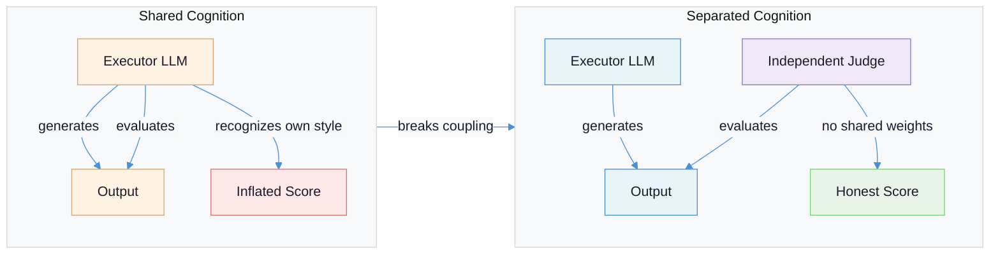
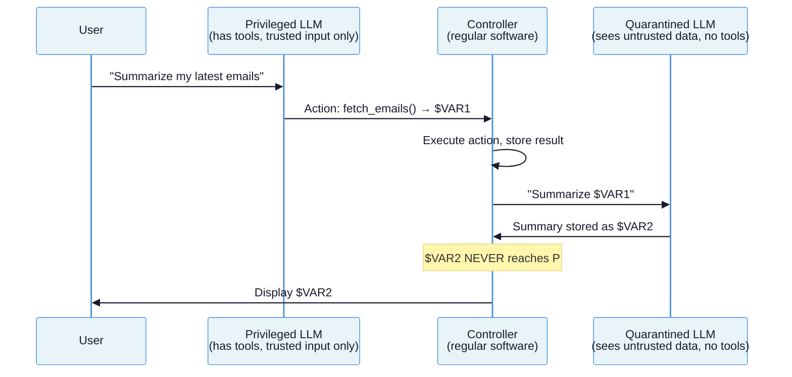

# LLM Role Separation: Why the Same Model Cannot Be Both Worker and Judge

**Thesis:** When the system that produces an answer also grades it, every evaluation is a performance review written by the employee about themselves — and a review that nothing requires to change the work is not a review at all.

**Prerequisites:** [Evaluation-Driven Development](evaluation-driven-development.md) covers the measurement infrastructure. This document covers why the evaluator must be structurally independent of the thing it measures, and how far that independence has to go.

**Reading time:** 24 minutes

| What teams assume | What actually happens |
|---|---|
| "A different model from the same family is independent enough" | GPT-4 rated its own outputs favourably in 87.8% of cases against 47.6% for humans, and the bias tracks self-recognition. [Lu et al. (2026)](https://arxiv.org/abs/2512.02304) measured the general form across 37 models: the benefit of verification shrinks as solver and verifier become more similar |
| "Fresh context removes the bias" | Fresh context removes context leakage. Shared weights keep the self-preference, because the mechanism is perplexity, not memory |
| "The judge found the flaw, so the report is safe" | In 660 of 800 analysed agent runs (82.5%), the agent found its own fatal flaw, wrote it down, and reported the conclusion anyway ([AutoResearchEval, 2026](https://arxiv.org/abs/2608.14905)) |
| "If the judge is accurate, acting on it must help" | A critic with strong offline accuracy (AUROC 0.94) caused a 26-point collapse on one model and near-zero effect on another under the same policy ([Vasudev et al., 2026](https://arxiv.org/abs/2602.03338)) |
| "A judge that agrees with the user is being helpful" | Shown a user's counterargument as a later turn, judges tend to endorse it. Shown both arguments at once, they do not ([Kim & Khashabi, EMNLP 2025](https://arxiv.org/abs/2509.16533)) |
| "We wrote a rule that a reviewer must sign off" | If the party being gated chooses the field that decides whether a review is required, the rule is decorative. The trigger must come from evidence the closer does not control |
| "An accurate judge is an independent judge" | Accuracy and independence are different properties. A judge can be accurate and still be compromised by who wrote the prompt, what it saw first, and whether it will be asked again |


```mermaid
%%{init: {'theme': 'base', 'themeVariables': {'primaryColor': '#e8f4f8', 'primaryTextColor': '#1a1a2e', 'primaryBorderColor': '#4a90d9', 'lineColor': '#4a90d9', 'secondaryColor': '#fef3e2', 'tertiaryColor': '#f0e8f4', 'clusterBkg': '#f8f9fa', 'edgeLabelBackground': '#f8f9fa'}}}%%
graph LR
    subgraph Problem["Shared Cognition"]
        A[Executor LLM] -->|"generates"| B[Output]
        A -->|"evaluates"| B
        A -->|"recognizes own style"| C[Inflated Score]
    end
    subgraph Solution["Separated Cognition"]
        D[Executor LLM] -->|"generates"| E[Output]
        F[Independent Judge] -->|"evaluates"| E
        F -->|"no shared weights"| G[Honest Score]
    end
    Problem -->|"breaks coupling"| Solution

    style A fill:#fef3e2,stroke:#d4a574
    style B fill:#fef3e2,stroke:#d4a574
    style C fill:#fde8e8,stroke:#d47474
    style D fill:#e8f4f8,stroke:#4a90d9
    style E fill:#e8f4f8,stroke:#4a90d9
    style F fill:#f0e8f4,stroke:#9474d4
    style G fill:#e8f4e8,stroke:#74d474
```

---

## The Core Tension

There is a structural flaw at the centre of most LLM evaluation pipelines. The same model — or the same model family — that generates output is also asked to judge its quality. This is not merely a convenience shortcut. It is a category error: it corrupts the measurement instrument with the biases of the thing being measured.

The evidence is not subtle.

| Bias | Magnitude | Source |
|---|---|---|
| **Self-preference** | GPT-4 preferred its own outputs in 87.8% of cases against 47.6% for human evaluators — a 40-point gap | [Panickssery et al., NeurIPS 2024](https://arxiv.org/abs/2404.13076) |
| **Position bias** | Swapping response order changed Vicuna-13B's win rate from 2.5% to 82.5% — an 80-point swing | [Wang et al., 2023](https://arxiv.org/abs/2305.17926) |
| **Verbosity bias** | GPT-3.5 and Claude-v1 preferred longer responses more than 90% of the time regardless of quality | [Zheng et al., MT-Bench](https://arxiv.org/abs/2306.05685) |
| **Scale collapse** | 0-10 scoring gave the weakest human agreement (ICC 0.805); a 0-5 scale gave the strongest (ICC 0.853) | [Grading Scale Impact Study, 2026](https://arxiv.org/abs/2601.03444) |
| **Authority bias** | Confident, formal phrasing earns higher scores than calibrated phrasing, independent of correctness | [Arize AI, 2026](https://www.arize.com/blog/how-to-build-llm-as-a-judge-evaluators-that-hold-up-in-production) |

Self-preference is not a faint thumb on the scale. It is a structural distortion that makes same-model evaluation unreliable for any decision that matters. The mechanism is revealing: models do not merely *happen* to prefer their own output, [they can actively recognise it](https://arxiv.org/abs/2404.13076). GPT-4 identifies its own text with 73.5% accuracy, and after fine-tuning on 500 examples GPT-3.5 and Llama 2 exceed 90% self-recognition. The correlation between self-recognition and self-preference is linear. The root cause is perplexity — models assign higher quality scores to text with lower perplexity, whether or not they generated it.

The 2026 result that matters most is about degree, not direction. [Lu et al.](https://arxiv.org/abs/2512.02304) measured verifier gain across 37 models, 7 families, and 9 benchmarks, and found that cross-family verification beats self-verification and same-family verification, that the benefit decreases as solver and verifier become more similar, and that reasoning post-training *weakens* self-improvement while strengthening cross-family improvement. Independence is not a binary property you either have or lack. It is a distance, and the measurement improves as the distance grows.

The rest of this document is about breaking the coupling — with concrete isolation patterns at seven levels, implemented in frameworks you already use.

---

## Failure Taxonomy

Eight ways shared evaluation breaks. The first five are bias mechanisms. The last three are structural, and they survive perfect bias mitigation.

### Failure Mode 1: Context Leakage

**What it looks like:** The judge sees the executor's chain of thought, planning traces, or intermediate reasoning, not just the final output. Scores are high because the judge finds the reasoning compelling even when the output is poor.

**Why it happens:** In single-call or same-session architectures, the executor's reasoning leaks into the evaluator's prompt. The judge evaluates the *process*, which sounds reasonable, instead of the *product*, which may be wrong. This is the most common failure mode in agentic systems where evaluation runs in the same conversation thread as execution.

**Example:** An agent writes a research summary, and the same thread evaluates it. The judge sees the scratchpad note "I could not find Q3 data, so I extrapolated from Q2" and rates the summary highly because the reasoning was transparent — while the summary itself contains fabricated Q3 numbers.

### Failure Mode 2: Self-Preference Bias Through Shared Weights

**What it looks like:** Scores are consistently 10-25% higher when the judge shares a model family with the executor.

**Why it happens:** Models trained on similar data with similar architectures develop similar taste. The bias correlates with perplexity: familiar-feeling text scores higher regardless of objective quality. Even a different model *size* from the same family preserves significant shared bias, because the training distributions overlap. [Lu et al.](https://arxiv.org/abs/2512.02304) give the general law: the closer the solver and verifier, the smaller the gain from verification.

### Failure Mode 3: Scoring Scale Collapse

**What it looks like:** On a 1-10 scale, 95% of scores cluster between 7 and 9. The evaluation becomes a binary "good enough" signal with no gradient for improvement.

**Why it happens:** LLMs have no calibrated sense of a numeric scale. Without concrete anchors, models reproduce the distribution they saw most often in training data, which clusters at the high end. [The Hugging Face LLM-as-a-Judge Cookbook](https://huggingface.co/learn/cookbook/en/llm_judge) demonstrated this directly: a 0-10 float scale produced a Pearson correlation of 0.567 with human judgements, and a 1-4 integer scale with explicit rubric descriptions raised it to 0.843. The [Grading Scale Impact Study](https://arxiv.org/abs/2601.03444) confirmed the ordering: 0-10 is the weakest scale (ICC 0.805), 0-5 the strongest (ICC 0.853).

### Failure Mode 4: Position and Verbosity Bias

**What it looks like:** In pairwise comparison, the response listed first — or the longer one — wins regardless of quality. Win rates shift by up to 80 points on presentation order alone.

**Why it happens:** Position bias is an attention artefact: [models disproportionately attend to early tokens](https://arxiv.org/abs/2305.17926). Verbosity bias is a proxy heuristic: length correlates with effort in training data, so models read it as a quality signal. [GPT-4's position consistency is only 65%](https://arxiv.org/abs/2306.05685), so it contradicts itself a third of the time when the same responses are swapped. Claude-v1's consistency drops to 23.8%. On adversarial length tests, GPT-3.5 and Claude-v1 preferred padded responses over concise correct ones 91.3% of the time.

[Bavaresco et al.](https://arxiv.org/abs/2406.07791) add an important 2025 refinement across 15 judges, 22 tasks and about 150,000 instances: position bias is not a fixed property of a model. It varies by judge and by task, and it is strongly affected by the quality gap between the two candidates. A near-tie is where the bias bites hardest.

### Failure Mode 5: Metric Proxy Collapse

**What it looks like:** The system optimises for the evaluation metric instead of the quality dimension it was meant to measure. Responses get "better" on the eval and worse for users.

**Why it happens:** When the executor learns, by iteration or fine-tuning, what the evaluator rewards, it produces output that maximises the score. This is Goodhart's law applied to LLM pipelines, and it accelerates when executor and evaluator share biases: the executor discovers that the evaluator rewards verbosity, formality, or hedging, and adjusts. The dashboard improves and user satisfaction declines.

### Failure Mode 6: Rebuttal Sycophancy

**What it looks like:** The judge grades a submission, the submitter objects, and the judge changes its verdict. The objection does not have to be good.

**Why it happens:** The judge is not evaluating the artifact; it is continuing a conversation with a person. [Kim & Khashabi](https://arxiv.org/abs/2509.16533) showed the split precisely: when a user's counterargument is presented as a later turn, models tend to endorse it, and when both arguments are presented simultaneously, the same models evaluate competently. Turn order, not the argument's merit, decides.

**The structural consequence:** isolation must include isolation from the requester's later turns, not only from the executor's weights. A judge reachable by the party it grades is a judge that can be negotiated with. In practice this means the judge receives one immutable payload — the artifact, the rubric, and the evidence — and no follow-up from the author of the artifact.

### Failure Mode 7: The Intervention That Harms

**What it looks like:** A well-calibrated judge flags failures, the system acts on the flags, and end-to-end success goes *down*.

**Why it happens:** [Vasudev et al.](https://arxiv.org/abs/2602.03338) measured a binary critic with strong offline failure-prediction accuracy (AUROC 0.94) that caused a 26-point performance collapse on one model while barely affecting another under the same intervention policy. They name the mechanism the **disruption-recovery tradeoff**: an intervention recovers trajectories that would have failed and disrupts trajectories that would have succeeded. Critic accuracy, measured on its own, cannot see this, because the cost lands on the trajectories that were never going to fail.

**The consequence:** offline judge accuracy is not sufficient evidence that a judge is safe to *act on*. Judge accuracy and judge safety are different properties, and only trajectory-level measurement distinguishes them. A pilot of about 50 tasks forecasts the direction before deployment.

### Failure Mode 8: The Review That Changes Nothing

**What it looks like:** The self-review runs, finds real problems, lists them — and the artifact ships unchanged.

**Why it happens:** Nothing in the system connects the review's verdict to the artifact's release. [AutoResearchEval](https://arxiv.org/abs/2608.14905) found this pattern in 660 of 800 analyses (82.5%), the single most frequent failure in the corpus, and described it exactly: "A self-review is just more text: the same model writes it, in the same run, and nothing in the system requires the review to change the report."

**Why it is the deepest failure mode:** the judgement was correct. The model detected the flaw. The failure is not cognitive but architectural, which is also why it is the most repairable: if the artifact records that its own result is uninterpretable, the system can refuse to release it until either the result or the claim changes. Detection is not a control. A control is what happens to the artifact afterwards.

---

## The Separation Spectrum: Seven Levels of Isolation

Not all systems need the same degree of separation, and the cost scales with rigour. The right level depends on the consequences of an evaluation failure: low-stakes content filtering tolerates Level 1; high-stakes autonomous agents need Level 5 or above.


```mermaid
%%{init: {'theme': 'base', 'themeVariables': {'primaryColor': '#e8f4f8', 'primaryTextColor': '#1a1a2e', 'primaryBorderColor': '#4a90d9', 'lineColor': '#4a90d9', 'secondaryColor': '#fef3e2', 'tertiaryColor': '#f0e8f4', 'clusterBkg': '#f8f9fa', 'edgeLabelBackground': '#f8f9fa'}}}%%
graph TD
    subgraph Spectrum["Separation Spectrum"]
        L0["Level 0: No Separation<br/>Same call, same context"]
        L1["Level 1: Separate Calls<br/>Same model, fresh context"]
        L2["Level 2: Same Family, Different Model<br/>One vendor's large model generates, its small model judges"]
        L3["Level 3: Cross-Family<br/>One vendor generates, another judges"]
        L4["Level 4: Cross-Family + Structured Rubric<br/>Binary verdicts, per-dimension isolation"]
        L5["Level 5: Deterministic Only<br/>No LLM judge, code-based checks"]
        L6["Level 6: Hybrid Cascade<br/>Deterministic first, LLM fallback"]
    end

    L0 --> L1 --> L2 --> L3 --> L4 --> L5 --> L6

    style L0 fill:#fde8e8,stroke:#d47474
    style L1 fill:#fef3e2,stroke:#d4a574
    style L2 fill:#fef3e2,stroke:#d4a574
    style L3 fill:#e8f4f8,stroke:#4a90d9
    style L4 fill:#e8f4e8,stroke:#74d474
    style L5 fill:#e8f4e8,stroke:#74d474
    style L6 fill:#e8f4e8,stroke:#74d474
```

A note on what the spectrum does and does not cover. Levels 0 to 4 are about *who judges* and *how*. Level 5 removes the judge entirely for dimensions that can be verified mechanically. Level 6 is the production pattern. None of the seven levels, on its own, addresses Failure Modes 6 to 8 — those need isolation from the requester, measurement on trajectories, and a refusal path. Treat the spectrum as the bias axis and the three structural failure modes as separate requirements.

### Level 0: No Separation

The executor evaluates its own output within the same call. This is "Rate the quality of your response on a scale of 1-10" appended to the generation prompt. Every bias failure mode applies at once.

```python
# Level 0: The anti-pattern
response = llm.generate("Write a summary of this document: {doc}")
# Same call, same context, same weights
score = llm.generate(f"Rate this summary 1-10: {response}")
```

### Level 1: Separate Calls, Same Model

Evaluation happens in a fresh API call with no shared conversation context. This removes context leakage and keeps self-preference, because the weights are shared.

```python
# Level 1: Fresh context, same model
executor = OpenAI(model="gpt-4o")
response = executor.chat("Write a summary of this document: {doc}")

# New call, no shared context -- but the same weights
score = executor.chat(f"Evaluate this summary for accuracy: {response}")
```

### Level 2: Same Family, Different Model

A different model from the same provider. Self-preference falls somewhat, because smaller models have different perplexity profiles, but shared training data preserves bias overlap.

```python
# Level 2: Different model, same family
executor = OpenAI(model="gpt-4o")
judge = OpenAI(model="gpt-4o-mini")

response = executor.chat("Write a summary of this document: {doc}")
score = judge.chat(f"Evaluate this summary for accuracy: {response}")
```

### Level 3: Cross-Family Separation

The judge comes from a different model family. Different architectures, different training data, different blind spots. This is the minimum viable separation for decisions that matter, and [Lu et al.](https://arxiv.org/abs/2512.02304) measured the size of the gain: cross-family verification outperforms self- and same-family verification, and the advantage grows with the distance.

```python
# Level 3: Cross-family
executor = Anthropic(model="claude-sonnet-4-20250514")
judge = OpenAI(model="gpt-4o")

response = executor.messages.create(
    messages=[{"role": "user", "content": f"Write a summary: {doc}"}]
)
score = judge.chat.completions.create(
    messages=[{"role": "user", "content": f"Evaluate this summary: {response}"}]
)
```

### Level 4: Cross-Family Plus Structured Rubric

Cross-family separation plus constrained output: binary verdicts, per-dimension isolation, explicit rubric definitions. This is where [Anthropic's guidance](https://www.anthropic.com/engineering/demystifying-evals-for-ai-agents) applies: "create clear, structured rubrics to grade each dimension of a task, and then grade each dimension with an isolated LLM-as-judge rather than using one to grade all dimensions."

```python
# Level 4: Per-dimension isolated judges with structured rubrics
dimensions = {
    "factual_accuracy": {
        "prompt": "Does the summary contain only claims supported by the source?",
        "rubric": {"PASS": "All claims traceable to source", "FAIL": "Any unsupported claim"},
    },
    "completeness": {
        "prompt": "Does the summary cover all key points from the source?",
        "rubric": {"PASS": "All key points present", "FAIL": "Missing key point(s)"},
    },
    "conciseness": {
        "prompt": "Is the summary free of redundancy and filler?",
        "rubric": {"PASS": "No redundant content", "FAIL": "Contains filler or repetition"},
    },
}

judge = OpenAI(model="gpt-4o")
results = {}
for dim, config in dimensions.items():
    # Each dimension gets its own isolated call
    verdict = judge.chat.completions.create(
        messages=[{"role": "user", "content": f"{config['prompt']}\n\nRubric: {config['rubric']}\n\nSummary: {response}\nSource: {doc}\n\nVerdict (PASS/FAIL):"}],
        temperature=0.0,
    )
    results[dim] = verdict
```

### Level 5: Deterministic Checks Only

No LLM judge at all. All evaluation is code-based: regex validation, schema conformance, embedding-similarity thresholds, exact match against golden answers, statistical checks. This removes every LLM bias by removing the LLM. It works only for dimensions that can be verified mechanically.

```python
# Level 5: Deterministic only
import json, re

def evaluate_deterministic(response, source):
    results = {}
    # JSON schema conformance
    try:
        json.loads(response)
        results["valid_json"] = True
    except json.JSONDecodeError:
        results["valid_json"] = False

    # Length bounds
    results["length_ok"] = 50 <= len(response.split()) <= 500

    # Embedding similarity to source (cosine threshold)
    similarity = compute_cosine_similarity(embed(response), embed(source))
    results["relevance"] = similarity > 0.75

    # Exact match on required fields
    results["has_date"] = bool(re.search(r'\d{4}-\d{2}-\d{2}', response))

    return results
```

### Level 6: Hybrid Cascade

The production-grade pattern. Cheap deterministic checks run first and catch most failures. Only responses that pass the deterministic gates reach an LLM judge for the subjective dimensions. This combines the reliability of Level 5 with the flexibility of Level 4, at a fraction of the cost.

```python
# Level 6: Hybrid cascade
def evaluate_cascade(response, source):
    # Stage 1: Deterministic gates (free, instant)
    if not is_valid_json(response):
        return {"pass": False, "reason": "Invalid JSON", "stage": "deterministic"}
    if len(response.split()) > 500:
        return {"pass": False, "reason": "Exceeds length limit", "stage": "deterministic"}
    if compute_cosine_similarity(embed(response), embed(source)) < 0.6:
        return {"pass": False, "reason": "Low relevance", "stage": "deterministic"}

    # Stage 2: Cheap LLM for clear-cut cases
    quick_judge = OpenAI(model="gpt-4o-mini")
    quick_result = quick_judge.chat.completions.create(
        messages=[{"role": "user", "content": f"Is this summary factually accurate? YES/NO\n\nSummary: {response}\nSource: {source}"}],
        temperature=0.0,
    )
    if quick_result.choices[0].message.content.strip() == "YES":
        return {"pass": True, "stage": "quick_llm", "cost": "low"}

    # Stage 3: Expensive LLM for ambiguous cases only
    deep_judge = Anthropic(model="claude-opus-4-20250514")
    # Per-dimension structured evaluation at this level
    # ...
    return {"pass": deep_result, "stage": "deep_llm", "cost": "high"}
```

---

## Design Principles

### Principle 1: Use a different model family for judgement

**Why it works:** It removes self-preference bias (Failure Mode 2), and the 2026 evidence gives the principle a measurable gradient rather than a binary. [Lu et al.](https://arxiv.org/abs/2512.02304) found the benefit of verification shrinks as solver and verifier become more similar, across 37 models and 7 families. Cross-family evaluation is not bias-free. It breaks the systematic self-reinforcement that makes same-family evaluation unreliable.

**How to apply:** If the executor is Claude, the judge should be GPT or Gemini, and vice versa. If the executor is an open-source model, the judge should be a commercial API model. Aim for maximum divergence in training data and architecture. In every framework below, this is a one-line configuration change.

### Principle 2: Use binary or small-integer scales, never 1-10

**Why it works:** It removes scoring scale collapse (Failure Mode 3). [Hamel Husain](https://hamel.dev/blog/posts/llm-judge/) advocates binary pass/fail exclusively, reaching above 90% agreement with human experts within three iterations. The [Arize AI study](https://arize.com/blog/testing-binary-vs-score-llm-evals-on-the-latest-models/) found that numeric scores drift with prompt wording, model choice, and configuration, while discrete labels generalise more broadly.

**How to apply:** Replace every 1-10 score with a binary PASS/FAIL, or a 1-4 scale with an explicit description for each level. If you need more granularity, split into more binary dimensions rather than expanding the scale.

### Principle 3: Isolate each evaluation dimension

**Why it works:** It prevents cross-dimension contamination (Failure Mode 2 in [Evaluation-Driven Development](evaluation-driven-development.md)). When one judge evaluates several dimensions at once, a strong score on one bleeds into the others, because the model writes one assessment and distributes it.

**How to apply:** Identify the three to five quality dimensions that matter, from error analysis rather than intuition. Build a separate judge call for each. Each call sees only the evidence relevant to its dimension. Aggregate programmatically, never through a single LLM synthesis step.

### Principle 4: Require reasoning before the verdict

**Why it works:** It forces the judge to state evidence before committing to a label, which reduces snap judgements driven by stylistic familiarity. The [Hugging Face Cookbook](https://huggingface.co/learn/cookbook/en/llm_judge) found that adding a reasoning field before the rating was one of three changes that together raised Pearson correlation from 0.567 to 0.843.

**How to apply:** Structure the output as `{"reasoning": "...", "verdict": "PASS"|"FAIL"}`. Parse and log the reasoning, because it is the only debugging surface you get. Set temperature to 0.0 for reproducibility, and record the judge model version beside every score.

### Principle 5: Randomise position and control for length

**Why it works:** It mitigates position bias and verbosity bias (Failure Mode 4). [Length-Controlled AlpacaEval](https://arxiv.org/abs/2404.04475) raised Spearman correlation with Chatbot Arena from 0.94 to 0.98 and cut gameability from 25% to 10%. [Bavaresco et al.](https://arxiv.org/abs/2406.07791) add that position bias is largest when the candidates are close in quality, which is exactly when you need the comparison to work.

**How to apply:** For pairwise comparison, evaluate each pair twice with the positions swapped and average. For pointwise evaluation, instruct the judge explicitly to disregard length. For systematic debiasing, apply regression-based length control as in AlpacaEval-LC.

### Principle 6: Start deterministic, add LLM judges only where needed

**Why it works:** Deterministic checks have no bias, no variance, and no cost per evaluation. They cannot be talked out of a verdict. They fail in known, debuggable ways. LLM judges belong only on dimensions that genuinely require subjective assessment, and there are fewer of those than most teams assume.

**How to apply:** For every dimension ask: "Can code check this?" Schema conformance, length limits, required fields, regex patterns, similarity thresholds, exact match against golden answers — all belong in deterministic gates. Only "is this helpful?" or "does the tone match our brand?" needs a judge. Build the cascade: deterministic first, cheap LLM second, expensive LLM only for genuinely ambiguous cases.

### Principle 7: Make the trigger for review evidence the closer does not control

**Why it works:** It is the structural counterpart to Principle 1. Independence of the judge is worthless if the party being judged decides whether a judge is needed. A rule that says "nontrivial changes require independent review" is only as strong as the definition of *nontrivial*, and if the authoring agent supplies that definition — by choosing a category, a label, or a severity field — then the requirement can be satisfied by filing the work under a different category. No gate was disabled and nothing was falsified. The rule simply did not apply.

**How to apply:** Derive the trigger from evidence that exists independently of the closer. The size of the change, measured from the version-control record, is the cleanest such evidence. Add a second arm for paths that are consequential regardless of size. And make every unmeasurable case resolve *toward* review: if the system cannot measure the change, it cannot certify it as trivial, and an escape route that costs you a reviewer is not an escape route.

```python
def review_required(commit) -> bool:
    """Derived, not declared. The closer does not supply any of these inputs."""
    if commit.touches(GOVERNING_PATHS):      # rules, plans, agent config
        return True
    if commit.churn() >= CHURN_THRESHOLD:    # insertions + deletions
        return True
    if not commit.is_measurable():           # cannot measure -> cannot certify trivial
        return True
    return False
```

### Principle 8: Give the verdict a refusal path

**Why it works:** It is the fix for Failure Mode 8, the most frequent failure measured. A review that cannot stop a release is more text. The repair is not a better reviewer; it is a structural connection between the verdict and the artifact's release.

**How to apply:** Make the absence of a verdict loud, and make it blocking in every mode. A missing record is not a warning, it is a refusal — no record, no release, ever. Then make the refusal say exactly what would satisfy it, so the next attempt has a path rather than a wall. Keep the gate free of bypass flags: an in-band override turns a control into a suggestion. The only route around a gate should be changing the gate itself, which is loud and leaves history.

```python
def release(artifact):
    receipt = artifact.receipt
    if receipt is None:
        # Absence is loud in every mode. No record, no release.
        raise Refusal("no receipt: nothing to check, so nothing may be released")
    if receipt.verdict != "PASS":
        raise Refusal(
            f"verdict was {receipt.verdict}; satisfy by {receipt.required_fix()}"
        )
    return artifact.publish()
```

---

## Evaluation: Real-World Systems

The separation spectrum is not theoretical. Every major framework provides the machinery. The problem is that most teams use the defaults, which means no separation at all. The table grades what the defaults give you.

| Where the judge runs | Level | What the default gives you | What it costs |
|---|---|---|---|
| Appended to the generation prompt | 0 | Nothing | Every bias at once; scores are self-report |
| A second call to the same model | 1 | Context isolation | Self-preference survives in the weights |
| A smaller model from the same vendor | 2 | Partial self-preference reduction | Shared training distribution keeps the bias |
| A model from another vendor | 3 | Cross-family independence | Needs multi-provider plumbing |
| Another vendor plus a rubric and binary verdicts | 4 | Measurable per-dimension quality | More calls; rubric maintenance |
| Code checks only | 5 | Zero bias, zero variance | Covers only mechanically verifiable dimensions |
| Deterministic first, judge on the remainder | 6 | Cost control with coverage | Cascade needs calibration data |

### Per-agent model assignment: AutoGen and CrewAI

Both frameworks treat model assignment as a per-agent property, which makes cross-family separation a configuration choice rather than an architectural change.

**AutoGen** assigns a `model_client` per agent:

```python
from autogen_agentchat.agents import AssistantAgent
from autogen_ext.models.openai import OpenAIChatCompletionClient
from autogen_ext.models.anthropic import AnthropicChatCompletionClient

executor = AssistantAgent(
    name="executor",
    model_client=OpenAIChatCompletionClient(model="gpt-4o"),
    system_message="Generate the requested output.",
)

reviewer = AssistantAgent(
    name="reviewer",
    model_client=AnthropicChatCompletionClient(model="claude-sonnet-4-20250514"),
    system_message="Evaluate the output against the rubric. Return PASS or FAIL with reasoning.",
)
```

**CrewAI** uses an `llm` parameter on each `Agent`:

```python
from crewai import Agent, LLM

writer = Agent(
    role="Content Writer",
    llm=LLM(model="anthropic/claude-sonnet-4-20250514", temperature=0.7),
)

editor = Agent(
    role="Quality Reviewer",
    llm=LLM(model="openai/gpt-4o", temperature=0.0),  # Different family, deterministic
)
```

### Context-scoped model switching: DSPy

DSPy's `dspy.context()` switches models within a pipeline, so stages use different models without restructuring the code:

```python
import dspy

dspy.configure(lm=dspy.LM('anthropic/claude-sonnet-4-20250514'))
generator = dspy.ChainOfThought('document -> summary')

# Generate with Claude
summary = generator(document=doc)

# Evaluate with GPT-4o -- different model, isolated context
with dspy.context(lm=dspy.LM('openai/gpt-4o')):
    evaluator = dspy.ChainOfThought('summary, document -> verdict: bool')
    result = evaluator(summary=summary.summary, document=doc)
```

### Pluggable judge models: DeepEval, RAGAS and Braintrust

Evaluation frameworks expose a model parameter on every metric, which makes judge selection explicit.

**DeepEval** — a custom judge via `DeepEvalBaseLLM`:

```python
from deepeval.metrics import AnswerRelevancyMetric
from deepeval.models import DeepEvalBaseLLM

class ClaudeJudge(DeepEvalBaseLLM):
    def generate(self, prompt, schema):
        return self.client.messages.create(
            model="claude-opus-4-20250514", messages=[{"role": "user", "content": prompt}],
            response_model=schema,
        )
    def get_model_name(self):
        return "Claude Opus"

metric = AnswerRelevancyMetric(model=ClaudeJudge())
```

**RAGAS** — `llm_factory` with discrete metrics:

```python
from ragas.llms import llm_factory

judge_llm = llm_factory("gpt-4o-mini")
accuracy = DiscreteMetric(
    name="accuracy", prompt="Does the response match the reference?",
    allowed_values=["pass", "fail"],
)
results = await experiment.arun(dataset, accuracy_metric=accuracy, llm=judge_llm)
```

**Braintrust** — `model` and `client` parameters on scorers:

```python
from autoevals.llm import Factuality

# Use Claude as judge instead of the default OpenAI model
evaluator = Factuality(model="claude-sonnet-4-20250514")
result = evaluator(output=response, expected=reference, input=query)
```

### The dual LLM pattern for security

[Simon Willison's dual LLM architecture](https://simonwillison.net/2023/Apr/25/dual-llm-pattern/) applies role separation to security rather than evaluation. A **privileged LLM** has tool access but never sees untrusted content. A **quarantined LLM** processes untrusted content but cannot invoke tools. They communicate through a non-LLM controller using symbolic variables.


```mermaid
%%{init: {'theme': 'base', 'themeVariables': {'primaryColor': '#e8f4f8', 'primaryTextColor': '#1a1a2e', 'primaryBorderColor': '#4a90d9', 'lineColor': '#4a90d9', 'secondaryColor': '#fef3e2', 'tertiaryColor': '#f0e8f4', 'clusterBkg': '#f8f9fa', 'edgeLabelBackground': '#f8f9fa'}}}%%
sequenceDiagram
    participant U as User
    participant P as Privileged LLM<br/>(has tools, trusted input only)
    participant C as Controller<br/>(regular software)
    participant Q as Quarantined LLM<br/>(sees untrusted data, no tools)

    U->>P: "Summarize my latest emails"
    P->>C: Action: fetch_emails() → $VAR1
    C->>C: Execute action, store result
    C->>Q: "Summarize $VAR1"
    Q->>C: Summary stored as $VAR2
    Note over C: $VAR2 NEVER reaches P
    C->>U: Display $VAR2
```

The security rule: unfiltered quarantined output must **never** flow back to the privileged LLM. The only safe exception is verifiable categorical output from a fixed set — yes or no, or a classification label. This is role separation applied to a trust boundary rather than to evaluation quality, and the architectural principle is identical: shared context between roles creates exploitable coupling. The [2025 evolution, the CaMeL framework](https://simonwillison.net/2025/Jun/13/prompt-injection-design-patterns/), formalises this with a sandboxed domain-specific language that tracks data taint through the whole process.

### Evaluation cascades for cost control

Production systems cannot afford an expensive judge on every output. [Cascade architectures](https://github.com/lemony-ai/cascadeflow) route through models of increasing cost and escalate only when confidence is low:

```python
from cascadeflow import CascadeAgent, ModelConfig

cascade = CascadeAgent(models=[
    ModelConfig(name="gpt-4o-mini", provider="openai", cost=0.000375),   # Handles ~70% of evals
    ModelConfig(name="gpt-4o", provider="openai", cost=0.00625),         # Handles ambiguous cases
])

result = await cascade.run(f"Is this summary accurate? {summary}")
```

The [ETH Zurich routing framework](https://arxiv.org/abs/2410.10347) formalises this as an optimisation problem, balancing quality estimates against cost estimates. If 70% of queries are handled confidently by the cheap model, expensive-model usage drops proportionally.

One caution, from Failure Mode 7: a cascade is an intervention, and interventions can harm. Calibrate the escalation threshold on trajectories, not on the cheap judge's confidence alone.

---

## Recommendations

### Short term: immediate wins

1. **Audit the pipeline.** For every judge call, ask whether the judge shares a model family with the executor. If it does, switch. This is a one-line change in every framework above.
2. **Replace every 1-10 score with a binary verdict.** Define PASS and FAIL in one sentence each. You lose nothing useful.
3. **Randomise position in pairwise comparisons**, and average both orderings.
4. **Close the judge to the author.** Give the judge one immutable payload and no follow-up turns from the party it grades. This is the fix for Failure Mode 6.

### Medium term: structural changes

5. **Split multi-dimensional evaluations** into isolated per-dimension judges, chosen from error analysis rather than intuition.
6. **Build deterministic gates before LLM judges.** JSON validation, length checks, similarity thresholds and exact match should catch 60-80% of failures before a judge is involved.
7. **Derive the review trigger from evidence the closer does not control**, and make unmeasurable cases resolve toward review. This is the fix for the decorative-rule problem.
8. **Connect the verdict to the release.** Absence of a verdict blocks in every mode, refusals name the fix, and there is no in-band bypass flag. This is the fix for Failure Mode 8.
9. **Calibrate the intervention on trajectories**, not on judge accuracy. Run the 50-task pilot before letting a judge act on a live system.

### Long term: architectural shifts

10. **Adopt the dual LLM pattern** for security-sensitive pipelines, separating tool-holding roles from untrusted-content roles behind a non-LLM controller.
11. **Make evaluation infrastructure a platform concern.** Judge selection, rubric management, cascade configuration and bias monitoring belong in one place, not scattered across pipelines.

---

## The Hard Truth

Most teams that claim to have LLM evaluation have LLM self-congratulation. The executor writes the output, a copy of the same model family writes the review, and everyone looks at a dashboard showing 8.5 out of 10 and feels confident.

That confidence is manufactured by the biases documented above, and the biases do not cancel. They compound. A system evaluated by the family that built it will always look better than it is, and the team will not discover this until users do.

The fix is not expensive. Cross-family judging is a configuration change. Binary verdicts are a prompt change. Deterministic gates are a few dozen lines of code that should have been written anyway. The barrier is not cost or complexity. It is the implicit assumption that asking a model to grade itself is a reasonable thing to do.

The harder lesson is the one 2026 measured most often: a review that finds the flaw and changes nothing is not a review. Judgement is not a control. The control is what happens to the artifact after the judgement, and if nothing in the system can refuse the artifact, the review was prose.

For the deeper structural argument — why the executor's own context makes honest self-evaluation impossible at the architectural level — see [Quality Gates in Agentic Systems](quality-gates-in-agentic-systems.md). For why evaluator independence is the most important property in systems that improve over time, see [Self-Improving Systems](self-improving-systems.md).

---

## Summary Checklist

| Question | Good answer | Bad answer |
|---|---|---|
| Is your judge a different model family from your executor? | Yes, always cross-family | The same model or family |
| What scale do your judges use? | Binary PASS/FAIL, or 1-4 with rubrics | 1-10 numeric or 0-100 |
| Do you evaluate several dimensions in one judge call? | No, isolated per-dimension judges | Yes, one call for everything |
| Does the judge see the executor's reasoning? | No, only the final output and the source | Yes, the full conversation history |
| Can the judged party argue with the judge? | No, one immutable payload | Yes, the author rebuts in a later turn |
| Do you randomise position in pairwise comparisons? | Yes, both orderings averaged | No, fixed order |
| Does the judge give reasoning before the verdict? | Yes, reasoning then verdict | A label only |
| Do you have deterministic checks before judges? | Yes, code-based gates first | A judge for everything |
| Have you calibrated the judge against human experts? | Yes, above 90% agreement on a held-out set | Assumed the model is "smart enough" |
| What decides whether a change needs independent review? | Evidence the author does not control, such as the measured size of the change | A field the author fills in |
| What happens when the review finds a fatal flaw? | The release is refused until the artifact or the claim changes | The flaw is listed and the artifact ships |
| Is there a way to bypass the gate in band? | No, and the only route around it is editing the gate, loudly | Yes, a force flag or an environment variable |
| Do you monitor judge drift over time? | Yes, tracked per dimension with the judge version recorded | Assumed stable |
| Is judge selection a documented decision? | Yes, with the reason recorded | The default |

---

## Field Notes from an Operating Estate

*Three observations from running an estate of roughly a dozen agent harnesses, published as abstract patterns.*

**July 2026 — the trigger keyed on a field the gated party chose.** A rule required independent review for nontrivial changes, and the requirement was keyed on a category the closing agent supplied. A 562-line plan rework closed review-free by filing itself under a category that did not require review. No gate was disabled and nothing was falsified; the rule simply did not apply. The repair moved the trigger to evidence the closer does not control — the measured diff of the cited commit, plus a governing-path arm — and added a rule that every unmeasurable case resolves toward review. The general finding: a review requirement whose applicability the author decides is decorative, however loudly it is written.

**August 2026 — reviewer identity had to be checked mechanically.** The estate checks that the reviewer's identity differs from every implementer identity on the cited commit, reading the version-control author and co-author trailers. It also records, rather than implies, its own limits: attribution is only as wide as those trailers, so a contributor who is not named in them is not detected. The useful pattern is not the check but the discipline of writing the residual down next to it, so the gate's coverage is not mistaken for the rule's coverage.

**August 2026 — a verdict with no release path is prose.** A self-review step ran, found real problems, and reported them, while the artifact it reviewed shipped unchanged. The repair was to make the absence of a verdict a hard refusal in every mode — no record, no release — with the refusal naming the exact steps that would satisfy it. The measured effect was not better judgement. It was that judgement started to change what shipped.

---

## References

### Research papers

- [Panickssery et al., "LLM Evaluators Recognize and Favor Their Own Generations," NeurIPS 2024](https://arxiv.org/abs/2404.13076) — Causal link between self-recognition and self-preference; GPT-4 self-recognition at 73.5% accuracy.
- [Lu et al., "When Does Verification Pay Off? A Closer Look at LLMs as Solution Verifiers," 2026](https://arxiv.org/abs/2512.02304) — 37 models, 7 families, 9 benchmarks: cross-family beats self- and same-family verification, and the gain shrinks with similarity.
- [Vasudev et al., "Accurate Failure Prediction in Agents Does Not Imply Effective Failure Prevention," 2026](https://arxiv.org/abs/2602.03338) — AUROC 0.94 critic caused a 26-point collapse; the disruption-recovery tradeoff.
- [AutoResearchEval, "How Do Agents Fail on AutoResearch," 2026](https://arxiv.org/abs/2608.14905) — Uncorrected self-awareness in 82.5% of analyses; the self-review that changes nothing.
- [Kim & Khashabi, "Challenging the Evaluator: LLM Sycophancy Under User Rebuttal," EMNLP 2025 Findings](https://arxiv.org/abs/2509.16533) — Turn order decides whether a judge endorses a rebuttal.
- [Huang et al., "Large Language Models Cannot Self-Correct Reasoning Yet," ICLR 2024](https://arxiv.org/abs/2310.01798) — Intrinsic self-correction degrades reasoning performance.
- [Stechly et al., "On the Self-Verification Limitations of Large Language Models on Reasoning and Planning Tasks," ICLR 2025](https://arxiv.org/abs/2402.08115) — Self-critique reduced measured performance versus single-shot prompting.
- [Wang et al., "Large Language Models are not Fair Evaluators," 2023](https://arxiv.org/abs/2305.17926) — The original 80-point position-bias finding.
- [Zheng et al., "Judging LLM-as-a-Judge with MT-Bench and Chatbot Arena," 2023](https://arxiv.org/abs/2306.05685) — Position and verbosity bias quantified across models.
- [Kocmi & Federmann, "Navigating the Grading Scale," 2026](https://arxiv.org/abs/2601.03444) — 0-5 strongest human agreement (ICC 0.853), 0-10 weakest (ICC 0.805).
- [Dubois et al., "Length-Controlled AlpacaEval," 2024](https://arxiv.org/abs/2404.04475) — Length debiasing raised Spearman correlation from 0.94 to 0.98.
- [Bavaresco et al., "Judging the Judges," ACL 2025](https://arxiv.org/abs/2406.07791) — 15 judges, 22 tasks, about 150,000 instances; position bias varies with the quality gap.
- [Cheng et al., "Sycophantic AI decreases prosocial intentions and promotes dependence," *Science*, 2026](https://www.science.org/doi/10.1126/science.aec8352) — Eleven leading models analysed; users preferred the sycophantic model even when its advice was worse.
- [ETH Zurich, "A Unified Approach to Routing and Cascading for LLMs"](https://arxiv.org/abs/2410.10347) — The optimisation framework behind evaluation cascades.

### Practitioner articles

- [Hamel Husain, "Creating an LLM-as-a-Judge That Drives Business Results"](https://hamel.dev/blog/posts/llm-judge/) — Binary pass/fail; above 90% human agreement within three iterations.
- [Simon Willison, "The Dual LLM Pattern"](https://simonwillison.net/2023/Apr/25/dual-llm-pattern/) — The privileged and quarantined architecture for security.
- [Simon Willison, "Prompt Injection: Design Patterns" (2025)](https://simonwillison.net/2025/Jun/13/prompt-injection-design-patterns/) — The CaMeL framework as the dual LLM's evolution.
- [Hugging Face, "LLM-as-a-Judge Cookbook"](https://huggingface.co/learn/cookbook/en/llm_judge) — The 1-4 rubric scale that raised Pearson correlation from 0.567 to 0.843.
- [Arize AI, "Testing Binary vs. Score LLM Evals"](https://arize.com/blog/testing-binary-vs-score-llm-evals-on-the-latest-models/) — Discrete labels outperform numeric scores across model families.
- [Arize AI, "How to Build LLM-as-a-Judge Evaluators That Hold Up in Production"](https://www.arize.com/blog/how-to-build-llm-as-a-judge-evaluators-that-hold-up-in-production) — Position, verbosity, self-preference and authority bias; criteria drift; rating indeterminacy.
- [Anthropic, "Demystifying Evals for AI Agents"](https://www.anthropic.com/engineering/demystifying-evals-for-ai-agents) — Per-dimension isolated judges.
- [MIT News, "Personalization features can make LLMs more agreeable," February 2026](https://news.mit.edu/2026/personalization-features-can-make-llms-more-agreeable-0218) — Agreeableness rises with personalisation.

### Framework documentation

- [AutoGen model configuration](https://microsoft.github.io/autogen/stable/user-guide/agentchat-user-guide/tutorial/models.html) — Per-agent `model_client` assignment.
- [CrewAI LLM configuration](https://docs.crewai.com/concepts/llms) — The per-agent `llm` parameter.
- [DSPy language models](https://dspy.ai/learn/programming/language_models/) — `dspy.context()` for scoped model switching.
- [DeepEval custom LLMs guide](https://deepeval.com/guides/guides-using-custom-llms) — `DeepEvalBaseLLM` for pluggable judges.
- [RAGAS model customisation](https://docs.ragas.io/en/stable/howtos/customizations/customize_models/) — `llm_factory` for multi-provider judges.
- [Braintrust autoevals](https://www.braintrust.dev/docs/reference/autoevals) — `model=` and `client=` on scorers.
- [CascadeFlow](https://github.com/lemony-ai/cascadeflow) — Cascade library with confidence-based escalation.

### Related documents in this suite

- [Evaluation-Driven Development](evaluation-driven-development.md) — The measurement infrastructure this document makes trustworthy.
- [Quality Gates in Agentic Systems](quality-gates-in-agentic-systems.md) — The enforcement layer that turns a verdict into a control.
- [Self-Improving Systems](self-improving-systems.md) — Why evaluator independence is the binding constraint on systems that improve over time.
- [Security and Safety](security-and-safety.md) — Trust boundaries and the dual LLM pattern in full.

---

*Last reviewed: September 2026. Changed in this revision: added three structural failure modes (rebuttal sycophancy, the intervention that harms, the review that changes nothing), added the 2026 measured evidence on verifier distance and on acting on an accurate judge, added authority bias, added two principles on deriving the review trigger and giving the verdict a refusal path, and added field notes.*
