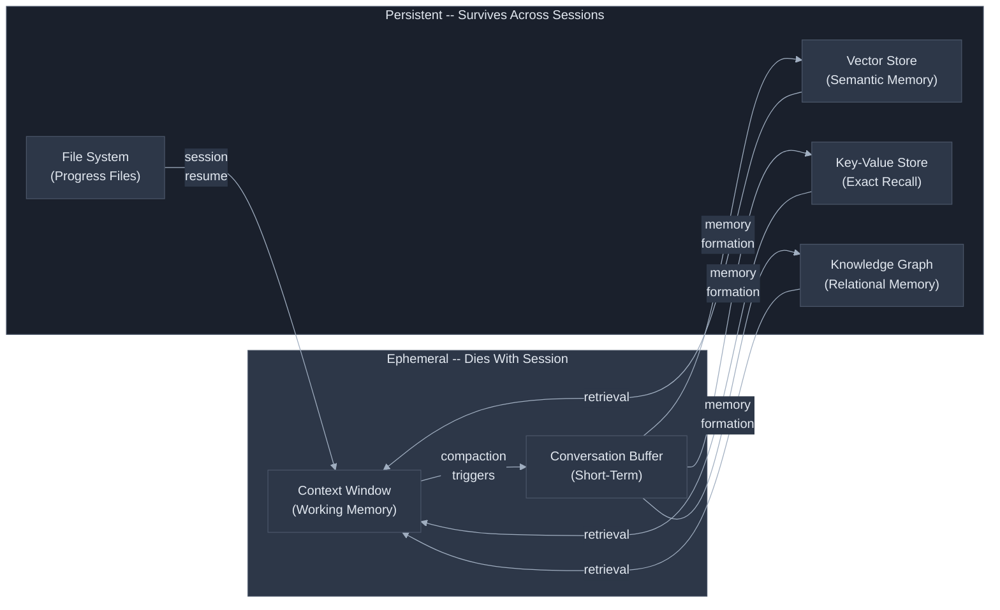
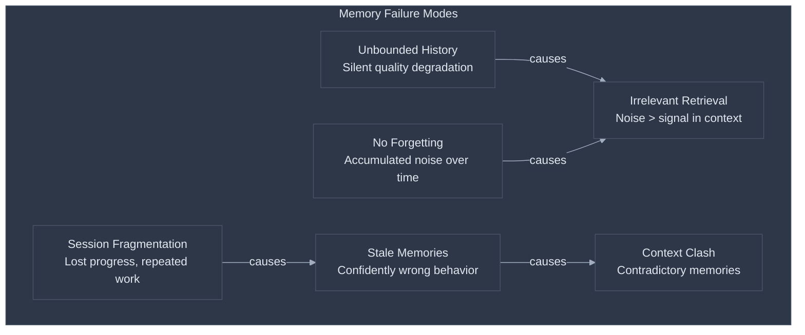
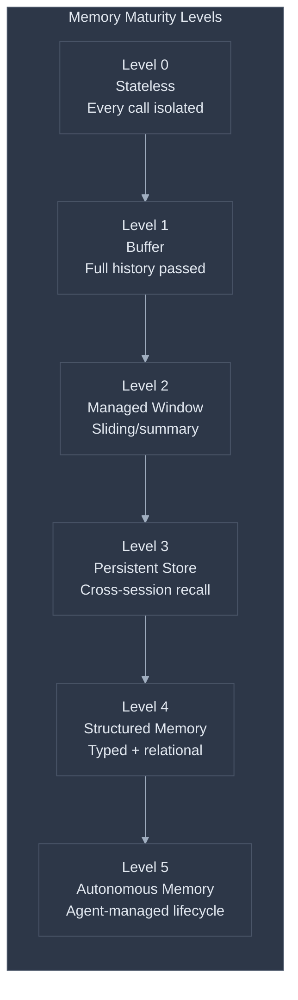
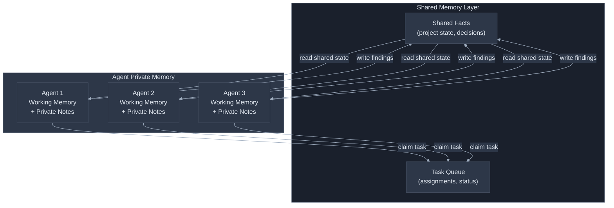

# Memory and State Management: Why Agents Forget and How to Make Them Remember

Every LLM interaction begins from nothing. The model has no recollection of previous conversations, no awareness of lessons learned, no sense of what it tried yesterday and whether it worked. Without memory, an agent that successfully debugged a complex issue at 2 PM will approach the identical issue at 3 PM as if encountering it for the first time. Memory is what transforms a stateless function call into something that resembles an intelligent collaborator -- and the gap between "stateless" and "stateful" is where most agentic systems either succeed or silently degrade.

The tension is this: **the context window is the only thing the model can see, but the context window is ephemeral.** It fills up, it gets truncated, and when the session ends, it vanishes. Every memory system is fundamentally an answer to one question: *what information should survive the death of the current context window, and how does it get back in when needed?* This is where memory meets [context engineering](context-engineering.md) -- context engineering decides what goes into the window right now; memory engineering decides what persists *between* windows.

**Prerequisites:** [Context Engineering](context-engineering.md) (context budgeting, conversation history strategies, compaction), [RAG: From Concept to Production](rag-from-concept-to-production.md) (vector stores, retrieval pipelines), and [Tool Design](tool-design-for-llm-agents.md) (tool definitions, agent-tool interfaces). This document builds directly on all three.

| What teams assume | What actually happens |
|---|---|
| "The context window is the agent's memory" | The context window is working memory -- it fills up and degrades ([Anthropic](https://www.anthropic.com/engineering/effective-context-engineering-for-ai-agents)) |
| "Longer context windows solve memory" | Attention degrades with volume; 200K tokens does not mean 200K tokens of useful recall |
| "I'll store everything and retrieve what's needed" | Retrieval without relevance filtering actively degrades output quality |
| "Memory is a feature to add later" | Memory is an architectural decision -- retrofitting it changes your entire state model |
| "Summarization is memory" | Summarization compresses; memory formation selectively extracts facts, preferences, and patterns ([mem0](https://arxiv.org/abs/2504.19413)) |
| "More memory makes agents smarter" | Stale or irrelevant memories make agents confidently wrong |



---

## The Memory Taxonomy

[Lilian Weng's foundational framework](https://lilianweng.github.io/posts/2023-06-23-agent/) maps human memory types to LLM agent components. Human short-term memory holds roughly 7 items for 20-30 seconds -- directly analogous to the finite context window that constrains everything an LLM can reason about in a single call. The mapping is not perfect, but it provides the right mental model.

**Working memory** is the context window itself. It is what the model can see right now -- system instructions, retrieved documents, conversation history, and the current input. It has a hard capacity limit, it degrades as it fills ([context engineering](context-engineering.md) covers this in depth), and it disappears entirely when the session ends. Working memory is not a storage system. It is a processing workspace.

**Short-term memory** is the conversation history within a session. Raw message buffers, sliding windows, and summary-compressed histories all live here. [Context engineering](context-engineering.md) covers the strategies for managing short-term memory at Levels 0 through 4 of its maturity spectrum -- full history, sliding window, summary-based compression, and hybrid approaches. This document picks up where that spectrum ends: **what happens when conversation history alone is not enough.**

**Long-term memory** is any information that persists across sessions. User preferences learned over weeks. Facts extracted from past interactions. Successful tool-use patterns. Progress checkpoints for interrupted tasks. This is the domain this document focuses on -- the architectures, patterns, and failure modes of persistent agent memory.

The [CoALA framework](https://www.leoniemonigatti.com/blog/memory-in-ai-agents.html) refines this further into four types: **semantic memory** (facts and knowledge), **episodic memory** (past experiences and interactions), **procedural memory** (learned behaviors and skills, often encoded in the system prompt), and **working memory** (current context). The Letta framework offers an alternative split: message buffer, core memory (agent-managed scratchpad), recall memory (searchable conversation history), and archival memory (external database). The key difference is whether the agent actively manages its own memory (Letta's core memory) or whether memory management happens externally.

| Memory Type | Lifespan | Capacity | Access Pattern | Implementation |
|---|---|---|---|---|
| Working | Single LLM call | Context window limit | Everything visible | System prompt + messages |
| Short-term | Single session | Managed by compression | Sequential + selective | Sliding window, summaries |
| Semantic (long-term) | Cross-session | Unbounded (external) | Similarity search | Vector store, knowledge graph |
| Episodic (long-term) | Cross-session | Unbounded (external) | Temporal + similarity | Event logs, vector store |
| Procedural (long-term) | Cross-session | Curated | Exact match + similarity | Skill libraries, system prompts |

---

## Failure Taxonomy

Memory systems fail in six distinct ways. Understanding these failures is prerequisite to designing systems that avoid them.

### Failure 1: Unbounded History Overflow

The simplest memory strategy -- pass the full conversation history to every call -- works until it does not. Token counts grow linearly with each turn. A [LangChain benchmark](https://www.pinecone.io/learn/series/langchain/langchain-conversational-memory/) showed token usage growing from 179 to 388 tokens across just five interactions using `ConversationBufferMemory`. In production agents that make dozens of tool calls per task, the context window fills within minutes. The failure mode is not a crash -- it is silent degradation. The model's attention spreads across an ever-growing history, relevant information gets pushed into the "lost in the middle" zone, and output quality drops without any error signal.

### Failure 2: Stale Memories Causing Incorrect Behavior

A user tells an agent their preferred language is Python in January. In March, they have switched to Rust. If the memory system lacks update and expiration mechanisms, the agent will confidently use Python for every task, and the user will experience an agent that "does not listen." This is not a retrieval failure -- the memory was retrieved correctly. The memory itself is wrong. The [MongoDB engineering team](https://www.mongodb.com/company/blog/technical/why-multi-agent-systems-need-memory-engineering) identifies this as **context poisoning**: outdated or incorrect information contaminating the agent's reasoning and propagating through subsequent interactions.

### Failure 3: Irrelevant Retrieval Polluting Context

A semantic search for "authentication" returns memories about "OAuth token refresh," "JWT validation," "user login flow," and "authenticating API calls to Stripe." Only one of these is relevant to the user's current question about Stripe. The other three consume context window budget while adding noise. This is the **context distraction** problem: information overload from memories that are topically related but contextually irrelevant. The result is worse than having no memory at all, because the model incorporates the irrelevant context into its reasoning.

### Failure 4: Memory Fragmentation Across Sessions

An agent working on a multi-day task stores progress in session-scoped memory. When the session ends and a new one begins, the progress information is either lost or partially reconstructed from what the agent can infer from file state. The agent repeats work, misses completed steps, or -- worse -- overwrites correct work with redundant attempts. This is the fundamental problem [Anthropic's harness patterns](https://www.anthropic.com/engineering/effective-harnesses-for-long-running-agents) address: "Each new session begins with no memory of what came before."

### Failure 5: The Forgetting Problem

Memory systems that only add and never remove accumulate noise over time. But deciding what to forget is genuinely hard. Monigatti identifies this as ["the hardest challenge for developers at the moment"](https://www.leoniemonigatti.com/blog/memory-in-ai-agents.html) -- how to automate a mechanism that decides when and what information to permanently delete. A preference expressed once in passing should not carry the same weight as a preference expressed repeatedly. An outdated fact should be removed, but how does the system know it is outdated without external verification?

### Failure 6: Context Clash in Multi-Agent Systems

Two agents working on the same task store contradictory observations in shared memory. Agent A determines that the API uses pagination with cursors. Agent B, working from a different endpoint, determines it uses offset-based pagination. Both are correct for their respective endpoints, but when a third agent retrieves both memories, it faces **context clash** -- conflicting information with no metadata to resolve the contradiction. The [MongoDB analysis](https://www.mongodb.com/company/blog/technical/why-multi-agent-systems-need-memory-engineering) puts it directly: "Most multi-agent AI systems fail not because agents can't communicate, but because they can't remember."



---

## The Memory Maturity Spectrum

Memory capability exists on a spectrum. Each level adds persistence, sophistication, and complexity. The first three levels are covered in [Context Engineering](context-engineering.md) (Levels 0-4 of its maturity spectrum). This document focuses on Levels 3 through 5 -- the persistent memory layers that survive beyond individual sessions.



**Level 0 -- Stateless:** No memory. Each API call is independent. The model cannot reference anything not in the current prompt. This is the default for every LLM API call.

**Level 1 -- Buffer Memory:** Full conversation history appended to every call. Works for short interactions. Fails at scale due to unbounded token growth and attention degradation. See [Context Engineering](context-engineering.md) Levels 0-1.

**Level 2 -- Managed Conversation Memory:** Sliding windows, summary compression, or hybrid approaches keep history within token budgets. The [LangChain benchmark](https://www.pinecone.io/learn/series/langchain/langchain-conversational-memory/) shows `ConversationBufferWindowMemory` (k=6) holding steady at ~1,500 tokens after 27 interactions, versus unbounded growth with raw buffers. See [Context Engineering](context-engineering.md) Levels 2-4.

**Level 3 -- Persistent External Memory:** Information survives session boundaries. Vector stores enable semantic retrieval of past interactions, key-value stores enable exact recall of specific facts, and file-based checkpoints capture task progress. This is where the conversation shifts from "managing the context window" to "building a memory system." [LangGraph's architecture](https://docs.langchain.com/oss/python/langgraph/memory) exemplifies this with thread-scoped checkpointers for short-term memory and namespaced stores for long-term memory that are "shared across conversational threads."

**Level 4 -- Structured Memory with Typed Operations:** Memory is not just stored but categorized, versioned, and managed through explicit operations. The CoALA framework's four memory types (semantic, episodic, procedural, working) each get their own storage backend and retrieval logic. [Mem0's system](https://arxiv.org/abs/2504.19413) adds graph-enhanced memory that "captures complex relational structures among conversational elements," achieving a 26% improvement over baseline approaches. Memory operations follow a CRUD-like lifecycle: ADD, UPDATE, DELETE, and critically, NOOP -- the decision that current information contains nothing worth remembering.

**Level 5 -- Autonomous Memory Management:** The agent decides what to remember, what to forget, and when to update. Memory formation is an active process, not a passive recording. [Anthropic describes this](https://www.anthropic.com/engineering/effective-context-engineering-for-ai-agents) as agents that "maintain persistent external memory (files, notes, structured data), consult after context resets," treating the context window as "a working scratchpad, not the source of truth." At this level, the memory system is a first-class component of the agent's architecture, not an add-on.

| Level | Survives Session? | Retrieval Method | Failure Mode Addressed | Complexity |
|---|---|---|---|---|
| 0 - Stateless | No | None | None | Trivial |
| 1 - Buffer | No | Sequential scan | None (creates Failure 1) | Low |
| 2 - Managed | No | Windowed/summary | Failure 1 (overflow) | Medium |
| 3 - Persistent | Yes | Semantic search / key lookup | Failure 4 (fragmentation) | High |
| 4 - Structured | Yes | Typed + filtered search | Failures 2, 3 (stale, irrelevant) | High |
| 5 - Autonomous | Yes | Agent-directed retrieval + curation | Failures 5, 6 (forgetting, clash) | Very High |

---

## Principles for Effective Memory Systems

### Principle 1: Separate Memory Formation from Summarization

**Why it works:** Summarization compresses a conversation into fewer tokens. Memory formation extracts specific facts, preferences, and patterns worth retaining. These are fundamentally different operations. A summary of a 30-minute debugging session might say "We debugged the authentication module." A memory system should extract: "The auth module uses bcrypt with cost factor 12," "The user prefers to see stack traces in error responses," and "The `/refresh` endpoint has a race condition under concurrent requests." The summary loses the actionable details; memory formation preserves them.

**How to apply:** After each interaction (or at configurable intervals), run a dedicated memory extraction step that asks the model to identify facts, preferences, decisions, and corrections -- not to summarize. Use structured output to enforce categorization:

```python
MEMORY_EXTRACTION_PROMPT = """Review this conversation and extract discrete memories.
For each memory, provide:
- content: The specific fact, preference, or decision
- type: "semantic" (fact), "episodic" (experience), "procedural" (how-to)
- confidence: 0.0-1.0 based on how explicitly stated vs inferred
- supersedes: ID of any existing memory this updates (or null)

Only extract information worth remembering in future sessions.
Return NOOP if nothing new was learned."""
```

**Addresses:** Failure 2 (stale memories) through the `supersedes` field, and Failure 5 (no forgetting) through the explicit NOOP path.

### Principle 2: Memory Needs Metadata, Not Just Content

**Why it works:** "The user prefers Python" stored without context is a liability. "The user prefers Python" stored with `{timestamp: "2024-01-15", confidence: 0.9, source: "explicit statement", access_count: 12}` is an asset. Metadata enables relevance scoring, staleness detection, and conflict resolution. The [Generative Agents architecture](https://lilianweng.github.io/posts/2023-06-23-agent/) demonstrated this with three-factor scoring: **recency** (recent events score higher), **importance** (distinguishes mundane from core memories by asking the LLM to rate on a 1-10 scale), and **relevance** (cosine similarity to current query).

**How to apply:** Every memory unit should carry at minimum:

```python
@dataclass
class MemoryUnit:
    content: str                    # The actual information
    memory_type: str                # semantic | episodic | procedural
    created_at: datetime            # When formed
    last_accessed: datetime         # For recency scoring
    access_count: int               # Usage frequency
    confidence: float               # 0.0-1.0
    source_session: str             # Which session produced it
    tags: list[str]                 # For filtered retrieval
    embedding: list[float] | None   # For semantic search
    superseded_by: str | None       # Points to replacement memory
```

**Addresses:** Failure 3 (irrelevant retrieval) through multi-factor scoring, and Failure 2 (stale memories) through timestamps and supersession tracking.

### Principle 3: The Memory-Context Bridge Must Be Selective

**Why it works:** This is where memory meets context engineering. Having a million memories in a vector store is worthless if you dump the top 20 into every context window. The bridge between long-term memory and working memory must be **actively curated** for the current task. [Anthropic's guidance](https://www.anthropic.com/engineering/effective-context-engineering-for-ai-agents) to find "the smallest possible set of high-signal tokens that maximize the likelihood of some desired outcome" applies directly -- the memory-context bridge is a retrieval pipeline with the same engineering requirements as RAG.

**How to apply:** Use a multi-stage retrieval pipeline:

```python
def retrieve_relevant_memories(
    query: str,
    memory_store: MemoryStore,
    context_budget_tokens: int = 2000
) -> list[MemoryUnit]:
    # Stage 1: Broad semantic retrieval
    candidates = memory_store.semantic_search(query, top_k=20)

    # Stage 2: Filter by recency and confidence
    candidates = [m for m in candidates
                  if m.confidence > 0.5
                  and not m.superseded_by]

    # Stage 3: Score by composite relevance
    scored = []
    for m in candidates:
        recency = exponential_decay(m.last_accessed, half_life_days=30)
        importance = m.access_count / max_access_count
        relevance = m.similarity_score  # From stage 1
        score = 0.4 * relevance + 0.3 * recency + 0.3 * importance
        scored.append((m, score))

    # Stage 4: Pack within budget
    scored.sort(key=lambda x: x[1], reverse=True)
    selected, token_count = [], 0
    for memory, score in scored:
        tokens = count_tokens(memory.content)
        if token_count + tokens > context_budget_tokens:
            break
        selected.append(memory)
        token_count += tokens

    return selected
```

**Addresses:** Failure 3 (irrelevant retrieval) through multi-stage filtering, and Failure 1 (overflow) through explicit token budgeting.

### Principle 4: Checkpoint Everything in Multi-Step Pipelines

**Why it works:** Long-running agents operate across multiple context windows. Without explicit checkpointing, progress is lost when a session ends, when the context fills and compacts, or when an error forces a restart. [Anthropic's harness pattern](https://www.anthropic.com/engineering/effective-harnesses-for-long-running-agents) solves this with a combination of progress files and git-based state snapshots.

**How to apply:** Implement the progress file pattern. The agent writes structured state to a known file after every significant step:

```python
# progress.json -- written after each completed step
{
    "task": "Migrate authentication from session-based to JWT",
    "started": "2024-03-15T10:00:00Z",
    "current_phase": "implementation",
    "completed_steps": [
        {"step": "Audit existing session endpoints", "completed": "2024-03-15T10:15:00Z"},
        {"step": "Design JWT schema", "completed": "2024-03-15T10:45:00Z"},
        {"step": "Implement token generation", "completed": "2024-03-15T11:30:00Z"}
    ],
    "next_step": "Implement token validation middleware",
    "blockers": [],
    "decisions_made": [
        "Using RS256 for token signing (asymmetric for microservice verification)",
        "Token expiry set to 15 minutes with 7-day refresh tokens"
    ],
    "files_modified": ["src/auth/jwt.py", "src/middleware/auth.py", "tests/test_auth.py"]
}
```

Each coding session begins by reading this file and the git log. The Anthropic pattern adds `git commit` after each completed step with descriptive messages, so the agent can "revert bad code changes and recover working states." The progress file is the *what and why*; the git history is the *how*.

**Addresses:** Failure 4 (session fragmentation) directly.

### Principle 5: Match the Store to the Memory Type

**Why it works:** Semantic memory (facts, knowledge) needs similarity search. Episodic memory (past experiences) needs temporal ordering and similarity. Procedural memory (skills, patterns) needs exact or near-exact retrieval. Key-value stores, vector databases, and knowledge graphs each excel at different access patterns. Using one store for everything creates retrieval mismatches.

**How to apply:**

| Memory Type | Best Store | Why | Example |
|---|---|---|---|
| Semantic (facts) | Vector DB (ChromaDB, Pinecone) | Similarity search finds related facts | "User's API uses OAuth 2.0 with PKCE" |
| Episodic (experiences) | Vector DB + timestamp index | Need both similarity and temporal ordering | "Debugging session on 2024-03-15 found race condition in /refresh" |
| Procedural (skills) | Code files + vector index | Skills are executable; need exact retrieval with fuzzy discovery | Voyager-style skill library |
| Session state | Key-value (Redis, SQLite) | Exact key lookup, fast reads/writes | "current_task: implement JWT validation" |
| Progress checkpoints | File system (JSON/YAML) | Human-readable, git-trackable, survives crashes | `progress.json` per Anthropic's pattern |
| Relational knowledge | Knowledge graph (Neo4j, in-memory) | Traversal queries for connected entities | "User A manages Team B which owns Service C" |

[Redis benchmarks](https://redis.io/blog/ai-agent-memory-stateful-systems/) show state lookups completing in microseconds with vector queries in low milliseconds -- critical "when latency compounds across multiple reasoning steps" in agents making dozens of tool calls per task.

**Addresses:** Failure 3 (irrelevant retrieval) by routing queries to the appropriate store.

### Principle 6: Experience Replay Builds Procedural Memory

**Why it works:** When an agent successfully completes a novel task, the trajectory -- the sequence of reasoning and actions that led to success -- is valuable training data for future encounters. The [Voyager system](https://arxiv.org/html/2305.16291) demonstrated this powerfully: skills stored as executable code, indexed by description embeddings, retrieved via top-5 semantic similarity matching. A critic agent verifies task completion before committing skills to the library. "Complex skills can be synthesized by composing simpler programs, which compounds capabilities rapidly over time."

**How to apply:** After successful task completion, extract and store the solution pattern:

```python
def store_skill(task_description: str, solution_code: str, verification_result: dict):
    """Store a verified skill in the procedural memory library."""
    if not verification_result["success"]:
        return  # Only store verified successes

    skill = {
        "description": task_description,
        "code": solution_code,
        "embedding": embed(task_description),
        "created_at": datetime.now().isoformat(),
        "times_reused": 0,
        "verification": verification_result,
        "dependencies": extract_imports(solution_code)
    }
    skill_store.upsert(skill)

def retrieve_skills(current_task: str, top_k: int = 5) -> list[dict]:
    """Retrieve relevant skills as few-shot examples for the current task."""
    return skill_store.semantic_search(
        query=embed(current_task),
        top_k=top_k,
        filter={"verification.success": True}
    )
```

Retrieved skills become few-shot examples in the agent's context, demonstrating proven solution patterns for similar problems. The critical constraint is **self-verification before commit** -- only store trajectories that demonstrably worked.

**Addresses:** Failure 4 (fragmentation) by preserving institutional knowledge, and enables compositional skill building where complex solutions reuse verified simpler skills.

---

## Memory in Multi-Agent Systems

Multi-agent memory introduces a coordination problem that single-agent systems do not face. When multiple agents operate on the same task, they must decide: **what is shared, what is private, and who resolves conflicts?**



**Private memory** is agent-scoped: working context, intermediate reasoning, task-specific notes. This stays within the agent's context window or local scratchpad. It prevents context pollution between agents -- one agent's debugging notes should not clutter another agent's code review context.

**Shared memory** is the coordination layer: task status, decisions made, facts discovered, files modified. The [Anthropic orchestrator-workers pattern](https://www.anthropic.com/research/building-effective-agents) uses the orchestrator as the central memory aggregator -- workers return condensed summaries, the orchestrator synthesizes results and maintains the canonical state. This centralizes conflict resolution at the cost of making the orchestrator a bottleneck.

The alternative is a **blackboard architecture** where agents read and write to a shared store directly, with metadata (agent ID, timestamp, confidence) enabling downstream consumers to resolve conflicts. This is more scalable but harder to reason about -- the [MongoDB analysis](https://www.mongodb.com/company/blog/technical/why-multi-agent-systems-need-memory-engineering) compares it to the database revolution: "Just as databases transformed software from single-user programs to multi-user applications, shared persistent memory systems enable AI to evolve from single-agent tools to coordinated teams."

The practical rule: **start with orchestrator-mediated memory** (simpler to debug, explicit state flow) and move to shared stores only when the orchestrator becomes a demonstrated bottleneck.

---

## A Complete Memory System

The following implementation combines the principles above into a working memory system for a conversational agent. It uses SQLite for structured memory (metadata, session state) and ChromaDB for semantic retrieval -- a combination that runs locally with no infrastructure dependencies.

```python
import sqlite3
import json
from datetime import datetime
from dataclasses import dataclass, asdict
import chromadb
from chromadb.utils import embedding_functions

@dataclass
class Memory:
    id: str
    content: str
    memory_type: str          # semantic | episodic | procedural
    created_at: str
    last_accessed: str
    access_count: int
    confidence: float
    source_session: str
    tags: list[str]
    superseded_by: str | None = None

class AgentMemorySystem:
    def __init__(self, db_path: str = "agent_memory.db"):
        # SQLite for structured metadata and session state
        self.db = sqlite3.connect(db_path)
        self.db.execute("""CREATE TABLE IF NOT EXISTS memories (
            id TEXT PRIMARY KEY,
            content TEXT NOT NULL,
            memory_type TEXT NOT NULL,
            created_at TEXT NOT NULL,
            last_accessed TEXT NOT NULL,
            access_count INTEGER DEFAULT 0,
            confidence REAL DEFAULT 0.8,
            source_session TEXT,
            tags TEXT,  -- JSON array
            superseded_by TEXT
        )""")
        self.db.execute("""CREATE TABLE IF NOT EXISTS session_state (
            key TEXT PRIMARY KEY,
            value TEXT NOT NULL,
            updated_at TEXT NOT NULL
        )""")
        self.db.commit()

        # ChromaDB for semantic search
        self.chroma = chromadb.PersistentClient(path=f"{db_path}_vectors")
        self.collection = self.chroma.get_or_create_collection(
            name="agent_memories",
            embedding_function=embedding_functions.DefaultEmbeddingFunction()
        )

    def store(self, memory: Memory) -> None:
        """Store a memory in both SQLite (metadata) and ChromaDB (embeddings)."""
        # Check for supersession
        if memory.superseded_by is None:
            existing = self._find_similar(memory.content, threshold=0.92)
            if existing:
                self._supersede(existing.id, memory.id)

        self.db.execute(
            "INSERT OR REPLACE INTO memories VALUES (?,?,?,?,?,?,?,?,?,?)",
            (memory.id, memory.content, memory.memory_type,
             memory.created_at, memory.last_accessed,
             memory.access_count, memory.confidence,
             memory.source_session, json.dumps(memory.tags),
             memory.superseded_by)
        )
        self.db.commit()

        self.collection.upsert(
            ids=[memory.id],
            documents=[memory.content],
            metadatas=[{"type": memory.memory_type,
                        "confidence": memory.confidence,
                        "created_at": memory.created_at}]
        )

    def retrieve(self, query: str, budget_tokens: int = 2000,
                 memory_type: str | None = None) -> list[Memory]:
        """Retrieve relevant memories within a token budget."""
        where_filter = {"confidence": {"$gt": 0.3}}
        if memory_type:
            where_filter["type"] = memory_type

        results = self.collection.query(
            query_texts=[query],
            n_results=20,
            where=where_filter
        )

        memories = []
        for mid in results["ids"][0]:
            row = self.db.execute(
                "SELECT * FROM memories WHERE id=? AND superseded_by IS NULL",
                (mid,)
            ).fetchone()
            if row:
                mem = self._row_to_memory(row)
                self._touch(mem.id)
                memories.append(mem)

        # Pack within budget
        selected, tokens_used = [], 0
        for mem in memories:
            t = len(mem.content.split()) * 1.3  # Rough token estimate
            if tokens_used + t > budget_tokens:
                break
            selected.append(mem)
            tokens_used += t

        return selected

    def set_session_state(self, key: str, value: str) -> None:
        """Store exact key-value session state."""
        self.db.execute(
            "INSERT OR REPLACE INTO session_state VALUES (?,?,?)",
            (key, value, datetime.now().isoformat())
        )
        self.db.commit()

    def get_session_state(self, key: str) -> str | None:
        """Retrieve exact session state by key."""
        row = self.db.execute(
            "SELECT value FROM session_state WHERE key=?", (key,)
        ).fetchone()
        return row[0] if row else None

    def _find_similar(self, content: str, threshold: float) -> Memory | None:
        results = self.collection.query(query_texts=[content], n_results=1)
        if results["distances"][0] and results["distances"][0][0] < (1 - threshold):
            row = self.db.execute(
                "SELECT * FROM memories WHERE id=?",
                (results["ids"][0][0],)
            ).fetchone()
            return self._row_to_memory(row) if row else None
        return None

    def _supersede(self, old_id: str, new_id: str) -> None:
        self.db.execute(
            "UPDATE memories SET superseded_by=? WHERE id=?",
            (new_id, old_id)
        )
        self.db.commit()

    def _touch(self, memory_id: str) -> None:
        self.db.execute(
            "UPDATE memories SET last_accessed=?, access_count=access_count+1 WHERE id=?",
            (datetime.now().isoformat(), memory_id)
        )
        self.db.commit()

    def _row_to_memory(self, row) -> Memory:
        return Memory(
            id=row[0], content=row[1], memory_type=row[2],
            created_at=row[3], last_accessed=row[4],
            access_count=row[5], confidence=row[6],
            source_session=row[7], tags=json.loads(row[8]),
            superseded_by=row[9]
        )
```

This system handles the core operations: store with automatic supersession detection, retrieve with token-budgeted packing, and exact key-value lookup for session state. Production deployments would add: a background job for periodic memory consolidation, TTL-based expiration for episodic memories, and a reranker between ChromaDB retrieval and final selection.

---

## Recommendations

**Short-term (immediate wins):**

1. **Add a progress file to every long-running agent.** A JSON file written after each step, read at the start of every session. This single change addresses session fragmentation (Failure 4) with minimal implementation effort. Follow [Anthropic's `claude-progress.txt` pattern](https://www.anthropic.com/engineering/effective-harnesses-for-long-running-agents). (Implements Principle 4.)
2. **Add `superseded_by` to your memory schema.** If you already have a memory store, add this field and populate it during memory formation. This prevents stale memories from poisoning future interactions. (Implements Principle 2.)
3. **Set a token budget for memory retrieval.** Never dump all retrieved memories into context. Cap memory context at 10-15% of your total context budget, consistent with the allocations in [Context Engineering](context-engineering.md). (Implements Principle 3.)

**Medium-term (structural improvements):**

4. **Separate memory formation from conversation summarization.** Run a dedicated extraction step that produces typed, metadata-rich memory units instead of summaries. This is the single highest-leverage change for long-term memory quality. (Implements Principle 1.)
5. **Implement multi-factor retrieval scoring.** Combine semantic similarity, recency, importance, and access frequency. The Generative Agents three-factor model is a proven starting point. (Implements Principles 2 and 3.)
6. **Store successful task trajectories as procedural memory.** Start with a simple skill library: task description, solution code, verification result. Retrieve as few-shot examples for similar future tasks. (Implements Principle 6.)

**Long-term (architectural shifts):**

7. **Build typed memory stores per access pattern.** Vector DB for semantic retrieval, key-value for session state, files for checkpoints. Route queries to the appropriate store based on memory type. (Implements Principle 5.)
8. **Implement autonomous memory management.** Give the agent explicit tools for memory CRUD operations. Let it decide what to remember, update, and forget through tool calls -- the Letta core memory pattern. This is the highest-maturity approach but requires careful evaluation to ensure the agent does not over-remember or under-forget. (Reaches Level 5.)

---

## The Hard Truth

Most teams building agentic systems do not have a memory problem. They have a **session continuity problem** -- and the solution is a progress file, not a vector database. A JSON file written after each step and read at session start solves 80% of "my agent forgot what it was doing" complaints. Git commits after each step solve another 15%.

The sophisticated memory architectures -- vector stores, knowledge graphs, experience replay -- are genuinely valuable, but only after you have exhausted the simple approaches. An agent that writes `progress.json` and reads it on startup will outperform an agent with a ChromaDB-backed semantic memory system that was never properly tuned for retrieval relevance. The reason is simple: progress files have perfect precision (the agent wrote exactly what it needs) and perfect recall (it reads the whole file). Semantic retrieval has neither.

The uncomfortable truth about agent memory is that **forgetting is harder than remembering.** Any system can accumulate memories. The systems that work long-term are the ones that can identify when a memory is stale, contradicted, or no longer relevant -- and remove it. This is an unsolved problem. The current best practice is metadata-rich memories with explicit supersession tracking, periodic review passes, and confidence decay over time. It is not elegant. It works better than the alternative, which is an ever-growing memory store that gradually poisons every interaction with outdated context.

---

## Summary Checklist

| Question | Good Answer | Bad Answer |
|---|---|---|
| Does your agent survive session restarts? | Reads progress file or checkpoint on startup | Starts from scratch every session |
| How does conversation history grow? | Bounded by sliding window, summary, or compaction | Unbounded -- full history appended every turn |
| Is memory formation separate from summarization? | Dedicated extraction produces typed memory units | Summaries are the only form of persistence |
| Do memories carry metadata? | Timestamp, confidence, access count, source, type | Raw text strings with no context |
| Is retrieval token-budgeted? | Hard cap on memory tokens per context window | All retrieved memories dumped into context |
| Can memories be superseded? | Explicit update/replace operations with lineage | Memories only accumulate, never update |
| Are different memory types stored differently? | Vector DB for semantic, KV for state, files for checkpoints | One store for everything |
| In multi-agent setups, is memory coordination explicit? | Orchestrator aggregates or shared store with metadata | Agents read/write shared state without conflict resolution |
| Are successful trajectories captured? | Verified skills stored and retrieved as few-shot examples | Each task solved from scratch |
| Can the system forget? | Confidence decay, TTL, explicit deletion | Memory only grows |

---

## References

### Foundational Research

- [Lilian Weng, "LLM Powered Autonomous Agents"](https://lilianweng.github.io/posts/2023-06-23-agent/) -- Establishes the canonical memory taxonomy mapping human memory types to LLM agent components. Primary source for MIPS algorithms and the Generative Agents retrieval scoring model.

- [Voyager: An Open-Ended Embodied Agent with Large Language Models](https://arxiv.org/html/2305.16291) -- Seminal paper on skill libraries as procedural memory. Demonstrates verified code skills stored in vector-indexed libraries enabling lifelong learning and zero-shot generalization.

- [Mem0: Building Production-Ready AI Agent Memory](https://arxiv.org/abs/2504.19413) -- Reports 91% lower latency and 90%+ token cost savings vs. full-context approaches. Introduces graph-enhanced memory for capturing relational structures.

### Practitioner Articles

- [Anthropic, "Building Effective Agents"](https://www.anthropic.com/research/building-effective-agents) -- Defines the augmented LLM as "an LLM enhanced with retrieval, tools, and memory." Canonical reference for orchestrator-workers state sharing patterns.

- [Anthropic, "Effective Harnesses for Long-Running Agents"](https://www.anthropic.com/engineering/effective-harnesses-for-long-running-agents) -- Introduces the progress file pattern (`claude-progress.txt`), git-based checkpointing, and the two-agent architecture (initializer + coding agent) for session recovery.

- [Anthropic, "Effective Context Engineering for AI Agents"](https://www.anthropic.com/engineering/effective-context-engineering-for-ai-agents) -- Covers compaction strategies, structured note-taking for persistent memory, and sub-agent architectures for context isolation.

- [Leonie Monigatti, "Making Sense of Memory in AI Agents"](https://www.leoniemonigatti.com/blog/memory-in-ai-agents.html) -- Clear comparison of CoALA vs. Letta memory taxonomies with the four CRUD-like memory operations and hot-path vs. background memory transfer timing.

- [MongoDB, "Why Multi-Agent Systems Need Memory Engineering"](https://www.mongodb.com/company/blog/technical/why-multi-agent-systems-need-memory-engineering) -- Defines the four context degradation problems (poisoning, distraction, confusion, clash) and the data-to-memory transformation pipeline.

### Tools and Documentation

- [Pinecone/LangChain, "Conversational Memory for LLMs"](https://www.pinecone.io/learn/series/langchain/langchain-conversational-memory/) -- Practical benchmark of four LangChain conversation memory implementations with token usage measurements.

- [LangGraph Memory Documentation](https://docs.langchain.com/oss/python/langgraph/memory) -- Official documentation on LangGraph's dual-memory architecture with thread-scoped checkpointers and namespaced cross-session stores.

- [Redis, "AI Agent Memory: Types, Architecture & Implementation"](https://redis.io/blog/ai-agent-memory-stateful-systems/) -- Implementation guide covering four-stage memory architecture, Redis data structure mappings, and vector index tradeoffs (HNSW vs. IVF vs. FLAT).

### Related Documents in This Series

- [Context Engineering](context-engineering.md) -- Conversation history management strategies (Levels 0-4), token budgeting, compaction, sub-agent context isolation. Start here if you have not read it.
- [RAG: From Concept to Production](rag-from-concept-to-production.md) -- Vector store architecture, embedding models, retrieval pipeline engineering. The memory-context bridge uses the same retrieval patterns.
- [Tool Design for LLM Agents](tool-design-for-llm-agents.md) -- "Make invalid states unrepresentable" applies directly to memory schema design.
- [AI-Native Solution Patterns](ai-native-solution-patterns.md) -- Pattern 6 (Autonomous Agent) build stage includes state management in the observe-think-act cycle.
- [Quality Gates in Agentic Systems](quality-gates-in-agentic-systems.md) -- Level 2 observable state for checkpoint verification patterns.
