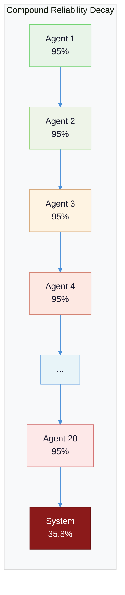
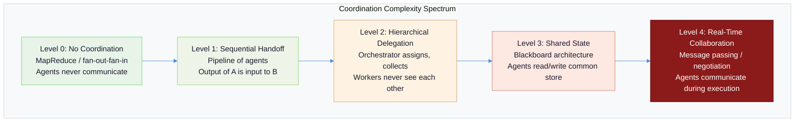
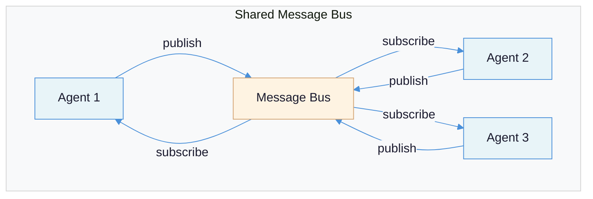
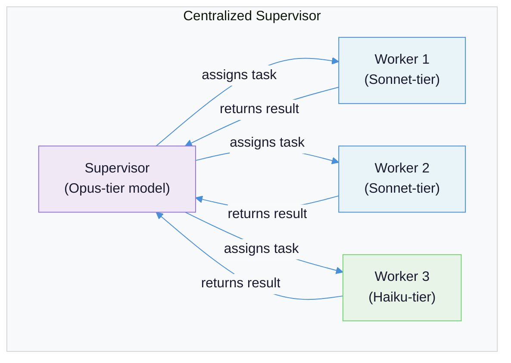
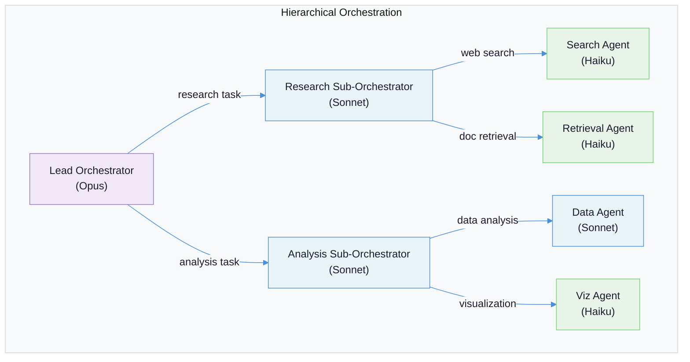
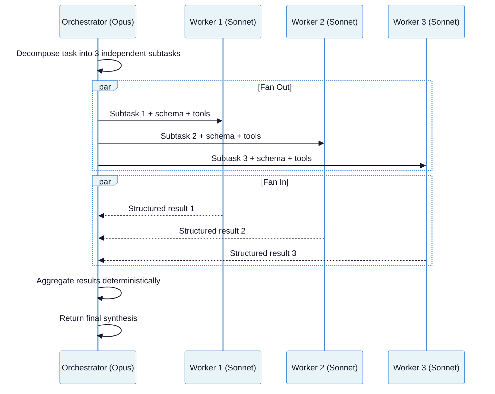

# Multi-Agent Coordination: The Pattern You Should Almost Never Use

You have exhausted every simpler option -- single calls, pipelines, routers, orchestrator-workers, evaluator-optimizers, and autonomous agents. Your evaluation data proves that a single agent cannot handle the task. Only now should you be reading this document. Multi-agent coordination is the most powerful architectural pattern in the LLM toolkit, and it is the most dangerous. The systems that genuinely benefit from it represent less than 0.1% of production LLM use cases. For the other 99.9%, multi-agent coordination is over-engineering that multiplies cost, latency, and failure surface without improving outcomes.

**Prerequisites:** [AI-Native Solution Patterns](ai-native-solution-patterns.md) (the complexity escalation ladder and the seven patterns you should try first), [LLM Role Separation](llm-role-separation-executor-evaluator.md) (per-agent model assignment patterns), [Memory and State Management](memory-and-state-management.md) (multi-agent memory architectures), [Quality Gates](quality-gates-in-agentic-systems.md) (why self-enforcement fails), [Cost Engineering](cost-engineering-for-llm-systems.md) (the token economics that make multi-agent expensive).

---

## The Core Tension

Multi-agent systems promise parallel intelligence -- multiple specialized models working together to solve problems too complex for any single agent. The tension is that **coordination itself is a harder problem than most tasks you would assign to the agents**. You are not just solving the original problem anymore. You are also solving distributed consensus, shared state management, conflict resolution, and failure propagation -- and you are solving them with probabilistic systems that hallucinate, lose context, and cannot reliably follow instructions.

The numbers are unambiguous. The [MAST taxonomy](https://arxiv.org/html/2503.13657v1) analyzed 1,600+ execution traces across seven multi-agent frameworks and found that **79% of failures originate from specification and coordination issues** -- not from model capability, not from tool failures, not from infrastructure problems. The agents can do the work. They cannot coordinate doing it.

| What teams believe | What production data shows |
|---|---|
| "Multiple agents = better results" | [Unstructured multi-agent networks amplify errors up to 17.2x](https://research.google/blog/towards-a-science-of-scaling-agent-systems-when-and-why-agent-systems-work/) vs. single-agent baselines |
| "More agents = more capability" | Coordination gains plateau at ~4 agents; beyond that, [overhead consumes benefits](https://towardsdatascience.com/the-multi-agent-trap/) |
| "Multi-agent is the next step after single agent" | Multi-agent is [5-10x more expensive](ai-native-solution-patterns.md) and [15x more token-hungry](https://www.anthropic.com/engineering/multi-agent-research-system) than single-agent approaches |
| "Frameworks make coordination easy" | ChatDev's multi-agent code generation achieved [25% baseline accuracy](https://arxiv.org/html/2503.13657v1); prompt engineering and topology redesign improved it by only +14% |
| "We need real-time agent collaboration" | [Complex multi-agent systems spend more time in agent-to-agent communication](https://youtu.be/uhJJgc-0iTQ) than making progress on the actual task |

```mermaid
%%{init: {'theme': 'base', 'themeVariables': {'primaryColor': '#e8f4f8', 'primaryTextColor': '#1a1a2e', 'primaryBorderColor': '#4a90d9', 'lineColor': '#4a90d9', 'secondaryColor': '#fef3e2', 'tertiaryColor': '#f0e8f4', 'clusterBkg': '#f8f9fa', 'edgeLabelBackground': '#f8f9fa'}}}%%
graph TD
    subgraph Reality["The Coordination Tax"]
        A["Original Task<br/>Complexity: N"] --> B["+ Agent Communication<br/>Protocol design"]
        B --> C["+ State Synchronization<br/>Conflict resolution"]
        C --> D["+ Failure Propagation<br/>Cascading recovery"]
        D --> E["+ Context Management<br/>Per-agent windows"]
        E --> F["Total System Complexity<br/>5-20x original task"]
    end

    style A fill:#e8f4e8,stroke:#74d474
    style B fill:#fef3e2,stroke:#d4a574
    style C fill:#fef3e2,stroke:#d4a574
    style D fill:#fde8e8,stroke:#d47474
    style E fill:#fde8e8,stroke:#d47474
    style F fill:#8b1a1a,color:#fff,stroke:#5a0a0a
```



The correct question is never "should we use multi-agent?" It is: **"have we proven that every simpler pattern fails on this specific task, and is the value of the task high enough to justify 5-20x the cost?"**

---

## Failure Taxonomy

Before examining how to build multi-agent systems, understand the seven ways they break. These failure modes are specific to multi-agent coordination -- they do not exist in single-agent or pipeline architectures. Each one is a reason not to build a multi-agent system unless you have a mitigation strategy.

### Failure 1: Infinite Delegation Loops

**What it looks like:** Agent A delegates to Agent B, which delegates back to Agent A (or to Agent C, which delegates to A). The system burns tokens in a circle, producing no useful output.

**Why it happens:** When agents can invoke other agents as tools, there is no structural guarantee against cycles. Each agent sees only its own context and makes locally rational delegation decisions that create globally irrational loops. The problem is worse than traditional infinite loops in code because each iteration costs real money.

**Concrete example:** A 4-agent research system built on LangChain -- Research, Analysis, Verification, and Summary agents -- entered a recursive loop when the Analyzer and Verifier repeatedly re-delegated to each other. The loop ran for [11 days undetected, burning $47,000 in API costs](https://techstartups.com/2025/11/14/ai-agents-horror-stories-how-a-47000-failure-exposed-the-hype-and-hidden-risks-of-multi-agent-systems/) ($127 in week one, $891 in week two, $6,240 in week three, $18,400 in week four). Root cause: zero step limits, zero cost ceilings, zero real-time monitoring.

**Structural mitigation:** Hard iteration limits per agent, per conversation, and per system. Maximum delegation depth (agent A can call B, but B cannot call other agents). Cost circuit breakers that halt execution when spend exceeds a threshold.

### Failure 2: Context Contamination Between Agents

**What it looks like:** Agent B's output quality degrades because Agent A's context, reasoning artifacts, or intermediate state leaked into B's prompt. The contamination is invisible because it looks like normal input.

**Why it happens:** In shared-memory architectures, agents read and write to common state. Agent A's working notes, failed attempts, and abandoned reasoning paths persist in shared state and influence Agent B's behavior. The problem compounds when Agent B treats Agent A's speculative output as established fact. This is the multi-agent version of the [context leakage failure mode](llm-role-separation-executor-evaluator.md) documented in role separation.

**Concrete example:** A multi-agent code review system where the Code Analyzer agent writes preliminary findings to shared state. The Security Reviewer agent reads these findings and unconsciously anchors on them, missing vulnerabilities that the Code Analyzer did not flag. The Security Reviewer's "independent" assessment is contaminated by the first agent's framing.

**Structural mitigation:** Strict input/output contracts per agent. Agents receive only the original task and explicitly declared outputs from upstream agents -- never raw context, reasoning traces, or shared scratchpads. The [orchestrator-mediated memory pattern](memory-and-state-management.md) centralizes what information flows between agents.

### Failure 3: Coordination Overhead Exceeding Task Value

**What it looks like:** The system produces correct results, but the cost and latency of coordination make it economically irrational. A single agent could have produced 80% of the quality at 10% of the cost.

**Why it happens:** Coordination requires communication. Communication consumes tokens. [Anthropic's own multi-agent research system](https://www.anthropic.com/engineering/multi-agent-research-system) measured that agents use ~4x more tokens than chat interactions, and multi-agent systems use ~15x more tokens than chats. The token multiplication is inherent to the architecture: each agent needs context about the task, context about its role, context about other agents' outputs, and context about coordination protocols. This is overhead that does not exist in single-agent systems.

**The math:** A single-agent task costing $0.10 in tokens can cost $1.50 in a 4-agent system -- a 15x multiplier. At 10,000 requests/day, that is $4,500/month vs. $300/month. The multi-agent system must deliver dramatically better results to justify the cost difference.

**Structural mitigation:** Cost-per-task budgets. A/B testing multi-agent vs. single-agent on production traffic with quality evaluation. Kill the multi-agent path if it does not beat single-agent by a margin that justifies the cost delta.

### Failure 4: Compound Reliability Decay

**What it looks like:** Each individual agent succeeds 95% of the time. The multi-agent system as a whole succeeds far less often than expected. Quality degrades in ways that no single agent failure explains.

**Why it happens:** Reliability compounds multiplicatively, not additively. If each step in a chain has 95% reliability, then a 20-step multi-agent pipeline has overall reliability of 0.95^20 = **35.8%**. As [The Multi-Agent Trap](https://towardsdatascience.com/the-multi-agent-trap/) puts it: "You started with agents that succeed 19 out of 20 times. You ended with a system that fails nearly two-thirds of the time."

The [Google/MIT study of 180 multi-agent configurations](https://research.google/blog/towards-a-science-of-scaling-agent-systems-when-and-why-agent-systems-work/) quantified the error amplification: independent (unstructured) multi-agent networks amplify errors **17.2x** compared to single-agent baselines. Even centralized (orchestrated) systems amplify errors **4.4x**.



**Structural mitigation:** Minimize the number of sequential agent dependencies. Use parallel (MapReduce) patterns instead of sequential chains. Add quality gates between agents with the ability to retry or escalate. Design for the system reliability you need, then work backwards to the per-agent reliability required.

### Failure 5: Cascading Failures When One Agent Breaks

**What it looks like:** One agent encounters an error, produces malformed output, or times out. The failure propagates through the system: downstream agents receive bad input, produce bad output, which feeds back into the loop. The system either crashes entirely or produces confidently wrong results.

**Why it happens:** Multi-agent systems have the same failure propagation problems as distributed microservices, but without the decades of engineering practice (circuit breakers, bulkheads, retry with backoff) that the software industry has developed for traditional systems. Most multi-agent frameworks do not implement these patterns by default.

**Structural mitigation:** Circuit breakers per agent. Timeout budgets per agent call. Fallback paths (if Agent B fails, the orchestrator uses a simpler alternative). Structured error responses that downstream agents can detect and handle, rather than natural language error descriptions that get incorporated as if they were valid output.

### Failure 6: Specification Drift Through Handoffs

**What it looks like:** The original task specification mutates as it passes through multiple agents. By the time the final agent acts, the task has been subtly reinterpreted, with constraints dropped or goals shifted.

**Why it happens:** Each agent "understands" the task through its own context window. When Agent A summarizes the task for Agent B, some information is lost or reframed. Agent B summarizes for Agent C, and the drift compounds. This is the multi-agent version of the [telephone game](quality-gates-in-agentic-systems.md) -- the gate instruction that said "verify architectural consistency" becomes "check that the code looks reasonable" after several handoffs.

**The MAST data:** Specification and system design failures account for [41.77% of all multi-agent failures](https://arxiv.org/html/2503.13657v1), making this the single largest category. Within this category, "disobeying task/role specifications" and "context loss" are the most frequent failure modes.

**Structural mitigation:** Pass the original task specification to every agent, not a summarized version. Use structured schemas for inter-agent communication so that fields cannot be silently dropped. Include the original success criteria in every agent's context.

### Failure 7: The Scaling Ceiling

**What it looks like:** Adding a fifth or sixth agent to the system does not improve results. Performance plateaus or degrades. Latency increases. Cost increases. The additional agents add coordination overhead without proportional capability gains.

**Why it happens:** Interaction complexity scales combinatorially: 2 agents = 1 interaction pair, 4 agents = 6 pairs, 10 agents = 45 pairs. The [Google/MIT study](https://research.google/blog/towards-a-science-of-scaling-agent-systems-when-and-why-agent-systems-work/) found that coordination gains plateau beyond approximately 4 agents. Below that number, adding agents to a structured system helps. Above it, coordination overhead consumes the benefits. Anthropic's own multi-agent research system initially spawned [up to 50 subagents for simple queries](https://www.anthropic.com/engineering/multi-agent-research-system) before they constrained the architecture.

**Structural mitigation:** Start with the minimum viable number of agents. Add agents only when evaluation data shows a specific capability gap. Monitor per-agent contribution to overall quality -- if an agent's marginal contribution is negative, remove it.

---

## The Coordination Spectrum

Not all multi-agent systems require the same coordination complexity. The right architecture depends on whether agents need to share state, communicate during execution, or simply work independently and have their results aggregated. This spectrum runs from zero coordination (embarrassingly parallel) to full real-time collaboration.



### Level 0: No Coordination (MapReduce)

The safest multi-agent pattern. An orchestrator splits work into independent chunks, fans out to parallel agents, and deterministically aggregates results. Agents never communicate with each other. Each agent receives the original task (or its portion) and returns a structured result. The orchestrator handles all synthesis.

This is the pattern Anthropic recommends starting with. Their [multi-agent research system](https://www.anthropic.com/engineering/multi-agent-research-system) uses a lead agent (Claude Opus) that spawns subagents (Claude Sonnet) for parallel web searches. The subagents never interact -- they search independently, return findings, and the lead agent synthesizes. This architecture outperformed single-agent by [90.2%](https://www.anthropic.com/engineering/multi-agent-research-system) on research tasks, and parallel tool calling cut research time by up to 90% for complex queries.

**When it works:** The task decomposes into independent subtasks with no data dependencies. Code review across independent files. Research across independent sources. Evaluation across independent dimensions.

**When it breaks:** Subtasks are not actually independent -- agents need information from each other's partial results to do their own work.

### Level 1: Sequential Handoff

Agents form a pipeline. Agent A completes its work and passes the result to Agent B. This is what Anthropic calls [workflows of agents](https://youtu.be/uhJJgc-0iTQ) -- each step in a workflow is itself an agentic loop that iterates until it produces a satisfactory result, then transitions to the next step.

**When it works:** The task has natural phases with clear boundaries (e.g., research -> analysis -> writing -> editing). Each phase benefits from a specialized agent with different tools, prompts, or model selection.

**When it breaks:** Later agents need to revise earlier agents' work. The pipeline becomes a loop, and you have moved to Level 3+ complexity without the architecture to support it.

### Level 2: Hierarchical Delegation

A central orchestrator agent decomposes the task, delegates subtasks to specialized workers, receives results, and synthesizes the final output. Workers never communicate with each other -- all coordination flows through the orchestrator. This is the [orchestrator-workers pattern](ai-native-solution-patterns.md) extended with agentic workers.

Sub-agents appear as **tools** to the parent agent. As [Erik Schluntz explains](https://youtu.be/uhJJgc-0iTQ), "The parent passes prompts as parameters, and sub-agents return results." This is the sub-agent-as-tool pattern: the orchestrator does not need to know that its "tools" are themselves LLM agents. It calls them the same way it calls any other tool.

**When it works:** The orchestrator can decompose the task without needing intermediate results from workers. Workers have distinct specializations (different tools, different model tiers, different prompt strategies).

**When it breaks:** The orchestrator becomes a bottleneck. Task decomposition itself is ambiguous and requires iteration. Workers produce conflicting results that the orchestrator cannot reconcile without sending them back for revision.

### Level 3: Shared State (Blackboard)

Agents read and write to a shared data store -- the "blackboard." Each agent observes the current state, contributes what it can, and modifies the state. A controller decides which agent to activate next based on the current state. This architecture is borrowed from classical AI (Erman et al., 1980s) and adapted for LLM agents.

**When it works:** The problem requires incremental refinement by different specialists who each contribute a different perspective to a shared artifact (e.g., collaborative document editing, iterative design).

**When it breaks:** Conflict resolution becomes intractable. Two agents modify the same field simultaneously. The blackboard grows unbounded and fills agents' context windows with irrelevant state. This is where most multi-agent systems fail in practice.

### Level 4: Real-Time Collaboration

Agents communicate during execution, negotiate decisions, and coordinate actions in real time. This is the pattern most people imagine when they think "multi-agent" -- autonomous agents working together like a human team. It is also the pattern that almost never works in production.

**When it works:** The task genuinely requires negotiation between agents with different objectives or information (e.g., adversarial debate, red-team/blue-team security evaluation).

**When it breaks:** Almost always. The communication overhead dominates. [Complex multi-agent systems spend more time in agent-to-agent communication than making progress on the actual task](https://youtu.be/uhJJgc-0iTQ). Same problem as large organizations with excessive meetings.

---

## Communication Patterns

When agents do need to communicate, the architecture of that communication determines system behavior. Four patterns dominate, each with different tradeoffs.

### Shared Message Bus

All agents publish to and subscribe from a shared channel. Any agent can see any message. Inspired by event-driven microservices.



**Advantages:** Decoupled agents. Easy to add new agents. Natural event sourcing.
**Disadvantages:** Every agent's context window grows with every message. No natural ordering or conflict resolution. Agents may react to stale messages. Context pollution is nearly guaranteed at scale.
**Best for:** Logging and monitoring. Auditing. Systems where agents need awareness of the whole conversation but act independently.
**Real implementation:** [calfkit](https://github.com/your-org/calfkit) decomposes agents into microservices over Kafka, with LLM inference, tool execution, and routing as separate event-driven concerns.

### Direct Messaging (Point-to-Point)

Agents communicate directly with specific other agents. The topology is explicit: Agent A can call Agent B, but not Agent C.

**Advantages:** Minimal context pollution -- agents only see messages addressed to them. Clear communication boundaries.
**Disadvantages:** Rigid topology. Adding new agents requires updating communication paths. Difficult to debug because no single point has the full conversation history.
**Best for:** Well-defined workflows where the communication graph is known at design time.

### Hierarchical Reporting

Agents report only to their supervisor. The supervisor aggregates and delegates. Workers never communicate laterally.

**Advantages:** Clean information hierarchy. The supervisor has full context. Workers have minimal context (only their task). Easy to reason about. Natural cost control -- the supervisor is the only point of token multiplication.
**Disadvantages:** Supervisor bottleneck. If the supervisor fails, the entire subtree fails. Information latency -- workers cannot adapt to each other's partial results without going through the supervisor.
**Best for:** Most production multi-agent systems. This is the default recommendation.

### Blackboard Architecture

A shared data structure that all agents can read and write. A controller component decides which agent to activate based on the current state of the blackboard.

**Advantages:** Flexible -- agents contribute asynchronously without knowing about each other. Naturally handles incremental refinement.
**Disadvantages:** Conflict resolution is hard. Stale reads are possible. The blackboard can grow unbounded. [MongoDB's analysis](https://www.mongodb.com/company/blog/technical/why-multi-agent-systems-need-memory-engineering) compares this to the database revolution: "Just as databases transformed software from single-user programs to multi-user applications, shared persistent memory systems enable AI to evolve from single-agent tools to coordinated teams." The comparison is apt -- databases needed transactions, locking, and isolation levels to manage concurrent access. Blackboard architectures for agents need the same, and most implementations lack it.
**Best for:** Iterative refinement tasks where the "right" sequence of agent contributions is not known in advance.

| Pattern | Context Growth | Conflict Risk | Debugging | Scalability |
|---|---|---|---|---|
| Message Bus | O(agents x messages) | High | Hard (distributed) | Good (decoupled) |
| Direct Messaging | O(relevant messages) | Low | Hard (no central view) | Poor (rigid topology) |
| Hierarchical | O(supervisor context) | Low (centralized) | Easy (supervisor trace) | Moderate (bottleneck) |
| Blackboard | O(blackboard size) | High (concurrent writes) | Moderate (state snapshots) | Good (async) |

---

## Orchestration Models

The orchestration model determines who decides what work to do, when to do it, and when to stop. Three models exist, with fundamentally different tradeoffs.

### Centralized Supervisor

One agent controls everything. It decomposes the task, assigns work, collects results, handles errors, and produces the final output. Workers are stateless tools.



**Advantages:** Simple to reason about. Clear authority. Natural cost optimization -- use an expensive model (Opus) for the supervisor and cheaper models (Sonnet, Haiku) for workers. Error handling is centralized. The supervisor's context contains the full execution history.

**Disadvantages:** Single point of failure. Supervisor context window limits the number of concurrent tasks. The supervisor must understand every worker's domain well enough to assign and evaluate work.

**Model assignment pattern:** The supervisor should be the most capable model available. Workers can be cheaper models, matched to task complexity. [Anthropic's multi-agent research system](https://www.anthropic.com/engineering/multi-agent-research-system) uses Claude Opus as the lead agent and Claude Sonnet for subagents. [HYDRA-style routing](https://www.anthropic.com/engineering/multi-agent-research-system) can further optimize: executive agents get frontier models, worker agents get cost-optimized models. For per-agent model assignment patterns across frameworks, see [LLM Role Separation](llm-role-separation-executor-evaluator.md).

**This is the recommended default for production systems.**

### Decentralized Peer-to-Peer

No central authority. Agents coordinate by communicating with each other, reaching consensus through message passing. Inspired by distributed systems protocols.

**Advantages:** No single point of failure. Can scale to more agents without a bottleneck.

**Disadvantages:** Consensus is hard. LLM agents are not reliable enough for distributed consensus protocols. There is no equivalent of Paxos or Raft for probabilistic agents. In practice, decentralized multi-agent systems [degrade performance on sequential reasoning tasks by 39-70%](https://research.google/blog/towards-a-science-of-scaling-agent-systems-when-and-why-agent-systems-work/) compared to centralized approaches.

**When to consider:** Almost never for production systems. Research settings where exploring diverse solution approaches matters more than convergence reliability.

### Hierarchical With Sub-Orchestrators

A top-level orchestrator delegates to sub-orchestrators, each of which manages its own team of workers. This is the multi-agent equivalent of organizational hierarchy.



**Advantages:** Natural decomposition for complex multi-domain tasks. Each sub-orchestrator manages a bounded problem. Context windows stay manageable because each level summarizes for the level above.

**Disadvantages:** Deep hierarchies introduce latency and cost multiplication. Information must traverse the hierarchy, with summarization losses at each level. Three levels of hierarchy means three rounds of LLM inference just to delegate a task. Specification drift (Failure 6) is most severe in hierarchical systems.

**When to consider:** Tasks that naturally decompose into 2-3 distinct domains, each requiring its own tool set and specialized reasoning. Complex research tasks. Multi-document analysis with different document types.

---

## Shared State Management

The hardest engineering problem in multi-agent systems is not the agents themselves -- it is managing the state they share. When two agents modify the same state, you have a distributed systems problem with none of the guarantees that traditional distributed systems provide.

### Orchestrator-Mediated Memory (Recommended)

The [Anthropic orchestrator-workers pattern](https://www.anthropic.com/research/building-effective-agents) uses the orchestrator as the central memory aggregator. Workers return condensed summaries (typically [1,000-2,000 tokens per subagent return](https://www.anthropic.com/engineering/effective-context-engineering-for-ai-agents)). The orchestrator synthesizes results and maintains the canonical state. This centralizes conflict resolution at the cost of making the orchestrator a bottleneck.

```python
# Sub-agent-as-tool pattern: orchestrator calls agents like tools
def run_research_agent(query: str) -> ResearchResult:
    """Each subagent receives: objective, output format, tool access,
    task boundaries. Returns structured result, not raw context."""
    result = agent.run(
        prompt=f"""Research the following query and return findings.
        Query: {query}
        Return: A structured summary with sources, key findings,
        and confidence level. Maximum 1500 tokens.""",
        tools=["web_search", "web_fetch"],
        max_tokens=2000,
        timeout_seconds=120,
        cost_limit_usd=0.50
    )
    return parse_research_result(result)

# Orchestrator uses agents as tools
orchestrator_tools = [
    run_research_agent,   # Subagent wrapped as tool
    run_analysis_agent,   # Subagent wrapped as tool
    run_code_review_agent # Subagent wrapped as tool
]
```

**The critical design principle:** Each subagent needs an [objective, an output format, guidance on tools and sources, and clear task boundaries](https://www.anthropic.com/engineering/effective-context-engineering-for-ai-agents). The orchestrator provides all four, and receives only the structured result -- never the subagent's full context window. This is how you prevent context contamination (Failure 2).

### Blackboard With Metadata

For systems that genuinely need shared mutable state, every write must include metadata: which agent wrote it, when, with what confidence, and whether it supersedes a previous entry. This is not optional -- without metadata, conflict resolution is impossible.

```python
@dataclass
class BlackboardEntry:
    agent_id: str
    timestamp: float
    content: dict
    confidence: float  # 0.0-1.0
    supersedes: str | None  # ID of entry this replaces
    entry_type: str  # "fact", "hypothesis", "decision", "artifact"
```

**Conflict resolution strategies:**
- **Last-writer-wins:** Simple but information-destructive. Appropriate only for idempotent operations.
- **Confidence-weighted merge:** Higher-confidence entries take precedence. Requires calibrated confidence scores, which LLMs are bad at producing.
- **Orchestrator arbitration:** Conflicting entries are flagged for the orchestrator to resolve. This is the most reliable approach but adds latency.

As detailed in [Memory and State Management](memory-and-state-management.md): **start with orchestrator-mediated memory.** Move to blackboard architecture only when the orchestrator bottleneck is proven to be the limiting factor.

### Event Sourcing

Instead of mutable shared state, agents emit immutable events. The current state is derived by replaying the event log. This provides natural audit trails, debugging capability, and the ability to "rewind" to any point in the multi-agent conversation.

**Advantages:** Full auditability. Conflict-free (events are append-only). Natural fit for testing (replay events to reproduce behavior).
**Disadvantages:** State derivation adds latency. Event log grows unbounded. Agents must work with eventually-consistent state.
**Best for:** Systems that require audit trails, regulatory compliance, or reproducible debugging.

---

## The MapReduce Pattern: When Multi-Agent Actually Works

The MapReduce pattern is the single most valuable multi-agent architecture because it eliminates coordination overhead entirely. It is the pattern [Anthropic uses in their own multi-agent research system](https://www.anthropic.com/engineering/multi-agent-research-system), and it is the pattern you should reach for first when considering multi-agent.

### How It Works

1. **Decompose**: The orchestrator splits the task into N independent subtasks
2. **Map**: N agents execute their subtasks in parallel with no communication
3. **Reduce**: The orchestrator aggregates results deterministically



### Why It Works When Other Patterns Fail

- **No coordination overhead.** Agents never communicate. The only inter-agent communication is the initial fan-out and the final fan-in, both mediated by the orchestrator.
- **Linear cost scaling.** Cost is proportional to the number of subtasks, not combinatorial with the number of agents.
- **Parallelism is real.** Wall-clock time is determined by the slowest agent, not the sum of all agents. Anthropic's system cut research time by [up to 90%](https://www.anthropic.com/engineering/multi-agent-research-system) for complex queries.
- **Failures are isolated.** If one worker fails, the orchestrator retries or proceeds with partial results. A worker failure cannot cascade to other workers because they do not communicate.

### Concrete Architecture: Multi-Dimensional Code Review

One of the 2-3 use cases where multi-agent genuinely outperforms single-agent:

```python
# MapReduce code review: 5 independent dimensions evaluated in parallel
review_dimensions = {
    "correctness": {
        "agent_model": "claude-sonnet-4-20250514",
        "prompt": "Review this code for logical correctness, edge cases, "
                  "and potential bugs. Ignore style and architecture.",
        "tools": ["read_file", "grep_codebase", "run_tests"]
    },
    "security": {
        "agent_model": "claude-sonnet-4-20250514",
        "prompt": "Review this code for security vulnerabilities. "
                  "Check OWASP Top 10, injection risks, auth issues.",
        "tools": ["read_file", "grep_codebase", "security_scanner"]
    },
    "performance": {
        "agent_model": "claude-haiku-4-5-20251001",
        "prompt": "Review this code for performance issues. "
                  "Check algorithmic complexity, N+1 queries, memory leaks.",
        "tools": ["read_file", "grep_codebase", "profiler"]
    },
    "architecture": {
        "agent_model": "claude-sonnet-4-20250514",
        "prompt": "Review this code for architectural consistency. "
                  "Check against the architecture doc.",
        "tools": ["read_file", "grep_codebase", "read_architecture_doc"]
    },
    "test_coverage": {
        "agent_model": "claude-haiku-4-5-20251001",
        "prompt": "Review test coverage for this code. "
                  "Identify untested paths and missing edge cases.",
        "tools": ["read_file", "grep_codebase", "coverage_report"]
    }
}

# Fan out: launch all 5 reviews in parallel
results = await asyncio.gather(*[
    run_review_agent(dim, config)
    for dim, config in review_dimensions.items()
])

# Reduce: aggregate into severity-sorted report
report = aggregate_reviews(results, sort_by="severity")
```

Each reviewer is independent. The security reviewer does not need to know what the performance reviewer found. The orchestrator aggregates mechanically. This is the MapReduce pattern applied to code review, and it produces better results than a single agent reviewing all five dimensions sequentially because each agent has a focused context and specialized tooling.

### Concrete Architecture: Deep Research

The other use case where multi-agent clearly wins:

An orchestrator receives a research question. It decomposes it into 3-5 sub-questions, spawns parallel research agents (each with web search and document retrieval tools), collects their findings, identifies gaps or contradictions, optionally spawns a second round of targeted research agents, and synthesizes the final answer. This is exactly how [Anthropic's multi-agent research system works](https://www.anthropic.com/engineering/multi-agent-research-system), and it outperformed single-agent by 90.2%.

The key insight: research is **embarrassingly parallel**. Searching five databases simultaneously is genuinely 5x faster than searching them sequentially, and the results do not depend on each other. The only dependency is in synthesis, which the orchestrator handles.

---

## Agent Handoff Protocols

When a task must transfer from one agent to another, the handoff protocol determines whether context is preserved or lost. The sub-agent-as-tool pattern is the recommended approach.

### The Sub-Agent-As-Tool Pattern

The receiving agent is wrapped as a tool callable by the sending agent. The tool interface enforces a structured contract:

```python
@tool(
    name="delegate_to_analyst",
    description="Delegate a data analysis task to the analyst agent. "
                "Provide the complete dataset reference, analysis question, "
                "and expected output format."
)
def delegate_to_analyst(
    dataset_ref: str,        # What data to analyze
    question: str,           # What to find out
    output_format: str,      # How to structure the result
    constraints: list[str],  # What NOT to do
    context: str             # Why this analysis is needed
) -> AnalysisResult:
    """The tool schema IS the handoff protocol.
    Required fields prevent incomplete handoffs."""
    ...
```

**Why this works:** The tool schema is the handoff protocol. Required fields mean the sending agent must provide all necessary context. The receiving agent gets a clean, structured input -- not a dump of the sender's entire context window. Type safety prevents the telephone-game degradation of Failure 6.

### What to Include in a Handoff

Every handoff must contain:
1. **The original task** (not a summary of a summary)
2. **The specific subtask** for this agent
3. **The output schema** the agent must conform to
4. **Relevant facts discovered so far** (curated, not raw)
5. **What NOT to do** (negative constraints prevent scope creep)
6. **Success criteria** (how the orchestrator will evaluate the result)

### What to Exclude from a Handoff

- Raw reasoning traces from previous agents
- Failed attempts or abandoned approaches
- Internal coordination metadata
- Other agents' prompts or system instructions

---

## Cost and Latency Reality

Multi-agent systems are expensive. The cost is not theoretical -- it is measured in real production deployments.

### Token Economics

| Architecture | Tokens per Task | Cost Multiplier | Source |
|---|---|---|---|
| Single LLM call | 1x (baseline) | 1x | -- |
| Pipeline (3-5 steps) | 3-5x | 3-5x | [Cost Engineering](cost-engineering-for-llm-systems.md) |
| Single agent with tools | ~4x | 4x | [Anthropic](https://www.anthropic.com/engineering/multi-agent-research-system) |
| Multi-agent (4 agents) | ~15x | 10-15x | [Anthropic](https://www.anthropic.com/engineering/multi-agent-research-system) |
| Autonomous multi-agent | 50-100x+ | 50-100x | [Cost Engineering](cost-engineering-for-llm-systems.md) |

At scale, these multipliers determine economic viability:

| Monthly Volume | Single Agent | Multi-Agent (4) | Delta |
|---|---|---|---|
| 1,000 requests/day | $300/month | $4,500/month | +$4,200 |
| 10,000 requests/day | $3,000/month | $45,000/month | +$42,000 |
| 100,000 requests/day | $30,000/month | $450,000/month | +$420,000 |

### Cost Optimization: Cascaded Model Routing

The most effective cost optimization for multi-agent systems is **cascaded model routing** -- using cheap models for most agents and expensive models only where quality demands it.

The [BudgetMLAgent study](https://arxiv.org/abs/2411.07464) demonstrated this rigorously: cascading from free-tier models (Gemini Pro) through mid-tier (GPT-3.5-Turbo) to frontier (GPT-4) "lifelines" reduced costs by **94.2%** (from $0.931 to $0.054 per task) while actually improving success rate from 22.72% to 32.95%. The cheap model handles 70%+ of tasks; the expensive model is only invoked on failures.

As Anthropic notes: ["Upgrading to Claude Sonnet 4 is a larger performance gain than doubling the token budget on Claude Sonnet 3.7."](https://www.anthropic.com/engineering/multi-agent-research-system) Spend on model quality, not on more agents.

### Latency

Multi-agent systems add latency in three ways:
1. **Sequential agent calls** -- each handoff is a full LLM inference round
2. **Orchestrator overhead** -- the orchestrator processes every result before delegating the next task
3. **Coordination protocol** -- shared state reads/writes, conflict resolution, retries

For MapReduce patterns, latency is bounded by the slowest parallel agent plus orchestrator overhead. For sequential multi-agent patterns, latency is the sum of all agent calls. A 4-agent sequential system with 2-second average agent response time has a minimum 8-second latency before any result is produced.

---

## Framework Comparison

Four approaches to building multi-agent systems, with different tradeoffs.

| Dimension | AutoGen | CrewAI | LangGraph | Custom Orchestration |
|---|---|---|---|---|
| **Architecture** | Conversational agents | Role-based teams | Graph-based state machine | Whatever you build |
| **Strength** | Rapid prototyping, human-in-loop | Business workflows, role specialization | Complex conditional flows, stateful execution | Full control, minimal abstraction |
| **Learning curve** | Low | Low-Medium | Medium-High | High (but no framework to learn) |
| **Production readiness** | Moderate (0.4 async redesign) | Moderate (commercial licensing) | High (v1.0, LangSmith observability) | Depends entirely on you |
| **Debugging** | Hard (conversational logs) | Moderate (crew execution traces) | Good (LangSmith integration) | Best (you own the code) |
| **Per-agent model assignment** | `model_client` per agent | `llm` parameter per agent | Node-level model config | Explicit in code |
| **Best for** | Research, collaborative problem-solving | Customer support, content pipelines | Stateful workflows, multi-conditional paths | When you understand the problem deeply |
| **Backing** | Microsoft/Azure | Independent | LangChain ecosystem | -- |

### When to Use Each

**AutoGen:** You are prototyping and need human-in-the-loop. You want conversational agent patterns where agents discuss tasks. Good for research settings, poor for production workflows.

**CrewAI:** You have a well-defined team metaphor (researcher + writer + editor). Your workflow maps naturally to roles with sequential or hierarchical delegation. Beware of the role-playing overhead -- agents spend tokens maintaining their "persona."

**LangGraph:** You need stateful, conditional workflows with branching logic. Your multi-agent system has complex control flow (retry on failure, conditional escalation, parallel branches that converge). The most mature production option as of early 2026.

**Custom orchestration:** You have proven the task needs multi-agent. You understand the coordination requirements deeply. You want to avoid framework abstraction overhead and maintain full control over prompts, routing, and error handling. [Anthropic recommends this approach](https://www.anthropic.com/research/building-effective-agents): "Frameworks often create extra layers of abstraction that can obscure the underlying prompts and responses, making them harder to debug."

**The recommendation:** Start with custom orchestration for your specific use case. Move to a framework only when the framework solves a coordination problem you cannot solve more simply yourself.

---

## The Testing Problem

Multi-agent systems are harder to test than any other LLM architecture because the interaction space is combinatorial. A single agent has one prompt and one set of tool calls to verify. A 4-agent system has agent-to-agent interactions, shared state mutations, ordering effects, and failure cascades that multiply the test surface.

### Testing Strategies

**1. Unit test each agent in isolation.** Before testing interactions, verify that each agent handles its specific task correctly when given well-formed input. This is the baseline. If individual agents are unreliable, multi-agent coordination will amplify their failures (the compound reliability decay from Failure 4).

**2. Contract testing between agents.** Define the input/output schema for every inter-agent communication. Write tests that verify: (a) each agent produces output conforming to its output schema, (b) each agent handles malformed input gracefully, (c) the schemas are compatible at every connection point.

**3. Conversation replay.** Record full multi-agent execution traces (all messages, all state changes, all tool calls) in production. Replay these traces in test environments to verify that behavior is consistent. This is the event sourcing advantage -- if you log immutable events, you can reproduce any scenario.

**4. Simulation environments.** For systems that interact with external tools, build mock environments that simulate tool responses. The goal is not to test tool correctness (that is unit testing) but to test agent coordination when tools return unexpected results, fail, or return slowly.

**5. Adversarial testing.** Inject failures: make one agent return garbage, make one agent timeout, make two agents return contradictory results. Verify that the system degrades gracefully rather than cascading.

**6. Cost testing.** Every test run should log total tokens consumed and total cost. Set cost thresholds in CI -- if a multi-agent test exceeds expected cost by more than 2x, it fails. This catches delegation loops early.

```python
# Example: cost-bounded multi-agent test
@pytest.fixture
def cost_tracker():
    tracker = CostTracker(max_cost_usd=5.00)
    yield tracker
    assert tracker.total_cost < tracker.max_cost, (
        f"Multi-agent test exceeded cost budget: "
        f"${tracker.total_cost:.2f} > ${tracker.max_cost:.2f}"
    )

def test_research_pipeline(cost_tracker):
    result = run_multi_agent_research(
        query="Analyze the competitive landscape for X",
        cost_tracker=cost_tracker,
        max_agents=4,
        timeout_seconds=300
    )
    assert result.confidence > 0.7
    assert len(result.sources) >= 3
    assert cost_tracker.total_cost < 2.00  # Budget for this specific test
```

---

## Where Multi-Agent Genuinely Wins

After all the warnings, there are genuine use cases. These share three characteristics:

1. **The task decomposes into independent subtasks** that benefit from parallel execution
2. **The value per task is high enough** to justify 5-15x cost (research that saves hours of human time, code review that catches production bugs, analysis that informs million-dollar decisions)
3. **Different subtasks require genuinely different capabilities** (different tools, different model tiers, different prompt strategies)

### Use Case 1: Deep Research

An orchestrator decomposes a research question into 3-5 parallel sub-questions. Each research agent searches different sources, reads different documents, and returns structured findings. The orchestrator synthesizes, identifies gaps, optionally runs a second round, and produces the final report.

**Why single-agent fails:** Context window limitations. A single agent cannot hold 20 search results, 5 full documents, and its synthesis reasoning in one context window. The quality of later analysis degrades as the context fills.

**Why multi-agent works:** Each research agent has a fresh, focused context window. The orchestrator receives only summaries. Parallelism cuts wall-clock time by 3-5x. Anthropic measured a [90.2% improvement](https://www.anthropic.com/engineering/multi-agent-research-system) over single-agent.

**Production example:** [Klarna's multi-agent customer service system](https://towardsdatascience.com/the-multi-agent-trap/) handles 2.3 million conversations per month (workload of 700 human agents), reduced resolution time from 11 minutes to under 2 minutes, improved customer satisfaction by 47%, and has saved approximately $60 million through late 2025.

### Use Case 2: Multi-Dimensional Evaluation

An orchestrator sends the same artifact to 5 independent evaluator agents, each assessing a different quality dimension (correctness, security, performance, architecture, test coverage). Results are aggregated into a severity-rated report.

**Why single-agent fails:** A single agent evaluating 5 dimensions in one pass suffers from the [position bias and verbosity bias](llm-role-separation-executor-evaluator.md) documented in role separation. Later dimensions get less attention. The agent anchors on its first assessment and confirms it for subsequent dimensions.

**Why multi-agent works:** Each evaluator has a clean context with only the artifact and its specific evaluation rubric. No anchoring. No position effects. Different evaluators can use different model families for [genuine evaluation independence](llm-role-separation-executor-evaluator.md). The aggregation is deterministic.

### Use Case 3: Tool-Specialized Delegation

A lead agent receives a complex task requiring 100+ tools. Instead of loading all tools into one context (which wastes tokens and degrades tool selection accuracy), the lead agent delegates to specialist agents, each with ~20 relevant tools.

**Why single-agent fails:** Tool selection accuracy degrades with the number of available tools. An agent with 100 tools makes worse tool choices than one with 20.

**Why multi-agent works:** Each specialist has a focused tool set. The lead agent only needs to know which specialist to delegate to. [Anthropic reports](https://www.anthropic.com/engineering/advanced-tool-use) that tool-testing agents rewriting descriptions for other agents produced **40% faster task completion**.

---

## Self-Improvement in Multi-Agent Systems

Multi-agent architectures can form self-improvement loops when one agent's output is evaluated by another agent's judgment. The key structural requirement is [evaluator independence](llm-role-separation-executor-evaluator.md) -- the evaluating agent must use a different model family than the executing agent, and must not have access to the executor's reasoning context.

The risk is **metric proxy collapse**: the executor learns what the evaluator rewards and optimizes for the metric rather than the underlying quality. In multi-agent systems, this happens faster because the feedback loop is tighter. The mitigation is the same as in single-agent self-improvement: rotate evaluators, use multiple evaluation dimensions, and maintain a human-validated holdout set. For the full treatment of self-improvement dynamics, see [Self-Improving Systems](self-improving-systems.md) (Document 17 in this series).

---

## The Hard Truth

The multi-agent pattern is the most seductive architecture in the LLM ecosystem because it maps to a human intuition -- teams of specialists outperform generalists. That intuition is misleading. Human teams have decades of shared context, social protocols for conflict resolution, and the ability to interrupt each other mid-sentence to correct misunderstandings. LLM agents have none of this. They communicate through serialized text, they lose context at every handoff, and they cannot detect when another agent has gone off the rails until the malformed output arrives.

The uncomfortable reality: **most multi-agent systems would produce better results as a well-designed single agent with good tools and a larger context window.** The teams that genuinely benefit from multi-agent coordination are the ones who tried everything simpler first, measured the gap, and can point to specific capability limitations (context window exhaustion, tool selection degradation, evaluation independence requirements) that only multi-agent can address.

If you cannot articulate the specific single-agent limitation you are solving, you do not need multi-agent. You need a better prompt, better tools, or a more capable model. As [Anthropic states](https://www.anthropic.com/research/building-effective-agents): "Even though the models are much more capable today than they were a year ago, simplicity is still a really important thing."

---

## Summary Checklist

| Question | Good Answer | Bad Answer |
|---|---|---|
| Have you proven single-agent insufficient with evaluation data? | Yes, with specific metrics showing the gap | "Multi-agent seems like the right approach" |
| Can you articulate the specific single-agent limitation? | "Context window exhausts at 80K tokens during research synthesis" | "We need more capability" |
| Does the task decompose into independent subtasks? | Yes, subtasks have no data dependencies during execution | Subtasks require real-time communication |
| Are you using MapReduce (Level 0) before considering higher levels? | Yes, fan-out/fan-in with no inter-agent communication | Agents communicate during execution |
| Is your orchestration model centralized? | Yes, one supervisor with full visibility | Agents negotiate peer-to-peer |
| Do you have per-agent cost limits, iteration caps, and timeouts? | Yes, structural guardrails enforced in code | "We trust the agents to stop when done" |
| Is the value per task high enough to justify 5-15x cost? | Each task saves hours of human work or prevents costly errors | Tasks are routine / high-volume / low-value |
| Are you monitoring per-agent contribution to quality? | Yes, with ablation tests showing each agent's marginal value | "More agents is better" |
| Do you have contract tests between agents? | Yes, schema validation on every inter-agent message | Agents communicate in free-form text |
| Can you replay and reproduce any multi-agent execution? | Yes, full execution traces with deterministic replay | Non-deterministic, non-reproducible |

---

## References

### Research Papers

- **Cemri et al., "Why Do Multi-Agent LLM Systems Fail?" (2025)** -- The MAST taxonomy: 14 failure modes across 1,600+ traces, 79% from specification/coordination issues. [https://arxiv.org/html/2503.13657v1](https://arxiv.org/html/2503.13657v1)
- **Google/MIT, "Towards a Science of Scaling Agent Systems" (2026)** -- 180 configurations across 5 architectures; 17.2x error amplification in unstructured networks; centralized coordination improved financial reasoning by +80.9% but degraded sequential reasoning by 39-70%. [https://research.google/blog/towards-a-science-of-scaling-agent-systems-when-and-why-agent-systems-work/](https://research.google/blog/towards-a-science-of-scaling-agent-systems-when-and-why-agent-systems-work/)
- **BudgetMLAgent (2024)** -- Cascaded LLM orchestration achieving 94.2% cost reduction while improving success rate. [https://arxiv.org/abs/2411.07464](https://arxiv.org/abs/2411.07464)

### Practitioner Articles

- **Anthropic, "Building Effective Agents" (2025)** -- The canonical guide to agent patterns: 5 workflow architectures, agents-vs-workflows distinction, sub-agent-as-tool pattern. [https://www.anthropic.com/research/building-effective-agents](https://www.anthropic.com/research/building-effective-agents)
- **Anthropic, "How We Built Our Multi-Agent Research System" (2025)** -- Anthropic's own multi-agent architecture: 90.2% improvement, 4x/15x token multipliers, 50-subagent early failure. [https://www.anthropic.com/engineering/multi-agent-research-system](https://www.anthropic.com/engineering/multi-agent-research-system)
- **Anthropic, "Effective Context Engineering for AI Agents" (2025)** -- Context engineering as the successor to prompt engineering: finite attention budget, 1,000-2,000 token subagent summaries. [https://www.anthropic.com/engineering/effective-context-engineering-for-ai-agents](https://www.anthropic.com/engineering/effective-context-engineering-for-ai-agents)
- **Erik Schluntz and Alex Albert, "Building More Effective AI Agents" (Anthropic Video, 2025)** -- Evolution from workflows to agents to workflows-of-agents; sub-agents as tools; Claude as first-time manager; overbuilt multi-agent communication overhead. [https://youtu.be/uhJJgc-0iTQ](https://youtu.be/uhJJgc-0iTQ)
- **"The Multi-Agent Trap" (Towards Data Science, 2025)** -- Compound reliability math, 4-agent saturation ceiling, Klarna case study ($60M savings). [https://towardsdatascience.com/the-multi-agent-trap/](https://towardsdatascience.com/the-multi-agent-trap/)
- **InfoQ, "Google Multi-Agent Scaling Principles" (2026)** -- Summary of Google/MIT study with tool-coordination tradeoff and capability saturation. [https://www.infoq.com/news/2026/03/google-multi-agent/](https://www.infoq.com/news/2026/03/google-multi-agent/)

### Cost and Failure Case Studies

- **TechStartups, "AI Agents Horror Stories: $47,000 Failure" (2025)** -- Detailed case study of 11-day agent loop in 4-agent LangChain system. [https://techstartups.com/2025/11/14/ai-agents-horror-stories-how-a-47000-failure-exposed-the-hype-and-hidden-risks-of-multi-agent-systems/](https://techstartups.com/2025/11/14/ai-agents-horror-stories-how-a-47000-failure-exposed-the-hype-and-hidden-risks-of-multi-agent-systems/)
- **Galileo, "Why Multi-Agent LLM Systems Fail" (2025)** -- Cost data ($0.10 single to $1.50 multi-agent), 93% of teams lack evaluation consistency, 40% project cancellation projection. [https://galileo.ai/blog/multi-agent-llm-systems-fail](https://galileo.ai/blog/multi-agent-llm-systems-fail)
- **Augment Code, "Why Multi-Agent Systems Fail and How to Fix Them" (2025)** -- PwC 7x accuracy improvement, AWS 70% speed gains, JSON schema specifications for agent contracts. [https://www.augmentcode.com/guides/why-multi-agent-llm-systems-fail-and-how-to-fix-them](https://www.augmentcode.com/guides/why-multi-agent-llm-systems-fail-and-how-to-fix-them)

### Framework Documentation

- **DataCamp, "CrewAI vs LangGraph vs AutoGen" (2025)** -- Architectural comparison across three dominant frameworks. [https://www.datacamp.com/tutorial/crewai-vs-langgraph-vs-autogen](https://www.datacamp.com/tutorial/crewai-vs-langgraph-vs-autogen)

### Related Documents in This Series

- [AI-Native Solution Patterns](ai-native-solution-patterns.md) -- The seven patterns and complexity escalation ladder; try all of these before multi-agent
- [LLM Role Separation: Executor vs Evaluator](llm-role-separation-executor-evaluator.md) -- Per-agent model assignment patterns for AutoGen, CrewAI, DSPy; evaluation independence principles
- [Memory and State Management](memory-and-state-management.md) -- Multi-agent memory architectures, orchestrator-mediated vs. blackboard, conflict resolution
- [Cost Engineering for LLM Systems](cost-engineering-for-llm-systems.md) -- Token economics, the runaway agent problem, cost control patterns
- [Quality Gates in Agentic Systems](quality-gates-in-agentic-systems.md) -- Why self-enforcement fails, specification drift through handoffs
- [Self-Improving Systems](self-improving-systems.md) -- Multi-agent self-improvement loops, evaluator independence for sustained improvement
