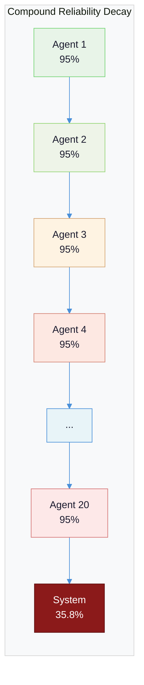
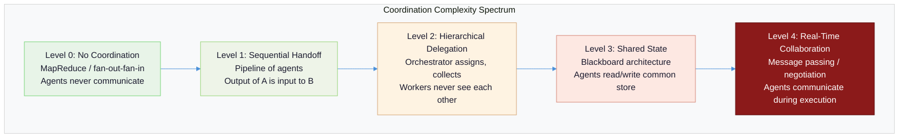
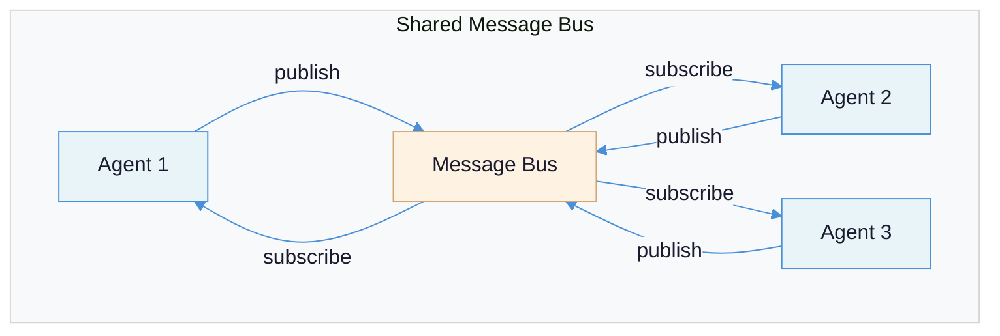
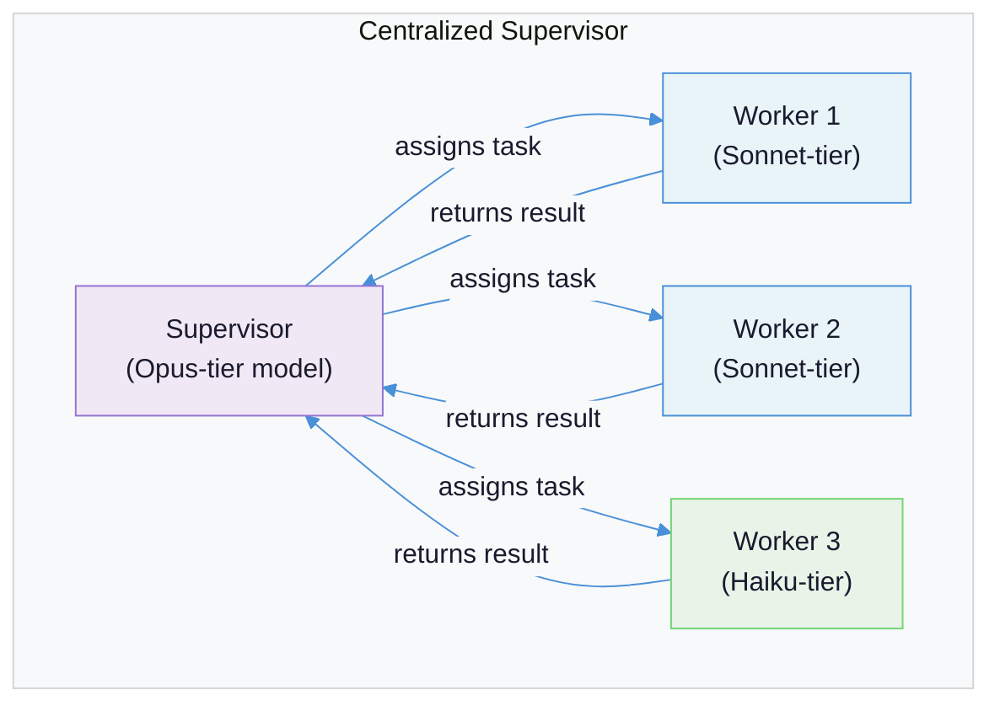
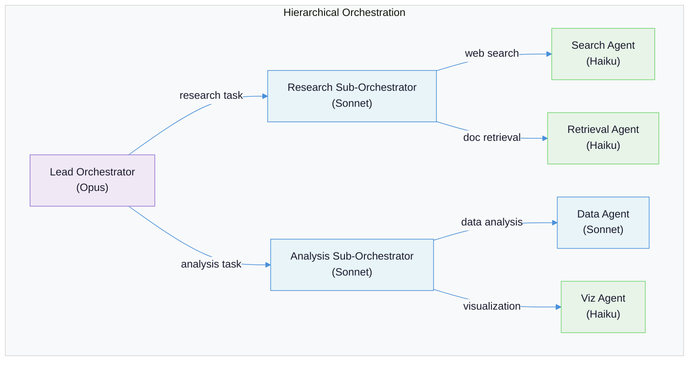
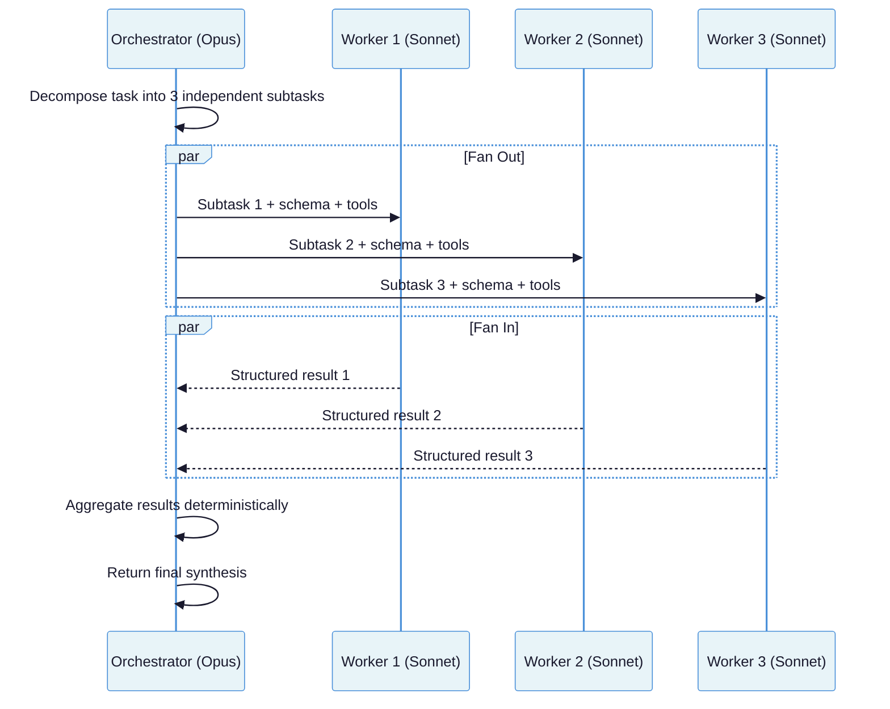

# Multi-Agent Coordination: The Pattern You Should Almost Never Use

You have exhausted every simpler option -- single calls, pipelines, routers, orchestrator-workers, evaluator-optimizers, and autonomous agents -- and your evaluation data proves that a single agent cannot handle the task. Only now should you be reading this.

**Thesis:** Multi-agent coordination is the most powerful pattern in the LLM toolkit and the one you should almost never reach for; the systems that genuinely benefit are fewer than 0.1% of production use cases.

**Prerequisites:** [AI-Native Solution Patterns](ai-native-solution-patterns.md) (the complexity escalation ladder and the seven patterns you should try first), [LLM Role Separation](llm-role-separation-executor-evaluator.md) (per-agent model assignment patterns), [Memory and State Management](memory-and-state-management.md) (multi-agent memory architectures), [Quality Gates](quality-gates-in-agentic-systems.md) (why self-enforcement fails), [Cost Engineering](cost-engineering-for-llm-systems.md) (the token economics that make multi-agent expensive).

**Reading time:** 35 minutes

---

## The Core Tension

Multi-agent systems promise parallel intelligence -- multiple specialized models working together on problems too complex for any single agent. **Coordination itself is a harder problem than most tasks you would assign to the agents**: solving the original problem now also means solving distributed consensus, shared state management, conflict resolution, and failure propagation, with probabilistic systems that hallucinate, lose context, and cannot reliably follow instructions.

The numbers are unambiguous. The [MAST taxonomy](https://arxiv.org/html/2503.13657v1) analyzed 1,600+ execution traces across seven multi-agent frameworks: **79% of failures originate from specification and coordination issues**, not from model capability, tool failures, or infrastructure. The agents can do the work; they cannot coordinate doing it.

| What teams assume | What actually happens |
|---|---|
| "Multiple agents = better results" | [Unstructured multi-agent networks amplify errors up to 17.2x](https://research.google/blog/towards-a-science-of-scaling-agent-systems-when-and-why-agent-systems-work/) against single-agent baselines |
| "An orchestrator is just overhead" | A centralized orchestrator contains the same error amplification to [4.4x](https://huggingface.co/papers/2512.08296) -- it acts as a validation bottleneck |
| "More agents = more capability" | Coordination returns turn [diminishing or negative once a single agent already clears about 45%](https://huggingface.co/papers/2512.08296) (beta = -0.408, p < 0.001); tool-heavy tasks suffer most under a fixed budget |
| "Multi-agent is the next step after single agent" | Multi-agent is [5-10x more expensive](ai-native-solution-patterns.md) and [15x more token-hungry](https://www.anthropic.com/engineering/multi-agent-research-system) than a single agent |
| "Frameworks make coordination easy" | Adding one verification step to a multi-agent coding framework lifted task success by [+15.6%](https://arxiv.org/html/2503.13657v3), with the same model -- the failure was structural, not a capability gap |
| "We need real-time agent collaboration" | [Complex multi-agent systems spend more time in agent-to-agent communication](https://youtu.be/uhJJgc-0iTQ) than on the actual task |


```mermaid
%%{init: {'theme': 'base', 'themeVariables': {'primaryColor': '#e8f4f8', 'primaryTextColor': '#1a1a2e', 'primaryBorderColor': '#4a90d9', 'lineColor': '#4a90d9', 'secondaryColor': '#fef3e2', 'tertiaryColor': '#f0e8f4', 'clusterBkg': '#f8f9fa', 'edgeLabelBackground': '#f8f9fa'}}}%%
graph TD
    subgraph Reality["The Coordination Tax"]
        A["Original Task<br/>Complexity: N"] --> B["+ Agent Communication<br/>Protocol design"]
        B --> C["+ State Synchronization<br/>Conflict resolution"]
        C --> D["+ Failure Propagation<br/>Cascading recovery"]
        D --> E["+ Context Management<br/>Per-agent windows"]
        E --> F["Total System Complexity<br/>5-20x original task"]
    end

    style A fill:#e8f4e8,stroke:#74d474
    style B fill:#fef3e2,stroke:#d4a574
    style C fill:#fef3e2,stroke:#d4a574
    style D fill:#fde8e8,stroke:#d47474
    style E fill:#fde8e8,stroke:#d47474
    style F fill:#8b1a1a,color:#fff,stroke:#5a0a0a
```

The correct question is never "should we use multi-agent?" It is: **"have we proven that every simpler pattern fails on this specific task, and is the value of the task high enough to justify 5-20x the cost?"**

---

## Failure Taxonomy

Before examining how to build multi-agent systems, understand the seven ways they break. These failure modes are specific to multi-agent coordination -- they do not exist in single-agent or pipeline architectures. Each is a reason not to build one without a mitigation strategy.

### Failure 1: Infinite Delegation Loops

**What it looks like:** A delegates to B, which delegates back to A (or to C, which delegates to A). The system burns tokens in a circle, producing nothing useful.

**Why it happens:** When agents can invoke other agents as tools, nothing structurally prevents cycles: each sees only its own context and makes locally rational decisions that create globally irrational loops. Unlike an infinite loop in code, every iteration costs money.

**Concrete example:** A 4-agent LangChain research system -- Research, Analysis, Verification, and Summary agents -- entered a recursive loop when the Analyzer and Verifier repeatedly re-delegated to each other. The loop ran for [11 days undetected, burning $47,000 in API costs](https://techstartups.com/2025/11/14/ai-agents-horror-stories-how-a-47000-failure-exposed-the-hype-and-hidden-risks-of-multi-agent-systems/) ($127 in week one, $891 in week two, $6,240 in week three, $18,400 in week four). Root cause: zero step limits, zero cost ceilings, zero real-time monitoring.

**Structural mitigation:** Hard iteration limits per agent, per conversation, and per system. Maximum delegation depth (A can call B, but B cannot call other agents). Cost circuit breakers that halt execution above a spend threshold.

### Failure 2: Context Contamination Between Agents

**What it looks like:** B's quality degrades because A's context, reasoning artifacts, or intermediate state leaked into its prompt -- invisibly, because it looks like normal input.

**Why it happens:** In shared-memory architectures, A's working notes, failed attempts, and abandoned reasoning paths persist in shared state and influence B's behavior, especially when B treats A's speculative output as fact. This is the multi-agent version of the [context leakage failure mode](llm-role-separation-executor-evaluator.md) documented in role separation.

**Concrete example:** In a multi-agent code review system, the Code Analyzer writes preliminary findings to shared state. The Security Reviewer reads them and anchors on them, missing vulnerabilities the Code Analyzer did not flag -- its "independent" assessment is contaminated by the first agent's framing.

**Structural mitigation:** Strict input/output contracts per agent. Agents receive only the original task and explicitly declared outputs from upstream agents -- never raw context, reasoning traces, or shared scratchpads. The [orchestrator-mediated memory pattern](memory-and-state-management.md) centralizes the flow between agents.

### Failure 3: Coordination Overhead Exceeding Task Value

**What it looks like:** The system produces correct results, but coordination cost and latency make it economically irrational: a single agent could have produced 80% of the quality at 10% of the cost.

**Why it happens:** Coordination requires communication, which consumes tokens. [Anthropic's own multi-agent research system](https://www.anthropic.com/engineering/multi-agent-research-system) measured that agents use ~4x more tokens than chat interactions, and multi-agent systems ~15x. Each agent needs context about the task, its role, other agents' outputs, and the coordination protocol -- overhead single-agent systems do not pay.

**The math:** A single-agent task costing $0.10 in tokens can cost $1.50 in a 4-agent system -- a 15x multiplier. At 10,000 requests/day, that is $450,000/month vs. $30,000/month, so the multi-agent system must deliver dramatically better results to justify the difference.

**Structural mitigation:** Cost-per-task budgets. A/B testing multi-agent against single-agent on production traffic with quality evaluation. Kill the multi-agent path unless it beats single-agent by a margin that justifies the cost delta.

### Failure 4: Compound Reliability Decay

**What it looks like:** Each individual agent succeeds 95% of the time, yet the multi-agent system as a whole succeeds far less often than expected, in ways no single agent failure explains.

**Why it happens:** Reliability compounds multiplicatively, not additively: a 20-step pipeline of 95%-reliable steps has overall reliability of 0.95^20 = **35.8%**. As [The Multi-Agent Trap](https://towardsdatascience.com/the-multi-agent-trap/) puts it: "You started with agents that succeed 19 out of 20 times. You ended with a system that fails nearly two-thirds of the time."

The [Google/MIT study of 180 multi-agent configurations](https://research.google/blog/towards-a-science-of-scaling-agent-systems-when-and-why-agent-systems-work/) quantified the error amplification: independent (unstructured) networks amplify errors **17.2x** against single-agent baselines; even centralized (orchestrated) systems amplify them **4.4x**. Two further effects bound when coordination can pay: a tool-coordination trade-off, where tool-heavy tasks suffer disproportionately under a fixed compute budget, and capability saturation, where coordination returns turn negative once single-agent baselines exceed roughly 45% (beta = -0.408, p < 0.001).


```mermaid
%%{init: {'theme': 'base', 'themeVariables': {'primaryColor': '#e8f4f8', 'primaryTextColor': '#1a1a2e', 'primaryBorderColor': '#4a90d9', 'lineColor': '#4a90d9', 'secondaryColor': '#fef3e2', 'tertiaryColor': '#f0e8f4', 'clusterBkg': '#f8f9fa', 'edgeLabelBackground': '#f8f9fa'}}}%%
graph LR
    subgraph Decay["Compound Reliability Decay"]
        S1["Agent 1<br/>95%"] --> S2["Agent 2<br/>95%"]
        S2 --> S3["Agent 3<br/>95%"]
        S3 --> S4["Agent 4<br/>95%"]
        S4 --> S5["..."]
        S5 --> S20["Agent 20<br/>95%"]
        S20 --> R["System<br/>35.8%"]
    end

    style S1 fill:#e8f4e8,stroke:#74d474
    style S2 fill:#eef4e8,stroke:#94d474
    style S3 fill:#fef3e2,stroke:#d4a574
    style S4 fill:#fde8e2,stroke:#d48474
    style S20 fill:#fde8e8,stroke:#d47474
    style R fill:#8b1a1a,color:#fff,stroke:#5a0a0a
```

**Structural mitigation:** Minimize sequential agent dependencies. Use parallel (MapReduce) patterns instead of chains. Add quality gates between agents with the ability to retry or escalate. Design for the system reliability you need, then work backwards to the per-agent reliability required.

### Failure 5: Cascading Failures When One Agent Breaks

**What it looks like:** One agent errors, produces malformed output, or times out. The failure propagates: downstream agents receive bad input, produce bad output, and feed it back into the loop. The system either crashes or produces confidently wrong results.

**Why it happens:** Multi-agent systems have the same failure propagation problems as distributed microservices, without the decades of engineering practice (circuit breakers, bulkheads, retry with backoff) built for traditional systems. Most frameworks do not implement these patterns by default.

**Structural mitigation:** Circuit breakers per agent. Timeout budgets per agent call. Fallback paths (if Agent B fails, the orchestrator uses a simpler alternative). Structured error responses that downstream agents can detect and handle, rather than natural-language descriptions incorporated as if they were valid output.

### Failure 6: Specification Drift Through Handoffs

**What it looks like:** The original task specification mutates as it passes through multiple agents: by the time the final agent acts, the task has been subtly reinterpreted, with constraints dropped or goals shifted.

**Why it happens:** Each agent "understands" the task through its own context window: when A summarizes for B, information is lost or reframed, and B's summary for C compounds the drift. This is the multi-agent version of the [telephone game](quality-gates-in-agentic-systems.md) -- the gate instruction that said "verify architectural consistency" becomes "check that the code looks reasonable" after several handoffs.

**The MAST data:** Specification and system design failures account for [41.77% of all multi-agent failures](https://arxiv.org/html/2503.13657v1), the single largest category; within it, "disobeying task/role specifications" and "context loss" are the most frequent modes.

**Structural mitigation:** Pass the original task specification to every agent, not a summary. Use structured schemas for inter-agent communication so fields cannot be silently dropped, and include the original success criteria in every agent's context.

### Failure 7: The Scaling Ceiling

**What it looks like:** Adding a fifth or sixth agent does not improve results: performance plateaus or degrades, latency and cost rise, and the extra agents add coordination overhead without proportional capability gains.

**Why it happens:** Interaction complexity scales combinatorially: 2 agents = 1 interaction pair, 4 agents = 6 pairs, 10 agents = 45 pairs. The [Google/MIT study](https://research.google/blog/towards-a-science-of-scaling-agent-systems-when-and-why-agent-systems-work/) measures why the curve flattens: only centralized topologies contain error amplification, and coordination returns turn negative once a single agent already clears about 45% on the task. Anthropic's own multi-agent research system initially spawned [up to 50 subagents for simple queries](https://www.anthropic.com/engineering/multi-agent-research-system) before it was constrained.

**Structural mitigation:** Start with the minimum viable number of agents, and add one only when evaluation data shows a specific capability gap. Monitor per-agent contribution to quality -- if the marginal contribution is negative, remove the agent.

---

## The Coordination Spectrum

Not all multi-agent systems require the same coordination complexity. The right architecture depends on whether agents need to share state, communicate during execution, or simply work independently and have their results aggregated. This spectrum runs from zero coordination (embarrassingly parallel) to full real-time collaboration.


```mermaid
%%{init: {'theme': 'base', 'themeVariables': {'primaryColor': '#e8f4f8', 'primaryTextColor': '#1a1a2e', 'primaryBorderColor': '#4a90d9', 'lineColor': '#4a90d9', 'secondaryColor': '#fef3e2', 'tertiaryColor': '#f0e8f4', 'clusterBkg': '#f8f9fa', 'edgeLabelBackground': '#f8f9fa'}}}%%
graph TD
    subgraph Spectrum["Coordination Complexity Spectrum"]
        L1["Level 0: No Coordination<br/>MapReduce / fan-out-fan-in<br/>Agents never communicate"]
        L2["Level 1: Sequential Handoff<br/>Pipeline of agents<br/>Output of A is input to B"]
        L3["Level 2: Hierarchical Delegation<br/>Orchestrator assigns, collects<br/>Workers never see each other"]
        L4["Level 3: Shared State<br/>Blackboard architecture<br/>Agents read/write common store"]
        L5["Level 4: Real-Time Collaboration<br/>Message passing / negotiation<br/>Agents communicate during execution"]
    end

    L1 --> L2 --> L3 --> L4 --> L5

    style L1 fill:#e8f4e8,stroke:#74d474
    style L2 fill:#eef4e8,stroke:#94d474
    style L3 fill:#fef3e2,stroke:#d4a574
    style L4 fill:#fde8e2,stroke:#d48474
    style L5 fill:#8b1a1a,color:#fff,stroke:#5a0a0a
```

### Level 0: No Coordination (MapReduce)

The safest pattern: an orchestrator splits work into independent chunks, fans out to parallel agents, and aggregates the results deterministically. Agents never communicate; each returns a structured result, and the orchestrator handles synthesis.

Their [multi-agent research system](https://www.anthropic.com/engineering/multi-agent-research-system) uses a lead agent (Claude Opus) spawning subagents (Claude Sonnet) for parallel web searches. The subagents never interact -- they search independently, return findings, and the lead synthesizes. It outperformed single-agent by [90.2%](https://www.anthropic.com/engineering/multi-agent-research-system) on research tasks, and parallel tool calling cut research time by up to 90% for complex queries.

**When it works:** The task decomposes into independent subtasks with no data dependencies -- code review across files, research across sources, evaluation across dimensions.

**When it breaks:** Subtasks are not actually independent -- agents need each other's partial results to do their own work.

### Level 1: Sequential Handoff

Agents form a pipeline: A completes its work and passes the result to B. This is what Anthropic calls [workflows of agents](https://youtu.be/uhJJgc-0iTQ) -- each step is an agentic loop that iterates until it produces a satisfactory result.

**When it works:** The task has natural phases with clear boundaries (research -> analysis -> writing -> editing), each benefiting from a specialized agent with different tools, prompts, or model selection.

**When it breaks:** Later agents need to revise earlier agents' work. The pipeline becomes a loop, and you have moved to Level 3+ complexity without the architecture to support it.

### Level 2: Hierarchical Delegation

A central orchestrator decomposes the task, delegates subtasks to specialized workers, and synthesizes their results. Workers never communicate -- all coordination flows through the orchestrator. This is the [orchestrator-workers pattern](ai-native-solution-patterns.md) extended with agentic workers.

Sub-agents appear as **tools** to the parent agent. As [Erik Schluntz explains](https://youtu.be/uhJJgc-0iTQ), "The parent passes prompts as parameters, and sub-agents return results." The orchestrator need not know that its "tools" are themselves LLM agents.

**When it works:** The orchestrator can decompose the task without intermediate results from workers, and workers have distinct specializations (different tools, model tiers, or prompts).

**When it breaks:** The orchestrator becomes a bottleneck. Task decomposition is ambiguous and requires iteration. Workers produce conflicting results the orchestrator cannot reconcile without sending them back for revision.

### Level 3: Shared State (Blackboard)

Agents read and write a shared data store -- the "blackboard." Each observes the current state, contributes what it can, and modifies it; a controller decides which agent activates next. Borrowed from classical AI (Erman et al., 1980s) and adapted for LLM agents.

**When it works:** The problem requires incremental refinement by different specialists contributing different perspectives to a shared artifact (collaborative document editing, iterative design).

**When it breaks:** Conflict resolution becomes intractable: two agents modify the same field simultaneously, and the blackboard grows unbounded, filling context windows with irrelevant state. This is where most multi-agent systems fail in practice.

### Level 4: Real-Time Collaboration

Agents communicate during execution, negotiate decisions, and coordinate actions in real time. This is the pattern most people imagine when they think "multi-agent" -- and the one that almost never works in production.

**When it works:** The task genuinely requires negotiation between agents with different objectives or information (adversarial debate, red-team/blue-team security evaluation).

**When it breaks:** Almost always. The communication overhead dominates. [Complex multi-agent systems spend more time in agent-to-agent communication than making progress on the actual task](https://youtu.be/uhJJgc-0iTQ). Same problem as large organizations with excessive meetings.

---

## Communication Patterns

Four patterns dominate, each with different tradeoffs.

### Shared Message Bus

All agents publish to and subscribe from a shared channel; any agent can see any message. Inspired by event-driven microservices.


```mermaid
%%{init: {'theme': 'base', 'themeVariables': {'primaryColor': '#e8f4f8', 'primaryTextColor': '#1a1a2e', 'primaryBorderColor': '#4a90d9', 'lineColor': '#4a90d9', 'secondaryColor': '#fef3e2', 'tertiaryColor': '#f0e8f4', 'clusterBkg': '#f8f9fa', 'edgeLabelBackground': '#f8f9fa'}}}%%
graph TD
    subgraph Bus["Shared Message Bus"]
        A1["Agent 1"] -->|publish| MB["Message Bus"]
        A2["Agent 2"] -->|publish| MB
        A3["Agent 3"] -->|publish| MB
        MB -->|subscribe| A1
        MB -->|subscribe| A2
        MB -->|subscribe| A3
    end

    style MB fill:#fef3e2,stroke:#d4a574
    style A1 fill:#e8f4f8,stroke:#4a90d9
    style A2 fill:#e8f4f8,stroke:#4a90d9
    style A3 fill:#e8f4f8,stroke:#4a90d9
```

**Advantages:** Decoupled agents. Easy to add new agents. Natural event sourcing.
**Disadvantages:** Every agent's context window grows with every message. No natural ordering or conflict resolution, so agents react to stale messages. Context pollution is nearly guaranteed at scale.
**Best for:** Logging, monitoring, and auditing -- systems where agents need awareness of the whole conversation but act independently.
**Real implementation:** [calfkit](https://github.com/calf-ai/calfkit-sdk) decomposes agents into microservices over Kafka, with inference, tool execution, and routing as separate event-driven concerns.

### Direct Messaging (Point-to-Point)

Agents communicate directly with specific others. The topology is explicit: A can call B, but not C.

**Advantages:** Minimal context pollution -- agents see only messages addressed to them -- and clear communication boundaries.
**Disadvantages:** Rigid topology -- adding agents requires updating communication paths -- and difficult to debug because no single point has the full conversation history.
**Best for:** Well-defined workflows whose communication graph is known at design time.

### Hierarchical Reporting

Agents report only to their supervisor, which aggregates and delegates. Workers never communicate laterally.

**Advantages:** Clean information hierarchy: the supervisor has full context, workers have minimal context (only their task), and the supervisor is the only point of token multiplication.
**Disadvantages:** Supervisor bottleneck: if it fails, the entire subtree fails, and workers cannot adapt to each other's partial results without going through it.
**Best for:** Most production multi-agent systems. This is the default recommendation.

### Blackboard Architecture

A shared data structure all agents can read and write. A controller activates agents based on its current state.

**Advantages:** Flexible -- agents contribute asynchronously without knowing about each other. Naturally handles incremental refinement.
**Disadvantages:** Conflict resolution is hard, stale reads are possible, and the blackboard can grow unbounded. [MongoDB's analysis](https://www.mongodb.com/company/blog/technical/why-multi-agent-systems-need-memory-engineering) compares this to the database revolution: "Just as databases transformed software from single-user programs to multi-user applications, shared persistent memory systems enable AI to evolve from single-agent tools to coordinated teams." Databases needed transactions, locking, and isolation levels for concurrent access; agent blackboards need the same, and most implementations lack it.
**Best for:** Iterative refinement tasks where the "right" sequence of agent contributions is not known in advance.

| Pattern | Context Growth | Conflict Risk | Debugging | Scalability |
|---|---|---|---|---|
| Message Bus | O(agents x messages) | High | Hard (distributed) | Good (decoupled) |
| Direct Messaging | O(relevant messages) | Low | Hard (no central view) | Poor (rigid topology) |
| Hierarchical | O(supervisor context) | Low (centralized) | Easy (supervisor trace) | Moderate (bottleneck) |
| Blackboard | O(blackboard size) | High (concurrent writes) | Moderate (state snapshots) | Good (async) |

---

## Orchestration Models

Three orchestration models exist, with different tradeoffs.

### Centralized Supervisor

One agent controls everything: it decomposes the task, assigns work, collects results, handles errors, and produces the final output. Workers are stateless tools.


```mermaid
%%{init: {'theme': 'base', 'themeVariables': {'primaryColor': '#e8f4f8', 'primaryTextColor': '#1a1a2e', 'primaryBorderColor': '#4a90d9', 'lineColor': '#4a90d9', 'secondaryColor': '#fef3e2', 'tertiaryColor': '#f0e8f4', 'clusterBkg': '#f8f9fa', 'edgeLabelBackground': '#f8f9fa'}}}%%
graph TD
    subgraph Centralized["Centralized Supervisor"]
        S["Supervisor<br/>(Opus-tier model)"] -->|"assigns task"| W1["Worker 1<br/>(Sonnet-tier)"]
        S -->|"assigns task"| W2["Worker 2<br/>(Sonnet-tier)"]
        S -->|"assigns task"| W3["Worker 3<br/>(Haiku-tier)"]
        W1 -->|"returns result"| S
        W2 -->|"returns result"| S
        W3 -->|"returns result"| S
    end

    style S fill:#f0e8f4,stroke:#9474d4
    style W1 fill:#e8f4f8,stroke:#4a90d9
    style W2 fill:#e8f4f8,stroke:#4a90d9
    style W3 fill:#e8f4e8,stroke:#74d474
```

**Advantages:** Simple to reason about, clear authority, centralized error handling, and the supervisor's context holds the full execution history. Natural cost optimization: an expensive model (Opus) for the supervisor, cheaper models (Sonnet, Haiku) for workers.

**Disadvantages:** Single point of failure. The supervisor's context window limits concurrent tasks, and it must understand every worker's domain well enough to assign and evaluate.

**Model assignment pattern:** The supervisor should be the most capable model available; workers can be cheaper models, matched to task complexity. [Anthropic's multi-agent research system](https://www.anthropic.com/engineering/multi-agent-research-system) uses Claude Opus as the lead agent and Claude Sonnet for subagents, and [HYDRA-style routing](https://www.anthropic.com/engineering/multi-agent-research-system) goes further -- executive agents get frontier models, worker agents get cost-optimized models. For per-agent assignment across frameworks, see [LLM Role Separation](llm-role-separation-executor-evaluator.md).

**This is the recommended default for production systems.**

### Decentralized Peer-to-Peer

No central authority: agents coordinate by message passing, reaching consensus among themselves. Inspired by distributed systems protocols.

**Advantages:** No single point of failure. Can scale to more agents without a bottleneck.

**Disadvantages:** Consensus is hard. LLM agents are not reliable enough for distributed consensus protocols. There is no equivalent of Paxos or Raft for probabilistic agents. In practice, decentralized multi-agent systems [degrade performance on sequential reasoning tasks by 39-70%](https://research.google/blog/towards-a-science-of-scaling-agent-systems-when-and-why-agent-systems-work/) compared to centralized approaches.

**When to consider:** Almost never for production. Research settings where exploring diverse approaches matters more than convergence reliability.

### Hierarchical With Sub-Orchestrators

A top-level orchestrator delegates to sub-orchestrators, each managing its own team of workers -- the multi-agent equivalent of organizational hierarchy.


```mermaid
%%{init: {'theme': 'base', 'themeVariables': {'primaryColor': '#e8f4f8', 'primaryTextColor': '#1a1a2e', 'primaryBorderColor': '#4a90d9', 'lineColor': '#4a90d9', 'secondaryColor': '#fef3e2', 'tertiaryColor': '#f0e8f4', 'clusterBkg': '#f8f9fa', 'edgeLabelBackground': '#f8f9fa'}}}%%
graph TD
    subgraph Hierarchy["Hierarchical Orchestration"]
        Top["Lead Orchestrator<br/>(Opus)"] -->|"research task"| SO1["Research Sub-Orchestrator<br/>(Sonnet)"]
        Top -->|"analysis task"| SO2["Analysis Sub-Orchestrator<br/>(Sonnet)"]
        SO1 -->|"web search"| W1["Search Agent<br/>(Haiku)"]
        SO1 -->|"doc retrieval"| W2["Retrieval Agent<br/>(Haiku)"]
        SO2 -->|"data analysis"| W3["Data Agent<br/>(Sonnet)"]
        SO2 -->|"visualization"| W4["Viz Agent<br/>(Haiku)"]
    end

    style Top fill:#f0e8f4,stroke:#9474d4
    style SO1 fill:#e8f4f8,stroke:#4a90d9
    style SO2 fill:#e8f4f8,stroke:#4a90d9
    style W1 fill:#e8f4e8,stroke:#74d474
    style W2 fill:#e8f4e8,stroke:#74d474
    style W3 fill:#e8f4f8,stroke:#4a90d9
    style W4 fill:#e8f4e8,stroke:#74d474
```

**Advantages:** Natural decomposition for complex multi-domain tasks: each sub-orchestrator manages a bounded problem, and context windows stay manageable because each level summarizes for the level above.

**Disadvantages:** Deep hierarchies introduce latency and cost multiplication. Information must traverse the hierarchy, with summarization losses at each level. Specification drift (Failure 6) is most severe in hierarchical systems.

**When to consider:** Tasks that naturally decompose into 2-3 distinct domains, each requiring its own tool set and specialized reasoning -- complex research, or multi-document analysis across different document types.

---

## Shared State Management

The hardest engineering problem in multi-agent systems is not the agents but the state they share. When two agents modify the same state, you have a distributed systems problem with none of the guarantees traditional distributed systems provide.

### Orchestrator-Mediated Memory (Recommended)

The [Anthropic orchestrator-workers pattern](https://www.anthropic.com/research/building-effective-agents) uses the orchestrator as the central memory aggregator. Workers return condensed summaries (typically [1,000-2,000 tokens per subagent return](https://www.anthropic.com/engineering/effective-context-engineering-for-ai-agents)). The orchestrator synthesizes results and maintains the canonical state, which centralizes conflict resolution at the cost of a bottleneck.

```python
# Sub-agent-as-tool pattern: orchestrator calls agents like tools
def run_research_agent(query: str) -> ResearchResult:
    """Each subagent receives: objective, output format, tool access,
    task boundaries. Returns structured result, not raw context."""
    result = agent.run(
        prompt=f"""Research the following query and return findings.
        Query: {query}
        Return: A structured summary with sources, key findings,
        and confidence level. Maximum 1500 tokens.""",
        tools=["web_search", "web_fetch"],
        max_tokens=2000,
        timeout_seconds=120,
        cost_limit_usd=0.50
    )
    return parse_research_result(result)

# Orchestrator uses agents as tools
orchestrator_tools = [
    run_research_agent,   # Subagent wrapped as tool
    run_analysis_agent,   # Subagent wrapped as tool
    run_code_review_agent # Subagent wrapped as tool
]
```

**The critical design principle:** Each subagent needs an [objective, an output format, guidance on tools and sources, and clear task boundaries](https://www.anthropic.com/engineering/effective-context-engineering-for-ai-agents). The orchestrator provides all four, and receives only the structured result -- never the subagent's full context window. This is how you prevent context contamination (Failure 2).

### Blackboard With Metadata

For systems that genuinely need shared mutable state, every write must include metadata: which agent wrote it, when, with what confidence, and whether it supersedes a previous entry. Without it, conflict resolution is impossible.

```python
@dataclass
class BlackboardEntry:
    agent_id: str
    timestamp: float
    content: dict
    confidence: float  # 0.0-1.0
    supersedes: str | None  # ID of entry this replaces
    entry_type: str  # "fact", "hypothesis", "decision", "artifact"
```

**Conflict resolution strategies:**
- **Last-writer-wins:** Simple but information-destructive; appropriate only for idempotent operations.
- **Confidence-weighted merge:** Higher-confidence entries take precedence. Requires calibrated confidence scores, which LLMs are bad at producing.
- **Orchestrator arbitration:** Conflicting entries are flagged for the orchestrator to resolve. This is the most reliable approach but adds latency.

As detailed in [Memory and State Management](memory-and-state-management.md): **start with orchestrator-mediated memory.** Move to a blackboard only when the orchestrator bottleneck is proven to be the limiting factor.

### Event Sourcing

Instead of mutable shared state, agents emit immutable events, and the current state is derived by replaying the log. This provides natural audit trails, debugging capability, and the ability to "rewind" to any point in the conversation.

**Advantages:** Full auditability. Conflict-free (events are append-only). Natural fit for testing (replay events to reproduce behavior).
**Disadvantages:** State derivation adds latency. Event log grows unbounded. Agents must work with eventually-consistent state.
**Best for:** Systems that require audit trails, regulatory compliance, or reproducible debugging.

---

## The MapReduce Pattern: When Multi-Agent Actually Works

The MapReduce pattern is the most valuable multi-agent architecture because it eliminates coordination overhead entirely. It is the pattern [Anthropic uses in their own multi-agent research system](https://www.anthropic.com/engineering/multi-agent-research-system), and the one to reach for first.

### How It Works

1. **Decompose**: The orchestrator splits the task into N independent subtasks
2. **Map**: N agents execute their subtasks in parallel with no communication
3. **Reduce**: The orchestrator aggregates results deterministically


```mermaid
%%{init: {'theme': 'base', 'themeVariables': {'primaryColor': '#e8f4f8', 'primaryTextColor': '#1a1a2e', 'primaryBorderColor': '#4a90d9', 'lineColor': '#4a90d9', 'secondaryColor': '#fef3e2', 'tertiaryColor': '#f0e8f4', 'clusterBkg': '#f8f9fa', 'edgeLabelBackground': '#f8f9fa'}}}%%
sequenceDiagram
    participant O as Orchestrator (Opus)
    participant W1 as Worker 1 (Sonnet)
    participant W2 as Worker 2 (Sonnet)
    participant W3 as Worker 3 (Sonnet)

    O->>O: Decompose task into 3 independent subtasks
    par Fan Out
        O->>W1: Subtask 1 + schema + tools
        O->>W2: Subtask 2 + schema + tools
        O->>W3: Subtask 3 + schema + tools
    end
    par Fan In
        W1-->>O: Structured result 1
        W2-->>O: Structured result 2
        W3-->>O: Structured result 3
    end
    O->>O: Aggregate results deterministically
    O->>O: Return final synthesis
```

### Why It Works When Other Patterns Fail

- **No coordination overhead.** Agents never communicate: the only inter-agent traffic is the initial fan-out and the final fan-in, both mediated by the orchestrator.
- **Linear cost scaling.** Cost is proportional to the number of subtasks, not combinatorial with the number of agents.
- **Parallelism is real.** Wall-clock time is determined by the slowest agent, not the sum of all agents.
- **Failures are isolated.** If one worker fails, the orchestrator retries or proceeds with partial results; failures cannot cascade because workers do not communicate.

### Concrete Architecture: Multi-Dimensional Code Review

One of the 2-3 use cases where multi-agent genuinely outperforms single-agent:

```python
# MapReduce code review: 5 independent dimensions evaluated in parallel
review_dimensions = {
    "correctness": {
        "agent_model": "claude-sonnet-4-20250514",
        "prompt": "Review this code for logical correctness, edge cases, "
                  "and potential bugs. Ignore style and architecture.",
        "tools": ["read_file", "grep_codebase", "run_tests"]
    },
    "security": {
        "agent_model": "claude-sonnet-4-20250514",
        "prompt": "Review this code for security vulnerabilities. "
                  "Check OWASP Top 10, injection risks, auth issues.",
        "tools": ["read_file", "grep_codebase", "security_scanner"]
    },
    "performance": {
        "agent_model": "claude-haiku-4-5-20251001",
        "prompt": "Review this code for performance issues. "
                  "Check algorithmic complexity, N+1 queries, memory leaks.",
        "tools": ["read_file", "grep_codebase", "profiler"]
    },
    "architecture": {
        "agent_model": "claude-sonnet-4-20250514",
        "prompt": "Review this code for architectural consistency. "
                  "Check against the architecture doc.",
        "tools": ["read_file", "grep_codebase", "read_architecture_doc"]
    },
    "test_coverage": {
        "agent_model": "claude-haiku-4-5-20251001",
        "prompt": "Review test coverage for this code. "
                  "Identify untested paths and missing edge cases.",
        "tools": ["read_file", "grep_codebase", "coverage_report"]
    }
}

# Fan out: launch all 5 reviews in parallel
results = await asyncio.gather(*[
    run_review_agent(dim, config)
    for dim, config in review_dimensions.items()
])

# Reduce: aggregate into severity-sorted report
report = aggregate_reviews(results, sort_by="severity")
```

Each reviewer is independent. The security reviewer does not need to know what the performance reviewer found. The orchestrator aggregates mechanically, which produces better results than a single agent reviewing all five dimensions sequentially, because each agent has a focused context and specialized tooling.

### Concrete Architecture: Deep Research

The other use case where multi-agent clearly wins:

An orchestrator decomposes a research question into 3-5 sub-questions, spawns parallel research agents (each with web search and document retrieval tools), collects their findings, identifies gaps or contradictions, optionally spawns a second round of targeted agents, and synthesizes the final answer. This is how [Anthropic's multi-agent research system works](https://www.anthropic.com/engineering/multi-agent-research-system).

The key insight: research is **embarrassingly parallel**. Searching five databases simultaneously is 5x faster than searching them sequentially; the only dependency is in synthesis, which the orchestrator handles.

---

## Agent Handoff Protocols

When a task transfers from one agent to another, the handoff protocol determines whether context is preserved or lost. The sub-agent-as-tool pattern is the recommended approach.

### The Sub-Agent-As-Tool Pattern

The receiving agent is wrapped as a tool callable by the sending agent. The tool interface enforces a structured contract:

```python
@tool(
    name="delegate_to_analyst",
    description="Delegate a data analysis task to the analyst agent. "
                "Provide the complete dataset reference, analysis question, "
                "and expected output format."
)
def delegate_to_analyst(
    dataset_ref: str,        # What data to analyze
    question: str,           # What to find out
    output_format: str,      # How to structure the result
    constraints: list[str],  # What NOT to do
    context: str             # Why this analysis is needed
) -> AnalysisResult:
    """The tool schema IS the handoff protocol.
    Required fields prevent incomplete handoffs."""
    ...
```

**Why this works:** Required fields mean the sending agent must provide all necessary context, and the receiving agent gets a clean, structured input -- not a dump of the sender's entire context window. Type safety prevents the telephone-game degradation of Failure 6.

### What to Include in a Handoff

Every handoff must contain:
1. **The original task** (not a summary of a summary)
2. **The specific subtask** for this agent
3. **The output schema** the agent must conform to
4. **Relevant facts discovered so far** (curated, not raw)
5. **What NOT to do** (negative constraints prevent scope creep)
6. **Success criteria** (how the orchestrator will evaluate the result)

### What to Exclude from a Handoff

- Raw reasoning traces from previous agents
- Failed attempts or abandoned approaches
- Internal coordination metadata
- Other agents' prompts or system instructions

---

## Cost and Latency Reality

Multi-agent systems are expensive, and the cost is measured in production deployments.

### Token Economics

| Architecture | Tokens per Task | Cost Multiplier | Source |
|---|---|---|---|
| Single LLM call | 1x (baseline) | 1x | -- |
| Pipeline (3-5 steps) | 3-5x | 3-5x | [Cost Engineering](cost-engineering-for-llm-systems.md) |
| Single agent with tools | ~4x | 4x | [Anthropic](https://www.anthropic.com/engineering/multi-agent-research-system) |
| Multi-agent (4 agents) | ~15x | 10-15x | [Anthropic](https://www.anthropic.com/engineering/multi-agent-research-system) |
| Autonomous multi-agent | 50-100x+ | 50-100x | [Cost Engineering](cost-engineering-for-llm-systems.md) |

At scale, these multipliers decide viability:

| Monthly Volume | Single Agent | Multi-Agent (4) | Delta |
|---|---|---|---|
| 1,000 requests/day | $3,000/month | $45,000/month | +$42,000 |
| 10,000 requests/day | $30,000/month | $450,000/month | +$420,000 |
| 100,000 requests/day | $300,000/month | $4,500,000/month | +$4,200,000 |

### Cost Optimization: Cascaded Model Routing

The most effective cost optimization for multi-agent systems is **cascaded model routing** -- cheap models for most agents, expensive models only where quality demands it.

The [BudgetMLAgent study](https://arxiv.org/abs/2411.07464) demonstrated this: cascading from free-tier models (Gemini Pro) through mid-tier (GPT-3.5-Turbo) to frontier (GPT-4) "lifelines" cut costs by **94.2%** (from $0.931 to $0.054 per task) while improving success rate from 22.72% to 32.95%. The cheap model handles 70%+ of tasks; the expensive model is invoked only on failures.

As Anthropic notes: ["Upgrading to Claude Sonnet 4 is a larger performance gain than doubling the token budget on Claude Sonnet 3.7."](https://www.anthropic.com/engineering/multi-agent-research-system) Spend on model quality, not on more agents.

### Latency

Multi-agent systems add latency three ways:
1. **Sequential agent calls** -- each handoff is a full LLM inference round
2. **Orchestrator overhead** -- it processes every result before delegating the next task
3. **Coordination protocol** -- shared state reads/writes, conflict resolution, retries

For MapReduce patterns, latency is bounded by the slowest parallel agent plus orchestrator overhead. For sequential patterns, latency is the sum of all agent calls: a 4-agent sequential system with 2-second average agent response time has a minimum 8-second latency before any result.

---

## Framework Comparison

Four approaches to building multi-agent systems, with different tradeoffs.

| Dimension | AutoGen | CrewAI | LangGraph | Custom Orchestration |
|---|---|---|---|---|
| **Architecture** | Conversational agents | Role-based teams | Graph-based state machine | Whatever you build |
| **Strength** | Rapid prototyping, human-in-loop | Business workflows, role specialization | Complex conditional flows, stateful execution | Full control, minimal abstraction |
| **Learning curve** | Low | Low-Medium | Medium-High | High (but no framework to learn) |
| **Production readiness** | Maintenance mode -- superseded by Microsoft Agent Framework 1.0 (generally available April 2026) | Moderate (commercial licensing) | High (LangSmith observability) | Depends entirely on you |
| **Debugging** | Hard (conversational logs) | Moderate (crew execution traces) | Good (LangSmith integration) | Best (you own the code) |
| **Best for** | Research, collaborative problem-solving | Customer support, content pipelines | Stateful workflows, multi-conditional paths | When you understand the problem deeply |
| **Backing** | Microsoft/Azure | Independent | LangChain ecosystem | -- |

### When to Use Each

**AutoGen:** You are prototyping, need human-in-the-loop, and want conversational agent patterns where agents discuss tasks. Good for research, poor for production workflows. Note the September 2026 position: AutoGen and Semantic Kernel are in maintenance mode and Microsoft's forward path is Agent Framework 1.0. New features land in the successor, not here, and the migration is a re-architecture rather than a find-and-replace. Anything you build on AutoGen today is a migration you already owe.

**CrewAI:** You have a well-defined team metaphor (researcher + writer + editor), and your workflow maps naturally to roles with sequential or hierarchical delegation. Beware the role-playing overhead -- agents spend tokens maintaining their "persona."

**LangGraph:** You need stateful, conditional workflows with branching logic and complex control flow (retry on failure, conditional escalation, parallel branches that converge). The most mature production option as of September 2026.

**Custom orchestration:** You have proven the task needs multi-agent, understand the coordination requirements deeply, and want to avoid framework abstraction overhead while keeping full control over prompts, routing, and error handling. [Anthropic recommends this approach](https://www.anthropic.com/research/building-effective-agents): "Frameworks often create extra layers of abstraction that can obscure the underlying prompts and responses, making them harder to debug."

**The recommendation:** Start with custom orchestration for your specific use case. Move to a framework only when it solves a coordination problem you cannot solve more simply yourself.

### Admit a Framework the Way You Admit Any Dependency

A framework in a coordinated system is not a convenience, it is a component you can no longer verify, bound, or replace -- and the table above shows why that matters. That churn is the reason the decision has to be recorded rather than assumed.

Record the candidate list and the deciding criterion before you adopt. A written rejection -- "tightly coupled to one agent library", "an abstraction over framework interfaces rather than a minimal core", "dependency churn" -- is one the next engineer can audit instead of re-litigating. A rejection made by taste is not a finding. This is the same discipline described as Principle 7 in [Self-Improving Systems](self-improving-systems.md), applied to the build decision rather than the learning loop.

---

## The Testing Problem

Multi-agent systems are harder to test than any other LLM architecture because the interaction space is combinatorial: a single agent has one prompt and one set of tool calls to verify, while a 4-agent system adds agent-to-agent interactions, shared state mutations, ordering effects, and failure cascades that multiply the test surface.

### Testing Strategies

**1. Unit test each agent in isolation.** Verify that each agent handles its specific task correctly when given well-formed input. If individual agents are unreliable, multi-agent coordination amplifies their failures (the compound reliability decay from Failure 4).

**2. Contract testing between agents.** Define the input/output schema for every inter-agent communication, and test that (a) each agent conforms to its output schema, (b) each agent handles malformed input gracefully, and (c) the schemas are compatible at every connection point.

**3. Conversation replay.** Record full multi-agent execution traces (all messages, state changes, and tool calls) in production, then replay them in test environments to verify that behavior is consistent. Because the events are immutable, any scenario is reproducible.

**4. Simulation environments.** For systems that interact with external tools, build mock environments that simulate tool responses. The goal is not tool correctness (that is unit testing) but coordination when tools return unexpected results, fail, or return slowly.

**5. Adversarial testing.** Inject failures: one agent returns garbage, one times out, two return contradictory results. Verify that the system degrades gracefully rather than cascading.

**6. Cost testing.** Every test run logs total tokens consumed and total cost. Set cost thresholds in CI: if a multi-agent test exceeds expected cost by more than 2x, it fails. This catches delegation loops early.

```python
# Example: cost-bounded multi-agent test
@pytest.fixture
def cost_tracker():
    tracker = CostTracker(max_cost_usd=5.00)
    yield tracker
    assert tracker.total_cost < tracker.max_cost, (
        f"Multi-agent test exceeded cost budget: "
        f"${tracker.total_cost:.2f} > ${tracker.max_cost:.2f}"
    )

def test_research_pipeline(cost_tracker):
    result = run_multi_agent_research(
        query="Analyze the competitive landscape for X",
        cost_tracker=cost_tracker,
        max_agents=4,
        timeout_seconds=300
    )
    assert result.confidence > 0.7
    assert len(result.sources) >= 3
    assert cost_tracker.total_cost < 2.00  # Budget for this specific test
```

---

## Where Multi-Agent Genuinely Wins

The genuine use cases share three characteristics:

1. **The task decomposes into independent subtasks** that benefit from parallel execution
2. **The value per task is high enough** to justify 5-15x cost (research that saves hours of human time, review that catches production bugs, analysis that informs million-dollar decisions)
3. **Different subtasks require genuinely different capabilities** (different tools, model tiers, or prompt strategies)

### Use Case 1: Deep Research

**Why single-agent fails:** Context window limitations: a single agent cannot hold 20 search results, 5 full documents, and its synthesis reasoning in one context window, and later analysis degrades as the context fills.

**Why multi-agent works:** Each research agent has a fresh, focused context window and the orchestrator receives only summaries, so parallelism cuts wall-clock time by 3-5x. Anthropic measured a [90.2% improvement](https://www.anthropic.com/engineering/multi-agent-research-system) over single-agent.

**Production example:** [Klarna's multi-agent customer service system](https://towardsdatascience.com/the-multi-agent-trap/) handles 2.3 million conversations per month (workload of 700 human agents), reduced resolution time from 11 minutes to under 2 minutes, improved customer satisfaction by 47%, and has saved approximately $60 million through late 2025.

### Use Case 2: Multi-Dimensional Evaluation

An orchestrator sends the same artifact to 5 independent evaluator agents, each assessing a different dimension. Results are aggregated into a severity-rated report.

**Why single-agent fails:** A single agent evaluating 5 dimensions in one pass suffers from the [position bias and verbosity bias](llm-role-separation-executor-evaluator.md) documented in role separation: later dimensions get less attention, and the agent anchors on its first assessment.

**Why multi-agent works:** Each evaluator has a clean context with only the artifact and its specific evaluation rubric -- no anchoring, no position effects -- and different evaluators can use different model families for [genuine evaluation independence](llm-role-separation-executor-evaluator.md). The aggregation is deterministic.

### Use Case 3: Tool-Specialized Delegation

A lead agent receives a complex task requiring 100+ tools. Instead of loading all of them into one context (which wastes tokens and degrades tool selection), it delegates to specialist agents, each with ~20 relevant tools.

**Why single-agent fails:** Tool selection accuracy degrades with the number of available tools: an agent with 100 tools makes worse choices than one with 20.

**Why multi-agent works:** Each specialist has a focused tool set, and the lead agent only needs to know which specialist to delegate to. [Anthropic reports](https://www.anthropic.com/engineering/advanced-tool-use) that tool-testing agents rewriting descriptions for other agents produced **40% faster task completion**.

---

## Self-Improvement in Multi-Agent Systems

Multi-agent architectures can form self-improvement loops when one agent's output is evaluated by another agent's judgment. The key structural requirement is [evaluator independence](llm-role-separation-executor-evaluator.md) -- the evaluating agent must use a different model family than the executing agent, and must not have access to the executor's reasoning context.

The risk is **metric proxy collapse**: the executor learns what the evaluator rewards and optimizes for the metric rather than the underlying quality. In multi-agent systems, this happens faster because the feedback loop is tighter. For the full treatment of self-improvement dynamics, see [Self-Improving Systems](self-improving-systems.md) (Document 17 in this series).

---

## Field Notes from an Operating Estate

**September 2026 -- the coordination cost that mattered was duplicated machinery, not agent count.** A practitioner operating an estate of a dozen agent harnesses found that the expensive coordination was never agent-to-agent messaging. It was the same safety check, the same verification step, and the same gate re-implemented separately in each harness, drifting apart at different rates. Consolidating one shared gate behind every harness removed more real failure modes than any change to the number of agents. The lesson generalises: before you add an agent to coordinate, count the components you are already coordinating twice.

**September 2026 -- the verifier that earned its place was not another agent.** Building a reflective plan-execute-assess-reflect loop, the estate made the assessment step deterministic rather than conversational: declarative verification steps drawn from an allowlist of check kinds, a per-criterion verdict of addressed, partial, or missing, and a judge that sees only the expected value and the actual value. The rejection rule is explicit -- every failure carries findings back to the reflect step. This is the cheap-verification principle the research keeps pointing at, implemented without a second LLM agent in the loop.

**September 2026 -- the framework candidates were rejected by measurement, and the reasons were written down.** The same design evaluated the obvious published agent frameworks and adopted none. Each rejection carries a disqualifying property rather than a preference: coupling to a single agent library, an abstraction over framework interfaces instead of a minimal core, dependency churn. What shipped uses only the language standard library behind typed seams. A recorded rejection is worth more than a defended one, because the next engineer can audit it.

---

## The Hard Truth

The multi-agent pattern is the most seductive architecture in the LLM ecosystem because it maps to a human intuition -- teams of specialists outperform generalists. That intuition is misleading. Human teams have decades of shared context, protocols for conflict resolution, and the ability to interrupt each other mid-sentence. LLM agents have none of this: they communicate through serialized text, lose context at every handoff, and cannot detect when another agent has gone off the rails until the malformed output arrives.

The uncomfortable reality: **most multi-agent systems would produce better results as a well-designed single agent with good tools and a larger context window.** The teams that genuinely benefit tried everything simpler first, measured the gap, and can point to specific capability limitations (context window exhaustion, tool selection degradation, evaluation independence) that only multi-agent can address.

If you cannot articulate the specific single-agent limitation you are solving, you do not need multi-agent. You need a better prompt, better tools, or a more capable model. As [Anthropic states](https://www.anthropic.com/research/building-effective-agents): "Even though the models are much more capable today than they were a year ago, simplicity is still a really important thing."

---

## Summary Checklist

| Question | Good Answer | Bad Answer |
|---|---|---|
| Have you proven single-agent insufficient with evaluation data? | Yes, with metrics showing the gap | "Multi-agent seems like the right approach" |
| Can you articulate the specific single-agent limitation? | "Context window exhausts at 80K tokens during research synthesis" | "We need more capability" |
| Does the task decompose into independent subtasks? | Yes, no data dependencies during execution | Subtasks require real-time communication |
| Are you using MapReduce (Level 0) before considering higher levels? | Yes, fan-out/fan-in with no inter-agent communication | Agents communicate during execution |
| Is your orchestration model centralized? | Yes, one supervisor with full visibility | Agents negotiate peer-to-peer |
| Do you have per-agent cost limits, iteration caps, and timeouts? | Yes, structural guardrails enforced in code | "We trust the agents to stop when done" |
| Is the value per task high enough to justify 5-15x cost? | Each task saves hours of human work or prevents costly errors | Routine, high-volume, low-value tasks |
| Are you monitoring per-agent contribution to quality? | Yes, ablation tests show each agent's marginal value | "More agents is better" |
| Do you have contract tests between agents? | Yes, schema validation on every inter-agent message | Agents communicate in free-form text |
| Can you replay and reproduce any multi-agent execution? | Yes, full execution traces with deterministic replay | Non-deterministic, non-reproducible |

---

## References

### Research Papers

- **Cemri et al., "Why Do Multi-Agent LLM Systems Fail?" (2025)** -- The MAST taxonomy: 14 failure modes across 1,600+ traces, 79% from specification/coordination issues. [https://arxiv.org/html/2503.13657v1](https://arxiv.org/html/2503.13657v1)
- **Google/MIT, "Towards a Science of Scaling Agent Systems" (2026)** -- 180 configurations across 5 architectures; 17.2x error amplification in unstructured networks against 4.4x for centralized coordination; a tool-coordination trade-off; and capability saturation (beta = -0.408, p < 0.001) once single-agent baselines exceed about 45%. [https://research.google/blog/towards-a-science-of-scaling-agent-systems-when-and-why-agent-systems-work/](https://research.google/blog/towards-a-science-of-scaling-agent-systems-when-and-why-agent-systems-work/) | [Paper](https://huggingface.co/papers/2512.08296)
- **BudgetMLAgent (2024)** -- Cascaded LLM orchestration achieving 94.2% cost reduction while improving success rate. [https://arxiv.org/abs/2411.07464](https://arxiv.org/abs/2411.07464)

### Practitioner Articles

- **Anthropic, "Building Effective Agents" (2025)** -- The canonical guide to agent patterns: 5 workflow architectures, agents vs. workflows, sub-agent-as-tool. [https://www.anthropic.com/research/building-effective-agents](https://www.anthropic.com/research/building-effective-agents)
- **Anthropic, "How We Built Our Multi-Agent Research System" (2025)** -- Anthropic's own multi-agent architecture: 90.2% improvement, 4x/15x token multipliers, 50-subagent early failure. [https://www.anthropic.com/engineering/multi-agent-research-system](https://www.anthropic.com/engineering/multi-agent-research-system)
- **Anthropic, "Effective Context Engineering for AI Agents" (2025)** -- Context engineering as the successor to prompt engineering: finite attention budget, 1,000-2,000 token subagent summaries. [https://www.anthropic.com/engineering/effective-context-engineering-for-ai-agents](https://www.anthropic.com/engineering/effective-context-engineering-for-ai-agents)
- **Erik Schluntz and Alex Albert, "Building More Effective AI Agents" (Anthropic Video, 2025)** -- Evolution from workflows to agents to workflows-of-agents; sub-agents as tools; overbuilt communication overhead. [https://youtu.be/uhJJgc-0iTQ](https://youtu.be/uhJJgc-0iTQ)
- **"The Multi-Agent Trap" (Towards Data Science, 2025)** -- Compound reliability math, 4-agent saturation ceiling, Klarna case study ($60M savings). [https://towardsdatascience.com/the-multi-agent-trap/](https://towardsdatascience.com/the-multi-agent-trap/)
- **InfoQ, "Google Multi-Agent Scaling Principles" (2026)** -- Summary of the Google/MIT study: tool-coordination tradeoff, capability saturation. [https://www.infoq.com/news/2026/03/google-multi-agent/](https://www.infoq.com/news/2026/03/google-multi-agent/)

### Cost and Failure Case Studies

- **TechStartups, "AI Agents Horror Stories: $47,000 Failure" (2025)** -- Case study of the 11-day agent loop in a 4-agent LangChain system. [https://techstartups.com/2025/11/14/ai-agents-horror-stories-how-a-47000-failure-exposed-the-hype-and-hidden-risks-of-multi-agent-systems/](https://techstartups.com/2025/11/14/ai-agents-horror-stories-how-a-47000-failure-exposed-the-hype-and-hidden-risks-of-multi-agent-systems/)
- **Galileo, "Why Multi-Agent LLM Systems Fail" (2025)** -- Cost data ($0.10 single to $1.50 multi-agent), 93% of teams lack evaluation consistency, 40% project cancellation projection. [https://galileo.ai/blog/multi-agent-llm-systems-fail](https://galileo.ai/blog/multi-agent-llm-systems-fail)
- **Augment Code, "Why Multi-Agent Systems Fail and How to Fix Them" (2025)** -- PwC 7x accuracy, AWS 70% speed gains, JSON schema specifications for agent contracts. [https://www.augmentcode.com/guides/why-multi-agent-llm-systems-fail-and-how-to-fix-them](https://www.augmentcode.com/guides/why-multi-agent-llm-systems-fail-and-how-to-fix-them)

### Framework Documentation

- **DataCamp, "CrewAI vs LangGraph vs AutoGen" (2025)** -- Architectural comparison of three dominant frameworks. [https://www.datacamp.com/tutorial/crewai-vs-langgraph-vs-autogen](https://www.datacamp.com/tutorial/crewai-vs-langgraph-vs-autogen)
- **AutoGen in maintenance mode / Microsoft Agent Framework 1.0 (2026)** -- AutoGen and Semantic Kernel moved to maintenance mode when Agent Framework reached 1.0 in April 2026; the migration is a re-architecture from conversational agents to graph-based workflows. [https://capitalpathai.com/blog/autogen-maintenance-mode-migration](https://capitalpathai.com/blog/autogen-maintenance-mode-migration)

### Related Documents in This Series

- [AI-Native Solution Patterns](ai-native-solution-patterns.md) -- The seven patterns and escalation ladder; try all of these before multi-agent
- [LLM Role Separation: Executor vs Evaluator](llm-role-separation-executor-evaluator.md) -- Per-agent model assignment for AutoGen, CrewAI, DSPy; evaluation independence
- [Memory and State Management](memory-and-state-management.md) -- Multi-agent memory architectures, orchestrator-mediated vs. blackboard
- [Cost Engineering for LLM Systems](cost-engineering-for-llm-systems.md) -- Token economics, the runaway agent problem, cost control
- [Quality Gates in Agentic Systems](quality-gates-in-agentic-systems.md) -- Why self-enforcement fails; specification drift through handoffs
- [Self-Improving Systems](self-improving-systems.md) -- Multi-agent self-improvement loops, evaluator independence

---

*Last reviewed: September 2026. Changed in this revision: the myth-versus-reality table was rebuilt on verified figures -- the unverifiable ChatDev 25% baseline and +14% rows were replaced by the measured +15.6% verification intervention, and the Google/MIT error-amplification finding now carries its published saturation and tool-coordination results; the AutoGen column records the move to maintenance mode and the Agent Framework 1.0 successor; and the front matter, field notes, and framework-admission principle were added; and the Failure 3 cost arithmetic was corrected -- its monthly pair and the monthly-volume table now both derive from the cited per-task figures ($0.10 single, $1.50 multi-agent), which they previously contradicted.*
