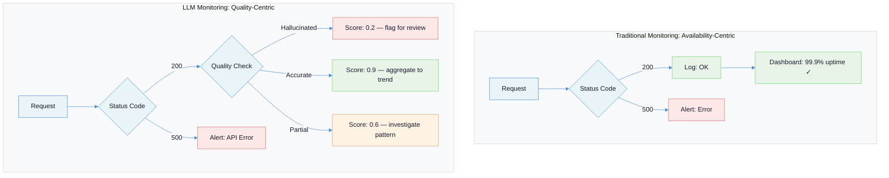
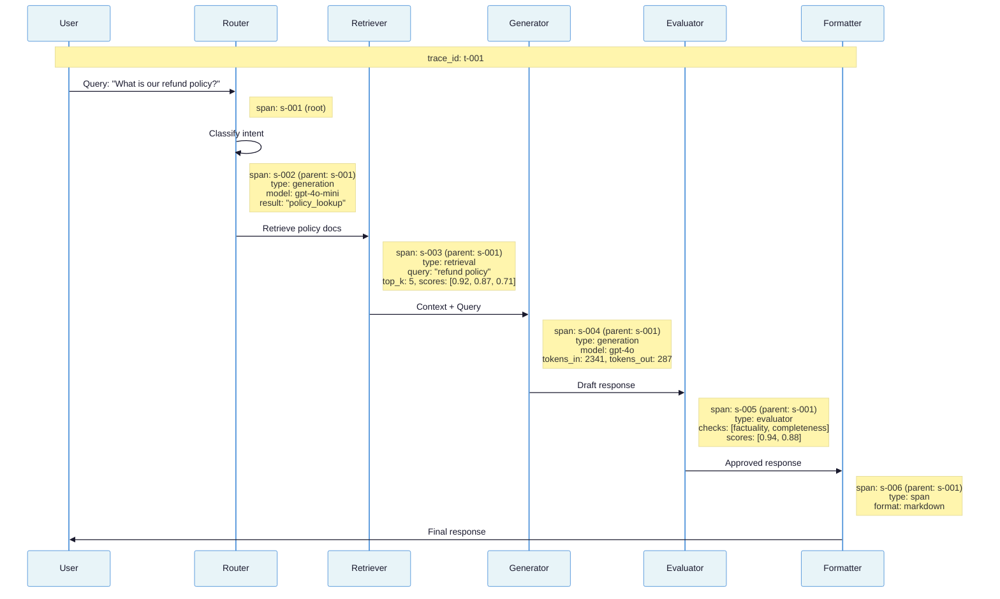
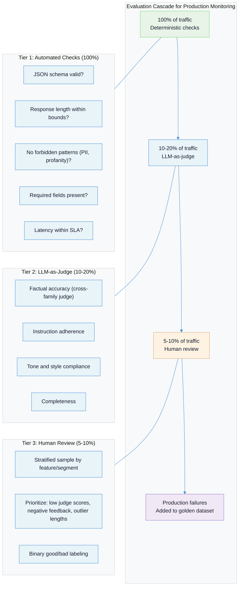
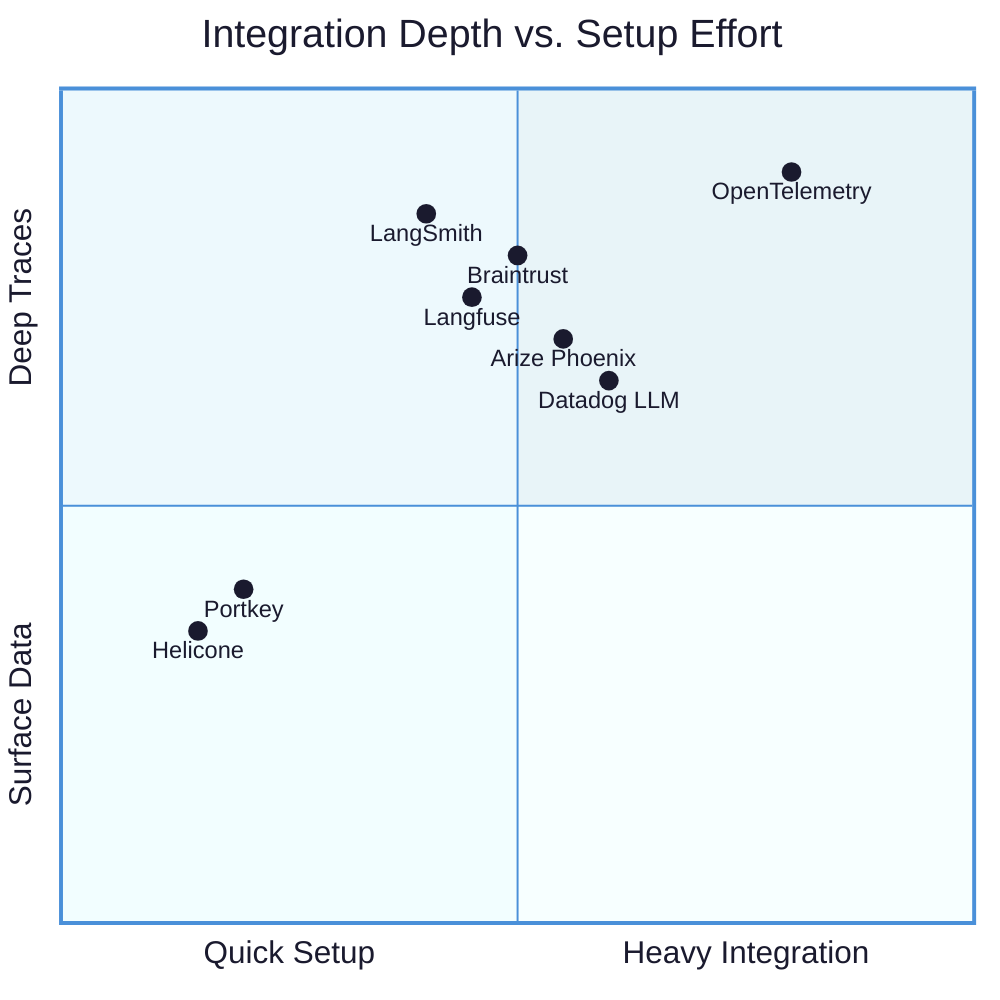

# Observability and Monitoring for LLM Systems: Why You Cannot Debug Non-Determinism with grep

Traditional application monitoring assumes a contract: given input X, the system produces output Y. When Y is wrong, you read the logs, find the line that diverged, and fix it. LLM systems violate this contract at every level. The same input produces different outputs across calls. "Correct" is a distribution, not a value. And the most dangerous failures look exactly like success -- confident, well-formatted, completely wrong.

---

## The Problem: Your Logging Is Lying to You

There is a fundamental mismatch between what traditional observability captures and what you need to understand an LLM system. A conventional HTTP service logs request, response, status code, latency. If the status code is 200, the service is working. If the latency is under your SLA, the service is fast enough. These binary signals -- working/broken, fast/slow -- have been the foundation of monitoring for decades.

LLM systems return 200 on every call that does not hit a rate limit. The response is always well-formed JSON. The latency is always within the provider's documented range. And the output might be a hallucinated answer that costs you a customer, a subtly wrong extraction that corrupts your database, or a perfectly formatted response that violates your business rules. Status code 200. Latency nominal. System green. User furious.

| Dimension | Traditional Monitoring | LLM Monitoring |
|-----------|----------------------|----------------|
| **Correctness** | Deterministic: assert output equals expected | Statistical: quality is a distribution across runs |
| **Failure signal** | Error codes, exceptions, stack traces | Confident wrong answers, subtle quality drift |
| **Cost model** | Fixed per request (compute + bandwidth) | Variable per request (token volume, model tier) |
| **Debugging** | Read logs, reproduce locally, step through code | Replay traces, compare prompt variants, run N times |
| **Quality threshold** | Binary pass/fail per test | Confidence intervals over batches |
| **Root cause** | Line of code, specific commit | Prompt wording, context assembly, model update, input distribution shift |

The core tension: **LLM observability requires measuring quality, not just availability.** Your system can be 100% available and 0% useful. Traditional monitoring cannot tell the difference.



---

## Failure Taxonomy: Seven Ways LLM Observability Breaks

### Failure Mode 1: Logging the Wrong Layer

**What it looks like:** You have detailed logs of every HTTP request to the LLM provider. You know the status codes, the latencies, the error rates. But when a user reports a bad answer, you cannot explain why the model produced it because you did not capture the rendered prompt, the retrieved context, or the model's raw output before post-processing.

**Why it happens:** Teams instrument at the API client layer (the HTTP call to OpenAI/Anthropic) instead of at the semantic layer (the full prompt after template rendering, context injection, and RAG retrieval). The HTTP layer tells you *that* a call happened. The semantic layer tells you *what* the model saw and *what* it said. Without the semantic layer, you are debugging with one eye closed.

**Example:** A RAG pipeline retrieves three documents, injects them into a prompt template, calls GPT-4o, and post-processes the response into structured JSON. The API log shows: `POST /chat/completions 200 1.2s 847 tokens`. The user got a wrong answer. To debug, you need: which documents were retrieved (and their relevance scores), what the full prompt looked like after assembly, what the model's raw response was before JSON extraction, and whether the extraction step lost information. None of this is in the HTTP log.

### Failure Mode 2: Treating Quality as Binary

**What it looks like:** Your monitoring dashboard shows "eval pass rate: 94%." Looks great. But 94% of *what*? The pass rate conflates easy inputs (where the model always succeeds) with hard inputs (where it fails 60% of the time). The aggregate hides the distribution.

**Why it happens:** Teams run a single quality metric across all traffic without stratification. A system that handles 90% simple queries and 10% complex queries can show 94% quality while being catastrophically bad at the hard cases. [Hamel Husain argues](https://hamel.dev/blog/posts/evals/) that generic quality scores like helpfulness or BERTScore "do not capture application-specific quality" and should be replaced with failure-mode-specific assertions discovered through manual error analysis.

**Example:** A customer support bot handles password resets (trivial, 85% of volume) and billing disputes (complex, 15% of volume). Overall satisfaction: 91%. Billing dispute satisfaction: 52%. The aggregate metric masks a business-critical failure.

### Failure Mode 3: No Trace Correlation Across Steps

**What it looks like:** You can see individual LLM calls in your logs, but you cannot reconstruct the full journey of a user request through a multi-step pipeline. The router call, the worker call, and the evaluator call each appear as isolated events.

**Why it happens:** Multi-step pipelines require explicit trace propagation -- a trace ID that flows through every step and links parent spans to child spans. Without this, each LLM call is an island. When the final output is wrong, you cannot determine which step introduced the error: did the router misclassify? Did the retriever fetch irrelevant documents? Did the generator hallucinate despite good context? Did the evaluator pass a bad output?

**Example:** An agent system processes a user query through: intent classification -> document retrieval -> answer generation -> citation verification -> response formatting. The final answer has a wrong citation. Without trace correlation, you have five independent log entries with no way to determine that the retriever returned an outdated document, which the generator faithfully cited, and the citation verifier passed because the URL was valid (just stale).

### Failure Mode 4: Alert Fatigue from Latency-Only Alerting

**What it looks like:** Your on-call engineer gets paged because p99 latency crossed 5 seconds. They check. The provider had a momentary slowdown. It resolved itself. This happens three times a week. Meanwhile, model quality degraded 15% over two weeks and nobody noticed because there is no quality alert.

**Why it happens:** Latency is easy to measure -- it is a number, it has obvious thresholds, and every monitoring tool supports it out of the box. Quality requires evaluation infrastructure. Most teams set up latency and error-rate alerts (because they know how) and never build quality alerts (because they do not). The result: alert fatigue on metrics that self-heal, silence on metrics that compound.

**Example:** After a provider model update, response latency stays constant but the model starts generating slightly longer outputs that dilute precision. Cost increases 20%. Quality decreases 10%. No alert fires because latency and error rate are unchanged. The team discovers the problem a month later when a quarterly review shows declining user satisfaction.

### Failure Mode 5: Missing Cost Attribution

**What it looks like:** Your monthly LLM bill is $47,000. You do not know which features, users, or prompt templates are responsible. You cannot make informed decisions about where to optimize because you cannot see where the money goes.

**Why it happens:** Token costs are per-call, but business decisions are per-feature. Without tagging each LLM call with its business context (feature name, user segment, prompt version), you have a pile of API invoices with no actionable breakdown. This failure mode is covered in depth in [Cost Engineering for LLM Systems](cost-engineering-for-llm-systems.md) -- what matters here is that cost attribution is an observability problem, not a billing problem. If your tracing does not carry feature tags, no amount of invoice analysis will help.

### Failure Mode 6: Silent Drift

**What it looks like:** The system worked well three months ago. It still "works" -- no errors, no latency spikes. But quality has gradually declined. Users have not complained loudly enough for anyone to investigate. The decline is only visible in aggregate trends that nobody is watching.

**Why it happens:** LLM quality can degrade for reasons entirely outside your control. Provider model updates change behavior without changing the API contract. Your input distribution shifts as your user base grows. Your RAG knowledge base becomes stale. [Traditional statistical tests like KL divergence or KS tests on token frequencies are blind to these changes](https://insightfinder.com/blog/hidden-cost-llm-drift-detection/) because semantic meaning shifts in embedding space without corresponding surface-level token distribution changes. Drift is invisible to infrastructure monitoring.

### Failure Mode 7: Debugging by Guessing

**What it looks like:** A user reports a bad output. The developer tries the same input manually. Gets a different (correct) result. Concludes "it works for me" and closes the ticket. The underlying issue persists.

**Why it happens:** LLM outputs are non-deterministic by default. [Reproducing a production failure requires freezing every variable](https://www.traceloop.com/blog/mastering-the-maze-tools-for-tracing-and-reproducing-non-deterministic-llm-failures-in-production): the exact rendered prompt (not the template, the fully assembled prompt with all context), the model version, all parameters (temperature, top_p, seed), and for agent systems, the state at each step. Without captured traces, reproduction is impossible because the developer is testing a different prompt (different context, different conversation history) against a potentially different model version.

---

## The Observability Maturity Spectrum

Not every LLM system needs full-stack observability from day one. The right investment depends on the consequences of failure and the system's complexity. But most production systems are stuck at Level 0-1 while their failure modes require Level 3+.

```mermaid
%%{init: {'theme': 'base', 'themeVariables': {'primaryColor': '#e8f4f8', 'primaryTextColor': '#1a1a2e', 'primaryBorderColor': '#4a90d9', 'lineColor': '#4a90d9', 'secondaryColor': '#fef3e2', 'tertiaryColor': '#f0e8f4', 'clusterBkg': '#f8f9fa', 'edgeLabelBackground': '#f8f9fa'}}}%%
graph TD
    subgraph Spectrum["Observability Maturity"]
        L0["Level 0: Blind<br/>API logs only — status codes and latency<br/>Cannot explain any output"]
        L1["Level 1: Logging<br/>Capture prompts, completions, token counts<br/>Can replay individual calls"]
        L2["Level 2: Tracing<br/>Parent-child spans across pipeline steps<br/>Can trace a request end-to-end"]
        L3["Level 3: Quality Monitoring<br/>Automated checks + sampled evaluation<br/>Can detect quality degradation"]
        L4["Level 4: Drift Detection<br/>Statistical monitoring of quality trends<br/>Can detect silent degradation"]
        L5["Level 5: Feedback Loop<br/>Production failures feed evaluation suite<br/>System improves from its own errors"]
    end

    L0 --> L1 --> L2 --> L3 --> L4 --> L5

    style L0 fill:#fde8e8,stroke:#d47474
    style L1 fill:#fef3e2,stroke:#d4a574
    style L2 fill:#fef3e2,stroke:#d4a574
    style L3 fill:#e8f4f8,stroke:#4a90d9
    style L4 fill:#e8f4e8,stroke:#74d474
    style L5 fill:#e8f4e8,stroke:#74d474
```



| Level | What You Can Do | What You Cannot Do | Appropriate For |
|-------|----------------|-------------------|-----------------|
| **0: Blind** | Know if API calls succeed | Explain any output | Nothing in production |
| **1: Logging** | Replay individual calls, compute cost | Trace multi-step flows, detect trends | Single-call prototypes |
| **2: Tracing** | Follow a request through a pipeline, pinpoint which step failed | Detect quality drift, measure quality over time | Multi-step pipelines with manual monitoring |
| **3: Quality Monitoring** | Detect quality drops within days, stratify by feature/segment | Detect gradual drift, predict degradation | Production systems with user-facing output |
| **4: Drift Detection** | Detect gradual degradation before users notice | Automatically improve from failures | High-stakes production, autonomous agents |
| **5: Feedback Loop** | Turn production failures into regression tests automatically | N/A -- this is the target state | Revenue-critical systems, continuous improvement |

The minimum viable level for any production LLM system is **Level 2** (tracing). Below that, you are operating blind when things go wrong. Level 3 should be the target within the first month of production deployment.

---

## Principles: What to Actually Build

### Principle 1: Log at the Semantic Layer, Not the Transport Layer

**Why it works:** Semantic-layer logging captures the information you actually need to debug: the fully rendered prompt (after template expansion, context injection, and RAG retrieval), the raw model output (before post-processing), and the business context (which feature, which user, which prompt version). Transport-layer logging (HTTP status, latency, raw bytes) tells you nothing about quality. This directly addresses Failure Mode 1.

**How to apply:** Instrument at the point where the prompt is assembled and where the response is consumed, not at the HTTP client. The [OpenTelemetry GenAI semantic conventions](https://opentelemetry.io/docs/specs/semconv/gen-ai/) define the standard schema. For every LLM call, capture:

```python
# Minimum viable logging per LLM call
trace_record = {
    # Trace context
    "trace_id": "abc-123",
    "span_id": "span-456",
    "parent_span_id": "span-000",       # Links to parent pipeline step

    # What the model saw
    "input": {
        "rendered_prompt": "...",         # Full prompt AFTER template + context
        "system_message": "...",
        "user_message": "...",
        "retrieved_context": [...],       # RAG documents with relevance scores
    },

    # What the model said
    "output": {
        "raw_completion": "...",          # Before post-processing
        "processed_output": "...",        # After extraction/formatting
    },

    # Model configuration
    "model": "gpt-4o-2024-11-20",
    "temperature": 0.7,
    "top_p": 1.0,
    "max_tokens": 2048,
    "seed": 42,                           # If set — critical for reproduction

    # Usage and cost
    "input_tokens": 1847,
    "output_tokens": 342,
    "cost_usd": 0.0127,
    "latency_ms": 1243,
    "time_to_first_token_ms": 287,        # For streaming

    # Business context
    "feature": "contract-summarizer",
    "user_id": "user-789",
    "session_id": "sess-012",
    "prompt_version": "v2.3.1",
    "environment": "production",
}
```

The [OTel convention recommends](https://opentelemetry.io/blog/2024/llm-observability/) capturing prompts and completions as span *events* rather than span *attributes* because the payloads are large and many backends struggle with them. Content capture should be opt-in (via `OTEL_INSTRUMENTATION_GENAI_CAPTURE_MESSAGE_CONTENT=true`) and gated by environment -- always in staging, sampled in production.

### Principle 2: Trace the Pipeline, Not Just the Calls

**Why it works:** Multi-step LLM systems fail between steps, not just within them. The retriever returns relevant documents but the prompt assembler truncates them. The generator produces a correct answer but the formatter mangles the structure. Without parent-child span relationships, each step looks fine in isolation while the end-to-end result is broken. This addresses Failure Mode 3.

**How to apply:** Adopt the hierarchy: Session > Trace > Span > Generation/Retrieval/Tool. Every span carries a `span_id` and `parent_span_id`. A `trace_id` groups all spans for a single request.



[Langfuse's data model](https://langfuse.com/docs/observability/data-model) captures this hierarchy natively with typed observations: Generation, Span, Agent, Tool, Retriever, Embedding, Evaluator, and Guardrail -- each with domain-specific fields. The key insight from their model is that observations are nested within traces, and traces are grouped into sessions, giving you three levels of zoom: individual call, full request, and user journey.

### Principle 3: Separate Quality Alerts from Infrastructure Alerts

**Why it works:** Latency spikes and error rates are infrastructure signals -- they self-heal or require infrastructure fixes. Quality degradation is a product signal -- it compounds silently and requires investigation. Mixing them in the same alert channel guarantees that infrastructure noise drowns out quality signals. This addresses Failure Mode 4.

**How to apply:** Create two distinct alert channels with different thresholds, escalation paths, and response playbooks:

| Alert Type | Example Metrics | Threshold Style | Response |
|-----------|----------------|-----------------|----------|
| **Infrastructure** | p99 latency, error rate, rate limit proximity, token throughput | Absolute: "p99 > 5s for 5 min" | Check provider status, scale, retry |
| **Quality** | Eval pass rate (per feature), drift score, guardrail block rate, user feedback ratio | Relative: "7-day rolling avg drops >10%" | Investigate traces, run error analysis, check for model update |

Quality alerts must be **relative to the system's own baseline**, not absolute thresholds. A system with 85% quality that drops to 75% needs investigation. A system with 95% quality that drops to 93% might be noise. Set thresholds based on the standard deviation of your rolling quality scores, not arbitrary numbers.

### Principle 4: Build the Evaluation Cascade into Monitoring

**Why it works:** Not every request needs the same level of quality verification. Running an LLM-as-judge on 100% of traffic is expensive and slow. Running it on 0% leaves you blind. A tiered cascade balances coverage with cost: cheap deterministic checks on everything, moderate LLM judges on a sample, expensive human review on a smaller sample. This connects directly to the evaluation cascade patterns in [LLM Role Separation](llm-role-separation-executor-evaluator.md).

**How to apply:**



The critical insight from [Hamel Husain's evaluation framework](https://hamel.dev/blog/posts/evals/): **use binary pass/fail, not scoring scales.** Binary labeling forces clearer thinking and produces more consistent labels. A 1-10 scale gives you the illusion of granularity while actually producing noisy, uncalibrated scores. When using LLM-as-judge, track its True Positive Rate and True Negative Rate against human labels -- if they diverge, the judge is unreliable and needs recalibration.

For the judge itself, use a different model family than the executor. [GPT-4 prefers its own outputs 87.8% of the time](https://arxiv.org/abs/2404.13076) -- same-family evaluation is structurally biased. See [LLM Role Separation](llm-role-separation-executor-evaluator.md) for the full treatment of evaluator independence.

### Principle 5: Detect Drift Before Users Do

**Why it works:** LLM quality degrades for reasons outside your control: provider model updates, shifting input distributions, stale knowledge bases, concept drift. By the time users complain, you have already lost their trust. Drift detection catches degradation in the gap between "metric changes" and "user notices." This addresses Failure Mode 6.

**How to apply:** [InsightFinder's drift taxonomy](https://insightfinder.com/blog/hidden-cost-llm-drift-detection/) identifies four drift types, each requiring different detection:

| Drift Type | What Changes | Detection Approach | Example Signal |
|-----------|-------------|-------------------|----------------|
| **Semantic** | Meaning of similar prompts shifts in embedding space | Embedding distribution monitoring | Cosine similarity between weekly prompt clusters drops below baseline |
| **Behavioral** | Model's reasoning patterns change | Output consistency scoring | Same prompt run 10 times produces higher variance than baseline |
| **Retrieval** | RAG knowledge base evolves, embeddings shift | Retrieval relevance score tracking | Average retrieval score for top-5 documents drops 15% |
| **Infrastructure** | Latency spikes, context truncation, throttling | Infrastructure metric correlation | Truncation rate increases after prompt template change |

The detection workflow:

1. **Establish baseline:** During a stable period, capture embedding distributions of prompts and responses, quality scores per feature, and response consistency on a set of canary prompts.
2. **Monitor continuously:** Compute the same metrics on rolling windows (daily for high-traffic, weekly for low-traffic).
3. **Alert on divergence:** When the current window's distribution diverges from baseline beyond a threshold (calibrated from historical variance), trigger an investigation alert -- not a page.
4. **Investigate, do not auto-remediate:** Drift alerts should open a ticket for error analysis, not trigger automatic rollbacks. The drift might be an improvement.

### Principle 6: Make Every Failure Reproducible

**Why it works:** Non-deterministic failures that cannot be reproduced cannot be fixed. They get closed as "cannot reproduce" and recur until someone captures enough state to isolate the cause. Comprehensive tracing makes every production failure a replayable test case. This addresses Failure Mode 7.

**How to apply:** When a failure is identified (via quality alert, user report, or sampled review):

1. **Retrieve the full trace.** Not just the final input/output, but every span in the pipeline: which documents were retrieved, what the full prompt was, what parameters were used, what the model returned at each step.

2. **Freeze the environment.** To reproduce, you need: the exact rendered prompt (from the trace), the model identifier (from the trace), all parameters including seed (from the trace), and for agent systems, the state at each decision point.

3. **Replay with temperature=0.** Set `temperature=0` and `seed` to a fixed value. This does not guarantee exact reproduction (providers do not guarantee determinism even at temperature=0), but it maximizes consistency across runs. If the failure reproduces at temperature=0, you have isolated a prompt/context problem. If it does not reproduce, the failure is temperature-sensitive -- run the prompt 20 times at the original temperature and check the failure rate.

4. **Convert to regression test.** The failing trace becomes a test case in your [evaluation suite](evaluation-driven-development.md). The input is the captured prompt. The expected behavior is defined by the failure mode (e.g., "must not hallucinate source", "must match schema"). This closes the feedback loop from production to development.

```python
# Converting a production trace to a regression test
def test_contract_summary_no_hallucinated_dates():
    """Regression: trace t-7291 hallucinated a renewal date.

    Root cause: retrieved contract had no renewal clause,
    but the prompt template said 'extract the renewal date'
    without a 'if not present, say N/A' instruction.
    """
    prompt = load_trace_prompt("t-7291")  # Exact prompt from production
    response = llm.generate(
        prompt=prompt,
        model="gpt-4o-2024-11-20",
        temperature=0,
        seed=42,
    )
    # The fix: prompt now includes "If not present, state N/A"
    assert "renewal date: N/A" in response.lower() or \
           "no renewal" in response.lower()
```

### Principle 7: Build Dashboards Around Your Failure Taxonomy, Not Generic Metrics

**Why it works:** Generic dashboards show latency, throughput, and error rate. These are infrastructure metrics that tell you whether the system is running, not whether it is working. [Hamel Husain warns](https://hamel.dev/blog/posts/evals/) against fixating on abstract quality scores like helpfulness or BERTScore -- they do not capture application-specific quality. The dashboard should reflect **your** failure modes, discovered through **your** error analysis. This addresses Failure Mode 2.

**How to apply:** After conducting error analysis (see [Evaluation-Driven Development](evaluation-driven-development.md), Step 5), you will have a failure taxonomy: the specific ways your system fails, categorized and quantified. Your dashboard should track the prevalence of each failure mode over time.

Essential dashboard panels:

**Cost tracking** (connects to [Cost Engineering](cost-engineering-for-llm-systems.md)):
- Daily cost by model, by feature, by prompt version
- Cost per successful output (cost / quality-passing outputs)
- Token usage breakdown: input vs. output, by feature
- Most expensive individual calls (outlier detection)

**Quality by failure mode:**
- Pass rate per deterministic check, trended over 30 days
- LLM-as-judge score distribution per feature (not aggregated)
- Failure mode prevalence: which failure categories are increasing?
- Quality score by user segment (power users vs. new users)

**Latency profile:**
- p50, p95, p99 for end-to-end pipeline latency
- Time-to-first-token (critical for streaming UX)
- Latency by pipeline step (to identify which step is the bottleneck)

**Drift indicators:**
- Rolling quality score baseline vs. current window
- Retrieval relevance score trend
- Response consistency score for canary prompts
- Input distribution shift (embedding cluster distances)

**Operational health:**
- Error rate by error type (rate limit, timeout, context overflow, tool call failure)
- Guardrail block rate and block reasons
- Evaluation coverage (% of traffic receiving each tier of evaluation)

---

## The Observability Tool Landscape

The LLM observability market has consolidated around three integration approaches: proxy-based (intercept API calls), SDK-based (instrument code), and OTel-native (extend existing telemetry). The choice depends on your existing infrastructure, your instrumentation budget, and how deep you need to see.



| Platform | Integration | Open Source | Self-Host | Eval Built-in | Best For | Free Tier |
|----------|------------|------------|-----------|--------------|----------|-----------|
| [**Langfuse**](https://langfuse.com/) | SDK | Yes (MIT) | Yes | LLM-as-judge, custom | Open-source, prompt management, typed traces | 50K obs/mo |
| [**Helicone**](https://www.helicone.ai/) | Proxy (1 line) | Yes | Yes | Basic | Fastest setup, cost tracking, session replay | 100K req/mo |
| [**Braintrust**](https://www.braintrust.dev/) | SDK | Partial | Yes | CI/CD-blocking evals | Eval-first teams, regression prevention | 1M spans/mo |
| [**Arize Phoenix**](https://phoenix.arize.com/) | SDK | Yes | Self-hosted | Drift, hallucination detection | ML teams, model quality monitoring | Unlimited (self-hosted) |
| [**LangSmith**](https://smith.langchain.com/) | SDK (1 env var) | No | Enterprise | Advanced LLM-as-judge | LangChain/LangGraph ecosystems | 5K traces/mo |
| [**Datadog LLM**](https://www.datadoghq.com/) | SDK (auto) | No | No | Via OTel | Enterprise with existing Datadog | N/A |
| [**Traceloop/OpenLLMetry**](https://www.traceloop.com/) | OTel-native | Yes | Yes | Basic | Teams with existing OTel stacks | OSS |

**Decision framework:**

- **"I need visibility in 15 minutes"** -- Helicone (proxy, one line change). You get cost tracking, request logging, and session replay. You do not get deep pipeline tracing.
- **"I need deep pipeline tracing and evals"** -- Langfuse (open-source, self-hostable) or Braintrust (eval-first). Both are framework-agnostic.
- **"I am already on LangChain/LangGraph"** -- LangSmith integrates with one environment variable. But you are locked to the LangChain ecosystem; [outside it, teams must assemble the orchestration layer themselves](https://www.braintrust.dev/articles/best-ai-observability-platforms-2025).
- **"I already have Datadog/Grafana/Prometheus"** -- Use [OpenTelemetry GenAI semantic conventions](https://opentelemetry.io/docs/specs/semconv/gen-ai/) with OTel Collector routing to your existing backends. [Datadog natively maps OTel GenAI conventions](https://www.datadoghq.com/blog/llm-otel-semantic-convention/) to its LLM Observability features.
- **"I need ML-grade drift detection"** -- Arize Phoenix, designed for embedding drift analysis and hallucination detection.

The strategic bet is **OpenTelemetry**. The `gen_ai.*` semantic conventions (currently in Development status) are being adopted by Datadog, Langfuse, Traceloop, and OpenLIT. Instrumenting with OTel now gives you vendor portability -- you can switch backends without re-instrumenting your code.

---

## Recommendations

### Short-term (Week 1-2): Get Visibility

1. **Add semantic logging to every LLM call.** Capture the minimum viable record (Principle 1): rendered prompt, raw completion, model, parameters, token counts, cost, trace ID, and business context tags. If you change nothing else, this one step converts every production failure from "cannot reproduce" to "let me pull the trace."

2. **Pick a platform and deploy.** If you have no LLM observability today, start with Helicone (proxy, 15-minute setup) for immediate cost and latency visibility. Plan migration to Langfuse or Braintrust for deeper tracing within a month.

3. **Tag every call with business context.** Feature name, user segment, prompt version, environment. Without these tags, you have data but no insight.

### Medium-term (Month 1-2): Add Quality Monitoring

4. **Build the evaluation cascade.** 100% deterministic checks (schema, length, forbidden patterns), 10-20% LLM-as-judge with a cross-family model, 5-10% human review prioritized by low judge scores and negative user feedback. See [Evaluation-Driven Development](evaluation-driven-development.md) for the eval infrastructure.

5. **Create quality alerts separate from infrastructure alerts.** Quality alerts fire on relative drops (rolling 7-day average), not absolute thresholds. Route them to a different channel than infrastructure alerts.

6. **Build dashboards around your failure taxonomy.** Conduct error analysis on 100+ production traces. Categorize failure modes. Track each mode's prevalence over time. See [Evaluation-Driven Development](evaluation-driven-development.md) for error analysis methodology.

### Long-term (Quarter 1-2): Close the Feedback Loop

7. **Implement drift detection.** Establish quality baselines. Monitor rolling windows. Alert when quality diverges beyond historical variance. Start with canary prompts (fixed inputs run daily, scores tracked for variance).

8. **Automate trace-to-test conversion.** When a production failure is identified, the trace should be convertible to a regression test with minimal manual effort. The failing prompt becomes the test input. The failure mode defines the assertion. This feeds the [evaluation flywheel](evaluation-driven-development.md).

9. **Correlate quality metrics with business metrics.** The ultimate observability goal is connecting LLM quality scores to business outcomes: user satisfaction, task completion rate, support ticket volume. When you can show that a 5% quality drop causes a 2% increase in support tickets, observability justifies its own investment.

---

## The Hard Truth

Most teams building with LLMs have better observability for their Redis cache than for the component that generates their product's core value. They can tell you the p99 latency of a key-value lookup but cannot tell you why their system told a customer the wrong refund policy yesterday.

This is not a tooling problem. The tools exist. Langfuse, Helicone, Braintrust, Arize Phoenix, and OpenTelemetry all provide robust LLM observability. The problem is that teams treat LLM monitoring as if it were the same problem as traditional APM: check that the API is up, check that latency is acceptable, done. This mindset is a category error. **An LLM system that is "up" and "fast" can still be silently wrong 20% of the time, and traditional monitoring will never tell you.**

The uncomfortable truth is that LLM observability is not an infrastructure investment -- it is a product quality investment. It requires building evaluation into the monitoring pipeline, not just alerting on errors. It requires treating quality as a continuous signal, not a binary gate. And it requires accepting that you will never be "done" with observability because non-deterministic systems require ongoing measurement the way deterministic systems do not. The system that measures itself is the system that improves. The system that does not is guessing.

---

## Summary Checklist

| Question | Good Answer | Bad Answer |
|----------|------------|------------|
| Can you retrieve the full rendered prompt for any production LLM call? | Yes, with trace ID lookup | No, we only log the template name |
| Can you trace a user request through every step of a multi-step pipeline? | Yes, parent-child spans with a single trace ID | No, each step logs independently |
| Do you know which features and user segments drive your LLM costs? | Yes, every call tagged with business context | No, we see the total monthly bill |
| Are your quality alerts separate from infrastructure alerts? | Yes, different channels and escalation paths | No, everything goes to the same PagerDuty |
| How do you detect quality degradation between model updates? | Rolling quality baselines with drift alerts | We wait for user complaints |
| When a user reports a bad output, can you reproduce it? | Yes, replay the exact trace with frozen parameters | No, we try the same input manually and get a different result |
| What percentage of production traffic gets quality evaluation? | 100% deterministic, 10-20% LLM judge, 5-10% human | We run evals before deployment, not in production |
| Do production failures feed back into your evaluation suite? | Yes, failing traces become regression test cases | No, we fix the prompt and move on |
| Do your dashboards track your specific failure modes? | Yes, each failure category trended over time | No, we track generic quality scores and latency |
| Can you tell whether your system improved or degraded this month? | Yes, quality score trends by feature and segment | We think so, based on fewer complaints |

---

## References

### Official Documentation and Standards
- [OpenTelemetry GenAI Semantic Conventions](https://opentelemetry.io/docs/specs/semconv/gen-ai/) -- Official `gen_ai.*` attribute namespace defining the standard schema for LLM telemetry
- [OpenTelemetry GenAI Metrics](https://opentelemetry.io/docs/specs/semconv/gen-ai/gen-ai-metrics/) -- Complete metric definitions: token usage, operation duration, time-to-first-token, time-per-output-token
- [OpenTelemetry Blog: LLM Observability with OpenTelemetry](https://opentelemetry.io/blog/2024/llm-observability/) -- Architecture guide for OTel collector config, signal types, and instrumentation with OpenLIT
- [OpenTelemetry Blog: Generative AI Instrumentation](https://opentelemetry.io/blog/2024/otel-generative-ai/) -- Python auto-instrumentation libraries and environment variables for content capture
- [Langfuse Tracing Data Model](https://langfuse.com/docs/observability/data-model) -- Observation-centric architecture: traces, sessions, and nested observations
- [Langfuse Observation Types](https://langfuse.com/docs/observability/features/observation-types) -- Typed observations (Generation, Span, Agent, Tool, Retriever, Evaluator, Guardrail) with field schemas

### Practitioner Articles
- [Hamel Husain: Your AI Product Needs Evals](https://hamel.dev/blog/posts/evals/) -- Three-level evaluation framework, error analysis methodology, production monitoring philosophy, and the data flywheel
- [Hamel Husain: Evals FAQ](https://hamel.dev/blog/posts/evals-faq/) -- Human review sampling strategies, binary vs. Likert evaluation, production monitoring frequency
- [InsightFinder: The Hidden Cost of LLM Drift](https://insightfinder.com/blog/hidden-cost-llm-drift-detection/) -- Drift taxonomy (semantic, behavioral, retrieval, infrastructure), why traditional statistical tests fail for LLM drift
- [Traceloop: Tracing and Reproducing Non-Deterministic LLM Failures](https://www.traceloop.com/blog/mastering-the-maze-tools-for-tracing-and-reproducing-non-deterministic-llm-failures-in-production) -- Two-pronged observability approach, failure-to-test-case conversion, unique request ID patterns
- [Helicone: Complete Guide to Debugging LLM Applications](https://www.helicone.ai/blog/complete-guide-to-debugging-llm-applications) -- Seven failure modes, session replay debugging, hallucination investigation workflow

### Tool Comparisons
- [Helicone: Complete Guide to LLM Observability Platforms](https://www.helicone.ai/blog/the-complete-guide-to-LLM-observability-platforms) -- 10-platform comparison matrix with integration approaches and pricing
- [Braintrust: Best AI Observability Platforms 2025](https://www.braintrust.dev/articles/best-ai-observability-platforms-2025) -- 7-platform comparison with CI/CD eval integration and framework lock-in analysis
- [Softcery: Top 8 Observability Platforms for AI Agents](https://softcery.com/lab/top-8-observability-platforms-for-ai-agents-in-2025) -- Multi-agent tracing focus, proxy vs. SDK vs. OTel integration trade-offs, pricing by stage
- [Datadog: LLM OTel Semantic Conventions](https://www.datadoghq.com/blog/llm-otel-semantic-convention/) -- Native OTel GenAI mapping, three OTLP delivery paths, experimental LLM evaluation SDK

### Research Papers
- [Panickssery et al., NeurIPS 2024](https://arxiv.org/abs/2404.13076) -- LLM self-preference bias: GPT-4 prefers its own outputs 87.8% of the time vs. 47.6% for humans

### Related Documents in This Suite
- [Evaluation-Driven Development](evaluation-driven-development.md) -- The measurement infrastructure that feeds production monitoring
- [LLM Role Separation: Executor vs. Evaluator](llm-role-separation-executor-evaluator.md) -- Why evaluation cascades require structurally independent judges
- [Quality Gates in Agentic Systems](quality-gates-in-agentic-systems.md) -- How quality gates connect to observability via guardrail and evaluator spans
- [Cost Engineering for LLM Systems](cost-engineering-for-llm-systems.md) -- Cost attribution and token economics that observability must track
