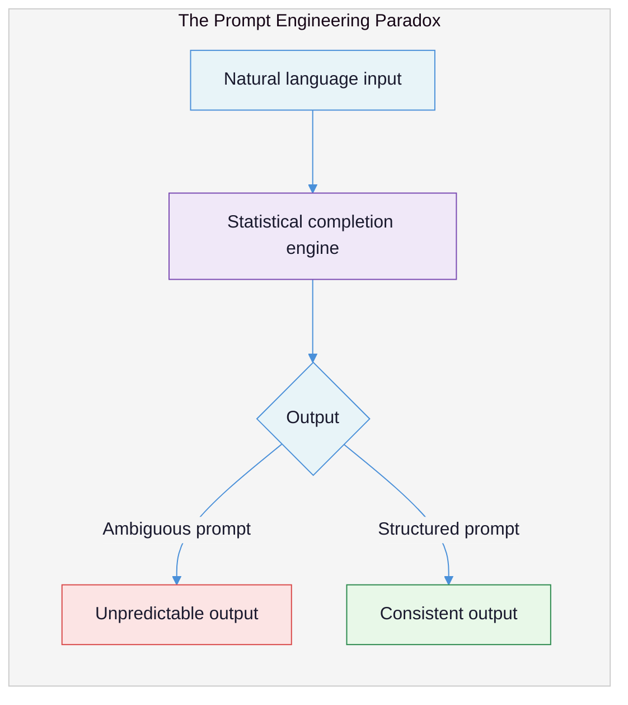
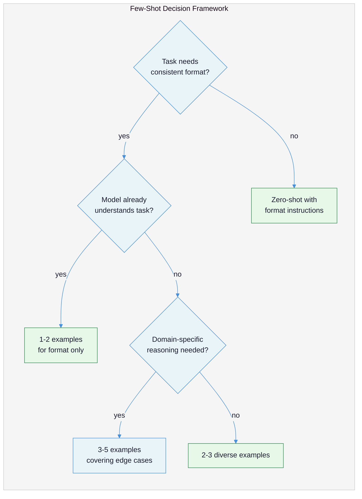
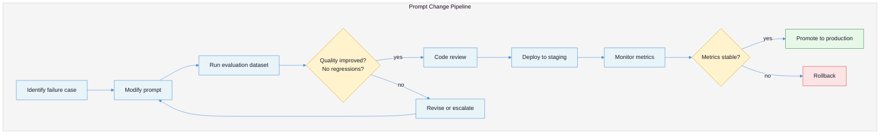
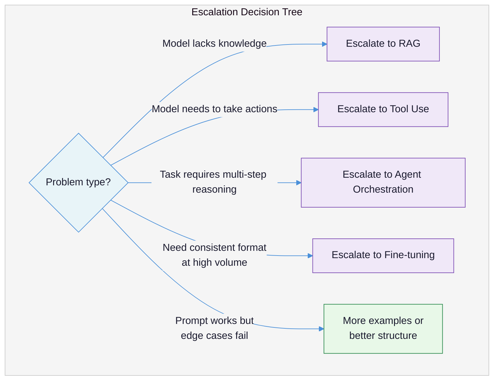

# Prompt Engineering That Works: Writing Prompts That Survive Production Traffic

You can call an LLM API. You have sent prompts and received responses. Now you need those responses to be consistent, structured, and reliable across thousands of inputs you have never seen. This document covers the techniques that actually matter in production -- and the ones that waste your time.

---

## The Core Tension

Prompts look like natural language, but they need to function like code. This is the source of nearly every prompt engineering mistake: **teams write prompts as if they are talking to a person, then expect the consistency of a function call.** A person can infer your intent from context, ask clarifying questions, and apply common sense. An LLM will do exactly what the statistical patterns in its training data suggest is the most plausible continuation of your text -- nothing more, nothing less.

The tension is this: the same property that makes LLMs powerful (they understand natural language) is what makes them unreliable (natural language is ambiguous). Production prompt engineering is the discipline of removing that ambiguity without losing the flexibility.

| What teams expect | What actually happens |
|---|---|
| "The model understands what I mean" | The model completes what you wrote -- including the ambiguity |
| "I told it not to do X, so it won't" | Negative instructions increase the salience of the prohibited behavior |
| "More instructions = better output" | Contradictory or redundant instructions degrade output quality |
| "Chain-of-thought always improves accuracy" | CoT decreases accuracy on simple tasks and adds latency on all tasks |
| "I need a clever prompt" | You need a clear, structured prompt with explicit constraints |
| "I'll tweak the prompt until it works" | You need evaluation infrastructure, not more tweaking |



The gap between "works on my test case" and "works on 10,000 production inputs" is not a matter of prompt cleverness. It is a matter of engineering discipline: explicit structure, measurable constraints, versioned artifacts, and knowing when to stop tweaking and escalate to a different pattern entirely.

---

## Failure Taxonomy: How Prompts Break in Production

These failures are listed in order of frequency. Most teams encounter all of them within their first month of production deployment.

### Failure 1: Vague instructions that work on test data and fail on edge cases

**What it looks like:** The prompt produces great results on the 10 examples you tested, then falls apart when real user input arrives.

**Why it happens:** Natural language instructions have implicit assumptions. "Summarize this document" assumes a particular length, tone, audience, and level of detail -- but specifies none of them. Your test documents happened to align with the model's default assumptions. Production documents do not.

**Example:**

```
# Vague prompt
Summarize this customer support ticket.
```

This produces reasonable summaries for standard tickets. But when the input is a 3-sentence ticket, you get a summary longer than the original. When the input is a rambling 2,000-word complaint, you get a summary that misses the core issue. When the input contains profanity, the model sometimes editorializes.

### Failure 2: Prompt-as-conversation instead of prompt-as-specification

**What it looks like:** System prompts written as friendly conversational instructions rather than structured specifications. "Hey, you're a helpful assistant that helps people with their tax questions. Try to be accurate and helpful!"

**Why it happens:** The chat interface creates the illusion that you are instructing a person. Teams write prompts the way they would brief a new employee, with implied context, social niceties, and assumed understanding.

**Root cause:** Instructions and demonstrations are fundamentally different mechanisms. An **instruction** tells the model what to do ("Respond in JSON"). A **demonstration** shows the model what output looks like (a few-shot example of JSON output). Conversational briefings are neither -- they are vague instructions wrapped in social framing.

### Failure 3: Negative prompting that backfires

**What it looks like:** Adding "DO NOT" instructions that the model ignores or, worse, that increase the frequency of the prohibited behavior.

**Why it happens:** Token generation operates through positive selection -- the model chooses the next most probable token, it does not maintain a blacklist of forbidden tokens. To process the instruction "Do not mention competitor products," the model must first represent the concept of competitor products, making those tokens more salient in the generation process. This is the [Pink Elephant Problem](https://eval.16x.engineer/blog/the-pink-elephant-negative-instructions-llms-effectiveness-analysis) -- analogous to the psychological concept of ironic process theory, where trying to suppress a thought makes it more likely to surface.

Research confirms this is not just anecdotal. A study on InstructGPT found that [models actually perform worse with negative prompts as they scale](https://gadlet.com/posts/negative-prompting/) -- a counter-intuitive inverse scaling effect. A separate benchmark (NeQA) found that [negation understanding does not reliably improve as models get larger](https://gadlet.com/posts/negative-prompting/).

**Example:** Claude Code users have reported that models create duplicate files despite explicit "NEVER create duplicate files" rules. The more "DO NOT" instructions added, the worse output quality becomes.

### Failure 4: Chain-of-thought on tasks that do not need it

**What it looks like:** Adding "Think step by step" to every prompt, including simple classification, extraction, and formatting tasks, then observing degraded accuracy, higher latency, and increased cost.

**Why it happens:** Chain-of-thought (CoT) prompting became widely known through a few landmark papers and was quickly adopted as a universal "make the model smarter" technique. The nuance -- that CoT is beneficial for complex reasoning but harmful for simple tasks -- was lost in the hype.

A [2025 study from Wharton](https://gail.wharton.upenn.edu/research-and-insights/tech-report-chain-of-thought/) tested CoT across 8 models and found that **Gemini Pro 1.5 saw perfect accuracy decline by 17.2% with CoT prompting.** Gemini Flash 2.5 showed a 13.1% degradation at the 100% accuracy threshold. The mechanism: CoT can improve performance on difficult questions, but it introduces variability that causes errors on questions the model would otherwise answer correctly. For reasoning models (o3-mini, o4-mini), CoT provided only 2.9-3.1% average improvements despite 20-80% increases in response time.

[OpenAI's own GPT-4.1 prompting guide](https://developers.openai.com/cookbook/examples/gpt4-1_prompting_guide) acknowledges this: prompting step-by-step comes "with the tradeoff of higher cost and latency associated with using more output tokens." For reasoning models, "asking a reasoning model to reason more may actually hurt performance."

### Failure 5: Few-shot examples that waste tokens without improving quality

**What it looks like:** Including 8-10 examples in every prompt because "more examples = better," consuming 2,000+ tokens per call without measurable quality improvement over 2-3 examples.

**Why it happens:** Teams add examples during development to fix specific failure cases, and never remove them. Each example fixes one edge case but the cumulative token cost adds up. Research shows [diminishing returns after 2-3 examples](https://www.prompthub.us/blog/the-few-shot-prompting-guide), with major gains plateauing after the second example.

Worse, for reasoning models, few-shot examples can actively degrade performance. DeepSeek R1's guidance states that [few-shot prompting consistently degrades its performance](https://www.prompthub.us/blog/the-few-shot-prompting-guide), and a medical study found that 5-shot prompting reduced performance compared to a zero-shot baseline when using OpenAI's o1.

### Failure 6: Role prompting as a magic incantation

**What it looks like:** Prefixing every prompt with "You are a world-class expert senior principal staff engineer" and expecting measurably better output.

**Why it happens:** Early demonstrations showed that role prompts could improve GPT-3.5 output. Teams cargo-culted the pattern without understanding the mechanism or measuring the effect on newer models.

**The research is sobering.** A [comprehensive review of 5 studies on role prompting](https://www.prompthub.us/blog/role-prompting-does-adding-personas-to-your-prompts-really-make-a-difference) found that basic personas ("You are a doctor") provide negligible or even negative gains on modern models. One study using 4 model families (Llama 3, Mistral, Qwen) found that all tested personas showed values below zero -- no statistically significant improvements. A Learn Prompting experiment tested 12 personas on 2,000 MMLU questions with GPT-4-turbo and found that the "idiot" persona outperformed the "genius" one.

The one exception: detailed, task-specific personas that include domain constraints and output requirements ("ExpertPrompting") can show ~10% improvement -- but at that point, the improvement comes from the constraints, not the persona label.

### Failure 7: Endless prompt tweaking instead of escalating

**What it looks like:** Spending weeks adjusting word choices, reordering instructions, and adding edge-case handling to a prompt that should have been replaced by a different pattern (RAG, fine-tuning, tool use, or code) days ago.

**Why it happens:** Prompt changes are fast and easy. Implementing a RAG pipeline or fine-tuning a model requires engineering work. Teams optimize for iteration speed over solution fitness.

**The signal that you need to escalate:** If you have iterated on a prompt more than 5 times for the same failure mode, the problem is not the prompt. See [AI-Native Solution Patterns](ai-native-solution-patterns.md) for when to move beyond prompt engineering to retrieval, tool use, or multi-agent orchestration.

---

## The Prompt Engineering Maturity Spectrum

Where your team falls on this spectrum predicts the types of failures you will encounter.


| Level | Characteristics | Typical failures | Signal to advance |
|---|---|---|---|
| **1. Trial and Error** | Prompts written in chat UI, copied to code. No system prompt. No evaluation. | Works on demos, fails on production inputs. | Any production deployment. |
| **2. Structured Prompts** | System prompts with sections. Few-shot examples. Output format specified. | Inconsistent output on edge cases. Token budget overruns. | Output quality matters to the business. |
| **3. Prompt as Code** | Prompts stored in version control. Evaluation dataset exists. Changes require review. | Regressions detected after deployment. Slow iteration cycles. | Multiple people editing prompts. |
| **4. Beyond Prompts** | Prompt is one component in a system that includes retrieval, tools, and guards. | System-level failures, not prompt failures. | Single-prompt solutions hit a ceiling. |

Most teams are at Level 1 or 2. The techniques in this document will move you to Level 3. The document on [AI-Native Solution Patterns](ai-native-solution-patterns.md) covers Level 4.

---

## Principles: The Techniques That Actually Work

### Principle 1: Structure prompts with explicit sections, not prose

**Why it works:** Structured prompts eliminate the ambiguity of natural language by creating distinct sections that the model processes as separate concerns. Unstructured prose forces the model to infer where one instruction ends and another begins -- and it often infers wrong.

[Anthropic's documentation](https://platform.claude.com/docs/en/build-with-claude/prompt-engineering/use-xml-tags) recommends XML tags for Claude specifically because they "reduce misinterpretation" by separating instructions, context, examples, and inputs unambiguously. The tags are not magic -- any consistent delimiter works -- but XML tags have three practical advantages: they nest naturally, they are self-documenting, and they are easy to parse programmatically from the output.

**How to apply:**

Before (unstructured):
```
You are a customer support classifier. Look at the customer's message and figure out
what category it belongs to. The categories are billing, technical, account, and other.
Just respond with the category name. Here's an example: if someone says "I can't log in"
that's technical. If they say "why was I charged twice" that's billing. Now classify
this message: {message}
```

After (structured with XML tags):
```xml
<instructions>
Classify the customer support message into exactly one category.
Respond with only the category name, no explanation.
</instructions>

<categories>
- billing: payment issues, charges, refunds, invoices
- technical: bugs, errors, can't access features, performance
- account: login, password, profile, settings, permissions
- other: anything that does not fit the above categories
</categories>

<examples>
<example>
<input>I was charged twice for my subscription this month</input>
<output>billing</output>
</example>
<example>
<input>The dashboard keeps showing a 500 error when I click reports</input>
<output>technical</output>
</example>
</examples>

<message>
{message}
</message>
```

The structured version is longer, but each section has a single purpose. The `<categories>` section defines the label space with descriptions. The `<examples>` section shows format, not just labels. The `<message>` section isolates user input from instructions -- critical for preventing prompt injection.

**Key rules for structure:**
- **One concern per section.** Do not mix format instructions with task instructions.
- **Place long context before short queries.** Anthropic's testing shows that [queries placed after long context can improve response quality by up to 30%](https://platform.claude.com/docs/en/build-with-claude/prompt-engineering/use-xml-tags) on complex multi-document inputs.
- **Use descriptive tag names.** There are no canonical "best" XML tags -- use names that make sense for your content.
- **Nest tags for hierarchical content.** Multiple documents should be wrapped in `<documents>` containing `<document index="1">` elements, each with `<source>` and `<content>` subtags.

### Principle 2: Use few-shot examples strategically -- quality over quantity

**Why it works:** Few-shot examples are the most reliable way to specify output format, tone, and decision boundaries because they are **demonstrations**, not **instructions**. Instructions tell the model what to do; demonstrations show what the output looks like. When the two conflict, demonstrations usually win.

A critical finding from [Min et al. (2022)](https://www.promptingguide.ai/techniques/fewshot): the label space and distribution of the input text matter more than whether the labels are correct. Even examples with random labels can be effective -- what matters is that the examples communicate the format, the label space, and the type of reasoning expected.

**How to apply:**

**Use 2-3 examples, not 8-10.** Research converges on [2-5 examples as optimal](https://www.prompthub.us/blog/the-few-shot-prompting-guide), with diminishing returns after the second or third. Each additional example costs tokens linearly but improves accuracy logarithmically.



**When to use zero-shot (no examples):**
- The task is well-understood by the model (summarization, translation, simple classification)
- You are using a reasoning model (o3, DeepSeek R1) -- [few-shot can degrade their performance](https://www.prompthub.us/blog/the-few-shot-prompting-guide)
- Token budget is tight and format instructions alone are sufficient

**When few-shot is essential:**
- Domain-specific output format that the model has not seen in training
- Consistent tone or style across outputs
- Ambiguous classification boundaries that need calibration
- Structured extraction with complex nested output

**Example selection matters more than example count.** Choose examples that:
1. Cover the diversity of your input space (not 3 examples that are all similar)
2. Include at least one edge case or boundary condition
3. Place the most important example last -- models weight final examples more heavily

### Principle 3: Apply chain-of-thought selectively, not universally

**Why it works when it works:** CoT forces the model to generate intermediate reasoning tokens before producing the final answer. For complex tasks -- multi-step math, logical deduction, code debugging -- these intermediate tokens function as a working scratchpad that reduces the chance of reasoning errors.

**Why it hurts when it hurts:** For simple tasks, CoT adds noise. The model generates plausible-sounding reasoning that introduces variability. A classification task that would be answered correctly in one token gets routed through a paragraph of reasoning that can lead to a different (wrong) conclusion. The [Wharton study](https://gail.wharton.upenn.edu/research-and-insights/tech-report-chain-of-thought/) quantified this: CoT degrades perfect accuracy by up to 17.2% on certain models.

**How to apply:**

| Task type | CoT recommendation | Why |
|---|---|---|
| Simple classification | No CoT | Model already knows the answer; reasoning adds variance |
| Data extraction | No CoT | Pattern matching, not reasoning |
| Format conversion | No CoT | Structural transformation, not analysis |
| Multi-step math | Yes, explicit CoT | Each step builds on the previous one |
| Code debugging | Yes, structured CoT | Need to trace execution flow |
| Ambiguous analysis | Yes, but separate thinking from answer | Reasoning clarifies edge cases |
| Any task with a reasoning model | No explicit CoT | The model already reasons internally; [adding more can hurt](https://developers.openai.com/cookbook/examples/gpt4-1_prompting_guide) |

**When you do use CoT, separate the reasoning from the answer:**

```xml
<instructions>
Analyze the code snippet for potential security vulnerabilities.

First, think through the code in <analysis> tags. Consider:
- Input validation
- Authentication checks
- SQL injection vectors
- XSS vectors

Then provide your verdict in <verdict> tags with only: SAFE, WARNING, or CRITICAL.
</instructions>
```

This gives you the accuracy benefit of CoT while keeping the final output parseable. You can discard the `<analysis>` content in your application and extract only the `<verdict>`.

### Principle 4: Specify output format explicitly -- never assume

**Why it works:** Output format instructions remove the largest source of production parsing failures. Without explicit format constraints, the model infers what format you want based on context, and its inference varies across inputs. "Respond in JSON" is an instruction; a JSON schema with field names, types, and required fields is a specification.

Explicit format constraints outperform vague instructions because they reduce the space of valid completions. "Respond in JSON" leaves the model free to choose any JSON structure. A schema constrains it to exactly the structure your downstream code expects.

**How to apply:**

Before (vague):
```
Extract the key information from this invoice and return it as JSON.
```

After (explicit):
```xml
<instructions>
Extract invoice data from the document below. Return a JSON object matching
this exact schema. Include only fields present in the document. Use null for
fields that cannot be determined.
</instructions>

<output_schema>
{
  "invoice_number": "string",
  "date": "string (YYYY-MM-DD format)",
  "vendor": {
    "name": "string",
    "address": "string or null"
  },
  "line_items": [
    {
      "description": "string",
      "quantity": "number",
      "unit_price": "number",
      "total": "number"
    }
  ],
  "subtotal": "number",
  "tax": "number or null",
  "total": "number",
  "currency": "string (ISO 4217, e.g., USD, EUR)"
}
</output_schema>

<document>
{invoice_text}
</document>
```

The explicit version specifies: exact field names, types, date format, currency format, null handling, and nesting structure. Your parsing code can be written against this schema before you ever see the output.

**Format hierarchy -- when to use what:**

| Format | Use when | Avoid when |
|---|---|---|
| **JSON** | Output feeds into code. Nested data. API responses. | Simple single-value responses. |
| **XML tags** | Output has mixed types (text + data). You need to extract sections. | Pure data extraction (JSON is simpler to parse). |
| **Markdown** | Human-readable reports. Mixed prose and structured content. | Machine parsing is the primary consumer. |
| **Single value** | Classification, scoring, yes/no decisions. | Any multi-field response. |

**Provider-level enforcement:** When available, use the provider's structured output features (OpenAI's `response_format`, Anthropic's tool-use-as-structured-output) in addition to prompt-level instructions. Belt and suspenders -- the prompt specifies intent, the API parameter enforces structure.

### Principle 5: Tell the model what to do, never what to avoid

**Why it works:** As covered in Failure 3, negative instructions ("do not," "never," "avoid") are unreliable because token generation works through positive selection. But there is a deeper reason: negative instructions define an infinite space (everything except X), while positive instructions define a finite space (exactly X). Finite spaces are easier to comply with.

[Anthropic's official recommendation](https://platform.claude.com/docs/en/build-with-claude/prompt-engineering/use-xml-tags): "Tell Claude what to do instead of what not to do."

**How to apply:**

| Negative (unreliable) | Positive (reliable) |
|---|---|
| "Do not use markdown in your response" | "Respond in plain text with no formatting" |
| "Don't include fields with no value" | "Only include fields that have a value" |
| "Never make up information" | "If the answer is not in the provided context, respond with 'Information not found'" |
| "Don't be verbose" | "Respond in 2-3 sentences maximum" |
| "Avoid technical jargon" | "Use language a non-technical manager would understand" |
| "Don't mention competitors" | "Discuss only our product and its features" |

Every negative instruction can be rephrased as a positive one. The positive version is more specific, easier for the model to follow, and does not risk the ironic activation of the prohibited concept.

### Principle 6: Use role/persona prompts for constraints, not for magic

**Why it works (when it works):** Role prompts do not make the model "smarter." What they can do is establish a set of implicit constraints -- vocabulary, tone, reasoning style, domain boundaries -- that would take many explicit instructions to specify individually. A well-crafted persona is a compression mechanism for constraints, not an intelligence amplifier.

**How to apply:**

Ineffective (vague persona label):
```
You are a world-class expert data scientist.
```

Effective (persona as constraint specification):
```xml
<role>
You are a senior data engineer reviewing SQL queries for a PostgreSQL 15
data warehouse. You prioritize query performance over readability. You flag
any query that would trigger a sequential scan on tables with more than
1 million rows. You respond with specific optimization suggestions, not
general advice.
</role>
```

The effective version works not because of the "senior data engineer" label, but because it specifies: the technology (PostgreSQL 15), the domain (data warehouse), the priority (performance over readability), a specific quality threshold (sequential scans on large tables), and the output style (specific suggestions, not general advice). Strip the persona label and keep only the constraints -- the output quality will be identical.

### Principle 7: Version prompts like software

**Why it works:** Prompts are code. They determine system behavior, they have bugs, they need testing, and they need rollback capability. Teams that treat prompts as casual text strings -- editing them inline, deploying without review, with no history of what changed when -- will reproduce every problem that version control solved for code decades ago.

**How to apply:**

**Store prompts outside application code.** Prompts should be in configuration files, a prompt registry, or at minimum in dedicated constant files. This enables: runtime updates without redeployment, A/B testing of prompt variants, and clear ownership boundaries between prompt authors and application developers.

```
project/
  prompts/
    classify_ticket/
      v1.yaml      # Original prompt
      v2.yaml      # Added edge case examples
      v3.yaml      # Restructured with XML tags
      eval.yaml    # Evaluation dataset for this prompt
    extract_invoice/
      v1.yaml
      v2.yaml
      eval.yaml
```

**Every prompt change goes through the same process:**



**Minimum viable prompt versioning:**
1. Store prompts in version control, not inline strings
2. Use structured naming: `{feature}-{purpose}-v{version}` (e.g., `support-classify-v3`)
3. Maintain a [changelog that records what changed and why](https://www.zenml.io/blog/prompt-engineering-management-in-production-practical-lessons-from-the-llmops-database)
4. Keep an evaluation dataset of at least 20-50 examples per prompt
5. Run the evaluation dataset before and after every change
6. Never edit a production prompt without [a rollback plan](https://launchdarkly.com/blog/prompt-versioning-and-management/)

---

## Putting It Together: A Complete Production Prompt

Here is a prompt that applies all seven principles. This is a real-world task: extracting structured data from unstructured customer feedback.

```xml
<role>
You are a customer feedback analyst for a B2B SaaS product. You extract
structured insights from raw feedback. You categorize conservatively --
when uncertain between two categories, choose the broader one.
</role>

<instructions>
Analyze the customer feedback below. Extract structured data matching
the output schema exactly.

For sentiment, use only: positive, negative, mixed, neutral.
For urgency, use only: critical, high, medium, low.
For category, use only the categories listed in the category definitions.

If the feedback mentions multiple issues, create one entry per issue.
Respond with only the JSON array, no surrounding text.
</instructions>

<category_definitions>
- performance: speed, latency, timeout, slow, lag
- reliability: crash, error, downtime, unavailable, broken
- usability: confusing, hard to find, unintuitive, UX, workflow
- feature_request: wish, would be nice, need, missing, should have
- praise: love, great, excellent, thank you, impressed
</category_definitions>

<examples>
<example>
<input>The dashboard is incredibly slow since the last update. Takes 30
seconds to load. Also, love the new reporting feature -- exactly what
we needed.</input>
<output>[
  {
    "issue": "Dashboard load time regression after recent update",
    "category": "performance",
    "sentiment": "negative",
    "urgency": "high",
    "verbatim": "incredibly slow since the last update. Takes 30 seconds to load"
  },
  {
    "issue": "Positive reception of new reporting feature",
    "category": "praise",
    "sentiment": "positive",
    "urgency": "low",
    "verbatim": "love the new reporting feature -- exactly what we needed"
  }
]</output>
</example>
</examples>

<feedback>
{customer_feedback}
</feedback>
```

This prompt uses: XML structure (Principle 1), a single targeted example (Principle 2), no chain-of-thought because extraction does not require reasoning (Principle 3), explicit output schema (Principle 4), all positive instructions (Principle 5), role as constraint specification (Principle 6), and would be stored as a versioned file (Principle 7).

---

## When to Stop Engineering Prompts and Escalate

Prompt engineering has a ceiling. Recognizing that ceiling is as important as the techniques themselves. If you are in any of these situations, the answer is not a better prompt -- it is a different pattern.



| Signal | Wrong response | Right response |
|---|---|---|
| Model gives outdated or wrong facts | Add "be accurate" to the prompt | Add retrieval (RAG) to provide current facts |
| Output format inconsistent at volume | Add more format instructions | Use provider's structured output API or fine-tune |
| Task needs external data or actions | Describe the data in the prompt | Give the model tools (function calling, MCP) |
| Complex multi-step workflow | Write a longer prompt | Decompose into an agent with multiple prompt steps |
| 5+ iterations on the same failure mode | Keep tweaking the prompt | Step back and change the approach |

Prompt engineering is the first tool in the hierarchy, not the only one. See [AI-Native Solution Patterns](ai-native-solution-patterns.md) for the full pattern selection framework.

---

## Recommendations

### Short-term: your first prompts

1. **Structure every system prompt with explicit sections.** Use XML tags, markdown headers, or any consistent delimiter. Separate instructions from context from examples from input. This single change produces the largest quality improvement for the least effort.

2. **Replace every negative instruction with a positive one.** Search your existing prompts for "don't," "never," "avoid," and "do not." Rewrite each as a positive specification of desired behavior.

3. **Remove chain-of-thought from classification and extraction tasks.** If you added "think step by step" to simple tasks, remove it and measure accuracy. You will likely see improvement.

### Medium-term: production readiness

4. **Build an evaluation dataset before iterating on prompts.** Even 20-50 hand-labeled examples with a scoring rubric gives you a way to measure whether prompt changes help or hurt. Without this, you are navigating by feel.

5. **Move prompts out of application code into versioned configuration.** This enables prompt changes without code deployment and establishes a review process.

6. **Audit your few-shot examples.** For each prompt that uses examples, measure accuracy with 0, 1, 2, and 3 examples. Keep only the count that measurably improves output. Remove the rest to save tokens and cost.

### Long-term: engineering discipline

7. **Implement a prompt change pipeline.** Every prompt change runs against an evaluation dataset, passes quality thresholds, goes through code review, and deploys through staging before production.

8. **Monitor prompt performance in production.** Track success rates, parsing errors, and output quality scores. Prompt quality degrades over time as model versions change and input distributions shift.

9. **Establish escalation criteria.** Define the point at which your team stops tweaking prompts and escalates to a different pattern. A written policy ("if we iterate more than 5 times on the same failure, we evaluate RAG/tools/fine-tuning") prevents the endless-tweaking trap.

---

## The Hard Truth

Most prompt engineering effort is wasted. Teams spend weeks crafting elaborate prompts with carefully worded instructions, clever role descriptions, and dozens of examples -- when the real problem is that they are using the wrong pattern entirely. A perfect prompt cannot compensate for missing context (use RAG), cannot take actions in the world (use tools), and cannot maintain state across complex workflows (use agents).

The uncomfortable insight is this: **the best prompt engineers are not the ones who write the most sophisticated prompts. They are the ones who know when to stop writing prompts.** They build evaluation infrastructure first, make measured changes, and escalate to different patterns when prompt iteration hits diminishing returns. The skill is not in the crafting -- it is in the judgment.

The second uncomfortable truth: as models improve, many prompt engineering techniques become unnecessary. Chain-of-thought was transformative for GPT-3.5; it is counterproductive for reasoning models. Few-shot examples were essential for GPT-3; modern models often perform as well zero-shot. Role prompting showed measurable gains on older models; on GPT-4-class models, the effect is negligible. The techniques that survive model advancement are the boring ones: clear structure, explicit format constraints, positive instructions, and version control. The "tricks" decay. The engineering discipline endures.

---

## Summary Checklist

| Question | Good Answer | Bad Answer |
|---|---|---|
| How do you structure a system prompt? | Explicit sections separated by XML tags or headers, each with a single purpose | One block of conversational prose |
| How many few-shot examples do you use? | 2-3, measured against a zero-shot baseline to confirm they help | "As many as possible" or a fixed number regardless of task |
| When do you use chain-of-thought? | Multi-step reasoning tasks only, never for classification or extraction | "Always -- it makes the model think harder" |
| How do you handle "don't do X" requirements? | Rewrite as a positive instruction specifying desired behavior | Add "DO NOT" in capitals and hope for the best |
| How do you specify output format? | Explicit schema with field names, types, and null handling | "Respond in JSON" |
| What does your role prompt contain? | Domain constraints, quality thresholds, and output style specifications | "You are a world-class expert" |
| Where are your prompts stored? | Version-controlled configuration files with changelogs | Inline strings in application code |
| How do you evaluate prompt changes? | Run against an evaluation dataset, measure quality before and after | "I tried it on a few examples and it looked better" |
| What do you do after 5 iterations on the same failure? | Evaluate whether to escalate to RAG, tools, or fine-tuning | Keep tweaking the prompt |
| How do you know your prompt works in production? | Monitoring of success rates, parsing errors, and quality scores | "It worked in development" |

---

## What to Read Next

This document covers how to write effective prompts for well-defined tasks. The next document, [Context Engineering](context-engineering.md), addresses the harder problem: managing what goes into the context window when your system has conversations, retrieves documents, and coordinates multiple LLM calls. After that, [Structured Output and Output Parsing](structured-output-and-parsing.md) goes deeper on the provider-specific mechanisms for enforcing output format at the API level.

---

## References

### Research

- [Meincke, Mollick, Mollick, Shapiro, "The Decreasing Value of Chain of Thought in Prompting" (Wharton, 2025)](https://gail.wharton.upenn.edu/research-and-insights/tech-report-chain-of-thought/) -- 2025 study testing CoT across 8 models, finding up to 17.2% accuracy degradation on simple tasks
- [Min et al., "Rethinking the Role of Demonstrations" (2022)](https://www.promptingguide.ai/techniques/fewshot) -- Finding that label space and input distribution matter more than correct labels in few-shot examples
- [PromptHub, "Role Prompting: Does Adding Personas Really Make a Difference?"](https://www.prompthub.us/blog/role-prompting-does-adding-personas-to-your-prompts-really-make-a-difference) -- Review of 5 studies showing basic personas provide negligible gains on modern models

### Practitioner Articles

- [16x Engineer, "The Pink Elephant Problem"](https://eval.16x.engineer/blog/the-pink-elephant-negative-instructions-llms-effectiveness-analysis) -- Analysis of why negative instructions fail, with real-world examples from LLM applications
- [Gadlet, "Why Positive Prompts Outperform Negative Ones"](https://gadlet.com/posts/negative-prompting/) -- Research review citing three academic papers on negation failure in LLMs, including the InstructGPT inverse scaling finding
- [PromptHub, "The Few Shot Prompting Guide"](https://www.prompthub.us/blog/the-few-shot-prompting-guide) -- Optimal example counts, reasoning model degradation with few-shot, and the MANIPLE framework for example selection
- [ZenML, "Prompt Engineering and Management in Production"](https://www.zenml.io/blog/prompt-engineering-management-in-production-practical-lessons-from-the-llmops-database) -- Production practices for prompt versioning, evaluation, and deployment pipelines
- [LaunchDarkly, "Prompt Versioning and Management Guide"](https://launchdarkly.com/blog/prompt-versioning-and-management/) -- Deployment pipelines, rollback strategies, and monitoring for prompts as software artifacts

### Official Documentation

- [Anthropic, "Use XML tags to structure your prompts"](https://platform.claude.com/docs/en/build-with-claude/prompt-engineering/use-xml-tags) -- Official guidance on XML tag structuring, nesting, and combining with other techniques
- [OpenAI, "GPT-4.1 Prompting Guide"](https://developers.openai.com/cookbook/examples/gpt4-1_prompting_guide) -- OpenAI's guidance on CoT trade-offs and reasoning model prompting, including the acknowledgment that adding reasoning can hurt performance
- [DAIR.AI, "Few-Shot Prompting"](https://www.promptingguide.ai/techniques/fewshot) -- Academic-oriented guide citing foundational few-shot research including Min et al. 2022
