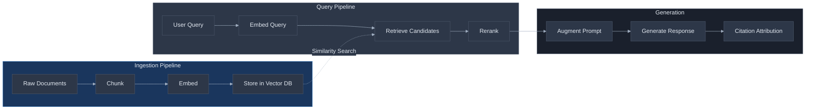
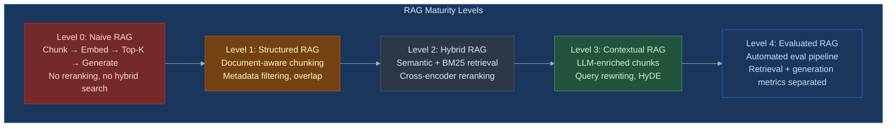

# RAG: From Concept to Production -- Bridging the Knowledge Gap Without Losing Control

Your model is capable. It can reason, summarize, extract, and generate. But it does not know about your company's internal documentation, last week's policy change, or the contract your legal team signed yesterday. The model lacks information, not capability. Retrieval-Augmented Generation (RAG) is the pattern that bridges this gap -- and it is simultaneously the most common production LLM pattern after single API calls and the most frequently botched.

**Prerequisites:** [LLM Fundamentals](llm-fundamentals-for-practitioners.md) (tokens, context windows, API call anatomy), [Prompt Engineering](prompt-engineering.md) (system prompts, output formatting), [Context Engineering](context-engineering.md) (context budget, positioning, retrieval principles), and [Structured Output](structured-output-and-parsing.md) (schemas for machine-readable output). This document builds directly on all four.

---

## The Core Tension

RAG solves one problem -- getting information into the context window -- while creating an entirely new class of engineering problems. The tension is this: **you are building a search engine whose results become the model's reality, and the model has no way to distinguish between a relevant retrieval and a misleading one.** Every hallucination, wrong answer, and confident fabrication in a RAG system traces back to what the retrieval pipeline put in front of the model or failed to put in front of it.

This is not a retrieval problem or a generation problem. It is a pipeline problem where errors compound across seven stages, each with its own failure modes that interact in ways that make end-to-end debugging genuinely difficult.

| What teams assume | What actually happens |
|---|---|
| "RAG grounds the model in facts" | RAG grounds the model in whatever the retrieval pipeline returns -- relevant or not |
| "Better embeddings fix retrieval" | Chunking decisions cause 80% of retrieval failures, not embedding quality |
| "More documents means better answers" | More documents means more noise; retrieval precision drops as corpus size grows |
| "The model will ignore irrelevant context" | Models incorporate retrieved context even when it contradicts their training data |
| "RAG eliminates hallucination" | RAG creates new hallucination modes: fabricated citations, chunk-boundary confabulation, contradiction resolution |
| "Evaluation is about answer quality" | Retrieval quality and generation quality are independent problems requiring separate metrics |

The fundamental mistake teams make is treating RAG as a feature ("add search to your LLM") rather than what it actually is: a distributed system with a search engine, a vector database, a reranking layer, and a language model, each with independent failure modes that multiply rather than add.



Each stage in this pipeline is a potential failure point. The rest of this document walks through each stage, explains how it fails, and shows you how to build each one so that errors do not compound into unusable output.

---

## Failure Taxonomy

Before prescribing solutions, you need to understand how RAG systems actually fail. These seven failure modes -- drawn from both [academic analysis](https://arxiv.org/pdf/2401.05856) and production experience -- explain why a system can appear to work in demos and silently degrade in production.

### Failure 1: Missing Content

**What it looks like:** The user asks a question that cannot be answered from the document corpus, and the system answers anyway -- confidently, plausibly, and incorrectly.

**Why it happens:** RAG systems always retrieve something. Vector similarity search returns the top-K most similar documents regardless of whether any of them actually contain the answer. There is no built-in "I don't know" mechanism. The model sees retrieved context and assumes it is relevant.

**Example:** A user asks "What is our parental leave policy in Germany?" The corpus contains US and UK policies but not German-specific ones. The retrieval pipeline returns the UK policy (most similar), and the model synthesizes an answer from it -- producing a response that is coherent, cites a real document, and is factually wrong for the German context.

**Root cause:** No retrieval confidence threshold. No abstention logic.

### Failure 2: Missed Top-Ranked Documents

**What it looks like:** The answer exists in the corpus, but the relevant documents rank below the top-K cutoff and never reach the model.

**Why it happens:** The user's query vocabulary does not match the document vocabulary. Embedding similarity captures semantic meaning but misses exact terms -- acronyms, product codes, proper names. A query about "PTO accrual" may not match a document that calls it "vacation day accumulation" if the embedding model's training data did not strongly associate these phrases.

**Example:** A user asks about "SOC 2 compliance requirements." The relevant document uses "Service Organization Control Type II audit" throughout. The embedding similarity score is moderate, and documents about "security compliance" or "audit frameworks" -- topically related but not specifically about SOC 2 -- rank higher.

**Root cause:** Pure semantic search without keyword matching. Lack of hybrid retrieval.

### Failure 3: Not in Context -- The Consolidation Loss

**What it looks like:** Relevant documents are retrieved but the answer is lost when multiple documents are consolidated to fit the context window.

**Why it happens:** Context windows are finite. When retrieval returns 20 documents and only 10 fit, the truncation decision may cut the document containing the answer. Even when all documents fit, the [lost-in-the-middle effect](context-engineering.md) means models pay less attention to documents positioned in the middle of the context -- exactly where moderately-ranked retrievals land.

**Root cause:** No reranking before context assembly. Poor document positioning.

### Failure 4: Extraction Failure

**What it looks like:** The answer is in the context, the model "sees" it, but the generated response does not extract or use it correctly.

**Why it happens:** When retrieved context is noisy -- containing contradictory statements, partial information, or irrelevant passages alongside the answer -- the model may average across the noise rather than extract the signal. This is particularly acute when the answer is a specific number, date, or name buried in a long passage.

**Root cause:** Too many retrieved documents. Insufficient reranking. No chunk-level relevance filtering.

### Failure 5: Chunk Boundary Problems

**What it looks like:** The answer spans two chunks, and neither chunk alone contains enough information to answer the question. Or a chunk begins mid-sentence and the model cannot interpret it correctly.

**Why it happens:** Fixed-size chunking splits documents at arbitrary token boundaries, cutting sentences, paragraphs, and logical units. A table that spans a chunk boundary becomes two meaningless fragments. A definition in one chunk and its application in the next become disconnected.

**Example:** A legal contract states: "The indemnification cap shall be limited to the total fees paid under this agreement in the preceding 12-month period." If the chunk boundary falls between "limited to the total fees paid" and "under this agreement in the preceding 12-month period," neither chunk alone answers "What is the indemnification cap?"

**Root cause:** Chunking strategy ignores document structure. No overlap or overlap is insufficient.

### Failure 6: Context Poisoning

**What it looks like:** The model's answer quality decreases after RAG is added, compared to the model answering from its training data alone.

**Why it happens:** Retrieval is imprecise. It returns documents that are topically related but factually irrelevant or subtly misleading. The model incorporates this noise, and because retrieved context typically overrides training data in the model's attention, a wrong retrieved document is worse than no retrieval at all.

**Real-world data:** OpenAI's [Icelandic Errors Corpus study](context-engineering.md) found that adding RAG to a fine-tuned translation model degraded BLEU scores from 87 to 83 -- the retrieval was introducing noise on tasks the model had already learned. As [Context Engineering](context-engineering.md) documents, the principle is clear: validate RAG impact with A/B comparison on your golden dataset.

**Root cause:** No relevance threshold on retrieved documents. Retrieving too many documents.

### Failure 7: Contradictory Passages

**What it looks like:** Retrieved documents contain conflicting information, and the model either picks one arbitrarily, averages them into an incorrect synthesis, or hedges without clearly stating the contradiction.

**Why it happens:** Real document corpora contain versioned information, draft vs. final documents, policy documents from different time periods, and documents written by different teams with different terminology. RAG retrieval does not track document versions, authority levels, or temporal ordering by default.

**Example:** The corpus contains a 2024 expense policy ("reimbursement up to $500 per trip") and a 2025 update ("reimbursement up to $750 per trip"). Both are retrieved. The model may answer "$500," "$750," "$625" (an average it invented), or "between $500 and $750" depending on document positioning and the model's interpretation.

**Root cause:** No metadata filtering for recency, version, or authority. No temporal ordering of retrieved documents.

---

## The RAG Maturity Spectrum

Not all RAG implementations are equal. This five-level progression helps you evaluate where your system is and what the next improvement is worth investing in.



**Level 0 -- Naive RAG:** Fixed-size chunks (500 tokens), single embedding model, cosine similarity top-5, dump into prompt, generate. This is what every tutorial teaches. It works for demos and fails in production. Typical faithfulness score: 0.47-0.51.

**Level 1 -- Structured RAG:** Document-structure-aware chunking (split on headers, paragraphs, logical boundaries). Metadata attached to chunks (source, date, section). Chunk overlap to prevent boundary failures. This alone often doubles retrieval precision.

**Level 2 -- Hybrid RAG:** Dual retrieval with semantic search and BM25 keyword search, merged via Reciprocal Rank Fusion (RRF). Cross-encoder reranking before context assembly. This is where most production systems should target first. [Reranking alone improves accuracy by up to 40%](https://www.zeroentropy.dev/articles/ultimate-guide-to-choosing-the-best-reranking-model-in-2025).

**Level 3 -- Contextual RAG:** LLM-generated context prepended to each chunk before embedding ([Anthropic's Contextual Retrieval](https://www.anthropic.com/news/contextual-retrieval) reduced retrieval failures by 67%). Query rewriting decomposes complex questions into sub-queries. HyDE for ambiguous queries. This level has real cost implications -- LLM calls during ingestion.

**Level 4 -- Evaluated RAG:** Automated evaluation pipeline measuring retrieval metrics (context precision, context recall) and generation metrics (faithfulness, answer relevance) independently. Golden dataset of 50+ hand-curated test cases. Production sampling at 5-10% of traffic. Continuous monitoring for drift. This is what separates systems that work from systems that happen to work right now.

Most teams should target Level 2 as their initial production deployment. Level 3 is warranted when retrieval precision remains below 0.7 after hybrid search and reranking. Level 4 is non-negotiable for any system where wrong answers have consequences.

---

## Building the Pipeline: Stage by Stage

### Stage 1: Chunking -- Where 80% of RAG Problems Are Born

Chunking decisions determine retrieval quality more than embedding model choice, vector database selection, or prompt engineering. [Production data shows that 80% of RAG failures trace back to chunking](https://towardsdatascience.com/six-lessons-learned-building-rag-systems-in-production/), yet teams spend most of their optimization effort on everything else.

**Why chunking matters so much:** An embedding model compresses an entire chunk into a single vector. If the chunk contains three unrelated ideas, the embedding is an average of all three -- and matches none of them well. If the chunk splits a key concept across a boundary, neither fragment produces a useful embedding. The embedding is only as good as the text it represents.

#### Strategy Comparison

| Strategy | How It Works | Accuracy | Best For | Weakness |
|---|---|---|---|---|
| Fixed-size (512 tokens) | Split at token count boundaries | ~69% | Simple, general-purpose | Splits mid-sentence, ignores structure |
| Recursive character | Split by paragraph, then sentence, then word with separators | ~69%, 85-90% recall | Default recommendation | Requires tuning separators per format |
| Semantic | Group sentences by embedding similarity | ~54-92% (variance) | Dense unstructured text | Inconsistent fragment sizes, [computational cost not justified by gains](https://arxiv.org/abs/2501.xxxxx) per NAACL 2025 |
| Document-structure-aware | Split on headers, sections, logical boundaries (Markdown, HTML, PDF) | Highest for structured docs | Technical docs, policies, contracts | Requires format-specific parsers |
| Page-level | One chunk per page | 64.8% (lowest variance) | PDFs with page-coherent content | Misses cross-page concepts |
| Late chunking | Embed full document first, then chunk the embedding space | +6.5pt nDCG | Cross-reference-heavy docs | Requires model support, newer technique |

**The recommended default:** Recursive character splitting at 400-512 tokens, using paragraph, line, sentence, and word separators in that order. Add 10-20% overlap between chunks to handle boundary cases. For structured content (Markdown, HTML), switch to a structure-aware splitter -- this is often the single biggest and easiest improvement.

**What overlap actually does:** Overlap ensures that sentences at chunk boundaries appear in both the preceding and following chunks. A 50-token overlap on 500-token chunks means the last 50 tokens of chunk N are the first 50 tokens of chunk N+1. This prevents the boundary failure described in Failure 5.

**Overlap is not a panacea:** A [January 2026 analysis](https://www.firecrawl.dev/blog/best-chunking-strategies-rag) found that overlap beyond 10-20% provides no measurable retrieval benefit and only increases indexing cost and storage.

```python
# Recursive character splitting with LangChain
from langchain.text_splitter import RecursiveCharacterTextSplitter

splitter = RecursiveCharacterTextSplitter(
    chunk_size=512,
    chunk_overlap=64,  # ~12% overlap
    separators=["\n\n", "\n", ". ", " ", ""],
    length_function=len,
)

chunks = splitter.split_text(document_text)

# For Markdown documents, use the structure-aware splitter
from langchain.text_splitter import MarkdownHeaderTextSplitter

md_splitter = MarkdownHeaderTextSplitter(
    headers_to_split_on=[
        ("#", "h1"),
        ("##", "h2"),
        ("###", "h3"),
    ]
)
md_chunks = md_splitter.split_text(markdown_text)

# Attach metadata to every chunk
for i, chunk in enumerate(chunks):
    chunk.metadata = {
        "source": document_path,
        "chunk_index": i,
        "total_chunks": len(chunks),
        "ingested_at": datetime.utcnow().isoformat(),
        "document_version": doc_version,
    }
```

### Stage 2: Embedding -- Choosing the Right Model

The embedding model converts text into a dense vector that captures semantic meaning. The choice matters less than chunking but more than most teams realize -- particularly for domain-specific vocabularies.

#### Current Landscape (March 2026)

| Model | MTEB Score | Dimensions | Cost per 1M Tokens | Best For |
|---|---|---|---|---|
| Gemini-embedding-001 | 68.3 | 3072 | ~$0.004/1K chars | Top overall benchmark performance |
| Qwen3-Embedding-8B | 70.6 (multilingual) | 4096 | Free (self-hosted) | Multilingual, on-premises |
| OpenAI text-embedding-3-large | 64.6 | 3072 | $0.13 | Matryoshka support, ecosystem |
| OpenAI text-embedding-3-small | 62.3 | 1536 | $0.02 | Best cost-quality balance |
| Cohere embed-v4 | 65.2 | 1024 | $0.10 | Noisy data, compressed embeddings |
| Voyage-3-large | 66.8 | 1536 | $0.12 | Code search |
| BGE-M3 | 63.0 | 1024 | Free | Best free multilingual |
| all-MiniLM-L6-v2 | 56.3 | 384 | Free | Prototyping only |

Source: [MTEB leaderboard and model comparison data](https://app.ailog.fr/en/blog/guides/choosing-embedding-models).

**Key decision factors:**

1. **Open-source models now rival commercial APIs.** Qwen3-Embedding and BGE-M3 match or exceed commercial offerings on benchmarks. The gap has closed dramatically since 2024.

2. **Matryoshka embeddings reduce storage costs.** OpenAI's text-embedding-3 models support dimensional truncation -- you can store 256-dimensional vectors instead of 3072 and retain most quality. This cuts storage costs by 12x.

3. **Fine-tuning yields 10-30% gains for specialized domains.** If your documents use domain-specific vocabulary (legal, medical, financial), fine-tuning an embedding model on your data is one of the highest-ROI investments in a RAG pipeline.

4. **Do not choose based on benchmarks alone.** MTEB scores reflect performance on general-purpose retrieval tasks. Your domain may differ significantly. Evaluate on your own data with your own queries.

```python
# Embedding with OpenAI
from openai import OpenAI

client = OpenAI()

def embed_texts(texts: list[str], model: str = "text-embedding-3-small") -> list[list[float]]:
    """Embed a batch of texts. Returns list of embedding vectors."""
    response = client.embeddings.create(input=texts, model=model)
    return [item.embedding for item in response.data]

# Embed chunks in batches to respect rate limits
import itertools

def batch_embed(chunks: list[str], batch_size: int = 100) -> list[list[float]]:
    embeddings = []
    for i in range(0, len(chunks), batch_size):
        batch = chunks[i:i + batch_size]
        embeddings.extend(embed_texts(batch))
    return embeddings
```

### Stage 3: Vector Storage -- Choosing a Database

The vector database stores embeddings and supports similarity search. This is infrastructure, not magic -- and the right choice depends on your scale, existing stack, and operational capacity.

| Database | Scale Ceiling | Native Hybrid Search | Key Strength | Key Weakness | Use When |
|---|---|---|---|---|---|
| **pgvector** | ~5M vectors | No | SQL joins, zero new infra | Vertical-only scaling | You are a Postgres shop and stay under 5M vectors |
| **Pinecone** | Billions | Sparse-dense vectors | Fully managed, auto-scaling | Vendor lock-in, limited filtering | You need scale without ops burden |
| **Qdrant** | Hundreds of millions | Named vectors (v1.9+) | Rich payload filtering, open-source | Smaller ecosystem | You need filtering and self-hosting |
| **Weaviate** | Hundreds of millions | BM25 + vector native | Best native hybrid search | More complex operations | Hybrid search is a primary requirement |
| **Milvus** | Billions | Sparse-BM25 (v2.5+) | Enterprise-scale distributed | Operational complexity | Enterprise scale with dedicated ops team |
| **Chroma** | ~500K practical | No | Fastest prototyping, simple API | Performance walls at scale | Prototyping and small datasets |

Source: [Vector database comparison and benchmarks](https://encore.dev/articles/best-vector-databases).

**The practical recommendation:** If you already run Postgres, start with pgvector plus the pgvectorscale extension. It handles workloads up to 5M vectors with surprisingly good performance -- [benchmarks show pgvectorscale achieving 471 QPS with 75% cost advantage over Pinecone at 50M vectors](https://encore.dev/articles/best-vector-databases). Plan your migration path to a dedicated vector database if you expect to exceed that ceiling.

**Chroma is for prototyping.** Its API is the simplest to start with, which is why every tutorial uses it. Do not deploy it to production without understanding its scaling limits. Plan your migration to pgvector or Qdrant before you have more than a few hundred thousand vectors.

```python
# Complete ingestion pipeline example using pgvector
import psycopg2
from pgvector.psycopg2 import register_vector

conn = psycopg2.connect("postgresql://localhost/ragdb")
register_vector(conn)

# Create the table with vector column and metadata
with conn.cursor() as cur:
    cur.execute("""
        CREATE TABLE IF NOT EXISTS chunks (
            id SERIAL PRIMARY KEY,
            content TEXT NOT NULL,
            embedding vector(1536),
            source TEXT,
            chunk_index INTEGER,
            document_version TEXT,
            ingested_at TIMESTAMPTZ DEFAULT NOW(),
            metadata JSONB DEFAULT '{}'
        );
        CREATE INDEX IF NOT EXISTS chunks_embedding_idx
            ON chunks USING ivfflat (embedding vector_cosine_ops)
            WITH (lists = 100);
    """)
    conn.commit()

# Insert chunks with embeddings
def ingest_chunks(chunks: list[dict], embeddings: list[list[float]]):
    with conn.cursor() as cur:
        for chunk, embedding in zip(chunks, embeddings):
            cur.execute(
                """INSERT INTO chunks (content, embedding, source, chunk_index,
                   document_version, metadata)
                   VALUES (%s, %s, %s, %s, %s, %s)""",
                (chunk["content"], embedding, chunk["source"],
                 chunk["chunk_index"], chunk["version"],
                 psycopg2.extras.Json(chunk.get("metadata", {})))
            )
    conn.commit()
```

### Stage 4: Retrieval -- Beyond Naive Similarity

Pure semantic search -- embed the query, find the nearest vectors, return the top K -- is where most tutorials stop and where most production systems start failing. Three techniques transform retrieval from "usually close enough" to "reliably precise."

#### Hybrid Search: Semantic + BM25

Keyword search (BM25) and semantic search have complementary strengths. BM25 excels at exact term matching -- acronyms, product codes, proper names, error codes. Semantic search excels at conceptual matching -- paraphrases, synonyms, related concepts. [As Simon Willison argues, keyword search remains underrated for RAG](https://simonwillison.net/tags/rag/): embeddings systematically miss exact technical terms that traditional full-text search handles perfectly.

**Reciprocal Rank Fusion (RRF)** merges results from both retrieval methods without requiring comparable relevance scores:

```
RRF_score(d) = sum(1 / (k + rank_i(d))) for each retrieval method i
```

Where `k` is a constant (typically 60) that prevents high-ranked documents from dominating. Each document's RRF score is the sum of its inverse ranks across all retrieval lists.

```python
# Hybrid search with RRF fusion
def hybrid_search(query: str, k: int = 20, rrf_k: int = 60) -> list[dict]:
    """Retrieve using both semantic and keyword search, fuse with RRF."""
    # Semantic search
    query_embedding = embed_texts([query])[0]
    semantic_results = vector_search(query_embedding, top_k=50)

    # BM25 keyword search
    keyword_results = bm25_search(query, top_k=50)

    # RRF fusion
    scores = {}
    for rank, doc in enumerate(semantic_results):
        scores[doc["id"]] = scores.get(doc["id"], 0) + 1 / (rrf_k + rank + 1)
    for rank, doc in enumerate(keyword_results):
        scores[doc["id"]] = scores.get(doc["id"], 0) + 1 / (rrf_k + rank + 1)

    # Sort by fused score, return top k
    fused = sorted(scores.items(), key=lambda x: x[1], reverse=True)[:k]
    return [{"id": doc_id, "rrf_score": score} for doc_id, score in fused]
```

#### Query Rewriting

Complex user queries often contain multiple sub-questions or implicit assumptions that a single retrieval cannot satisfy. Query rewriting uses an LLM to decompose the original query into multiple retrieval-optimized sub-queries.

```python
def rewrite_query(original_query: str) -> list[str]:
    """Decompose a complex query into retrieval-optimized sub-queries."""
    response = client.chat.completions.create(
        model="gpt-4o-mini",
        messages=[{
            "role": "system",
            "content": """You are a search query optimizer. Given a user question,
            generate 2-4 search queries that would retrieve the documents needed
            to answer it. Each query should target a different aspect of the question.
            Return one query per line, no numbering."""
        }, {
            "role": "user",
            "content": original_query
        }],
        temperature=0.0,
    )
    return response.choices[0].message.content.strip().split("\n")
```

#### HyDE: Hypothetical Document Embeddings

Instead of embedding the user's question directly, HyDE has an LLM generate a hypothetical answer, then embeds that answer for retrieval. The intuition: a hypothetical answer is closer in embedding space to actual answers than the question is.

**When HyDE helps:** Conceptual or ambiguous queries where the question's vocabulary does not match the document's vocabulary. "How does our authentication system handle session expiry?" generates a hypothetical answer about session tokens, TTLs, and refresh mechanisms -- all terms that might appear in the actual documentation.

**When HyDE hurts:** Fact-bound queries about specific data points. "What was our Q3 revenue?" generates a hypothetical answer containing fabricated numbers, which then retrieves documents about revenue in general rather than the specific Q3 report.

### Stage 5: Reranking -- The Highest-ROI Improvement

Reranking is the single most impactful improvement you can add to an existing RAG pipeline. [Cross-encoder reranking improves RAG accuracy by up to 40%](https://www.zeroentropy.dev/articles/ultimate-guide-to-choosing-the-best-reranking-model-in-2025), and the implementation cost is minimal.

**Why reranking works:** Embedding-based retrieval uses **bi-encoders** -- the query and document are embedded independently and compared by cosine similarity. This is fast but imprecise. **Cross-encoders** process the query and document together as a single input, enabling token-level interaction between them. This is slow (you cannot precompute document encodings) but dramatically more precise.

The production pattern is a two-stage pipeline:
1. **Retrieve** 50-150 candidates via hybrid search (fast, imprecise)
2. **Rerank** to select the top 10-20 using a cross-encoder (slow per-document, but only runs on the candidate set)

| Reranker | NDCG@10 | Latency | Cost per 1M Tokens | Notes |
|---|---|---|---|---|
| ZeroEntropy zerank-1 | 0.85+ | 200ms-2s | $0.025 | Best price-performance |
| Cohere rerank-4 Pro | Strong (+170 ELO vs v3.5) | Fast | ~$1/1K requests | +400 ELO on business/finance tasks |
| LLM-based (pointwise) | 0.70-0.90+ | 1-5s+ | $0.50-$5.00 | Highest quality ceiling, highest cost |

Source: [Reranking model comparison with benchmarks and pricing](https://www.zeroentropy.dev/articles/ultimate-guide-to-choosing-the-best-reranking-model-in-2025).

**The cost argument for reranking:** With GPT-4o at $5/M tokens, reranking 75 candidates with a cheap cross-encoder and sending only the top 20 to the LLM (instead of all 75) reduces generation costs by 72% while preserving 95% of answer accuracy. Reranking pays for itself.

```python
# Reranking with Cohere
import cohere

co = cohere.Client()

def rerank_results(query: str, documents: list[str], top_n: int = 10) -> list[dict]:
    """Rerank retrieved documents using a cross-encoder."""
    response = co.rerank(
        query=query,
        documents=documents,
        top_n=top_n,
        model="rerank-english-v3.0",
    )
    return [
        {"index": r.index, "relevance_score": r.relevance_score}
        for r in response.results
    ]
```

### Stage 6: Prompt Augmentation and Generation

Once you have your reranked, filtered chunks, you need to assemble them into a prompt that the model can reason over effectively. This is where [Context Engineering](context-engineering.md) principles apply directly.

**Key principles from Context Engineering that apply here:**

- **Retrieve less, retrieve better.** Cap retrieval to 5-10 documents. [Context Engineering](context-engineering.md) documents this as Principle 6: the marginal value of each additional document decreases while the noise increases.
- **Position matters.** Place the most relevant documents first and last. Documents in the middle of the context receive less attention (the lost-in-the-middle effect documented in [Context Engineering](context-engineering.md)).
- **Budget allocation.** In a 200K token context window, allocate roughly 25% (50K tokens) to retrieved context. The rest is needed for system prompt, conversation history, and generation space.

```python
def build_rag_prompt(query: str, chunks: list[dict], system_prompt: str) -> list[dict]:
    """Assemble the RAG prompt with retrieved context."""
    # Format chunks with source attribution
    context_block = "\n\n---\n\n".join(
        f"[Source: {c['source']}, Section: {c.get('section', 'N/A')}]\n{c['content']}"
        for c in chunks
    )

    return [
        {"role": "system", "content": system_prompt},
        {"role": "user", "content": f"""Answer the following question using ONLY the
provided context. If the context does not contain enough information to answer
the question, say "I don't have enough information to answer this question" and
explain what information is missing.

For each claim in your answer, cite the source using [Source: filename] notation.

Context:
{context_block}

Question: {query}"""}
    ]
```

### Stage 7: Citation and Source Attribution

Citation accuracy in RAG systems [averages only 65-70% without explicit attribution mechanisms](https://www.tensorlake.ai/blog/rag-citations). Up to 57% of citations are post-rationalized -- the model fabricates a plausible citation rather than genuinely grounding its answer in a specific chunk. This is a separate failure mode from hallucination: the answer may be correct, but the citation is wrong.

**The production approach:** Preserve source information at indexing time, not retrieval time. Attach chunk identifiers, page numbers, and section headers as metadata when you ingest documents. Include this metadata in the context so the model can reference it. Verify citations programmatically after generation.

```python
def verify_citations(response: str, chunks: list[dict]) -> dict:
    """Check whether cited sources actually appear in the retrieved context."""
    import re

    cited_sources = re.findall(r'\[Source: ([^\]]+)\]', response)
    available_sources = {c["source"] for c in chunks}

    verified = [s for s in cited_sources if s in available_sources]
    fabricated = [s for s in cited_sources if s not in available_sources]

    return {
        "total_citations": len(cited_sources),
        "verified": len(verified),
        "fabricated": len(fabricated),
        "fabricated_sources": fabricated,
        "citation_accuracy": len(verified) / max(len(cited_sources), 1),
    }
```

---

## Evaluating RAG: Two Independent Problems

RAG evaluation is fundamentally different from LLM evaluation because you are measuring two independent systems: the retrieval pipeline and the generation pipeline. A system can have excellent retrieval and terrible generation (the model ignores the context), or terrible retrieval and excellent generation (the model answers from training data, making the RAG pipeline pointless).

| Metric | What It Measures | Target Threshold | What a Low Score Means |
|---|---|---|---|
| **Context Precision** | Are relevant chunks ranked higher in retrieval? | 0.7+ | Reranking needed |
| **Context Recall** | Did retrieval find all necessary information? | 0.75+ | Chunking or retrieval pipeline problem |
| **Faithfulness** | Are generated claims supported by retrieved context? | 0.8+ (0.9+ for regulated domains) | Model hallucinating beyond context |
| **Answer Relevance** | Does the response address the actual question? | 0.75+ | Retrieval returning irrelevant context |
| **Hallucination Rate** | Percentage of unsupported claims in production | Under 5% | Investigate recent ingestion or prompt changes |

Source: [RAG evaluation metrics and framework comparison](https://blog.premai.io/rag-evaluation-metrics-frameworks-testing-2026/).

**The evaluation dataset strategy:** Start with 50 hand-curated golden question-answer pairs where you know the correct answer and which documents contain it. Expand with 500 LLM-generated synthetic pairs (reviewed by a human). Continuously sample 5-10% of production traffic for ongoing evaluation.

**Framework recommendation:** Use [RAGAS](https://docs.ragas.io/) for rapid experimentation and establishing baselines. Move to [DeepEval](https://docs.deepeval.com/) for CI/CD integration -- it integrates natively with pytest and supports quality gates in your deployment pipeline. Never evaluate with the same model that generates answers -- use a separate judge model.

```python
# Evaluation with RAGAS
from ragas import evaluate
from ragas.metrics import faithfulness, answer_relevancy, context_precision, context_recall
from datasets import Dataset

eval_dataset = Dataset.from_dict({
    "question": questions,
    "answer": generated_answers,
    "contexts": retrieved_contexts,  # list of lists
    "ground_truth": reference_answers,
})

results = evaluate(
    eval_dataset,
    metrics=[faithfulness, answer_relevancy, context_precision, context_recall],
)
print(results)
# {'faithfulness': 0.84, 'answer_relevancy': 0.79,
#  'context_precision': 0.73, 'context_recall': 0.81}
```

---

## The Production Pipeline: Beyond the Happy Path

A production RAG system is not a script that runs once. It is an ongoing operation with ingestion scheduling, incremental updates, stale data handling, and monitoring.

### Ingestion Scheduling

Documents change. Policies update. New content is added. Your ingestion pipeline needs to handle incremental updates without re-embedding the entire corpus.

**Pattern:** Track document hashes. On each ingestion run, compare the hash of each document against the stored hash. Re-chunk and re-embed only changed documents. Delete chunks from removed documents.

```python
import hashlib

def document_hash(content: str) -> str:
    return hashlib.sha256(content.encode()).hexdigest()

def incremental_ingest(documents: list[dict]):
    """Only re-embed documents that have changed."""
    for doc in documents:
        current_hash = document_hash(doc["content"])
        stored_hash = get_stored_hash(doc["id"])

        if current_hash == stored_hash:
            continue  # Document unchanged, skip

        # Delete old chunks for this document
        delete_chunks_by_source(doc["id"])

        # Re-chunk, embed, and store
        chunks = splitter.split_text(doc["content"])
        embeddings = batch_embed([c.page_content for c in chunks])
        ingest_chunks(
            [{"content": c.page_content, "source": doc["id"],
              "chunk_index": i, "version": doc.get("version", "1")}
             for i, c in enumerate(chunks)],
            embeddings
        )

        # Update stored hash
        update_stored_hash(doc["id"], current_hash)
```

### Metadata Filtering

Not all chunks are equal. A query about "current policy" should not retrieve deprecated documents. Metadata filtering lets you narrow retrieval before similarity search, reducing noise and improving precision.

**Essential metadata fields:**
- `source`: Document path or identifier
- `ingested_at`: When the chunk was indexed
- `document_version`: Version or revision number
- `department` / `team`: Organizational scope
- `document_type`: Policy, procedure, FAQ, contract, etc.
- `effective_date` / `expiry_date`: Temporal validity

Pre-filter by metadata before vector search. This is both faster (smaller search space) and more precise (no irrelevant temporal or organizational matches).

### Stale Data Handling

Stale data is poison. A RAG system that returns outdated information is worse than one that returns nothing, because the user trusts the retrieved context.

**Strategies:**
1. **TTL on chunks:** Set a time-to-live on ingested chunks. Re-ingest or flag chunks older than the TTL for review.
2. **Version-aware retrieval:** When multiple versions of a document exist, prefer the latest version. Use metadata filtering to exclude superseded documents.
3. **Staleness alerts:** Monitor the age distribution of retrieved chunks. If the median age of chunks used in responses exceeds a threshold, alert the team.

---

## When RAG Is Not the Right Pattern

RAG is the default answer to "the model does not know about X," but it is not always the right answer. The upcoming [AI-Native Solution Patterns](ai-native-solution-patterns.md) document covers this in detail, but the key decision points are:

**Use RAG when:**
- The knowledge base changes frequently (weekly or more)
- You need to cite sources and provide attribution
- The information is too large to fit in a single prompt
- You need to answer questions across a large document corpus

**Consider fine-tuning instead when:**
- The knowledge is stable and changes infrequently
- You need the model to internalize a style, format, or reasoning pattern
- The domain vocabulary is highly specialized and embeddings do not capture it well
- Latency requirements make retrieval a bottleneck

**Consider long-context prompting instead when:**
- The total knowledge fits within the model's context window (200K+ tokens in modern models)
- The information is needed for every query, not just some
- Retrieval precision is not a problem because you can include everything

**Consider agentic tool use instead when:**
- The information lives in structured databases, APIs, or systems that support direct queries
- The "retrieval" problem is actually a "query construction" problem

---

## Recommendations

### Short-Term: Foundation (Week 1-2)

1. **Audit your chunking strategy.** If you are using fixed-size chunking, switch to recursive character splitting with structure-aware separators. This single change often doubles retrieval precision. Measure before and after.
2. **Add metadata to every chunk.** Source, ingestion date, document version, and section header at minimum. You cannot filter or debug what you cannot identify.
3. **Implement abstention.** Add a relevance threshold on retrieval scores. If no chunk exceeds the threshold, respond with "I don't have information about this" instead of hallucinating from low-relevance context.

### Medium-Term: Precision (Week 3-6)

4. **Implement hybrid search.** Add BM25 keyword search alongside semantic search, fuse with RRF. This addresses Failure 2 (missed documents due to vocabulary mismatch) and is the single most impactful retrieval improvement.
5. **Add cross-encoder reranking.** Retrieve 50-75 candidates via hybrid search, rerank to top 10-20 with a cross-encoder before sending to the LLM. Up to 40% accuracy improvement. Pays for itself through reduced context tokens.
6. **Build your evaluation dataset.** 50 hand-curated golden pairs minimum. Run RAGAS metrics weekly. Separate retrieval metrics from generation metrics.

### Long-Term: Robustness (Month 2+)

7. **Implement incremental ingestion.** Track document hashes. Re-embed only changed documents. Set up staleness monitoring.
8. **Add Contextual Retrieval.** Prepend LLM-generated context to each chunk before embedding. Anthropic's data shows 67% reduction in retrieval failures. This has real cost implications -- evaluate whether the improvement justifies the ingestion cost.
9. **Deploy continuous evaluation.** Sample 5-10% of production traffic. Monitor faithfulness and context precision trends. Alert on drift. This is what separates systems that work from systems that happen to work right now.

---

## The Hard Truth

Most RAG systems in production are Level 0 -- naive chunking, single-method retrieval, no reranking, no evaluation -- and their teams do not know it because they have never measured retrieval quality independently of generation quality. They evaluate the final answer and assume good answers mean good retrieval. This is like evaluating a search engine by reading only the first result: it tells you nothing about the thousands of queries where the right document ranked eleventh.

The uncomfortable reality is that **chunking -- the least glamorous, most tedious part of the pipeline -- determines 80% of your system's quality ceiling.** Teams spend weeks selecting embedding models and vector databases, then spend ten minutes on a fixed-size chunker with default settings. The embedding model cannot save a bad chunk. The vector database cannot index meaning that the chunker destroyed. The reranker cannot promote a document that the chunker split into meaningless fragments.

The second uncomfortable reality: **RAG does not eliminate hallucination -- it redirects it.** A model without RAG hallucinates from its training data. A model with RAG hallucinates from its retrieved context, and often with higher confidence because it has "sources" to point to. The citations look real. The source documents exist. But the model synthesized an answer that no single document actually supports. This is harder to detect than training-data hallucination because the evidence appears to be right there in the context.

If you are not measuring retrieval precision and generation faithfulness as separate metrics, you do not know whether your RAG system works. You know whether it produces plausible-sounding answers. Those are different things.

---

## Summary Checklist

| Question | Good Answer | Bad Answer |
|---|---|---|
| Can you measure retrieval quality independently of generation quality? | Yes -- context precision and recall are tracked separately | No -- we evaluate final answers only |
| Does your chunking strategy respect document structure? | Yes -- headers, paragraphs, and logical boundaries guide splits | No -- fixed-size token splits everywhere |
| Do you use hybrid search (semantic + keyword)? | Yes -- BM25 and embedding search with RRF fusion | No -- embedding similarity only |
| Do you rerank before sending context to the model? | Yes -- cross-encoder selects top 10-20 from 50+ candidates | No -- top-K retrieval goes directly to the prompt |
| Does your system know when it does not have an answer? | Yes -- relevance threshold triggers abstention | No -- it always generates something from whatever it retrieves |
| Can you trace a generated claim back to a specific chunk? | Yes -- citations map to chunk IDs with source metadata | No -- the model generates citations from memory |
| How do you handle stale documents? | Incremental ingestion with hash comparison and TTL monitoring | Full re-index periodically, no staleness detection |
| What is your evaluation dataset? | 50+ golden pairs, synthetic expansion, production sampling | "We try a few questions manually" |
| Does adding RAG measurably improve your system vs. baseline? | Yes -- A/B tested against no-retrieval baseline | Unknown -- never measured |
| Do retrieved chunks carry metadata (source, version, date)? | Yes -- every chunk has provenance metadata | No -- just the text content |

---

## References

### Research Papers

- [Seven Failure Points When Engineering a Retrieval Augmented Generation System](https://arxiv.org/pdf/2401.05856) -- Barnett et al. taxonomy of RAG failure modes with case studies across production systems.

### Practitioner Articles

- [Simon Willison's RAG Tag](https://simonwillison.net/tags/rag/) -- Practitioner perspective on RAG limitations, hybrid search necessity, prompt injection risks, and reasoning model incompatibility with RAG.
- [Six Lessons Learned Building RAG Systems in Production](https://towardsdatascience.com/six-lessons-learned-building-rag-systems-in-production/) -- Production lessons covering data preparation, chunking impact, staleness, and evaluation approaches.
- [Optimizing RAG with Hybrid Search and Reranking](https://superlinked.com/vectorhub/articles/optimizing-rag-with-hybrid-search-reranking) -- Hybrid search architecture with RRF formula and reranking implementation details.
- [Best Chunking Strategies for RAG](https://www.firecrawl.dev/blog/best-chunking-strategies-rag) -- Comprehensive chunking strategy comparison with 2025-2026 benchmark data from NVIDIA, Chroma, and Vecta.

### Official Documentation and Tools

- [Anthropic Contextual Retrieval](https://www.anthropic.com/news/contextual-retrieval) -- Anthropic's technique for prepending LLM-generated context to chunks, with benchmark data showing 67% failure reduction when combined with hybrid search and reranking.
- [RAG Evaluation Metrics and Frameworks](https://blog.premai.io/rag-evaluation-metrics-frameworks-testing-2026/) -- Framework comparison (RAGAS vs DeepEval vs TruLens) with metric thresholds and CI/CD integration patterns.

### Comparisons and Benchmarks

- [Choosing Embedding Models](https://app.ailog.fr/en/blog/guides/choosing-embedding-models) -- Embedding model MTEB scores, dimensions, pricing, and feature comparison across commercial and open-source options.
- [Best Vector Databases](https://encore.dev/articles/best-vector-databases) -- Vector database comparison with scaling characteristics, hybrid search support, and filtering capabilities.
- [Ultimate Guide to Choosing the Best Reranking Model](https://www.zeroentropy.dev/articles/ultimate-guide-to-choosing-the-best-reranking-model-in-2025) -- Reranking model comparison with NDCG scores, latency benchmarks, pricing, and ROI analysis.
- [RAG Citations: Citation-Aware Architecture](https://www.tensorlake.ai/blog/rag-citations) -- Citation-aware RAG architecture with spatial anchors and metadata-layer approach for source attribution.

### Cross-References Within This Series

- [Context Engineering](context-engineering.md) -- Context budget allocation, lost-in-the-middle positioning, RAG context poisoning failure mode, and the "retrieve less, retrieve better" principle.
- [Structured Output and Parsing](structured-output-and-parsing.md) -- How retrieval results feed into the schemas and structured output patterns covered in Document 4.
- [AI-Native Solution Patterns](ai-native-solution-patterns.md) -- When RAG is the right pattern vs. fine-tuning, long-context prompting, or agentic tool use (Document 7, forthcoming).
- [Evaluation-Driven Development](evaluation-driven-development.md) -- Building the measurement infrastructure for RAG evaluation pipelines (Document 8, forthcoming).
