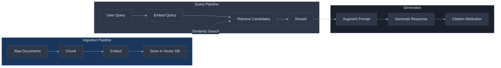

# RAG: From Concept to Production -- Bridging the Knowledge Gap Without Losing Control

**Thesis:** Retrieval quality -- not embedding-model quality -- sets the ceiling on a retrieval-augmented system, and that ceiling is fixed at chunking time, before anyone compares vector databases.
**Prerequisites:** [LLM Fundamentals](llm-fundamentals-for-practitioners.md) (tokens, context windows, API call anatomy), [Prompt Engineering](prompt-engineering.md) (system prompts, output formatting), [Context Engineering](context-engineering.md) (context budget, positioning, retrieval principles), and [Structured Output](structured-output-and-parsing.md) (schemas for machine-readable output).
**Reading time:** 26 minutes

Your model can reason, summarize, extract, and generate. It does not know your company's internal documentation, last week's policy change, or the contract your legal team signed yesterday: it lacks information, not capability. Retrieval-Augmented Generation (RAG) bridges that gap -- and it is the most common production LLM pattern after single API calls, and the most frequently botched.

---

## The Core Tension

RAG solves one problem -- getting information into the context window -- while creating a new class of engineering problems. **You are building a search engine whose results become the model's reality, and the model cannot tell a relevant retrieval from a misleading one.** Every hallucination and confident fabrication in a RAG system traces back to what the pipeline put in front of the model, or failed to.

It is neither a retrieval problem nor a generation problem but a pipeline problem: errors compound across seven stages whose failure modes interact, which makes end-to-end debugging difficult.

| What teams assume | What actually happens |
|---|---|
| "RAG grounds the model in facts" | RAG grounds the model in whatever the retrieval pipeline returns -- relevant or not |
| "Better embeddings fix retrieval" | [Chunking decisions cause 80% of retrieval failures](https://towardsdatascience.com/six-lessons-learned-building-rag-systems-in-production/), not embedding quality |
| "More documents means better answers" | More documents means more noise; retrieval precision drops as corpus size grows |
| "The model will ignore irrelevant context" | Models incorporate retrieved context even when it contradicts their training data |
| "RAG eliminates hallucination" | RAG creates new hallucination modes: fabricated citations, chunk-boundary confabulation, contradiction resolution |
| "Evaluation is about answer quality" | Retrieval quality and generation quality are independent problems requiring separate metrics |

The fundamental mistake is treating RAG as a feature ("add search to your LLM") rather than a distributed system -- a search engine, a vector database, a reranking layer, and a language model -- whose independent failure modes multiply rather than add.


```mermaid
%%{init: {'theme': 'base', 'themeVariables': {'primaryColor': '#2d3748', 'primaryTextColor': '#e2e8f0', 'primaryBorderColor': '#4a5568', 'lineColor': '#a0aec0', 'secondaryColor': '#4a5568', 'tertiaryColor': '#1a202c', 'edgeLabelBackground': '#2d3748', 'clusterBkg': '#2d3748', 'clusterBorder': '#4a5568'}}}%%
graph LR
    subgraph Ingestion["Ingestion Pipeline"]
        A[Raw Documents] --> B[Chunk]
        B --> C[Embed]
        C --> D[Store in Vector DB]
    end

    subgraph Retrieval["Query Pipeline"]
        E[User Query] --> F[Embed Query]
        F --> G[Retrieve Candidates]
        G --> H[Rerank]
    end

    subgraph Generation["Generation"]
        H --> I[Augment Prompt]
        I --> J[Generate Response]
        J --> K[Citation Attribution]
    end

    D -.->|"Similarity Search"| G

    style Ingestion fill:#1a365d,stroke:#2b6cb0,color:#e2e8f0
    style Retrieval fill:#2d3748,stroke:#4a5568,color:#e2e8f0
    style Generation fill:#1a202c,stroke:#4a5568,color:#e2e8f0
```

The rest of this document walks each stage, explains how it fails, and shows how to build it so that errors do not compound into unusable output.

---

## Failure Taxonomy

These seven failure modes -- drawn from [academic analysis](https://arxiv.org/pdf/2401.05856) and production experience -- explain why a system can work in demos and degrade silently in production.

### Failure 1: Missing Content

**What it looks like:** The user asks a question the corpus cannot answer, and the system answers anyway -- confidently and incorrectly.

**Why it happens:** RAG always retrieves something. Vector search returns the top-K most similar documents whether or not any contain the answer, and there is no built-in "I don't know" mechanism. The model assumes retrieved context is relevant.

**Example:** A user asks "What is our parental leave policy in Germany?" The corpus holds US and UK policies only. Retrieval returns the UK policy, and the model synthesizes a coherent answer that cites a real document and is wrong for Germany.

**Root cause:** No retrieval confidence threshold. No abstention logic.

### Failure 2: Missed Top-Ranked Documents

**What it looks like:** The answer exists in the corpus, but the relevant documents rank below the top-K cutoff and never reach the model.

**Why it happens:** Query vocabulary does not match document vocabulary. Embedding similarity captures meaning but misses exact terms -- acronyms, product codes, proper names. A query about "PTO accrual" may not match a document that calls it "vacation day accumulation."

**Example:** A user asks about "SOC 2 compliance requirements." The relevant document says "Service Organization Control Type II audit" throughout, so its similarity score is moderate and documents about "security compliance" or "audit frameworks" rank higher.

**Root cause:** Pure semantic search without keyword matching. Lack of hybrid retrieval.

### Failure 3: Not in Context -- The Consolidation Loss

**What it looks like:** Relevant documents are retrieved, but the answer is lost when they are consolidated to fit the context window.

**Why it happens:** Context windows are finite. When retrieval returns 20 documents and only 10 fit, truncation may cut the document holding the answer. Even when all fit, the [lost-in-the-middle effect](context-engineering.md) means models attend less to documents in the middle of the context -- exactly where moderately-ranked retrievals land. [Context-rot research shows performance degrading non-uniformly with input length](https://tianpan.co/blog/2026/04/27/long-context-vs-rag-2026-decision-tree).

**Root cause:** No reranking before context assembly. Poor document positioning.

### Failure 4: Extraction Failure

**What it looks like:** The answer is in the context, the model "sees" it, but the response does not use it correctly.

**Why it happens:** Noisy context -- contradictory statements, partial information, irrelevant passages alongside the answer -- makes the model average across the noise instead of extracting the signal. This is worst when the answer is a number, date, or name buried in a long passage.

**Root cause:** Too many retrieved documents. Insufficient reranking. No chunk-level relevance filtering.

### Failure 5: Chunk Boundary Problems

**What it looks like:** The answer spans two chunks and neither contains enough to answer. Or a chunk begins mid-sentence and the model cannot interpret it.

**Why it happens:** Fixed-size chunking splits at arbitrary token boundaries, cutting sentences, paragraphs, and logical units. A table spanning a boundary becomes two meaningless fragments; a definition in one chunk and its application in the next become disconnected.

**Example:** A legal contract states: "The indemnification cap shall be limited to the total fees paid under this agreement in the preceding 12-month period." If the chunk boundary falls between "limited to the total fees paid" and "under this agreement in the preceding 12-month period," neither chunk alone answers "What is the indemnification cap?"

**Root cause:** Chunking strategy ignores document structure. No overlap or overlap is insufficient.

### Failure 6: Context Poisoning

**What it looks like:** Answer quality drops after RAG is added, compared with the model answering from training data alone.

**Why it happens:** Retrieval is imprecise: it returns documents that are topically related but factually irrelevant or subtly misleading. The model incorporates that noise, and because retrieved context usually overrides training data in its attention, a wrong retrieved document is worse than no retrieval.

**Real-world data:** OpenAI's [Icelandic Errors Corpus study](context-engineering.md) found that adding RAG to a fine-tuned translation model degraded BLEU scores from 87 to 83: the retrieval introduced noise on tasks the model had already learned.

**Root cause:** No relevance threshold on retrieved documents. Retrieving too many documents.

### Failure 7: Contradictory Passages

**What it looks like:** Retrieved documents conflict, and the model picks one arbitrarily, averages them into an incorrect synthesis, or hedges without naming the contradiction.

**Why it happens:** Real corpora hold versioned information, drafts beside finals, policies from different periods, and documents from different teams with different terminology. Retrieval does not track document versions, authority levels, or temporal ordering by default.

**Example:** The corpus contains a 2024 expense policy ("reimbursement up to $500 per trip") and a 2025 update ("reimbursement up to $750 per trip"). Both are retrieved. The model may answer "$500," "$750," "$625" (an average it invented), or "between $500 and $750" depending on document positioning and the model's interpretation.

**Root cause:** No metadata filtering for recency, version, or authority. No temporal ordering of retrieved documents.

---

## The RAG Maturity Spectrum

This five-level progression shows where a system stands and what the next improvement is worth.


```mermaid
%%{init: {'theme': 'base', 'themeVariables': {'primaryColor': '#2d3748', 'primaryTextColor': '#e2e8f0', 'primaryBorderColor': '#4a5568', 'lineColor': '#a0aec0', 'secondaryColor': '#4a5568', 'tertiaryColor': '#1a202c', 'edgeLabelBackground': '#1a365d', 'clusterBkg': '#1a365d', 'clusterBorder': '#2b6cb0'}}}%%
graph TD
    subgraph Progression["RAG Maturity Levels"]
        L0["Level 0: Naive RAG<br/>Chunk → Embed → Top-K → Generate<br/>No reranking, no hybrid search"]
        L1["Level 1: Structured RAG<br/>Document-aware chunking<br/>Metadata filtering, overlap"]
        L2["Level 2: Hybrid RAG<br/>Semantic + BM25 retrieval<br/>Cross-encoder reranking"]
        L3["Level 3: Contextual RAG<br/>LLM-enriched chunks<br/>Query rewriting, HyDE"]
        L4["Level 4: Evaluated RAG<br/>Automated eval pipeline<br/>Retrieval + generation metrics separated"]
        L5["Level 5: Agentic RAG<br/>Model drives retrieval as a tool<br/>Iterative search, document navigation<br/>Harness manages context growth"]

        L0 --> L1
        L1 --> L2
        L2 --> L3
        L3 --> L4
        L4 --> L5
    end

    style Progression fill:#1a365d,stroke:#2b6cb0,color:#e2e8f0
    style L0 fill:#742a2a,stroke:#c53030,color:#fed7d7
    style L1 fill:#744210,stroke:#c05621,color:#fefcbf
    style L2 fill:#2d3748,stroke:#4a5568,color:#e2e8f0
    style L3 fill:#22543d,stroke:#38a169,color:#c6f6d5
    style L4 fill:#1a365d,stroke:#2b6cb0,color:#bee3f8
    style L5 fill:#44337a,stroke:#6b46c1,color:#e9d8fd
```

**Level 0 -- Naive RAG:** Fixed-size chunks (500 tokens), one embedding model, cosine similarity top-5, dump into prompt, generate. Every tutorial teaches this. It works in demos and fails in production. Typical faithfulness: 0.47-0.51.

**Level 1 -- Structured RAG:** Structure-aware chunking (headers, paragraphs, logical boundaries), metadata attached to chunks (source, date, section), and overlap to prevent boundary failures. This alone often doubles retrieval precision.

**Level 2 -- Hybrid RAG:** Dual retrieval -- semantic search plus BM25 -- merged via Reciprocal Rank Fusion (RRF), then cross-encoder reranking before context assembly. Most production systems should target this first. [Reranking alone improves accuracy by up to 40%](https://www.zeroentropy.dev/articles/ultimate-guide-to-choosing-the-best-reranking-model-in-2025).

**Level 3 -- Contextual RAG:** LLM-generated context prepended to each chunk before embedding ([Anthropic's Contextual Retrieval](https://www.anthropic.com/engineering/contextual-retrieval) reduced failed retrievals by 49% on its own and by 67% when combined with reranking). Query rewriting decomposes complex questions into sub-queries. HyDE for ambiguous queries. The cost is real: LLM calls during ingestion.

**Level 4 -- Evaluated RAG:** An automated pipeline measuring retrieval metrics (context precision, context recall) and generation metrics (faithfulness, answer relevance) independently, a golden dataset of 50+ hand-curated cases, and 5-10% production sampling with continuous drift monitoring. This is what separates systems that work from systems that happen to work right now.

**Level 5 -- Agentic RAG:** The model drives retrieval itself. Rather than one retrieve-then-generate pass, it gets retrieval as tools -- search, find, open, summarize -- and decides what to look for, which documents deserve a closer read, and when it has enough evidence. A [2026 enterprise study](https://arxiv.org/html/2605.05538v1) reports 49.6% recall@1 on the BRIGHT benchmark (+21.8 points over the best embedding baseline), 0.96 factuality on WixQA (+13% relative), and 92% answer correctness on FinanceBench -- within 2 points of handing the model the true evidence. The ablation is the useful part: moving from one-shot retrieval to agentic tool use was worth 5.9x, while multi-query search and in-document navigation contributed at the margin. The cost is latency and tokens per query, and the failure mode is new: an autonomous loop can compound a bad early query through every later step, and [a systematization of the field](https://arxiv.org/html/2603.07379) names compounding hallucination propagation, memory poisoning, and cascading tool-execution vulnerabilities as inherent risks of the loop, not bugs in it. Level 5 therefore needs trajectory-level evaluation -- judging the path taken, not only the answer produced.

Most teams should target Level 2 first. Level 3 is warranted when retrieval precision stays below 0.7 after hybrid search and reranking. Level 4 is non-negotiable where wrong answers have consequences. Level 5 is not an upgrade path but a response to a failure signature: escalate when multi-hop or multi-document questions fail at Levels 2-4 and no amount of reranking recovers them.

---

## Design Principles

Seven principles follow, one per pipeline stage, each with the measurement that justifies it. They run in pipeline order, because that is the order in which the decisions constrain one another: a chunking choice made first caps what reranking can recover later.

### Stage 1: Chunking -- Where 80% of RAG Problems Are Born

Chunking decisions determine retrieval quality more than embedding model choice, vector database selection, or prompt engineering. [Production data shows 80% of RAG failures trace back to chunking](https://towardsdatascience.com/six-lessons-learned-building-rag-systems-in-production/), yet teams optimize everything else.

**Why it matters:** An embedding compresses a whole chunk into one vector. A chunk holding three unrelated ideas averages all three and matches none well; a chunk that splits a key concept across a boundary yields two useless fragments. The embedding is only as good as the text it represents.

#### Strategy Comparison

| Strategy | How It Works | Accuracy | Best For | Weakness |
|---|---|---|---|---|
| Fixed-size (512 tokens) | Split at token count boundaries | ~69% | Simple, general-purpose | Splits mid-sentence, ignores structure |
| Recursive character | Split by paragraph, then sentence, then word with separators | ~69%, 85-90% recall | Default recommendation | Requires tuning separators per format |
| Semantic | Group sentences by embedding similarity | ~54-92% (variance) | Dense unstructured text | Inconsistent fragment sizes, [computational cost not justified by consistent gains](https://aclanthology.org/2025.findings-naacl.114) (NAACL 2025 Findings) |
| Document-structure-aware | Split on headers, sections, logical boundaries (Markdown, HTML, PDF) | Highest for structured docs | Technical docs, policies, contracts | Requires format-specific parsers |
| Page-level | One chunk per page | 64.8% (lowest variance) | PDFs with page-coherent content | Misses cross-page concepts |
| Late chunking | Embed full document first, then chunk the embedding space | +6.5pt nDCG | Cross-reference-heavy docs | Requires model support, newer technique |

**The recommended default:** Recursive character splitting at 400-512 tokens, with paragraph, line, sentence, and word separators in that order, plus 10-20% overlap for boundary cases. For structured content (Markdown, HTML), use a structure-aware splitter.

**What overlap does:** A 50-token overlap on 500-token chunks makes the last 50 tokens of chunk N the first 50 tokens of chunk N+1, so boundary sentences appear in both and the Failure 5 split cannot happen.

**Overlap is not a panacea:** A [January 2026 analysis](https://www.firecrawl.dev/blog/best-chunking-strategies-rag) found overlap beyond 10-20% provides no measurable retrieval benefit and only raises indexing cost and storage.

```python
from langchain.text_splitter import RecursiveCharacterTextSplitter

splitter = RecursiveCharacterTextSplitter(
    chunk_size=512,
    chunk_overlap=64,  # ~12% overlap
    separators=["\n\n", "\n", ". ", " ", ""],
    length_function=len,
)

chunks = splitter.split_text(document_text)

# Attach metadata to every chunk
for i, chunk in enumerate(chunks):
    chunk.metadata = {
        "source": document_path,
        "chunk_index": i,
        "ingested_at": datetime.utcnow().isoformat(),
        "document_version": doc_version,
    }
```

### Stage 2: Embedding -- Choosing the Right Model

The embedding model converts text into a dense vector of semantic meaning. The choice matters less than chunking but more than most teams realize, particularly for domain-specific vocabularies.

#### Current Landscape (September 2026)

| Model | Reported retrieval score | Dimensions | Cost per 1M Tokens | Best For |
|---|---|---|---|---|
| KaLM-Embedding-Gemma3-12B | ~72.3 (top open-weight aggregate) | 3840 | Free (self-hosted) | Highest reported open-weight quality |
| jina-embeddings-v5-text-small | ~71.7 (English v2) | 1024 | Free (self-hosted) | Best quality under 1B parameters |
| Qwen3-Embedding-8B | ~70.6 (multilingual) | 4096 | Free (self-hosted) | Multilingual, on-premises |
| embeddinggemma-300m | ~69.7 (English v2) | 768 | Free (self-hosted) | Smallest footprint at usable quality |
| Gemini-embedding-001 | ~68 | 3072 (truncatable to 128) | ~$0.004/1K chars | Managed, strongest multilingual and code placement |
| OpenAI text-embedding-3-large | ~64.6 | 3072 | $0.13 | Ecosystem, Matryoshka truncation |
| OpenAI text-embedding-3-small | ~62 | 1536 | $0.02 | Best cost-quality balance |
| all-MiniLM-L6-v2 | ~56 | 384 | Free (self-hosted) | Prototyping only |

Scores are aggregates reported by [MTEB leaderboard mirrors](https://www.codesota.com/benchmarks/mteb) and [model comparison write-ups](https://surrealdb.com/blog/embedding-models-comparison). Leaderboard versions and task mixes differ, so read the table as a shortlist and check the [live leaderboard](https://huggingface.co/spaces/mteb/leaderboard) before committing. The best open-weight models sit within a few points of the best managed ones, so hosting economics and language coverage usually decide the choice, not quality.

**Decision factors:**

1. **Open-weight models now rival commercial APIs.** Qwen3-Embedding and BGE-M3 match or exceed them on benchmarks; the gap has closed since 2024.

2. **Matryoshka embeddings reduce storage costs.** OpenAI's text-embedding-3 models support dimensional truncation -- you can store 256-dimensional vectors instead of 3072 and retain most quality. cutting storage costs by 12x.

3. **Fine-tuning yields 10-30% gains for specialized domains.** For legal, medical, or financial vocabulary, fine-tuning an embedding model on your own data is one of the highest-ROI investments in the pipeline.

4. **Do not choose on benchmarks alone.** MTEB scores reflect general-purpose retrieval; your domain may differ. Evaluate on your own data and queries.

```python
from openai import OpenAI

client = OpenAI()

def embed_texts(texts: list[str], model: str = "text-embedding-3-small") -> list[list[float]]:
    response = client.embeddings.create(input=texts, model=model)
    return [item.embedding for item in response.data]

def batch_embed(chunks: list[str], batch_size: int = 100) -> list[list[float]]:
    """Embed in batches to respect rate limits."""
    embeddings = []
    for i in range(0, len(chunks), batch_size):
        embeddings.extend(embed_texts(chunks[i:i + batch_size]))
    return embeddings
```

### Stage 3: Vector Storage -- Choosing a Database

The vector database stores embeddings and runs similarity search. It is infrastructure, not magic: the right choice depends on scale, existing stack, and operational capacity.

| Database | Scale Ceiling | Native Hybrid Search | Key Strength | Key Weakness | Use When |
|---|---|---|---|---|---|
| **pgvector** | ~5M vectors | No | SQL joins, zero new infra | Vertical-only scaling | You are a Postgres shop and stay under 5M vectors |
| **Pinecone** | Billions | Sparse-dense vectors | Fully managed, auto-scaling | Vendor lock-in, limited filtering | You need scale without ops burden |
| **Qdrant** | Hundreds of millions | Named vectors (v1.9+) | Rich payload filtering, open-source | Smaller ecosystem | You need filtering and self-hosting |
| **Weaviate** | Hundreds of millions | BM25 + vector native | Best native hybrid search | More complex operations | Hybrid search is a primary requirement |
| **Milvus** | Billions | Sparse-BM25 (v2.5+) | Enterprise-scale distributed | Operational complexity | Enterprise scale with dedicated ops team |
| **Chroma** | ~500K practical | No | Fastest prototyping, simple API | Performance walls at scale | Prototyping and small datasets |

Source: [Vector database comparison and benchmarks](https://encore.dev/articles/best-vector-databases).

**The practical recommendation:** If you already run Postgres, start with pgvector plus the pgvectorscale extension. It handles up to 5M vectors -- [benchmarks show 471 QPS at 75% lower cost than Pinecone at 50M vectors](https://encore.dev/articles/best-vector-databases). Plan a migration to a dedicated vector database beyond that ceiling.

**Chroma is for prototyping.** Its API is the simplest to start with, which is why every tutorial uses it. Plan the migration to pgvector or Qdrant before you pass a few hundred thousand vectors.

### Stage 4: Retrieval -- Beyond Naive Similarity

Pure semantic search -- embed the query, find the nearest vectors, return the top K -- is where most tutorials stop and most production systems start failing. Three techniques take retrieval from "usually close enough" to "reliably precise."

#### Hybrid Search: Semantic + BM25

BM25 and semantic search have complementary strengths: BM25 matches exact terms -- acronyms, product codes, proper names, error codes -- while semantic search matches concepts, paraphrases, and synonyms. [As Simon Willison argues, keyword search remains underrated for RAG](https://simonwillison.net/tags/rag/): embeddings systematically miss exact technical terms that full-text search handles perfectly.

**Reciprocal Rank Fusion (RRF)** merges results from both retrieval methods without requiring comparable relevance scores:

```
RRF_score(d) = sum(1 / (k + rank_i(d))) for each retrieval method i
```

`k` (typically 60) prevents high-ranked documents from dominating; each document's RRF score is the sum of its inverse ranks across all retrieval lists.

```python
def hybrid_search(query: str, k: int = 20, rrf_k: int = 60) -> list[dict]:
    """Retrieve semantically and by keyword, then fuse with RRF."""
    semantic_results = vector_search(embed_texts([query])[0], top_k=50)
    keyword_results = bm25_search(query, top_k=50)

    scores = {}
    for results in (semantic_results, keyword_results):
        for rank, doc in enumerate(results):
            scores[doc["id"]] = scores.get(doc["id"], 0) + 1 / (rrf_k + rank + 1)

    fused = sorted(scores.items(), key=lambda x: x[1], reverse=True)[:k]
    return [{"id": doc_id, "rrf_score": score} for doc_id, score in fused]
```

#### Query Rewriting

Complex queries often carry sub-questions that a single retrieval cannot satisfy. Query rewriting uses an LLM to decompose the original into retrieval-optimized sub-queries.

```python
def rewrite_query(original_query: str) -> list[str]:
    response = client.chat.completions.create(
        model="gpt-4o-mini",
        messages=[
            {"role": "system", "content": """Given a user question, generate 2-4
            search queries that would retrieve the documents needed to answer it.
            Each targets a different aspect. Return one per line, no numbering."""},
            {"role": "user", "content": original_query},
        ],
        temperature=0.0,
    )
    return response.choices[0].message.content.strip().split("\n")
```

#### HyDE: Hypothetical Document Embeddings

Instead of embedding the question directly, HyDE has an LLM generate a hypothetical answer and embeds that for retrieval: a hypothetical answer sits closer in embedding space to real answers than the question does.

**When HyDE helps:** conceptual or ambiguous queries whose vocabulary does not match the document's. "How does our authentication system handle session expiry?" generates an answer about session tokens, TTLs, and refresh mechanisms -- terms the documentation likely contains.

**When HyDE hurts:** fact-bound queries about specific data points. "What was our Q3 revenue?" generates fabricated numbers, which retrieve general revenue documents instead of the Q3 report.

### Stage 4b: Late-Interaction Retrieval -- Exactness Without a Second Index

Single-vector retrieval compresses a whole chunk into one vector, which is where rare identifiers, error codes, and part numbers are averaged away. Late-interaction models keep one vector per token and score a query with a maximum-similarity operation over them, so exact terms survive compression while semantic matching still works -- the effect hybrid search buys with BM25, obtained inside the embedding.

It is no longer research-only. [Multivector support is shipping in production vector databases](https://qdrant.tech/articles/late-interaction-models/), [the main embedding library exposes a multivector encoder](https://huggingface.co/blog/multi-vector-encoder), and [a dedicated late-interaction workshop now runs in the research calendar](https://www.lateinteraction.com). The cost is storage -- one vector per token instead of one per chunk, typically an order of magnitude more index -- so it is usually paired with compression or applied only where exact-term recall is failing.

**When to add it:** when your evaluation shows retrieval missing chunks that contain a literal identifier, code, or rare term the query also contained, and hybrid search has not closed the gap.

### Stage 5: Reranking -- The Highest-ROI Improvement

Reranking is the single most impactful improvement you can add to an existing RAG pipeline: [cross-encoder reranking improves RAG accuracy by up to 40%](https://www.zeroentropy.dev/articles/ultimate-guide-to-choosing-the-best-reranking-model-in-2025), at minimal implementation cost.

**Why reranking works:** Embedding retrieval uses **bi-encoders**: query and document are embedded independently and compared by cosine similarity -- fast but imprecise. **Cross-encoders** process both together, enabling token-level interaction: slow (document encodings cannot be precomputed) but far more precise.

The production pattern is a two-stage pipeline:
1. **Retrieve** 50-150 candidates via hybrid search (fast, imprecise)
2. **Rerank** to select the top 10-20 using a cross-encoder (slow per-document, but only runs on the candidate set)

| Reranker | NDCG@10 | Latency | Cost per 1M Tokens | Notes |
|---|---|---|---|---|
| ZeroEntropy zerank-1 | 0.85+ | 200ms-2s | $0.025 | Best price-performance |
| Cohere rerank-4 Pro | Strong (+170 ELO vs v3.5) | Fast | ~$1/1K requests | +400 ELO on business/finance tasks |
| LLM-based (pointwise) | 0.70-0.90+ | 1-5s+ | $0.50-$5.00 | Highest quality ceiling, highest cost |

Source: [Reranking model comparison with benchmarks and pricing](https://www.zeroentropy.dev/articles/ultimate-guide-to-choosing-the-best-reranking-model-in-2025).

**The cost argument for reranking:** reranking 75 candidates with a cheap cross-encoder and sending only the top 20 (instead of all 75) cuts generation costs by about 72% while preserving 95% of answer accuracy. The arithmetic holds at any frontier-tier token price, which is why it survives every model generation.

### Stage 6: Prompt Augmentation and Generation

Reranked, filtered chunks still need assembling into a prompt the model can reason over. This is where [Context Engineering](context-engineering.md) principles apply.

**Principles from Context Engineering that apply here:**

- **Retrieve less, retrieve better -- but measure the number.** [Context Engineering](context-engineering.md) documents this as Principle 6: each additional document adds noise faster than value. Anthropic's retrieval tests point the other way: [passing the top 20 chunks beat top-10 and top-5](https://www.anthropic.com/engineering/contextual-retrieval), and their benefits stacked rather than competed. The count is dataset-specific, so treat 5, 10, and 20 as candidates and measure the trade.
- **Position matters.** Place the most relevant documents first and last; middle documents get less attention (the lost-in-the-middle effect in [Context Engineering](context-engineering.md)).
- **Budget allocation.** In a 200K token window, allocate roughly 25% (50K tokens) to retrieved context; the rest carries the system prompt, conversation history, and generation space.

### Stage 7: Citation and Source Attribution

Citation accuracy in RAG systems [averages only 65-70% without explicit attribution mechanisms](https://www.tensorlake.ai/blog/rag-citations). Up to 57% of citations are post-rationalized: the model fabricates a plausible citation rather than grounding its answer in a specific chunk. That is a separate failure mode from hallucination -- the answer may be correct while the citation is wrong.

**The production approach:** Preserve source information at indexing time, not retrieval time -- attach chunk identifiers, page numbers, and section headers as metadata at ingestion, include that metadata in the context, and verify citations programmatically after generation.

---

## Evaluation: Real-World Systems

RAG evaluation measures two independent systems: retrieval and generation. A system can retrieve well and generate badly (the model ignores the context), or retrieve badly and generate well (the model answers from training data, making the pipeline pointless).

**What named systems report.** Measured results from identifiable systems and studies -- calibration points for what a working pipeline achieves and what a failing one looks like, not numbers to copy, because each is dataset-specific.

| System or study | What was measured | Reported result |
|---|---|---|
| Anthropic Contextual Retrieval | Failed retrievals | 49% fewer with contextual embeddings plus contextual BM25; 67% fewer once reranking is added |
| pgvectorscale vs. Pinecone | Queries per second at 50M vectors | 471 QPS at roughly 75% lower cost |
| ZeroEntropy zerank-1 | nDCG@10 and latency | 0.85+ with 200ms-2s reranking latency |
| AgenticRAG (2026 enterprise study) | BRIGHT recall@1 | 49.6%, +21.8 points over the best embedding baseline |
| AgenticRAG (2026 enterprise study) | FinanceBench answer correctness | 92%, within 2 points of oracle evidence access |
| Long-context prompting as an alternative | Multi-fact recall at high input length | Roughly 60%, with the effective window landing at 30-60% of the nominal one |

Keep the last row in view when someone proposes deleting the retrieval layer: the alternative is not free, and not as accurate as the window size suggests.

| Metric | What It Measures | Target Threshold | What a Low Score Means |
|---|---|---|---|
| **Context Precision** | Are relevant chunks ranked higher in retrieval? | 0.7+ | Reranking needed |
| **Context Recall** | Did retrieval find all necessary information? | 0.75+ | Chunking or retrieval pipeline problem |
| **Faithfulness** | Are generated claims supported by retrieved context? | 0.8+ (0.9+ for regulated domains) | Model hallucinating beyond context |
| **Answer Relevance** | Does the response address the actual question? | 0.75+ | Retrieval returning irrelevant context |
| **Hallucination Rate** | Percentage of unsupported claims in production | Under 5% | Investigate recent ingestion or prompt changes |

Source: [RAG evaluation metrics and framework comparison](https://blog.premai.io/rag-evaluation-metrics-frameworks-testing-2026/).

**The evaluation dataset strategy:** Start with 50 hand-curated golden question-answer pairs where you know the correct answer and which documents contain it. Expand with 500 LLM-generated synthetic pairs (human-reviewed). Sample 5-10% of production traffic continuously.

**Framework recommendation:** Use [RAGAS](https://docs.ragas.io/) for rapid experimentation and baselines, then move to [DeepEval](https://deepeval.com/docs/getting-started) for CI/CD -- it integrates natively with pytest and supports deployment quality gates. Never evaluate with the model that generates answers; use a separate judge.

---

## The Production Pipeline: Beyond the Happy Path

A production RAG system is not a script that runs once: it is an operation with ingestion scheduling, incremental updates, stale-data handling, and monitoring.

### Ingestion Scheduling

Documents change and policies update, so ingestion must handle incremental updates without re-embedding the whole corpus.

**Pattern:** Track document hashes. Each run compares each document's hash with the stored one, re-chunks and re-embeds only changed documents, and deletes chunks from removed documents.

### Metadata Filtering

A query about "current policy" should not retrieve deprecated documents. Metadata filtering narrows retrieval before similarity search, reducing noise and improving precision.

**Essential metadata fields:**
- `source`: Document path or identifier
- `ingested_at`: When the chunk was indexed
- `document_version`: Version or revision number
- `department` / `team`: Organizational scope
- `document_type`: Policy, procedure, FAQ, contract, etc.
- `effective_date` / `expiry_date`: Temporal validity

Pre-filter by metadata before vector search: faster (smaller search space) and more precise (no irrelevant temporal or organizational matches).

### Stale Data Handling

Stale data is poison: a system that returns outdated information is worse than one that returns nothing, because the user trusts the retrieved context.

**Strategies:**
1. **TTL on chunks:** Set a time-to-live on ingested chunks; re-ingest or flag anything older for review.
2. **Version-aware retrieval:** When several versions of a document exist, prefer the latest; filter out superseded ones.
3. **Staleness alerts:** Monitor the age distribution of retrieved chunks; alert the team when the median age crosses a threshold.

---

## When RAG Is Not the Right Pattern

RAG is the default answer to "the model does not know about X," but it is not always right. [AI-Native Solution Patterns](ai-native-solution-patterns.md) covers this in detail; the key decision points are:

**Use RAG when:**
- The knowledge base changes frequently (weekly or more)
- You need to cite sources
- The information is too large for a single prompt
- You need to answer across a large corpus

**Consider fine-tuning instead when:**
- The knowledge is stable
- You need the model to internalize a style, format, or reasoning pattern
- The vocabulary is specialized and embeddings miss it
- Latency requirements make retrieval a bottleneck

**Consider long-context prompting instead when:**
- The total knowledge fits comfortably inside the window. [Anthropic's rule of thumb](https://www.anthropic.com/engineering/contextual-retrieval): a knowledge base under roughly 200,000 tokens can simply be placed in the prompt, with prompt caching absorbing most of the repeat cost
- The information is needed for every query
- You do not need per-claim attribution: a long-context answer carries no provenance trail unless you build one

**Do not treat the choice as binary, or permanent.** [A 2026 analysis](https://tianpan.co/blog/2026/04/27/long-context-vs-rag-2026-decision-tree) argues it is a per-feature decision, not a per-product one, because the economics have flipped twice in two years -- retrieval was declared obsolete in 2024 and rehabilitated in 2025. The measured case for caution: long-context multi-fact recall falls to roughly 60% well before nominal capacity, the effective window lands somewhere between 30% and 60% of the advertised number depending on task, and full-window calls are reported 30-60 times slower than a tuned retrieval pipeline at roughly a thousand times the per-query cost. Decide per surface on four axes -- freshness, attribution, tail risk, and cost -- and write the decision down, because prices and window sizes will move again.

**Consider agentic tool use instead when:**
- The information lives in databases, APIs, or systems that support direct queries
- The "retrieval" problem is actually a "query construction" problem

---

## Recommendations

### Short-Term: Foundation (Week 1-2)

1. **Audit your chunking strategy.** Move from fixed-size splits to recursive character splitting with structure-aware separators, and measure precision before and after: it often doubles.
2. **Add metadata to every chunk.** Source, ingestion date, version, section header at minimum. You cannot filter or debug what you cannot identify.
3. **Implement abstention.** Threshold the retrieval scores; if nothing clears it, answer "I don't have information about this" rather than generating from low-relevance context.

### Medium-Term: Precision (Week 3-6)

4. **Implement hybrid search.** Add BM25 alongside semantic search and fuse with RRF; it addresses the vocabulary-mismatch failure.
5. **Add cross-encoder reranking.** Retrieve 50-75 candidates, rerank to the top 10-20, then send; it pays for itself in context tokens.
6. **Build your evaluation dataset.** 50 hand-curated golden pairs minimum, with retrieval and generation metrics tracked separately.

### Long-Term: Robustness (Month 2+)

7. **Implement incremental ingestion.** Track document hashes, re-embed only what changed, and monitor staleness.
8. **Add Contextual Retrieval.** Prepend LLM-generated context to each chunk before embedding: 49% fewer failed retrievals alone, 67% with reranking added. The ingestion cost is real; evaluate whether the gain justifies it.
9. **Deploy continuous evaluation.** Sample 5-10% of production traffic, watch faithfulness and context precision trends, and alert on drift.

---

## Field Notes from an Operating Estate

Two observations from a practitioner estate that runs agent harnesses daily, plus a statement of what it has not measured.

**July 2026 -- an index built for machines, not people.** The estate's own index was rebuilt as a retrieval surface for agents rather than a document for humans. Entries had to be short and uniform, anchors stable because other documents linked into them, and every pointer resolvable -- an agent that follows a dead pointer does not shrug and move on, it burns budget re-deriving the structure the index was supposed to supply. A corpus optimized for human narrative is the wrong entry point for an agent, and the fix is not a better embedding model but a front door written for the reader that actually arrives.

**On the limits of this section.** The estate's retrieval experience is document-and-index retrieval, not a production vector pipeline, so it offers no chunking, embedding, or reranker measurements, and this document invents none. The sections above rest on the published sources cited; these notes rest on operating logs.

## The Hard Truth

Most RAG systems in production are Level 0 -- naive chunking, single-method retrieval, no reranking, no evaluation -- and their teams do not know it, because they evaluate the final answer and assume good answers mean good retrieval. That is like judging a search engine by its first result: it says nothing about the thousands of queries where the right document ranked eleventh.

The uncomfortable reality is that **chunking -- the least glamorous, most tedious part of the pipeline -- determines 80% of your system's quality ceiling.** Teams spend weeks selecting embedding models and vector databases, then ten minutes on a fixed-size chunker with defaults. The embedding model cannot save a bad chunk. The vector database cannot index meaning that the chunker destroyed. The reranker cannot promote a document that the chunker split into meaningless fragments.

The second uncomfortable reality: **RAG does not eliminate hallucination -- it redirects it.** A model without RAG hallucinates from training data; a model with RAG hallucinates from its retrieved context, often with more confidence because it has "sources" to point to. The citations look real and the documents exist, but the model synthesized an answer no single document supports. That is harder to detect than training-data hallucination, because the evidence appears to be right there in the context.

If you do not measure retrieval precision and generation faithfulness separately, you do not know whether your RAG system works -- only whether it produces plausible-sounding answers. Those are different things.

---

## Summary Checklist

| Question | Good Answer | Bad Answer |
|---|---|---|
| Can you measure retrieval quality independently of generation quality? | Yes -- context precision and recall are tracked separately | No -- we evaluate final answers only |
| Does your chunking strategy respect document structure? | Yes -- headers, paragraphs, and logical boundaries guide splits | No -- fixed-size token splits everywhere |
| Do you use hybrid search (semantic + keyword)? | Yes -- BM25 and embedding search with RRF fusion | No -- embedding similarity only |
| Do you rerank before sending context to the model? | Yes -- cross-encoder selects top 10-20 from 50+ candidates | No -- top-K retrieval goes directly to the prompt |
| Does your system know when it does not have an answer? | Yes -- relevance threshold triggers abstention | No -- it always generates something from whatever it retrieves |
| Can you trace a generated claim back to a specific chunk? | Yes -- citations map to chunk IDs with source metadata | No -- the model generates citations from memory |
| How do you handle stale documents? | Incremental ingestion with hash comparison and TTL monitoring | Full re-index periodically, no staleness detection |
| What is your evaluation dataset? | 50+ golden pairs, synthetic expansion, production sampling | "We try a few questions manually" |
| Does adding RAG measurably improve your system vs. baseline? | Yes -- A/B tested against no-retrieval baseline | Unknown -- never measured |
| Do retrieved chunks carry metadata (source, version, date)? | Yes -- every chunk has provenance metadata | No -- just the text content |

---

## References

### Research Papers

- [Seven Failure Points When Engineering a Retrieval Augmented Generation System](https://arxiv.org/pdf/2401.05856) -- Barnett et al. taxonomy of RAG failure modes with case studies across production systems.
- [AgenticRAG: Agentic Retrieval for Enterprise Knowledge Bases](https://arxiv.org/html/2605.05538v1) -- Enterprise agentic retrieval harness with BRIGHT, WixQA, and FinanceBench results.
- [SoK: Agentic Retrieval-Augmented Generation](https://arxiv.org/html/2603.07379) -- Systematization of agentic retrieval: taxonomy, trajectory-level evaluation, and the systemic risks of autonomous loops.
- [Is Semantic Chunking Worth the Computational Cost?](https://aclanthology.org/2025.findings-naacl.114) -- NAACL 2025 Findings: semantic chunking's costs are not justified by consistent gains over fixed-size chunking.

### Practitioner Articles

- [Simon Willison's RAG Tag](https://simonwillison.net/tags/rag/) -- Practitioner perspective on RAG limitations, hybrid search, prompt injection, and reasoning-model incompatibility.
- [Six Lessons Learned Building RAG Systems in Production](https://towardsdatascience.com/six-lessons-learned-building-rag-systems-in-production/) -- Production lessons on data preparation, chunking, staleness, and evaluation.
- [Optimizing RAG with Hybrid Search and Reranking](https://superlinked.com/vectorhub/articles/optimizing-rag-with-hybrid-search-reranking) -- Hybrid search architecture with the RRF formula and reranking details.
- [Best Chunking Strategies for RAG](https://www.firecrawl.dev/blog/best-chunking-strategies-rag) -- Chunking strategy comparison with 2025-2026 benchmark data from NVIDIA, Chroma, and Vecta.

### Official Documentation and Tools

- [Anthropic Contextual Retrieval](https://www.anthropic.com/engineering/contextual-retrieval) -- Prepending LLM-generated context to chunks before embedding; the source for the 49%/67% figures and the under-200K-token rule of thumb.
- [RAG Evaluation Metrics and Frameworks](https://blog.premai.io/rag-evaluation-metrics-frameworks-testing-2026/) -- Framework comparison (RAGAS vs DeepEval vs TruLens) with metric thresholds and CI/CD integration patterns.
- [DeepEval Documentation](https://deepeval.com/docs/getting-started) -- Test framework for LLM systems, covering the RAG metrics above.
- [MTEB Leaderboard](https://huggingface.co/spaces/mteb/leaderboard) -- Live embedding-model leaderboard; the table above is a dated snapshot.

### Comparisons and Benchmarks

- [MTEB Benchmark Summary](https://www.codesota.com/benchmarks/mteb) and [Embedding Model Comparison](https://surrealdb.com/blog/embedding-models-comparison) -- Sources for the embedding table above: aggregate retrieval scores, dimensions, and self-hosting trade-offs.
- [Late-Interaction Models in Vector Databases](https://qdrant.tech/articles/late-interaction-models/) and [Multi-Vector Encoder](https://huggingface.co/blog/multi-vector-encoder) -- Production multivector support and the library-side encoder for late interaction.
- [Long-Context vs RAG in 2026](https://tianpan.co/blog/2026/04/27/long-context-vs-rag-2026-decision-tree) -- The per-feature decision framework (freshness, attribution, tail risk, cost) and the measured limits of long-context recall.
- [Best Vector Databases](https://encore.dev/articles/best-vector-databases) -- Vector database comparison: scaling, hybrid search support, and filtering.
- [Ultimate Guide to Choosing the Best Reranking Model](https://www.zeroentropy.dev/articles/ultimate-guide-to-choosing-the-best-reranking-model-in-2025) -- Reranking model comparison: NDCG, latency, pricing, and ROI.
- [RAG Citations: Citation-Aware Architecture](https://www.tensorlake.ai/blog/rag-citations) -- Citation-aware RAG architecture with spatial anchors and a metadata layer.

### Cross-References Within This Series

- [Context Engineering](context-engineering.md) -- Context budget allocation, lost-in-the-middle positioning, context poisoning, and "retrieve less, retrieve better."
- [Structured Output and Parsing](structured-output-and-parsing.md) -- How retrieval results feed the schemas and structured output patterns in Document 4.
- [AI-Native Solution Patterns](ai-native-solution-patterns.md) -- When RAG is the right pattern versus fine-tuning, long-context prompting, or agentic tool use.
- [Evaluation-Driven Development](evaluation-driven-development.md) -- Measurement infrastructure for RAG evaluation pipelines.

---

*Last reviewed: September 2026. Changed in this revision: added Level 5 (agentic retrieval) to the maturity spectrum and a late-interaction retrieval stage; updated the embedding-model landscape from March 2026 to September 2026 and corrected the contextual-retrieval figures to their published 49%/67% split; replaced the stale model-price example in the reranking cost argument and the unqualified long-context claim with measured 2026 figures; replaced a placeholder research link with the published semantic-chunking study; added a real-systems comparison table, a DeepEval reference, and the field notes above.*
