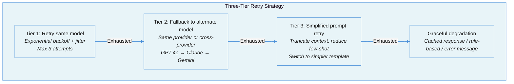

# Reliability Engineering for LLM Applications: Retries, Fallbacks, and Keeping Systems Up When Models Go Down

LLM APIs fail differently from traditional services. Latency varies by 100x between calls. Providers rate-limit without warning. Models produce confidently wrong output that passes every health check. This document covers the reliability patterns that keep LLM-integrated systems running when -- not if -- things go wrong.

> **Related:** [Cost Engineering](cost-engineering-for-llm-systems.md) covers the financial dimension of retries and fallbacks. [Observability and Monitoring](observability-and-monitoring.md) covers detecting these failures. This document covers surviving them.

---

## The Tension: LLMs Break the Traditional Reliability Playbook

Distributed systems reliability has decades of battle-tested patterns: retries with exponential backoff, circuit breakers, bulkheads, timeouts. These patterns assume failures are binary (the service is up or down) and detectable (errors return error codes). LLMs violate both assumptions.

An LLM can return HTTP 200 with a perfectly formatted JSON response that is completely wrong. It can take 200ms on one call and 45 seconds on the next with identical input. It can degrade gradually -- producing slightly worse output over weeks -- without triggering a single alert. It can enter an infinite tool-calling loop that burns $180 in tokens before anyone notices.

Traditional reliability engineering answers the question "is the service available?" LLM reliability engineering must answer a harder question: "is the service available, fast enough, and producing output that is actually correct?"

| Reliability Dimension | Traditional Service | LLM Service |
|---|---|---|
| **Failure detection** | HTTP error codes, connection failures | All of the above, plus silent quality degradation |
| **Latency** | Predictable (P99 within 2-3x P50) | Wildly variable (100ms to 60s for same prompt) |
| **Idempotency** | Well-understood patterns | Complex -- retried tool calls may double-execute |
| **Degradation** | Binary (up/down) or measurable (latency increase) | Continuous and often invisible (quality erosion) |
| **Blast radius** | Bounded by service boundary | Unbounded -- runaway agents cascade across tools |

---

## Failure Taxonomy

### Failure 1: Silent Quality Degradation

The most insidious failure mode. The model returns syntactically valid responses while semantic quality erodes. Models claiming 200K context [degrade noticeably around 130K tokens](https://www.zenml.io/llmops-database/building-production-ai-agents-lessons-from-claude-code-and-enterprise-deployments). Provider-side model updates can shift behavior without notice. The system is "up" but producing garbage.

**Detection:** Continuous evaluation as a service -- golden conversation regression suites, domain-specific QA sets, and business-critical workflow tests running on a schedule. Traditional uptime monitoring misses this entirely.

### Failure 2: The Retry Storm

A provider experiences partial degradation. Every client retries simultaneously. The retry storm overwhelms the provider, turning a partial outage into a complete one. With LLMs, this is worse than traditional services because each retry consumes expensive tokens.

**Root cause:** Retries without jitter, no circuit breakers, and no backpressure. Multiple retry layers (HTTP client, tool wrapper, agent policy) compound each other.

### Failure 3: The Runaway Agent

An agent enters an infinite tool-calling loop. It retries a failing API call, interprets the error as new information, decides to try a different approach that also fails, and loops. An [IDC survey found](https://matrixtrak.com/blog/agents-loop-forever-how-to-stop) 92% of organizations implementing agentic AI reported costs higher than expected, with runaway loops as the primary driver.

**Root cause:** Missing completion states, non-idempotent side effects, and treating all errors as transient. The agent lacks a "give up" condition.

### Failure 4: Provider Musical Chairs

A multi-provider failover architecture routes traffic to Provider B when Provider A fails. But Provider B has different prompt compatibility, output format, and quality characteristics. The application works with Provider A's output format but breaks on Provider B's slightly different JSON structure.

**Root cause:** Testing failover paths only for availability, not for behavioral consistency. The failover "works" (returns 200) but produces incompatible output.

### Failure 5: Timeout Roulette

The team sets a 30-second timeout for LLM calls. Simple prompts complete in 2 seconds. Complex reasoning takes 45 seconds and gets killed. The application retries the killed request, which times out again, creating a cascade of wasted tokens and user-facing errors.

**Root cause:** A single timeout value for all LLM call types. LLM latency varies by prompt complexity, model size, and provider load in ways that a single timeout cannot accommodate.

### Failure 6: Partial Response Corruption

The model hits the token limit mid-response (`finish_reason: "length"`). The output is valid JSON up to the truncation point, then cuts off. Downstream parsing fails or -- worse -- succeeds on the partial data, producing silently wrong results.

**Root cause:** Not checking `finish_reason` on every response. Not designing prompts and schemas to fail loudly on truncation.

---

## Reliability Patterns

### Pattern 1: The Three-Tier Retry Strategy



**Tier 1 -- Retry same model:** Exponential backoff with jitter (1s, 2s, 4s + random jitter). Respect `Retry-After` headers. Maximum 3 attempts. Only retry on transient errors (429, 500, 502, 503, 504, network timeouts). Never retry 400 (bad request), 401/403 (auth), or 404.

**Tier 2 -- Model fallback:** Chain attempts across providers: primary -> secondary -> tertiary. Each fallback runs through the full validation pipeline. This is cross-provider redundancy, not just retry.

**Tier 3 -- Simplified prompt:** An LLM-specific pattern with no analog in traditional systems. When requests fail due to token limits or complexity, automatically truncate context, reduce few-shot examples, or switch to a simpler prompt template.

### Pattern 2: Quality-Aware Circuit Breakers

Standard circuit breakers trip on HTTP errors. LLM circuit breakers must also trip on **quality degradation** -- when consecutive outputs fail validation checks (hallucination detection, schema validation, policy violations), the circuit opens to prevent wasting tokens.

[Salesforce Agentforce](https://www.salesforce.com/blog/failover-design/) trips the circuit when 40% or more of traffic fails within a 60-second window, with a 20-minute cooldown before half-open probing.

**Implementation considerations:**
- Use **distributed state via Redis** so one replica discovering an outage protects all replicas
- **Do not count context cancellations as failures** -- users legitimately cancel long-running requests
- Track both HTTP errors AND output validation failures in the failure count

```
States: CLOSED (normal) → OPEN (blocking) → HALF-OPEN (probing)

CLOSED → OPEN:  When failure_rate > 40% in 60-second window
OPEN → HALF-OPEN:  After 60-second cooldown (20 min for aggressive protection)
HALF-OPEN → CLOSED:  When 3 consecutive probe requests succeed
HALF-OPEN → OPEN:  When any probe request fails
```

### Pattern 3: Multi-Provider Failover

Multi-provider architecture is a baseline design principle, not a "nice to have." The standard architecture: an LLM gateway (LiteLLM, Portkey, or custom) sitting between applications and providers, providing a unified API.

**Hot standby (delayed parallel):** [Salesforce Agentforce](https://www.salesforce.com/blog/failover-design/) uses a "race" mechanism -- a primary callout initiates, and if no response arrives within a threshold, a parallel secondary callout launches. The system returns whichever responds first and cancels the other. Avoids sequential failover latency.

**Weighted distribution:** Split traffic proactively (60% primary, 20% secondary, 20% tertiary) rather than relying purely on reactive failover. This provides continuous validation that fallback providers are working.

**Health checks:** Synthetic monitoring pings each provider every minute, tracking response times and error rates. When thresholds exceed tolerances (3 of 5 failed), traffic reroutes before user requests fail.

### Pattern 4: Adaptive Timeouts

A single timeout value cannot handle LLM latency variability. Use per-operation timeouts:

| Operation Type | Recommended Timeout | Rationale |
|---|---|---|
| Simple classification / extraction | 10-15 seconds | Low token count, fast inference |
| Standard generation | 30-45 seconds | Moderate complexity |
| Complex reasoning / multi-step | 60-120 seconds | High token count, chain-of-thought |
| Batch / background processing | 5-10 minutes | No user waiting |
| Streaming responses | TTFT: 10s, inactivity: 15s | Time-to-first-token plus gap detection |

For streaming responses, use a **two-phase timeout**: a time-to-first-token (TTFT) timeout plus an inactivity timeout (no new tokens for N seconds) rather than a single absolute timeout.

### Pattern 5: Idempotent Tool Execution

Every tool that mutates state must be idempotent. When an agent retries after a timeout, the tool must detect the duplicate and return the existing result.

**The pattern:**
1. Each tool call includes an idempotency key (e.g., `user-123-refund-456`)
2. Before executing, check for an existing operation with that key
3. If found, return the existing result
4. If not found, execute and store the result keyed by the idempotency key

**For multi-step workflows,** classify each step as: read-only, reversible, compensatable, or final. On failure mid-workflow, walk backwards through completed steps running compensation actions.

**Rate limiting per tool:** Cap calls per tool per session. Once a tool hits its limit, return a rejection that encourages alternative approaches. This prevents the agent from hammering a single endpoint.

### Pattern 6: Runaway Agent Prevention

The Stop/Retry/Escalate framework:

| Error Class | Action | Max Retries |
|---|---|---|
| Validation / auth errors (400, 401, 403) | STOP immediately | 0 |
| Rate limits (429) | RETRY with backoff + jitter | 3, bounded |
| Timeouts / 5xx | RETRY limited, then ESCALATE | 2-3, then human |
| Safety blocks | STOP or ESCALATE | 0 |

**Loop detection:** Fingerprint the last tool call + result hash. If the fingerprint repeats 3+ times, the agent is looping. Kill the run.

**Hard limits (set all of these):**
- Maximum steps per agent run
- Maximum tool calls per run
- Maximum retries per specific tool (2-3)
- Hard wall-clock time cap
- Token/cost budget per run

### Pattern 7: Graceful Degradation Ladder

When the LLM is unavailable or degraded, degrade features in order rather than failing entirely:

1. **Serve cached responses** for frequently-requested queries (configurable TTL)
2. **Fall back to a smaller/faster model** (e.g., GPT-4o -> GPT-4o-mini)
3. **Fall back to rule-based answers** for structured queries where deterministic logic suffices
4. **Disable AI features** while keeping the rest of the application functional
5. **Show a user-facing message** explaining reduced capability

Implement at the **gateway level** (transparent to application code) rather than requiring every endpoint to handle degradation individually.

---

## Chaos Engineering for LLM Systems

Testing resilience requires deliberately injecting failures. [Practitioners consider](https://blog.nitinr.live/news/2025/10/chaos-engineering-is-non-negotiable-in-the-ai-era/) chaos engineering "non-negotiable" for AI systems.

**Fault injection scenarios:**
1. **Network faults:** Inject latency, packet loss, or blackhole traffic between application and LLM API
2. **Provider simulation:** Return 429 (rate limit), slow responses (latency injection), truncated responses (connection drop mid-stream)
3. **Resource exhaustion:** Tax CPU/memory during peak inference
4. **Quality degradation:** Force the model to return malformed or off-topic responses
5. **Cascade testing:** Fail the vector database mid-RAG-pipeline and verify the system degrades gracefully

**Methodology:**
1. Identify a single business-critical AI feature and its worst-case failure
2. Formulate a hypothesis: "If provider X goes down, the system falls back to provider Y within 5 seconds"
3. Run the experiment in staging first
4. Monitor: error rates, latency, fallback activation, user impact
5. Automate passing experiments into CI/CD

Loops and cascading failures manifest only under real production conditions because development dependencies are fast and stable -- they do not return rate limits or transient failures. Chaos engineering is how you find these problems before your users do.

---

## The Hard Truth

The most dangerous failure mode in an LLM system is not a crash. It is a system that returns HTTP 200 with confidently wrong output. Traditional reliability engineering measures availability -- can the service respond? LLM reliability engineering must measure correctness -- is the response actually right?

This means every reliability pattern in this document is necessary but insufficient without the quality monitoring described in [Observability and Monitoring](observability-and-monitoring.md) and the evaluation infrastructure described in [Evaluation-Driven Development](evaluation-driven-development.md). A circuit breaker that trips on HTTP errors will not save you from a model that returns plausible-sounding hallucinations. A retry strategy that falls back to a secondary provider will not help if the secondary provider's output is incompatible with your parsing logic.

The teams that build reliable LLM systems are not the ones with the most sophisticated retry policies. They are the ones that treat output quality as a reliability metric alongside latency and uptime -- and build the monitoring to detect degradation before users do.

---

## Summary Checklist

| Question | Good Answer | Bad Answer |
|---|---|---|
| Do you retry with exponential backoff and jitter? | Yes -- with per-error-class retry policies | No -- we retry immediately, or not at all |
| Do you have circuit breakers on LLM calls? | Yes -- tripping on both HTTP errors AND quality failures | No -- or only on HTTP errors |
| Can your system survive a provider outage? | Yes -- multi-provider failover tested in staging | No -- single provider, single point of failure |
| Do you use per-operation timeouts? | Yes -- different timeouts for simple vs complex calls | No -- one timeout for everything |
| Are your tool calls idempotent? | Yes -- idempotency keys prevent double execution on retry | No -- retries can cause duplicate side effects |
| Do you have hard limits on agent runs? | Yes -- max steps, max tokens, wall-clock cap | No -- agents run until they finish or crash |
| Do you check `finish_reason` on every response? | Yes -- `length` triggers re-request or truncation handling | No -- we parse whatever comes back |
| Have you chaos-tested your LLM integration? | Yes -- fault injection in staging, automated in CI | No -- we assume providers are reliable |
| Do you monitor output quality, not just uptime? | Yes -- continuous eval as a reliability metric | No -- our monitoring only checks availability |
| Can you degrade gracefully when LLMs are slow? | Yes -- cached responses, smaller models, rule-based fallbacks | No -- the whole feature fails if the LLM is slow |

---

## References

### Architecture and Patterns
- [Portkey: Retries, Fallbacks, and Circuit Breakers](https://portkey.ai/blog/retries-fallbacks-and-circuit-breakers-in-llm-apps/) -- Decision framework for LLM reliability patterns
- [Salesforce: Failover Design for Agentforce](https://www.salesforce.com/blog/failover-design/) -- Production failover with delayed parallel retries and quality-aware circuit breakers
- [Multi-Provider LLM Resilience](https://opendirective.net/multi-provider-llm-resilience-failover-quotas-and-drift) -- Failover, quota management, and cross-provider consistency
- [Maxim: Retries, Fallbacks, and Circuit Breakers](https://www.getmaxim.ai/articles/retries-fallbacks-and-circuit-breakers-in-llm-apps-a-production-guide/) -- Bifrost gateway patterns

### Agent Reliability
- [MatrixTrak: How to Stop Agent Infinite Loops](https://matrixtrak.com/blog/agents-loop-forever-how-to-stop) -- Fingerprint-based detection and Stop/Retry/Escalate framework
- [AI Agent Error Handling Patterns](https://blog.jztan.com/ai-agent-error-handling-patterns/) -- Quality circuit breakers, idempotent workflows, saga rollback
- [Practical Tool Use Patterns in Production](https://dev.to/young_gao/practical-guide-to-building-ai-agents-with-tool-use-patterns-that-actually-work-in-production-455b) -- Idempotency keys, per-tool rate limiting

### Timeouts, Rate Limiting, and Chaos
- [Handling Timeouts and Retries in LLM Systems](https://dasroot.net/posts/2026/02/handling-timeouts-retries-llm-systems/) -- Adaptive timeout strategies, gRPC deadline propagation
- [Rate Limiting and Backpressure for LLM APIs](https://dasroot.net/posts/2026/02/rate-limiting-backpressure-llm-apis/) -- Token-aware rate limiting algorithms
- [Circuit Breakers for LLM Services in Go](https://dasroot.net/posts/2026/02/implementing-circuit-breakers-for-llm-services-in-go/) -- Distributed state via Redis
- [Chaos Engineering Is Non-Negotiable in the AI Era](https://blog.nitinr.live/news/2025/10/chaos-engineering-is-non-negotiable-in-the-ai-era/) -- Fault injection methodology for AI systems

### Failure Detection
- [Silent Degradation in LLM Systems](https://dev.to/delafosse_olivier_f47ff53/silent-degradation-in-llm-systems-detecting-when-your-ai-quietly-gets-worse-4gdm) -- Continuous evaluation as a service for quality monitoring
- [Anthropic: Production Agent Lessons](https://www.zenml.io/llmops-database/building-production-ai-agents-lessons-from-claude-code-and-enterprise-deployments) -- Context rot thresholds, instruction clarity

### Related Documents in This Series
- [Cost Engineering for LLM Systems](cost-engineering-for-llm-systems.md) -- The financial dimension of retries and fallbacks
- [Observability and Monitoring](observability-and-monitoring.md) -- Detecting failures before users do
- [Quality Gates in Agentic Systems](quality-gates-in-agentic-systems.md) -- Gate design for quality-based circuit breaking
- [Multi-Agent Coordination](multi-agent-coordination.md) -- Failure cascades in multi-agent systems
- [Human-in-the-Loop Patterns](human-in-the-loop-patterns.md) -- Escalation when automated recovery fails
