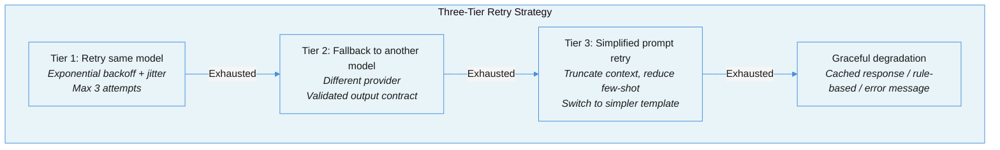

# Reliability Engineering for LLM Applications: Retries, Fallbacks, and Keeping Systems Up When Models Go Down

**Thesis:** LLM reliability is not availability engineering with a slower dependency -- the failure that hurts is HTTP 200 with confidently wrong output, so retries, circuit breakers and failover are only useful once output quality is a reliability metric with its own budget.

**Prerequisites:** [LLM Fundamentals for Practitioners](llm-fundamentals-for-practitioners.md), [Structured Output and Parsing](structured-output-and-parsing.md).

**Reading time:** 18 minutes

LLM APIs fail differently from traditional services. Latency varies by 100x between calls. Providers rate-limit without warning. Models produce confidently wrong output that passes every health check. This document covers the reliability patterns that keep LLM-integrated systems running when -- not if -- things go wrong.

> **Related:** [Cost Engineering](cost-engineering-for-llm-systems.md) covers the financial dimension of retries and fallbacks. [Observability and Monitoring](observability-and-monitoring.md) covers detecting these failures. This document covers surviving them.

| What teams assume | What actually happens |
|---|---|
| A 99.9% provider SLA means the dependency is not the risk | One major provider's rolling aggregate API availability was 99.94% across May-August 2026 -- about 26 minutes a month, and it arrives in lumps, not spread evenly ([BackendBytes](https://backendbytes.com/articles/llm-provider-outage-resilience)) |
| Two providers means redundancy | If the backup resolves to the same cloud and region as the primary, you have one dependency drawn twice on the diagram; the September 2026 provider failure took out "redundant" stacks on both sides ([Vibranium Labs](https://vibraniumlabs.ai/blog/ai-provider-outages-lessons-from-the-september-2026-failure)) |
| Retries add resilience | Retries multiply: three layers at three attempts each is 27 upstream calls for one user request, which is how a partial degradation becomes a full outage ([TrueFoundry](https://www.truefoundry.com/blog/llm-failover-load-balancing-provider-outages)) |
| Failover is a configuration switch | Manual switchovers took minutes under pressure; teams that automated them moved failover from 5+ minutes to hundreds of milliseconds ([Assembled](https://www.assembled.com/blog/your-llm-provider-will-go-down-but-you-dont-have-to)) |
| A health check proves the model is up | An LLM returns 200 with truncated, off-topic or schema-violating output; only output validation distinguishes "responding" from "working" |
| Fallback to a smaller model is a safe degradation | Smaller siblings change format compliance, refusal behaviour and latency profile -- an unvalidated fallback that returns 200 is a silent correctness regression |

---

## The Core Tension: LLMs Break the Traditional Reliability Playbook

Distributed systems reliability has decades of battle-tested patterns: retries with exponential backoff, circuit breakers, bulkheads, timeouts. These patterns assume failures are binary (the service is up or down) and detectable (errors return error codes). LLMs violate both assumptions.

An LLM can return HTTP 200 with a perfectly formatted JSON response that is completely wrong. It can take 200ms on one call and 45 seconds on the next with identical input. It can degrade gradually -- producing slightly worse output over weeks -- without triggering a single alert. It can enter an infinite tool-calling loop that burns $180 in tokens before anyone notices.

Traditional reliability engineering answers the question "is the service available?" LLM reliability engineering must answer a harder question: "is the service available, fast enough, and producing output that is actually correct?"

| Reliability Dimension | Traditional Service | LLM Service |
|---|---|---|
| **Failure detection** | HTTP error codes, connection failures | All of the above, plus silent quality degradation |
| **Latency** | Predictable (P99 within 2-3x P50) | Wildly variable (100ms to 60s for same prompt) |
| **Idempotency** | Well-understood patterns | Complex -- retried tool calls may double-execute |
| **Degradation** | Binary (up/down) or measurable (latency increase) | Continuous and often invisible (quality erosion) |
| **Blast radius** | Bounded by service boundary | Unbounded -- runaway agents cascade across tools |

---

## Failure Taxonomy

### Failure 1: Silent Quality Degradation

The most insidious failure mode. The model returns syntactically valid responses while semantic quality erodes. Models claiming 200K context [degrade noticeably around 130K tokens](https://www.zenml.io/llmops-database/building-production-ai-agents-lessons-from-claude-code-and-enterprise-deployments). Provider-side model updates can shift behavior without notice. The system is "up" but producing garbage.

**Detection:** Continuous evaluation as a service -- golden conversation regression suites, domain-specific QA sets, and business-critical workflow tests running on a schedule. Traditional uptime monitoring misses this entirely.

### Failure 2: The Retry Storm

A provider experiences partial degradation. Every client retries simultaneously. The retry storm overwhelms the provider, turning a partial outage into a complete one. With LLMs, this is worse than traditional services because each retry consumes expensive tokens.

**Root cause:** Retries without jitter, no circuit breakers, and no backpressure. Multiple retry layers (HTTP client, tool wrapper, agent policy) compound each other.

### Failure 3: The Runaway Agent

An agent enters an infinite tool-calling loop. It retries a failing API call, interprets the error as new information, decides to try a different approach that also fails, and loops. An [IDC survey found](https://matrixtrak.com/blog/agents-loop-forever-how-to-stop) 92% of organizations implementing agentic AI reported costs higher than expected, with runaway loops as the primary driver.

**Root cause:** Missing completion states, non-idempotent side effects, and treating all errors as transient. The agent lacks a "give up" condition.

### Failure 4: Provider Musical Chairs

A multi-provider failover architecture routes traffic to Provider B when Provider A fails. But Provider B has different prompt compatibility, output format, and quality characteristics. The application works with Provider A's output format but breaks on Provider B's slightly different JSON structure.

**Root cause:** Testing failover paths only for availability, not for behavioral consistency. The failover "works" (returns 200) but produces incompatible output.

### Failure 5: Timeout Roulette

The team sets a 30-second timeout for LLM calls. Simple prompts complete in 2 seconds. Complex reasoning takes 45 seconds and gets killed. The application retries the killed request, which times out again, creating a cascade of wasted tokens and user-facing errors.

**Root cause:** A single timeout value for all LLM call types. LLM latency varies by prompt complexity, model size, and provider load in ways that a single timeout cannot accommodate.

### Failure 6: Partial Response Corruption

The model hits the token limit mid-response (`finish_reason: "length"`). The output is valid JSON up to the truncation point, then cuts off. Downstream parsing fails or -- worse -- succeeds on the partial data, producing silently wrong results.

**Root cause:** Not checking `finish_reason` on every response. Not designing prompts and schemas to fail loudly on truncation.

### Failure 7: Correlated Redundancy

Two providers, one region. The failover path exists, is tested for availability, and still fails, because the "backup" resolves to the same cloud and the same region as the primary. A single upstream failure takes out both legs at once. The September 2026 provider failure produced exactly this: teams with multi-vendor routing discovered that their two vendors were one dependency, drawn twice on the architecture diagram ([Vibranium Labs](https://vibraniumlabs.ai/blog/ai-provider-outages-lessons-from-the-september-2026-failure)).

**Root cause:** Redundancy counted by vendor rather than by failure domain. Collapse providers that share a cloud and region into a single node on your dependency map, then check whether that node is the only thing standing between you and an outage.

### Failure 8: Retry Amplification

Every layer of a modern LLM stack retries: the SDK, the HTTP client, the gateway, the agent framework, and the application's own error handling. Three layers with three attempts each turns one user request into 27 upstream calls. During a partial degradation this is what converts a slow provider into a dead one, and it is invisible in per-layer configuration because no layer knows what the others are doing ([TrueFoundry](https://www.truefoundry.com/blog/llm-failover-load-balancing-provider-outages)).

**Root cause:** Retry policy configured independently at each layer instead of budgeted once for the whole call path. Fix it with a single retry budget and a propagated deadline (see Design Principle 8).

---

## The Resilience Spectrum: Levels 0 to 5

Reliability practice for LLM systems clusters into six levels. Each level is a superset of the one below it, and each has a characteristic failure it does not catch.

| Level | Practice | What it catches | What it still misses |
|---|---|---|---|
| **0. Hope** | Single provider, no timeout, no retry, no output validation | Nothing | Everything. A 200 with wrong output is indistinguishable from success |
| **1. Timeouts and bounded retries** | Per-operation timeouts, exponential backoff with jitter, retry only on 429/5xx | Transient provider errors, hung connections | Retry storms, quality degradation. A single provider at 99.94% availability is ~26 minutes of outage a month |
| **2. Circuit breakers with quality awareness** | Break on HTTP errors *and* on consecutive validation failures, distributed state so one replica protects all | Wasted spend on a degraded provider, retry storms | Failover that returns 200 with incompatible output |
| **3. Multi-provider failover with independent quotas** | Provider-agnostic gateway, independent quota pools per provider, failover paths validated for behavioral consistency, not just availability | Single-provider outages, correlated quota exhaustion | Correlated infrastructure across providers; failover that has never been rehearsed |
| **4. Retry budgets and drills** | One retry budget for the whole call path, deadline propagation, game days that block a provider on purpose | Amplification, unknown-unknowns in the failover path | Nothing structural -- this level is where most teams should stop |
| **5. Quality and cost as reliability metrics** | Continuous eval on the reliability dashboard, hard per-run cost caps, a degradation ladder chosen per feature in advance | Silent quality degradation, runaway spend | Model behaviour changes that pass every check you thought to write |

Measured examples from production teams sit around levels 3 and 4. One team reported 99.97% effective uptime on model responses across multiple provider outages, request failure rates below 0.001% during a multi-hour outage, and failover time dropping from more than five minutes of manual switching to hundreds of milliseconds after automation ([Assembled](https://www.assembled.com/blog/your-llm-provider-will-go-down-but-you-dont-have-to)). Their stated cost of that redundancy is worth reading twice: more evals, because each additional model in the routing table is another output format to validate.

---

## Design Principles

### Principle 1: The Three-Tier Retry Strategy


```mermaid
%%{init: {'theme': 'base', 'themeVariables': {'primaryColor': '#e8f4f8', 'primaryTextColor': '#1a1a1a', 'primaryBorderColor': '#4a90d9', 'lineColor': '#4a90d9', 'secondaryColor': '#f0e8f8', 'tertiaryColor': '#e8f8e8', 'edgeLabelBackground': '#f5f5f5'}}}%%
graph TD
    subgraph Retry["Three-Tier Retry Strategy"]
        style Retry fill:#e8f4f8,stroke:#4a90d9
        R1["Tier 1: Retry same model<br/><i>Exponential backoff + jitter</i><br/><i>Max 3 attempts</i>"]
        R2["Tier 2: Fallback to another model<br/><i>Different provider</i><br/><i>Validated output contract</i>"]
        R3["Tier 3: Simplified prompt retry<br/><i>Truncate context, reduce few-shot</i><br/><i>Switch to simpler template</i>"]
        R1 -->|"Exhausted"| R2
        R2 -->|"Exhausted"| R3
        R3 -->|"Exhausted"| FAIL["Graceful degradation<br/><i>Cached response / rule-based / error message</i>"]
    end
```

**Tier 1 -- Retry same model:** Exponential backoff with jitter (1s, 2s, 4s + random jitter). Respect `Retry-After` headers. Maximum 3 attempts. Only retry on transient errors (429, 500, 502, 503, 504, network timeouts). Never retry 400 (bad request), 401/403 (auth), or 404.

**Tier 2 -- Model fallback:** Chain attempts across providers: primary -> secondary -> tertiary. Each fallback runs through the full validation pipeline. This is cross-provider redundancy, not just retry.

Two rules make the difference between a fallback chain that works and one that only appears to. First, every model in the chain must satisfy the same output contract, and that contract must be verified by the same validators on the fallback path as on the primary -- a fallback that returns 200 with a slightly different JSON shape is a correctness incident wearing an availability costume. Second, the chain is perishable: model generations turn over roughly quarterly, and each new model brings its own format compliance, refusal behaviour and latency profile. Re-validate the whole chain when any member changes, not when it breaks.

**Tier 3 -- Simplified prompt:** An LLM-specific pattern with no analog in traditional systems. When requests fail due to token limits or complexity, automatically truncate context, reduce few-shot examples, or switch to a simpler prompt template.

### Principle 2: Quality-Aware Circuit Breakers

Standard circuit breakers trip on HTTP errors. LLM circuit breakers must also trip on **quality degradation** -- when consecutive outputs fail validation checks (hallucination detection, schema validation, policy violations), the circuit opens to prevent wasting tokens.

[Salesforce Agentforce](https://www.salesforce.com/blog/failover-design/) trips the circuit when 40% or more of traffic fails within a 60-second window, with a 20-minute cooldown before half-open probing.

**Implementation considerations:**
- Use **distributed state via Redis** so one replica discovering an outage protects all replicas
- **Do not count context cancellations as failures** -- users legitimately cancel long-running requests
- Track both HTTP errors AND output validation failures in the failure count

```
States: CLOSED (normal) → OPEN (blocking) → HALF-OPEN (probing)

CLOSED → OPEN:  When failure_rate > 40% in 60-second window
OPEN → HALF-OPEN:  After 60-second cooldown (20 min for aggressive protection)
HALF-OPEN → CLOSED:  When 3 consecutive probe requests succeed
HALF-OPEN → OPEN:  When any probe request fails
```

### Principle 3: Multi-Provider Failover

Multi-provider architecture is a baseline design principle, not a "nice to have." The standard architecture is an LLM gateway (LiteLLM, Portkey, or a comparable router) sitting between applications and providers, presenting one API and owning the retry, cooldown and fallback policy in one place. A gateway that owns the policy is also what makes a retry budget possible: it can see the whole call path that the application's own client cannot ([LiteLLM reliability docs](https://docs.litellm.ai/docs/proxy/reliability)).

**Hot standby (delayed parallel):** [Salesforce Agentforce](https://www.salesforce.com/blog/failover-design/) uses a "race" mechanism -- a primary callout initiates, and if no response arrives within a threshold, a parallel secondary callout launches. The system returns whichever responds first and cancels the other. Avoids sequential failover latency.

**Weighted distribution:** Split traffic proactively (60% primary, 20% secondary, 20% tertiary) rather than relying purely on reactive failover. This provides continuous validation that fallback providers are working, and it is the cheapest form of failover rehearsal: a path that carries live traffic is a path you know about.

**Health checks:** Synthetic monitoring pings each provider every minute, tracking response times and error rates. When thresholds exceed tolerances (3 of 5 failed), traffic reroutes before user requests fail. A health check must exercise the model, not the endpoint: send a small real prompt and validate the shape of the answer.

**Independent quota pools:** Rate limits are per provider and per account, and they do not fail over with your traffic. Provision separate quota for each provider and cap each route's share so that one provider's 429 does not become a queue of retries aimed at the next one ([TrueFoundry](https://www.truefoundry.com/blog/llm-failover-load-balancing-provider-outages)).

### Principle 4: Adaptive Timeouts

A single timeout value cannot handle LLM latency variability. Use per-operation timeouts:

| Operation Type | Recommended Timeout | Rationale |
|---|---|---|
| Simple classification / extraction | 10-15 seconds | Low token count, fast inference |
| Standard generation | 30-45 seconds | Moderate complexity |
| Complex reasoning / multi-step | 60-120 seconds | High token count, chain-of-thought |
| Batch / background processing | 5-10 minutes | No user waiting |
| Streaming responses | TTFT: 10s, inactivity: 15s | Time-to-first-token plus gap detection |

For streaming responses, use a **two-phase timeout**: a time-to-first-token (TTFT) timeout plus an inactivity timeout (no new tokens for N seconds) rather than a single absolute timeout.

Set each timeout from your own latency distribution rather than from a table: the useful default is the route's p95 or p99 completion time plus headroom, reviewed when the model or prompt changes ([TrueFoundry](https://www.truefoundry.com/blog/llm-failover-load-balancing-provider-outages)).

### Principle 5: Idempotent Tool Execution

Every tool that mutates state must be idempotent. When an agent retries after a timeout, the tool must detect the duplicate and return the existing result.

**The pattern:**
1. Each tool call includes an idempotency key (e.g., `user-123-refund-456`)
2. Before executing, check for an existing operation with that key
3. If found, return the existing result
4. If not found, execute and store the result keyed by the idempotency key

**For multi-step workflows,** classify each step as: read-only, reversible, compensatable, or final. On failure mid-workflow, walk backwards through completed steps running compensation actions.

**Rate limiting per tool:** Cap calls per tool per session. Once a tool hits its limit, return a rejection that encourages alternative approaches. This prevents the agent from hammering a single endpoint.

### Principle 6: Runaway Agent Prevention

The Stop/Retry/Escalate framework:

| Error Class | Action | Max Retries |
|---|---|---|
| Validation / auth errors (400, 401, 403) | STOP immediately | 0 |
| Rate limits (429) | RETRY with backoff + jitter | 3, bounded |
| Timeouts / 5xx | RETRY limited, then ESCALATE | 2-3, then human |
| Safety blocks | STOP or ESCALATE | 0 |

**Loop detection:** Fingerprint the last tool call + result hash. If the fingerprint repeats 3+ times, the agent is looping. Kill the run.

**Hard limits (set all of these):**
- Maximum steps per agent run
- Maximum tool calls per run
- Maximum retries per specific tool (2-3)
- Hard wall-clock time cap
- Token/cost budget per run

The cost cap deserves its own sentence, because it is the only limit that bounds a failure you have not thought of yet. A run that hits its cap should terminate as **blocked**, not be silently retried: an agent that exceeded its budget has discovered something about the task, and re-running it is how a bounded overspend becomes an unbounded one.

### Principle 7: Graceful Degradation Ladder

When the LLM is unavailable or degraded, degrade features in order rather than failing entirely:

1. **Serve cached responses** for frequently-requested queries (configurable TTL)
2. **Fall back to a smaller/faster model** in the same family, with the same output validators applied
3. **Fall back to rule-based answers** for structured queries where deterministic logic suffices
4. **Disable AI features** while keeping the rest of the application functional
5. **Show a user-facing message** explaining reduced capability

Implement at the **gateway level** (transparent to application code) rather than requiring every endpoint to handle degradation individually.

Choose the ladder per feature before the outage, and write down which rung is acceptable for which user journey. A support assistant can serve a cached answer; a payment-adjacent flow should stop at rung 4 and tell the user, because a plausible degraded answer is worse than no answer.

### Principle 8: Retry Budgets and Deadline Propagation

Count retries once, for the whole call path, not once per layer. Two mechanisms do it:

```python
from typing import NamedTuple

# One deadline and one retry budget travel with the request.
class CallContext(NamedTuple):
    deadline: float        # absolute monotonic time; every layer checks it
    retries_left: int      # decremented by whoever retries, whoever they are

def call_model(prompt: str, ctx: CallContext) -> Response:
    while True:
        remaining = ctx.deadline - time.monotonic()
        if remaining <= 0:
            raise DeadlineExceeded("budget exhausted -- degrade, do not retry")
        try:
            return provider.invoke(prompt, timeout=remaining)
        except TransientError:
            if ctx.retries_left <= 0:
                raise
            attempt = ctx.retries_left
            ctx = ctx._replace(retries_left=ctx.retries_left - 1)
            time.sleep(min(2 ** attempt, 8) + random.uniform(0, 0.5))
```

The deadline is what makes the budget real: every layer -- SDK, gateway, tool wrapper, agent loop -- receives the same absolute deadline and refuses to start work it cannot finish. Without it, each layer's timeout is measured from its own start, and the user waits for the sum.

**Rehearse it.** A failover path that has never been exercised is a hypothesis. Run a game day where you block a provider on purpose and watch what happens; the first time failover fails into the same region should be in a drill, not at 15:49 on a Thursday ([Vibranium Labs](https://vibraniumlabs.ai/blog/ai-provider-outages-lessons-from-the-september-2026-failure)).

---

## Chaos Engineering for LLM Systems

Testing resilience requires deliberately injecting failures. Chaos engineering is now standard practice for AI systems, and the failure classes below are the ones that only appear under real conditions.

**Fault injection scenarios:**
1. **Network faults:** Inject latency, packet loss, or blackhole traffic between application and LLM API
2. **Provider simulation:** Return 429 (rate limit), slow responses (latency injection), truncated responses (connection drop mid-stream)
3. **Resource exhaustion:** Tax CPU/memory during peak inference
4. **Quality degradation:** Force the model to return malformed or off-topic responses
5. **Cascade testing:** Fail the vector database mid-RAG-pipeline and verify the system degrades gracefully
6. **Correlated outage:** Block the cloud region both providers share, and verify the system behaves as if one dependency failed -- because it did

**Methodology:**
1. Identify a single business-critical AI feature and its worst-case failure
2. Formulate a hypothesis: "If provider X goes down, the system falls back to provider Y within 5 seconds"
3. Run the experiment in staging first
4. Monitor: error rates, latency, fallback activation, user impact
5. Automate passing experiments into CI/CD

Loops and cascading failures manifest only under real production conditions because development dependencies are fast and stable -- they do not return rate limits or transient failures. Chaos engineering is how you find these problems before your users do.

---

## Evaluation: Real-World Systems

| System / practice | What it does | Why it is worth copying |
|---|---|---|
| **LiteLLM gateway** | Router with fallbacks, cooldowns, `num_retries`, and separate fallback lists for content-policy and context-window errors ([docs](https://docs.litellm.ai/docs/proxy/reliability)) | Error-class-specific fallback lists: a context-window overflow and a safety refusal need different fallbacks, not the same one |
| **Salesforce Agentforce** | Delayed-parallel failover race; quality-aware circuit breaker at 40% failure in 60 seconds; 20-minute cooldown ([design post](https://www.salesforce.com/blog/failover-design/)) | Published, concrete thresholds instead of "tune it later"; and a race that hides failover latency from users |
| **Assembled** | Automated fallbacks across several providers; 99.97% effective uptime across multiple outages; manual switchover replaced by sub-second failover ([write-up](https://www.assembled.com/blog/your-llm-provider-will-go-down-but-you-dont-have-to)) | They name the cost of redundancy as extra evals, which is the honest accounting most teams skip |
| **TrueFoundry** | Per-provider quota pools, hedge delay near the route's p95, circuit-breaker open with half-open probes, retries capped at 2-3 before fallback ([guide](https://www.truefoundry.com/blog/llm-failover-load-balancing-provider-outages)) | Tuning table in one place, with the reasoning for each number |
| **Gateway routers compared** | Feature comparison of failover-capable gateways (routing, budgets, guardrails, observability) ([comparison](https://www.getmaxim.ai/articles/top-5-llm-failover-routing-gateways-in-2026)) | Vendor benchmarks should be read with the vendor's incentives in mind, but the feature matrix is a useful checklist for what your own gateway must own |
| **Provider status pages** | Rolling aggregate availability, incident history and postmortems ([one provider's rolling figure](https://backendbytes.com/articles/llm-provider-outage-resilience)) | Treat the published number as your dependency's real SLA and plan for the lumps, not the average |

---

## The Hard Truth

The most dangerous failure mode in an LLM system is not a crash. It is a system that returns HTTP 200 with confidently wrong output. Traditional reliability engineering measures availability -- can the service respond? LLM reliability engineering must measure correctness -- is the response actually right?

This means every reliability pattern in this document is necessary but insufficient without the quality monitoring described in [Observability and Monitoring](observability-and-monitoring.md) and the evaluation infrastructure described in [Evaluation-Driven Development](evaluation-driven-development.md). A circuit breaker that trips on HTTP errors will not save you from a model that returns plausible-sounding hallucinations. A retry strategy that falls back to a secondary provider will not help if the secondary provider's output is incompatible with your parsing logic.

The teams that build reliable LLM systems are not the ones with the most sophisticated retry policies. They are the ones that treat output quality as a reliability metric alongside latency and uptime -- and build the monitoring to detect degradation before users do.

---

## Summary Checklist

| Question | Good Answer | Bad Answer |
|---|---|---|
| Do you retry with exponential backoff and jitter? | Yes -- with per-error-class retry policies | No -- we retry immediately, or not at all |
| Do you have circuit breakers on LLM calls? | Yes -- tripping on both HTTP errors AND quality failures | No -- or only on HTTP errors |
| Can your system survive a provider outage? | Yes -- multi-provider failover tested in staging | No -- single provider, single point of failure |
| Do you use per-operation timeouts? | Yes -- different timeouts for simple vs complex calls | No -- one timeout for everything |
| Are your tool calls idempotent? | Yes -- idempotency keys prevent double execution on retry | No -- retries can cause duplicate side effects |
| Do you have hard limits on agent runs? | Yes -- max steps, max tokens, wall-clock cap, cost cap | No -- agents run until they finish or crash |
| Do you check `finish_reason` on every response? | Yes -- `length` triggers re-request or truncation handling | No -- we parse whatever comes back |
| Have you chaos-tested your LLM integration? | Yes -- fault injection in staging, automated in CI | No -- we assume providers are reliable |
| Do you monitor output quality, not just uptime? | Yes -- continuous eval as a reliability metric | No -- our monitoring only checks availability |
| Can you degrade gracefully when LLMs are slow? | Yes -- cached responses, smaller models, rule-based fallbacks | No -- the whole feature fails if the LLM is slow |
| Do your providers share a cloud region? | No -- or you have collapsed them into one node on the dependency map and planned for it | No idea -- they are different companies, so we counted them as two |
| Does one user request have a retry budget? | Yes -- one budget and one propagated deadline for the whole call path | No -- each layer retries on its own, and nobody counts the total |

---

## Field Notes from an Operating Estate

**September 2026 -- the cost cap is a reliability control, not an accounting one.** The estate I operate runs autonomous agent work under a nightly spend cap, and the rule that took longest to accept is what happens at the boundary: a run that reaches the cap terminates as blocked, and is never silently retried. The first instinct is to treat a cap death as an infrastructure hiccup and re-run the work. It is not. A run that spent its budget without finishing has produced information -- about the task, the plan, or the loop it was in -- and re-running it is how a bounded overspend becomes an unbounded one. Budget exhaustion is a failure mode with a correct response, and the correct response is to stop and look.

**August 2026 -- route everything through one gateway.** That estate holds provider keys in a single routing layer and lets no application talk to a provider directly. The reliability benefit was not the abstraction; it was that retry policy, cooldowns, quota pools and fallback order live in exactly one place, and can be changed during an incident without redeploying a client. The cost is the same as the benefit: the gateway is now a single point of failure, so it needs its own health checks and its own tested restart path.

**July 2026 -- a loop that never fires gets cut.** Standing machinery on that estate carries a kill criterion, and the discipline generalises to reliability work: a watchdog, a drill, a synthetic health check, or a canary that has not fired or been exercised in a long time is removed rather than kept "just in case". An untested failover path and no failover path fail identically on the day it matters, and the untested one costs money every day until then.

---

## References

### Architecture and Patterns
- [Portkey: Retries, Fallbacks, and Circuit Breakers](https://portkey.ai/blog/retries-fallbacks-and-circuit-breakers-in-llm-apps/) -- Decision framework for LLM reliability patterns
- [Salesforce: Failover Design for Agentforce](https://www.salesforce.com/blog/failover-design/) -- Production failover with delayed parallel retries and quality-aware circuit breakers
- [LiteLLM: Reliability and fallbacks](https://docs.litellm.ai/docs/proxy/reliability) -- Fallback lists per error class, cooldowns, and retry configuration in a gateway
- [TrueFoundry: Multi-Provider Failover and Load Balancing (June 2026)](https://www.truefoundry.com/blog/llm-failover-load-balancing-provider-outages) -- Retry caps, hedge delays, quota pools, and per-hop timeouts
- [Multi-Provider LLM Resilience](https://opendirective.net/multi-provider-llm-resilience-failover-quotas-and-drift) -- Failover, quota management, and cross-provider consistency
- [Maxim: Retries, Fallbacks, and Circuit Breakers](https://www.getmaxim.ai/articles/retries-fallbacks-and-circuit-breakers-in-llm-apps-a-production-guide/) -- Bifrost gateway patterns
- [Maxim: LLM failover routing gateways compared (2026)](https://www.getmaxim.ai/articles/top-5-llm-failover-routing-gateways-in-2026) -- Feature matrix for gateway selection

### Outages and Operational Lessons
- [BackendBytes: Your LLM Provider Will Have an Outage](https://backendbytes.com/articles/llm-provider-outage-resilience) -- Rolling availability figures, error-class handling, and degraded modes
- [Vibranium Labs: Lessons from the September 2026 provider failure](https://vibraniumlabs.ai/blog/ai-provider-outages-lessons-from-the-september-2026-failure) -- Correlated redundancy across providers sharing a region, and how to rehearse for it
- [Assembled: Automated failover in production](https://www.assembled.com/blog/your-llm-provider-will-go-down-but-you-dont-have-to) -- Measured uptime and failover latency, and the eval cost of redundancy

### Agent Reliability
- [MatrixTrak: How to Stop Agent Infinite Loops](https://matrixtrak.com/blog/agents-loop-forever-how-to-stop) -- Fingerprint-based detection and Stop/Retry/Escalate framework
- [AI Agent Error Handling Patterns](https://blog.jztan.com/ai-agent-error-handling-patterns/) -- Quality circuit breakers, idempotent workflows, saga rollback
- [Practical Tool Use Patterns in Production](https://dev.to/young_gao/practical-guide-to-building-ai-agents-with-tool-use-patterns-that-actually-work-in-production-455b) -- Idempotency keys, per-tool rate limiting

### Timeouts, Rate Limiting, and Chaos
- [Handling Timeouts and Retries in LLM Systems](https://dasroot.net/posts/2026/02/handling-timeouts-retries-llm-systems/) -- Adaptive timeout strategies, gRPC deadline propagation
- [Rate Limiting and Backpressure for LLM APIs](https://dasroot.net/posts/2026/02/rate-limiting-backpressure-llm-apis/) -- Token-aware rate limiting algorithms
- [Circuit Breakers for LLM Services in Go](https://dasroot.net/posts/2026/02/implementing-circuit-breakers-for-llm-services-in-go/) -- Distributed state via Redis

### Failure Detection
- [Silent Degradation in LLM Systems](https://dev.to/delafosse_olivier_f47ff53/silent-degradation-in-llm-systems-detecting-when-your-ai-quietly-gets-worse-4gdm) -- Continuous evaluation as a service for quality monitoring
- [Anthropic: Production Agent Lessons](https://www.zenml.io/llmops-database/building-production-ai-agents-lessons-from-claude-code-and-enterprise-deployments) -- Context rot thresholds, instruction clarity

### Related Documents in This Series
- [Cost Engineering for LLM Systems](cost-engineering-for-llm-systems.md) -- The financial dimension of retries and fallbacks
- [Observability and Monitoring](observability-and-monitoring.md) -- Detecting failures before users do
- [Quality Gates in Agentic Systems](quality-gates-in-agentic-systems.md) -- Gate design for quality-based circuit breaking
- [Multi-Agent Coordination](multi-agent-coordination.md) -- Failure cascades in multi-agent systems
- [Human-in-the-Loop Patterns](human-in-the-loop-patterns.md) -- Escalation when automated recovery fails

---

*Last reviewed: September 2026. Changed in this revision: replaced the superseded model names in the failover examples with provider-agnostic chains plus a revalidation rule, added retry amplification and correlated redundancy as failure modes, a resilience spectrum with measured production rates, retry budgets with deadline propagation, a real-world comparison table, field notes, and a 2026 references block; removed one dead reference link.*
