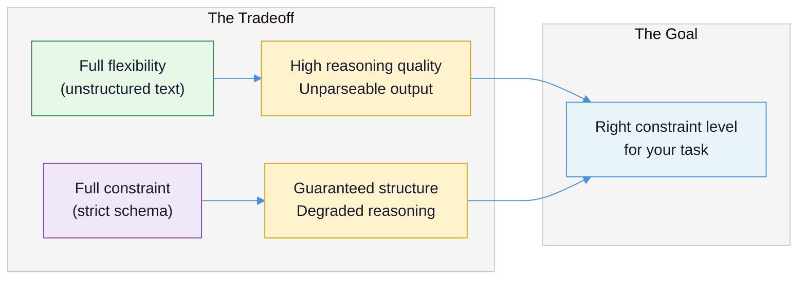
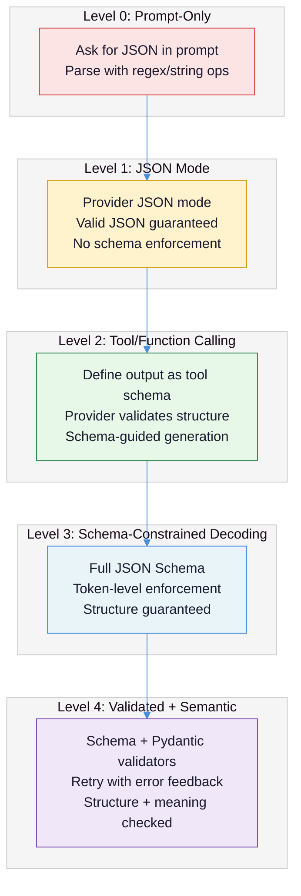
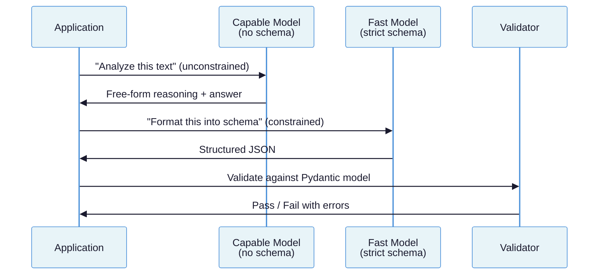

# Structured Output and Output Parsing: Making LLM Output Machine-Readable

You can write a good prompt. You can manage what goes into the context window. But the moment your LLM's response needs to feed into another system -- a database write, an API call, a downstream pipeline step, a UI component -- you hit the same wall: **the model produces text, and your code needs data.** Structured output is the discipline of bridging this gap reliably. It is the skill that determines whether your LLM integration works in a demo or works in production.

**Prerequisites:** [LLM Fundamentals](llm-fundamentals-for-practitioners.md) (API calls, tokens, model behavior), [Prompt Engineering](prompt-engineering.md) (system prompts, output format instructions), and [Context Engineering](context-engineering.md) (context budget management). This document builds directly on all three.

---

## The Core Tension

LLMs are next-token prediction engines. They generate text one token at a time based on statistical patterns. Software systems consume structured data -- JSON objects, typed fields, enumerated values. The tension is this: **you are asking a probabilistic text generator to produce deterministic data structures, and the degree to which it cooperates depends on how much you constrain it versus how much you let it think.**

This is not a formatting problem. It is an engineering problem. Every integration failure -- the JSON that is almost valid, the field that is sometimes a string and sometimes an array, the enum value that does not match your schema -- traces back to the gap between what the model wants to generate and what your code can parse.

| What teams assume | What actually happens |
|---|---|
| "Just ask for JSON" | The model outputs JSON 95% of the time -- the other 5% crashes your pipeline at 3 AM |
| Strict schemas guarantee correct output | Strict schemas guarantee valid structure but can degrade reasoning accuracy by 10-26 percentage points |
| JSON is the only serious format | XML is better for nested prose; YAML scores higher on accuracy benchmarks; Markdown is 34-38% cheaper on tokens |
| Validation failures mean the model is broken | Most validation failures trace to schema design, not model capability |
| Retrying on failure is always the right move | Each retry costs tokens and time -- a schema redesign often eliminates the failure entirely |



The core insight, supported by multiple benchmarks: on the Shuffled Objects reasoning task, unstructured output achieved 92.68% accuracy while structured JSON output scored 65.85% -- a 26.83 percentage point gap ([Dylan Castillo, "Say What You Mean"](https://dylancastillo.co/posts/say-what-you-mean-sometimes.html)). Constrained decoding forces the model down token paths it would not naturally choose, and those unnatural paths sometimes lead to worse answers. The entire discipline of structured output is about finding the constraint level that gives you parseable data without destroying the model's ability to reason.

---

## Failure Taxonomy

Before discussing solutions, you need to understand how structured output fails. These six failure modes account for the vast majority of production incidents.

**Failure 1: The Almost-Valid JSON**

**What it looks like:** The model produces output that looks like JSON but fails `json.loads()`. Trailing commas, unescaped quotes inside strings, comments embedded in the JSON, or a preamble like "Here is the JSON:" before the actual object.

**Why it happens:** Without constrained decoding, the model is pattern-matching against JSON it saw in training data -- which includes blog posts, Stack Overflow answers, and documentation that embed JSON in prose. The model does not distinguish between "JSON inside a Markdown code block" and "raw JSON as the entire response."

**Example:** `Sure! Here is the extracted data:\n\n{"name": "John", "age": 30, // years old}` -- valid-looking to a human, unparseable by any JSON parser.

**Failure 2: Schema Drift**

**What it looks like:** The model produces valid JSON that does not match your expected schema. A field you expect as a string comes back as an array. An enum value is a synonym of your expected value rather than the exact string. A nested object is flattened.

**Why it happens:** Without schema enforcement, the model generates the most probable structure for the content, which may not be yours. If your prompt says "return a severity field" but the training data associates severity with integers in some contexts and strings in others, the model picks whichever seems more natural for this particular input.

**Failure 3: The Reasoning-Structure Conflict**

**What it looks like:** The model fills every schema field with valid types but the values are wrong or shallow. Classification accuracy drops. Multi-step reasoning tasks produce incorrect conclusions.

**Why it happens:** Constrained decoding forces the model to produce valid tokens at every step. When the model's preferred next token is invalid under the schema, it must choose from lower-probability alternatives. On complex reasoning tasks, this degrades accuracy by 10-26 percentage points ([Castillo](https://dylancastillo.co/posts/say-what-you-mean-sometimes.html)). Research on the JSONSchemaBench benchmark found that base models often benefit from constraints, but instruction-tuned models show mixed results -- they maintain classification accuracy but suffer on generation tasks ([JSONSchemaBench, 2025](https://arxiv.org/html/2501.10868v1)).

**Failure 4: The Field Name Trap**

**What it looks like:** You change a field name in your schema and accuracy collapses. Or two schemas that seem equivalent produce wildly different result quality.

**Why it happens:** Field names are tokens that the model has associated with specific patterns during training. Changing `final_choice` to `answer` improved model accuracy from 4.5% to 95% in one benchmark -- a 90.5 percentage point difference from a single field rename ([Instructor Blog, "Bad Schemas Could Break Your LLM"](https://python.useinstructor.com/blog/2024/09/26/bad-schemas-could-break-your-llm-structured-outputs/)). The model uses field names as semantic cues. A poorly named field leads the model down the wrong reasoning path.

**Failure 5: The Retry Death Spiral**

**What it looks like:** Validation fails, you retry, the model produces a different but still invalid output, you retry again, and eventually you have burned through your token budget or hit a timeout.

**Why it happens:** Naive retry strategies treat the model as a random number generator -- "try again and maybe you will get it right." Without feeding the validation error back to the model, each retry is an independent attempt with the same probability of failure. Even with error feedback, some failures are structural (the schema is too complex, the task conflicts with the format constraint) and no number of retries will fix them.

**Failure 6: The Silent Semantic Error**

**What it looks like:** The output is valid JSON, matches your schema, passes all validation -- and is wrong. A date field contains a date that is not the one asked for. A summary field contains a grammatically correct summary that misrepresents the source.

**Why it happens:** Schema validation checks structure, not meaning. A field typed as `string` will accept any string. A field typed as `integer` between 1 and 5 will accept any integer in that range. Structured output guarantees the envelope, not the letter inside it. This is the failure mode that benchmarks consistently conflate with schema compliance ([Cleanlab, "Structured Output Benchmark"](https://cleanlab.ai/blog/structured-output-benchmark/)).

---

## The Enforcement Spectrum

Structured output is not binary. There is a spectrum of enforcement, from hope-based to hardware-enforced, and each level trades off differently between reliability, flexibility, and reasoning quality.



**Level 0 -- Prompt-Only.** You ask the model to "respond in JSON format" and parse the response with string manipulation or regex. Reliability: 85-95% depending on the model and prompt quality. This was the only option before mid-2023. Still appropriate for throwaway scripts or when you control the model through fine-tuning.

**Level 1 -- JSON Mode.** The provider guarantees syntactically valid JSON but does not enforce a schema. OpenAI's `response_format: { type: "json_object" }`, Gemini's `response_mime_type: "application/json"`. You get parseable JSON 100% of the time, but the structure is whatever the model decides. You still need to validate against your expected shape.

**Level 2 -- Tool/Function Calling.** You define your expected output as a function/tool schema and the provider guides the model to fill it. This is a critical insight that many teams miss: **function calling is not just for invoking external tools. It is a structured output mechanism.** When you define a tool with an input schema, the model produces a structured call that matches that schema -- even if you never actually execute the tool. This gives you schema-guided output with better reliability than JSON mode and less reasoning degradation than full constrained decoding.

**Level 3 -- Schema-Constrained Decoding.** The provider compiles your JSON Schema into a grammar and masks invalid tokens during generation. OpenAI's Structured Outputs, Anthropic's strict mode, Gemini's response_schema. Structure is guaranteed at the token level. But this is where the reasoning-quality tradeoff becomes real -- every invalid token the model would have produced is silently redirected, and those redirections accumulate.

**Level 4 -- Validated + Semantic.** You layer application-level validation on top of schema enforcement. Pydantic validators check business logic. LLM-powered validators assess semantic correctness. Failed validations trigger retries with error context fed back to the model. Libraries like [Instructor](https://python.useinstructor.com/) operate at this level. This is the most reliable approach but also the most expensive in tokens and latency.

---

## The Provider Landscape

Each major provider implements structured output differently, with distinct capabilities and limitations.

### OpenAI: Structured Outputs

OpenAI compiles your JSON Schema into a **context-free grammar (CFG)** and masks invalid tokens during generation. The schema is cached globally -- first request incurs compilation latency (up to 12 seconds for simple schemas, longer for complex ones), subsequent requests are fast ([Sophia Willows, "OpenAI Structured Outputs Deep Dive"](https://sophiabits.com/blog/openai-structured-outputs-deep-dive)). Schemas consume zero input tokens.

```python
from openai import OpenAI
from pydantic import BaseModel

client = OpenAI()

class ExtractedEntity(BaseModel):
    name: str
    entity_type: str  # "person", "organization", "location"
    confidence: float

class ExtractionResult(BaseModel):
    reasoning: str  # Always include a reasoning field first
    entities: list[ExtractedEntity]

response = client.responses.create(
    model="gpt-4o",
    input=[{
        "role": "user",
        "content": "Extract entities: 'Jane Smith joined Acme Corp in Denver.'"
    }],
    text={"format": {
        "type": "json_schema",
        "strict": True,
        "name": "extraction_result",
        "schema": ExtractionResult.model_json_schema()
    }}
)
result = ExtractionResult.model_validate_json(response.output_text)
```

**Constraints:** Maximum 5 levels of nesting, 100 object properties. All properties must be in `required`. `additionalProperties` must be `false`. Semantic keywords like `minLength`, `maximum`, and `pattern` are silently ignored -- they are accepted in the schema but not enforced at the token level ([OpenAI Structured Outputs Guide](https://developers.openai.com/api/docs/guides/structured-outputs)).

### Anthropic: Tool Use as Structured Output

Anthropic uses constrained decoding with grammar compilation. Schema compilation adds 100-300ms on first request, cached for 24 hours ([Thomas Wiegold, "Claude API Structured Output"](https://thomas-wiegold.com/blog/claude-api-structured-output/)). Anthropic offers two modes: JSON outputs (`output_config.format`) and strict tool use. The tool use approach is particularly effective because it leverages the model's training on tool-calling patterns:

```python
import anthropic
import json

client = anthropic.Anthropic()

response = client.messages.create(
    model="claude-sonnet-4-5-20250514",
    max_tokens=1024,
    tools=[{
        "name": "record_entities",
        "description": "Record extracted entities from the text.",
        "input_schema": {
            "type": "object",
            "properties": {
                "reasoning": {
                    "type": "string",
                    "description": "Step-by-step reasoning about entities present"
                },
                "entities": {
                    "type": "array",
                    "items": {
                        "type": "object",
                        "properties": {
                            "name": {"type": "string"},
                            "entity_type": {
                                "type": "string",
                                "enum": ["person", "organization", "location"]
                            },
                            "confidence": {"type": "number"}
                        },
                        "required": ["name", "entity_type", "confidence"]
                    }
                }
            },
            "required": ["reasoning", "entities"]
        },
        "strict": True
    }],
    tool_choice={"type": "tool", "name": "record_entities"},
    messages=[{
        "role": "user",
        "content": "Extract entities: 'Jane Smith joined Acme Corp in Denver.'"
    }]
)
tool_result = response.content[0].input
```

**Key limitation:** Anthropic does not support `anyOf`, `oneOf`, or `$ref` (recursive schemas). Schemas must be flat and inline. The SDK compensates by stripping unsupported constraints and adding them to field descriptions, then validating locally after response ([Anthropic Structured Outputs Documentation](https://platform.claude.com/docs/en/build-with-claude/structured-outputs)).

### Google Gemini: JSON Mode with Caveats

Gemini supports schema-constrained output but has a critical quirk: **the Python SDK alphabetically reorders schema keys before generation**, which breaks chain-of-thought reasoning. If your schema has a `reasoning` field followed by an `answer` field, the SDK reorders them to `answer` then `reasoning` -- forcing the model to produce the answer before it reasons ([Dylan Castillo, "Gemini Structured Output Problems"](https://dylancastillo.co/posts/gemini-structured-outputs.html)).

```python
from google import genai
from pydantic import BaseModel

client = genai.Client()

class ExtractionResult(BaseModel):
    reasoning: str    # SDK reorders alphabetically
    solution: str     # Use "solution" not "answer" to preserve order

response = client.models.generate_content(
    model="gemini-2.5-flash",
    contents="Extract the main topic: 'The merger was announced Tuesday.'",
    config={
        "response_mime_type": "application/json",
        "response_schema": ExtractionResult
    }
)
```

**Workaround:** Rename fields so their alphabetical order matches your desired reasoning order. For Gemini 2.5+ models the API preserves schema key ordering, but the Python SDK overrides this behavior ([Google Gemini Structured Output Docs](https://ai.google.dev/gemini-api/docs/structured-output)). On accuracy benchmarks, Gemini's constrained JSON-Schema mode scored 86.18% versus 97.15% for natural language on the Shuffled Objects task -- a 10+ percentage point gap.

### Provider Comparison

| Feature | OpenAI | Anthropic | Google Gemini |
|---|---|---|---|
| Mechanism | CFG-based constrained decoding | Grammar-compiled constrained decoding | Constrained decoding |
| First-request latency | ~12s simple, up to 60s complex | 100-300ms | Not documented |
| Schema cache duration | Global, duration unknown | 24 hours | Not documented |
| Union types (anyOf) | Supported | Not supported | Supported |
| Recursive schemas ($ref) | Supported | Not supported | Supported |
| Nesting limit | 5 levels, 100 properties | Errors on "too complex" | Errors on "too complex" |
| Schema token cost | Zero | 50-200 tokens overhead | Not documented |
| Refusal handling | Dedicated `refusal` field | `stop_reason: "refusal"` | Not documented |

---

## Schema Design Principles

Schema design is where most teams lose performance without realizing it. The schema is not just a validation contract -- it is a set of instructions to the model about how to structure its thinking.

**Principle 1: Always include a reasoning field, and put it first.**

Without intermediate reasoning, model accuracy drops by up to 60%. With a `chain_of_thought` or `reasoning` field before the answer fields, accuracy jumps from ~33% to ~93% ([Instructor Blog](https://python.useinstructor.com/blog/2024/09/26/bad-schemas-could-break-your-llm-structured-outputs/)). This is the structured output equivalent of chain-of-thought prompting (see [Prompt Engineering](prompt-engineering.md)) -- the model needs space to think before committing to an answer. The reasoning field must come before the answer field in the schema definition so the model generates its reasoning first.

**Principle 2: Choose field names as if they were prompt instructions.**

Field names are not arbitrary labels. They are tokens the model has seen in specific contexts during training. `answer` is better than `final_choice`. `entities` is better than `output_list`. `severity` paired with `"enum": ["low", "medium", "high", "critical"]` is better than `level` paired with `"enum": [1, 2, 3, 4]`. Test field name changes against your evaluation suite -- a single rename can swing accuracy by 90 percentage points.

**Principle 3: Keep schemas shallow.**

Every level of nesting increases the chance of reasoning degradation. The JSONSchemaBench evaluation found that on schemas with 175+ fields and 8-25 nesting levels, even the best constrained decoding framework (Guidance) achieved only 41% coverage versus 96% on simpler schemas ([JSONSchemaBench, 2025](https://arxiv.org/html/2501.10868v1)). If your schema requires more than 3 levels of nesting, consider splitting the extraction into multiple calls.

**Principle 4: Use descriptions as inline examples.**

Field descriptions are part of the prompt. A description like `"description": "The sentiment: 'positive', 'negative', or 'neutral'"` is more effective than a bare `"enum": ["positive", "negative", "neutral"]` because it gives the model additional context about what each value means. For complex fields, include a mini-example in the description: `"description": "ISO 8601 date string, e.g., '2026-03-21'"`.

**Principle 5: Prefer enums over open-ended strings for categorical data.**

Enums give the model a closed set of valid values, which reduces ambiguity and improves consistency. But keep enum lists short -- more than 15-20 values and the model starts losing track. For large taxonomies, consider a two-step approach: first classify into a broad category, then sub-classify in a follow-up call.

**Principle 6: Do not ask for what the model cannot reliably produce.**

Schemas that require precise numerical calculations, exact string matching against a database, or deterministic lookups are asking the model to be something it is not. If a field requires data the model cannot derive from the input, either provide it in the context or compute it in code after extraction. The model extracts and reasons; your code validates and computes.

---

## Validation and Recovery

Schema enforcement guarantees structure. Validation ensures meaning. The gap between the two is where production failures hide.

### The Pydantic Layer

Pydantic models are the standard Python approach for post-generation validation. They enforce types, ranges, patterns, and custom business logic:

```python
from pydantic import BaseModel, Field, field_validator

class SentimentResult(BaseModel):
    reasoning: str = Field(
        description="Step-by-step analysis of the text's sentiment"
    )
    sentiment: str = Field(
        description="'positive', 'negative', or 'neutral'"
    )
    confidence: float = Field(
        ge=0.0, le=1.0,
        description="Confidence score between 0 and 1"
    )

    @field_validator("sentiment")
    @classmethod
    def validate_sentiment(cls, v: str) -> str:
        v = v.lower().strip()
        if v not in ("positive", "negative", "neutral"):
            raise ValueError(f"Invalid sentiment: {v}")
        return v
```

**Critical point:** Provider-side constrained decoding does not enforce semantic constraints like `ge=0.0, le=1.0`. OpenAI silently ignores `minimum` and `maximum` in JSON Schema. Anthropic's SDK strips them from the schema sent to the API and re-adds them as description text, then validates locally. You must validate on your side regardless of what the provider promises.

### Retry with Error Feedback

When validation fails, feeding the error back to the model is dramatically more effective than blind retry. The [Instructor library](https://python.useinstructor.com/) implements this pattern with tenacity-based retry:

```python
import instructor
from openai import OpenAI

client = instructor.from_openai(OpenAI())

result = client.chat.completions.create(
    model="gpt-4o",
    response_model=SentimentResult,
    max_retries=3,
    messages=[{
        "role": "user",
        "content": "Analyze: 'The product is okay I guess.'"
    }]
)
```

When validation fails, Instructor appends the Pydantic validation error to the conversation and retries. The model sees exactly what went wrong and can self-correct. This closes the feedback loop that blind retry leaves open ([Instructor Architecture](https://python.useinstructor.com/architecture/)). Instructor supports OpenAI, Anthropic, Gemini, and most other providers through a unified interface -- switching providers requires changing three lines of code, not rewriting your validation logic.

### The Two-Step Pattern

For reasoning-heavy tasks where constrained decoding degrades quality, separate thinking from formatting:

1. **Step 1 (Thinking):** Generate the answer with no format constraints. The model uses its full reasoning capability.
2. **Step 2 (Formatting):** Pass the free-form answer to a cheaper, faster model with strict schema enforcement.



This approach outperforms single-step structured output on complex tasks because the first step preserves reasoning quality and the second step guarantees structure. The formatting step can use a smaller model (GPT-4o-mini, Claude Haiku) because it is not reasoning -- it is transcribing ([The Elder Scripts, "Two-Step Pattern"](https://theelderscripts.com/improving-structured-outputs-from-llms-a-two-step-pattern/)).

### When Not to Retry

Not every validation failure is recoverable. Stop retrying and escalate when:

- The model consistently produces the same structural error (the schema is too complex)
- Validation rejects correct-but-differently-formatted output (your validator is too strict)
- The task requires information the model does not have (no amount of retrying will invent facts)
- You have hit 3 retries without convergence (diminishing returns on token spend)

---

## XML-Tagged Output: When JSON Is Awkward

JSON is the default for structured output because every provider has enforcement mechanisms for it. But JSON is not always the right format. When your output contains **nested prose, mixed content, or long-form text with embedded metadata**, XML-tagged output is often more natural for the model to produce and easier for your code to parse.

Consider a document analysis task where you need the model to produce a summary with inline citations and a confidence score. In JSON, the citations must be escaped strings within strings, or awkwardly nested arrays. In XML:

```
<analysis>
  <summary>
    The report concludes that <citation source="SEC filing 10-K, p.47">revenue
    grew 12% year-over-year</citation> despite <citation source="earnings call
    transcript">management's earlier guidance of flat growth</citation>.
  </summary>
  <confidence>0.85</confidence>
</analysis>
```

Anthropic has specifically recommended using XML to structure **prompts** (input), and models trained on large corpora produce valid XML reliably for output as well. The tradeoff: no provider offers guaranteed XML schema compliance at the token level. You get the flexibility of mixed content at the cost of post-generation validation.

**When to use XML over JSON:** Nested prose with inline annotations, mixed content (text interleaved with structured metadata), or outputs that are primarily narrative with a few structured fields. **When to stick with JSON:** Pure data extraction, tool call arguments, anything where every field is a discrete value, or any case where you need provider-enforced schema compliance.

---

## Structured Output Across the Pattern Spectrum

How you use structured output changes fundamentally as you move from single API calls to multi-step pipelines to autonomous agents.

```mermaid
%%{init: {'theme': 'base', 'themeVariables': {'primaryColor': '#e8f4f8', 'primaryTextColor': '#1a1a2e', 'primaryBorderColor': '#4a90d9', 'lineColor': '#4a90d9', 'secondaryColor': '#f0e8f8', 'tertiaryColor': '#e8f8e8', 'clusterBkg': '#f5f5f5', 'clusterBorder': '#cccccc', 'edgeLabelBackground': '#f5f5f5'}}}%%
graph TD
    subgraph "Single Call"
        S1["Prompt + Schema"] --> S2["Structured Response"]
        S2 --> S3["Validate + Use"]
    end
    subgraph "Pipeline"
        P1["Step 1 Output<br/>(Schema A)"] --> P2["Validate A"]
        P2 --> P3["Step 2 Input"]
        P3 --> P4["Step 2 Output<br/>(Schema B)"]
        P4 --> P5["Validate B"]
    end
    subgraph "Agent"
        A1["Tool Call<br/>(strict schema)"] --> A2["Tool Execution"]
        A2 --> A3["Observation"]
        A3 --> A4["Next Action or<br/>Final Response<br/>(validated schema)"]
    end
    style S1 fill:#e8f8e8,stroke:#2d8a4e
    style S2 fill:#e8f8e8,stroke:#2d8a4e
    style S3 fill:#e8f8e8,stroke:#2d8a4e
    style P1 fill:#e8f4f8,stroke:#4a90d9
    style P2 fill:#fff3cd,stroke:#d4a017
    style P3 fill:#e8f4f8,stroke:#4a90d9
    style P4 fill:#e8f4f8,stroke:#4a90d9
    style P5 fill:#fff3cd,stroke:#d4a017
    style A1 fill:#f0e8f8,stroke:#7b4bb3
    style A2 fill:#f0e8f8,stroke:#7b4bb3
    style A3 fill:#f0e8f8,stroke:#7b4bb3
    style A4 fill:#f0e8f8,stroke:#7b4bb3
```



**Single call.** The simplest case. One prompt, one structured response. Use provider-native structured outputs directly. Schema design is your primary lever. This is where most applications should start.

**Pipeline.** Multiple LLM calls in sequence, where each step's output feeds the next step's input. Structured output becomes a **contract between pipeline stages.** A schema error in step two produces a confidently wrong output in step five. Validate at every stage boundary, not just the final output. Consider using different enforcement levels at different stages -- looser constraints for reasoning-heavy steps, strict schemas for data extraction steps.

**Agent.** An LLM that decides which tools to call and in what order. Structured output serves two roles: **tool call arguments** (the model must produce valid function calls) and **final responses** (the model's answer must be parseable by the orchestration layer). Use strict tool schemas for tool calls (Level 3) and validated schemas for final output (Level 4). Monitor `stop_reason` patterns -- a spike in `max_tokens` or `refusal` stop reasons indicates your schemas are too constrained for the agent's reasoning needs.

The key insight across all three patterns: **structured output is not a feature you turn on. It is an architectural decision that affects reasoning quality, latency, cost, and reliability.** Choosing the right enforcement level for each stage of your system is as important as choosing the right model.

---

## Recommendations

### Short-term: Get parseable output reliably

1. **Start at Level 2 (tool/function calling) for most use cases.** Tool calling gives you schema-guided output without the full reasoning penalty of constrained decoding. Reserve Level 3 (strict schemas) for cases where you need absolute structural guarantees and the task is not reasoning-heavy.

2. **Add a reasoning field to every schema.** Put it first. Call it `reasoning` or `chain_of_thought`. This single change improves accuracy by up to 60% and costs only a few hundred extra tokens per call.

3. **Validate on your side regardless of provider guarantees.** No provider enforces semantic constraints like min/max values or string patterns at the token level. Use Pydantic models as your validation layer.

### Medium-term: Build robust extraction pipelines

4. **Adopt a validation library like Instructor or PydanticAI.** These libraries close the retry-feedback loop automatically, turning validation errors into self-correction opportunities. The investment pays back on the first production incident you avoid.

5. **Implement the two-step pattern for reasoning-heavy tasks.** Separate unconstrained thinking from constrained formatting. Use a cheaper model for the formatting step.

6. **Benchmark schema changes systematically.** A field name change can swing accuracy by 90 percentage points. Never deploy a schema change without running it against your evaluation suite (see [Evaluation-Driven Development](evaluation-driven-development.md)).

### Long-term: Architect for the pattern spectrum

7. **Define structured output contracts between pipeline stages.** Treat schemas as API contracts. Version them. Validate at every boundary. When a schema changes, update all downstream consumers.

8. **Monitor enforcement-level metrics in production.** Track retry rates, validation failure rates, and `stop_reason` distributions per schema. These metrics tell you when a schema is too complex or a task has outgrown its enforcement level.

---

## The Hard Truth

Structured output is not a formatting problem you solve once. It is a fundamental tradeoff between machine readability and model intelligence, and it shifts with every model update, every schema change, and every new task type.

The uncomfortable insight is this: **the more precisely you constrain an LLM's output, the less capable it becomes at the thing you hired it for -- reasoning.** Constrained decoding does not come for free. Every token mask that prevents an invalid character also prevents the model from exploring reasoning paths that happen to start with that character. The 26-percentage-point accuracy gap on reasoning tasks is not a bug to be fixed -- it is the cost of structural guarantees, and it is paid whether you measure it or not.

Most teams discover this the hard way. They start with unconstrained output, hit parsing failures, switch to strict schemas, and wonder why their accuracy dropped. The teams that succeed treat structured output as a tunable parameter: strict where structure matters (data extraction, API calls, tool invocations), loose where reasoning matters (analysis, synthesis, decision-making), and a two-step bridge when they need both. The schema is not just a validator. It is a cognitive constraint on the model, and every constraint has a cost. Design accordingly.

---

## Summary Checklist

| Question | Good Answer | Bad Answer |
|---|---|---|
| How do you enforce output structure? | "Tool calling for most tasks, strict schemas for extraction, two-step for reasoning" | "We ask for JSON in the prompt and regex the response" |
| Does your schema include a reasoning field? | "Yes, it is the first field in every schema" | "No, we just need the answer" |
| How do you handle validation failures? | "Pydantic validators with error feedback retried up to 3 times, then escalation" | "We retry until it works or give up" |
| Have you benchmarked your field names? | "We test schema changes against our eval suite" | "The field names match our database columns" |
| How deep are your schemas? | "3 levels max -- complex extractions split into multiple calls" | "Our schema mirrors our full domain model" |
| What enforcement level for reasoning tasks? | "Unconstrained generation, then a formatting step" | "Strict schema everywhere -- we need guaranteed JSON" |
| Do you validate at pipeline stage boundaries? | "Every stage output is validated before the next stage consumes it" | "We validate the final output only" |
| How do you handle provider differences? | "Instructor abstracts provider-specific behavior behind a unified interface" | "We only support one provider" |
| Do you monitor structured output metrics? | "Retry rates, validation failures, and stop_reason distributions per schema" | "We check if the JSON parses" |

---

## What to Read Next

This document covers how to make LLM output machine-readable and reliable. The next document, [RAG: From Concept to Production](rag-from-concept-to-production.md), addresses how to give your LLM access to information it was not trained on -- the retrieval pipeline that feeds context into the prompts you have learned to write and the schemas you have learned to design.

If your structured output is destined for tool execution -- API calls, database writes, code execution -- read [Tool Design for LLM Agents](tool-design-for-llm-agents.md) for the principles of designing tool interfaces that agents use reliably. Tool schemas are structured output schemas with consequences: a malformed tool call does not just fail validation, it fails in the real world.

If you are already building multi-step pipelines and need to decide which architectural pattern fits your problem, [AI-Native Solution Patterns](ai-native-solution-patterns.md) covers the pattern catalog and the complexity escalation ladder.

---

## References

### Research Papers

- **JSONSchemaBench (2025)**, ["Let Me Speak Freely? A Study on the Impact of Format Restrictions on Performance of Large Language Models"](https://arxiv.org/html/2501.10868v1) -- Evaluated 6 constrained decoding frameworks against 10,000 real-world schemas; found constrained decoding can improve reasoning by up to 4% in some cases but degrades on complex schemas.

### Official Documentation

- **OpenAI**, ["Structured Outputs Guide"](https://developers.openai.com/api/docs/guides/structured-outputs) -- Canonical reference for JSON Schema enforcement, strict mode requirements, supported features, and the distinction between Structured Outputs and JSON mode.
- **Anthropic**, ["Structured Outputs"](https://platform.claude.com/docs/en/build-with-claude/structured-outputs) -- Complete reference for JSON outputs mode, strict tool use, SDK transformation pipeline, and supported schema features.
- **Google**, ["Gemini Structured Output"](https://ai.google.dev/gemini-api/docs/structured-output) -- Reference for response_mime_type, response_schema, supported types, and streaming behavior.
- **Google**, ["Structured Output Improvements"](https://blog.google/technology/developers/gemini-api-structured-outputs/) -- November 2025 update adding anyOf, $ref, minimum/maximum, and implicit property ordering.

### Practitioner Articles

- **Sophia Willows**, ["OpenAI Structured Outputs Deep Dive"](https://sophiabits.com/blog/openai-structured-outputs-deep-dive) -- Measured 12-second schema compilation latency, zero schema token cost, and unreliable refusal detection on smaller models.
- **Thomas Wiegold**, ["Claude API Structured Output"](https://thomas-wiegold.com/blog/claude-api-structured-output/) -- Details 100-300ms compilation overhead, 24-hour cache, and three failure modes for Anthropic's implementation.
- **Dylan Castillo**, ["Gemini Structured Output Problems"](https://dylancastillo.co/posts/gemini-structured-outputs.html) -- Discovered alphabetical key reordering and 10+ percentage point accuracy drops from constrained decoding.
- **Dylan Castillo**, ["Say What You Mean, Sometimes"](https://dylancastillo.co/posts/say-what-you-mean-sometimes.html) -- Benchmarked 26.83 percentage point accuracy drop from structured JSON versus unstructured output on GPT-4o-mini.
- **Instructor Blog**, ["Bad Schemas Could Break Your LLM"](https://python.useinstructor.com/blog/2024/09/26/bad-schemas-could-break-your-llm-structured-outputs/) -- Demonstrated 90.5 percentage point accuracy swing from field name changes and 60% drop from missing reasoning fields.
- **Instructor Blog**, ["Should I Be Using Structured Outputs?"](https://python.useinstructor.com/blog/2024/08/20/should-i-be-using-structured-outputs/) -- Compared native structured outputs versus Instructor on latency, semantic validation, and streaming.
- **Cleanlab**, ["Structured Output Benchmark"](https://cleanlab.ai/blog/structured-output-benchmark/) -- Found major ground-truth annotation errors across existing benchmarks, conflating schema compliance with semantic correctness.
- **Aidan Cooper**, ["Constrained Decoding"](https://www.aidancooper.co.uk/constrained-decoding/) -- Technical guide to CFG versus FSM approaches and quality degradation from forced token paths.
- **The Elder Scripts**, ["Two-Step Pattern"](https://theelderscripts.com/improving-structured-outputs-from-llms-a-two-step-pattern/) -- Describes the reason-first, format-second architecture for preserving reasoning quality.
- **Boundary ML**, ["Structured Output from LLMs"](https://boundaryml.com/blog/structured-output-from-llms) -- Compares error-tolerant parsing, constrained generation, retries, and prompt engineering approaches.
- **Elastic**, ["Structured Outputs for Reliable Agents"](https://www.elastic.co/search-labs/blog/structured-outputs-elasticsearch-guide) -- Positions structured outputs as contracts between agents in multi-agent systems.

### Tools and Libraries

- **[Instructor](https://python.useinstructor.com/)** -- Multi-language library for validated structured LLM outputs with tenacity-based retry and Pydantic integration. 12k+ GitHub stars, 3M+ monthly downloads.
- **[PydanticAI](https://ai.pydantic.dev/)** -- Agent framework by the Pydantic team with structured output, tool support, and dependency injection. Reached V1 stable September 2025.
- **[Outlines](https://github.com/dottxt-ai/outlines)** -- Pre-generation FSM-based constrained decoding for local models. Zero-retry guarantee.
- **[Guidance](https://github.com/guidance-ai/guidance)** -- CFG-based constrained generation with token healing. 96% schema coverage on JSONSchemaBench.
