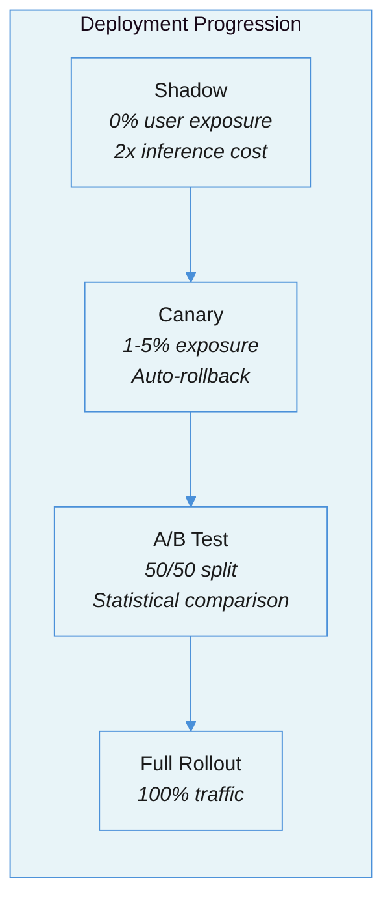
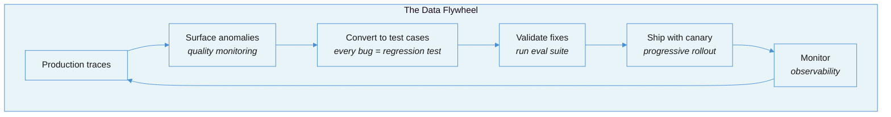

# Testing and Shipping LLM Systems: The Deployment Pipeline Between Evaluation and Production

[Evaluation-Driven Development](evaluation-driven-development.md) teaches you how to measure quality. [Observability and Monitoring](observability-and-monitoring.md) teaches you how to monitor production. This document covers what happens between them: the testing strategies, deployment pipelines, and release practices that get an LLM system safely from "it works on my machine" to "it works for all users."

---

## The Tension: Non-Determinism Breaks Everything You Know About Testing

Traditional software testing rests on a fundamental assumption: given the same input, the system produces the same output. LLMs violate this assumption by design. The same prompt, same model, same temperature produces different outputs on consecutive calls. This is not a bug -- it is the mechanism that makes LLMs useful. But it invalidates every testing strategy built on deterministic assertions.

The result: teams either test nothing ("it is non-deterministic, so tests would be flaky") or test the wrong things ("the output must contain exactly these words"). Both approaches fail in production. The first produces systems that break silently. The second produces test suites so brittle that every model update triggers hundreds of false failures.

The solution is not to make LLM testing look like traditional testing. It is to build a layered testing architecture where each layer uses the right strategy for its level of determinism.

| Testing Layer | What It Tests | Determinism | Run Frequency | Failure Mode It Catches |
|---|---|---|---|---|
| **Deterministic unit tests** | Tool routing, parsing, schema validation, format compliance | Fully deterministic | Every commit | Broken integrations, schema drift, regression in glue code |
| **LLM evaluation tests** | Output quality, semantic correctness, rubric compliance | Probabilistic (pass rates, not pass/fail) | Every prompt change + nightly | Quality regressions, prompt degradation, model capability shifts |
| **End-to-end scenario tests** | Multi-turn conversations, agent trajectories, task completion | Probabilistic + aggregate | Pre-release + weekly | Workflow breakage, cascading failures, user experience degradation |

---

## Failure Taxonomy: How LLM Testing and Deployment Go Wrong

### Failure 1: The Determinism Trap

The team writes exact-match assertions against LLM output. `assert response == "The answer is 42."` Every model update, temperature change, or prompt tweak breaks the test suite. The team disables the tests.

**Root cause:** Applying deterministic testing patterns to a non-deterministic system. LLM outputs should be tested for semantic properties (contains required information, matches schema, does not contain forbidden content), not lexical identity.

### Failure 2: The Ship-and-Pray Deployment

The team changes a prompt, runs three test inputs manually, and deploys to 100% of traffic. The [ChatGPT sycophancy incident (April 2025)](https://leehanchung.github.io/blogs/2025/04/30/ai-ml-llm-ops/) is the canonical example: OpenAI deployed a system prompt change to all 180M+ users simultaneously with no progressive rollout. The fix took 4 days. A canary deployment would have limited the blast radius to a tiny cohort.

**Root cause:** Treating prompt changes as trivial configuration updates rather than behavioral changes that affect every user.

### Failure 3: Eval Metric Gaming

The team optimizes prompt changes against a fixed eval suite until pass rates hit 95%. Production quality does not improve. [Hamel Husain warns](https://hamel.dev/blog/posts/evals/): "If you are passing 100% of evals, your evals are not challenging enough." Generic metrics like BERTScore and ROUGE create false confidence.

**Root cause:** Overfitting to eval metrics rather than building evals that correlate with real user outcomes. The eval suite becomes a target rather than a measurement instrument.

### Failure 4: Regression Blindness

Static test suites become stale as the product evolves. The tests pass, but production users experience new failure modes that the tests do not cover. The team only discovers problems when users complain.

**Root cause:** Test suites that are not continuously refreshed from production data. The [data flywheel](https://www.langchain.com/articles/llm-evals) -- converting production failures into permanent regression tests -- is not running.

### Failure 5: The Prompt Change Incident

[Deepchecks documented](https://deepchecks.com/llm-production-challenges-prompt-update-incidents/) a concrete case: three words added to a prompt for "conversational flow" caused structured-output error rates to spike within hours, halting revenue-generating workflows. Prompt updates are the **primary source of LLM production incidents** -- not infrastructure or model failures.

**Root cause:** No prompt versioning, no pre-deployment eval, no rollback mechanism. The prompt lives in application code with no separate lifecycle management.

### Failure 6: Silent Quality Degradation

The system returns syntactically valid responses while semantic quality erodes. Models claiming 200K context degrade noticeably around 130K tokens. [Anthropic found](https://www.zenml.io/llmops-database/building-production-ai-agents-lessons-from-claude-code-and-enterprise-deployments) that 90% of agent failures trace to unclear instructions, not model limitations -- but these failures produce coherent-sounding wrong answers that pass basic checks.

**Root cause:** Monitoring uptime and latency instead of output quality. The system is "up" but producing garbage.

---

## The Three-Layer Testing Architecture

### Layer 1: Deterministic Unit Tests

These test everything around the LLM that is fully deterministic. Run on every commit. Fast, cheap, and reliable.

**What to test:**
- Tool routing: given this input, does the router select the correct tool?
- Schema validation: does the output parse into the expected Pydantic model?
- Format compliance: no leaked UUIDs, no PII in user-facing output, dates in ISO-8601
- Context assembly: is the right context being constructed from the right sources?
- Guard rails: do input filters catch known-bad inputs?

```python
# Example: deterministic tests for tool routing and output parsing
def test_tool_router_selects_search_for_questions():
    result = route_query("What is the capital of France?")
    assert result.tool == "search"
    assert result.confidence > 0.8

def test_output_schema_validation():
    raw = '{"answer": "Paris", "sources": ["wikipedia"]}'
    parsed = OutputSchema.model_validate_json(raw)
    assert parsed.answer == "Paris"
    assert len(parsed.sources) >= 1

def test_no_pii_in_output():
    output = generate_response("Summarize the user profile")
    assert not re.search(r'\b\d{3}-\d{2}-\d{4}\b', output)  # No SSNs
    assert not re.search(r'\b[A-Za-z0-9._%+-]+@[A-Za-z0-9.-]+\.[A-Z|a-z]{2,}\b', output)
```

### Layer 2: LLM Evaluation Tests

These test the LLM's output quality using probabilistic methods. Run on every prompt change and nightly against broader suites.

**Key principles:**
- Use **binary PASS/FAIL** rubrics, not Likert scales. [Hamel Husain](https://hamel.dev/blog/posts/llm-judge/): "A binary decision forces everyone to consider what truly matters."
- Use **LLM-as-Judge** from a different model family than the generator (see [LLM Role Separation](llm-role-separation-executor-evaluator.md))
- Test against a **golden dataset** of curated examples with known-good outputs
- Accept **probabilistic pass rates** (e.g., "85% of responses pass the accuracy rubric") rather than binary pass/fail on individual samples

**CI integration pattern** (adapted from [Promptfoo](https://www.promptfoo.dev/docs/integrations/ci-cd/)):

```yaml
# .github/workflows/llm-eval.yml
on:
  push:
    paths: ['prompts/**', 'config/models.yaml']

jobs:
  eval:
    runs-on: ubuntu-latest
    steps:
      - uses: actions/checkout@v4
      - name: Run eval suite
        run: promptfoo eval --config eval/config.yaml -o results.json
      - name: Quality gate
        run: |
          PASS_RATE=$(jq '.results.stats.successes / .results.stats.total' results.json)
          if (( $(echo "$PASS_RATE < 0.85" | bc -l) )); then
            echo "Quality gate failed: pass rate $PASS_RATE < 0.85"
            exit 1
          fi
```

### Layer 3: End-to-End Scenario Tests

These test complete user workflows, including multi-turn conversations and agent trajectories. Run pre-release and weekly.

**What to test:**
- Multi-turn task completion (not just single-turn quality)
- Agent trajectory efficiency (did the agent take a reasonable path?)
- Error recovery (does the system recover gracefully from mid-workflow failures?)
- Edge cases from production logs (the data flywheel output)

---

## Prompt Versioning: Prompts Are Code

A "versioned prompt" encompasses the template text, model configuration (provider, model ID, temperature), input schema, tool definitions, and metadata. **If any of these change, behavior changes -- so all are versioned together.**

### Core Practices

1. **Store prompts in Git.** Treat them as software artifacts that are reviewed, tested, and deployed atomically with application code. [Hamel Husain notes](https://hamel.dev/blog/posts/evals-faq/) that while vendor tools exist, they "create additional layers of indirection."

2. **Immutable versions.** Once created, a prompt version is never modified. Changes generate new versions. This enables reliable traceability and instant rollback.

3. **Semantic aliasing.** Map human-readable tags (`production`, `staging`, `canary`) to specific immutable versions. Promotion happens by reassigning the alias, not by modifying the prompt.

4. **Metadata on every version.** Author, timestamp, rationale for the change, linked eval results. When rollback is needed, the metadata tells you what changed and why.

---

## Deployment Strategies

Prompt and model changes are behavioral changes. Deploy them with the same rigor as code changes.



**Shadow deployment:** Duplicate live traffic to the candidate prompt. Users see only the production response. Detects behavioral shifts before user exposure. Cannot test multi-turn divergence. Doubles inference cost.

**Canary deployment:** Route 1-5% of live traffic to the new prompt. Gradual rollout: 5% -> 10% -> 25% -> 50% -> 100%. Auto-rollback triggers on quality degradation thresholds.

**A/B testing:** Run prompt variants simultaneously with traffic splitting. Requires statistical power analysis -- LLM output variance demands larger sample sizes than traditional A/B tests. Watch for Simpson's Paradox: Prompt B may score higher on average but be catastrophic for a specific user segment.

### Rollback Architecture

- **Feature flags** enable/disable prompt versions without code redeploy
- **Alias reassignment** moves `production` back to a previous immutable version
- **Automated rollback triggers** on: output format success rate, semantic similarity to golden references, latency, token consumption, user satisfaction proxies

---

## The Data Flywheel

The gap between eval scores and production quality is real. The [LangChain team](https://www.langchain.com/articles/llm-evals) identified the bottleneck: "not which scoring technique to use, but building the operational workflows that turn production failures into reproducible test cases."



Every production incident becomes a permanent regression test case. Teams that run this loop on a 2-4 week cadence with 100+ fresh production traces consistently close the eval-production gap. Teams that chase better eval metrics without it do not.

---

## The CI/CD Pipeline for LLM Applications

| Trigger | What Runs | Gate |
|---|---|---|
| **Every commit** (prompt or config change) | Deterministic unit tests + fast LLM eval (10-100 examples) | 95%+ pass rate |
| **Nightly** | Broad regression suite + red team/security scanning + semantic drift detection | No new failure modes |
| **Weekly** | Human review (100+ production traces) + judge alignment validation + cost trend analysis | Domain expert sign-off |
| **Pre-release** | End-to-end scenario tests + full eval suite against held-out data | Release criteria met |

---

## The Hard Truth

Prompt changes are the primary source of LLM production incidents. Not model failures. Not infrastructure outages. Not security breaches. Prompt changes. Three words added for "conversational flow" can halt revenue-generating workflows. A system prompt tweak deployed to 180M users without canary testing can take 4 days to fix.

The uncomfortable truth is that most teams treat prompts as configuration -- a YAML string that does not warrant testing, versioning, or staged deployment. But a prompt is the most consequential code in an LLM system. It determines every behavior the system exhibits. It deserves the same deployment discipline as a database migration: versioned, tested, reviewed, deployed progressively, and instantly rollbackable.

---

## Summary Checklist

| Question | Good Answer | Bad Answer |
|---|---|---|
| Do you have deterministic tests around your LLM? | Yes -- tool routing, parsing, format validation run on every commit | No -- we skip testing because output is non-deterministic |
| Do you use semantic matching for LLM output tests? | Yes -- we test for properties, not exact strings | No -- we use exact-match assertions |
| Are your prompts version-controlled? | Yes -- in Git with immutable versions and metadata | No -- prompts live in application code as strings |
| Do you deploy prompt changes progressively? | Yes -- shadow or canary before full rollout | No -- we deploy to 100% immediately |
| Can you roll back a prompt change in minutes? | Yes -- via alias reassignment or feature flag | No -- rollback requires a code deploy |
| Do production failures become regression tests? | Yes -- every incident creates a permanent test case | No -- we fix and move on without updating the test suite |
| Do you run red team tests on a schedule? | Yes -- nightly or weekly prompt injection / jailbreak scans | No -- security testing is manual and ad hoc |
| Is your eval suite refreshed from production data? | Yes -- on a 2-4 week cadence | No -- same test cases since launch |

---

## References

### Practitioner Guides
- [Hamel Husain: Your AI Product Needs Evals](https://hamel.dev/blog/posts/evals/) -- Three-level eval architecture with CI/CD integration
- [Hamel Husain: Evals FAQ](https://hamel.dev/blog/posts/evals-faq/) -- Testing non-deterministic systems, prompt versioning in Git
- [Pragmatic Engineer: LLM Evals for Developers](https://newsletter.pragmaticengineer.com/p/evals) -- The three-gulf model and error analysis flywheel
- [LangChain: LLM Evals](https://www.langchain.com/articles/llm-evals) -- The data flywheel and operationalizing feedback loops

### Deployment and Operations
- [ChatGPT Sycophancy Incident Analysis](https://leehanchung.github.io/blogs/2025/04/30/ai-ml-llm-ops/) -- The case for progressive rollout
- [Deepchecks: Prompt Update Incidents](https://deepchecks.com/llm-production-challenges-prompt-update-incidents/) -- Prompt changes as primary incident source
- [Promptfoo CI/CD Integration](https://www.promptfoo.dev/docs/integrations/ci-cd/) -- Production-ready pipeline configurations
- [Anthropic: Production Agent Lessons](https://www.zenml.io/llmops-database/building-production-ai-agents-lessons-from-claude-code-and-enterprise-deployments) -- 90% of failures trace to unclear instructions

### Related Documents in This Series
- [Evaluation-Driven Development](evaluation-driven-development.md) -- Building the measurement infrastructure this pipeline depends on
- [Observability and Monitoring](observability-and-monitoring.md) -- Production monitoring that feeds the data flywheel
- [LLM Role Separation](llm-role-separation-executor-evaluator.md) -- Judge independence in LLM evaluation tests
- [Quality Gates in Agentic Systems](quality-gates-in-agentic-systems.md) -- Gate design for pipeline quality checks
