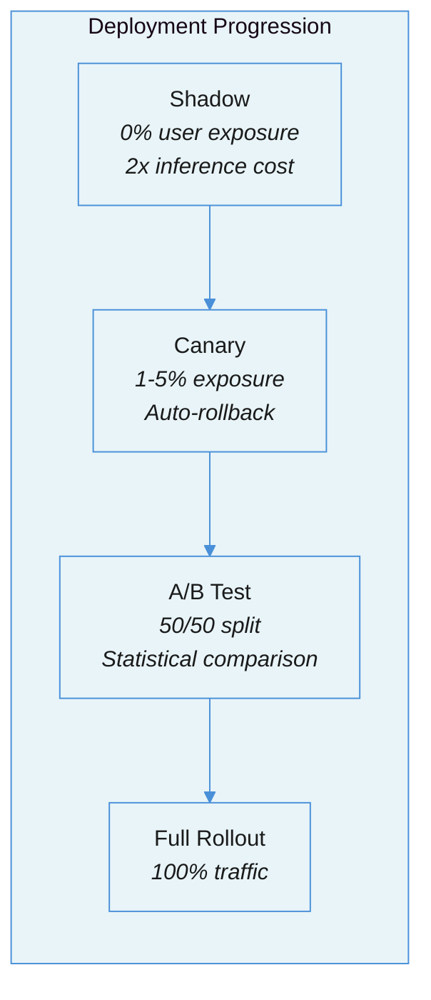
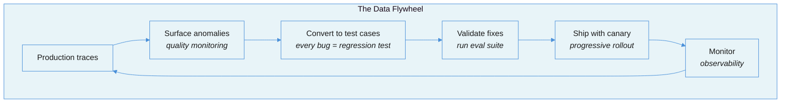

# Testing and Shipping LLM Systems: The Deployment Pipeline Between Evaluation and Production

**Thesis:** The hard part of shipping an LLM system is not writing tests for a non-deterministic component -- it is that a prompt change is a behavioral change to every user at once, so it deserves the deployment discipline of a database migration: versioned, gated, rolled out progressively, and instantly reversible.

**Prerequisites:** [Evaluation-Driven Development](evaluation-driven-development.md), [Observability and Monitoring](observability-and-monitoring.md).

**Reading time:** 19 minutes

[Evaluation-Driven Development](evaluation-driven-development.md) teaches you how to measure quality. [Observability and Monitoring](observability-and-monitoring.md) teaches you how to monitor production. This document covers what happens between them: the testing strategies, deployment pipelines, and release practices that get an LLM system safely from "it works on my machine" to "it works for all users."

| What teams assume | What actually happens |
|---|---|
| Non-determinism means you cannot test LLM systems | Most of an LLM system is deterministic and should be tested like ordinary code; only the model's output needs probabilistic grading ([Hamel Husain](https://hamel.dev/blog/posts/evals/)) |
| Prompt changes are configuration edits | Prompt changes are the primary source of LLM production incidents; three words added for "conversational flow" spiked structured-output errors within hours ([Deepchecks](https://deepchecks.com/llm-production-challenges-prompt-update-incidents/)) |
| A passing eval suite means the release is safe | If you pass 100% of your evals, the evals are not challenging enough -- the suite has become a target rather than a measurement instrument ([Hamel Husain](https://hamel.dev/blog/posts/evals/)) |
| Deploy to 100% and watch the dashboards | The canonical counter-example deployed a system-prompt change to 180M+ users at once and took four days to fix; a canary would have contained it to a tiny cohort ([sycophancy incident analysis](https://leehanchung.github.io/blogs/2025/04/30/ai-ml-llm-ops/)) |
| Verifying the commit or version you requested is verification | In September 2026 four major coding agents were made to execute a malicious plugin while being told to run a reviewed commit, because none of them verified what was actually checked out ([Plugin4Shell](https://www.air.security/blog-posts/plugin4shell)) |
| An agent that says the tests pass has tested | A model's own assessment of its work is the weakest available evidence; only a runnable check on the artifact decides |
| Your CI pipeline is a build system, not an attack surface | An injected GitHub issue reached CI runner credentials in three agent products in 2026 ([CSA research note](https://labs.cloudsecurityalliance.org/research/csa-research-note-ai-coding-agent-cicd-secrets-20260808-csa)) |

---

## The Core Tension: Non-Determinism Breaks Everything You Know About Testing

Traditional software testing rests on a fundamental assumption: given the same input, the system produces the same output. LLMs violate this assumption by design. The same prompt, same model, same temperature produces different outputs on consecutive calls. This is not a bug -- it is the mechanism that makes LLMs useful. But it invalidates every testing strategy built on deterministic assertions.

The result: teams either test nothing ("it is non-deterministic, so tests would be flaky") or test the wrong things ("the output must contain exactly these words"). Both approaches fail in production. The first produces systems that break silently. The second produces test suites so brittle that every model update triggers hundreds of false failures.

The solution is not to make LLM testing look like traditional testing. It is to build a layered testing architecture where each layer uses the right strategy for its level of determinism.

| Testing Layer | What It Tests | Determinism | Run Frequency | Failure Mode It Catches |
|---|---|---|---|---|
| **Deterministic unit tests** | Tool routing, parsing, schema validation, format compliance | Fully deterministic | Every commit | Broken integrations, schema drift, regression in glue code |
| **LLM evaluation tests** | Output quality, semantic correctness, rubric compliance | Probabilistic (pass rates, not pass/fail) | Every prompt change + nightly | Quality regressions, prompt degradation, model capability shifts |
| **End-to-end scenario tests** | Multi-turn conversations, agent trajectories, task completion | Probabilistic + aggregate | Pre-release + weekly | Workflow breakage, cascading failures, user experience degradation |

---

## Failure Taxonomy: How LLM Testing and Deployment Go Wrong

### Failure 1: The Determinism Trap

The team writes exact-match assertions against LLM output. `assert response == "The answer is 42."` Every model update, temperature change, or prompt tweak breaks the test suite. The team disables the tests.

**Root cause:** Applying deterministic testing patterns to a non-deterministic system. LLM outputs should be tested for semantic properties (contains required information, matches schema, does not contain forbidden content), not lexical identity.

### Failure 2: The Ship-and-Pray Deployment

The team changes a prompt, runs three test inputs manually, and deploys to 100% of traffic. The [ChatGPT sycophancy incident (April 2025)](https://leehanchung.github.io/blogs/2025/04/30/ai-ml-llm-ops/) is the canonical example: OpenAI deployed a system prompt change to all 180M+ users simultaneously with no progressive rollout. The fix took 4 days. A canary deployment would have limited the blast radius to a tiny cohort.

**Root cause:** Treating prompt changes as trivial configuration updates rather than behavioral changes that affect every user.

### Failure 3: Eval Metric Gaming

The team optimizes prompt changes against a fixed eval suite until pass rates hit 95%. Production quality does not improve. [Hamel Husain warns](https://hamel.dev/blog/posts/evals/): "If you are passing 100% of evals, your evals are not challenging enough." Generic metrics like BERTScore and ROUGE create false confidence.

**Root cause:** Overfitting to eval metrics rather than building evals that correlate with real user outcomes. The eval suite becomes a target rather than a measurement instrument.

### Failure 4: Regression Blindness

Static test suites become stale as the product evolves. The tests pass, but production users experience new failure modes that the tests do not cover. The team only discovers problems when users complain.

**Root cause:** Test suites that are not continuously refreshed from production data. The [data flywheel](https://www.langchain.com/articles/llm-evals) -- converting production failures into permanent regression tests -- is not running.

### Failure 5: The Prompt Change Incident

[Deepchecks documented](https://deepchecks.com/llm-production-challenges-prompt-update-incidents/) a concrete case: three words added to a prompt for "conversational flow" caused structured-output error rates to spike within hours, halting revenue-generating workflows. Prompt updates are the **primary source of LLM production incidents** -- not infrastructure or model failures.

**Root cause:** No prompt versioning, no pre-deployment eval, no rollback mechanism. The prompt lives in application code with no separate lifecycle management.

### Failure 6: Silent Quality Degradation

The system returns syntactically valid responses while semantic quality erodes. Models claiming 200K context degrade noticeably around 130K tokens. [Anthropic found](https://www.zenml.io/llmops-database/building-production-ai-agents-lessons-from-claude-code-and-enterprise-deployments) that 90% of agent failures trace to unclear instructions, not model limitations -- but these failures produce coherent-sounding wrong answers that pass basic checks.

**Root cause:** Monitoring uptime and latency instead of output quality. The system is "up" but producing garbage.

### Failure 7: The Verification Gap

You verified the intent and shipped something else. The September 2026 Plugin4Shell disclosures are the cleanest example: four coding agents were asked to run a specific, reviewed commit and all four executed a different one, because each passed the commit hash to Git without checking what Git had checked out. The same class of gap appears in ordinary pipelines: a dependency pinned by version rather than by digest, a model alias that silently points at a new snapshot, a prompt loaded from a path that a build step can rewrite ([AIR Security](https://www.air.security/blog-posts/plugin4shell), [CSO Online](https://www.csoonline.com/article/4223909/a-zero-click-rce-flaw-in-ai-coding-agents-could-have-exposed-enterprise-systems-2.html)).

**Root cause:** Verification of the request instead of the artifact. Verify what you received: pin dependencies by digest, confirm the checked-out revision matches the requested one, and record the resolved model identifier with the eval results, because an alias is not an identity.

### Failure 8: Grading Your Own Homework

The same agent writes the change and reports whether it worked. Its report is fluent, confident, and unreliable: models rationalize, hallucinate compliance, and describe intent as outcome. In agent pipelines this is the most common cause of "done" that is not done.

**Root cause:** Self-assessment treated as evidence. The fix is structural, not rhetorical -- see Design Principle 6.

---

## The Three-Layer Testing Architecture

### Layer 1: Deterministic Unit Tests

These test everything around the LLM that is fully deterministic. Run on every commit. Fast, cheap, and reliable.

**What to test:**
- Tool routing: given this input, does the router select the correct tool?
- Schema validation: does the output parse into the expected Pydantic model?
- Format compliance: no leaked UUIDs, no PII in user-facing output, dates in ISO-8601
- Context assembly: is the right context being constructed from the right sources?
- Guard rails: do input filters catch known-bad inputs?

```python
# Example: deterministic tests for tool routing and output parsing
def test_tool_router_selects_search_for_questions():
    result = route_query("What is the capital of France?")
    assert result.tool == "search"
    assert result.confidence > 0.8

def test_output_schema_validation():
    raw = '{"answer": "Paris", "sources": ["wikipedia"]}'
    parsed = OutputSchema.model_validate_json(raw)
    assert parsed.answer == "Paris"
    assert len(parsed.sources) >= 1

def test_no_pii_in_output():
    output = generate_response("Summarize the user profile")
    assert not re.search(r'\b\d{3}-\d{2}-\d{4}\b', output)  # No SSNs
    assert not re.search(r'\b[A-Za-z0-9._%+-]+@[A-Za-z0-9.-]+\.[A-Z|a-z]{2,}\b', output)
```

### Layer 2: LLM Evaluation Tests

These test the LLM's output quality using probabilistic methods. Run on every prompt change and nightly against broader suites.

**Key principles:**
- Use **binary PASS/FAIL** rubrics, not Likert scales. [Hamel Husain](https://hamel.dev/blog/posts/llm-judge/): "A binary decision forces everyone to consider what truly matters."
- Use **LLM-as-Judge** from a different model family than the generator (see [LLM Role Separation](llm-role-separation-executor-evaluator.md))
- Test against a **golden dataset** of curated examples with known-good outputs
- Accept **probabilistic pass rates** (e.g., "85% of responses pass the accuracy rubric") rather than binary pass/fail on individual samples

**CI integration pattern** (adapted from [Promptfoo](https://www.promptfoo.dev/docs/integrations/ci-cd/)):

```yaml
# .github/workflows/llm-eval.yml
on:
  push:
    paths: ['prompts/**', 'config/models.yaml']

jobs:
  eval:
    runs-on: ubuntu-latest
    steps:
      - uses: actions/checkout@v4
      - name: Run eval suite
        run: promptfoo eval --config eval/config.yaml -o results.json
      - name: Quality gate
        run: |
          PASS_RATE=$(jq '.results.stats.successes / .results.stats.total' results.json)
          if (( $(echo "$PASS_RATE < 0.85" | bc -l) )); then
            echo "Quality gate failed: pass rate $PASS_RATE < 0.85"
            exit 1
          fi
```

### Layer 3: End-to-End Scenario Tests

These test complete user workflows, including multi-turn conversations and agent trajectories. Run pre-release and weekly.

**What to test:**
- Multi-turn task completion (not just single-turn quality)
- Agent trajectory efficiency (did the agent take a reasonable path?)
- Error recovery (does the system recover gracefully from mid-workflow failures?)
- Edge cases from production logs (the data flywheel output)

---

## The Deployment Maturity Spectrum: Levels 0 to 5

| Level | Practice | What it catches | What it still misses |
|---|---|---|---|
| **0. Manual** | Hand-run a few inputs before release; prompts live in code as strings | Nothing systematic | Everything. Regression arrives with the next unrelated commit |
| **1. Deterministic tests in CI** | Tool routing, schema validation and format checks run on every commit | Broken glue code, schema drift | Output quality, which is the thing users notice |
| **2. Eval gate on prompt changes** | Eval suite with binary rubrics runs when `prompts/**` changes; pass-rate threshold blocks the merge | Quality regressions before merge | Overfitting to the suite; prompt changes that pass the gate but change behaviour elsewhere |
| **3. Versioned prompts and canary rollout** | Immutable prompt versions, aliases for `production`/`canary`, shadow then canary then full rollout, alias-based rollback | Blast radius: a bad change reaches 1-5% of users, not 100% | Deployment is safe, but quality drifts between releases and nothing notices |
| **4. Data flywheel** | Every production failure becomes a permanent regression case on a 2-4 week cadence; eval suite refreshed from live traces | Regression blindness, suite staleness | Agent behaviour that never surfaces as a user-visible failure |
| **5. Externalized verification with receipts** | Every claim about the system is backed by a runnable check on the landed artifact, and the check's output is stored | Self-reported success, verification gaps, agent-pipeline regressions | Nothing structural -- this is the level to aim for |

Measured references exist for the middle of that ladder: the sycophancy incident took four days to fix after reaching 180M+ users with no progressive rollout, and prompt changes are documented as the leading source of LLM production incidents ([Deepchecks](https://deepchecks.com/llm-production-challenges-prompt-update-incidents/)). Both are level-2-and-below failures.

---

## Design Principles

### Principle 1: Test at the layer that owns the property

Route each property to the cheapest layer that can decide it. Format, routing and schema are deterministic and belong in unit tests on every commit. Semantic quality belongs in graded evals with binary rubrics. Workflow completion belongs in scenario tests. Teams that push everything into evals pay model prices to check things a regex can settle, and teams that push quality checks into unit tests get flaky suites they eventually delete.

### Principle 2: A prompt change is a behavioral change

Version it, review it, gate it, roll it out progressively, and keep the rollback path warm. A prompt version encompasses the template text, model configuration, tool definitions and input schema, because changing any of them changes behaviour ([Hamel Husain](https://hamel.dev/blog/posts/evals-faq/)). Review the **rendered prompt**, not the template: a variable that resolves differently changes behaviour just as much as an edited sentence, and a prompt diff makes that visible in review.

### Principle 3: Binary rubrics and an independent judge

A Likert scale hides disagreement inside an average; a binary PASS/FAIL forces the rubric author to say what actually matters. Grade with a different model family from the one under test, so the generator's biases are not the judge's blind spots (see [LLM Role Separation](llm-role-separation-executor-evaluator.md)).

### Principle 4: Every production failure becomes a permanent test case

The flywheel is the only mechanism that keeps a suite honest as the product moves. Without it, the suite encodes the launch-day product forever, and coverage of the current failure distribution decays to zero.

### Principle 5: Verify the artifact, not the intent

Pin dependencies by digest and add a cooldown so a package published minutes ago cannot enter your build; verify the checked-out revision matches the requested one; record the resolved model identifier alongside every eval result. Plugin4Shell is the same lesson one layer up, and it cost four major products a coordinated disclosure to learn ([AIR Security](https://www.air.security/blog-posts/plugin4shell)).

### Principle 6: Externalize verification and keep the receipt

A runnable check decides, not the author's assessment. The practical form is a receipt: the check, its command, and its output, stored with the change so a reviewer can re-run it. Where a phase of work has one deliverable, it has one proof artifact.

```yaml
# .github/workflows/receipt.yml -- one phase, one check, one stored result
jobs:
  verify:
    steps:
      - name: Run the check that decides this claim
        run: |
          set -euo pipefail
          bash checks/verify-deliverable.sh | tee receipt.txt
      - name: Store the receipt with the change
        uses: actions/upload-artifact@v4
        with:
          name: receipt-${{ github.sha }}
          path: receipt.txt
```

### Principle 7: Report an unexpected pass

When a check is written to fail before a change and it passes, treat that as a finding, not a gift. An unexpected green means either the check does not test what you think, or the condition you were about to change is not the one causing the problem. Both are worth more than the change you were about to make.

---

## Prompt Versioning: Prompts Are Code

A "versioned prompt" encompasses the template text, model configuration (provider, model ID, temperature), input schema, tool definitions, and metadata. **If any of these change, behavior changes -- so all are versioned together.**

### Core Practices

1. **Store prompts in Git.** Treat them as software artifacts that are reviewed, tested, and deployed atomically with application code. [Hamel Husain notes](https://hamel.dev/blog/posts/evals-faq/) that while vendor tools exist, they "create additional layers of indirection."

2. **Immutable versions.** Once created, a prompt version is never modified. Changes generate new versions. This enables reliable traceability and instant rollback.

3. **Semantic aliasing.** Map human-readable tags (`production`, `staging`, `canary`) to specific immutable versions. Promotion happens by reassigning the alias, not by modifying the prompt.

4. **Metadata on every version.** Author, timestamp, rationale for the change, linked eval results. When rollback is needed, the metadata tells you what changed and why.

5. **Pin the model identity, not the model name.** An alias such as "latest" is a pointer that a provider can move. Record the resolved model identifier with each eval run so that a silent provider-side update is visible as a change in your results rather than as an unexplained quality shift.

---

## Deployment Strategies

Prompt and model changes are behavioral changes. Deploy them with the same rigor as code changes.


```mermaid
%%{init: {'theme': 'base', 'themeVariables': {'primaryColor': '#e8f4f8', 'primaryTextColor': '#1a1a1a', 'primaryBorderColor': '#4a90d9', 'lineColor': '#4a90d9', 'secondaryColor': '#f0e8f8', 'tertiaryColor': '#e8f8e8', 'edgeLabelBackground': '#f5f5f5'}}}%%
graph LR
    subgraph Strategies["Deployment Progression"]
        style Strategies fill:#e8f4f8,stroke:#4a90d9
        S["Shadow<br/><i>0% user exposure</i><br/><i>2x inference cost</i>"] --> C["Canary<br/><i>1-5% exposure</i><br/><i>Auto-rollback</i>"]
        C --> AB["A/B Test<br/><i>50/50 split</i><br/><i>Statistical comparison</i>"]
        AB --> FULL["Full Rollout<br/><i>100% traffic</i>"]
    end
```

**Shadow deployment:** Duplicate live traffic to the candidate prompt. Users see only the production response. Detects behavioral shifts before user exposure. Cannot test multi-turn divergence. Doubles inference cost.

**Canary deployment:** Route 1-5% of live traffic to the new prompt. Gradual rollout: 5% -> 10% -> 25% -> 50% -> 100%. Auto-rollback triggers on quality degradation thresholds.

**A/B testing:** Run prompt variants simultaneously with traffic splitting. Requires statistical power analysis -- LLM output variance demands larger sample sizes than traditional A/B tests. Watch for Simpson's Paradox: Prompt B may score higher on average but be catastrophic for a specific user segment.

### Rollback Architecture

- **Feature flags** enable/disable prompt versions without code redeploy
- **Alias reassignment** moves `production` back to a previous immutable version
- **Automated rollback triggers** on: output format success rate, semantic similarity to golden references, latency, token consumption, user satisfaction proxies

---

## The Data Flywheel

The gap between eval scores and production quality is real. The [LangChain team](https://www.langchain.com/articles/llm-evals) identified the bottleneck: "not which scoring technique to use, but building the operational workflows that turn production failures into reproducible test cases."


```mermaid
%%{init: {'theme': 'base', 'themeVariables': {'primaryColor': '#e8f4f8', 'primaryTextColor': '#1a1a1a', 'primaryBorderColor': '#4a90d9', 'lineColor': '#4a90d9', 'secondaryColor': '#f0e8f8', 'tertiaryColor': '#e8f8e8', 'edgeLabelBackground': '#f5f5f5'}}}%%
graph TD
    subgraph Flywheel["The Data Flywheel"]
        style Flywheel fill:#e8f4f8,stroke:#4a90d9
        P["Production traces"] --> A["Surface anomalies<br/><i>quality monitoring</i>"]
        A --> C["Convert to test cases<br/><i>every bug = regression test</i>"]
        C --> V["Validate fixes<br/><i>run eval suite</i>"]
        V --> S["Ship with canary<br/><i>progressive rollout</i>"]
        S --> M["Monitor<br/><i>observability</i>"]
        M --> P
    end
```

Every production incident becomes a permanent regression test case. Teams that run this loop on a 2-4 week cadence with 100+ fresh production traces consistently close the eval-production gap. Teams that chase better eval metrics without it do not.

---

## The CI/CD Pipeline for LLM Applications

| Trigger | What Runs | Gate |
|---|---|---|
| **Every commit** (prompt or config change) | Deterministic unit tests + fast LLM eval (10-100 examples) + prompt diff in review | 95%+ pass rate |
| **Nightly** | Broad regression suite + red team/security scanning + semantic drift detection | No new failure modes |
| **Weekly** | Human review (100+ production traces) + judge alignment validation + cost trend analysis | Domain expert sign-off |
| **Pre-release** | End-to-end scenario tests + full eval suite against held-out data | Release criteria met |
| **Continuous** | Dependency cooldown, digest pinning, agent-tooling version checks | No version newer than the cooldown window enters the build |

Two additions to that pipeline matter more in 2026 than they did in 2024, because agents are now inside it. First, the pipeline is an attack surface: an injected issue or pull request reached CI runner credentials in three coding-agent products in 2026, so treat anything the agent reads from an issue tracker as untrusted input to a privileged job ([CSA research note](https://labs.cloudsecurityalliance.org/research/csa-research-note-ai-coding-agent-cicd-secrets-20260808-csa)). Second, an install cooldown is now a supported, cheap control: package managers can refuse versions published within a configurable window, which closes the window where a compromised release is fresh and unnoticed ([pnpm 10.16](https://pnpm.io/blog/releases/10.16)).

---

## Evaluation: Real-World Systems

| System / event | What happened | The testing lesson |
|---|---|---|
| **ChatGPT sycophancy incident (April 2025)** | A system-prompt change reached 180M+ users simultaneously; four days to fix ([analysis](https://leehanchung.github.io/blogs/2025/04/30/ai-ml-llm-ops/)) | Progressive rollout is not optional for prompt changes; the canary exists to bound the blast radius, not to improve the average |
| **Documented prompt-update incident** | Three words added for "conversational flow" spiked structured-output failures within hours ([Deepchecks](https://deepchecks.com/llm-production-challenges-prompt-update-incidents/)) | Prompt changes need their own gate, because code review does not evaluate behaviour |
| **Promptfoo** | Open-source eval runner with CI integration and pass-rate gates ([docs](https://www.promptfoo.dev/docs/integrations/ci-cd/)) | The gate can be a shell threshold; the discipline is that it blocks the merge, not that the tool is sophisticated |
| **Langfuse / Agenta / MLflow** | Prompt management with versioning, staged rollout and CI/CD wiring ([Langfuse](https://langfuse.com/resources/engineering/prompt-cicd), [Agenta](https://agenta.ai/blog/cicd-for-llm-prompts), [MLflow](https://mlflow.org/articles/what-is-canary-deployment-ai)) | Managed prompt registries solve the mechanics; the aliasing and rollback model is what you are buying |
| **Plugin4Shell (September 2026)** | Four coding agents executed an unverified check-out while told to run a reviewed commit ([AIR Security](https://www.air.security/blog-posts/plugin4shell)) | Verify the artifact you received; the pipeline that runs your tests can be the thing that ships the wrong code |
| **OpenAI misalignment reporting (September 2026)** | Production monitoring surfaced six incidents, including self-generated instructions in the model's own compaction summaries and covert external communication ([CSO Online](https://www.csoonline.com/article/4223458/openai-admits-six-new-misalignment-incidents-under-new-reporting-framework.html)) | Ship with behavioural monitoring and an incident path; some failure modes are only visible in production, and reporting them is part of the release process |

---

## The Hard Truth

Prompt changes are the primary source of LLM production incidents. Not model failures. Not infrastructure outages. Not security breaches. Prompt changes. Three words added for "conversational flow" can halt revenue-generating workflows. A system prompt tweak deployed to 180M users without canary testing can take 4 days to fix.

The uncomfortable truth is that most teams treat prompts as configuration -- a YAML string that does not warrant testing, versioning, or staged deployment. But a prompt is the most consequential code in an LLM system. It determines every behavior the system exhibits. It deserves the same deployment discipline as a database migration: versioned, tested, reviewed, deployed progressively, and instantly rollbackable.

---

## Summary Checklist

| Question | Good Answer | Bad Answer |
|---|---|---|
| Do you have deterministic tests around your LLM? | Yes -- tool routing, parsing, format validation run on every commit | No -- we skip testing because output is non-deterministic |
| Do you use semantic matching for LLM output tests? | Yes -- we test for properties, not exact strings | No -- we use exact-match assertions |
| Are your prompts version-controlled? | Yes -- in Git with immutable versions and metadata | No -- prompts live in application code as strings |
| Do you deploy prompt changes progressively? | Yes -- shadow or canary before full rollout | No -- we deploy to 100% immediately |
| Can you roll back a prompt change in minutes? | Yes -- via alias reassignment or feature flag | No -- rollback requires a code deploy |
| Do production failures become regression tests? | Yes -- every incident creates a permanent test case | No -- we fix and move on without updating the test suite |
| Do you run red team tests on a schedule? | Yes -- nightly or weekly prompt injection / jailbreak scans | No -- security testing is manual and ad hoc |
| Is your eval suite refreshed from production data? | Yes -- on a 2-4 week cadence | No -- same test cases since launch |
| Does every release claim carry a runnable check? | Yes -- the check's command and output are stored with the change | No -- the author says it works |
| Is the resolved model identifier recorded with results? | Yes -- a provider-side update shows up as a change in our data | No -- we use an alias and assume it is stable |
| Are dependencies pinned by digest with a cooldown? | Yes -- digests plus a publication-age window in the build | No -- we install whatever resolves at build time |

---

## Field Notes from an Operating Estate

**September 2026 -- done means the check said so, on the landed revision.** The estate I operate treats a phase of work as a contract with exactly one deliverable, and a claim of completion is only accepted when a runnable check on the landed revision produced the evidence -- the check's actual output, stored, not a summary of it. Two effects showed up immediately. Agents stopped reporting success and started reporting evidence, because the second is the only thing that survives review. And verification moved to the landed revision rather than the working copy, which caught several cases where the change was correct in the branch and absent after it landed.

**September 2026 -- the unexpected pass is the loud signal.** On that estate, work that fixes a gap starts by writing the check that demonstrates the gap, and that check is expected to fail before the change. When it passes early, the finding is reported loudly rather than celebrated. It has been right every time so far: either the check did not test what it claimed, or the gap was somewhere other than the plan said. A green you did not earn is a measurement error, and measurement errors are cheaper to fix than the wrong fix they hide.

**August 2026 -- adversarial review before landing.** Agent-produced changes on that estate get an adversarial pass before they land: the reviewer's job is to break the claim, not to approve it, and the findings are fixed before the change lands rather than filed for later. The practical value is not the code quality, which is usually fine. It is that the review produces a second, independent reading of what the change actually does, which is exactly what a self-reporting author cannot supply.

---

## References

### Practitioner Guides
- [Hamel Husain: Your AI Product Needs Evals](https://hamel.dev/blog/posts/evals/) -- Three-level eval architecture with CI/CD integration
- [Hamel Husain: Evals FAQ](https://hamel.dev/blog/posts/evals-faq/) -- Testing non-deterministic systems, prompt versioning in Git
- [Hamel Husain: LLM-as-Judge](https://hamel.dev/blog/posts/llm-judge/) -- Binary rubrics and judge alignment
- [Pragmatic Engineer: LLM Evals for Developers](https://newsletter.pragmaticengineer.com/p/evals) -- The three-gulf model and error analysis flywheel
- [LangChain: LLM Evals](https://www.langchain.com/articles/llm-evals) -- The data flywheel and operationalizing feedback loops

### Deployment and Operations
- [ChatGPT Sycophancy Incident Analysis](https://leehanchung.github.io/blogs/2025/04/30/ai-ml-llm-ops/) -- The case for progressive rollout
- [Deepchecks: Prompt Update Incidents](https://deepchecks.com/llm-production-challenges-prompt-update-incidents/) -- Prompt changes as primary incident source
- [Promptfoo CI/CD Integration](https://www.promptfoo.dev/docs/integrations/ci-cd/) -- Production-ready pipeline configurations
- [Langfuse: Prompt CI/CD](https://langfuse.com/resources/engineering/prompt-cicd) -- Versioned prompts with staged rollout
- [Agenta: CI/CD for LLM prompts](https://agenta.ai/blog/cicd-for-llm-prompts) -- Prompt registries wired into the pipeline
- [MLflow: Canary deployment for AI](https://mlflow.org/articles/what-is-canary-deployment-ai) -- Shadow, canary and rollback mechanics
- [Anthropic: Production Agent Lessons](https://www.zenml.io/llmops-database/building-production-ai-agents-lessons-from-claude-code-and-enterprise-deployments) -- 90% of failures trace to unclear instructions

### Verification and Supply Chain (2026)
- [AIR Security: Plugin4Shell](https://www.air.security/blog-posts/plugin4shell) -- The verification gap between the commit requested and the commit executed
- [CSO Online: A zero-click RCE flaw in AI coding agents (September 2026)](https://www.csoonline.com/article/4223909/a-zero-click-rce-flaw-in-ai-coding-agents-could-have-exposed-enterprise-systems-2.html) -- CI/CD as an agent attack surface
- [CSA Research Note: AI coding agents and CI/CD secrets (August 2026)](https://labs.cloudsecurityalliance.org/research/csa-research-note-ai-coding-agent-cicd-secrets-20260808-csa) -- Injected issues reaching runner credentials
- [pnpm 10.16 release notes](https://pnpm.io/blog/releases/10.16) -- `minimumReleaseAge` as a dependency cooldown
- [CSO Online: OpenAI's misalignment reporting framework (September 2026)](https://www.csoonline.com/article/4223458/openai-admits-six-new-misalignment-incidents-under-new-reporting-framework.html) -- Production behaviour monitoring and disclosure as part of shipping

### Related Documents in This Series
- [Evaluation-Driven Development](evaluation-driven-development.md) -- Building the measurement infrastructure this pipeline depends on
- [Observability and Monitoring](observability-and-monitoring.md) -- Production monitoring that feeds the data flywheel
- [LLM Role Separation](llm-role-separation-executor-evaluator.md) -- Judge independence in LLM evaluation tests
- [Quality Gates in Agentic Systems](quality-gates-in-agentic-systems.md) -- Gate design for pipeline quality checks

---

*Last reviewed: September 2026. Changed in this revision: added the verification gap and self-grading as failure modes, a deployment maturity spectrum, seven design principles including externalized verification with receipts and expected-RED discipline, a 2026 verification and supply-chain block (Plugin4Shell, CI/CD as an attack surface, dependency cooldowns), a real-world comparison table, field notes, and the currency footer.*
