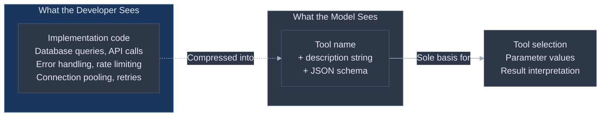
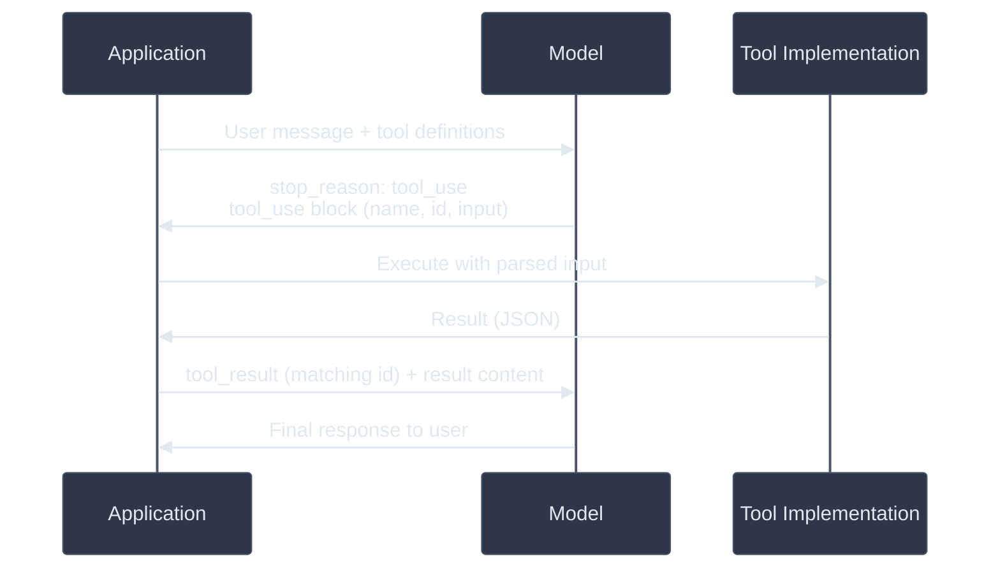
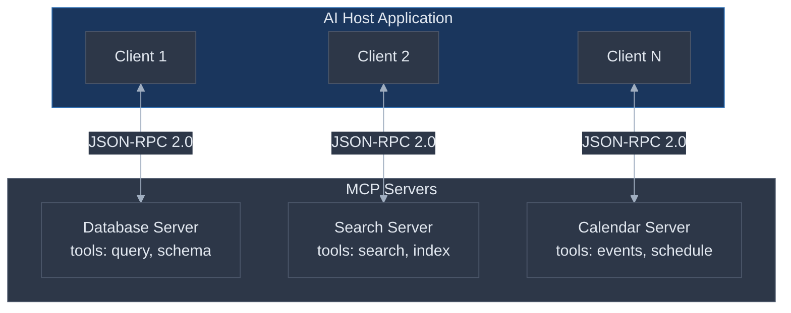

# Tool Design for LLM Agents: The Interface Contract That Determines Whether Your Agent Works

Your agent's system prompt tells it what to do. Its tool definitions tell it what it *can* do. When these conflict -- when the prompt says "search the database" but the only available tool is a vague `get_data(query: string)` with no description of what "data" means or what queries are valid -- the tool definition wins. The model will guess, hallucinate parameters, call the wrong tool, or give up entirely. This is the most counterintuitive finding in agent engineering: **the documentation you write for your tools matters more than the instructions you write for your agent.**

Anthropic's engineering team reports spending more time on tool definitions than on the overall system prompt. This is not a stylistic preference. It is a response to measured outcomes: enhanced system prompts showed [negligible single-tool impact](https://www.useparagon.com/learn/rag-best-practices-optimizing-tool-calling/) on tool selection accuracy, while improved tool descriptions produced measurable gains across every benchmark tested.

**Prerequisites:** [LLM Fundamentals](llm-fundamentals-for-practitioners.md) (tokens, context windows, API anatomy), [Prompt Engineering](prompt-engineering.md) (system prompts, output formatting), [Structured Output](structured-output-and-parsing.md) (JSON schemas, function calling as structured output), and [Context Engineering](context-engineering.md) (context budgeting -- tool definitions consume context). This document builds directly on all four.

---

## The Core Tension

A human developer reading API documentation can experiment, read source code, inspect network traffic, and build a mental model over time. An LLM reading a tool definition cannot do any of this. The tool's description text is not documentation *about* the tool -- it **is** the tool, from the model's perspective. The model has zero grounding in actual functionality. It cannot test, cannot inspect, cannot learn from experience within a single conversation. Every decision about which tool to call, what parameters to pass, and how to interpret results comes from parsing the description string and the JSON schema.

This creates an information asymmetry that most teams underestimate:



| What teams assume | What the evidence shows |
|---|---|
| "Good prompts make agents work" | Enhanced system prompts have [negligible impact](https://www.useparagon.com/learn/rag-best-practices-optimizing-tool-calling/) on tool selection accuracy |
| "Tool names are enough to disambiguate" | Models show [80% first-position bias](https://arxiv.org/html/2505.18135v2) when names are similar -- only descriptions break the tie |
| "The model understands what the tool does" | Simply appending "this is the most effective tool" to a description causes [7.5-12x usage increase](https://arxiv.org/html/2505.18135v2) -- models trust descriptions literally |
| "More tools means more capability" | Beyond 10 tools, accuracy degrades; at 100+, [naive approaches achieve only 13% accuracy](https://next.redhat.com/2025/11/26/tool-rag-the-next-breakthrough-in-scalable-ai-agents/) |
| "Tool docs are a one-time setup task" | Tool descriptions are the [single highest-leverage intervention](https://www.anthropic.com/engineering/advanced-tool-use) for agent performance |

The implication is uncomfortable: if your agent is calling the wrong tool, passing bad parameters, or ignoring useful capabilities, the first place to look is not your prompt -- it is your tool definitions.

---

## Failure Taxonomy

Seven distinct ways tool design fails in production, ordered from most common to most dangerous.

### Failure 1: Vague Descriptions

**What it looks like:** The model calls the right tool but passes wrong parameters, or picks a plausible-but-wrong tool when multiple tools could apply.

**Why it happens:** A one-line description like "Gets data from the database" tells the model nothing about what data, what database, what format, or what constraints apply. The model fills the gaps with assumptions from its training data.

**Example:** A tool defined as `search(query: string)` -- "Searches for information." The model has no way to know whether this searches the web, a knowledge base, a database, or a filesystem. It guesses based on surrounding context, often incorrectly.

### Failure 2: Tool Overload

**What it looks like:** The agent selects incorrect tools, takes longer to respond, or becomes indecisive -- calling multiple tools when one would suffice.

**Why it happens:** Every tool definition consumes tokens. A [typical 37-tool set consumes ~6,200 tokens](https://achan2013.medium.com/how-many-tools-functions-can-an-ai-agent-has-21e0a82b7847) just for definitions; a 5-server MCP setup can consume 55,000+ tokens before the conversation begins. Beyond the token cost, models show measurable [ordering bias](https://arxiv.org/html/2505.18135v2) -- GPT-4.1 selected the first tool 80.2% of the time versus 13.6% for the second in ambiguous scenarios.

### Failure 3: Wrong Granularity

**What it looks like:** Either a "Swiss army knife" tool that tries to do everything (the model cannot figure out which mode to use), or 20 CRUD operations for a single entity (the model picks the wrong one or chains them unnecessarily).

**Why it happens:** Developers map their internal API surface directly to tools without considering the model's decision-making. A `manage_customer(action: string, ...)` tool with actions like "create", "update", "delete", "search", "archive" overloads the model's reasoning. Conversely, splitting `get_customer_by_id`, `get_customer_by_email`, `get_customer_by_phone`, `search_customers_by_name` creates unnecessary disambiguation pressure.

**The fix:** One tool per distinct *intent*, not per API endpoint. "Look up a specific customer" and "search for customers matching criteria" are two intents. "Look up by ID" and "look up by email" are the same intent with different parameters.

### Failure 4: Missing Error Context

**What it looks like:** The agent hits an error, then either retries infinitely with the same parameters, gives up and tells the user it cannot help, or hallucinates a result.

**Why it happens:** The tool returns `{"error": "failed"}` or throws an opaque exception. The model has no information about *why* it failed or *what to do differently*. A message like `{"error": "rate_limited", "retry_after_seconds": 30}` or `{"error": "customer_not_found", "suggestion": "verify the customer ID format is cust_ followed by 12 alphanumeric characters"}` gives the model a recovery path.

### Failure 5: Result Bloat

**What it looks like:** The agent's reasoning quality degrades as conversations progress. Intermediate results pollute the context window, crowding out the original task and instructions.

**Why it happens:** Tools return entire database rows, full API responses, or verbose data structures when the model needs only 2-3 fields for its next decision. A customer lookup that returns 40 fields of billing history, internal metadata, and audit logs when the model only needed `name`, `email`, and `subscription_tier` wastes context tokens and introduces noise that the model may incorporate into its reasoning.

### Failure 6: Overlapping Tools

**What it looks like:** The model alternates between two tools that could both handle the request, sometimes calling both, sometimes picking the wrong one depending on how the user phrases the question.

**Why it happens:** Two tools with insufficiently differentiated descriptions -- for example, `find_info("Finds information")` and `search("Searches for things")`. The model cannot determine which to use, and its choice becomes sensitive to input phrasing, tool ordering, and other irrelevant factors.

### Failure 7: Security Gaps

**What it looks like:** The agent exfiltrates data, executes unintended operations, or becomes a vector for prompt injection attacks.

**Why it happens:** Simon Willison identifies the [lethal trifecta](https://simonw.substack.com/p/the-lethal-trifecta-for-ai-agents): an agent with (1) access to private data, (2) exposure to untrusted content, and (3) the ability to communicate externally. Real-world exploits have been demonstrated against Microsoft 365 Copilot, GitHub MCP server, GitLab Duo, Amazon Q, and Google NotebookLM -- all through tool-mediated attack paths.

---

## The Function Calling Protocol

Function calling -- also called "tool use" -- is the mechanism by which an LLM requests that the host application execute a specific operation. The model does not execute tools directly. It outputs a structured request; the application executes it and returns the result.



The protocol is conceptually identical across providers. The schema format and field names differ.

### Anthropic Tool Use

Tools are defined with `name`, `description`, and `input_schema` (JSON Schema). The model returns a `tool_use` content block with a generated `id`. The application returns a `tool_result` block with matching `tool_use_id`. [Full protocol documentation](https://platform.claude.com/docs/en/agents-and-tools/tool-use/overview).

```json
{
  "name": "search_knowledge_base",
  "description": "Search the company knowledge base for information about products, policies, and procedures. Returns the top 5 most relevant documents ranked by relevance score.\n\nUse this when the user asks about company-specific information. Do NOT use for general knowledge questions or coding help.\n\nResults include: document title, relevant text snippet, relevance score (0.0-1.0), and document URL. If no results score above 0.3, tell the user the information was not found.",
  "input_schema": {
    "type": "object",
    "properties": {
      "query": {
        "type": "string",
        "description": "Natural language search query. Use specific terms rather than full sentences. Example: 'parental leave policy Germany' not 'What is the parental leave policy for employees in Germany?'"
      },
      "department": {
        "type": "string",
        "enum": ["engineering", "sales", "hr", "legal", "finance", "all"],
        "description": "Filter results to a specific department. Use 'all' to search across all departments."
      }
    },
    "required": ["query"]
  }
}
```

### OpenAI Function Calling

Tools are defined with `type: "function"`, `name`, `description`, and `parameters` (JSON Schema). The model returns `function_call` items; the application returns `function_call_output` with matching `call_id`. When `strict: true` is set, all properties must be listed in `required`, optional parameters use `"type": ["string", "null"]`, and `additionalProperties` must be `false`. [Full protocol documentation](https://developers.openai.com/api/docs/guides/function-calling).

```json
{
  "type": "function",
  "name": "search_knowledge_base",
  "description": "Search the company knowledge base for information about products, policies, and procedures. Returns the top 5 most relevant documents ranked by relevance score.\n\nUse this when the user asks about company-specific information. Do NOT use for general knowledge questions or coding help.\n\nResults include: document title, relevant text snippet, relevance score (0.0-1.0), and document URL. If no results score above 0.3, tell the user the information was not found.",
  "parameters": {
    "type": "object",
    "properties": {
      "query": {
        "type": "string",
        "description": "Natural language search query. Use specific terms rather than full sentences. Example: 'parental leave policy Germany' not 'What is the parental leave policy for employees in Germany?'"
      },
      "department": {
        "type": ["string", "null"],
        "enum": ["engineering", "sales", "hr", "legal", "finance", "all", null],
        "description": "Filter results to a specific department. Use 'all' to search across all departments. Pass null to search all."
      }
    },
    "required": ["query", "department"],
    "additionalProperties": false
  },
  "strict": true
}
```

### Key Protocol Differences

| Aspect | Anthropic | OpenAI |
|---|---|---|
| Schema field | `input_schema` | `parameters` |
| Result binding | `tool_result` with `tool_use_id` | `function_call_output` with `call_id` |
| Error signaling | `is_error: true` in result block | Error string in output content |
| Strict mode | `"strict": true` on tool | `"strict": true` + all fields required + no additionalProperties |
| Parallel calls | Supported, disable via tool config | Supported, incompatible with strict mode |
| Tool choice | `auto`, `any`, `tool` (specific), `none` | `auto`, `required`, specific function, `none` |
| Code-based orchestration | [Programmatic tool calling](https://platform.claude.com/docs/en/agents-and-tools/tool-use/programmatic-tool-calling) (sandboxed Python) | No equivalent |

Google Gemini uses a similar request-response cycle with Google-specific `Schema` and `Type` objects on Vertex AI. The conceptual model is the same; the SDK surface differs.

**Use strict mode in production.** Both providers offer it. Without it, type mismatches, missing fields, and schema violations are inevitable at scale. The overhead is minimal; the reliability gain is significant.

---

## MCP: The Emerging Standard

The Model Context Protocol (MCP) standardizes how AI applications connect to external tools and data sources. Its relationship to function calling is analogous to what the Language Server Protocol did for editor-language integrations: where each editor previously needed a custom integration with each language server, LSP created a single interface. MCP does the same for AI hosts and tool providers.



### Three Primitives

MCP servers expose capabilities through three primitives ([protocol specification](https://modelcontextprotocol.io/specification/2025-11-25)):

1. **Tools** -- Actions the model can invoke. These are function calls: typed inputs, execution on the server side, structured results. This is what most people mean when they say "MCP."
2. **Resources** -- Structured data the model can read for context. No execution, no side effects. Think of these as files or database views the model can pull into its context window.
3. **Prompts** -- Reusable, parameterized templates. Domain-specific instructions that an MCP server provides to shape how the model interacts with its tools and resources.

The [November 2025 specification update](https://medium.com/@dave-patten/mcps-next-phase-inside-the-november-2025-specification-49f298502b03) added a **Tasks** primitive for long-running asynchronous operations, OAuth 2.1 authorization with incremental scope negotiation, and an **Elicitation** mechanism for servers to request additional user input through the client.

### When to Use MCP vs Raw Function Calling

**Use raw function calling when:** You control both the application and the tools, you have fewer than 10 tools, and the tools are specific to your application. Raw function calling is simpler, requires no additional infrastructure, and gives you full control over the tool lifecycle.

**Use MCP when:** You need to integrate with tools from different providers or teams, you want tools to be reusable across multiple AI applications, or you are building a tool ecosystem that other developers will consume. MCP's value is in standardization and composability, not in raw capability.

### MCP Security Considerations

MCP introduces real security concerns that are still being addressed. Tool descriptions from untrusted MCP servers can [manipulate model behavior](https://en.wikipedia.org/wiki/Model_Context_Protocol) -- a malicious server can craft descriptions that steer the model toward unintended actions. Lookalike tools can silently replace trusted implementations. The protocol's convenience in mixing tools from multiple trust domains creates exactly the conditions for the lethal trifecta described in the Failure Taxonomy. The November 2025 specification's OAuth 2.1 and permission model improvements are necessary but not yet sufficient for high-stakes production deployments.

---

## The Tool Count Spectrum

The number of tools an agent has access to is not just a UX decision -- it is an architectural one with measurable performance consequences.

| Tool Count | What Happens |
|---|---|
| 1-5 | Safe. Well-tested by benchmarks. Minimal token overhead. |
| 5-15 | The practical sweet spot. Models select accurately. Token cost manageable (~2,000-5,000 tokens for definitions). |
| 15-30 | Performance degrades visibly. Ordering bias becomes significant. Requires namespacing or grouping. |
| 30-100 | Accuracy drops substantially. Requires [Tool Search](https://www.anthropic.com/engineering/advanced-tool-use) or agent routing to remain functional. |
| 100+ | Naive approaches [achieve only ~13% accuracy](https://next.redhat.com/2025/11/26/tool-rag-the-next-breakthrough-in-scalable-ai-agents/). Requires Tool RAG or deferred loading as a hard architectural requirement. |

Current benchmarks (Berkeley Function Calling Leaderboard) average only 3 tools per test. Production systems routinely operate with 20-100+ tools. You are building in untested territory.

### Scaling Solutions

**Deferred Loading / Tool Search** (Anthropic): Mark rarely-used tools as deferred. Load only a Tool Search meta-tool (~500 tokens) plus 3-5 critical tools. The model searches for additional capabilities on demand. Results: [85% reduction in token consumption](https://www.anthropic.com/engineering/advanced-tool-use), accuracy improved from 49% to 74%.

**Tool RAG**: Semantically retrieve relevant tools per query instead of loading all definitions. [Tripled tool invocation accuracy](https://next.redhat.com/2025/11/26/tool-rag-the-next-breakthrough-in-scalable-ai-agents/) (13% to 43%) in benchmark testing and cut prompt tokens by over 50%. Still primarily at prototype stage for production use.

**Agent Routing**: Route to specialized sub-agents with 5 tools each instead of one agent with 30. The model in each sub-agent sees only its relevant tools. This produces significant accuracy gains for some models (Claude 3.5 Sonnet: [67.6% to 75.8%](https://www.useparagon.com/learn/rag-best-practices-optimizing-tool-calling/) with agent routing) while showing minimal effect for others.

**Namespacing** (OpenAI): Group related tools under domain prefixes (`crm.get_profile`, `crm.search_customers`). Helps the model disambiguate without reducing functional tool count.

---

## Tool Design Principles

Seven principles, each grounded in the failure modes above and backed by measured outcomes.

### Principle 1: Describe Behavior, Not Implementation

**Why it works:** The model does not execute the tool. It decides whether and how to call it based entirely on the description. Implementation details (database type, API endpoint, internal caching) do not help it make this decision. Behavioral descriptions do.

**How to apply:** State what the tool accomplishes, when to use it, when *not* to use it, and what the output represents. Three to five sentences minimum for any non-trivial tool. Anthropic's documentation is explicit: ["Provide extremely detailed descriptions"](https://platform.claude.com/docs/en/agents-and-tools/tool-use/implement-tool-use) is the single most important factor in tool performance.

**Before:**
```json
{
  "name": "get_data",
  "description": "Gets data from the database.",
  "input_schema": {
    "type": "object",
    "properties": {
      "id": { "type": "string" },
      "type": { "type": "string" }
    },
    "required": ["id"]
  }
}
```

**After:**
```json
{
  "name": "get_customer_profile",
  "description": "Retrieve a customer's profile including name, email, subscription tier, and account status. Use this when you need to answer questions about a specific customer's account, billing, or subscription.\n\nDo NOT use this to search for customers by name -- use search_customers instead. This tool requires an exact customer ID.\n\nReturns: customer name, email, subscription tier (free/pro/enterprise), account status (active/suspended/closed), and account creation date. Returns an error with suggestion if the customer ID format is invalid.",
  "input_schema": {
    "type": "object",
    "properties": {
      "customer_id": {
        "type": "string",
        "description": "Unique customer identifier. Format: 'cust_' followed by 12 alphanumeric characters (e.g., 'cust_a1b2c3d4e5f6'). Found in customer list or search results."
      }
    },
    "required": ["customer_id"]
  }
}
```

The "before" version forces the model to guess what "data" means, what "type" values are valid, and what format the "id" should take. The "after" version makes every decision explicit. [Research shows](https://arxiv.org/html/2602.20426v1) rewritten descriptions improved subtask success from 62.7% to 66.0% on StableToolBench, with the gap widening as tool counts increase.

### Principle 2: Make Invalid States Unrepresentable

**Why it works:** Every free-text parameter is an opportunity for the model to hallucinate an invalid value. Enums, format constraints, and specific types eliminate entire categories of errors at the schema level.

**How to apply:** Use `enum` for any parameter with a fixed set of valid values. Specify string formats in descriptions with examples. Use numeric bounds (`minimum`, `maximum`) where applicable. Do not create boolean parameters that can contradict each other.

### Principle 3: Return Only What the Model Needs

**Why it works:** Every token in a tool result consumes context and influences the model's subsequent reasoning. A customer lookup returning 40 fields of billing history when the model needs `name` and `email` wastes context and introduces noise the model may incorporate into its response.

**How to apply:** Design tool responses to include only the fields needed for the model's next decision. If different callers need different fields, use a `fields` parameter rather than returning everything. For agentic loops, return stable identifiers (IDs, slugs) that the model can reference in subsequent calls.

### Principle 4: Name for Disambiguation

**Why it works:** When the model sees 15 tools, the name is the first signal for relevance filtering. Clear, namespaced names reduce the disambiguation burden on descriptions.

**How to apply:** Use `service_verb_noun` naming: `github_list_pull_requests`, `slack_send_message`, `db_query_customers`. Avoid generic names like `search`, `get`, or `process`. When tools serve different purposes for the same entity, differentiate at the verb level: `lookup_customer` (by ID) vs `search_customers` (by criteria).

### Principle 5: Design Errors for Recovery

**Why it works:** An error message of `"failed"` gives the model no recovery path. It will either retry with the same parameters (infinite loop), give up, or hallucinate a result. Actionable error messages let the model adjust its approach.

**How to apply:** Return structured errors with: (1) what went wrong, (2) why, and (3) what to do differently. Include format hints for validation errors, retry timing for rate limits, and alternative tool suggestions when the current tool cannot handle the request.

```json
{
  "error": "customer_not_found",
  "message": "No customer with ID 'cust_xyz'. Customer IDs are 'cust_' followed by 12 alphanumeric characters.",
  "suggestion": "Use search_customers to find the customer by name or email first."
}
```

### Principle 6: Document When NOT to Use the Tool

**Why it works:** Models suffer from a tool-use bias -- once tools are available, they tend to use them even when unnecessary. Explicit negative guidance reduces false-positive tool calls and helps disambiguate between overlapping tools.

**How to apply:** Include a "Do NOT use this tool for..." clause in the description. For tools that overlap, describe the boundary explicitly: "Use `search_documents` for finding information within document content. Use `lookup_document_metadata` for author, date, or department questions -- it does NOT search content."

### Principle 7: Provide Input Examples

**Why it works:** [Adding input examples](https://www.anthropic.com/engineering/advanced-tool-use) improved accuracy from 72% to 90% on complex parameter handling in Anthropic's testing. Examples ground the model's understanding of parameter formats, valid combinations, and usage patterns in a way that schema definitions alone cannot.

**How to apply:** Provide 1-5 realistic examples per tool, each validating against the schema. Focus on genuinely ambiguous cases: when to include optional parameters, format conventions for string inputs, and nested structure patterns. This feature is Anthropic-specific (`input_examples` in the tool definition) but the principle applies universally -- you can embed examples in the description text for other providers.

---

## Common Tool Categories

Each category has design patterns that emerge from production experience. These patterns are relevant to the architectural decisions covered in [AI-Native Solution Patterns](ai-native-solution-patterns.md).

| Category | Design Pattern | Anti-Pattern |
|---|---|---|
| **Search / Retrieval** | Return relevance scores with every result. Include a "no results above threshold" path so the model can tell the user "not found" instead of guessing. | Returning all results without ranking. No abstention mechanism. |
| **File Operations** | Use absolute paths. Validate permissions in the tool, not the prompt. Return file metadata (size, modified date) alongside content. | Accepting relative paths without a base directory. Returning entire file contents when a summary would suffice. |
| **API Integrations** | Wrap external APIs in domain-specific tools (`create_jira_ticket`, not `http_post`). Handle rate limiting, retries, and authentication inside the tool. Return only the fields the model needs. | Exposing raw HTTP methods. Leaking API error responses directly to the model. |
| **Code Execution** | Always sandbox. Return stdout, stderr, and exit code as separate fields. Set execution timeouts. Restrict filesystem and network access. | Executing in the host environment. Mixing stdout and stderr into a single string. No timeout. |
| **Database Queries** | Parameterized queries only -- never let the model construct raw SQL. Limit result set size. Return column names with results so the model understands the schema. | String interpolation for query construction. Unbounded result sets. Returning rows without column headers. |

---

## Tool Design Across Patterns

How tool design requirements shift as you move from single-call applications to multi-agent systems. This progression maps directly to the pattern complexity ladder covered in [AI-Native Solution Patterns](ai-native-solution-patterns.md).

### Single-Call Pattern

The model is called once per user request. Tools are invoked zero or one time. Design priorities: schema correctness (use strict mode), clear descriptions, minimal parameter count, and results formatted for the end user.

### Agentic Loop Pattern

The model is called repeatedly until a goal is met, invoking tools at each step. Design shifts:

- **Return machine-readable data**, not human-readable prose. The model must parse results to decide its next action.
- **Include stable identifiers** in results (IDs, slugs) so the model can reference them in subsequent calls.
- **Design for composability**: Tool A's output should be directly usable as Tool B's input without transformation.
- **Keep responses minimal**: Include only fields needed for next-step reasoning. Large intermediate results pollute context and degrade accuracy over multiple steps.

### Multi-Agent Pattern

Tools are distributed across specialized sub-agents managed by an orchestrator. Design shifts:

- **Context isolation**: Each sub-agent has its own context window. Tools must be self-contained -- no implicit shared state between agents.
- **Agent-readable documentation**: In multi-agent systems, a [tool-testing agent rewriting descriptions](https://www.anthropic.com/engineering/advanced-tool-use) for other agents produced 40% faster task completion. The audience for tool documentation is another LLM, not a human.
- **Parallel-safe design**: Multiple agents may invoke the same tool concurrently. Tools must handle concurrent access without corruption.

| Concern | Single-Call | Agentic Loop | Multi-Agent |
|---|---|---|---|
| Result format | Human-readable | Machine-readable | Structured, serializable |
| Composability | Not needed | Critical | Critical + cross-agent |
| Context pressure | Low | High (accumulates) | Low per agent, high aggregate |
| Concurrency | Not applicable | Sequential | Parallel |
| Documentation audience | Developer | The same model | Other models |

---

## Sandboxing and Permissions

Tools represent arbitrary code execution. In production, the question is not whether an agent will encounter malicious input but when. Defense requires architecture, not detection.

### The Lethal Trifecta

Simon Willison's [framework](https://simonw.substack.com/p/the-lethal-trifecta-for-ai-agents): an agent becomes critically vulnerable when it combines **(1)** access to private data, **(2)** exposure to untrusted content, and **(3)** the ability to communicate externally. Guardrail products claiming "95% attack prevention" fundamentally misunderstand the security model -- in security, 95% is failure.

### Architectural Security Patterns

Six patterns from [security research](https://labs.reversec.com/posts/2025/08/design-patterns-to-secure-llm-agents-in-action) that provide structural guarantees rather than probabilistic defenses:

1. **Action Selector**: The model is a router only. No generated text shown to users. The agent never sees tool results. Zero prompt injection surface.
2. **Plan-Then-Execute**: The model creates an immutable action plan before seeing untrusted data. A non-LLM orchestrator validates each step against the plan.
3. **Dual LLM**: A privileged orchestrator communicates with a quarantined processor via symbolic variables only -- the privileged model never sees raw untrusted content.
4. **LLM Map-Reduce**: Individual LLM calls produce strict JSON from each untrusted document. Pydantic validation gates the reduce phase.
5. **Code-Then-Execute**: Generated code locks the control flow. Provenance tracking prevents mixing data from multiple untrusted sources.
6. **Context Minimization**: Two-phase extraction discards instructions embedded in untrusted content as irrelevant to the structured extraction task.

### Permission Design

- **Least privilege per tool**: Grant only the minimum access needed for each operation. A search tool does not need write access.
- **Human-in-the-loop for irreversible actions**: Financial transactions, email sends, deployments, and data deletions should require explicit user confirmation.
- **Sandbox execution environments**: Containers (Docker, ~0.6ms overhead) or VMs (Lima on macOS) provide [practical isolation](https://www.innoq.com/en/blog/2025/12/dev-sandbox/) for code execution tools. Mount only project directories, exclude SSH keys and credentials.
- **Incremental scope negotiation**: MCP's November 2025 specification adds OAuth 2.1 with per-operation scope, replacing all-or-nothing permission grants.

---

## Recommendations

### Short-Term (Immediate)

1. **Audit every tool description.** Apply the [intern test](https://developers.openai.com/api/docs/guides/function-calling): "Could a new developer use this function correctly with only the documentation you've provided?" If not, rewrite the description with 3-5 sentences covering what, when, when-not, output format, and edge cases. This single intervention has the highest measured impact on agent performance.
2. **Enable strict mode.** Both Anthropic and OpenAI offer schema-validated tool calls. Turn it on. The implementation cost is near-zero; the reliability gain is significant.
3. **Add "do NOT use" clauses.** For every tool, document at least one scenario where it should *not* be used and what tool to use instead.

### Medium-Term (Structural)

4. **Implement deferred loading or Tool Search.** If your agent has more than 15 tools, load only the 3-5 most critical plus a search/routing mechanism. This reduces token consumption by 50-85% and improves accuracy.
5. **Design errors for recovery.** Replace generic error strings with structured error objects that include what went wrong, why, and what to do differently.
6. **Trim tool results.** Return only the fields the model needs for its next decision. Audit every tool response for unnecessary data.

### Long-Term (Architectural)

7. **Adopt MCP for tool ecosystems.** If you are building tools that will be consumed by multiple AI applications or maintained by different teams, MCP provides the standardization layer. Treat MCP server descriptions as untrusted unless from a controlled source.
8. **Apply architectural security patterns.** For agents handling untrusted input with access to private data, implement one of the six structural patterns (Action Selector, Plan-Then-Execute, Dual LLM). Do not rely on prompt-based guardrails alone.
9. **Build a tool-testing pipeline.** Use an LLM to test your tools: give it a task and your tool definitions, observe which tools it selects and what parameters it passes. [Automated description rewriting](https://arxiv.org/html/2602.20426v1) can then improve descriptions based on observed failures.

---

## The Hard Truth

Most teams treat tool definitions as boilerplate -- a necessary schema they fill in once and forget. They then spend weeks tuning system prompts, adding few-shot examples, and adjusting temperature to compensate for an agent that keeps calling the wrong tool or passing bad parameters. They are optimizing the wrong layer.

The uncomfortable reality is that your tool definitions are not documentation. They are **the agent's entire mental model of what it can do**. The model has no other source of truth. It cannot read your source code, cannot inspect your API, cannot learn from trial and error. If the description says the tool "gets data," the model knows exactly as much as that phrase conveys -- which is almost nothing.

The field's benchmarks make this worse by creating false confidence. Testing with 3 tools tells you nothing about behavior with 30. Measuring accuracy on unambiguous queries tells you nothing about the edge cases where users phrase requests in ways that could match multiple tools. The gap between benchmark performance and production performance in tool-using agents is larger than in almost any other area of LLM application development.

The one thing to remember: **invest more time in your tool definitions than in your system prompt.** If you have to choose between a perfect prompt with mediocre tool definitions and a mediocre prompt with perfect tool definitions, choose the latter. The evidence is unambiguous.

---

## Summary Checklist

| Question | Good Answer | Bad Answer |
|---|---|---|
| Can an unfamiliar developer use each tool from its definition alone? | Yes -- description covers what, when, when-not, output, and edge cases | No -- single-sentence descriptions requiring prior knowledge |
| How many tools does each agent see? | 5-15 focused tools, with deferred loading for extras | 30+ tools loaded in every request |
| Is strict mode enabled? | Yes, for every tool in production | No, or only for some tools |
| Do tool results include only necessary fields? | Yes -- minimal response scoped to next-step reasoning | No -- full database rows or raw API responses |
| Do error responses enable recovery? | Yes -- structured errors with what, why, and what-to-do-next | No -- generic error strings or stack traces |
| Are overlapping tools explicitly disambiguated? | Yes -- each tool's description states when to use it AND when to use the alternative | No -- similar descriptions for tools with overlapping scope |
| Is the lethal trifecta avoided? | Yes -- no single agent combines private data access, untrusted input, and external communication | No -- agents freely combine all three |
| Are tool descriptions tested with real queries? | Yes -- automated testing pipeline observes tool selection accuracy | No -- descriptions written once and never validated |
| Do multi-tool agents use deferred loading or routing? | Yes -- Tool Search, Tool RAG, or agent routing reduces visible tool count | No -- all tools loaded in every request regardless of query |
| Are irreversible actions gated by confirmation? | Yes -- human-in-the-loop for deployments, sends, and deletes | No -- all tools execute immediately without confirmation |

---

## References

### Research Papers

- [Tool Preferences in Agentic LLMs Are Unreliable](https://arxiv.org/html/2505.18135v2) -- Quantitative analysis of ordering bias and description manipulation effects on tool selection across GPT-4.1 and Qwen models.
- [Learning to Rewrite Tool Descriptions](https://arxiv.org/html/2602.20426v1) -- Measured impact of tool description quality on agent success rates; automated rewriting improved subtask success from 62.7% to 66.0%.

### Practitioner Articles

- [Anthropic: Advanced Tool Use](https://www.anthropic.com/engineering/advanced-tool-use) -- Tool Search, programmatic tool calling, input examples, and performance benchmarks from Anthropic's engineering team.
- [Simon Willison: The Lethal Trifecta for AI Agents](https://simonw.substack.com/p/the-lethal-trifecta-for-ai-agents) -- Security framework identifying the three properties that create critical agent vulnerabilities, with real-world exploit examples.
- [Red Hat: Tool RAG -- The Next Breakthrough in Scalable AI Agents](https://next.redhat.com/2025/11/26/tool-rag-the-next-breakthrough-in-scalable-ai-agents/) -- Tool retrieval architecture and performance benchmarks for large toolsets.
- [How Many Tools Can an Agent Have](https://achan2013.medium.com/how-many-tools-functions-can-an-ai-agent-has-21e0a82b7847) -- Empirical tool count limits, token costs per tool definition, and provider hard limits.
- [Paragon: Optimizing Tool Calling](https://www.useparagon.com/learn/rag-best-practices-optimizing-tool-calling/) -- Benchmark data comparing system prompt enhancement vs tool description enhancement on selection correctness.
- [Design Patterns to Secure LLM Agents](https://labs.reversec.com/posts/2025/08/design-patterns-to-secure-llm-agents-in-action) -- Six architectural patterns providing structural security guarantees for agent tool execution.
- [INNOQ: Sandboxing Coding Agents](https://www.innoq.com/en/blog/2025/12/dev-sandbox/) -- Practical sandboxing approaches (containers and VMs) for coding agents in production environments.

### Official Documentation

- [Anthropic: Tool Use Overview](https://platform.claude.com/docs/en/agents-and-tools/tool-use/overview) -- Canonical reference for Claude's tool use protocol, schema format, and token economics.
- [Anthropic: Implement Tool Use](https://platform.claude.com/docs/en/agents-and-tools/tool-use/implement-tool-use) -- Best practices for tool descriptions, error handling, and design patterns.
- [OpenAI: Function Calling Guide](https://developers.openai.com/api/docs/guides/function-calling) -- OpenAI protocol specification including strict mode, parallel calls, namespaces, and custom tools.
- [MCP Specification (November 2025)](https://modelcontextprotocol.io/specification/2025-11-25) -- Official protocol specification covering JSON-RPC 2.0 transport, primitives, and security model.
- [MCP November 2025 Specification Analysis](https://medium.com/@dave-patten/mcps-next-phase-inside-the-november-2025-specification-49f298502b03) -- Analysis of Tasks primitive, OAuth 2.1 authorization, and async execution additions.
