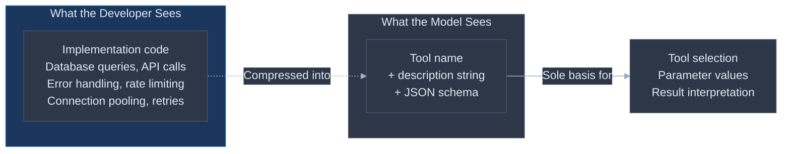
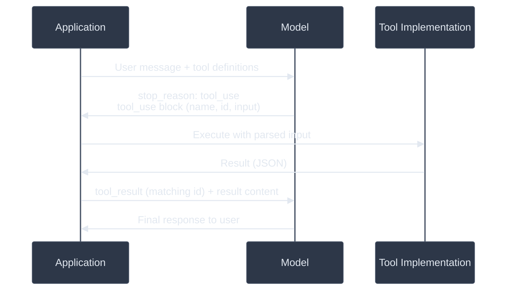
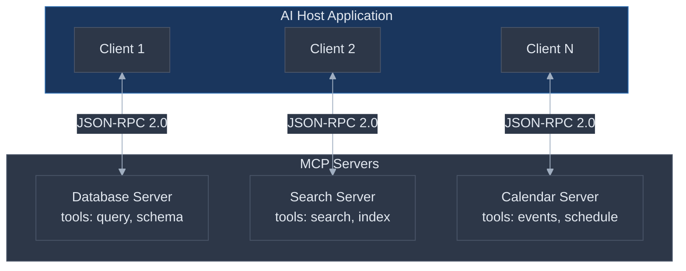

# Tool Design for LLM Agents: The Interface Contract That Determines Whether Your Agent Works

**Thesis:** The documentation you write for your tools matters more than the instructions you write for your agent -- a tool description is not documentation about the tool, it is the tool.
**Prerequisites:** [LLM Fundamentals](llm-fundamentals-for-practitioners.md) (tokens, context windows, API anatomy), [Prompt Engineering](prompt-engineering.md) (system prompts, output formatting), [Structured Output](structured-output-and-parsing.md) (JSON schemas, function calling as structured output), and [Context Engineering](context-engineering.md) (context budgeting -- tool definitions consume context).
**Reading time:** 24 minutes

Your agent's system prompt tells it what to do; its tool definitions tell it what it *can* do. When these conflict -- when the prompt says "search the database" but the only tool is a vague `get_data(query: string)` -- the tool definition wins: the model guesses, hallucinates parameters, calls the wrong tool, or gives up. This is the most counterintuitive finding in agent engineering: **the documentation you write for your tools matters more than the instructions you write for your agent.**

Anthropic's engineering team reports spending more time on tool definitions than on the system prompt. That is not a stylistic preference but a response to measured outcomes: enhanced system prompts showed [negligible single-tool impact](https://www.useparagon.com/learn/rag-best-practices-optimizing-tool-calling/) on tool selection accuracy, while improved tool descriptions produced measurable gains across every benchmark tested.

---

## The Core Tension

A human developer reading API documentation can experiment, read the source, inspect network traffic, and build a mental model over time. An LLM reading a tool definition can do none of this: the description text is not documentation *about* the tool -- it **is** the tool. With no grounding in actual functionality, every decision about which tool to call, what parameters to pass, and how to read the result comes from the description string and the JSON schema.

This creates an information asymmetry that most teams underestimate:


```mermaid
%%{init: {'theme': 'base', 'themeVariables': {'primaryColor': '#2d3748', 'primaryTextColor': '#e2e8f0', 'primaryBorderColor': '#4a5568', 'lineColor': '#a0aec0', 'secondaryColor': '#4a5568', 'tertiaryColor': '#1a202c', 'edgeLabelBackground': '#2d3748', 'clusterBkg': '#2d3748', 'clusterBorder': '#4a5568'}}}%%
graph LR
    subgraph Developer["What the Developer Sees"]
        CODE["Implementation code<br/>Database queries, API calls<br/>Error handling, rate limiting<br/>Connection pooling, retries"]
    end

    subgraph Model["What the Model Sees"]
        DESC["Tool name<br/>+ description string<br/>+ JSON schema"]
    end

    CODE -.->|"Compressed into"| DESC
    DESC -->|"Sole basis for"| CALL["Tool selection<br/>Parameter values<br/>Result interpretation"]

    style Developer fill:#1a365d,stroke:#2b6cb0,color:#e2e8f0
    style Model fill:#2d3748,stroke:#4a5568,color:#e2e8f0
```

| What teams assume | What the evidence shows |
|---|---|
| "Tool names are enough to disambiguate" | Models show [80% first-position bias](https://arxiv.org/html/2505.18135v2) when names are similar -- only descriptions break the tie |
| "The model understands what the tool does" | Simply appending "this is the most effective tool" to a description causes [7.5-12x usage increase](https://arxiv.org/html/2505.18135v2) -- models trust descriptions literally |
| "Tool docs are a one-time setup task" | Tool descriptions are the [single highest-leverage intervention](https://www.anthropic.com/engineering/advanced-tool-use) for agent performance |
| "MCP is the safe default for connecting tools" | Five servers measured [58 tools and ~55,000 tokens](https://www.anthropic.com/engineering/advanced-tool-use) before the conversation began, and a 2026 ecosystem survey found most public servers [vulnerable and never security-reviewed](https://www.practical-devsecops.com/mcp-security-statistics-2026-report) |
| "Big tool results are fine, the window is huge" | Harnesses now [cap tool output per call](https://pydantic.dev/docs/ai/harness/tool-output-limits), because the model is the wrong component to decide what to drop from an oversized result |

The implication: if your agent calls the wrong tool, passes bad parameters, or ignores useful capabilities, look first at your tool definitions, not your prompt.

---

## Failure Taxonomy

Seven distinct ways tool design fails in production, ordered from most common to most dangerous.

### Failure 1: Vague Descriptions

**What it looks like:** The model calls the right tool but passes wrong parameters, or picks a plausible but wrong tool when several could apply.

**Why it happens:** A one-line description like "Gets data from the database" says nothing about what data, what database, what format, or what constraints apply, so the model fills the gaps with assumptions from its training data.

**Example:** A tool defined as `search(query: string)` -- "Searches for information." The model cannot know whether this searches the web, a knowledge base, a database, or a filesystem, so it guesses from surrounding context, often wrongly.

### Failure 2: Tool Overload

**What it looks like:** The agent selects the wrong tools, responds more slowly, or becomes indecisive -- calling several tools when one would do.

**Why it happens:** Every tool definition consumes tokens. A five-server MCP setup -- GitHub, Slack, Sentry, Grafana, Splunk -- measures [58 tools and roughly 55,000 tokens of definitions before the conversation begins](https://www.anthropic.com/engineering/advanced-tool-use), and Anthropic reports [134,000 tokens of tool definitions](https://www.anthropic.com/engineering/advanced-tool-use) in its own deployments before optimization. Beyond cost, models show measurable [ordering bias](https://arxiv.org/html/2505.18135v2): GPT-4.1 selected the first tool 80.2% of the time versus 13.6% for the second in ambiguous scenarios.

### Failure 3: Wrong Granularity

**What it looks like:** Either a "Swiss army knife" tool that does everything (the model cannot pick a mode), or 20 CRUD operations for one entity (the model picks the wrong one or chains them needlessly).

**Why it happens:** Developers map their internal API surface straight to tools without considering the model's decision-making. A `manage_customer(action: string, ...)` tool with "create", "update", "delete", "search", and "archive" actions overloads the model's reasoning; splitting `get_customer_by_id`, `get_customer_by_email`, `get_customer_by_phone`, and `search_customers_by_name` creates needless disambiguation pressure.

**The fix:** One tool per distinct *intent*, not per API endpoint. "Look up a specific customer" and "search for customers matching criteria" are two intents. "Look up by ID" and "look up by email" are the same intent with different parameters.

### Failure 4: Missing Error Context

**What it looks like:** The agent hits an error, then retries endlessly with the same parameters, gives up, or hallucinates a result.

**Why it happens:** The tool returns `{"error": "failed"}` or throws an opaque exception, so the model learns neither *why* it failed nor *what to do differently*. A message like `{"error": "rate_limited", "retry_after_seconds": 30}` or `{"error": "customer_not_found", "suggestion": "verify the customer ID format is cust_ followed by 12 alphanumeric characters"}` gives the model a recovery path.

### Failure 5: Result Bloat

**What it looks like:** Reasoning quality degrades as the conversation progresses: intermediate results pollute the context window and crowd out the original task.

**Why it happens:** Tools return entire database rows, full API responses, or verbose structures when the model needs 2-3 fields for its next decision. A customer lookup returning 40 fields of billing history, internal metadata, and audit logs when the model needed only `name`, `email`, and `subscription_tier` wastes context tokens and adds noise the model may incorporate into its reasoning.

### Failure 6: Overlapping Tools

**What it looks like:** The model alternates between two tools that could both handle the request -- sometimes calling both, sometimes the wrong one, depending on phrasing.

**Why it happens:** Two tools with insufficiently differentiated descriptions -- `find_info("Finds information")` and `search("Searches for things")`. The model cannot tell which to use, and its choice becomes sensitive to input phrasing, tool ordering, and other irrelevant factors.

### Failure 7: Security Gaps

**What it looks like:** The agent exfiltrates data, executes unintended operations, or becomes a vector for prompt injection attacks.

**Why it happens:** Simon Willison's [lethal trifecta](https://simonw.substack.com/p/the-lethal-trifecta-for-ai-agents): private data access, untrusted content, and external communication combined in one agent. Exploits have been demonstrated against Microsoft 365 Copilot, GitHub MCP server, GitLab Duo, Amazon Q, and Google NotebookLM, all through tool-mediated attack paths.

---

## The Function Calling Protocol

Function calling -- also called "tool use" -- is how an LLM asks the host application to execute an operation. The model never executes a tool: it emits a structured request, and the application runs it and returns the result.


```mermaid
%%{init: {'theme': 'base', 'themeVariables': {'primaryColor': '#2d3748', 'primaryTextColor': '#e2e8f0', 'primaryBorderColor': '#4a5568', 'lineColor': '#a0aec0', 'secondaryColor': '#4a5568', 'tertiaryColor': '#1a202c', 'edgeLabelBackground': '#1a202c'}}}%%
sequenceDiagram
    participant App as Application
    participant LLM as Model
    participant Tool as Tool Implementation

    App->>LLM: User message + tool definitions
    LLM->>App: stop_reason: tool_use<br/>tool_use block (name, id, input)
    App->>Tool: Execute with parsed input
    Tool->>App: Result (JSON)
    App->>LLM: tool_result (matching id) + result content
    LLM->>App: Final response to user
```

The protocol is conceptually identical across providers; the schema format and field names differ.

### Anthropic Tool Use

Tools are defined with `name`, `description`, and `input_schema` (JSON Schema). The model returns a `tool_use` content block with a generated `id`. The application returns a `tool_result` block with matching `tool_use_id`. [Full protocol documentation](https://platform.claude.com/docs/en/agents-and-tools/tool-use/overview).

```json
{
  "name": "search_knowledge_base",
  "description": "Search the company knowledge base for information about products, policies, and procedures. Returns the top 5 most relevant documents ranked by relevance score.\n\nUse this when the user asks about company-specific information. Do NOT use for general knowledge questions or coding help.\n\nResults include: document title, relevant text snippet, relevance score (0.0-1.0), and document URL. If no results score above 0.3, tell the user the information was not found.",
  "input_schema": {
    "type": "object",
    "properties": {
      "query": {
        "type": "string",
        "description": "Natural language search query. Use specific terms rather than full sentences. Example: 'parental leave policy Germany' not 'What is the parental leave policy for employees in Germany?'"
      },
      "department": {
        "type": "string",
        "enum": ["engineering", "sales", "hr", "legal", "finance", "all"],
        "description": "Filter results to a specific department. Use 'all' to search across all departments."
      }
    },
    "required": ["query"]
  }
}
```

### OpenAI Function Calling

Tools are defined with `type: "function"`, `name`, `description`, and `parameters` (JSON Schema). The model returns `function_call` items; the application returns `function_call_output` with matching `call_id`. When `strict: true` is set, all properties must be listed in `required`, optional parameters use `"type": ["string", "null"]`, and `additionalProperties` must be `false`. [Full protocol documentation](https://developers.openai.com/api/docs/guides/function-calling).

### Key Protocol Differences

| Aspect | Anthropic | OpenAI |
|---|---|---|
| Schema field | `input_schema` | `parameters` |
| Result binding | `tool_result` with `tool_use_id` | `function_call_output` with `call_id` |
| Error signaling | `is_error: true` in result block | Error string in output content |
| Strict mode | `"strict": true` on tool | `"strict": true` + all fields required + no additionalProperties |
| Parallel calls | Supported, disable via tool config | Supported, incompatible with strict mode |
| Tool choice | `auto`, `any`, `tool` (specific), `none` | `auto`, `required`, specific function, `none` |
| Code-based orchestration | [Programmatic tool calling](https://platform.claude.com/docs/en/agents-and-tools/tool-use/programmatic-tool-calling) (sandboxed Python) | No equivalent |

Google Gemini uses a similar request-response cycle with Google-specific `Schema` and `Type` objects on Vertex AI: same conceptual model, different SDK surface.

**Use strict mode in production.** Both providers offer it; without it, type mismatches, missing fields, and schema violations are inevitable at scale. The overhead is minimal, the reliability gain significant.

---

## MCP: Standard, Backlash, and What It Costs You

The Model Context Protocol (MCP) standardizes how AI applications connect to external tools and data sources. Its relationship to function calling is what the Language Server Protocol (LSP) did for editors: where each editor once needed a custom integration per language server, LSP created one interface. MCP does the same for AI hosts and tool providers.

**Status check, September 2026.** MCP is a standard, and that claim needs qualifying in both directions. Governance left single-vendor control: the protocol was [donated to the Agentic AI Foundation](https://www.anthropic.com/news/donating-the-model-context-protocol-and-establishing-of-the-agentic-ai-foundation), formed [under the Linux Foundation](https://www.linuxfoundation.org/press/linux-foundation-announces-the-formation-of-the-agentic-ai-foundation), where it is now [hosted as a project](https://aaif.io/projects/model-context-protocol). The specification ships on a published cadence with a [formal deprecation policy](https://blog.modelcontextprotocol.io/posts/2026-07-28-release-candidate) rather than as vendor release notes -- which is what a standard looks like.

Since March 2026 it is also a standard under open attack. A major AI product [announced it was moving away from MCP](https://tyk.io/learning-center/is-mcp-dead-in-2026-why-enterprises-still-need-mcp), citing tool definitions consuming most of its context window, and independent analysis measured [4-32x more tokens than an equivalent command-line call](https://tyk.io/learning-center/is-mcp-dead-in-2026-why-enterprises-still-need-mcp) for the same task. "MCP is dead" became a genre of blog post. The strongest critique is not that MCP is useless but that its cost was invisible: [ten servers at five tools each is fifty definitions sitting in context](https://cefboud.com/posts/is-mcp-overhyped) whether or not the agent uses them, and a schema-laden REST or CLI alternative is not automatically cheaper once the agent has to read that schema to call it. The counter-argument: the token bill is a tool-loading problem with a known fix, while what MCP sells -- authentication, audit trails, governance across many teams -- has no cheaper substitute at scale.

**Read it as:** a standard that won the interface argument and lost the cost argument, with the cost now answered by deferred loading (see The Tool Count Spectrum) rather than by abandoning the protocol.


```mermaid
%%{init: {'theme': 'base', 'themeVariables': {'primaryColor': '#2d3748', 'primaryTextColor': '#e2e8f0', 'primaryBorderColor': '#4a5568', 'lineColor': '#a0aec0', 'secondaryColor': '#4a5568', 'tertiaryColor': '#1a202c', 'edgeLabelBackground': '#2d3748', 'clusterBkg': '#2d3748', 'clusterBorder': '#4a5568'}}}%%
graph TD
    subgraph Host["AI Host Application"]
        C1["Client 1"]
        C2["Client 2"]
        C3["Client N"]
    end

    subgraph Servers["MCP Servers"]
        S1["Database Server<br/>tools: query, schema"]
        S2["Search Server<br/>tools: search, index"]
        S3["Calendar Server<br/>tools: events, schedule"]
    end

    C1 <-->|"JSON-RPC 2.0"| S1
    C2 <-->|"JSON-RPC 2.0"| S2
    C3 <-->|"JSON-RPC 2.0"| S3

    style Host fill:#1a365d,stroke:#2b6cb0,color:#e2e8f0
    style Servers fill:#2d3748,stroke:#4a5568,color:#e2e8f0
```

### Three Primitives

MCP servers expose capabilities through three primitives ([protocol specification](https://modelcontextprotocol.io/specification/2026-07-28)):

1. **Tools** -- Actions the model can invoke: typed inputs, server-side execution, structured results. This is what most people mean by "MCP."
2. **Resources** -- Structured data the model can read for context: no execution, no side effects. Think of files or database views the model can pull into its window.
3. **Prompts** -- Reusable, parameterized templates: domain-specific instructions a server provides to shape how the model uses its tools and resources.

### What Changed in the 2026-07-28 Specification

Three changes matter if you are writing a server or a client ([release announcement](https://blog.modelcontextprotocol.io/posts/2026-07-28)):

1. **The core protocol became stateless.** Sessions are no longer held open by the transport, which makes servers far easier to scale behind ordinary infrastructure. Long-running work moved out of the core: **Tasks**, previously a core primitive for asynchronous operations, is now an [extension](https://blog.modelcontextprotocol.io/posts/2026-07-28-release-candidate).
2. **Extensions became the growth mechanism.** Interactive interfaces (**MCP Apps**) and asynchronous work (**Tasks**) ship as extensions rather than as protocol revisions, so the core stays small and implementers adopt capabilities independently.
3. **The surface shrank as well as grew.** Roots, Sampling, and Logging were deprecated, and the deprecation policy governs how they are removed. OAuth 2.1 authorization with incremental scope negotiation and **Elicitation** (servers requesting input through the client) remain in the core.

**What this means for you:** if you adopted MCP before mid-2026, check your servers for deprecated primitives and confirm your client handles the stateless core. If you are adopting now, build against the 2026-07-28 specification and treat extensions as opt-in.

### When to Use MCP vs Raw Function Calling

**Use raw function calling when:** you control both the application and the tools, you have fewer than 10 tools, and the tools are application-specific. It is simpler, needs no extra infrastructure, and gives full control over the tool lifecycle.

**Use MCP when:** you integrate tools from different providers or teams, want tools reusable across applications, or are building an ecosystem other developers will consume. MCP's value is standardization and composability, not raw capability.

### MCP Security Considerations

MCP introduces real security concerns, and the evidence base is now quantified rather than theoretical. Tool descriptions from untrusted servers can [manipulate model behavior](https://en.wikipedia.org/wiki/Model_Context_Protocol): a malicious server can craft descriptions that steer the model toward unintended actions, and lookalike tools can silently replace trusted ones. Mixing tools from multiple trust domains creates exactly those conditions.

**The measured picture as of 2026:** an ecosystem survey found most public servers [carried vulnerabilities and had never been security-reviewed](https://www.practical-devsecops.com/mcp-security-statistics-2026-report), and a research note concluded the ecosystem's [security posture was not keeping pace with its adoption](https://labs.cloudsecurityalliance.org/research/csa-research-note-mcp-security-crisis-20260504-csa-styled). The 2026 specification's OAuth 2.1 authorization, incremental scope negotiation, and deprecation of loosely specified primitives are necessary but not sufficient. Treat every MCP server as an untrusted dependency: pin and review the ones you run, and never connect a server from a trust domain you would not let write to your data.

---

## The Tool Count Spectrum

Tool count is not a UX decision but an architectural one with measurable performance consequences.

| Tool Count | What Happens |
|---|---|
| 1-5 | Safe. Well-tested by benchmarks. Minimal token overhead. |
| 5-15 | The practical sweet spot. Models select accurately. Token cost manageable (~2,000-5,000 tokens for definitions). |
| 15-30 | Performance degrades visibly. Ordering bias becomes significant. Requires namespacing or grouping. |
| 30-100 | Accuracy drops substantially. Requires [Tool Search](https://www.anthropic.com/engineering/advanced-tool-use) or agent routing to remain functional. |
| 100+ | Naive approaches [achieve only ~13% accuracy](https://next.redhat.com/2025/11/26/tool-rag-the-next-breakthrough-in-scalable-ai-agents/). Requires Tool RAG or deferred loading as a hard architectural requirement. |

Current benchmarks (Berkeley Function Calling Leaderboard) average only 3 tools per test, while production systems routinely run 20-100+. You are building in untested territory.

### Scaling Solutions

**Deferred Loading / Tool Search** (Anthropic): Mark rarely-used tools as deferred with a `defer_loading` flag and load only a Tool Search meta-tool (~500 tokens) plus a few critical tools; the model searches for more on demand. Results: context consumption for a 50+ tool library fell from roughly 77,000 tokens to 8,700 -- an [85% reduction that preserves 95% of the window](https://www.anthropic.com/engineering/advanced-tool-use) -- while accuracy improved from 49% to 74% on Opus 4 and from 79.5% to 88.1% on Opus 4.5. The accuracy gain is the part to notice: this is not a cost optimization that trades away quality, but a quality improvement that also costs less.

**Tool RAG**: Retrieve relevant tools per query instead of loading all definitions. [Tripled tool invocation accuracy](https://next.redhat.com/2025/11/26/tool-rag-the-next-breakthrough-in-scalable-ai-agents/) (13% to 43%) in benchmark testing and cut prompt tokens by over half. Still mostly at prototype stage.

**Agent Routing**: Route to specialized sub-agents with 5 tools each instead of one agent with 30, so each model sees only its relevant tools. This produces significant gains for some models (Claude 3.5 Sonnet: [67.6% to 75.8%](https://www.useparagon.com/learn/rag-best-practices-optimizing-tool-calling/)) and minimal effect for others.

**Namespacing** (OpenAI): Group related tools under domain prefixes (`crm.get_profile`, `crm.search_customers`) to help the model disambiguate without reducing the functional tool count.

### Result Size Limits

Deferring tool *definitions* solves half the problem; the other half is results. A single unbounded result -- a whole file, a table dump, a 400-line log -- can consume the budget deferred loading just saved, and the model is the wrong component to decide what to keep. Modern harnesses [cap tool output per call and truncate at the harness boundary](https://pydantic.dev/docs/ai/harness/tool-output-limits) rather than asking the model to summarize. Two design rules follow: return the smallest useful result (a count plus the first N rows, not the whole table), and when truncation is unavoidable, mark what was dropped -- a silently truncated result reads to the model as a complete one.

### Parallel Tool Calls

When several tool calls have no dependency on each other, issuing them in one turn is faster and more accurate than running them in sequence. [A 2026 study scaling parallel tool calls](https://arxiv.org/html/2602.07359v1) reached 62.2% on BrowseComp with a mid-tier model, surpassing the 54.9% reported for the same family's high-reasoning configuration, in fewer turns. The mechanism is context hygiene: each call in a parallel batch is issued against the same clean context rather than attending over every previous result.

The cost is orchestration: the harness must fan out, rate-limit per integration, retry with backoff, and reconcile partial failure without duplicating side effects. And parallelism is safe only for reads -- two writes in one batch have no defined order, so any tool with a side effect should be serialized or made idempotent. The test is dependency: if the second call needs the first call's output, it is a chain, not a parallel call.

---

## Design Principles

Seven principles, each grounded in the failure modes above and backed by measured outcomes.

### Principle 1: Describe Behavior, Not Implementation

**Why it works:** The model does not execute the tool; it decides whether and how to call it from the description alone. Implementation details (database type, API endpoint, internal caching) do not help that decision. Behavioral descriptions do.

**How to apply:** State what the tool accomplishes, when to use it, when *not* to use it, and what the output represents -- three to five sentences minimum for any non-trivial tool. Anthropic's documentation is explicit: ["Provide extremely detailed descriptions"](https://platform.claude.com/docs/en/agents-and-tools/tool-use/implement-tool-use) is the single most important factor in tool performance.

**Before:**
```json
{
  "name": "get_data",
  "description": "Gets data from the database.",
  "input_schema": {
    "type": "object",
    "properties": {
      "id": { "type": "string" },
      "type": { "type": "string" }
    },
    "required": ["id"]
  }
}
```

**After:**
```json
{
  "name": "get_customer_profile",
  "description": "Retrieve a customer's profile including name, email, subscription tier, and account status. Use this when you need to answer questions about a specific customer's account, billing, or subscription.\n\nDo NOT use this to search for customers by name -- use search_customers instead. This tool requires an exact customer ID.\n\nReturns: customer name, email, subscription tier (free/pro/enterprise), account status (active/suspended/closed), and account creation date. Returns an error with suggestion if the customer ID format is invalid.",
  "input_schema": {
    "type": "object",
    "properties": {
      "customer_id": {
        "type": "string",
        "description": "Unique customer identifier. Format: 'cust_' followed by 12 alphanumeric characters (e.g., 'cust_a1b2c3d4e5f6'). Found in customer list or search results."
      }
    },
    "required": ["customer_id"]
  }
}
```

The "before" version forces the model to guess what "data" means, which "type" values are valid, and what format "id" takes; the "after" version makes every decision explicit. [Research shows](https://arxiv.org/html/2602.20426v1) rewritten descriptions improved subtask success from 62.7% to 66.0% on StableToolBench, with the gap widening as tool counts increase.

### Principle 2: Make Invalid States Unrepresentable

**Why it works:** Every free-text parameter is a chance for the model to hallucinate an invalid value; enums, format constraints, and specific types eliminate whole categories of errors at the schema level.

**How to apply:** Use `enum` for any parameter with a fixed set of valid values, specify string formats in descriptions with examples, use numeric bounds (`minimum`, `maximum`) where applicable, and never create boolean parameters that can contradict each other.

### Principle 3: Return Only What the Model Needs

**Why it works:** Every token in a result consumes context and shapes the model's next step; Failure 5 shows what the waste costs.

**How to apply:** Design responses with only the fields needed for the model's next decision. If different callers need different fields, use a `fields` parameter rather than returning everything. For agentic loops, return stable identifiers (IDs, slugs) the model can reference later.

### Principle 4: Name for Disambiguation

**Why it works:** With 15 tools in view, the name is the first relevance signal; clear, namespaced names reduce the disambiguation burden on descriptions.

**How to apply:** Use `service_verb_noun` naming: `github_list_pull_requests`, `slack_send_message`, `db_query_customers`. Avoid generic names like `search`, `get`, or `process`, and differentiate at the verb level when tools serve different purposes for one entity: `lookup_customer` (by ID) vs `search_customers` (by criteria).

### Principle 5: Design Errors for Recovery

**Why it works:** An error message of `"failed"` gives no recovery path: the model retries with the same parameters, gives up, or hallucinates. Actionable errors let it adjust.

**How to apply:** Return structured errors with (1) what went wrong, (2) why, and (3) what to do differently -- format hints for validation errors, retry timing for rate limits, and an alternative tool when the current one cannot handle the request.

### Principle 6: Document When NOT to Use the Tool

**Why it works:** Models carry a tool-use bias: once tools exist, they use them even when unnecessary. Explicit negative guidance cuts false-positive calls and disambiguates overlapping tools.

**How to apply:** Add a "Do NOT use this tool for..." clause. For overlapping tools, describe the boundary explicitly: "Use `search_documents` for information within document content. Use `lookup_document_metadata` for author, date, or department questions -- it does NOT search content."

### Principle 7: Provide Input Examples

**Why it works:** [Adding input examples](https://www.anthropic.com/engineering/advanced-tool-use) improved accuracy from 72% to 90% on complex parameter handling in Anthropic's testing. Examples ground the model's understanding of parameter formats, valid combinations, and usage patterns in a way that schema definitions alone cannot.

**How to apply:** Provide 1-5 realistic examples per tool, each validating against the schema, focused on genuinely ambiguous cases: optional parameters, string formats, and nested structures. This feature is Anthropic-specific (`input_examples`), but the principle is universal: embed examples in the description text for other providers.

---

## Common Tool Categories

Each category has design patterns that emerge from production experience, and they bear on the architectural decisions in [AI-Native Solution Patterns](ai-native-solution-patterns.md).

| Category | Design Pattern | Anti-Pattern |
|---|---|---|
| **Search / Retrieval** | Return relevance scores with every result. Include a "no results above threshold" path so the model can tell the user "not found" instead of guessing. | Returning all results without ranking. No abstention mechanism. |
| **File Operations** | Use absolute paths. Validate permissions in the tool, not the prompt. Return file metadata (size, modified date) alongside content. | Accepting relative paths without a base directory. Returning entire file contents when a summary would suffice. |
| **API Integrations** | Wrap external APIs in domain-specific tools (`create_jira_ticket`, not `http_post`). Handle rate limiting, retries, and authentication inside the tool. Return only the fields the model needs. | Exposing raw HTTP methods. Leaking API error responses directly to the model. |
| **Code Execution** | Always sandbox. Return stdout, stderr, and exit code as separate fields. Set execution timeouts. Restrict filesystem and network access. | Executing in the host environment. Mixing stdout and stderr into a single string. No timeout. |
| **Database Queries** | Parameterized queries only -- never let the model construct raw SQL. Limit result set size. Return column names with results so the model understands the schema. | String interpolation for query construction. Unbounded result sets. Returning rows without column headers. |

---

## Tool Design Across Patterns

How tool design requirements shift from single-call applications to multi-agent systems, mapping to the pattern complexity ladder in [AI-Native Solution Patterns](ai-native-solution-patterns.md).

### Single-Call Pattern

The model is called once per request; tools are invoked zero or one time. Design priorities: schema correctness (strict mode), clear descriptions, minimal parameter count, and results formatted for the end user.

### Agentic Loop Pattern

The model is called repeatedly until a goal is met, invoking tools at each step. Design shifts:

- **Return machine-readable data**, not prose. The model must parse results to decide its next action.
- **Include stable identifiers** in results (IDs, slugs) so the model can reference them later.
- **Design for composability**: Tool A's output should be directly usable as Tool B's input without transformation.
- **Keep responses minimal**: include only fields needed for next-step reasoning; large intermediate results pollute context and degrade accuracy across steps.

### Multi-Agent Pattern

Tools are distributed across specialized sub-agents managed by an orchestrator. Design shifts:

- **Context isolation**: Each sub-agent has its own context window, so tools must be self-contained -- no implicit shared state.
- **Agent-readable documentation**: In multi-agent systems, a [tool-testing agent rewriting descriptions](https://www.anthropic.com/engineering/advanced-tool-use) for other agents produced 40% faster task completion. The audience for tool documentation is another LLM, not a human.
- **Parallel-safe design**: Multiple agents may invoke a tool concurrently, so tools must handle concurrent access without corruption.

---

## Sandboxing and Permissions

Tools represent arbitrary code execution, and in production the question is not whether an agent meets malicious input but when. Defense requires architecture, not detection.

### The Lethal Trifecta

Simon Willison's [framework](https://simonw.substack.com/p/the-lethal-trifecta-for-ai-agents): an agent is critically vulnerable when it combines **(1)** private data access, **(2)** untrusted content, and **(3)** external communication. Guardrail products claiming "95% attack prevention" misunderstand the security model: in security, 95% is failure.

### Architectural Security Patterns

Six patterns from [security research](https://labs.reversec.com/posts/2025/08/design-patterns-to-secure-llm-agents-in-action) that provide structural guarantees rather than probabilistic defenses:

1. **Action Selector**: The model is a router only. No generated text shown to users. The agent never sees tool results. Zero prompt injection surface.
2. **Plan-Then-Execute**: The model creates an immutable action plan before seeing untrusted data. A non-LLM orchestrator validates each step against the plan.
3. **Dual LLM**: A privileged orchestrator communicates with a quarantined processor via symbolic variables only -- the privileged model never sees raw untrusted content.
4. **LLM Map-Reduce**: Individual LLM calls produce strict JSON from each untrusted document. Pydantic validation gates the reduce phase.
5. **Code-Then-Execute**: Generated code locks the control flow. Provenance tracking prevents mixing data from multiple untrusted sources.
6. **Context Minimization**: Two-phase extraction discards instructions embedded in untrusted content as irrelevant to the structured extraction task.

### Permission Design

- **Least privilege per tool**: Grant only the minimum access needed for each operation. A search tool does not need write access.
- **Human-in-the-loop for irreversible actions**: Financial transactions, email sends, deployments, and data deletions should require explicit user confirmation.
- **Sandbox execution environments**: Containers (Docker, ~0.6ms overhead) or VMs (Lima on macOS) give [practical isolation](https://www.innoq.com/en/blog/2025/12/dev-sandbox/) for code execution. Mount only project directories; exclude SSH keys and credentials.
- **Incremental scope negotiation**: MCP's 2026-07-28 specification keeps OAuth 2.1 with per-operation scope in the core, replacing all-or-nothing grants.
- **Isolate by capability, not by tool count**: [a 2026 systematization of agent isolation and access control](https://arxiv.org/html/2607.05743v1) surveys how these boundaries are enforced; the ones that hold are defined by what a tool can reach -- filesystem, network, credential store -- not by how many tools exist. [Practical sandboxing guidance](https://northflank.com/blog/how-to-sandbox-ai-agents) converges on the same three questions: what the process can read, where it can write, and what it can reach over the network.

---

## Evaluation: Real-World Systems

Tool-design claims are unusually testable: context consumed, selection accuracy, and cost per task are all directly measurable. These are results from identifiable systems and studies -- calibration points, not targets, because each is specific to a tool library, a model, and a task set.

| System or study | What was measured | Reported result |
|---|---|---|
| Anthropic Tool Search | Context consumed by a 50+ tool library | ~77,000 tokens to ~8,700, an 85% reduction that preserves 95% of the window |
| Anthropic Tool Search | Tool-selection accuracy | 49% to 74% (Opus 4); 79.5% to 88.1% (Opus 4.5) |
| Red Hat Tool RAG | Tool invocation accuracy at 100+ tools | 13% to 43%, with prompt tokens down by more than half |
| Parallel tool calling study (2026) | BrowseComp accuracy | 62.2% with a mid-tier model, versus 54.9% reported for the same family's high-reasoning configuration |
| Serial versus parallel agent benchmark (2026) | Accuracy, cost, and wall clock across 200 tasks | Frontier model running serially: 97.5% at $144 in 48 minutes. Small model running parallel: 99.0% at $0.73 in about a minute |
| Agent routing (Paragon) | Selection accuracy, Claude 3.5 Sonnet | 67.6% to 75.8% |
| Tool description rewriting (2026) | Subtask success rate | 62.7% to 66.0% |
| MCP ecosystem survey (2026) | Security review status of public servers | Most servers carried vulnerabilities and had never been reviewed |

Two readings follow. The parallelism row is not a small optimization: a small model issuing parallel calls beat a frontier model running serially on both accuracy and cost, so the serial design was paying for context accumulation it did not need. And every row that improves accuracy also cuts tokens -- tool design has unusually few genuine quality-versus-cost trade-offs, so a proposal claiming one deserves scrutiny.

## Field Notes from an Operating Estate

Two observations from a practitioner estate that runs agents through a harness with a fixed tool surface, plus a statement of what it has not measured.

**July 2026 -- a refusal is a tool result.** Work in that estate runs behind deterministic gates: a commit-time check refuses work that violates a rule and prints the exact compliant shape inline rather than merely rejecting it. The finding generalizes to tool design, because a refusal is a tool result like any other and carries the same burden. A tool that fails without showing the caller what a correct call looks like costs more in retries than the check saves, and the cost compounds: the agent retries, fails again, and spends its remaining budget on variants of a call that was never going to pass. Two rules came out of it -- state what was wrong, and state what to do instead -- and a third followed: never truncate the part of a result that explains the failure, because a refusal cut off mid-sentence reads to the model as a generic error.

**September 2026 -- a tool that mangles its input teaches callers to route around it.** One tool in the estate's harness silently corrupted certain payloads passed inline, producing plausible-looking but wrong output instead of an error. The workaround that emerged became a convention: write the payload to a file, then act on the file. That convention is now part of the operating rules, so every future caller pays for a tool defect that was never fixed. When a tool interface has an encoding hazard, the lasting cost is not the failed calls -- it is the permanent bypass callers build around it, and that bypass is invisible in the tool's own metrics.

**On the limits of this section.** The estate has not benchmarked tool-count limits, selection accuracy, or token cost per tool, so it offers no measurements on those axes. The tables above rest on the published sources cited.

## Recommendations

### Short-Term (Immediate)

1. **Audit every tool description.** Apply the [intern test](https://developers.openai.com/api/docs/guides/function-calling): "Could a new developer use this function correctly with only the documentation you've provided?" If not, rewrite it with 3-5 sentences covering what, when, when-not, output format, and edge cases.
2. **Enable strict mode.** Both providers offer schema-validated tool calls; turn it on. Cost is near-zero, the reliability gain significant.
3. **Add "do NOT use" clauses.** For every tool, document at least one scenario where it should *not* be used and what tool to use instead.

### Medium-Term (Structural)

4. **Implement deferred loading or Tool Search.** If your agent has more than 15 tools, load only the 3-5 most critical plus a search/routing mechanism. This reduces token consumption by 50-85% and improves accuracy.
5. **Design errors for recovery.** Replace generic error strings with structured objects carrying what went wrong, why, and the fix.
6. **Trim tool results.** Return only the fields the model needs next; audit every response for unnecessary data.

### Long-Term (Architectural)

7. **Adopt MCP for tool ecosystems.** For tools consumed by multiple applications or maintained by different teams, MCP provides the standardization layer. Treat server descriptions as untrusted unless the source is controlled.
8. **Apply architectural security patterns.** For agents with untrusted input and private data access, implement one of the six structural patterns (Action Selector, Plan-Then-Execute, Dual LLM); do not rely on prompt-based guardrails.
9. **Build a tool-testing pipeline.** Give an LLM a task and your tool definitions, then observe which tools it selects and what parameters it passes. [Automated description rewriting](https://arxiv.org/html/2602.20426v1) can improve descriptions from the observed failures.

---

## The Hard Truth

Most teams treat tool definitions as boilerplate -- a schema filled in once and forgotten -- then spend weeks tuning prompts, adding few-shot examples, and adjusting temperature to compensate for an agent that keeps calling the wrong tool. They are optimizing the wrong layer.

The uncomfortable reality: your tool definitions are not documentation. They are **the agent's entire mental model of what it can do**, and the model has no other source of truth -- it cannot read your source, inspect your API, or learn from trial and error. If the description says the tool "gets data," the model knows exactly as much as that phrase conveys, which is almost nothing.

The field's benchmarks make this worse by creating false confidence: testing with 3 tools says nothing about behavior with 30, and accuracy on unambiguous queries says nothing about the edge cases where a request could match several tools. The gap between benchmark and production performance is larger for tool-using agents than for almost any other area of LLM development.

The one thing to remember: **invest more time in your tool definitions than in your system prompt.** Given a choice between a perfect prompt with mediocre tool definitions and a mediocre prompt with perfect ones, choose the latter. The evidence is unambiguous.

---

## Summary Checklist

| Question | Good Answer | Bad Answer |
|---|---|---|
| Can an unfamiliar developer use each tool from its definition alone? | Yes -- description covers what, when, when-not, output, and edge cases | No -- single-sentence descriptions requiring prior knowledge |
| How many tools does each agent see? | 5-15 focused tools, with deferred loading for extras | 30+ tools loaded in every request |
| Is strict mode enabled? | Yes, for every tool in production | No, or only for some tools |
| Do tool results include only necessary fields? | Yes -- minimal response scoped to next-step reasoning | No -- full database rows or raw API responses |
| Do error responses enable recovery? | Yes -- structured errors with what, why, and what-to-do-next | No -- generic error strings or stack traces |
| Are overlapping tools explicitly disambiguated? | Yes -- each tool's description states when to use it AND when to use the alternative | No -- similar descriptions for tools with overlapping scope |
| Is the lethal trifecta avoided? | Yes -- no single agent combines private data access, untrusted input, and external communication | No -- agents freely combine all three |
| Are tool descriptions tested with real queries? | Yes -- automated testing pipeline observes tool selection accuracy | No -- descriptions written once and never validated |
| Do multi-tool agents use deferred loading or routing? | Yes -- Tool Search, Tool RAG, or agent routing reduces visible tool count | No -- all tools loaded in every request regardless of query |
| Are irreversible actions gated by confirmation? | Yes -- human-in-the-loop for deployments, sends, and deletes | No -- all tools execute immediately without confirmation |

---

## References

### Research Papers

- [Tool Preferences in Agentic LLMs Are Unreliable](https://arxiv.org/html/2505.18135v2) -- Ordering bias and description-manipulation effects on tool selection across GPT-4.1 and Qwen models.
- [Learning to Rewrite Tool Descriptions](https://arxiv.org/html/2602.20426v1) -- Measured impact of tool description quality on agent success rates; automated rewriting improved subtask success from 62.7% to 66.0%.
- [Scaling Parallel Tool Calls](https://arxiv.org/html/2602.07359v1) -- 2026 study: a mid-tier model issuing parallel tool calls reached 62.2% on BrowseComp, above the high-reasoning serial baseline, in fewer turns.
- [Isolation and Access Control for Agent Tools](https://arxiv.org/html/2607.05743v1) -- Systematization of how isolation and permission boundaries are enforced for tool execution.

### Practitioner Articles

- [Anthropic: Advanced Tool Use](https://www.anthropic.com/engineering/advanced-tool-use) -- Tool Search, programmatic tool calling, input examples, and performance benchmarks from Anthropic's engineering team.
- [Simon Willison: The Lethal Trifecta for AI Agents](https://simonw.substack.com/p/the-lethal-trifecta-for-ai-agents) -- The three properties that create critical agent vulnerabilities, with real-world exploit examples.
- [Red Hat: Tool RAG -- The Next Breakthrough in Scalable AI Agents](https://next.redhat.com/2025/11/26/tool-rag-the-next-breakthrough-in-scalable-ai-agents/) -- Tool retrieval architecture and benchmarks for large toolsets.
- [Harness Tool Output Limits](https://pydantic.dev/docs/ai/harness/tool-output-limits) -- How a production harness caps and truncates tool results, and why the harness decides what to drop.
- [Context Management in Agent Harnesses](https://arize.com/blog/context-management-in-agent-harnesses) -- How harnesses manage tool definitions and accumulated results across a long session.
- [Paragon: Optimizing Tool Calling](https://www.useparagon.com/learn/rag-best-practices-optimizing-tool-calling/) -- Benchmark data comparing system-prompt enhancement with tool-description enhancement on selection correctness.
- [Design Patterns to Secure LLM Agents](https://labs.reversec.com/posts/2025/08/design-patterns-to-secure-llm-agents-in-action) -- Six architectural patterns giving structural security guarantees for tool execution.
- [INNOQ: Sandboxing Coding Agents](https://www.innoq.com/en/blog/2025/12/dev-sandbox/) -- Sandboxing approaches (containers and VMs) for coding agents in production.

### Official Documentation

- [Anthropic: Tool Use Overview](https://platform.claude.com/docs/en/agents-and-tools/tool-use/overview) -- Canonical reference for Claude's tool use protocol, schema format, and token economics.
- [Anthropic: Implement Tool Use](https://platform.claude.com/docs/en/agents-and-tools/tool-use/implement-tool-use) -- Best practices for tool descriptions, error handling, and design patterns.
- [OpenAI: Function Calling Guide](https://developers.openai.com/api/docs/guides/function-calling) -- Protocol specification including strict mode, parallel calls, namespaces, and custom tools.
- [MCP Specification (2026-07-28)](https://modelcontextprotocol.io/specification/2026-07-28) -- Official specification: stateless core, primitives, extensions, and the security model.
- [MCP 2026-07-28 Release Notes](https://blog.modelcontextprotocol.io/posts/2026-07-28) and [release candidate notes](https://blog.modelcontextprotocol.io/posts/2026-07-28-release-candidate) -- What changed for implementers: stateless core, Tasks and MCP Apps as extensions, deprecations.
- [MCP Adoption and Cost Debate](https://tyk.io/learning-center/is-mcp-dead-in-2026-why-enterprises-still-need-mcp) and [Is MCP Overhyped?](https://cefboud.com/posts/is-mcp-overhyped) -- The 2026 critique: context cost, token multipliers against direct command-line calls, and the counter-argument.
- [MCP Security Statistics 2026](https://www.practical-devsecops.com/mcp-security-statistics-2026-report) and [CSA Research Note on MCP Security](https://labs.cloudsecurityalliance.org/research/csa-research-note-mcp-security-crisis-20260504-csa-styled) -- Ecosystem-wide measurement of unreviewed servers and vulnerability classes.
- [The Agentic AI Foundation](https://aaif.io/projects/model-context-protocol) and [the Linux Foundation announcement](https://www.linuxfoundation.org/press/linux-foundation-announces-the-formation-of-the-agentic-ai-foundation) -- MCP's governance home after the donation.

---

*Last reviewed: September 2026. Changed in this revision: the MCP section was rewritten against the 2026-07-28 specification, including its governance change to the Agentic AI Foundation and the 2026 cost backlash (the heading "MCP: The Emerging Standard" no longer states the finding accurately); added result-size limits and parallel tool calls; added the Opus 4.5 deferred-loading figures and the 77,000-to-8,700 token measurement; replaced two bot-blocked and superseded citations with primary sources; added a real-systems comparison table and the field notes above.*
